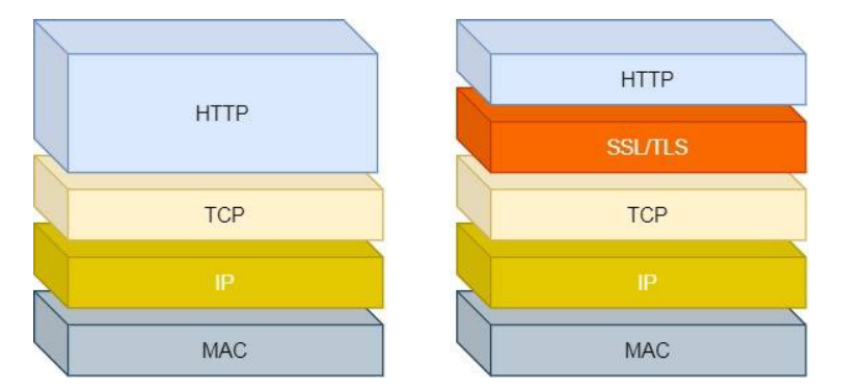
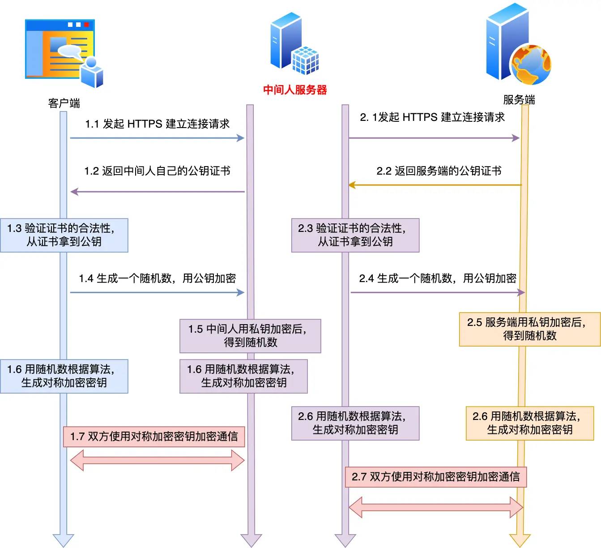

[toc]


## HTTP相关

### HTTP协议的定义

HTTP全称是**H**yper**T**ext **T**ransfer **P**rotocol超文本传输协议，对于这个协议的理解可以分成三部分：协议、传输、超文本

- 协议：首先HTTP是一个应用层协议，它使用了计算机能够理解的语言确立了一种能够在计算机之间交流通信的规范（两个以上的参与者），以及各种相关的控制和错误处理方式
- 传输：这里的传输指的是数据可以从A点传输到B点，也可以从B点传输到A点，是一个双向传输，而且允许A点和B点之间有其他的中转或者接力
- 超文本：超文本的意思就是不仅仅是文本，它可以是文本、图片、视频、超链接等的混合体，HTML就是最常见的超文本，HTML本身只是纯文字文件，但是内部使用了很多标签定义了图片、视频等的链接，在经过浏览器解释，呈现给我们的就是一个有文字和画面的网页了

**<font color=red>综上，HTTP是一个在计算机世界里专门在两点之间传输文本、图片、音频、视频、超链接等超文本数据的约定和规范</font>**

> 那「HTTP 是用于从互联网服务器传输超文本到本地浏览器的协议」，这种说法正确吗？
>
> 这种说法是**不正确**的。因为也可以是「服务器< -- >服务器」，所以采用**两点之间**的描述会更准确。


### HTTP状态码

- `1xx`，表示目前是协议处理的中间过程，属于提示信息，一般不会用到

- `2xx`，提示成功，表示服务器已经收到了报文并且成功处理了

  - `200  OK`，表示一切正常，返回的数据中包含`body`数据
  - `204  No Content`，类似于`200`，只是返回的数据中只有头部，没有`body`
  - `206  Partial Content`，应用于`HTTP`分块下载或者断点续传，表示响应返回的`body`数据只是一部分，不是资源的全部，也是服务器成功处理的状态之一

- `3xx`，表示客户端请求的资源发生了变动，客户端需要修改url重新请求资源，即**重定向**

  - `301  Moved Permanently`，表示永久重定向，请求的资源已经不存在了，需要更换url重新访问
  - `302  Found`，表示临时重定向，说明请求的资源还在，只是暂时需要使用新的url来访问

  > 301 和 302 都会在响应头里使用字段 `Location`，指明后续要跳转的 URL，浏览器会自动重定向新的 URL。

  - `304  Not Modified`，**不具备跳转的含义**，表示客户端请求的资源在本地存在缓存，而且服务端上的资源也没有发生变化，因此304又被称作缓存重定向，用于缓存控制，也就是告诉客户端可以继续使用缓存中的数据

- `4xx`，表示客户端请求出错，服务端无法处理

  - `400  Bad Request`，表示客户端请求出错，是一个比较笼统的错误
  - `403  Forbidden`，表示服务器禁止访问资源，并不是客户端的请求出错了，但是可能是由于客户端的权限不够
  - `404  Not Found`，表示客户端请求的服务器资源没有找到，因此没有办法返回给客户端

- `5xx`，表示客户端的请求没有问题，服务端处理时内部出错

  - `500  Internal Server Error`，和`400`类似，都是一个比较笼统的状态码，表示服务端内部出现问题

  - `501  Not Implemented`，表示客户端请求的功能服务端暂时还没有实现，类似于“敬请期待”

  - `502  Bad Gateway`，通常是服务器作为网关或者代理时返回的状态码，这个状态码表示服务器本身工作正常，但是它的后台服务器却发生了错误

    > 502是由网关服务器返回的，而并不是真正的后台服务器返回的，因为请求可能都没到后台服务器，导致了超时

  - `503  Service Unavaiable`，表示服务器繁忙，暂时无法响应客户端，类似于“服务端正忙，暂时无法提供服务”


### HTTP中常见字段

> host字段


我们通过域名能够解析出IP地址，一台服务器上可以部署多个网站，因此host字段的作用就是**将请求发送到一台服务器上的不同网站**

> Content-length字段

这个字段表示的是服务器本次响应返回的数据的长度


**HTTP 协议通过设置回车符、换行符作为 HTTP header 的边界，通过 Content-Length 字段作为 HTTP body 的边界，这两个方式都是为了解决“粘包”的问题**。


> Connection字段

Connection字段最常应用于客户端要求服务器使用TCP的长连接，以便请求复用


事实上，在HTTP/1.1中默认就是持久连接的，但是为了兼容新版本的HTTP，需要指定首部的`Connection`字段为`keep-alive`，这样一个可以复用的TCP连接就建立了，直到客户端或者服务端主动要求断开


> Accept和Content-Type


`Accept`表示客户端告诉服务器自己能够接受的数据格式

`Content-Type`表示服务器返回给客户端的数据格式


> Accept-Encoding和Content-Encoding


`Accept-Encoding`表示的是客户端告诉服务端自己能够接受怎样的压缩方式

`Content-Encoding`表示的服务端返回的数据使用的是怎样的压缩方式


### GET与POST

Get是向服务器请求资源，这个资源可以是文本、图片、视频等，请求的参数被放在了URL中

Post是向服务器上指定的资源提交数据，数据被放在了请求的报文中

事实上，不管是GET还是POST，他们两个都是HTTP的请求方法，而HTTP是基于TCP/IP协议的，所以GET和POST请求方法的底层也是TCP/IP，因此GET和POST请求都是TCP连接，也就是说给GET加上一个`request body`或者给POST加上一个URL在技术上是可行的，但是由于HTTP的规定和浏览器/服务器的限制，GET和POST在使用过程中表现出一下不同，比如：

- 从语义的角度来看，GET的语义是从服务器获取指定的资源，POST的语义是根据请求负荷（报文body）对指定的资源做出处理
- Get的请求参数一般是放在了URL中，对用户是完全可见的，而POST的请求参数放在了`Request Body`中，但是这也并不能说GET请求的安全性较好，因为HTTP都是明文传输，虽然在浏览器地址栏看不到POST提交的body数据，但是只要抓个包就都能看见了
- Get请求只能够接受URL编码，URL规定只能支持ASCII，所以GET请求的参数只允许ASCII字符，而POST请求能够接受多种编码
- GET请求的参数有长度限制，而POST请求的请求参数没有长度限制
- GET请求会被浏览器主动缓存，而POST不会
- 从安全、幂等的角度来看，GET请求是安全且幂等的，而POST请求是不安全也不幂等的
- ...

**GET和POST还有一个很重要的区别就是使用GET请求会产生一个TCP数据包，使用GET方式浏览器会把`http header + data`一起发送出去，服务器响应200；而是用POST请求会产生两个TCP数据包，最开始发送的是`http header`，当服务器响应了`100 continue`之后，浏览器才会把`data`发送出去，服务器再响应200**


### 安全与幂等

- 在HTTP中，安全指的是请求方法不会破坏服务器上的资源

- 幂等指的是多次相同的操作返回的结果相同

因此，GET操作是安全且幂等的，因为GET操作就相当于查询数据，是一个只读操作，无论他进行多少次，都不会改变服务器上的资源，而且每次结果都相同，但是**POST是不安全且不幂等**的，因为使用POST提交请求会新增/修改服务器上的资源，所以他是不安全的，而多次提交数据就会创建多个不同的资源，因此POST也是不幂等的

```
POST所对应的URI并非创建的资源本身，而是资源的接收者。比如：POST http://www.forum.com/articles的语义是在http://www.forum.com/articles下创建一篇帖子，HTTP响应中应包含帖子的创建状态以及帖子的URI。两次相同的POST请求会在服务器端创建两份资源，它们具有不同的URI；所以，POST方法不具备幂等性。
```


### HTTP缓存技术

对于一些具有重复性的HTTP请求，比如每次请求得到的数据都是一样的，我们可以把这对请求-响应的数据都缓存到本地，那么下次就直接读取本地的数据，不必再通过网络获取服务器的响应了。这其实就是**HTTP的缓存技术**，通过这种方式能够避免发送HTTP请求，从而提高性能，**HTTP缓存的实现有两种方式：强制缓存和协商缓存**。

**强缓存指的是只要浏览器判断缓存没有过期，则直接使用浏览器的本地缓存，是否使用缓存的决定权在于浏览器这边。**

强缓存利用的是**两个HTTP响应头部**字段实现的，它们都用来表示资源在客户端缓存的有效期。

- `Cache-Control`：是一个相对时间
- `Expires`：是一个绝对时间

如果HTTP响应头部同时有`Cache-Control`和`Expires`字段的话，`Cache-Control`的优先级高于`Expires`

`Cache-Control`选项更多一些，设置更加精细，所以建议使用`Cache-Control`来实现强缓存，具体的实现流程如下：

- 当浏览器第一次请求访问服务器资源时，服务器会在返回这个资源的同时，在 Response 头部加上 `Cache-Control`，`Cache-Control` 中设置了过期时间大小；
- 浏览器再次请求访问服务器中的该资源时，会先**通过请求资源的时间与 `Cache-Control` 中设置的过期时间大小，来计算出该资源是否过期**，如果没有，则使用该缓存，否则重新请求服务器；
- 服务器再次收到请求后，会再次更新 `Response` 头部的 `Cache-Control`


**协商缓存指的是通过服务器告知客户端是否可以使用缓存，即与服务端协商之后，通过协商结果来判断是否使用本地缓存**，比如某些请求的响应码是304，这是告诉浏览器可以使用本地缓存的资源

协商缓存的实现需要基于客户端请求和服务端响应的头部中的字段来实现（共两种方式）

1. 请求头部中的 `If-Modified-Since` 字段与响应头部中的 `Last-Modified` 字段实现
   - 响应头部中的`Last-Modified`：响应资源的最后修改时间
   - 请求头部中的`IF-Modified-Since`：当资源过期了，发现响应头中有`Last-Modified`声明，则再次发起请求的时候带上`IF-Modified-Since`的时间，服务器收到请求后发现有`IF-Modified-Since`，则与被请求资源的最后修改时间进行对比（`Last-Modified`），如果最后修改时间比较大（新），则说明资源被修改过，此时返回最新数据；如果最后修改时间比较小（旧），则说明资源无修改，返回状态码304
2. 请求头部中的`If-None-Match`字段与响应头部中的`ETag`字段
   - 响应头部中的`Etag`：唯一标识响应资源
   - 请求头部中的`If-None-Match`：当资源过期时，浏览器发现响应头里有`Etag`，则再次向服务器发起请求时，会将请求头中`Tf-None-Match`值设置为`Etag`的值，服务器收到请求后进行对比，如果资源没有变化返回304，如果资源变化了返回200

**第一种实现方式是基于时间实现的，第二种方式是基于一个唯一标识实现的，相对来说后者可以更加准确的判断文件内容是否被修改，避免由于时间篡改导致的不可靠问题。**

除此之外，`If-Modified-Since`能检查到的粒度是秒级的，而有些文件可能是在秒级以内修改的，使用`Etag`就能够保证在这种需求下客户端能够在1秒内刷新多次，而且服务器还有可能不能精确获取文件的修改时间....基于这些原因，**`Etag`的优先级是要比`If-Modified-Since`优先级高的。**

而且，**协商缓存这两个字段都需要配合强制缓存中 Cache-Control 字段来使用，只有在未能命中强制缓存的时候，才能发起带有协商缓存字段的请求**


### HTTP的特性

HTTP最突出的优点就是简单、灵活和易于扩展、应用广泛和跨平台

- HTTP的简单体现在它的基本报文格式就是`header + body`，头部信息也是`key-value`的形式

- HTTP的灵活和易于扩展体现在HTTP协议中的各类请求方法、URI/URL、状态码、头字段等每个组成要求都没有被固定死，允许开发人员自定义和扩充；同时HTTP由于是工作在应用层，它的下层可以随意变化

  > 比如HTTPS就是在HTTP和TCP层之间增加了`SSL/TLS`安全传输层；HTTP/1.1 和 HTTP/2.0 传输协议使用的是 TCP 协议，而到了 HTTP/3.0 传输协议改用了 UDP 协议。

- HTTP的应用广泛和跨平台体现在日常生活中，从电脑上的浏览器到手机上的各种APP，HTTP应用遍地开花

**HTTP还有两个重要特性，一个是无状态，另一个是明文传输，这两点是一把双刃剑**

- 首先是无状态，无状态的好处是因为浏览器不会去记忆HTTP的状态，这样能够节省资源，使得CPU能够更好地去服务请求，而无状态的坏处在于当进行一些关联操作的时候比较麻烦，比如再进行网上购物时，流程通常是`登录 -> 添加购物车 -> 下单 -> 结算 -> 支付`每一个过程需要验证用户的身份信息，这显然会带来很差的用户体验，对于HTTP无状态的解决方式通常是可以使用Cookie技术，Cookie技术通过在请求和响应报文中写入Cookie信息来控制客户端的状态

  

- 其次是明文传输，明文传输意味着应用数据在传输过程中是易于阅读的，通过浏览器的F12和其他的抓包软件都可以直接看到，方便调试，也正是由于这个特性，HTTP是不安全的，这相当于应用信息在网络中裸奔

其实HTTP最显著的一个特点（缺点）就是**<font color=red>不安全</font>**，原因是：

- 通信使用明文传输，内容可能受到窃听（**窃听风险**）
- 通信过程中不去验证服务端身份，容易遭到伪装，比如假的淘宝网站（**假冒风险**）
- 通信无法验证报文的完整性，内容可能被篡改（**篡改风险**）

> HTTP 的安全问题，可以用 HTTPS 的方式解决，也就是通过引入 SSL/TLS 层，使得在安全上达到了极致


### HTTP/1.1的性能

HTTP协议是基于**TCP/IP**协议的，并且是基于**请求-应答**的模式，所以HTTP/1.1的性能关键就在这两个地方了：

- **首先是长连接**，在HTTP/1.0中，每一次的请求都需要建立一个TCP连接（三次握手），而且是串行请求，这也就导致了很多无谓的连接建立和断开，增加了通信的开销，而在HTTP/1.1中客户端可以通过`Connection`字段请求服务端开始长连接，使多个请求复用一个TCP连接，这样能够避免重复的连接和断开造成的开销，提高网络传输效率

  > 长连接（持久连接）的特点是，只要任意一端没有明确提出断开连接，则保持TCP连接状态，当然，如果某个 HTTP 长连接超过一定时间没有任何数据交互，服务端就会主动断开这个连接。

  

  

- **第二是管道网络传输**，因为HTTP/1.1能够开启长连接，这也使得管道网络传输成为可能，即在同一个TCP连接中客户端发送多个请求，即第一个请求发送出去之后，不需要等待这个请求的响应，第二个请求也可以马上发出去，这样的做法能够减少整体的响应时间

  

  但是服务端是按照先后顺序来处理请求的（**服务器必须按照接收请求的顺序发送对这些管道化请求的响应**），如果前面的请求特别慢，那么后面的请求只能等着，所以HTTP/1.1中存在**队头阻塞问题**，如下图：

  

也就是说，**HTTP/1.1解决了请求的队头阻塞问题，但是没有解决响应的队头阻塞问题**

总之，HTTP/1.1的性能一般，后面的HTTP/2，HTTP/3都是对HTTP协议的不断优化

> 实际上 HTTP/1.1 管道化技术不是默认开启，而且浏览器基本都没有支持，所以**后面讨论 HTTP/1.1 都是建立在没有使用管道化的前提**。


### HTTP/1.1 到 HTTP/2 到HTTP/3的演变历史

#### HTTP/1.1相较于HTTP/1.0的改进之处

- HTTP/1.1中使用了长连接，解决了HTTP/1.0中由于短连接而导致频繁TCP连接的建立与断开造成的性能开销
- HTTP/1.1中使用了管道网络传输，不需要等待请求的响应，只要前一个请求发送成功了，后一个请求就能够发出，这种做法降低了整体的响应时间

#### HTTP/1.1中存在的缺点

- 队头阻塞，可以看出在HTTP/1.1中使用管道网络传输能够发送多个请求给服务器，但是服务器对于请求是按照顺序响应的，如果前一个请求花费的时间过长，则会导致后面的请求迟迟得不到响应
- HTTP/1.1中请求只能从客户端发起，由服务器响应
- 没有请求优先级控制
- 请求和响应的头部没有经过压缩，首部信息越多延迟越大，只能够压缩body部分
- 发送冗余的首部，存在相当一部分请求的头部是相同的，那么每次发送相同的头部肯定会造成资源的浪费


#### HTTP/2相较于HTTP/1.1的改进之处

首先，**HTTP/2是基于HTTPS的了**，在安全性方面有了一定的保证，针对HTTP/1.1中存在的问题，HTTP/2做了如下的优化

- **并发传输，**HTTP/2中引入了`Stream`的概念，多个`Stream`复用在一条TCP连接

  

  从上图中可以看到，一条TCP连接中包含多个`Stream`，`Stream`里面又可以包含1个或者多个`Message`，`Message`对应HTTP/1.1中的请求或响应，由HTTP头部和包体构成，`Message`里面包含一个或者多个`Frame`，`Frame`是HTTP/2的最小单位，以二进制压缩格式存放HTTP/1中的内容（头部和包体）

  **针对不同的 HTTP 请求用独一无二的 Stream ID 来区分，接收端可以通过 Stream ID 有序组装成 HTTP 消息，不同 Stream 的帧是可以乱序发送的，因此可以并发不同的 Stream ，也就是 HTTP/2 可以并行交错地发送请求和响应**。

  > 客户端建立的Stream编号为奇数，服务端建立的Stream编号为偶数，客户端还可以通过指定Stream的优先级来使服务器优先响应

- **服务器推送，**HTTP/2在一定程度上改进了“请求-应答”这个模式，即服务器不再是被动地等待响应客户端的请求，也能够主动地向客户端推送一些信息

  - 比如：在浏览器请求HTML的时候，服务器可能会把JS，CSS等一些静态资源主动地推送给客户端，减少延时的等待，也就是服务器推送（Server Push，也叫Cache Push）

    

- **头部压缩，**HTTP/2会对头部信息进行压缩，如果同时发送多个请求，这些请求的头部类似或者一样，HTTP/2能够通过头部压缩算法来消除这部分的冗余，这个算法是**HPACK算法**：即在客户端和服务端同时维护者一张表，所有的字段都会存入这样表中，然后生成一个索引号，这样就不用发送相同的字段了，能够使用索引号来代替

- **二进制帧，**HTTP/2不再像HTTP/1.1那样传输的是纯文本的明文格式了，而是全面采用二进制格式，头和body都是二进制，统称为帧：头信息帧和数据帧，使用二进制虽然对人不友好，但是计算机处理起来是更快的

  

- **数据流，**HTTP/2中的请求不是按照顺序发送的，所以同一个连接里面相邻的数据包可能是属于不同的请求响应，因此要对每个数据包进行编号，指出它是属于哪个请求/响应 ，每个请求/响应的所有数据包统称为一个数据流，每个数据流都有着自己独一无二的编号，其中规定


#### HTTP/2存在哪些缺点，HTTP/3又是怎样改进的呢

HTTP/2的主要问题在于多个请求复用一个TCP连接，而下层的TCP并不知道这一个连接里面有多少个HTTP请求，所以一旦发生丢包现象，就会触发TCP重传机制，**这条TCP连接里面的所有HTTP请求都会被阻塞，直到丢失的包被重传回来**

**这时基于TCP传输层的问题，所以HTTP/3把HTTP下层的TCP协议换成了UDP**

因为UDP是不管顺序，也不管是否发生了丢包，所以使用UDP既不会有HTTP/1.1中队头阻塞问题，也不会出现HTTP/2中丢包之后所有HTTP请求被阻塞的问题，但是UDP是不可靠的传输层协议，因此出现了QUIC协议，**QUIC协议是基于UDP的，但是能够实现TCP的可靠传输**

- QUIC协议有自己的一套机制可以保证可靠传输，当某个流发生丢包时，只会阻塞这个流，而不会阻塞全部的流
- 在HTTP/3中头部压缩算法由HPACK换成了更好的QPACK，而且TLS从1.2变成了1.3
- HTTPS要建立一次连接，需要花费6次交互，先是建立TCP三次握手，然后是TLS1.3三次握手（TLS1.2是4次握手），QUIC协议直接把以往的TCP和TLS1.3的6次交互合并成了3次，减少了交互次数
- 连接迁移，基于 TCP 传输协议的 HTTP 协议，由于是通过四元组（源 IP、源端口、目的 IP、目的端口）确定一条 TCP 连接，那么**当移动设备的网络从 4G 切换到 WIFI 时，意味着 IP 地址变化了，那么就必须要断开连接，然后重新建立连接**。而 QUIC 协议没有用四元组的方式来“绑定”连接，而是通过**连接 ID** 来标记通信的两个端点，客户端和服务器可以各自选择一组 ID 来标记自己，因此即使移动设备的网络变化后，导致 IP 地址变化了，只要仍保有上下文信息（比如连接 ID、TLS 密钥等），就可以“无缝”地复用原连接，消除重连的成本，没有丝毫卡顿感，达到了**连接迁移**的功能。


所以，QUIC协议是一个基于UDP的伪TCP+TLS+HTTP/2的多路复用协议，QUCI是新协议，有很多设备不知道什么是QUIC，只会把他当成UDP，所以可能会产生一些问题，目前HTTP/3还未普及


### HTTP/1.1是如何优化的

> 协议本身的层面是从HTTP/1.1到HTTP/3，这里说的是一些其他的优化方面

尽量避免发送HTTP请求；在需要发送HTTP请求的时候考虑如何减少请求的次数；减少服务器的HTTP响应的数据大小

#### 避免发送HTTP请求

怎么能够避免发送HTTP请求呢？答案是通过**缓存**，对于一些重复的HTTP请求，其响应是一样的，那么我们可以把`请求url-响应`看作是`key-value`缓存到本地，当发送HTTP请求之前，现在本地缓存中查找一下，如果能够找到，那么就不用再发送请求了


但是上面的缓存存在一个问题：如果服务器上的资源发生了变化，而请求并没有到达服务器，这样就会造成请求的数据和服务器上现在的数据不一致，那么怎么解决这个问题的？答案是给响应设置一个**过期时间**，具体流程为：

- 第一次的请求会被发送到服务端，服务端会在响应数据的头部设置一个字段叫做过期时间，这个过期时间是服务器计算出来的，预估的一个数值，然后客户端会把这个响应数据缓存起来
- 当客户端再次发送相同的请求时，回先查看自己本地的缓存中数据头部的过期时间
  - 如果没有超过过期时间，那么客户端不用在向服务器发送请求，直接使用缓存中的数据就好了
  - 如果超过了过期时间，那么客户端需要向服务端再次发送请求，在请求的头部带上本地缓存中响应数据的摘要`Etag`，这个摘要是本地缓存中数据的唯一标识，服务端收到请求之后，会把自己将要发送的数据和本地缓存中的数据进行比较，如果没有发生变化，那么服务器**仅返回不含有包体的 `304 Not Modified` 响应**，告诉客户端仍然有效，这样就可以减少响应资源在网络中传输的延时，而如果发生了变化，则返回的响应中需要携带上最新的数据


#### 减少发送HTTP请求的次数

##### 减少重定向的次数

服务器上的资源可能由于维护、迁移等原因由url1变成了url2，但是客户端并不知道这种改动，而当客户端通过url1访问时，服务端不能够仅仅简单地返回404，而是应该返回302（临时重定向）和Location头部，告诉客户端服务器的资源已经迁移至url2，于是客户端需要向url2发送请求以获得服务器资源，如下图：


而且客户端和服务端之间往往不是直接相连，中间会存在一台或者多台代理服务器，因此重定向的次数越多，客户端发送的请求次数就越多，越会加重网络的负担

如果代理服务器能够完成重定向的工作，就可以减少HTTP重定向的请求次数了


如果代理服务器知道了重定向的规则，那么就能够进一步减少重定向的请求次数了


如果在重定向过程中返回的是301状态码，那么客户端可以想重定向的结果缓存到本地，以后直接通过发送url2就可以了


##### 合并请求

把多个小请求合并成一个大请求，虽然传输的总资源没有发生变化，但是将多个小请求合并成一个大请求，会**减少发送重复的请求头部**

另外，如果是HTTP/1.1，因为他是请求-响应模式，如果一个请求迟迟未得到响应，那么后面的请求就发不出去（队头阻塞），所以在HTTP/1.1中，为了防止单个请求的阻塞，浏览器一般会同时发送`5~6`个请求，每一个请求都是不同的TCP连接，那么如果合并了请求，也就是会减少TCP连接的数量，也较少了TCP连接握手和慢启动过程的耗时

**合并请求的方式就是合并资源，以一个大资源的请求代替多个小资源的请求，但是这样的合并请求会带来新的问题，如果大资源中的小资源发生了变化，客户端必须重新下载整个的大资源**


##### 延迟发送请求

 ⼀般 HTML 里会含有很多 HTTP 的 URL，当前不需要的资源，我们没必要也获取过来， 于是可以通过 **「按需获取」**的方式，来减少第⼀时间的HTTP 请求次数。 请求网页的时候，没必要把全部资源都获取到，而是只获取当前用户所看到的页面资源，当用户向下滑动页面的时候，再向服务器获取接下来的资源，这样就达到了延迟发送请求的效果。


#### 压缩响应数据的大小

这里特指的HTTP/1.1，因为HTTP/2中有头部压缩算法，而且无论是头部还是数据部分，都被转化成了二进制帧，所以也没有太大压缩的必要，而HTTP/1.1中是没有办法对头部进行压缩的，静态表、动态表、Huffman编码是HTTP/2的内容，所以他可以对响应数据的body进行压缩

压缩方式主要分成了有损压缩和无损压缩

- 无损压缩主要是用在压缩程序源代码、可执行文件、文本文件等

- 有损压缩主要用在视频、图片等，他的压缩效果更好，但是会降低源文件的质量

  > 比如目前常见的webP格式的图片文件，在相同图片质量下，webp的大小是要小于png的


### HTTP/2的厉害之处

首先，我们需要明确的是HTTP/2出现的原因就是来解决HTTP/1.1中存在的问题，那么HTTP/1.1中存在哪些问题呢？

随着站点的增多，消息的大小变大了，页面资源变多了，内容形式变多样了，实时性要求也变高了，这些变化带来的最大性能问题就是HTTP/1.1的高延迟，而且HTTP/1.1中存在的队头阻塞问题，只能够对请求/相应报文中的body进行压缩，而不能够对报文的head进行压缩问题，也是造成高延迟的原因，并且HTTP/1.1中的请求只能从客户端发出，服务器负责响应（请求响应模型）

虽然前面说了一些HTTP/1.1中的优化手段，但是这些优化策略只是从“外部”开始，“治标不治本”。因此，必须重新设计HTTP协议，所以HTTP/2就出来了


#### 兼容HTTP/1.1

我们需要明确一个观点，HTTP/2是对HTTP/1.1的一次优化，HTTP/2的出现是为了提高HTTP/1.1的性能，所以协议的升级一个很重要的地方就在于它必须要**兼容老版本，否则新版本的推广会受到很大的局限**

> 那么HTTP/2是怎么样做到兼容HTTP/1.1的呢？

第一，HTTP/2中没有在URI中引入新的协议名，仍然以`http://`表示明文传输，`https://`表示密文传输，于是只需要客户端和浏览器在背后悄悄的自动升级协议，可以不让用户感受到协议的变化，实现协议的平滑升级

第二，HTTP/2只是在应用层做了改变，它还是基于TCP协议的传输，应用层方面为了保证功能上的兼容，把HTTP/2协议分成了语义层和语法层，**语义层和HTTP/1.1中的保持一致，比如请求方法，状态码，头字段等，而语法层做了较大的变化，基本改变了HTTP传输报文的格式**


#### 头部压缩

我们知道，HTTP的报文是由`header + body`组成的，对于body部分，HTTP/1.1协议可以在头字段中通过执行`Content-Encoding`来指定对body 的压缩方式，比如`gzip`，这样可以用来节约带宽，但是**HTTP/1.1中并没有对header进行压缩**

因此，HTTP/1.1中的数据报文存在以下问题：

- 报文的header中含有很多固定的头字段，比如Cookie,User Agent,Accept等，这些字段加起来也有上百甚至上千字节，所以有必要压缩，有可能body中数据的长度很少，所以传输这样的一个报文明显头重脚轻
- 大量的请求和响应的报文中有很多头字段都是重复的，这样会使得大量的带宽被冗余数据占用，所以有必要避免重复性
- HTTP/1.1的报文是由ASCII码编码的，虽然有利于人类观察，但是计算机处理这样的报文效率低，所以在HTTP/2中把它改成了二进制格式

HTTP/2中没有使用常见的`gzip`等压缩方式来对头部进行压缩，而是采用的**`HPACK`算法**对头部进行压缩，该算法主要有三个部分组成：

- 静态表
- 动态表
- Huffman编码（压缩算法）

**这个算法大致的思路就是在客户端和服务器上共同维护一个字典，通过较小的索引号来代替较长的字段名，然后再使用Huffman编码压缩数据，压缩率能够达到50%-90%**

> **<font color=green size=4pt>静态表编码</font>**

**HTTP/2为频繁出现在头部的字符串和字段建立了一张静态表，共61个，他是被写入到了HTTP/2的框架中的，不会发生变化，**如下图：


表中的`Index`表示索引，`Header Value`表示索引对应的`Value`，`Header Name`表示的是字段的名称，比如`index`为2代表着GET，index为8代表着状态码200

同时我们也可以发现，表中有的`Header Value`处是空着的，这是因为这些字段的值是不确定的，需要根据实际情况来填写，当这个value被填写上之后，会先经过Huffman编码之后才能够发送出去

```shell
# 举例
server: nghttpx\r\n # 共有17个字节， \r是一个字节
使用了静态表和 Huffman 编码，可以将它压缩成 8 字节，压缩率大概 47 %
```

**那么HTTP/2中报文中header的格式是什么样子的呢？**

根据RFC7541规范，<font color=red>如果字段在静态表中，并且value是变化的，那么它的HTTP/2头部前两位是`01`，</font>所以对于某个字段在头部中的格式如下：


由于HTTP/2是使用二进制编码，所以不再需要`\r\n`来分割字符串了，改用字符串的长度`value length`来分割index和value

还是上面`server:nghttp\r\n`，通过抓包可以发现它的二进制编码如下：


- 首先看红色部分，因为server是在静态表中，而且它的value值是变化的，所以前两位是`01`，又因为`server`在静态表中的编号是54，对应的二进制是110110，所以红色部分就是01110110
- 然后第二个字节的第一个比特位表示的是是否经过了Huffman编码，1表示经过了Huffman编码，后面的7位表示数据（value）的长度，比如上图中第二个字节为`10000110`，第一个1表示经过了Huffman编码，后面的`0000110`表示value的长度为6
- 也就是说，`nghttp\r\n`经过Huffman编码之后被压缩成了6个字节，事实上，在HPACK算法中，Huffman编码的原理就是将出现频率较多的字符用较短的编码来表示，从而达到压缩的目的

于是，**在统计大量的 HTTP 头部后，HTTP/2 根据出现频率将 ASCII 码编码成了 Huffman 编码表，**可以 在 RFC7541 文档找到这张静态 Huffman 表，通过查表后，字符串`nghttpx`的Huffman编码在下图看到，共有6个字节，每⼀个字符的 Huffman 编码，我用相同的颜色将他们对应起来了，最后的 7 位是补位的。


所以说，在HTTP/2中报文的头部就是由上面这种格式的二进制数据组成的


> **<font color=green size=4pt>动态表编码</font>**

上面我们提到了静态表中总共就有61个高频出现的字段，那么如果头部中出现了这61个之外的字段怎么办呢？解决方法就是使用动态表，动态表的index从62开始，动态表在编码和解码过程中随时更新

比如第一次发送请求时的`user agent`字段的value有几百个字节，经过Huffman编码之后在客户端和服务端的字典中都会把这个字段以及value更新到自己的动态表中，那么下次在发送这个`user agent`的时候，就不用发送这个字段和它的value了，直接发送一个索引就行了，因为服务器能够通过这个索引直接在它的动态表中找到这个字段对应的value

从上面的过程中也能够看出，**动态表能够生效的前提是：必须是同一个TCP连接，重复传输完全相同的HTTP头部，**如果消息字段在一个连接上只发送了依次或者它的value值总是会发生变化，那么动态表就没办法很好的工作了

因此，随着连接上越来越多的HTTP/2请求，理论上客户端和服务器上最终会维护其一个包含全部字段和value的动态表，理论上最终每个头部字段都会变成 1 个字节的 Index，这样便避免了大量的冗余数据的传输，大大节约了带宽。但是随着请求的增多，动态表也会逐渐增大，占用更多的内存，导致服务器效率降低，因此，web服务器都会提供类似 http2_max_requests 的配置，用于限制一个连接上能够传输的请求数量，避免动态表无限增大，请求数量达到阈值之后，就会关闭HTTP/2的连接（**HTTP连接本质上就是TCP连接**）来释放内存


#### ==二进制帧==

**HTTP/2中一个很棒的改动就是二进制帧，因为他是HTTP/2并发传输的基础**

HTTP/2将HTTP/1.1中的文本传输格式转化成了二进制格式传输数据，极大地提高了HTTP的传输效率，而且使用二进制能够加速HTTP的加解码操作

HTTP/2把响应报文划分成了两个帧（Frame），图中的HEADERS首部和DATA（消息负载）是帧的类型，也就是说**一条HTTP报文，划分成了两个帧来传输，并且采用二进制编码**


> **<font color=red size=4pt>HTTP/2二进制帧的结构</font>**


可以看到，HTTP/2的二进制帧的帧头很小，一共才9个字节：

- 帧的前三个字节表示帧数据的长度

- 帧长度后面的一个字节用来表示帧的类型，HTTP/2共定义了10中不同类型的帧，一般分为数据帧和控制帧，如下

  

  > 从数据帧里面的类型中也可以看出，HTTP报文的header和body是通过不同的帧分开传输的

- 帧类型后面的一个字节是标志位，可以保存8个标志位，用于携带简单的控制信息，比如：

  - END_HEADERS 表示头数据结束标志，相当于 HTTP/1 种header后的空行（“\r\n”） 
  - END_STREAM 表示单方向数据发送结束，后续不会再有数据帧 
  - PRIORITY 表示流的优先级

- 标志位后面的4个字节是流标识符（Stream ID），但是这32位中最高位保留不用，只有31位可以使用，因此流标识符的最大值是`2^31`，大约是21亿，**它的作用是用来标识该Frame属于哪个Stream**，接收方可以根据这个信息从乱序的帧中找到具有相同Stream ID的帧，从而把他们组装起来

- 最后面就是Frame Payload（帧数据），他存放的是通过HPACK算法压缩过的HTTP头部和二进制包体


#### 并发传输

我们知道HTTP/1.1是基于请求-响应模式的，在同一个连接中，HTTP完成一个事务（请求和响应）之后，才能够处理下一个事务，也就是说请求在等待响应的过程中是不能够干其他事情的，如果响应迟迟不来，那么后续的请求是无法发送的，这也就是队头阻塞问题

HTTP/2中通过Stream解决了HTTP/1.1中的队头阻塞，**多个Stream复用一个TCP连接**，达到并发的效果，提高了系统的吞吐量


> 图中 `Stream` 表示多个数据流，它们可以源源不断地并发传送，同一个 `Stream` 流中的 `frame` 数据是串行发送的。 

从上图中可以看出：

- 一个TCP连接中可以有一个或者多个Stream，Stream是HTTP/2能够并发请求的关键技术
- Stream里可以包含一个或者多个message，Message对应的是HTTP/1.1中的请求/响应包，由HTTP头部和包体构成
- Message里面包含一个或者多个frame，frame是HTTP/2中最基本的传输单位，以二进制压缩格式存放HTTP报文的header和body

因此，我们可以得到一个结论：**多个Stream跑在一条TCP连接中，同一个HTTP请求和响应是跑在同一个Stream中，HTTP消息可以由多个Frame构成，一个Frame可以由多个HTTP报文构成。**


在HTTP/2连接上，**不同Stream的帧是可以乱序发送的（因此可以并发不同的Stream）**，因为每个帧的头部会携带Stream ID信息，所以接收端可以通过Stream ID有序组装成HTTP消息，而**同一Stream内部的帧必须是严格有序的**

客户端和服务端双方都可以建立Stream，Stream ID也是有区别的，客户端**建立**的Stream必须是奇数号，而服务器建立的Stream必须是偶数号。**同一个连接中的Stream ID是不能复用的，只能顺序递增**，所以当Stream ID耗尽时，需要发送一个控制帧`GOAWAY`，用来关闭TCP连接

在 Nginx 中，可以通过 `http2_max_concurrent_streams` 配置来设置 Stream 的上限，默认是 128 个。

很显然，**使用HTTP/2通过Stream实现并发要比HTTP/1.1实现并发好很多，因为同样要实现100个并发请求，HTTP/2只需要一个TCP连接就可以并发100个Stream，而HTTP/1.1需要建立100个TCP连接，每个TCP连接都需要经过三次握手，慢启动以及TLS握手等过程，这些过程是非常耗时的**

HTTP/2同样还可以对每个Stream设置不同的优先级，帧头中的标志位可以设置优先级，比如客户端访问HTML/CSS 和图片资源时，希望服务器先传递 HTML/CSS，再传图片，那么就可以通过设置 Stream 的优先级来实现，以此提高用户体验。


#### 服务器主动推送

我们知道在HTTP/1.1中服务器是不会主动推送资源的，因为HTTP/1.1是请求-响应模型，所以只能由客户端发送请求之后，才能够获取到服务器响应的资源

比如。客户端通过HTTP/1.1请求从服务器那里获取到了HTML文件，而HTML文件可能还需要CSS文件来渲染页面，这是客户端还要再发起CSS文件的请求，需要两次消息往返，如下图中的左部分：


如上图中的右部分，在HTTP/2中，客户端在访问HTML时，服务器可以主动推送CSS文件，减少了消息传递的次数

在Nginx中，如果你希望客户端访问/test.html，服务器主动推送/test.css，那么可以这么配置：

```nginx
location /test.html { 
  http2_push /test.css; 
}
```


> 那么服务器推送的原理是什么呢？

我们知道，客户端发送请求时，使用的Stream ID必须是奇数，服务器主动推送发送的Stream ID必须是偶数，在服务器推送资源的时候，会通过`PUSH_PROMISE`帧传输HTTP头部，并通过帧中的`Promised Stream ID`字段告知客户端，接下来会在哪个Stream中发送包体


值得注意的是：服务器在Stream1中通知客户端CSS资源即将到来，然后在Stream2中发送CSS资源，**Stream1和Stream2可以并发**


#### 总结

最后，我们来总结一下HTTP/2的厉害之处，共五个方面：

**第一方面：HTTP/2能够对HTTP/1.1做到向上兼容，**因为HTTP/2的底层协议仍然是TCP，所以他只是在应用层做了功能的升级，解决了HTTP/1.1中的缺陷，为了做到兼容，HTTP/2协议分成了两个部分：语义层和语法层，HTTP/2的语义层和HTTP/1.1没有什么区别，比如头字段、状态码等，而语法层却发生了较大的变化，基本改变了HTTP报文的传输格式；除此之外，HTTP/2中没有引入其他的协议名，仍然是以`http://`表示明文传输，`https://`表示密文传输，其中的改动是由浏览器或者客户端在背后悄悄升级的

**第二方面：HTTP/2中使用了头部压缩算法，**我们知道HTTP/1.1中只能通过有损压缩/无损压缩来压缩body，并不能够对头部进行压缩，而一些报文的请求头有很多的相似之处，这可能会导致带宽压力过大，冗余过多，效率低下，因此HTTP/2中使用HPACK算法（静态表 + 动态表 + Huffman编码）来对头部进行压缩，静态表是写入HTTP/2协议中的，而动态表是会随着请求的增多而不断扩充的，但是动态表不断增大会导致服务器内存占用过多，降低效率，所以在一个TCP连接上会限制请求数量

**第三方面：HTTP/2使用了二进制格式（帧）来传输报文，**HTTP/2改变了HTTP/1.1中的文本传输格式，转而使用二进制格式，这种格式更有利于计算机进行加解码，天然上加快了速度，而且使用二进制帧也为后面的并发传输打下了基础，这里需要注意的一点是，对于一个HTTP报文，是分成了两个二进制帧发出去的，具体我们来看二进制帧的格式：

二进制帧的格式（二进制帧的header部分只有9个字节，分别如下）

- 前三个字节表示帧长度
- 第四个字节表示帧的类型，一般有10种类型，分成两个部分：数据帧和控制帧，数据帧中就包括HTTP header和HTTP body
- 第五个字节是标志位，可以传输一些简单的控制信号，比如终止符、优先级等
- 最后四个字节表示流标识符，即Stream ID，用来区分哪些帧是属于同一个流的，应用于后面的组装，但是这四个字节的第一个bit不用，因此Stream ID的最大值是`2^31`

**第四方面：HTTP/2基于二进制帧实现了Stream并发传输，**使用这种方式能够解决HTTP/1.1的队头阻塞，因为在一个TCP连接里面可以乱序发送（并发）Stream，所以对于请求/响应的顺序并不是按照顺序来的，而且一个Stream中可以包含多个message（对应着HTTP/1.1中的响应/请求），一个message中又可以有多个frame，需要注意的是虽然不同Stream中的帧是可以乱序发送的，但是同一个Stream中的帧必须是严格有序的，Stream ID不能复用，客户端的Stream ID是奇数，服务器的Stream ID是偶数

**第五方面：HTTP/2中的服务器能够实现主动推送，**减少了请求次数


### HTTP/3

HTTP/2中通过引入头部压缩、二进制编码、stream多路复用、服务器主动推送机制解决了HTTP/1.1中的一些问题，大幅度提高了HTTP协议的性能，尤其是HTTP/2通过Stream实现了并发传输，解决了HTTP/1.1中的队头阻塞问题，因为在HTTP/2中请求并不一定是顺序到达服务器的，但是**HTTP/2中存在另一种形式的队头阻塞**，因为HTTP/2是基于TCP协议的，TCP是基于字节流的传输层协议，TCP 层必须保证收到的字节数据是完整且有序的，如果序列号较低的 TCP 段在网络传输中丢失了，即使序列号较高的 TCP 段已经被接收了，应用层也无法从内核中读取到这部分数据，从 HTTP 视角看，就是请求被阻塞了。这就是HTTP/2中的队头阻塞问题

除了队头阻塞问题，HTTP/2中还存在两个问题，分别是：

- TCP和TLS握手延迟
- 网络迁移需要重新连接


#### 队头阻塞问题


图中发送方发送了很多个` Packet`，每个 `Packet` 都有自己的序号，你可以认为是 `TCP `的序列号，其中` Packet 3 `在网络中丢失了，即使 `Packet 4-6 `被接收方收到后，由于内核中的 `TCP `数据不是连续的，于是接收方的应用层就无法从内核中读取到，只有等到 `Packet 3` 重传后，接收方的应用层才可以从内核中读取到数据，这就是` HTTP/2` 的队头阻塞问题，是在 `TCP` 层面发生的。


#### TCP和TLS的握手延迟

当发起HTTP请求时，需要经过TCP三次**握手**和TLS四次**握手**（TLS1.2）的过程，总共需要3个RTT的时延才能发出请求数据；另外由于TCP具有拥塞控制的特性，所以刚建立连接时TCP会有个**慢启动**的过程，他会对TCP连接产生“减速”效果


#### 网络迁移需要重新连接

一个TCP连接是由一个四元组（源IP+目标IP+源端口+目标端口）组成的，这意味着IP地址和端口发生变动，就需要TCP和TLS重新握手建立新的连接，这不利于移动设备切换网络的场景，比如从5G网络切换到WiFi


可以看到，HTTP/2中存在的三个缺点都与底层的TCP协议有关，于是，**HTTP/3**为了解决HTTP/2中存在的这三个问题，做了一个大胆的决定：**将底层的TCP协议换成了UDP，因为UDP不需要连接，也就不没有了握手和挥手的过程，所以天然的就比TCP要快。**


#### QUIC协议

HTTP/3不仅仅是将底层协议简单的从TCP换成了UDP，因为我们知道UDP协议是一个简单、**不可靠**的传输协议，而且UDP包之间是无序的，也没有依赖关系。所以HTTP/3**在UDP协议的基础上在应用层实现了QUIC协议**，它具有类似TCP的连接管理、拥塞窗口、流量控制等网络特性，相当于将不可靠的UDP协议变成**可靠**的了，所以不用担心数据包丢失的问题。

使用QUIC协议就能够解决HTTP/2中的三个问题：

- **无队头阻塞，**QUIC协议中也有HTTP/2中类似于多路复用的概念，也就是在一条TCP连接上可以并发传输多个Stream，一条Stream就可以认为是一条HTTP请求，由于QUIC使用的传输协议是UDP，UDP并不关心数据包的顺序，如果数据包丢失，UDP也不关心，不过QUIC可以保证UDP的可靠性，每一个数据包都有一个序号作为唯一标识，当某条流（Stream）中的数据包丢失了，即使该流的其他数据包已经到达了，数据也无法被HTTP/3读取，直到QUIC重传丢失的报文，数据才会交给HTTP/3

  而其他流的数据只要是被完整接收到，HTTP/3就能够读取到数据。也就是说，HTTP/2中是直接阻塞一条TCP连接上的全部请求，而HTTP/3只是阻塞丢失包的那条Stream对应的请求，而不会影响其他Stream上的请求。

  > **QUIC 连接上的多个 Stream 之间并没有依赖，都是独立的，某个流发生丢包了，只会影响该流，其他流不受影响。**

- **更快的连接建立，**对于HTTP/1.1和HTTP/2协议，**TCP和TLS是分层的，分别属于内核实现的传输层、OpenSSL库实现的表示层**，因此它们难以合并在一起，需要分批次来握手，先TCP，在TLS

  **HTTP/3在传输数据之前虽然需要QUIC协议握手，但这个握手的过程只需要1RTT，握手的目的是为了确认双方的连接ID，而且QUIC协议没有和TLS分层，而是在内部包含了TLS，它在自己的帧中会携带TLS里的“记录”，而且QUIC协议中使用的是TLS 1.3，因此仅需要一个RTT就可以同时完成建立连接与密钥协商，甚至在第二次连接的时候，应用数据包可以和QUIC握手信息（连接信息+TLS信息）一起发送，达到0-RTT的效果**

- **连接迁移**，基于TCP的HTTP/2协议是通过四元组来进行连接的，所以当移动设备从4G网络切换至WiFi的时候，源IP会发生变化，所以当切换网络之后，必须要断开当前的TCP连接，重新建立新的TCP连接，而连接过程中包含了TCP三次握手和TLS四次握手以及TCP的慢启动等过程，给用户的感觉就是切换网络之后会卡顿一下

  而QUIC协议没有使用四元组来表示连接，他是使用的连接id来表示连接的两个端点，**客户端和服务器可以各选一组id来标识自己**，因此即使移动设备的IP地址发生了变化，连接也不用中断，只要保留了本次连接的上下文信息（TLS密钥、连接id等）就能够恢复通信，复用原连接，消除重连的成本，达到连接迁移的效果


#### HTTP协议本身的修改

HTTP/3基于QUIC协议，从HTTP协议的本身，HTTP/3中也做出了一些修改

- 首先，HTTP/3和HTTP/2一样采用二进制的结构，不同的地方在于HTTP/2的二进制帧中需要定义Stream，而HTTP/3本身不再需要定义Stream，直接使用QUIC协议中的Stream，于是HTTP/3中的帧结构也变简单了：帧头只有两个字段，类型和长度；根据帧类型的不同，大体上分为数据帧和控制帧两大类，Headers 帧（HTTP 头部）和 DATA 帧（HTTP 包体）属于数据帧。

  > Stream ID被移动到QUIC协议中的QUIC HEADER中存储


- HTTP/3在头部压缩算法这一方面也进行了升级，从HPACK升级成了QPACK，与HPACK类似，QPACK也采用了静态表、动态表、Huffman编码的方式来做头部压缩，不同的是，静态表的大小从HPACK中的61项扩大到了QPACK中的91项。

  除此之外，这里提出一个问题：**我们直到动态表是具有时序性的，如果首次出现的请求发生了丢包，后续收到的请求，对方就无法解码出HPACK头部，因为对方还没有建立好动态表，因此后续的请求解码会阻塞到首次请求中丢失的数据包重传回来**

  **QPACK通过两个特殊的单向流来同步双方的动态表，编码方收到解码方更新确认的通知后，才使用动态表编码HTTP头部**，具体地：

  - `QPACK Encoder Stream`：用于将一个字典传递给对方，比如面对不属于静态表的HTTP请求头部，客户端可以通过这个Stream发送字典
  - `QPACK Decoder Stream`：用于响应对方，告诉它刚发的字典已经更新到自己的本地动态表了，后续就可以使用这个字典来编码了


## HTTPS 相关

### HTTP和HTTPS的区别

- HTTP是超文本传输协议，使用明文传输，存在安全问题，而HTTPS则解决了HTTP中的安全缺陷，具体解决办法是通过在HTTP和TCP层之间加上了一层SSL/TLS层，能够对传输报文进行加密、验证服务器身份，并对报文进行完整性检查
- HTTP在TCP三次握手完成之后，便可以进行HTTP报文的传输了，而HTTPS在TCP三次握手之后，还需要进行TLS/SSL的握手过程，才能够进行加密传输
- HTTP的开放的端口号是80，HTTPS开放的端口号是443
- HTTPS需要向CA申请数据证书，来验证服务器的身份是否可靠


### HTTPS做了哪些改进

在前面提到了由于HTTP的明文传输，导致HTTP协议存在三个安全风险，分别是：

- 窃听风险：因为报文是明文的，所以很容易就被监听
- 篡改风险：HTTP没有对报文进行完整性检查，所以很容易受到攻击者的篡改
- 假冒风险：HTTP没有对服务器的身份进行验证，所以可能会存在假冒风险，比如假的淘宝网站

那么HTTPS就是通过在HTTP和TCP之间加入了SSL/TLS层解决了上面的三个安全问题



那么HTTPS是如何通过加了一层SSL/TLS解决了上面的三个风险的呢？

- 首先，通过**混合加密**的方式来对通信内容进行加密，解决了由明文传输带来的窃听风险

  > 混合加密就是使用非对称加密交换客户端和服务端的密钥，使用对称加密来对通信报文进行加密，使用混合加密的原因在于对称加密运算速度快，但是只有一个密钥，因此需要保证密钥的安全性；而非对称加密有两个密钥，公钥可以随意分发而私钥保密，所以使用非对称加密能够解决密钥交换问题

- 第二，通过**摘要算法 + 数字签名**的方式来对HTTP报文进行完整性检查，解决了篡改风险

  > 通过摘要算法（哈希函数）来计算出内容的哈希值，通过哈希算法可以确保内容不会被篡改，但是并**不能保证内容+哈希值不会被中间人替换，因为这里缺少了对客户端收到的信息是否来源于服务端的证明。**
  >
  > 计算机中使用了非对称加密算法来解决上面的这个问题
  >
  > **通过私钥加密、公钥解密来确认消息的身份**，这也是我们常说的数字签名算法，不过这里私钥加密的对象不是内容本身，而是内容的哈希值。一般我们不会用非对称加密来加密实际的传输内容，因为非对称加密的计算比较耗费性能的。
  >
  > 注意，这里对于内容+数字签名的加密是通过协商出来的密钥进行的对称加密
  >
  >  

- 第三，通过**数字证书**的方式来对服务器身份进行校验，解决了假冒风险

  > 前面通过数字签名算法验证了消息的来源，但是中间人攻击中可以自己伪造出一对公私钥，因此这里还需要数字证书，因为数字证书的公钥被注册到了CA（数字验证中心），不会被篡改，
  >
  > 如何保证服务端的公钥的信任度和不被篡改呢？这里就需要借助第三方的权威认证机构CA（数字认证中心），将服务器公钥放在数字证书（由CA颁发）中，只要证书是可信的，公钥就是可信的
  >
  > 

 

> 后面再详细讲解HTTPS和HTTP是如何建立建立的


### HTTPS的应用数据是如何保证完整性的

TLS在实现上分为**握手协议**和**记录协议**两层

- `TLS`握手协议就是我们说的四次握手过程，负责协商加密算法和生成对称密钥，后续用此密钥来保护应用程序数据
- `TLS`记录协议负责保护应用程序数据并验证其完整性和来源，所以对HTTP数据加密使用的是记录协议

TLS记录协议主要负责消息（HTTP数据）的压缩，加密以及数据的认证，过程如下图所示：


- 首先，消息被分割成多个较短的片段，然后分别对每个片段进行压缩

  > 记录协议将信息块分割成携带$ 2^{14} $字节 (16KB) 或更小块的数据的 `TLSPlaintext` 记录

- 接下来，经过压缩的片段会被加上消息认证码（MAC值，这个是通过哈希算法生成的），这是为了保证完整性，并进行数据的认证。通过附加消息认证码的MAC值，可以识别出篡改。与此同时，为了防止重放攻击，在计算消息认证码时，还加上了片段的编码

- 在接下来，经过压缩的片段再加上消息认证码会一起通过对称密码进行加密

- 最后，上述经过加密的数据再加上由数据类型、版本号、压缩后的长度组成的报头就是最终的保文数据

记录协议完成后，最终的报文数据将传递到TCP层进行传输

> 详情见：[理解SSL/TLS系列](https://blog.csdn.net/zhanyiwp/article/details/105627799)


### HTTPS一定安全可靠吗

客户端通过浏览器向服务端发起HTTPS请求时，被假基站转发到了一个中间人服务器，于是客户端是和中间人服务器完成了TLS握手，然后这个中间人服务器在于真正的服务器完成TLS握手




从客户端的角度来看，其实并不知道网络中存在中间人这个角色，那么中间人就可以解密HTTPS请求里的数据，也可以解开服务端响应给浏览器HTTPS请求的响应数据，相当于中间人能够 “偷看” 浏览器与服务端之间的 HTTPS 请求和响应的数据。

从这个角度来看，HTTPS确实不能保证一定的可靠性，但实际上，上述情况的发生有一个**前提，那就是用户接受了中间人服务器的证书**

因为中间人服务器在于客户端进行TLS握手的过程中，实际上是发送了自己伪造的证书给客户端的，而这个伪造的证书其实是能够被客户端识别出来是非法的，会有相应的提醒。


如果用户执意点击「继续浏览此网站」，相当于用户接受了中间人伪造的证书，那么后续整个 HTTPS 通信都能被中间人监听了。

所以，**这其实并不能说 HTTPS 不够安全，毕竟浏览器都已经提示证书有问题了，如果用户坚决要访问，那不能怪 HTTPS** 

另外，还有一种情况那就是电脑被病毒植入了中间人服务器的根证书，那么在验证中间人服务器的时候，由于操作系统是信任中间人服务器的根证书的，那么就等同于中间人是可信的，这种情况下是不会弹出风险提醒的。这其实也是不关HTTPS的事情的。

所以，HTTPS协议本身到目前为止还是没有任何漏洞的，即使成功进行了中间人攻击，本质上也是利用了客户端的漏洞（信任了危险证书或者是被恶意植入伪造的根证书），并不是HTTPS本身不够安全

HTTPS相较于HTTP就是多了一层`SSL/TLS`层，如下图


HTTPS就是通过`SSL/TLS`这一层解决了HTTP中存在的三个问题：窃听风险、假冒风险、篡改风险，而且HTTP在TCP三次握手之后就能够开始进行明文通信了，而HTTPS需要在TCP三次握手之后，在等`SSL/TLS`握手之后才能够进行加密通信

> TLS的全称 Transport Layer Security，安全传输层协议

### HTTPS RSA 握手解析

接下来，来看一下`SSL/TLS`的握手过程


上图简要概述了TLS握手的过程，每一个框都表示一条记录（record），类似于TCP中的`segment`，**记录是TLS收发数据的基本单位**，多个记录可以组成一个TCP包发送，所以通常需要经过四次TLS握手，2个RTT的时延，然后就能够在安全的通信环境里面进行加密通信了

**事实上，不同的密钥交换算法，TLS握手过程可能会有一些不同**

TLS中的密钥交换算法，考虑到加密通信的性能问题，在加密过程中通过对称加密算法，而对称加密算法的密钥是不能够被泄露的，因此为了保证密钥的安全性，使用非对称加密算法对密钥进行保护，这个工作就是由密钥交换算法来完成的

TLS握手的具体过程

- **<font color=red>第一次握手</font>**

  客户端发送`ClientHello`，具体包含**客户端使用的TLS版本号**，**客户端支持的密码套件列表**以及**客户端产生的一个随机数`Client-Random`**，将这些信息发送到服务器，上面的这个随机数将会被服务端保留，用于后面的会话密钥制作

  

- **<font color=red>第二次握手</font>**

  第二次握手的过程比较多，可以分为`ServerHello`，`Certificate`，`ServerHelloDone`三个子流程

  - 首先是`ServerHello`，这一个过程中服务器会根据客户端发送过来的信息进行处理，首先确认TLS的版本，看看自己是否支持，然后他也会产生一个随机数`Server-Random`，最后他会在客户端支持的密码套件列表中选择出一个密码套件用于后续工作

    

    基本的形式是「**密钥交换算法 + 签名算法 + 对称加密算法 + 摘要算法**」， 一般 WITH 单词前面有两个单词，第一个单词是约定密钥交换的算法，第二个单词是约定证书的验证算法。比如刚才的密码套件的意思就是：

    - 由于 WITH 单词只有一个 RSA，则说明握手时密钥交换算法和签名算法都是使用 RSA；
    - 握手后的通信使用 AES 对称算法，密钥长度 128 位，分组模式是 GCM；
    - 摘要算法 SHA256 用于消息认证和产生随机数；

    

  - 然后为了证明自己的身份，会发送`Server Certificate`给客户端，这个消息里面含有数字证书。

    

  - 随后，服务器会发送`Server Hello Done`，表示服务器将应该发送给客户端的数据都发送过去了，第二次握手结束

    

    

    **可以看出，当TLS第一次和第二次握手结束之后，客户端和服务端确定了TLS的版本，并且都知道了后续应该使用什么密码套件来进行工作，而且都有了两个随机数**

    > 前两次握手产生的信息都是明文

    
    
    **第二次握手中涉及到一个问题：当服务器将数字证书发送过去之后，客户端是怎样验证的呢？**
    
    首先，数字证书中包含很多信息，比如公钥、持有者信息，证书认证机构（CA，*Certificate Authority*）的信息，证书有效期，*CA对这份文件签名使用的算法*等，**数字证书的作用就是用来验证公钥持有者的身份，以防止第三方冒充**，在这里面就是用来让客户端验证服务器是否可信，那么证书是怎么来的，又该怎么验证证书呢？为了让服务端的公钥被大家信任，服务端的证书都是由CA签发的，CA就是网络世界里的公证中心，具有极高的可信度，所以由它来给各个公钥签名，CA是值得被信任的，所以其签发的证书也是被信任的
    
    > 之所以要签名，是因为签名的作用可以避免中间人在获取证书时对证书内容的篡改
    
    
    
    CA 签发证书的过程，如上图左边部分：
    
    - 首先 CA 会把持有者的公钥、用途、颁发者、有效时间等信息打成一个包，然后对这些信息进行 Hash 计算，得到一个 Hash 值；
    - 然后 CA 会使用自己的私钥将该 Hash 值加密，生成 Certificate Signature，也就是 CA 对证书做了签名；
    - *最后将 Certificate Signature 添加在文件证书上，形成数字证书；*
    
    客户端校验服务端的数字证书的过程，如上图右边部分：
    
    - 首先客户端会使用同样的 Hash 算法获取该证书的 Hash 值 H1；（Hash算法是数字证书的内容之一）
    
    - 通常浏览器和操作系统中集成了 CA 的公钥信息，浏览器收到证书后可以使用 CA 的公钥解密 Certificate Signature 内容，得到一个 Hash 值 H2 ；
    
    - 最后比较 H1 和 H2，如果值相同，则为可信赖的证书，否则则认为证书不可信
    
      
    
    上面是从理论层面说明了为什么数字证书能够证明服务端的身份，但事实上，证书的验证过程中还存在一个证书信任链的问题，因为我们向CA申请的证书一般不是根证书签发的，而是由中间证书签发的，比如百度的证书，从下图中可以看到证书的层级有三级：
    
    
    
    对于这种三级层级关系的证书的验证过程如下：
    
    - 客户端收到` baidu.com `的证书后，发现这个证书的签发者不是根证书，就无法根据本地已有的根证书中的公钥去验证 `baidu.com` 证书是否可信。于是，客户端根据 `baidu.com` 证书中的签发者，找到该证书的颁发机构是 `“GlobalSign Organization Validation CA - SHA256 - G2”`，然后向 CA 请求该中间证书。
    - 请求到证书后发现` “GlobalSign Organization Validation CA - SHA256 - G2”` 证书是由 `“GlobalSign Root CA”` 签发的，由于 `“GlobalSign Root CA”` 没有再上级签发机构，说明它是根证书，也就是自签证书。应用软件会检查此证书有否已预载于根证书清单上，如果有，则可以利用根证书中的公钥去验证 `“GlobalSign Organization Validation CA - SHA256 - G2”` 证书，如果发现验证通过，就认为该中间证书是可信的。
    - `“GlobalSign Organization Validation CA - SHA256 - G2”` 证书被信任后，可以使用` “GlobalSign Organization Validation CA - SHA256 - G2” `证书中的公钥去验证 `baidu.com` 证书的可信性，如果验证通过，就可以信任 `baidu.com` 证书。
    
    
    
    这里其实还有一个问题，为什么证书链验证这么麻烦，Root CA不直接颁发证书，而是要搞这么多的中间层级呢？
    
    **这是为了保证根证书的绝对安全性，将根证书隔离的越严格越好，不然根证书如果失守了，那么整个信任链都会出问题。**

  

- **<font color=red>第三次握手</font>**

  **第三次握手发生在客户端校验完成服务器数字证书之后**，紧接着客户端会产生另外一个新的随机数，叫做`pre-master`，接着用服务器的RSA公钥加密这个随机数，通过`Client Key Exchange`这条记录将这个随机数发送给服务端

  

  服务器收到之后，会使用RSA私钥解密这个随机数

  **三次握手成功之后，客户端和服务端双方都拥有了三个随机数，分别是Client-Random,Server-Random,pre-master，于是双方会根据这三个随机数生成<font color=red>会话密钥（Master Secret）</font>，他是对称密钥，用于后续的加密通信**

  生成完会话密钥之后，客户端又会产生一个记录，名为`change Ciper Spec`，**通知服务端后续将使用上面的会话密钥进行通信了**

  

  最后客户端会发一个`Encrypted Handshake Message`消息，把之前发过去的全部信息做个摘要，在**使用会话密钥加密**一下，让服务器做个验证，验证加密通信是否可用和之前的握手信息是否有被中途篡改过。

  

- **<font color=red>第四次握手</font>**

  服务器也是同样的操作，发「**Change Cipher Spec**」和「**Encrypted Handshake Message**」消息，如果双方都验证加密和解密没问题，那么握手正式完成。
  
  最后，就用「会话密钥」加解密 HTTP 请求和响应了


### HTTPS ECDHE 握手解析

上面我描述的TLS握手过程是使用RSA作为密钥交换算法的，但是**RSA不具备前向安全性**，也就是说当服务器上的RSA私钥被泄露之后，会话密钥（Master Secret）就会被攻击者获得，然后客户端和服务器之间的全部的加密通信信息都会被其破解

> 这里从DH算法开始，到ECDHE算法的演化过程，期间做出了哪些改变

为了解决上述问题就有了DH密钥交换算法，流程如下：


DH算法中密钥的交换方式如下

```
先假设小红和小明约定使用DH算法来交换密钥，那么基于离散对数，小红和小明需要先确定模数和底数作为算法的参数，这个参数是公开的，用P和G来代表
```

然后小红和小明各自生成一个随机数作为私钥，双方的私钥需要保密管理，不能够泄露，小红的私钥用a代称，小明的私钥用b代称，然后小红和小明双方都有了`P,G,以及各自的私钥`，于是就可以计算出公钥

- 小红的公钥记为A，$A=G^a(mod \quad p)$
- 小明的公钥记为B，$B=G^b(mod \quad p)$

A和B也是公开的，因为根据离散对数的原理，从真数AB反向计算对数ab是十分困难的，至少在现有计算机水平上是破解不出来的

双方交换各自的DH公钥后，手上都分别有五个参数：`P,G,A,B,以及各自的私钥`，然后小红和小明可以分别进行计算

- 小红执行运算 $B^a(mod \quad p)$，其结果为`K`
- 小明执行运算$A^b(mod \quad p)$，因为离散对数的幂运算有交换律，所以其结果也是为`K`

**这个`K`就是小红与小明之间通信的对称加密密钥，可以作为会话密钥使用**

可以看到，整个密钥协商过程中，小红和小明公开了 4 个信息：P、G、A、B，其中 P、G 是算法的参数，A 和 B 是公钥，而a、b 是双⽅各⾃保管的私钥，⿊客无法获取这 2 个私钥，因此⿊客只能从公开的 P、G、A、B 入手， 计算出离散对数（私钥）。
 根据**离散对数**的原理，如果 P 是⼀大数，在现有的计算机的计算能力是很难破解出私钥 a、b的，破解不出私钥，也就⽆法计算出会话密钥，因此 DH 密钥交换是安全的。


事实上，根据私钥生成的方式，DH算法又可以分成两种

- static DH算法，现在已经被废弃
- DHE算法，目前常用

在static DH算法中固定了一方的私钥，通常保持不变的是服务器的私钥，这种情况下，随着时间的延长，黑客可能会获得大量的加密数据，因为在DH算法中，公钥等一些参数是公开的，所以黑客可能会通过暴力破解的方式得到服务器的私钥，得到服务器的私钥之后，就能够知道会话密钥了，之前截获的加密通信就都能够被破解出来了，所以**static DH算法也是不具有前向安全性的**

而后面的DHE算法，其中的E表示的就是ephemeral（临时性的），既然固定一方的私钥有被破解的风险，那么干脆就让双方的私钥在每次密钥交换通信时，都是随机生成的、临时的，这个方式也就是 DHE 算法，E 全称是 ephemeral（临时性的）。

所以，即使有个黑客破解了某⼀次通信过程的私钥，其他通信过程的私钥仍然是安全的，因为每个通信过程的私钥都是没有任何关系的，都是独立的，这样就保证了「前向安全」。


从上面的过程中，可以看出，DHE算法虽然能够保证前向安全性，但是在计算过程中有大量的乘法运算，也就是说它的效率不佳，所以为了提高效率，后面又提出了ECDHE算法，这个算法在现在也是被广泛使用，**ECDHE算法就是在DHE算法的基础上利用椭圆曲线的特性，用更少的计算量算出公钥，以及最终的会话密钥**


使用ECDHE算法的握手过程

- **第一次握手：**和RSA算法一样，第一次握手还是`Client Hello`，向服务器发送自己的TLS版本，生成的一个随机数（client-random）以及支持的密码套件列表

  

  

- **第二次握手：** *这此握手中，会比RSA中多出一个`Server key Exchange`*

  - 服务器收到客户端的 Client Hello 之后需要进行回复，返回 Server Hello 消 息，消息里面有服务器确认的TLS版本，也会随即给出一个随机数（Server Random），然后从客户端的密码套件列表中选择一个合适的密码套件

    

  - 接着服务器端为了证明自己的身份，发送`certificate`消息，会把证书也发给客户端

    

  - 如果是在RSA中，接下来就是发送`Server Hello Done`了，但是使用EDCHE密钥交换算法，**在`Server Hello Done`前面还有一步就是`Server Key Exchange`，这个过程服务器做了三件事情**

    - 第一件事情：选择了名为`named_curve`的椭圆曲线，选择好了椭圆曲线相当于椭圆曲线基点 G 也定好了（在ECDHE中就是根据这个基点算出私钥对应的公钥），这些都会公开给客户端
    - 第二件事情：生成一个随机数作为服务器端的椭圆曲线的私钥，保存在服务器本地
    - 第三件事情：根据上面的椭圆曲线和基点G算出私钥对应的公钥，将这个公钥发送给客户端

    

    同时，为了保证发送给客户端的公钥不被篡改，ECDHE算法中还使用了RSA算法对其进行加密，以便进行完整性校验

    至此，使用ECDHE密钥协商算法的第二次握手就结束了，服务器发送`Server Hello Done`，表示自己想要发送的数据都给客户端了，打招呼完毕

    

    

  **可以发现，第二次握手结束之后，客户端和服务端双方共享了一些数据，包括：client-random，server-random，还有服务端椭圆曲线的公钥，使用的椭圆曲线以及基点G**，其实和RSA大同小异，因为使用RSA在第二次握手结束之后，双方共享的client-random,server-random，以及后续生成对称密钥要使用的算法

- **第三次握手：**客户端收到了服务端的证书后，自然是要先校验证书是否合法，如果证书合法，那么 服务端到身份就是没问题的。校验 证书到过程，会走证书链逐级验证，确认证书的真实性，再⽤证书的公钥验证签名，这样就能确认服务端的身份了，确认无误后，就可以继续往下走。

  随后，客户端会产生一个随机数来作为自己的私钥，然后通过选出来的椭圆曲线和基点G计算出一个公钥，把这个公钥发送给服务器，这一部分叫做`Client key Exchange`

  

  ```shell
  # 至此，客户端和服务器共享的数据有：client-random,server-random,分别使用椭圆曲线计算出来的公钥，椭圆曲线，基点G，于是双方会根据`对方的椭圆曲线公钥 + 自己的椭圆曲线私钥 + 基点G`计算出一个密钥（记作x），在ECDHE算法原理中，计算出来的这个密钥就被作为最后的密钥了，但是在实际应用中，这个密钥并不会被作为最终的密钥，因为TLS设计者并不信任客户端和服务器端伪随机数的可靠性，所以最后的会话密钥是`client-random + server-random + x`，这样做虽然也保证不了完全的随机，但是三个伪随机数的组合，随机程度也就很高了
  ```

  算好会话密钥之后，客户端会向服务器发送`Change Cipher Spec`消息，告诉服务器后续会使用这个会话密钥进行通信了

  接着，客户端会发 「Encrypted Handshake Message」 消息，把之前发送的数据做⼀个摘要，再 用对称密钥加密 ⼀下，让服务端做个验证，验证下本次生成的对称密钥是否可以正常使用

  

- **TLS第四次握手，**最后服务端也会进行相同的操作 change ciper spec 和 encrypted handshake message 消息，如果双方都验证加密和解密没有问题，那么握手完成，于是就可以正常收发加密的 HTTP请求和响应了


综上，可以总结一下使用RSA和ECDHE密钥协商交换算法握手过程的不同之处

- RSA算法不支持前向安全性，而ECDHE算法具备前向安全性

- 使用ECDHE密钥协商算法，TLS第二次握手过程中会多一个`server key exchange`，表示把服务器椭圆曲线公钥发送给客户端

- 使用了RSA密钥协商算法，TLS完成四次握手之后才可以进行应用数据加密传输，而**对于ECDHE算法，客户端可以不用等服务端最后一次TLS握手，就可以提前发出加密的HTTP数据，**节省了一个消息的往返时间

  

所以，**ECDHE算法相对于RSA算法的握手过程省去了一个消息往返的时间，这个有点抢跑的意思，它被称作是`TLS FALSE START`，**类似于`TCP FAST OPEN`，都是在连接还没有完全建立之前，就发送了应用数据，这样便提高了数据的传输效率


### HTTPS如何优化

#### 分析性能损耗

首先，在分析HTTPS有哪些方面可以优化的时候，我们先要来看一下HTTPS相较于HTTP在哪些方面存在性能开销

- **SSL/TLS握手阶段的开销**
- **握手后，对称加密报文的传输**

针对握手之后通信报文的加密，现在主流的AES，ChaCha20性能都是非常不错的了，而且一些CPU厂商还针对这个方面在硬件层面做了优化，因此这个环节的损耗比较小

所以性能开销主要集中在SSL/TLS握手阶段，TLS握手过程不仅增加了网络时延（2RTT），而且握手过程中的一些步骤也会产生性能损耗，比如：

- 对于ECDHE算法而言，握手过程中客户端和服务端都要临时生成椭圆曲线的公私钥
- 客户端在验证服务器的数据证书的时候，会访问CA的CRL或者OCSP，目的是验证服务器证书有没有被吊销
- 最后生成会话密钥的时候（pre-master），也是需要经过计算


> **<font color=red>那么HTTPS到底可以从那几个方面进行优化呢？</font>**


### 硬件优化

因为HTTPS是计算密集型，不是I/O密集型，所以我们应该针对CPU进行优化，而不是对网卡、硬盘等设备进行优化

一个好的CPU可以提高计算性能，因为HTTPS在连接过程中存在大量的计算过程，而且，我们在选择CPU的时候，尽量**选择支持`AES-NI`特性的CPU**，因为这种款式的CPU在指令级别优化了AES算法，所以能够加速数据通信过程中的加解密

```shell
# 如果服务器是linux，那么可以使用以下指令查看cpu是否支持AES-NI指令集
sort -u /proc/crypto |grep module |grep aes
```


### 软件优化

对于软件优化，我们可以把旧版本的软件升级成新版本的，因为新版本的软件通常会对旧版本做一些优化同时修复一些bug，调整一些功能等，比如将Linux2.x升级成Linux4.x ... ，因为新版本的软件不仅会提供新的特性还会修复老版本中存在的问题等

但是软件升级和硬件优化一样，是属于一个“牵一发而动全身“的大工程，因此这两种优化不仅会消耗大量的人力物力，还有可能会造成出现一些不必要的麻烦，影响产品上线


### 协议优化

在对HTTPS的优化中，对于协议的优化其实就是对于密钥交换过程的优化，可以分成下面的两个部分

#### 密钥交换算法的优化

对于密钥交换算法，我们尽量选择ECDHE，因为在TLS 1.2中，RSA需要4次握手，2RTT才能够进行后续的通信加密，而且RSA密钥协商算法不具备前向安全性，而使用ECDHE密钥协商算法，不仅能够保证前向安全性，还支持*TLS False Start*，在第三次握手完成之后，第四次握手之前就能够发送数据，即抢跑，1个RTT之后就能够进行加密通信了

值得注意的是，即使选择了ECDHE算法，不同的椭圆曲线之间也存在性能差异，应该尽量选择`x25519`椭圆曲线，因为这个曲线是目前最快的了。比如在 Nginx 上，可以使⽤` ssl_ecdh_curve` 指令配置想使用的椭圆曲线，把优先使用的放在前面

> 对于对称加密密钥方面，如果系统对于安全性的要求不是很高的话，我们可以使用AES_128_GCM,，而不是使用AES_256_GCM，因为密钥短的计算更快。比如在 Nginx 上，可以使用` ssl_ciphers` 指令配置想使用的非对称加密算法和对称加密算法，也就是密钥套件，⽽且把性能最快最安全的算法放在最前面


#### TLS协议升级


可以看到，TLS需要经过4次握手，2RTT才能够进行加密通信，先要通过 Client Hello 和 Server Hello 两次握手交换双方产生的随机数以及协商出后续使用的加密算法，再互相交换公钥（客户端产生的第三个随机数），最后计算出通信需要的会话密钥

而TLS1.3只需要进行2次握手，1RTT便能够进行加密通信了，具体做法是：客户端在`client Hello`记录中带上了支持的椭圆曲线以及这些椭圆曲线对应的公钥，服务器会选定一个椭圆曲线作为参数，同时再返回消息时带上自己的证书信息，以及服务器这边的公钥，因此，在两次握手之后（1RTT），客户端和服务器都分别拥有了可以合成会话密钥的材料，于是客户端计算出会话密钥之后便可以开始进行加密通信了

>  **TLS 1.3 把 Hello 和公钥交换这两个消息合并成了一个消息，于是这样就减少到只需 1 RTT 就能完成 TLS 握手**


除此之外，TLS1.3还对支持的密码套件进行了删减，废除了不支持前向安全性的RSA和DH算法，只支持ECDHE算法，对于对称加密和签名算法，只支持目前最安全的几种，如下：

- TLS_AES_256_GCM_SHA384 
- TLS_CHACHA20_POLY1305_SHA256 
- TLS_AES_128_GCM_SHA256 
- TLS_AES_128_CCM_8_SHA256 
- TLS_AES_128_CCM_SHA256

TLS之所以支持这么少的密码套件是因为TLS1.2由于支持各种古老且不安全的密码套件，中间人可以利用*降级攻击*，伪造客户端的 Client Hello 消息，替换客户端支持的密码套件为一些不安全的密码套件，使得服务器被迫使用这个不安全的密码套件进行HTTPS连接，从而破解密文


TLSv1.3 还有个更厉害到地方在于**会话恢复**机制，在**重连 TLvS1.3 只需要 0-RTT**


1. 初始连接握手（Full Handshake）：在初始连接中，客户端和服务器之间执行完整的TLS握手过程，包括交换密钥、协商加密算法、进行身份验证等步骤。一旦连接建立成功，双方会生成一个用于后续会话恢复的会话标识符（session identifier）和会话密钥。
2. 会话恢复握手（0-RTT Handshake）：在下一次连接时，客户端可以使用之前建立的会话标识符和会话密钥来进行会话恢复握手。客户端可以发送预先加密的数据，称为"Early Data"（早期数据），以实现快速恢复会话。服务器可以验证会话标识符和会话密钥，并尝试恢复会话。
3. 服务器验证和握手确认：服务器验证会话标识符和会话密钥的有效性。如果验证成功，服务器可以使用之前建立的会话参数，如密钥材料和加密上下文，来快速恢复会话。服务器发送握手确认给客户端，表示会话恢复成功。


### 证书优化

为了验证服务器的身份，客户端和服务器在进行TLS握手过程中（第二次握手的过程中），服务器会把自己的数字证书发送给客户端，然后客户端通过这个数字证书来验证服务器的身份，对于证书的优化可以分成两个部分：

- 一个是证书传输过程中的优化
- 另一个是证书验证过程的优化

首先，想要**优化证书在传输过程中的消耗，那肯定是减少证书的大小**，这样可以节约带宽，减少客户端的计算量。所以，对于服务器证书应该选择椭圆曲线（ECDHE）证书，因为在**相同安全强度的情况下，ECDHE的密钥长度要比RSA短**


> 另一个方面是优化证书验证的过程，那么我们来看一下证书验证的过程

事实上，证书的验证是一个复杂的过程，客户端会走证书链来逐级验证，**验证的过程不仅需要使用公钥来解密证书、用签名算法验证数字证书的完整性，而且为了知道证书是否被CA吊销，客户端有时还要去访问CA，下载ORL或者OCSP，以确认证书是否还在有效期内**

- **CRL称为证书吊销列表（Certificate Revocation List）**，这个列表是由CA定期维护的，里面存放的是已经过期的证书，如果一个证书存在于这个列表里面，表示这个证书已经不被CA信任了

  可以看出，CRL有两个问题：

  - 第一个问题：由于CRL是由CA定期维护的，所以可能存在一个场景：某个服务器的证书刚被吊销之后，CRL中还没有更新出来，因此用户去遍历这个CRL列表的时候，还是会认为这个服务器是可信的，**实时性较差**
  - 第二个问题：**随着吊销证书的增多，CRL列表会越来越多，文件会越来越大**，而且下载下来之后，客户端还需要进行遍历，如果列表过大，那么可能会造成证书验证过程的时延过高，拖慢HTTPS的连接

- **OCSP称为在线证书状态协议（Online Certificate Status Protocol）**，它的工作方式是向CA发送查询请求，然后CA返回证书的状态，很明显，使用这种方式不用想CRL那样，需要先下载下来然后再去遍历，这是他的优点，但是他的缺点也很明显，因为进行证书验证的时候要向CA发请求，所以这就需要看CA的”脸色“了，也就是CA服务器的网络状态，如果网络状态不好或者CA服务器繁忙，那么将会有很大的延时

- **OCSP Stapling，**为了解决上面的网络开销，OCSP Stapling出现了，这种方式是服务器定期向CA查询证书的状态，获得一个带有时间戳的响应结果并缓存到服务器上，当客户端进行连接请求的时候，服务器会把这个响应结果一起发送给客户端，这样客户端解密之后直接看这个响应结果是否过期就好了，而且由于签名的存在，服务器是没有办法更改这个响应结果的，这样客户端也就无需在向CA请求了


### 会话复用

TLS握手的目的就是协商出后面通信使用的对称密钥，所以如果我们把客户端和服务器首次建立起连接的会话密钥缓存起来，下次建立HTTPS连接之后，直接复用这个会话密钥，不就减少了TLS握手的损耗了吗！**（很明显，这种方式不具备前向安全性）**

上述的方式就叫做**会话复用（TLS session resumption）**，一般有两种方式：

- **Session ID**，其工作原理是客户端和服务器首次建立起TLS连接之后，双方都会在本地缓存会话密钥，并使用唯一的session id来标记，session id和缓存的会话密钥是key-value的关系，等到下次再连接的时候，客户端会在请求中（client-hello）带上这个session id，服务器收到之后就会通过这个session id在自己的本地缓存中找，如果找到了，那么就会跳过其余的握手过程，这样只使用一个RTT便能够建立连接，当然，**出于安全性的考虑，会话密钥缓存需要设置过期时间**

  从上面的过程中，也能够看出问题，如下

  - 服务器会和很多的客户端进行连接，所以随着连接过的客户端增多，服务器的缓存中会有越来越多的会话密钥，这样导致服务器的内存压力越来越大
  - 第二个问题是，现在很多大型网站都是用负载均衡，也就是不只是有一个服务器，因此客户端在之后连接的时候不一定连接上上一次的服务器，因此这时候还是需要走完成的握手流程

  > 这里可以延伸出分布式session的问题

- **Session Ticket**，为了解决上面的两个问题，出现了Session Ticket，首先，服务器不再缓存这个Session Ticket了，而且交给客户端缓存，类似于HTTP Cookie。当客户端和服务器首次建立TLS连接之后，服务器会把会话密钥作为Ticket发送给客户端，交给客户端缓存，之后客户端和服务器进行连接时，客户端会把这个Ticket发在请求中发送给服务器，服务器解密之后验证这个Ticket的有效期，如果没有过期，那么将会跳过后面的TLS握手过程，直接就能够恢复加密通信了。对于集群服务器，需要保证每台服务器的Session Ticket是一样的，这样客户端携带Ticket访问任意一台服务器就都能够恢复会话了

  > 同样，也能够延伸出分布式session的问题

- **pre-shared key**，无论是Session id还是Session Ticket，都需要1RTT才能够恢复通信，但是在TLS1.3中出现的pre-shared需要0RTT就能够恢复会话，实际上，它的原理和Session Ticket类似，只是在客户端向服务器发送握手消息时，除了带上Session Ticket还会携带上请求，如下图：

  

> 需要注意的是，Session id、Session Ticket、pre-shared key都**不具备前向安全性**，因为一旦加密会话密钥被破解或者服务器泄露会话密钥，前面劫持的通信密文都会被破解同时，Session id、Session Ticket、pre-shared key应对**重放攻击**也很困难

**<font color=green size=4pt>什么是重放攻击呢？</font>**


假设A想向B证明自己的身份，B要求A的密码作为身份证明，因此A就会像B提供自己的密码，如果这个密码被攻击者C给截获到，那么E也能够假冒A对B进行访问，所以如果这个过程中Session ID或者Session Ticket和post报文被截获到，那么E就能够通过A的Session ID或者Session Ticket向B发送POST报文，而POST报文通常是会引起数据的变化，因此重放攻击可能会导致用户在不知情的情况下，数据库被攻击者破坏

**避免重放攻击的一个方式就是给会话密钥设置一个过期时间，而且可以只针对安全的HTTP请求使用会话复用，比如get**


## 为什么有了HTTP协议，还要有RPC

首先需要明确的是，TCP是一个传输层协议，而基于TCP造出来的HTTP和各类RPC协议，它们都只是定义了不同消息格式的应用层协议。

HTTP（**H**yper **T**ext **T**ransfer **P**rotocol）协议叫做超文本传输协议，RPC（**R**emote **P**rocedure **C**all）又叫远程过程调用，它本身并不是一个协议，而是一种**调用方式**。目的就是想让调用远程方法的时候屏蔽掉一些网络细节，让调用远程方法像调用本地方法一样简单。

其实，从历史的角度来看，RPC的诞生时间是要早于HTTP的，那为什么现在看起来使用HTTP的场景比较多呢？我们现在电脑上装的各种联网软件，比如腾讯管家，360卫士等，他们都是作为客户端需要跟服务器建立连接收发消息，此时都会用到应用层协议，在这种Client/Server架构下，他们可以使用自家造的RPC协议，因为只需要连接自己公司的服务器就可以了。但是对于浏览器（Browse）这种软件来说就不一样了，它需要去访问各种服务器，不管是不是自家的，因此需要一个统一的标准，不然大家没法交流了，于是HTTP就是那个年代用于统一B/S的协议。也就是说多年以前，**HTTP 主要用于 B/S 架构，而 RPC 更多用于 C/S 架构。但现在其实已经没分那么清了，B/S 和 C/S 在慢慢融合。很多软件同时支持多端，比如百度网盘，既要支持网页版**，还要支持**手机端和 PC 端**，如果通信协议都用 HTTP 的话，那服务器只用同一套就够了。而 RPC 就开始退居幕后，一般用于公司内部集群里，各个微服务之间的通讯。

实际上，RPC**相较于HTTP/1.1**还是存在一些优势的，其中最主要的体现在传输的内容，基于TCP传输的消息说到底无非就是消息头Header和消息体Body，Header是用于标记一些特殊信息，Body则是我们真正需要传输的内容，而这些内容只能是二进制的01串，毕竟计算机只认识这个东西，所以TCP传字符串和数值类型都问题不大，因为字符串可以先转成一些编码（比如ASCII码）在变成01串，数值类型可以直接转成二进制，但是对于结构体则需要一些序列化协议，比如`Json`，`Protobuf`等

> 将结构体转为二进制数组的过程叫做序列化，将二进制数组复原成结构体的过程叫做反序列化

对于HTTP/1.1来说，它是使用`Json`来序列化结构体数据，会造成非常多的冗余，比如头部中的一些字段，很多都是重复的，比如说我们约定好头部的第几位是 Content-Type，就**不需要每次都真的把"Content-Type"这个字段都传过来**


**而RPC的定制化程度是非常高的，可以采用体积更小的`Protobuf`或者其他序列化协议去保存结构体数据，传输数据的体积会小一些，而且也不需要像HTTP那样考虑各种浏览器行为，因此性能会好一些，这也是公司内部使用RPC而不使用HTTP的原因**。	

此外，对于**底层的连接形式**，绝大多数的RPC协议都是基于TCP的，这一点二者并没有太大的区别；对于**服务发现**，在HTTP中需要知道IP地址和端口，RPC的话一般是有一个中间服务去保存服务名和IP信息的（注册中心），想要去访问某个服务，得先去这些中间服务那里获取IP和端口信息。


**注意：**上面说的一直是目前最主流使用的HTTP/1.1，`HTTP/2` 在前者的基础上做了很多改进，所以**性能可能比很多 RPC 协议还要好**，甚至连 `gRPC` 底层都直接用的 `HTTP/2`。那为什么不使用HTTP/2，还是使用RPC呢？由于 HTTP/2 是 2015 年出来的。那时候很多公司内部的 RPC 协议都已经跑了好些年了，基于历史原因，一般也没必要去换了


**总结**

- 纯裸 TCP 是能收发数据，但它是个**无边界**的数据流，上层需要定义**消息格式**用于定义**消息边界**。于是就有了各种协议，HTTP 和各类 RPC 协议就是在 TCP 之上定义的应用层协议。
- **RPC 本质上不算是协议，而是一种调用方式**，*而像 gRPC 和 Thrift 这样的具体实现，才是协议*，它们是实现了 RPC 调用的协议。目的是希望程序员能像调用本地方法那样去调用远端的服务方法。同时 RPC 有很多种实现方式，**不一定非得基于 TCP 协议**。
- 从发展历史来说，**HTTP 主要用于 B/S 架构，而 RPC 更多用于 C/S 架构。但现在其实已经没分那么清了，B/S 和 C/S 在慢慢融合**。很多软件同时支持多端，所以对外一般用 HTTP 协议，而内部集群的微服务之间则采用 RPC 协议进行通讯。
- RPC 其实比 HTTP 出现的要早，且比目前主流的 HTTP/1.1 **性能**要更好，所以大部分公司内部都还在使用 RPC。
- **HTTP/2.0** 在 **HTTP/1.1** 的基础上做了优化，性能可能比很多 RPC 协议都要好，但由于是这几年才出来的，所以也不太可能取代掉 RPC。


## 既然有了HTTP协议，为什么还要有WebSocket

我们知道TCP协议是一个全双工的协议，也就是在同一时刻客户端和服务端能够同时主动地向对方发送数据，而现在被最广泛使用的HTTP/1.1也是基于TCP的，但HTTP/1.1是半双工的，也就是客户端和服务端在同一时刻只能够由一方发送数据，这是因为HTTP的设计初衷就是能做到**客户端发起请求再由服务器响应**就可以了，但随着互联网的发展，出现了许多**需要服务器主动推送大量数据到客户端（服务器客户端频繁交互）**的场景，比如网页游戏、小程序游戏等，显然HTTP是不合适的，所以为了更好的支持这样的场景，我们就设计出了另外一**个基于TCP**的新协议，于是**应用层协议`WebSocket`**就被设计出来了

> `WebSocket`虽然名字带了`socket`，但是和`socket`没有任何关系


**那么`WebSocket`连接是怎么建立的呢？**

`WebSocket`在建立连接时用到了HTTP，当想建立`WebSocket`连接时，会在HTTP请求中带上一些特殊的header头，如下：

```json
Connection: Upgrade
Upgrade: WebSocket
Sec-WebSocket-Key: T2a6wZlAwhgQNqruZ2YUyg==\r\n
```

这些header头的意思就是**浏览器想要升级协议**（`Connection: Upgrade`），**并且想升级成`WebSocket`协议**（`Upgrade: WebSocket`），**同时会带上一段随机生成的base64码**（`Sec-WebSocket-Key`），发给服务器

如果服务器能够支持`WebSocket`协议，就会走**`WebSocket`握手流程**，同时根据客户端生成的base码，用某个公开的算法变成另外一个字段，放在HTTP响应头中的`Sec-WebSocket-Accept`字段中，同时带上101状态码，返回给浏览器，**状态码101的含义其实是协议切换**

```json
HTTP/1.1 101 Switching Protocols\r\n
Sec-WebSocket-Accept: iBJKv/ALIW2DobfoA4dmr3JHBCY=\r\n
Upgrade: WebSocket\r\n
Connection: Upgrade\r\n
```

之后，浏览器也用同样的**公开算法**将`base64码`转成另一段字符串，如果这段字符串跟服务器传回来的**字符串一致**，那验证通过。


如上图所示，`WebSocket`建立连接经历了一来一回两次 HTTP 握手，后续双方就可以使用 `WebSocket`的数据格式进行通信了


**那么`WebSocket`的消息格式是什么样的呢？**


这里面字段很多，但我们只需要关注下面这几个。

**opcode字段**：这个是用来标志这是个**什么类型**的数据帧。比如。

- 等于 1 ，是指text类型（`string`）的数据包
- 等于 2 ，是二进制数据类型（`[]byte`）的数据包
- 等于 8 ，是关闭连接的信号

**payload data字段**：这里存放的就是真正要传输的数据，在知道了上面的payload长度后，就可以根据这个值去截取对应的数据。

**payload字段**：存放的是我们**真正想要传输的数据的长度**，单位是**字节**。比如你要发送的数据是`字符串"111"`，那它的长度就是`3`。

> 因为毕竟`WebSocket`也是基于TCP的，所以还是要面对TCP的粘包问题的，这里仍然是在应用层通过定义数据长度的方式来解决

另外，可以看到，我们存放**payload 长度的字段有好几个**，我们既可以用最前面的`7bit`, 也可以用后面的`7+16bit 或 7+64bit。`

那么问题就来了。

我们知道，在数据层面，大家都是 01 二进制流。我怎么知道**什么情况下应该读 7 bit，什么情况下应该读7+16bit呢？**

WebSocket会用最开始的7bit做标志位。不管接下来的数据有多大，都**先读最先的7个bit**，根据它的取值决定还要不要再读个 16bit 或 64bit。

- 如果`最开始的7bit`的值是 0~125，那么它就表示了 **payload 全部长度**，只读最开始的`7个bit`就完事了。

  > $2^7=128$

- 如果是`126（0x7E）`。那它表示payload的长度范围在 `126~65535` 之间，接下来还需要**再读16bit**。这16bit会包含payload的真实长度。

- 如果是`127（0x7F）`。那它表示payload的长度范围`>=65536`，接下来还需要**再读64bit**。这64bit会包含payload的长度。这能放2的64次方byte的数据，换算一下好多个TB，肯定够用了。


> 虽然`WebSocket`在建立连接时用到了`HTTP`，但是并不能说明`WebSocket` 是一个基于HTTP的协议，因为`WebSocket`只有在建立连接时才用到了`HTTP`，**升级完成之后就跟`HTTP`没有任何关系了**。
>
> 这就好像你喜欢的女生通过你要到了你大学室友的微信，然后他们自己就聊起来了。你能说这个女生是通过你去跟你室友沟通的吗？不能。你跟HTTP一样，都只是个**工具人**。


其实除了`WebSocket`之外，通过HTTP也能够实现服务器向客户端主动推送数据（这里指的不是HTTP/2中主动推送一些静态资源），主要方式有两个：

- **使用HTTP不断轮询**，这其实是一种伪服务器推送的形式，因为它其实并不是服务器主动发消息到客户端，而是客户端自己不断偷偷请求服务器，只是用户无感知而已。比如，某信公众号平台，登录页面二维码出现之后，**前端**网页根本不知道用户扫没扫，于是不断去向**后端**服务器询问，看有没有人扫过这个码。而且是以大概 1 到 2 秒的间隔去不断发出请求，这样可以保证用户在扫码后能在 1 到 2 秒内得到及时的反馈，不至于**等太久**。

  **但这样，会有两个比较明显的问题：**

  - 当你打开 F12 页面时，你会发现满屏的 HTTP 请求。虽然很小，但这其实也消耗带宽，同时也会增加下游服务器的负担。
  - 最坏情况下，用户在扫码后，需要等个 1~2 秒，正好才触发下一次 HTTP 请求，然后才跳转页面，用户会感到**明显的卡顿**。

- **使用HTTP长轮询，**长轮询就是在客户端发送请求后，服务器不立即返回响应，而是保持连接打开一段时间，等待有新数据可发送时再返回响应。如果在指定的时间内没有新数据到达，服务器可以选择关闭连接或者返回一个特殊的响应来指示客户端继续进行下一次请求。客户端收到响应后，可以根据需要再次发送长轮询请求，实现循环的长连接。

  

  比如，百度云网盘就是这么干的。所以你会发现一扫码，手机上点个确认，电脑端网页就**秒跳转**，体验很好。但是这种方式只适合扫码登陆这种需要少量数据传输的场景，向网页游戏那种需要大量的数据从服务端推送回客户端还是得`WebSocket`

  > "Comet" 通常指代一种技术或模式，用于实现实时或长轮询通信。它是一种基于HTTP的推送技术，旨在允许服务器向客户端实时发送数据或事件。 ----From ChatGPT

  


参考链接

 https://blog.csdn.net/weixin_39843414/article/details/105213009

https://blog.csdn.net/weixin_45462681/article/details/113519269

