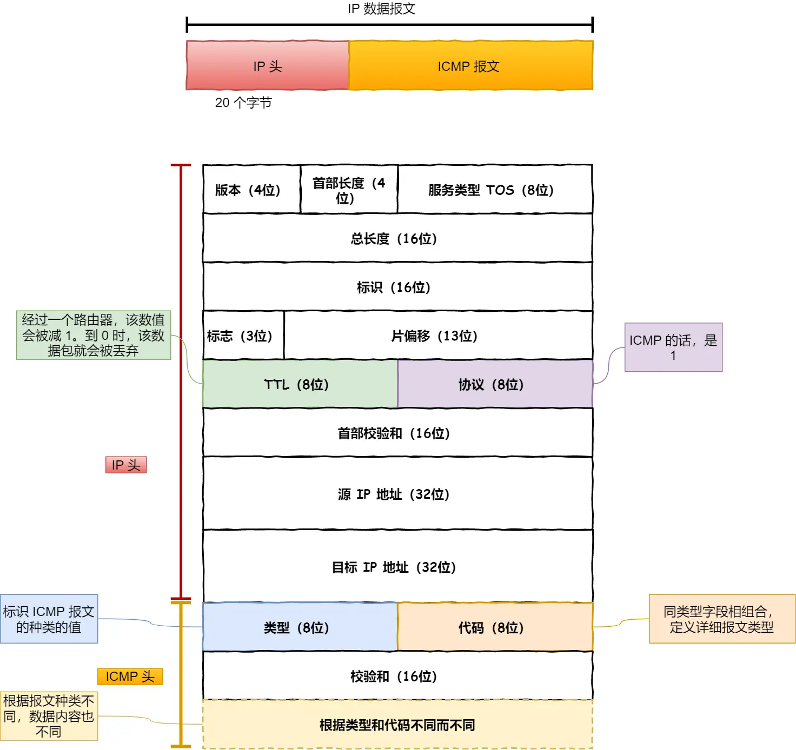
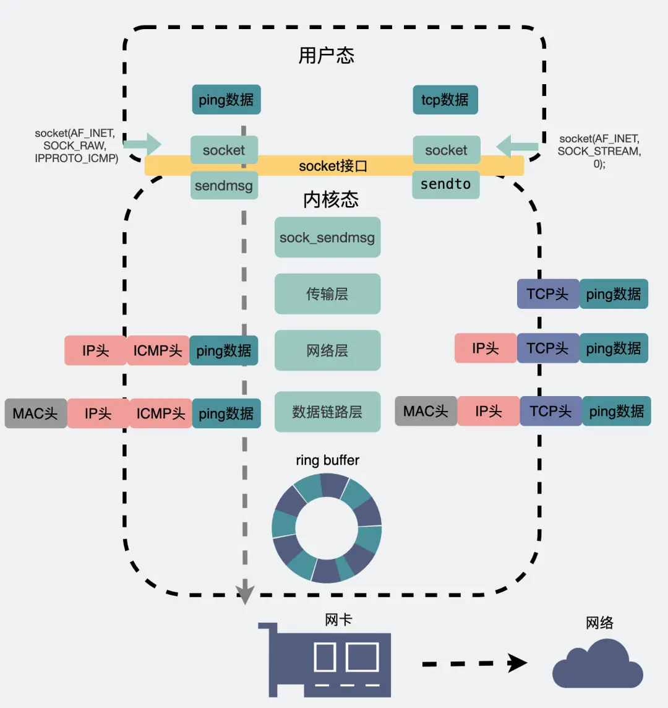

## IP的基本知识

IP在TCP/IP参考模型中的第三层，也就是网络层

网络层的主要作用是：实现主机与主机之间的通信，也叫点对点（end to end）通信

IP的作用就是在复杂的网络环境中将数据包发送给最终目的主机

**==问题：为什么有了IP地址还要有MAC地址（IP地址和MAC地址的关系）==**

**MAC的作用是实现直连的两个设备之间的通信**，而IP则负责在没有直连的两个网络之间进行通信传输，在网络传输数据包的过程中，源IP地址和目标IP地址是不会发生变化的，只有源MAC地址和目标MAC地址才会一直发生变化，也就是说通过IP地址能够找到目的主机，而实际的转发是由MAC地址完成的，MAC地址起到记录下一跳信息的作用。

### IP地址

IPv4地址有32位，每8位为一组，共分为4组，每组之间以`.`隔开

所以IPv4地址总共可以有`2^32`，大约43亿个地址，实际上，IP地址并不是以主机设备的台数来配置的，而是以网卡。像路由器、服务器等都可以有2个及以上的网卡，也就是有2个及以上的IP地址，而且移动设备的普及，手机、平板等设备也需要IP地址，导致IPv4的地址早就被用完了，目前是可以根据**NAT技术**来进行处理（后面会说）

因此，现在IPv6正在逐渐发展和普及

### IP地址的分类

IP地址被分成了5种类型，分别是A类，B类，C类，D类，E类

上图中的黄色部分表示的是分类号，用以区分IP地址类别

可以看到，**D类和E类地址是没有主机号的，因此这两类地址不能用于主机IP**

> 先来看一下A类，B类，C类地址

可以看出，不同类别的IP地址都是有范围的，因为不同类别的IP地址在高位都有标记

而且不同类别的地址划分，导致网络号和主机号的位数也不相同，这也就导致了每类地址所能表示的主机个数也是不同的，比如C类地址，主机号占8位，能够表示的主机是`2^8 - 2 = 254`个，为什么需要减2呢？这是因为有两个主机号是特殊的

- 主机号全是0，用来指定某个网络
- 主机号全是1，用来指定某个网络下的全部主机，用于广播

广播地址可以分为两类：本地广播和直接广播

- 本地广播：**在本网络内的广播叫做本地广播，**例如网络地址为192.168.0.0/24的情况下，广播地址 是192.168.0.255，因为这个广播地址的IP包会被路由器屏蔽，所以不会到达192.168.0.0之外的其 他链路上，比如192.168.1.0这个链路上的主机就不会收到。

  > 也就是说只能够在自己子网的这个范围内进行广播

- 直接广播：**在不同网络之间的广播叫做直接广播，**例如网络地址为192.168.0.0/24中的某个主机向192.168.1.255/24的目标地址发送IP包，收到这个包的路由器，会将数据转发给192.168.1.0/24，从而使所有的192.168.1.1/24-192.168.1.254的主机都接受到这个数据包（由于直接广播有一定的安全问题，所以多数情况下路由器设置为不转发）

> 有关广播地址计算的链接
>
> [直接广播地址怎么算出来_百度知道 (baidu.com)](https://zhidao.baidu.com/question/169673315.html)
>
> [四种IP广播地址_hh_xlp的专栏-CSDN博客_ip广播地址](https://blog.csdn.net/hh_xlp/article/details/7030245)

> 然后我们再来看一下D类，E类地址

D类地址和E类地址没有主机号，因此不能够用作IP地址，D类地址常常被用于多播（组播），E类是预留的分类，暂时未使用

**多播用于将数据包发送给特定组内的所有主机**

由于广播无法穿透路由，若想给其他网络发送同样的包，就可以使用能够穿透路由的组播

**一定要注意广播和组播只用于UDP，而TCP只有单播，因为TCP是面向连接的协议，链接的两端肯定是两个主机**

多播使用的是D类IP，其前四位`1110`就表示是多播地址，而剩下的28位是多播的组播号 

从 `224.0.0.0~239.255.255.255` 都是多播的可用范围，其划分为以下三类 

- 224.0.0.0 ~ 224.0.0.255 为预留的组播地址，只能在局域网中，路由器是不会进行转发的 
- 224.0.1.0 ~ 238.255.255.255 为用户可用的组播地址，可以用于 Internet 上 
- 239.0.0.0 ~ 239.255.255.255 为本地管理组播地址，可供内部网在内部使用，仅在特定的本地范围内有效

因为组播地址没有网络号和主机号，所以跟DHCP没有什么关系，组播地址一般是用于UDP协议，主机发送UDP组播数据时，目标地址填的是组播地址，那么在组播组内的机器能够收到数据包

> [单播、多播（组播）和广播的区别 - Roger Luo - 博客园 (cnblogs.com)](https://www.cnblogs.com/rogerroddick/archive/2009/08/31/1557228.html)

**IP分类的优缺点**

- 优点：不管是路由器还是主机，解析一个IP地址的时候，我们会判断其首位是0还是1，如果是0的话，说明他是A类地址，以此类推...通过这种方式**很快就能够找到网络地址和主机地址，简单明了，基于网络地址选路简单**
- 缺点：
  - 同一网络下没有地址层次，比如一个公司里用了B类地址，但是可能需要根据生产环境、测试 环境、开发环境来划分地址层次（我感觉这里的地址层次应该就是说的子网），而这种IP分类是没有地 址层次划分的功能，所以这就缺少了地址的灵活性
  - ABC类地址不能够很好的与现实情况契合
    - C类地址能够包含的主机数实在是太少了，只有254个，估计一个网吧都不够用 
    - B类地址能包含的主机数又太多了，6万多台机器放到一个网络下面，一般企业达不到这个规模，但是闲着的地址就是浪费

### CIDR无地址分类

**IP分类的缺点可以通过`CIDR`无分类地址解决**

这种方式不再有分类地址的概念，而是把32位的主机号分成了2部分：前面是网络号，后面是主机号

表示形式 `a.b.c.d/x` ，其中 `/x `表示前x位属于网络号，x的范围是 0~32 ，这就使得IP地址更加具有灵活性 

比如 10.100.122.2/24，这种地址表示形式就是 CIDR，/24 表示前 24 位是网络号，剩余的 8 位是主机号

还有一种划分网络号和主机号的形式，那就是**子网掩码**，掩码的意思就是掩盖掉主机号，剩下的就是网络号，**将子网掩码和IP地址按位与，就可以得到网络号了，此外，让IP地址和子网掩码的反码按位与就能够得到主机号了**

> [子网个数、网络号、主机号、广播地址、可用IP个数的计算](https://zhidao.baidu.com/question/169673315.html)

比如上面的IP地址10.100.122.2/24，其子网掩码是`255.255.255.0`，可以通过`/24`来得到，`/24`就表示前面的24位都是1，后8位是0

**那么为什么要分离网络号和主机号呢？**

因为两台机器要通讯，首先要判断的就是两台机器是否处于同一个网络下，如果网络号相同，那么表示这两台机器是出于同一个网络下的，可以把数据包直接发送到目标主机

路由器的寻址工作中，也就是通过这样的方式来找到对应的网络号的，进而把数据包转发给对应的网络内

**怎么样进行子网划分呢？**

在上面我们知道了通过子网掩码可以划分出网络号和主机号，那实际上子网掩码还有一个作用，就是划分子网，**子网的划分实际上是将主机地址分成两个部分：子网网络地址和子网主机地址**，形式如下：

假设对 C 类地址进行子网划分，网络地址192.168.1.0，使用子网掩码 255.255.255.192 对其进行子网划分

> 通过这个子网掩码255.255.255.192，一看就是做了子网划分的了，因为把它转成二进制可以看出 11111111 11111111 11111111 **11**000000，因为他后面是192，所以他肯定是将主机地址的前两位给划成了子网网络地址
>
> 只有当子网掩码是255.255.255.0的时候，才是没有划分子网的时候

C 类地址中前 24 位是网络号，最后 8 位是主机号，根据子网掩码可知从 8 位主机号中借用 2 位作为子网号（这里仅仅是当个例子，不一定非要借用2位，比他多也行，比他少也行）。

由于子网地址被划分成了两位，那么子网地址也就有4个，分别是`00,01,10,11`，具体的划分如下图：

将每个子网的主机地址范围整理一下，如下图所示

可以看出，**如果子网的个数越多，每个子网内的主机数就会越少**

### 公有地址和私有地址

其实在A类，B类，C类地址中都分为**公有IP地址和私有IP地址**

平时我们办公室、家里、学校用的 IP 地址，一般都是私有 IP 地址。因为这些地址允许组织内部的 IT 人员自己管理、自己分配，而且可以重复。因此，你学校的某个私有 IP 地址和我学校的可以是一样的。

就像每个小区都有自己的楼编号和门牌号，你小区家可以叫 1 栋 101 号，我小区家也可以叫 1 栋 101，没有任何问题。但一旦出了小区，就需要带上中山路 666 号（公网 IP 地址），是国家统一分配的，不能两个小区都叫中山路 666。

所以，公有 IP 地址是有个组织统一分配的，假设你要开一个博客网站，那么你就需要去申请购买一个公有 IP，这样全世界的人才能访问。并且公有 IP 地址基本上要在整个互联网范围内保持唯一。

> 私有IP可以重复，但是公有IP不可以重复

> 那么这个公有IP地址是由谁管理呢？

私有IP地址通常是由内部的it人员进行管理，而公有IP地址是由ICANN组织管理，中文叫互联网名称和数字地址分配机构

IANA是ICANN的其中一个机构，它负责分配互联网IP地址，是按照洲的方式层层分配的

其中中国的IP地址分配是由CNNIC机构管理的，他是中国国内唯一指定的全局IP地址管理的组织

### IP地址和路由控制

IP地址中的网络地址这一部分是用来做**路由控制**的

在路由器和主机上都会有各自的路由器控制表，路由器控制表中记录着网络地址和下一跳的IP地址

**在发送IP数据包的时候，首先要确定IP头部中的目标地址，再从路由控制表中找到与该地址具有相同网络地址的记录，根据该纪录将IP包转发给相应的下一个路由器，如果路由控制表中存在多条相同的网络地址的记录，就选择相同位数最多的网络地址，也就是最长匹配**

1. 主机 A 要发送一个 IP 包，其源地址是 10.1.1.30 和目标地址是 10.1.2.10，由于没有在主机 A 的路由表找到与目标地址 10.1.2.10 的网络地址，于是包被转发到默认路由（路由器 1 ）
2. 路由器 1 收到 IP 包后，也在路由器 1 的路由表匹配与目标地址相同的网络地址记录，发现匹配到了，于是就把 IP 数据包转发到了 10.1.0.2 这台路由器 2
3. 路由器 2 收到后，同样对比自身的路由表，发现匹配到了，于是把 IP 包从路由器 2 的 10.1.2.1 这个接口出去，最终经过交换机把 IP 数据包转发到了目标主机

> 回环地址是不会流向网络的，**回环地址是在同一台计算机上的程序之间进行网络通信时所使用的一个默认地址**
>
> 计算机使用一个特殊的 IP 地址 **127.0.0.1 作为环回地址**。与该地址具有相同意义的是一个叫做 `localhost` 的主机名。使用这个 IP 或主机名时，数据包不会流向网络。

### IP分片与重组

每种数据链路的最大传输单元MTU是不同的，比如以太网的MTU是1500字节

每种数据链路的MTU之所以不同是因为不同类型的数据链路的使用目的不同，使用目的不同，所能够承载的MTU也就不同

其中，我们最常见的数据链路就是以太网了

当IP数据包的大小大于数据链路的MTU时，IP数据包就会被分片，经过分片之后的IP数据包在被重组的时候，**只能够在目标主机进行，路由器是不会进行重组的**

假设发送方发送一个4000字节的大数据包，若要传输在以太网链路，则需要把数据包分片成3个小数据包进行传输，再交由接收方重组成大数据包

在IP数据包的分片的传输过程中，如果有一个分片丢失，那么整个的IP数据包都会作废，因此在TCP协议中引入了MSS，也就是TCP数据报由TCP层进行分片，而不用IP层进行分片，对于UDP来说，我们只能够尽量不要发送超过MTU大小的数据报了

### IPv6的基本认识

IPv4的地址是32位的，所以他总共大约有42亿个地址，早在2011年地址就已经被分配完了

但是IPv6的地址是128位的，它的一个标语就是**让地球上的每一粒沙子都有一个IP地址**

此外，IPv6除了有更多的IP地址以外，还有更好的安全性和可扩展性，说简单点就是IPv6相比于IPv4能带来更好的用户体验

但是由于IPv6和IPv4并不能互相兼容，所以不但要我们的电脑、手机等设备能够支持IPv6，还需要网络运行商对现有的设备进行升级，所以这可能是IPv6普及比较慢的一个因素

> IPv6 的亮点

IPv6 不仅仅只是可分配的地址变多了，它还有非常多的亮点。

- **即插即用：**IPv6可以自动配置，即使没有DHCP服务器也可以自动分配IP地址
- **简化头部结构，提高传输性能：**IPv6的包头首部长度采用固定的40字节，去掉了包头检验和，简化了首部结构，减轻了路由器负担
- **更高的安全性：**IPv6 有应对伪造 IP 地址的网络安全功能以及防止线路窃听的功能，大大提升了安全性
- … （由你发现更多的亮点）

> IPv6地址的表示方法

IPv4地址一共32位，每8位为一组，使用点分十进制的表示方式

IPv6地址一共128位，每16位为一组，每组之间用`:`隔开

如果IPv6地址中出现连续的0，可以将这些连续的0省略掉，中间用`::`隔开，但是一个IPv6地址中只允许出现一次`::`

> IPv6和IPv4的首部比较

IPv6相较于IPv4的首部改进：

- 取消了`首部校验和`字段，因为在传输层和数据链路层都会进行校验，所以IPv6直接取消了IP的校验
- 取消了分片/重新组装相关字段，分片和重组是非常耗时的过程，IPv6不允许中间路由器进行分片或者重组，这种操作只能够在源和目标主机之间进行，大大加快了路由器转发的效率
- 取消了选项字段，选项字段不再是标准IP头部中的一部分，但是他并没有消失，而是可能出现在IPv6首部的下一个首部指出的位置上，删除该字段使IPv6数据包头部称为固定的40字节

## IP协议相关的技术

DNS      域名  --->  IP地址

ARP       IP地址   --->  MAC地址

RARP    MAC地址  --->  IP地址

DHCP   动态分配IP地址

NAT      网络地址转换，多个私有地址转化成一个公有IP地址，通过端口号区分

ICMP    用于诊断的查询消息的查询报文类型和用于通知出错原因的差错报文类型

IGMP

### DNS域名解析

DNS全称Domain Name Service（域名服务），他是一个将域名映射为IP地址的一个分布式数据库，**DNS使用UDP端口53，**当然对于每一级域名长度的限制是63个字符，域名总长度则不能超过253个字符。

> 我们通常在想要浏览某个网页的时候，是需要在浏览器中输入它的域名，而不是IP地址，比如我想要访问百度，我在浏览器中输入的是`www.baidu.com`，百度的IP地址是多少我不知道，但实际上，网络通信双方连接需要用到IP地址，那么将域名映射到IP地址的工作就是由DNS来完成的

**域名的层级关系类似于一个树状结构，分为根域、顶级域和权威域**

DNS中的域名是通过`.`来分割的，**越靠右的位置说明层级越高**，根域是在最顶层，其次是顶级域，然后是权威域

比如上图中`.com`就是顶级域，而`server.com`就是权威域，所谓权威域，就是域名由他做主

**根域的DNS服务器信息保存在互联网中任意一台的DNS服务器中，这样一来，任何的DNS服务器都能够找到并访问根域DNS服务器了**

因此，只要客户端能够找到任意的一台DNS服务器，他就能够找到根域，然后“顺藤摸瓜”找到位于下层的某台DNS服务器

==**域名的解析流程**==

在域名发往域名服务器之前，客户端首先会检查一下本地缓存中是否存在，依次检查浏览器缓存，操作系统缓存和本地的HOST文件，如果都没有，就会向DNS服务器进行查询，查询的过程如下：

1. 客户端首先会发出一个DNS请求，询问本地DNS服务器`www.server.com`的IP地址是啥

   > 本地DNS服务器指的是在物理地址上更靠近用户的DNS服务器（任意的一台DNS服务器上都有根域的信息），所以本地服务器叫做本地区DNS服务器更加契合 [本地dns服务器到底是什么？有没有精确的概念？ - 知乎 (zhihu.com)](https://www.zhihu.com/question/48085305)
   >
   > 本地DNS服务器地址是在客户端的 TCP/IP 设置中填写的 DNS 服务器地址

2. 本地域名服务器收到客户端的请求之后，如果缓存的表格中能够找到`www.server.com`的IP地址，那么就将这个IP地址返回给客户端，如果没有找到，本地域名服务器就会像根域发起请求

3. 根域接收到本地域名服务器发来的请求之后，会将顶级域名服务器的地址返回给本地域名服务器

4. 本地域名服务器收到顶级域名服务器的地址之后，就会向顶级域名服务器发起查询请求，然后顶级域名服务器将权威域名服务器的地址再返回给本地域名服务器

5. 本地域名服务器收到权威域名服务器的地址之后，就会向权威域名服务器发起查询请求，权威域名服务器查询之后就会将`www.server.com`对应的IP地址告诉本地DNS服务器

   > 权威域名服务器，所谓权威，就是我的域名我做主

6. 本地DNS服务器再将IP地址返回给客户端，客户端和目标建立连接

### ARP与RARP

> **ARP协议，Address Resolution Protocol，地址解析协议**

在传输一个IP数据报的时候，确定了源IP地址和目标IP地址之后，就会通过主机路由表确定下一跳的地址，但这也仅仅是知道了下一跳的地址，真正的传输还是需要网络层的下一层-数据链路层来完成，所以我们还需要知道下一层的MAC地址

由于主机路由表中可以找到下一跳的IP地址，所以可以通过ARP协议找到对应的MAC地址

**ARP是通过ARP请求和ARP响应两种类型的包来确定MAC地址的**

- **主机会通过广播发送ARP请求**，这个包中包含了想知道MAC地址的主机IP地址
- 当处于同一个链路中的设备收到这个ARP请求包之后，就会拆开这个请求包查看里面的内容，如果ARP请求包中的目标IP地址和自己的IP地址一致，那么这个设备就将自己的MAC地址塞入**ARP响应包**返回给主机

操作系统通常会把第一次通过ARP请求得到的MAC地址**缓存**起来，以便下次直接从缓存中查找IP地址对应的MAC地址。不过这个缓存是有一定期限的，超过这个期限，缓存的内容将被清除

> **RARP协议，Reverse Address Resolution Protocol，反向地址解析协议**

ARP协议是将IP地址转化成MAC地址，而RARP恰恰相反，他是把MAC地址转化成IP地址，例如将打印机服务器等小型嵌入式设备接入到网络时就经常会用得到。

> 无盘工作站指的是将硬盘和主机分离的工作站，这个工作站只执行操作，不进行存储（没有本地存储设备），无法从本地存储中获取预配置的IP地址

使用RARP协议通常需要架设一台RARP服务器，在这个服务器上注册设备的MAC地址和IP地址，然后再将这个设备接入到网络中

- 主机会发送一条请求报文，报文中包含自己的MAC地址
- RARP服务器收到这条报文之后，会查询本地的注册表，找到之后将IP地址填入到响应报文中发送回去

ARP和RARP协议是在网络层和数据链路层的中间，所以他们不基于传输层的TCP或者UDP，具体来说，ARP和RARP使用**链路层广播**进行通信，以解决IP地址和物理硬件地址（如MAC地址）之间的映射关系。ARP使用以太网帧进行通信，而RARP使用类似的方式来获取IP地址。

### DHCP

DHCP在我们生活中很常见，我们的电脑都是通过**DHCP来动态的获取IP地址**，省去了配置IP信息的繁琐过程

> **DHCP客户端监听的是68号端口，DHCP服务器监听的是67号端口**

DHCP的工作流程如下：

- 客户端首先发起**DHCP发现报文（DHCP DISCOVER）**的IP数据报，由于客户端没有IP地址，也不知道服务器的IP地址，所以它使用的是UDP广播通信，其使用广播目的地址是255.255.255.255（端口67），并使用0.0.0.0（端口68）来作为源IP地址，DHCP客户端没有将IP数据报传递给数据链路层，链路层然后将帧广播到所有的网络中设备
- DHCP服务器收到DHCP发现报文之后，用**DHCP提供报文（DHCP OFFER）**向客户端做出响应，该报文仍然使用IP广播地址`255.255.255.255`，该报文信息携带服务器提供可租约的IP地址、子网掩码、默认网关、DNS服务器以及IP地址租用期
- 客户端收到**一个或者多个**服务器的DHCP提供报文之后，从中选出一个，并向选中的服务器发送**DHCP请求报文（DHCP REQUEST）**进行响应，回显配置的参数
- 最后，服务器用**DHCP ACK报文**对DHCP请求报文进行响应，应答所要求的参数

客户端一旦收到了DHCP ACK之后，交互便完成了，客户端能够在租用期内使用DHCP服务器分配的IP地址

如果租期的IP地址快过期了，客户端便会向DHCP服务器发送DHCP请求报文

- 如果服务器同意继续租用，则用DHCP ACK报文进行应答，客户端就会延长租期
- 如果服务器不同意继续租用，则会用DHCP NACK报文进行应答，客户端会在租约到期后停止使用这个IP地址

**可以发现，在DHCP交互的过程中，全程使用的都是UDP广播通信**

> 那这里就有了一个问题，我们知道通过广播数据报不能够穿透路由器，也就是路由器不转发广播数据包，如果DHCP服务器和客户端主机不再同一个局域网内，是不是每一个网络下都要配一个DHCP服务器？

为了解决上面的这个问题，就出现了**DHCP中继代理**，有了中继代理之后，**对不同网段的IP地址分配也可以由一个DHCP服务器来完成**

如上图所示

- DHCP客户端会先向DHCP中继代理发送DHCP请求包，而DHCP中继代理在收到这个广播包之后再以**单播**的形式发给DHCP服务器

- DHCP服务器收到这个广播包之后，再向DHCP中继代理返回应答，并由DHCP中继代理将此包广播给DHCP客户端

因此，**DHCP服务器即使和客户端不在同一条链路上也可以实现统一分配和管理IP地址**

### NAT

NAT的全称是Network Address Translation（网络地址转换）,NAT被提出的主要目的就是用来缓解IPv4地址被耗尽的速度。

简单的来说，NAT就是将同一个公司、家庭、教室内的主机对外部通信时，把私有IP地址转换成公有IP地址，如下图所示

上图所示，如果把N个私有地址转化成N个共有地址，那么NAT的目的并没有达到，因此普通的NAT转化是没啥意义的

由于绝大多数的网络应用都是用传输层协议TCP或UDP来传输数据的，因此可以把IP地址 + 端口一起转换，这样就能够达到多个私有地址对应一个公有IP的目的，这种转化技术就叫做**NAPT技术（网络地址与端口转化）**

> 一般情况下问NAT，就是问的NAPT

如上图所示，图中有两个客户端`192.168.1.10`和`192.168.1.11`同时和服务器`183.232.231.172`进行通信，并且这两个客户端的本地端口都是1025

此时，**两个私有IP地址都转换IP地址为公有地址`120.229.172.221`，但是以不同的端口号作为区分**

于是，就生成了一个**NAPT路由器转换表**，就可以正确地转化地址和端口的组合，令客户端A,B能够同时和服务器之间进行通信

**这个转化表在NAT路由器上自动生成**，比如在TCP的情况下，建立TCP连接首次握手时的SYN包一经发出，就会生成这个表，而后又随着收到关闭连接时发出的FIN包的确认应答从表中删除

NAT的优点不用多说，自然就是能够将多个私有地址映射到同一个公有IP地址上，这样能够大大缓解IPv4地址被耗尽的速度

NAT的缺点也有很多

- 转换表的生成和转换操作都会产生性能开销
- 通信过程中，如果NAT路由器重启了，所有的TCP连接都将被重置
- 外部无法与NAT路由器内部的服务器建立连接，因为NAPT/NAT转化表中没有这条记录（同时这也是一个优点，能够保证安全性）
- NAT的使用将IP从面向无连接变成了面向有链接，因为NAT转换表中维护了私有IP和公有IP以及端口之间的映射关系
- 同时NAT还违反了基本的网络分层结构模型的设计原则，因为在传统的网络分层结构模型中，第N层是不能够修改第N+1层的报头内容的，NAT破坏了这种各层独立的原则，**因为他需要修改TCP报文中的源端口**
- ...

此外，解决NAT缺点最好的方法就是使用**IPv6**，IPv6能够包含的地址很多，不需要进行地址转换，也就没有这些缺点了，但是IPv6的普及需要时间；此外，还可以通过**NAT穿透技术**来降低NAT设备的压力，我们知道转换表的生成和维护都是由NAT路由器来自动完成的，如果使用了NAT穿透技术，客户端会主动从NAT设备上获取公有IP地址，然后自己建立端口映射条目，然后使用这个条目对外通信，这样就不需要NAT路由器来进行转换了

>[网络地址转换协议NAT功能详解及NAT基础知识介绍 - 知乎 (zhihu.com)](https://zhuanlan.zhihu.com/p/26992935)

### ICMP

ICMP协议的全称是Internet Control Message Protocol（互联网控制报文协议）

**ICMP协议的主要功能就是：确认IP包是否成功送达目标地址，报告发送过程中IP包被废弃的主要原因和改善网络设置等**

**如果在IP通信中某个IP包由于某种原因未能到达目标主机，那么这个具体的原因将由ICMP负责通知**

如上图所示的例子，主机A向主机B发送了数据包，由于某种原因，路由器2不能找到主机B的存在，这时，路由器2就会向主机A发送一个ICMP目标不可达数据包，说明发往主机B的包未能成功

ICMP的这种通知消息会使用IP进行发送，所以从路由器2返回的ICMP数据包会按照往常的路由控制先经过路由器1，再转发到主机A上，收到该ICMP包的主机A则分解ICMP的首部和数据域以后得知具体发生问题的原因

ICMP报文是封装在IP包里面，它工作在网络层，是IP协议的助手

> **ICMP的类型**

ICMP大致上可以分成两大类：

- 一类是用于诊断的查询消息，也就是**查询报文类型**
- 一类是用于通知出错原因的错误消息，也就是**差错报文类型**

### IGMP

IGMP和ICMP一点关系也没有

IGMP的全称是Internet Group Management Protocol（因特网组管理协议），该协议运行在主机（组播成员）和组播路由器（最后一跳路由）之间（下图的蓝色部分），共有三个版本分别是IGMP v1，IGMP v2，IGMP v3

前面我们知道了D类地址是被用来当作组播地址，既然是组播，也就是只能够是特定组内的主机能够接收到数据报，不在同一组内的主机收不到数据报，怎么**管理是否在一组的呢？这就需要IGMP协议了**

- 主机通过IGMP报文向路由器申请加入或者退出组播组，默认情况下路由器是不会转发组播包到主机的，除非主机通过IGMP加入到组播组中，路由器就会记录IGMP路由器表，路由器后续就会转发组播包到对应的主机了
- IGMP报文采用IP封装，IP头部的协议号是2，而且TTL通常设置为1，因为IGMP是工作在主机和连接的路由器之间的（只需要1跳）

> IGMP的工作机制

以IGMP v2作为例子，说说**常规查询与响应**和**离开组播组**这两个工作机制

> 常规查询和响应

- 路由器会周期性地发送目的地址为`224.0.0.1`（表示同一网段内所有的主机和路由器）**IGMP常规查询报文**
- 主机1和主机3收到这个查询，随后会启动报告延迟计时器，计时器的时间是随机的，通常是0~10秒，计时器超时后主机就会发送**IGMP成员关系报文**（源IP地址是自己的IP地址，目标IP地址是组播地址）。如果在定时器超时之前，收到同一个组内的其他主机发送的成员关系报告报文，则自己不在发送，这样可以减少网络中多余的IGMP报文数量
- 路由器收到主机的成员关系报告之后，就会在IGMP路由表中加入该组播组，后续网络中一旦该组播地址的数据到达路由器，他会把数据报转发出去

> 离开组播组的工作机制

离开组播组分成了两种情况，一个情况是主机离开组播组之后，组播组中还有其他主机，另一种情况是主机离开之后，没有其他主机了

我们先来看第一种情况，主机离开组播组之后还有其他的主机

- 主机1要离开组224.1.1.1，**发送IGMPv2离组报文**，报文的目的地址是224.0.0.2（表示发向网段内的所有路由器）
- 路由器收到该报文以后，以1秒为间隔连续发送IGMP特定组查询报文（共计2个），以便确认网络中是否还存在224.1.1.1组的其他成员
- 主机3仍然是组224.1.1.1的成员，因此它会立即响应这个特定组的查询，那么路由器就能够知道该网络中仍然存在该组播组的成员，于是继续向该网络转发224.1.1.1的组播数据包

第二种情况是，主机离开组播组之后，组播组中没有其他主机了

- 主机 1 要离开组播组 224.1.1.1，发送 IGMP 离组报文
- 路由器收到该报文后，以 1 秒为间隔连续发送 IGMP 特定组查询报文（共计发送 2 个）。此时在该网段内，组 224.1.1.1 已经没有其他成员了，因此没有主机响应这个查询
- 一定时间后，路由器认为该网段中已经没有 224.1.1.1 组播组成员了，将不会再向这个网段转发该组播地址的数据包

> 假设一台机器加入组播地址，需要把IP改成组播地址吗？如果离开某个组播地址，需要DHCP重新请求个IP吗？

组播地址不是用于机器IP地址的，因为组播地址没有网络号和主机号，所以跟DHCP没关系。组播地址一般是用于UDP协议，机器发送UDP组播数据时，目标地址填的是组播地址，那么在组播组内的机器都能收到数据包。

是否加入组播组和离开组播组，是由socket一个接口实现的，主机IP是不用改变的。

## ping的工作原理

写在最前面，**ping是基于ICMP协议工作的**，所以在具体讲解ping过程之前我们先来复习一下ICMP协议

### ICMP协议

#### ICMP概念

ICMP协议又叫互联网控制报文协议，重点就在“控制”两个字，ICMP协议报文有两种类型，分别是查询报文类型和差错报文类型，因为网络环境错综复杂，所以发出去的网络包不一定能够到达目的地，而**ICMP的功能就是确认IP包是否成功送达到目标地址，向主机报告错误原因，改善网络设置等**

在IP通信中，如果某个IP包由于某种原因没能达到目标地址，那么这个具体的原因将由ICMP报告

**ICMP报文是封装在IP包里面的**，它工作在网络层，ICMP是IP协议的助手

在前面我们只复习了ICMP中有两个数据类型，但是却没有对这两种数据类型进行详细的介绍

如上图所示，ICMP中的数据类型分为查询报文类型和错误报文类型，查询报文类型主要是回送消息，类型0和8；差错报文类型主要包含了目标不可达（3），原点抑制（类型4），重定向消息（类型5），超时消息（类型11），下面我们就来分别解释一下这几种报文类型

#### ICMP类型

> 首先是查询报文类型

上面说了主要是回送请求（类型8）和回送应答（类型0）两种查询报文类型

**回送消息用于进行通信的主机和路由器之间，判断所发送的数据包是否已经成功到达对端的一种消息，ping命令就是根据这种消息实现的**

可以向对端主机发送回送请求的消息（类型8），也可以接收对端主机发回来的回送应答的消息（类型0）

相比于原生的ICMP报文内容，这里多个两个字段

- **标识符**，用于区别是哪个应用程序发送的ICMP包，比如用进程ID作为标识符
- **序号**，序列号从0开始，每发送一次新的回送请求就会加1，可以用来确认网络包中是否有丢失

**在选项数据中，ping还会存放发送请求的时间值，来计算往返时间，说明路程的长短**

> 然后是差错报文类型

- 首先是目标不可达消息（类型3），表示的是IP路由器无法将IP数据包发送给目标主机，然后路由器就会返回给发送主机一个目标不可达的ICMP消息，并在这个消息中显示不可达的具体原因，**原因记录在ICMP包头的代码字段**

  

  - 网络不可达（代码0），在路由器的路由表中匹配不到接收方IP的网络号
  - 主机不可达（代码1），当路由器表中没有该主机的信息，或者该主机没有连接到网络上时，会通过ICMP协议以主机不可达的原因告诉发送主机
  - 协议不可达（代码2），当主机使用TCP协议访问对端主机时，能够找到对端主机，但是对端主机防火墙已经禁止TCP协议访问了，那么会通过ICMP协议以协议不可达的原因告知主机
  - 端口不可达（代码3），当主机访问的是对端主机的8080端口，这次能够找到主机而且防火墙也没有限制，可以发现对端主机没有进程监听8080端口，那么会通过ICMP协议以端口不可达的原因告知主机
  - 需要进行分片但是设置了不分片（代码4），发送端主机发送IP数据报的时候，将IP首部的分片禁止位设置为1，根据这个标志位，图中的路由器遇到超过MTU大小的数据包时，不会进行分片，而是会直接丢弃，随后通过一个ICMP的消息不可达类型通知发送方主机

- 第二是原点抑制消息（类型4），在使用低速广域线路的情况下，连接WAN口的路由器可能会遇到网络拥堵的问题，**ICMP原点抑制消息的目的就是为了缓和这种拥堵情况**

  当路由器向低速广域线路发送数据的时候，其发送队列的缓存变成了0而无法发送，可以向IP包的源地址发送一个ICMP原点抑制消息，收到这消息的主机能够了解到网络线路中的某个地方发生了拥堵，因此他会延长IP包的发送间隔，从而减少网络拥堵的情况。

  然而，由于这种ICMP可能会引起不公平的网络通信，所以一般不被使用

- 第三是重定向消息（类型5），如果路由器发现主机并不是通过最优路径发送数据，那么路由器会向主机响应一个ICMP重定向消息，在这个消息里面包含了最合适的路由信息和源数据，这主要发生在路由器持有更好的路由信息的情况下。路由器会通过这样的 ICMP 消息告知发送端，让它下次发给另外⼀个路由器

- 最后是超时消息（类型11），IP包中有一个字段是TTL（Time To Live），它的值随着每经过一次路由器就会减1，直到减到0的时候该IP包会被丢弃，此时路由器会发送一个ICMP超时信息给发送端主机，并通知发送端主机该包已经被丢弃了

  **设置IP包生存周期的主要目的是为了在路由控制遇到问题发生循环状况的时候，避免IP包无休止的在网络上转发**

  

### ==ping原理（ping其实就是查询类型报文的应用）==

ping实际上就是使用了ICMP中的查询报文类型

> 我们这里使用在同一个局域网下的两台主机为例，主机Aping主机B之后会发生什么？

ping命令执行的时候，**源主机首先会构建一个ICMP回送请求消息数据包**，ICMP数据包内包含多个字段，最重要的两个是：

- 第一个是类型，对于回送请求消息而言该字段为8
- 第二个是序号，主要用于区分连续ping时发出的多个数据包

每发送一个请求数据包，序号会自动加1，为了能够计算往返时间RTT，他会在报文的数据部分插入发送时间

然后，由ICMP协议将这个数据包连同IP地址192.168.1.1一起发送给IP层，IP层将以192.168.1.1作为源IP地址，192.168.1.2作为目标IP地址，将协议字段设置为1（表示ICMP协议），再加上一些控制字段，构成IP数据包

接下来，需要加入MAC头，如果能够在本地的ARP映射表中找到192.168.1.2的MAC地址，则可以直接使用，如果没有，则需要发送ARP协议查询MAC地址，获得MAC地址后，由数据链路层构建一个数据帧，目的地址是IP层传过来的MAC地址，源地址是本地的MAC地址，还要附加上一些控制信息，依据以太网的介质访问规则，将他们传送出去

主机B接受到上图所示数据帧后，先检查它的MAC地址，看看是否和自己的MAC地址一致，如果不一致则丢弃这个数据包，一致的话继续往下处理，将IP数据报从帧中提取出来，交给本机的IP层，同样IP层也要检查目标地址等，通过检查之后将有用的信息提取出来交给ICMP协议

主机B会构建一个ICMP回送响应消息数据报，类型为0，序号为收到的ICMP请求数据包中的序号，然后再通过相同的顺序发送回主机A

如果在规定时间内没有收到ICMP回送应答消息，则说明目标主机不可达，如果收到了应答包，则说明目标主机可达

此时，主机会检查，用当前时刻减去该数据包最初从源主机上发出的时刻，就是**ICMP数据包的时间延迟**

上述过程如下图所示

上述过程是最简单的，只是在同一个局域网里面的情况，如果跨网段，还会涉及到网关、路由器的转发等

但是对于ICMP头来说不会发生变化，影响的是根据目标IP地址选择路由的下一跳，还有每经过一个路由器到达一个新的局域网就会更换报文中的MAC地址

> 说了这么多，对于ping这个程序它使用的其实就是ICMP中的回送请求消息（类型8）和回送应答消息（类型0）

### traceroute差错类型报文的应用

在Unix和macos中有一款充分利用ICMP差错类型报文的应用叫做traceroute，在Windows中叫做tracert

traceroute主要有两个作用：

- **第一个作用是：通过设置特殊的TTL，来追踪去往目的地时沿途经过的路由器**

  这个作用实现的工作原理就是将IP包的TTL从1按照顺序递增的同时发送UDP包，强制接收ICMP超时信息的一种方法

  比如将TTL设置为1，遇到第一个路由器就牺牲了，返回路由器**返回差错类型报文信息，类型是超时信息（类型11）**

  将TTL设置为2，遇到第二个路由器会牺牲，返回第二个路由器返回差错类型报文信息，类型是超时信息（类型11）

  如此往复，也就能够到达目标主机，从而得到到目标主机路径上的全部路由信息了

  

  > 这里其实有一个问题，那就是如何知道已经到达了目标主机呢？

  traceroute在发送UDP包的时候，会填入一个不可能的端口号33434来作为UDP的目标端口号，当目标主机收到这个数据报后，会返回一个差错报文类型的消息，即端口不可达

  **所以当差错报文类型是端口不可达时，说明发送方发出的UDP包已经到达了目标主机**

  

- **第二个作用是：通过故意设置不分片，来确定路径的MTU**

  

  工作原理如上图所示：

  - 首先发送端主机在发送IP数据报的时候将IP包首部的分片禁止标志位设置为1，根据这个标志位，图中的路由器不会对大数据包进行分片，而是将包丢弃
  - 随后，路由器通过一个ICMP的不可达消息将数据链路上的MTU值一起发送给主机，不可达消息类型为需要分片但是设置了禁止分片位

  - 发送端主机每次收到ICMP差错类型报文的时候就会减少包的大小，以此定位一个合适的MTU值，以便能够到达目标主机

### TCP发数据和ping的区别

> 下图中有一处画错了，右边是 tcp 数据，而不是 ping 数据。

ping本质上是一个应用程序，属于TCP/IP网络协议栈中的应用层，但是ping基于的是ICMP网络层协议，因此ping是进入到网络层后加上**ICMP和IP头**后，数据链路层加上**MAC头**，也是顺着网卡发出。

而TCP是工作在传输层，会以`host:ip`的方式解析网络地址，因此相对于ping，使用TCP发送的数据包会多一个TCP报头

### 为什么断网了还能ping通127.0.0.1

在有网的情况下，ping是通过网卡将数据发送出去的。在断网的情况下，网卡已经不工作了，但ping回环地址确是正常的。

这是因为在网络层系统会根据目的IP在路由表中获取对应的路由信息，而这其中就包含了选择哪个网卡将消息发出去

- 当发现目标IP是外网IP时，会从“真网卡”发出
- 当发现目标IP是回环地址时，就会选择本地网卡

本地网卡，其实就是一个假网卡，它不像真网卡那样有个`ring buffer`什么的，“假网卡”会把数据发送到一个叫做`input_pkt_queue`的链表中，这个链表是所有网卡共享的，上面存储着发给本机的各种消息，消息被发送到这个链表上后会触发一个软中断。系统中有一个专门的内核线程处理软中断`ksoftirqd`，它在收到软中断后就会立马去链表里把消息取出，然后顺着数据链路层、网络层等向上传递最后给到应用程序。

ping回环地址和通过TCP等各种协议发送数据到回环地址都是走这条路，整条路经从发到收，都没有经过“真网卡”，127.0.0.1之所以叫做回环地址，可以理解为消息发出到这个地址上的话，不会出现在网络上，在本地转个圈就有回来了，所以断网之后仍然是能够ping通回环地址的

> 当使用`ifconfig`时，除了回环地址，还能够看到网卡上的ip地址，我们称之为本机地址，ping回环地址和ping本机地址是没有区别的，都是通过“假网卡”让数据转个圈

### 127.0.0.1 和 localhost 以及 0.0.0.0 有区别吗

- `localhost`不是`ip`地址，而是一个域名，只是会被默认解析为`127.0.0.1`，这条规则可以通过修改`/etc/hosts`文件来更改，所以默认情况下使用`localhost`和127.0.0.1是没有区别的

- 执行`ping 0.0.0.0`是会失败的，因为`0.0.0.0`在ipv4中是无效的目标地址，但是他有一个用处：当我们启动服务器时，一般会监听一个IP地址和端口，等待客户端的连接，如果此时`listen`的是本机的`0.0.0.0`，那么它表示本机上的所有IPv4地址。

  > 需要注意的是，客户端connect的时候不能使用0.0.0.0，必须要指明连接的是哪一个服务器IP

  

