[toc]


## TCP基本信息

### TCP头部格式

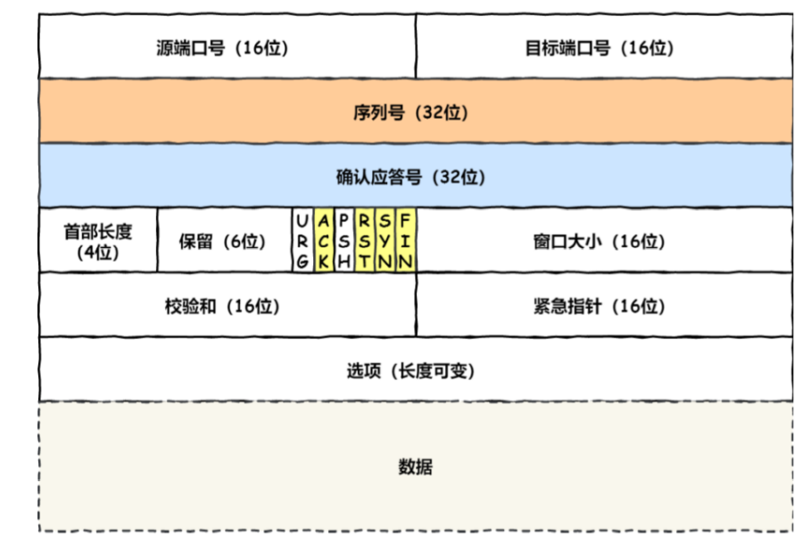

- **序列号（Sequence）**，在建立连接时由计算机生成的随机数作为其初始值，通过SYN包传给接收端主机，每发送一次数据，就累加一次该数据的字节数大小，**用来解决网络包乱序问题**
- **确认应答号（Acknowledgement Number）**，只下一次期望收到的数据的序列号，发送端收到这个确认应答之后可以认为在这个序号以前的数据都已经被正常接收了。**用来解决丢包问题**
- **控制位**
  - `ACK`：该位为1时，确认应答的字段变为有效，**TCP规定除了最初建立连接时的`SYN`包之外，该位必须设置为1**
  - `RST`：该位为1时，表示TCP连接中出现异常，必须强制断开连接
  - `SYN`：该位为1时，表示希望建立TCP连接，并会在序列号字段中进行序列号的初始化设定
  - `FIN`：该位为1时，表示今后不再会有数据包发送，希望断开连接。
  - `URG`：该位为1时，表示数据包中存在紧急数据，需要尽快处理，通常与紧急指针一起使用，指示紧急数据在数据流中的位置
  - `PSH`：当发送端将PSH置为1时，TCP会立即创建一个报文并发送。 接受端收到PSH为1的报文后就立即将接受缓冲区内数据向上交付给应用程序，而不是等待缓冲区满后再交付。


### 为什么需要TCP协议，TCP工作在哪一层

因为IP层是不可靠的，他不能够保证网络包的交付，不能够保证网络包的按序交付，也不能够保证网络包中数据的完整性

如果需要保证网络数据包的可靠传输，那么就需要上层的TCP协议来负责

而且根据TCP/IP模型，应用层不需要关注数据发送的细节，所以TCP需要向上提供网络支持，向下提供可靠传输

TCP协议是工作在传输层上的可靠的数据传输协议，它能够保证接收端收到的网络包是无损坏、无间隔、非冗余和按序的


### 什么是TCP协议（简述一下TCP协议）

TCP是**面向连接的**、**可靠的**、**基于字节流的**传输层通信协议

- 面向连接：TCP连接一定是一对一的连接，不能够向UDP那样可以一个主机同时向多个主机发送消息，也就是没有办法做到一对多
- 可靠：无论网络链路中发生什么样的变化，TCP总是能够保证一个网络包可以到达对端
- 基于字节流的：用户消息通过TCP协议传输时，消息可能会被操作系统分组成多个的TCP报文，接收方的程序如果不知道消息的边界是无法读出一个有效的用户消息的，并且TCP报文是有序的，当前一个报文没有收到的时候，即使它先收到了后面的TCP报文，那么也不能扔给应用层去处理，同时对重复的TCP报文会自动丢弃


### 什么是TCP连接

**TCP为了保证可靠性和流量控制维护了某些状态信息，这些信息（Socket，序列号，窗口大小）的组合叫做连接**

所以我们知道，建立一个TCP连接是需要客户端和服务器达成上述三个信息的共识

- Socket：由IP地址和端口号组成
- 序列号：用来解决乱序问题等
- 窗口大小：用来做流量控制


### 有一个 IP 的服务端监听了一个端口，它的 TCP 的最大连接数是多少？

我们知道一个TCP连接是通过一个四元组（源IP、目标IP、源端口、目标端口）来唯一确定的

如果有一个 IP 的服务端监听了一个端口，也就是说有一端的IP的地址和端口已经确定了，所以此时 TCP 的最大连接数理论上是$2^{32} \times 2^{16}$，当然，实际连接数肯定是要远远小于这个理论上线的，因为我们前面提到了连接是Socket、序列化、窗口大小这些信息的组合，因此维护这些信息（也就是维护一条TCP连接）需要占用一定的内容，操作系统的内存是有限的，如果内存资源被占满后，会发生 OOM。此外，我们知道在Linux中“一切皆文件”，所以对Socket来说，本质上也会占用一个文件描述符，如果文件描述符被占满了，会发生 Too many open files。Linux 对可打开的文件描述符的数量分别作了三个方面的限制：

- **系统级**：当前系统可打开的最大数量，通过 `cat /proc/sys/fs/file-max` 查看；
- **用户级**：指定用户可打开的最大数量，通过 `cat /etc/security/limits.conf` 查看；
- **进程级**：单个进程可打开的最大数量，通过 `cat /proc/sys/fs/nr_open` 查看；


### 如何理解字节流

之所以会说TCP是面向字节流的协议，UDP是面向数据报的协议，是因为操作系统对TCP和UDP协议的**发送方的机制不同**，也就是问题原因在发送方

> 为什么UDP是面向报文的协议？

当用户消息通过UDP协议传输时，**操作系统不会对消息进行拆分，**在组装好UDP头部后就交给网络层来处理，所以发出去的UDP报文中的数据部分就是完整的用户信息，也就是每个UDP报文就是用户消息的边界，这样接收方再收到UDP报文后，读取一个UDP报文就能读取到完整的用户消息。

如果收到了两个UDP报文，操作系统是如何区分开的呢？

操作系统在收到UDP报文后，会将其插入到队列中，队列里的每一个元素就是一个UDP报文，这样当用户调用`reecfrom`系统调用读取数据的时候，就会从队列里取出一个数据，然后从内核里拷贝给用户缓冲区


> 为什么TCP是面向字节流的协议呢

当用户消息通过TCP协议传输时，**消息可能会被操作系统分组成多个报文，**也就是一个完整的用户消息被拆分成多个TCP报文进行传输。

这时接收方的程序不知道发送方发送的消息的长度，也就是不知道消息的边界时，是无法读取一个有效的用户消息的，当用户消息被拆分成多个TCP报文后，并不能像UDP那样，一个TCP报文就能代表一个完整的用户消息。

在发送端，*当我们通过`send`函数完成数据发送以后，数据并没有真正的从网络上被发送出去，只是从应用程序拷贝到了操作系统内核协议栈中*，至于什么时候真正被发送，取决于发送窗口、拥塞窗口以及当前发送缓冲区的大小等条件（nagle算法），也就是说，我们不能认为每次调用`send`发送消息，消息都会作为一个完整体被发送出去，实际情况是比较复杂的，如下：


也就是说，**我们不能认为一个用户消息对应一个TCP报文，正是因为这样，所以TCP才是面向字节流的协议**

> `sendto`是和`recvfrom`对应的系统调用


也正是因为TCP是面向字节流的协议，所以使用TCP传输协议才会出现**粘包问题**，因为使用TCP传输很有可能将两个消息的某个部分分到同一个TCP报文中，要解决这个问题，需要从应用层（应用程序）来入手。常见的有三种解决方式：固定长度的消息、使用特殊字符作为边界、自定义消息结构


### UDP和TCP的区别以及分别的应用场景

> TCP的全称叫传输控制协议 Transmission Control Protocol
>
> UDP的全称叫用户数据报协议 User Datagram Protocol

1. 首先就是连接方面

   - TCP是面向连接的传输层协议，在传输数据之前需要先建立连接
   - UDP是无连接的传输层协议，传输数据不需要建立连接

   也正是因为TCP是面向连接的，所以TCP必须是一个一对一的连接，也就是说TCP的服务对象这有两个，而UDP并没有这些限制，UDP可以从一个主机同时给多个主机发送数据，支持一对一、一对多、多对多的连接

2. 第二是可靠性方面

   - TCP通过序列号、三次握手等机制能够实现数据报文的可靠性传输，达到不丢失、不重复、无差错，按需到达
   - UDP只是尽最大努力的去发送，不关心数据是否发生丢包等问题

3. 第三是阻塞控制和流量控制

   - TCP有阻塞控制和流量控制，用来保证数据报文的安全传输
   - UDP没有上述性质，他只是努力的去发送数据，即使网络非常阻塞了，也不会影响UDP发送数据包的速率

4. 第四是首部开销

   - TCP的首部长度较长，没有选项字段的时候就已经是20字节了，如果加上选项字段，会变得更长
   - UDP的首部长度只有8个字节，并且是固定不变的，开销较小

5. 第五是传输方式不同

   - TCP是基于字节流传输（流式传输），没有边界，但是能够保证可靠性和顺序性
   - UDP是一个包一个包的发送，是有边界的，但是有可能会有丢包或者乱序

6. 第七是分片方式不同

   - 在TCP中，有了一个新的概念叫做MSS（Maximum Segment Size，MSS），如果数据包的大小超过了MSS，则会在传输层进行分片，接收方收到了之后也会在传输层进行组装，如果传输过程中某个包丢失了，只需要重传丢失的包即可
   - 在UDP中，如果数据包的大小超过了MTU，则会在网络层进行分片，目标主机收到之后，会在网络层进行组装，接着在发送给传输层，但是如果中途丢了某个包，则需要重传所有的数据包，这样传输效率会非常差，所以UDP数据包应该尽可能地小于MTU

TCP的应用场景主要是需要使用它们面向连接、能够保证数据的可靠性交付的特性，因此经常用于`FTP`文件传输、HTTP/HTTPS协议等

UDP的应用场景集中在包总量比较少的通信，比如DNS，或者是音频、视频等多媒体通信中（掉帧影响不大，快就行），或者是广播通信，因为UDP面向无连接，它可以随时发送数据


这里来看一下**UDP的头部**


UDP的头部非常简单，只有8个字节

- 目标端口和源端口：目的是告诉UDP协议要把数据包发送给哪个应用程序
- 包长度：UDP头部和数据部分的总长度
- 校验和：校验和是为了提供可靠的 UDP 首部和数据而设计


**问题1：为什么TCP头部中有一个首部长度的字段，而UDP中没有？**

因为TCP头部字段中有一个可变长的选项字段，而UDP的头部长度是固定的8字节，不会变化，因此首都长度字段对UDP来说没用

**问题2：为什么TCP没有包长度字段，而UDP有包长度字段**

其中 IP 总长度 和 IP 首部长度，在 IP 首部格式是已知的。TCP 首部长度，则是在 TCP 首部格式已知的，所以就能够通过上面的三个数据求得 TCP 数据的长度。

大家这时就奇怪了问：“UDP 也是基于 IP 层的呀，那 UDP 的数据长度也可以通过这个公式计算呀？ 为何还要有「包长度」呢？”

这么一问，确实感觉 UDP 的「包长度」是冗余的。

我查阅了很多资料，我觉得有两个比较靠谱的说法：

- 第一种说法：因为为了网络设备硬件设计和处理方便，首部长度需要是 `4` 字节的整数倍。如果去掉 UDP 的「包长度」字段，那 UDP 首部长度就不是 `4` 字节的整数倍了，所以我觉得这可能是为了补全 UDP 首部长度是 `4` 字节的整数倍，才补充了「包长度」字段。
- 第二种说法：如今的 UDP 协议是基于 IP 协议发展的，而当年可能并非如此，依赖的可能是别的不提供自身报文长度或首部长度的网络层协议，因此 UDP 报文首部需要有长度字段以供计算


## TCP三次握手连接建立

### 握手过程


- 最开始客户端和服务器都处于`Close`状态，先是服务器主动监听某个端口，处于`LISTEN`状态

- 第一步，客户端向服务器发起连接请求，客户端会随机初始化一个序号`client_isn`，并将此序号置于TCP首部的序列号字段处，随后将标记位的`SYN`置为1，**随后客户端进入`SYN_SENT`状态，**报文格式如下，**注意：第一次握手时的报文中没有携带应用数据**

  

- 第二步，服务器收到客户端的握手请求报文之后，也会初始化一个随机序列号`server_isn`，并将其放到TCP首部中的序列号位置，其次把TCP首部中的确认应答号填入`client_isn + 1`，**同时把标志位的`ACK`和`SYN`都置为1，**之后**服务器进入`SYN_RCD`状态**，报文格式如下，**注意：第二次握手的过程中也没有携带应用数据**

  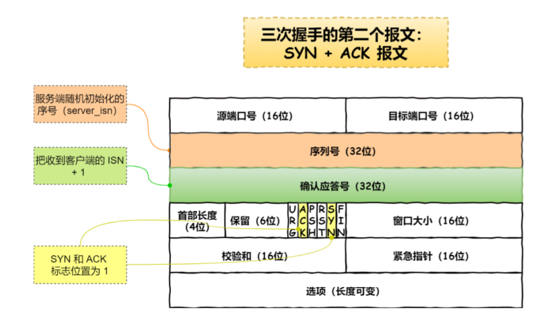

- 第三步，客户端收到来自服务器的`SYN+ACK`报文之后，将TCP首部的确认应答号填充为`server_isn + 1`，并且把控制位的`ACK`置为1，最后把报文发送给服务器，**自己则进入`ESTABLISHED`状态**，报文如下，注意在**第三次握手时可以携带应用数据**

  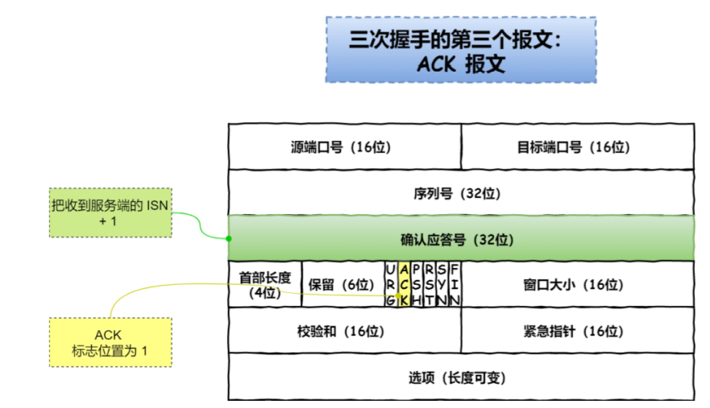

- 当服务器收到来自客户端的ACK报文之后，便也会进入`ESTABLISED`状态，至此，TCP三次握手完成，TCP连接建立

==面试中常问的一个点：TCP前两次握手不能够携带应用数据，第三次可以携带应用数据==


### 为什么握手次数是三次，而不是两次、四次

**三次握手的主要原因就是能够阻止重复历史连接的初始化，减少资源浪费，其次三次握手能够保证客户端和服务器双方的序列号同步**

#### 避免历史连接

我们考虑一个场景，客户端先发送了 SYN（`seq = 90`）报文，然后客户端宕机了，而且这个 SYN 报文还被网络阻塞了，服务端并没有收到，接着客户端重启后，又重新向服务端建立连接，发送了 SYN（`seq = 100`）报文（*注意！不是重传 SYN，重传的 SYN 的序列号是一样的*）。


如果是两次握手，就无法阻止历史连接，因为**在两次握手的情况下，服务端没有中间状态`SYN_RECV`给客户端来阻止历史连接，导致服务端可能建立一个历史连接，造成资源浪费**。

因为在两次握手的情况下，服务端在收到 SYN 报文后，就进入 ESTABLISHED 状态，意味着这时可以给对方发送数据，但是客户端此时还没有进入 ESTABLISHED 状态，假设这次是历史连接，客户端判断到此次连接为历史连接，那么就会回 RST 报文来断开连接，而服务端在第一次握手的时候就进入 ESTABLISHED 状态，所以它可以发送数据的，但是它并不知道这个是历史连接，它只有在收到 RST 报文后，才会断开连接。


可以看到，如果采用两次握手建立 TCP 连接的场景下，服务端在向客户端发送数据前，并没有阻止掉历史连接，导致服务端建立了一个历史连接，又白白发送了数据，妥妥地浪费了服务端的资源。因此，**要解决这种现象，最好就是在服务端发送数据前，也就是建立连接之前，要阻止掉历史连接，这样就不会造成资源浪费，而要实现这个功能，就需要三次握手**。


***这里有一个问题，三次握手的那张图中，`RST`报文在新的`SYN`报文到达之前被服务端接收的，如果是新的`SYN`包先于`RST`到达服务端呢？***服务端再收到「新 SYN 报文」时，会返回一个`Challenge Ack`报文给客户端，**这个 ack 报文并不是确认收到「新 SYN 报文」的，而是上一次的 ack 确认号**，也就是91（90+1）。所以客户端收到此 ACK 报文时，发现自己期望收到的确认号应该是 101，而不是 91，于是就会回 RST 报文。

> 有关`Challenge Ack`的相关内容，写在了下面的 `已建立连接的TCP，收到SYN会发生什么？`内容中


在这里还需要注意的一个点：**如果服务端收到数据包时还处于`SYN_RECV`状态，**也就是说第三次握手的`ACK`丢了或者阻塞在网络中了，这时服务端会正常响应，这是因为数据包中`ACK`字段被置为1，而且确认应答号`(ack)`也是确认第二次握手的，所以，服务端收到这个数据报文，是可以正常建立连接的，然后就可以正常接收这个数据包了。


#### 同步双方初始化序列号

我们知道，TCP的一个重要特性就是可靠性，而TCP为了在不稳定的网络环境中构建一个稳定的数据连接，他就需要一个“序列号”来保证自己的稳定性，这个序列号的作用就是为了防止数据包重复发送、接收方根据数据包的序列号按序接收、标识发送出去的数据包中有哪些已经被接受到了。

因此当发送方发送了自己的序列号之后需要收到接收方的确认，接收方发送了自己的序列号之后同样也需要发送方的确认，这样一来一回就是三次握手，而如果两次握手的话，只能够同步一方的序列号，当然，四次握手能够同步双方序列号，但是多一次连接就多了一次消耗，这是可以被优化的


三次握手就已经理论上最少可靠连接建立，所以不需要使用更多的通信次数


### 为什么每次建立TCP连接时，初始化的序列号都要求不一样

主要原因有两个方面：

- 为了防止历史报文被下一个相同四元组的连接接收（主要方面）
- 为了安全性，防止黑客伪造的相同序列号的TCP报文被对方接收

下面我们来看一下，如果每次建立连接，客户端和服务端的初始化序列号都是从0开始，会有什么问题


如上图所示，**如果每次建立连接，客户端和服务端的初始化序列号都是一样的话，很容易出现历史报文被下一个相同四元组的连接接收的问题**。如果每次建立连接客户端和服务端的初始化序列号都不一样，就有大概率因为历史报文的序列号不在对方的接收窗口，从而很大程度上避免历史报文


相反，如果每次建立连接客户端和服务端的初始化序列号都「一样」，就有大概率遇到历史报文的序列号刚「好在」对方的接收窗口内，从而导致历史报文被新连接成功接收。

**所以，每次初始化序列号不一样很大程度上能够避免历史报文被下一个相同四元组的连接接收，注意是很大程度上，并不是完全避免了**

> 因为历史报文能否被对方接收还要看历史报文的序列号是否正好在对方接收窗口中，如果不在就会被丢弃，如果在才会被接收，每次建立连接时客户端和服务端的初始序列号不同，就有大概率因为历史报文的序列号不在对方的接收窗口中，从而很大程度上避免了历史报文。


**序列号和初始化序列号并不是无限递增的，会发生回绕为初始值的情况，这意味着无法根据序列号来判断新老数据**。

因为序列号占据头部的32个字节，所以序列号最大值是4G，但是不要误以为这个4G是很大的，在一个速度足够快的网络中传输大量数据时，序列号的回绕时间就会变短，如果序列号的回绕时间极短，那么我们就会**再次面临之前延迟的报文抵达后序列号依然有效的问题**。

为了解决这个问题，就需要使用TCP时间戳，`tcp_timestamps`参数是默认开启的，开启了`tcp_timestamps`参数，TCP头部就会使用**时间戳**选项，它有两个用处（好处），**一是便于计算RTT，二是能够防止序列号回绕（PAWS，Protect Against Wrapped Sequence numbers）**

**防回绕序列号算法要求连接双方维护最近一次收到的数据包的时间戳（Recent TSval），每收到一个新数据包都会读取数据包中的时间戳跟Recent TSval值作比较，如果发现收到的数据包中时间戳不是递增的，则表示该数据包是过期的，就会直接丢弃掉这个数据包**

如下示例：假设 TCP 的发送窗口是 1 GB，并且使用了时间戳选项，发送方会为每个 TCP 报文分配时间戳数值，我们假设每个报文时间加 1，然后使用这个连接传输一个 6GB 大小的数据流。


32 位的序列号在时刻 D 和 E 之间回绕。假设在时刻B有一个报文丢失并被重传，又假设这个报文段在网络上绕了远路并在时刻 F 重新出现。如果 TCP 无法识别这个绕回的报文，那么数据完整性就会遭到破坏。

使用时间戳选项能够有效的防止上述问题，如果丢失的报文会在时刻 F 重新出现，由于它的时间戳为 2，小于最近的有效时间戳（5 或 6），因此防回绕序列号算法（PAWS）会将其丢弃。

但是时间戳的大小是 32 bit，所以**理论上也是有回绕的可能性的**。

Linux 以本地时钟计数（jiffies）作为时间戳的值，不同的增长时间会有不同的问题：

- 如果时钟计数加 1 需要1ms，则需要约 24.8 天才能回绕一半，只要报文的生存时间小于这个值的话判断新旧数据就不会出错。
- 如果时钟计数提高到 1us 加1，则回绕需要约71.58分钟才能回绕，这时问题也不大，因为网络中旧报文几乎不可能生存超过70分钟，只是如果70分钟没有报文收发则会有一个包越过PAWS（这种情况会比较多见，相比之下 24 天没有数据传输的TCP连接少之又少），但除非这个包碰巧是序列号回绕的旧数据包而被放入接收队列（太巧了吧），否则也不会有问题；
- 如果时钟计数提高到 0.1 us 加 1 回绕需要 7 分钟多一点，这时就可能会有问题了，连接如果 7 分钟没有数据收发就会有一个报文越过 PAWS，对于TCP连接而言这么短的时间内没有数据交互太常见了吧！这样的话会频繁有包越过 PAWS 检查，从而使得旧包混入数据中的概率大大增加；

要解决时间戳回绕的问题，可以考虑以下解决方案：

1）增加时间戳的大小，由32 bit扩大到64bit

这样虽然可以在能够预见的未来解决时间戳回绕的问题，但会导致新旧协议兼容性问题，像现在的IPv4与IPv6一样

2）将一个与时钟频率无关的值作为时间戳，时钟频率可以增加但时间戳的增速不变

随着时钟频率的提高，TCP在相同时间内能够收发的包也会越来越多。如果时间戳的增速不变，则会有越来越多的报文使用相同的时间戳。这种趋势到达一定程度则时间戳就会失去意义，除非在可预见的未来这种情况不会发生。

3）暂时没想到


此外，如果序列号不是随机的，可能会有安全风险，如果C假冒A的IP向服务器B发送连接请求，如下图，当服务器收到了请求报文之后，会向A发送`SYN + ACK`报文，其中的ack=ISN_C+1，但是由于A并没有发送过`ISN_C`，所以A会给B发送`RST`报文中断连接，但是如果在这个过程中，`ISN_B`不是随机的，而是能够被推测出来的，C就能够向服务器发送`ISN_B + 1`的ACK报文，从而建立起TCP连接，这是很危险的


### 初始序列号ISN的生成算法

最开始，ISN是基于时钟周期生成的，每4ms加1，转一圈需要4.55小时

随后，RFC定义了一个比较好的随机生成ISN的算法，如下

*`ISN = M + F (localhost, localport, remotehost, remoteport)`*

- M是一个计时器，每隔4毫秒 + 1
- F是一个hash函数，根据四元组算出一个哈希函数，所以我们需要保证 Hash 算法不能被外部轻易推算得出


### 既然IP层会分片，为什么TCP还需要MSS呢？


- `MTU`（Maximum Transmission Unit，最大传输单元），表示一个网络包最大的长度，以太网中一般为1500字节
- `MSS`（Maximum Segment Size，最大报文段长度），除去IP和TCP头部之后，一个网络包能够容纳TCP数据的最大长度

如果在 TCP 的整个报文（头部 + 数据）交给 IP 层进行分片，会有什么异常呢？

当 IP 层有一个超过 `MTU` 大小的数据（TCP 头部 + TCP 数据）要发送，那么 IP 层就要进行分片，把数据分片成若干片，保证每一个分片都小于 MTU。把一份 IP 数据报进行分片以后，**由目标主机的 IP 层来进行重新组装后，再交给上一层 TCP 传输层。**

当某一个IP分片丢失后，接收方的IP层就无法组装成一个完成的TCP报文（头部+数据），也就无法将数据报文送到TCP层，所以接收方就不会响应ACK给发送方，因为发送方迟迟收不到ACK确认报文，所以会触发TCP超时重传，就**会重发整个的TCP报文**

> 因为IP层没有超时重传机制，所以由传输层的TCP负责超时和重传

因此，由IP层来进行分片是非常没有效率的，所以为了达到最佳的传输效能**TCP协议在建立连接的时候通常要写上双方的MSS值**，当TCP层发现数据超过MSS时，则就会先进行分片，当然，由它形成的IP包的长度也就不会大于`MTU`，自然也就用不到IP层分片和组装了，所以经过TCP分片后，如果一个TCP分片丢失，进行**重发也是以MSS为单位，而不用重传所有的分片**，大大增加了重传的效率


### TCP快速连接（TFO）

客户端在向服务端发起 HTTP GET 请求时，一个完整的交互过程，需要 2.5 个 RTT 的时延。

由于第三次握手是可以携带数据的，这时如果在第三次握手发起 HTTP GET 请求，需要 2 个 RTT 的时延。


**在 Linux 3.7 内核版本中，提供了 TCP Fast Open 功能，这个功能可以减少 TCP 连接建立的时延。**


- 在第一次建立连接的时候，服务端在第二次握手产生一个 `Cookie` （已加密）并通过 SYN、ACK 包一起发给客户端，于是客户端就会缓存这个 `Cookie`，所以第一次发起 HTTP Get 请求的时候，还是需要 2 个 RTT 的时延；
- 在下次请求的时候，客户端在 SYN 包带上 `Cookie` 发给服务端，就提前可以跳过三次握手的过程，因为 `Cookie` 中维护了一些信息，服务端可以从 `Cookie` 获取 TCP 相关的信息，这时发起的 HTTP GET 请求就只需要 1 个 RTT 的时延；

注：客户端在请求并存储了 Fast Open Cookie 之后，可以不断重复 TCP Fast Open 直至服务器认为 Cookie 无效（通常为过期）

> 可以通过设置 `net.ipv4.tcp_fastopen` 内核参数，来打开 Fast Open 功能。客户端和服务端都需要开启才能够使用TFO机制，cookie值是放在TCP option字段里的


**TFO的流程（TFO生效一定是之前已经有过连接通信了，保存好了cookie）**


- 客户端发送 SYN 报文，该报文可以携带「应用数据」以及此前记录的 Cookie；
- 支持 TCP Fast Open 的服务器会对收到 Cookie 进行校验：如果 Cookie 有效，服务器将在 SYN-ACK 报文中对 SYN 和「数据」进行确认，服务器随后将「应用数据」递送给对应的应用程序；如果 Cookie 无效，服务器将丢弃 SYN 报文中包含的「应用数据」，且其随后发出的 SYN-ACK 报文将只确认 SYN 的对应序列号；
- **如果服务器接受了 SYN 报文中的「应用数据」，服务器可在握手完成之前发送「响应数据」，这就减少了握手带来的 1 个 RTT 的时间消耗**；
- 客户端将发送 ACK 确认服务器发回的 SYN 以及「应用数据」，但如果客户端在初始的 SYN 报文中发送的「应用数据」没有被确认，则客户端将重新发送「应用数据」；
- 此后的 TCP 连接的数据传输过程和非 TCP Fast Open 的正常情况一致。


### TCP三次握手和TLS握手过程能否同时进行

常规情况下是不能够同时进行的，因为HTTPS是基于TCP的协议，得先建立完整可靠的TCP连接之后才能够做TLS握手的事情，但是在特定情况下，TCP握手和TLS握手也是能够同时进行的：

- **客户端和服务端都开启了 TCP Fast Open 功能，且 TLS 版本是 1.3；**
- **客户端和服务端已经完成过一次通信。**

客户端和服务端同时支持 TCP Fast Open 功能的情况下，**在第二次以后到通信过程中，客户端可以绕过三次握手直接发送数据，而且服务端也不需要等收到第三次握手后才发送数据。**

如果 HTTPS 的 TLS 版本是 1.3，那么 TLS 过程只需要 1-RTT。

**因此如果「TCP Fast Open + TLSv1.3」情况下，在第二次以后的通信过程中，TLS 和 TCP 的握手过程是可以同时进行的。**

**如果基于 TCP Fast Open 场景下的 TLSv1.3 0-RTT 会话恢复过程，不仅 TLS 和 TCP 的握手过程是可以同时进行的，而且 HTTP 请求也可以在这期间内一同完成**


这里有一个疑问：TCP 连接的第三次握手是可以携带数据的，如果客户端在第三次握手发送了 TLSv1.3 第一次握手数据，是不是就表示「*HTTPS 中的 TLS 握手过程可以同时进行三次握手*」？。

小林coding：不是的，因为服务端只有在收到客户端的 TCP 的第三次握手后，才能和客户端进行后续 TLSv1.3 握手。（但是实际上我感觉他说的好像不对）

我的理解是：TCP的第三次握手携带了握手数据，但是对于握手信息的响应也是在`SYN-ACK`包之后，当服务端响应了`SYN-ACK`后，实际上就明确了自己接下来想要接收到的数据包的序列号，也就是三次握手的`ACK`包，所以即使这时候客户端收到了服务器对第一次握手信息的响应，并向服务端继续发送了握手信息，如果这时候的握手信息先于TCP第三次握手的`ACK`包到达，服务端也是会向客户端返回`ACK`包，其中的序列号值是第三次握手的ACK包，而不是对握手信息的确认，所以本质上，握手还是需要等待TCP的完成

> 更加合理的解释是这个：TLS 是在应用层实现的握手，而 TCP 是在内核实现的握手，这两个握手过程是无法结合在一起的，总是得先完成 TCP 握手，才能进行 TLS 握手


### 全连接队列和半连接队列

在TCP三次握手的过程中Linux内核会维护两个队列

- SYN队列，又叫半连接队列，当服务端收到来自客户端的SYN请求连接报文的时候，会将这个连接加入到SYN队列，此时服务器处于SYN_RCVD状态
- ACCEPT队列，又叫全连接队列，当服务器收到来自客户端的ACK确认连接报文之后，会将连接从SYN队列中移除，并加入到ACCEPT队列中，此时双方都处于`ESTABLISHED`状态

这两个队列是在`listen`函数执行成功之后创建的


**当服务端并发处理大量请求时，如果TCP全连接队列过小，就容易溢出。发生TCP全连接队列溢出的时候，后续的请求就会被丢弃，这样就会出现服务端请求数量上不去的现象。**

> 可以通过模拟压测来打满TCP全连接队列

Linux中有个参数可以指定当TCP全连接队列满了会使用什么策略来回复客户端`tcp_abort_on_overflow`

- 0 ：如果全连接队列满了，那么 server 扔掉 client 发过来的 ack ；
- 1 ：如果全连接队列满了，server 发送一个 `reset` 包给 client，表示废掉这个握手过程和这个连接；

**通常情况下，应当把 tcp_abort_on_overflow 设置为 0，因为这样更有利于应对突发流量。**

举个例子，当 TCP 全连接队列满导致服务器丢掉了 ACK，与此同时，客户端的连接状态却是 ESTABLISHED，进程就在建立好的连接上发送请求。只要服务器没有为请求回复 ACK，请求就会被多次**重发**。如果服务器上的进程只是**短暂的繁忙造成 accept 队列满，那么当 TCP 全连接队列有空位时，再次接收到的请求报文由于含有 ACK，仍然会触发服务器端成功建立连接。**

所以，tcp_abort_on_overflow 设为 0 可以提高连接建立的成功率，只有你非常肯定 TCP 全连接队列会长期溢出时，才能设置为 1 以尽快通知客户端。

全连接队列的长度可以直接通过`ss`命令来查看，那应该如何调整全连接队列的长度：`min{somaxconn, backlog}`，`somaxconn`是内核参数，默认值是128，`backlog`是`listen(int sockfd, int backlog)`函数中的参数，Nginx 默认值是 511，可以通过修改配置文件设置其长度；


没有命令可以直接看到半连接队列的长度，但是可以通过组合命令，如下

```shell
natstat -natp | grep SYN_RECV | wc -l
```

SYN泛洪攻击、SYN攻击、DDos攻击都是将半连接队列打满

半连接队列的长度

- 当 max_syn_backlog > min(somaxconn, backlog) 时， 半连接队列最大值 max_qlen_log = min(somaxconn, backlog) * 2;
- 当 max_syn_backlog < min(somaxconn, backlog) 时， 半连接队列最大值 max_qlen_log = max_syn_backlog * 2;

半连接队列的最大值 max_qlen_log 并不能表示服务端处于 SYN_RECV 状态的最大个数，原因如下：

我们先来看一下第一次握手时SYN包会被丢弃的三种情况：

1. **如果半连接队列满了，并且没有开启 tcp_syncookies，则会丢弃；**
2. **若全连接队列满了，且没有重传 SYN+ACK 包的连接请求多于 1 个，则会丢弃；**
3. **如果没有开启 tcp_syncookies，并且 max_syn_backlog 减去 当前半连接队列长度小于 (max_syn_backlog >> 2)，则会丢弃；**

假设条件 1 当前半连接队列的长度 「没有超过」理论的半连接队列最大值 max_qlen_log，那么如果条件 3 成立，则依然会丢弃 SYN 包，也就会使得服务端处于 SYN_RECV 状态的最大个数不会是理论值 max_qlen_log。


虽然全连接队列和半连接队列都叫队列，但**全连接队列本质上是链表**，因为也是线性结构，说它是队列也没毛病，它里面放的是已经建立完成的连接，这些连接正在等待被取走，而服务端取走连接的过程中，并不关心具体是哪个连接，只要是个连接就行，所以直接从链表头部取走就可以了，这个过程的算法复杂度为$O(1)$

而**半连接队列本质上是一个哈希表**，这是因为半连接队列中都是不完整的连接，这些连接在等待第三次握手的到来，那么现在有一个第三次握手的数据包到来，则需要从队列里把相应IP端口的连接取出，如果半连接队列还是个链表，那么我们就需要依次遍历，才能够拿到我们想要的那个连接，算法的复杂度就是$O(n)$，而如果将半连接队列设计成哈希表，那么查找半连接的算法复杂度就回到$O(1)$了，因此出于效率考虑，全连接队列被设计成链表，而半连接队列被设计为哈希表


### 已建立连接的TCP，收到SYN会发生什么？

这个的场景是：一个已经建立的 TCP 连接，客户端中途宕机了，而服务端此时也没有数据要发送，一直处于 Established 状态，客户端恢复后，向服务端建立连接，此时服务端会怎么处理？

一个TCP连接由一个四元组确定，源IP、目标IP、源端口、目标端口，在上述场景中，源IP、目标IP、目标端口都是确定没有发生变化的，唯一的变数就是这个源端口，所以这个问题关键要看客户端发送的 SYN 报文中的源端口是否和上一次连接的源端口相同。

- **客户端的SYN报文里的端口号与历史连接不同**

  如果客户端恢复后发送的SYN报文中的源端口跟上一次连接的源端口不一样，此时服务器会认为是**有新连接要建立**，于是就会通过三次握手来建立新的连接，那么服务端处于Established状态的旧连接最后会怎么样呢？

  - 如果服务端发送了数据包给客户端，由于客户端的连接已经被关闭了，此时客户的内核就会回 RST 报文，服务端收到后就会释放连接。

  - 如果服务端一直没有发送数据包给客户端，在超过一段时间后，TCP 保活机制就会启动，检测到客户端没有存活后，接着服务端就会释放掉该连接。

- **客户端的SYN报文里的端口号与历史连接相同**

  处于 Established 状态的服务端，如果收到了客户端的 SYN 报文（注意此时的 SYN 报文其实是乱序的，因为 SYN 报文的初始化序列号其实是一个随机数），会回复一个携带了正确序列号和确认号的 ACK 报文，这个 ACK 被称之为 **Challenge ACK**。

  接着，客户端收到这个 Challenge ACK，发现确认号（ack num）并不是自己期望收到的，于是就会回 RST 报文，服务端收到后，就会释放掉该连接


**这里介绍一个基于`Challenge ACK`的工具`killcx`**

我们知道，仅仅通过伪造一个四元组相同的RST报文来断开连接是不可取的，因为即使服务端收到了RST报文，如果报文的序列号不是服务端所期望的，这个RST包也是会被丢弃掉，**要伪造一个能关闭 TCP 连接的 RST 报文，必须同时满足「四元组相同」和「序列号是对方期望的」这两个条件**

那是根据上面我们说到的，我们可以向服务端发送一个四元组相同的SYN包，服务端收到这个包后，会回复一个Challenge ACK，这个ACK报文里面的确认号正是服务端下一次想要接收的序列号，因此，**可以用这个确认号作为 RST 报文的序列号，发送给服务端，此时服务端会认为这个 RST 报文里的序列号是合法的，于是就会释放连接！**

`killcx`就是基于上面这样的方式实现的，它会主动发送 SYN 包获取 SEQ/ACK 号，然后利用 SEQ/ACK 号伪造两个 RST 报文分别发给客户端和服务端，这样双方的 TCP 连接都会被释放，这种方式活跃和非活跃的 TCP 连接都可以杀掉。


而另一个工具`tcpkill`也是通过伪造 RST 报文来关闭指定的 TCP 连接，`tcpkill`工具是在双方进行 TCP 通信时，拿到对方下一次期望收到的序列号，然后将序列号填充到伪造的 RST 报文，并将其发送给对方，达到关闭 TCP 连接的效果，可以看到`tcpkill`属于被动获取，就是在双方进行 TCP 通信的时候，才能获取到正确的序列号，很显然**这种方式无法关闭非活跃的 TCP 连接**，而`killcx`工具则是属于主动获取，它是主动发送一个 SYN 报文，通过对方回复的 Challenge ACK 来获取正确的序列号，所以这种方式**无论 TCP 连接是否活跃，都可以关闭**。


### TCP三次握手中的异常情况

#### 第一次握手的SYN包丢失

> 为了模拟第一次握手的SYN包丢失，可以让服务器变得不可达，然后客户端向服务端发起连接请求，比如将服务器关机、服务器防火墙过滤掉客户端来的包、拔掉服务器网线等

如果第一次握手的SYN包丢失了，那么会触发超时重传机制，**具体重传几次是由内核参数`tcp_syn_retries`决定的，而且每次超时的时间RTO都是指数翻倍往上增长的**，直到SYN包重传的次数到达`tcp_syn_retries`值之后，客户端不在重传

> `RTO`，Round Trip Time，往返时间


#### 第二次握手的SYN+ACK包丢失

> 模拟方法：为了模拟客户端接收不到服务器第二次握手SYN,ACK包，我的做法是在客户端加上防火墙限制，简单粗暴的把来自服务器的数据报都丢掉，防火墙增加规则如下：`iptables -I INPUT -s 192.168.12.1 -j DROP`

为什么添加了对来自服务端数据包的过滤规则后，tcpdump还能够抓到来自服务端的包？

添加 iptables 限制后， tcpdump 是否能抓到包 ，这要看添加的 iptables 限制条件：

- 如果添加的是 `INPUT` 规则，则可以抓得到包
- 如果添加的是 `OUTPUT` 规则，则抓不到包

网络包进入主机后的顺序如下：

- 进来的顺序 Wire -> NIC -> **tcpdump -> netfilter/iptables**
- 出去的顺序 **iptables -> tcpdump** -> NIC（Network Interface Card，网卡） -> Wire


**第二次握手的SYN+ACK包丢失之后，客户端会触发超时重传，重传SYN包，服务器也会触发超时重传，重传SYN+ACK包**

重传SYN+ACK包的次数是由内核参数`tcp_synack_retries`决定的

> 客户端迟迟收不到来自服务端的ACK包，会重传第一次握手的SYN包，服务端迟迟收不到来自客户端第三次握手的ACK包，会重传`SYN+ACK`包

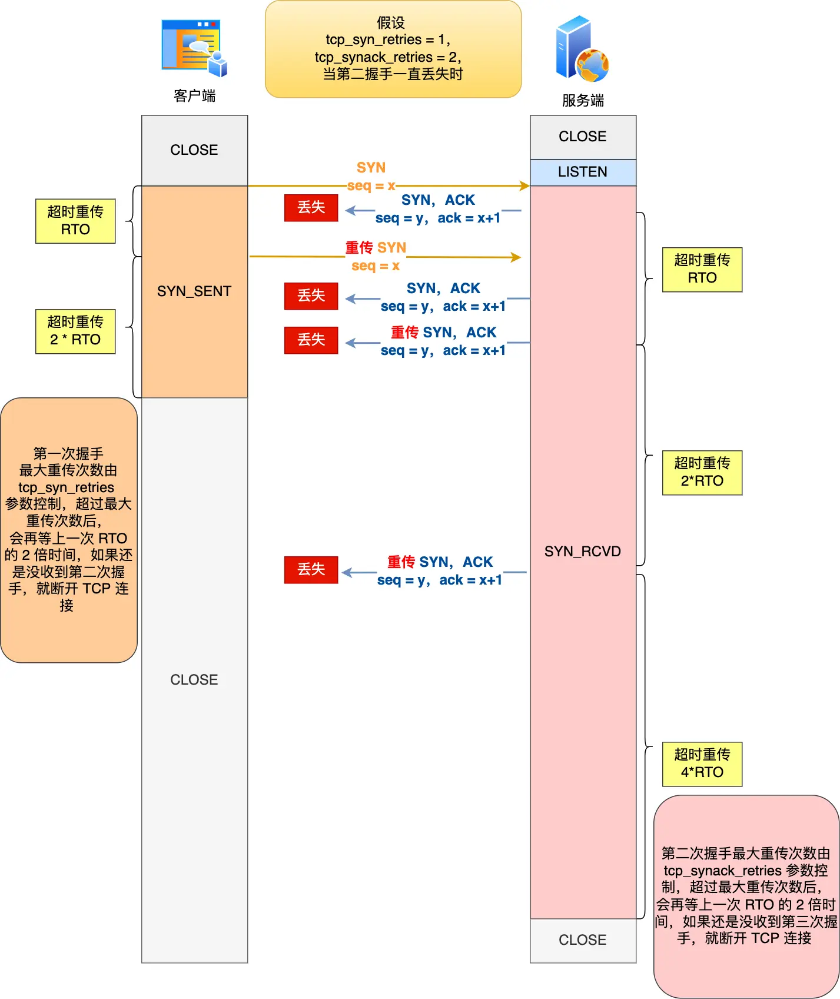

#### 第三次握手的ACK包丢失

> 为了模拟 TCP 第三次握手 ACK 包丢，我的实验方法是**在服务端配置防火墙，屏蔽客户端 TCP 报文中标志位是 ACK 的包**，也就是当服务端收到客户端的 TCP ACK 的报文时就会丢弃。iptables 配置命令如下：`iptables -I INPUT -s 192.168.12.37 -p tcp --tcp-flag ACK ACK -j DROP` 

在收到第二次握手的`SYN+ACK`包后，客户端就会进入ESTABLISHED 状态，如果第三次握手的 ACK服务端无法收到，则**服务端就会处于 SYN_RECV 状态**。

由于服务端一直收不到 TCP 第三次握手的 ACK，则会一直重传 SYN、ACK 包，直到重传次数超过`tcp_synack_retries` 值后，服务端就会断开 TCP 连接

> 客户端不会主动重发ACK

而客户端则会有两种情况：

- 如果客户端没发送数据包，一直处于 ESTABLISHED 状态，然后经过 2 小时 11 分 15 秒才可以发现一个「死亡」连接（保活机制），于是客户端连接就会断开连接

- 如果客户端发送了数据包，一直没有收到服务端对该数据包的确认报文，则会一直重传该数据包，直到重传次数超过 `tcp_retries2 `值（默认值 15 次）后，客户端就会断开 TCP 连接

  **TCP建立连接之后，数据包最大超时重传次数由内核参数`tcp_retries2`决定**


***如果第三次握手的ACK包丢失了，在重传的ACK包到达之前收到了客户端发送的第一个数据包，因为发送的第一个 「TCP 数据报文的序列号和确认号」都是和「第三次握手的 ACK 报文中序列号和确认号」一样的，并且该 TCP 数据报文也有将 ACK 标记位置为 1。所以，服务端收到这个数据报文，是可以正常完成连接的建立，然后就可以正常接收这个数据包了。***


## TCP四次挥手连接断开

### 挥手过程

连接的双方都可以主动断开连接，下图以客户端为主动断开方为例进行说明


- 客户端打算关闭连接，此时会发送一个 TCP 首部 `FIN` 标志位被置为 `1` 的报文，即 `FIN` 报文，随后客户端进入 `FIN_WAIT_1` 状态。
- 服务端收到该报文后，就向客户端发送 `ACK` 应答报文，接着服务端进入 `CLOSE_WAIT` 状态。
- 客户端收到服务端的 `ACK` 应答报文后，之后进入 `FIN_WAIT_2` 状态。
- 等待服务端处理完数据后，也向客户端发送 `FIN` 报文，之后服务端进入 `LAST_ACK` 状态。
- 客户端收到服务端的 `FIN` 报文后，回一个 `ACK` 应答报文，之后进入 `TIME_WAIT` 状态
- 服务端收到了 `ACK` 应答报文后，就进入了 `CLOSE` 状态，至此服务端已经完成连接的关闭。
- 客户端在经过 `2MSL` 一段时间后，自动进入 `CLOSE` 状态，至此客户端也完成连接的关闭。


### 为什么需要四次挥手

再来回顾下四次挥手双方发 `FIN` 包的过程，就能理解为什么需要四次了。

- 关闭连接时，客户端向服务端发送 `FIN` 时，仅仅表示客户端不再发送数据了但是还能接收数据。
- 服务端收到客户端的 `FIN` 报文时，先回一个 `ACK` 应答报文，而服务端可能还有数据需要处理和发送，等服务端不再发送数据时，才发送 `FIN` 报文给客户端来表示同意现在关闭连接。

从上面过程可知，**服务端通常需要等待完成数据的发送和处理，所以服务端的 `ACK` 和 `FIN` 一般都会分开发送，因此是需要四次挥手。**

但是**在特定情况下，四次挥手是可以变成三次挥手的**，当被动关闭方在 TCP 挥手过程中，「**没有数据要发送」并且「开启了 TCP 延迟确认机制」，那么第二和第三次挥手就会合并传输，这样就出现了三次挥手。**

而通常情况下，服务器端收到客户端的 `FIN` 后，很可能还没发送完数据，所以就会先回复客户端一个 `ACK` 包，稍等一会儿，完成所有数据包的发送后，才会发送 `FIN` 包，这也就是四次挥手了


### 四次挥手可以变成三次挥手吗

TCP之所以需要四次挥手断开连接是因为服务端应用程序可能还有数据要发送，所以并不能马上发送FIN报文，也就是说，第三次挥手的控制权不在内核，而在于应用程序，因为应用程序可能还有数据要发送，由应用程序决定什么时候调用关闭连接的函数，当调用了关闭连接的函数，内核就会发送 FIN 报文了，所以服务端的 ACK 和 FIN 一般都会分开发送。

> 但是FIN报文不一定非得由应用程序调用关闭连接的函数才能够被发送出去，这是因为如果进程退出了，不管是正常退出，还是异常退出（比如进程崩溃），内核为了释放进程所占用的资源，内核会发送出FIN报文与对端完成四次挥手

而且关闭连接的调用函数有两种`close`和`shutdown`，使用`close`是一种暴力的手段，主动断开放调用该方法之后会同时关闭读写两个方向，也就是说如果此时被动断开方有数据发来，主动断开方会响应一个RST报文，这会导致被动断开方异常断开，这是一种不优雅的关闭连接的方式。相对的，shutdown 函数因为可以指定只关闭发送方向而不关闭读取方向，所以即使在 TCP 四次挥手过程中，如果收到了服务端发送的数据，客户端也是可以正常读取到该数据的，然后就会经历完整的 TCP 四次挥手，所以我们常说，调用 shutdown 是优雅的关闭。

实际上，在我们抓包的过程中，很容易能够看到三次挥手，**当没有数据要发送并且开启了TCP延迟确认机制（默认开启）时，第二次挥手和第三次挥手就会合并传输，这样就出现了三次挥手的情况。**


### 为什么要有TIME_WAIT状态

- 防止旧连接的数据包被后面相同四元组的新连接收到
- 保证被动断开连接的一方能够完全的断开，即保证被动断开方能够收到最后的ACK报文

我们知道初始序列号是基于时钟周期生成的一个随机数，随后会逐渐增大，但是并不是无限增大的，因为序列号占32位，所以最多$2^{32}$，当超过这个数时，会重新开始计数，所以我们**不能够通过序列号来判断新老数据**

**如果没有`TIME_WAIT`状态或者该状态过短会有什么问题？**，如下图所示


- 服务端在关闭连接之前发送的 `SEQ = 301` 报文，被网络延迟了。
- 接着，服务端以相同的四元组重新打开了新连接，前面被延迟的 `SEQ = 301` 这时抵达了客户端，而且该数据报文的序列号刚好在客户端接收窗口内，因此客户端会正常接收这个数据报文，但是这个数据报文是上一个连接残留下来的，这样就产生数据错乱等严重的问题。

为了防止历史连接中的数据，被后面相同四元组的连接错误的接收，因此 TCP 设计了 TIME_WAIT 状态，状态会持续 `2MSL` 时长，这个时间**足以让两个方向上的数据包都被丢弃，使得原来连接的数据包在网络中都自然消失，再出现的数据包一定都是新建立连接所产生的。**


如果客户端（主动关闭方）最后一次 ACK 报文（第四次挥手）在网络中丢失了，那么按照 TCP 可靠性原则，服务端（被动关闭方）会重发 FIN 报文。

假设客户端没有 TIME_WAIT 状态，而是在发完最后一次回 ACK 报文就直接进入 CLOSE 状态，如果该 ACK 报文丢失了，服务端则重传的 FIN 报文，而这时客户端已经进入到关闭状态了，在收到服务端重传的 FIN 报文后，就会回 RST 报文。服务端收到RST后会将其解析为一个错误`Connection reset by peer`，虽然连接也是关闭了，但是对于TCP这种可靠的协议来说这种关闭方式是不够优雅的

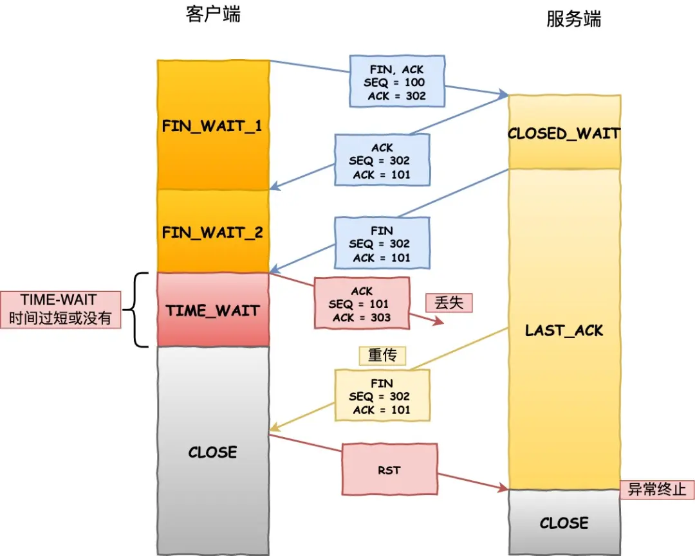

为了防止出现这样的情况，客户端必须等待足够长的时间确保服务端能够收到ACK，如果服务端没有收到ACK，就会触发TCP重传机制，服务端会发送一个FIN，这样一来一去最多刚好两个MSL的时间


> 客户端在收到服务端重传的 FIN 报文时，TIME_WAIT 状态的等待时间，会重置回 2MSL


而且这里还需要注意一个问题，**快速复用`TIME_WAIT`状态的端口可能导致新连接被回绕序列号的RST报文断开了**，而如果不跳过`TIME_WAIT`状态，而是停留了2MSL的时长，那么这个RST报文就不会出现在下一个连接中了

如下图所示，如果**被网络延迟 RST 报文这时抵达了客户端，而且 RST 报文的序列号在客户端的接收窗口内，由于防回绕序列号算法不会防止过期的 RST，所以 RST 报文会被客户端接受了，于是客户端的连接就断开了**。


综上，`tcp_tw_reuse`默认是关闭的原因等同于`TIME_WAIT`状态时间过短的危害，约等于为什么要有`TIME_WAIT`状态，那么我们就可以假设如果`tcp_tw_reuse`是开启的，那么`TIME_WAIT`状态的连接就会被快速复用，这样会出现下面的两类问题：

- 不能够防止历史数据被新的连接接收到，如果报文在接收方的接收窗口内，如果开启了时间戳`timestamps`，对于一般的报文可以通过PAWS机制将这些报文丢弃掉，如果没有开启时间戳就会造成数据混乱，但是**对于RST报文来说，即使时间戳小于当前时间，但是只要是在接受窗口内，同样会发挥作用**，将客户端的连接关闭掉
- 不能够保证被动断开方一定能够优雅的断开，如果最后一次挥手的ACK包丢失了，那么被动断开方会一直处于`LAST_ACK`的状态，如果连接被复用了，这时客户端（主动断开方）会主动发送一个SYN包，当处于`LAST_ACK`状态的服务端收到这个报文之后会返回给客户端一个`Challenge ACK`，客户端收到之后会返回给服务端一个RST报文


### 为什么TIME_WAIT的时间要设置为2MSL

首先说一下MSL和TTL的区别，MSL的单位是时间，TTL是经过的路由跳数，所以MSL要大于等于TTL消耗为0的时间，以确保报文已经被自然消亡

**TTL 的值一般是 64，Linux 将 MSL 设置为 30 秒，意味着 Linux 认为数据报文经过 64 个路由器的时间不会超过 30 秒，如果超过了，就认为报文已经消失在网络中了**


TIME_WAIT 等待 2 倍的 MSL，比较合理的解释是： 网络中可能存在来自发送方的数据包，当这些发送方的数据包被接收方处理后又会向对方发送响应，所以**一来一回需要等待 2 倍的时间**。

比如，如果被动关闭方没有收到断开连接的最后的 ACK 报文，就会触发超时重发 `FIN` 报文，另一方接收到 FIN 后，会重发 ACK 给被动关闭方， 一来一去正好 2 个 MSL。

可以看到 **2MSL时长** 这其实是相当于**至少允许报文丢失一次**。比如，若 ACK 在一个 MSL 内丢失，这样被动方重发的 FIN 会在第 2 个 MSL 内到达，TIME_WAIT 状态的连接可以应对。

为什么不是 4 或者 8 MSL 的时长呢？你可以想象一个丢包率达到百分之一的糟糕网络，连续两次丢包的概率只有万分之一，这个概率实在是太小了，忽略它比解决它更具性价比。

`2MSL` 的时间是从**客户端接收到 FIN 后发送 ACK 开始计时的**。如果在 TIME-WAIT 时间内，因为客户端的 ACK 没有传输到服务端，客户端又接收到了服务端重发的 FIN 报文，那么 **2MSL 时间将重新计时**。

在 Linux 系统里 `2MSL` 默认是 `60` 秒，那么一个 `MSL` 也就是 `30` 秒。**Linux 系统停留在 TIME_WAIT 的时间为固定的 60 秒**。这个值是被写死在Linux内核的代码中，如果想要修改`TIME_WAIT`的时间长度，只能够去修改内核中的值，并重新编译内核


### TIME_WAIT状态过多有什么危害

首先需要明确的是TIME_WAIT状态只出现在主动断开方，TIME_WAIT状态过多，对客户端和服务端的影响是不一样的

**如果客户端的TIME_WAIT状态过多，**占满了所有的端口，那么就无法对目的IP+目的PORT都一样的服务端发起连接了，但是被使用的端口，还是可以继续对另外一个服务端发起连接的。

> 也就是说，客户端的端口可以重复使用，具体见后面的`TCP 和 UDP 可以使用同一个端口吗？`

**如果服务端的TIME_WAIT状态过多，**并不会导致端口资源首先，因为服务端只监听一个端口，而且由于一个四元组唯一确定一个TCP连接，因此理论上服务端可以建立很多的连接，但是TCP连接过多，会占用系统资源，比如文件描述符、内存资源等，TIME_WAIT过多，资源迟迟得不到释放，会导致其他连接请求失败。


### 如何优化TIME_WAIT状态

方式大概有三种，都是通过修改内核参数的方式来完成


- 通过修改`net.ipv4.tcp_max_tw_buckets`，可以减少这么参数，表示最大处于time_wait状态的套接字信息，一般超过这个数值，那么处于time_wait状态的socket将会被立刻重置

- 打开`net.ipv4.tcp_tw_reuse`和`tcp_timestamps`，从字面意思中就就可以看出，`net.ipv4.tcp_tw_reuse`就是复用处于`time_wait`状态的socket连接，场景如下：

  ```
  某一方，需要不断的通过“短连接“连接其他服务器，总是自己先关闭连接(TIME_WAIT在自己这方)，关闭后又不断的重新连接对方。
  ```

  所以这就产生了一个问题，服务器是怎么判断重新连接的请求是新的连接还是旧连接上延迟的数据包，所以`net.ipv4.tcp_tw_reuse`通常和`tcp_timestamps`配合使用，也就是说给每一个数据包一个时间戳，通过时间戳来判断这个数据包是否过期

- 通过设置socket选项，来设置调用close关闭连接行为

  ```c
  struct linger so_linger;
  so_linger.l_onoff = 1;
  so_linger.l_linger = 0;
  setsockopt(s, SOL_SOCKET, SO_LINGER, &so_linger,sizeof(so_linger));
  ```

  如果`l_onoff`为非 0， 且`l_linger`值为 0，那么调用`close`后，会立该发送一个`RST`标志给对端，**该 `TCP` 连接将跳过四次挥手，也就跳过了TIME_WAIT状态，直接关闭。<font color=red>这种方式很危险，不推荐</font>**


虽然TIME_WAIT需要等待2MSL，看起来是不够友好的，但是**TIME_WAIT 本质上是有助于我们的，不要试图避免这个状态，而是应该弄清楚它**。

**如果服务端要避免过多的 TIME_WAIT 状态的连接，就永远不要主动断开连接，让客户端去断开，由分布在各处的客户端去承受 TIME_WAIT**


### 服务端出现大量TIME_WAIT的原因是什么

首先要知道 TIME_WAIT 状态是主动关闭连接方才会出现的状态，所以如果服务器出现大量的 TIME_WAIT 状态的 TCP 连接，就是说明服务器主动断开了很多 TCP 连接。那么问题来了，**什么情况下服务端会主动断开连接呢？**

- 第一个场景：HTTP没有使用长连接
- 第二个场景：HTTP长连接超时
- 第三个场景：HTTP长连接的请求数量达到上限

#### HTTP没有使用长连接

我们知道了从HTTP/1.1开始就默认长连接了，也就是请求的header头部`Connection`字段的值默认为`Keep-Alive`，如果想要关闭HTTP `Keep-Alive`，需要在请求或响应时将头部中的`Connection`字段修改为`closed`，**只要客户端和服务端任意一方的 HTTP header 中有 `Connection:close` 信息，那么就无法使用 HTTP 长连接的机制**。

短连接中每次请求都会经历这样的过程：建立TCP连接 ---> 发起请求 ---> 返回响应 ---> 释放连接

**虽然客户端和服务端都能够主动关闭连接，但是大多数Web服务器的实现是不管哪一方禁用了长连接，都是由服务端来主动关闭连接的，所以服务端出现大量TIME_WAIT状态的原因很可能是处于一种短连接、高并发的业务场景中。**

因此，**当服务端出现大量的 TIME_WAIT 状态连接的时候，可以排查下是否客户端和服务端都开启了 HTTP Keep-Alive**，因为任意一方没有开启 HTTP Keep-Alive，都会导致服务端在处理完一个 HTTP 请求后，就主动关闭连接，此时服务端上就会出现大量的 TIME_WAIT 状态的连接。

针对这个场景下，解决的方式也很简单，让客户端和服务端都开启 HTTP Keep-Alive 机制。


#### HTTP长连接超时

HTTP 长连接的特点是，只要任意一端没有明确提出断开连接，则保持 TCP 连接状态。HTTP 长连接可以在同一个 TCP 连接上接收和发送多个 HTTP 请求/应答，从而避免了连接建立和释放的开销。

但是如果存在一个这样的场景：长连接建立之后，客户端就发送了一个请求之后便不再发起新的HTTP请求，这样实际上时会造成资源浪费的，为了解决这个问题，web 服务软件一般都会提供一个参数，用来指定 HTTP 长连接的超时时间，比如 `Nginx` 提供的 `keepalive_timeout` 参数

假设设置了 HTTP 长连接的超时时间是 60 秒，`Nginx`就会启动一个「定时器」，**如果客户端在完后一个 HTTP 请求后，在 60 秒内都没有再发起新的请求，定时器的时间一到，`Nginx`就会触发回调函数来关闭该连接，那么此时服务端上就会出现 TIME_WAIT 状态的连接**。

当服务端出现大量 TIME_WAIT 状态的连接时，如果现象是有大量的客户端建立完 TCP 连接后，很长一段时间没有发送数据，那么大概率就是因为 HTTP 长连接超时，导致服务端主动关闭连接，产生大量处于 TIME_WAIT 状态的连接。

可以往网络问题的方向排查，比如是否是因为网络问题，导致客户端发送的数据一直没有被服务端接收到，以至于 HTTP 长连接超时。


#### HTTP长连接的请求数量达到上限

Web服务端通常会有一个参数来定义一条HTTP长连接上最大能处理的请求数量，当超过最大限制时，就会主动关闭连接

比如`Nginx`的`keepalive_requests`参数，这个参数是指一个HTTP长连接建立之后，`Nginx`就会为这个连接设置一个计数器，记录这个长连接上已经接收并处理的客户端的请求数量，如果达到设置的最大值，则`Nginx`会主动关闭这个长连接，那么此时服务端上就会出现处于TIME_WAIT状态的连接

keepalive_requests 参数的默认值是 100 ，意味着每个 HTTP 长连接最多只能跑 100 次请求，这个参数往往被大多数人忽略，因为当 QPS (每秒请求数) 不是很高时，默认值 100 凑合够用。

但是，**对于一些 QPS 比较高的场景，比如超过 10000 QPS，甚至达到 30000 , 50000 甚至更高，如果 keepalive_requests 参数值是 100，这时候就 `Nginx`就会很频繁地关闭连接，那么此时服务端上就会出大量的 TIME_WAIT 状态**。

针对这个场景下，解决的方式也很简单，调大 `Nginx`的 keepalive_requests 参数就行。


### 在 TCP 正常挥手过程中，处于 TIME_WAIT 状态的连接，收到相同四元组的 SYN 后会发生什么？

如果双方开启了时间戳机制：

- 如果客户端的 SYN 的「序列号」比服务端「期望下一个收到的序列号」要**大**，**并且**SYN 的「时间戳」比服务端「最后收到的报文的时间戳」要**大**。那么就会重用该四元组连接，跳过 2MSL 而转变为 SYN_RECV 状态，接着就能**进行建立连接过程。**
- 如果客户端的 SYN 的「序列号」比服务端「期望下一个收到的序列号」要**小**，**或者**SYN 的「时间戳」比服务端「最后收到的报文的时间戳」要**小**。那么就会**再回复一个第四次挥手的 ACK 报文，客户端收到后，发现并不是自己期望收到确认号，就回 RST 报文给服务端**。

*在 TIME_WAIT 状态，收到 RST 会断开连接吗？*

- 如果 `net.ipv4.tcp_rfc1337` 参数为 0，则提前结束 TIME_WAIT 状态，释放连接。
- 如果 `net.ipv4.tcp_rfc1337` 参数为 1，则会丢掉该 RST 报文。


### 四次挥手中收到乱序的FIN包会如何处理

这个问题的场景是：调用`shutdown`函数主动方关闭写端，假如服务端在二三次挥手之间发的数据包或者是四次挥手之前的数据包，因为网络阻塞导致第三次挥手的FIN包比数据包先到达主动断开方，会发生什么样的情况？

如果FIN包比数据包先抵达客户端，此时FIN报文其实是一个乱序的报文，**此时客户端的TCP连接并不会从`FIN_WAIT_2`状态转换到`TIME_WAIT`状态**

在`FIN_WAIT_2`状态时，如果收到乱序的FIN报文，那么就会**被加入到乱序队列**中，并不会进入到TIME_WAIT状态。

等再次收到被网络延迟的数据包时，会判断乱序队列中有没有数据，然后会检测乱序队列中是否有可用的数据，如果能在乱序队列中找到与当前报文的序列号是顺序排列的，就会看该报文是否有FIN标志，如果发现了FIN标志，则主动断开方才会进入TIME_WAIT状态。


### 服务端出现大量CLOSE_WAIT的原因是什么

CLOSE_WAIT 状态是「被动关闭方」才会有的状态，而且如果「被动关闭方」没有调用 close 函数关闭连接，那么就无法发出 FIN 报文，从而无法使得 CLOSE_WAIT 状态的连接转变为 LAST_ACK 状态。

所以，**当服务端出现大量 CLOSE_WAIT 状态的连接的时候，说明服务端的程序没有调用 close 函数关闭连接**。

**当服务端出现大量 CLOSE_WAIT 状态的连接的时候，通常都是代码的问题，这时候我们需要针对具体的代码一步一步的进行排查和定位，主要分析的方向就是服务端为什么没有调用 close**


> 我们先来分析一个普通的 TCP 服务端的流程：
>
> 1. 创建服务端 socket，bind 绑定端口、listen 监听端口
> 2. 将服务端 socket 注册到 epoll
> 3. epoll_wait 等待连接到来，连接到来时，调用 accpet 获取已连接的 socket
> 4. 将已连接的 socket 注册到 epoll
> 5. epoll_wait 等待事件发生
> 6. 对方连接关闭时，我方调用 close
>
> 可能导致服务端没有调用 close 函数的原因，如下。
>
> **第一个原因**：第 2 步没有做，没有将服务端 socket 注册到 epoll，这样有新连接到来时，服务端没办法感知这个事件，也就无法获取到已连接的 socket，那服务端自然就没机会对 socket 调用 close 函数了。
>
> 不过这种原因发生的概率比较小，这种属于明显的代码逻辑 bug，在前期 read view 阶段就能发现的了。
>
> **第二个原因**： 第 3 步没有做，有新连接到来时没有调用 accpet 获取该连接的 socket，导致当有大量的客户端主动断开了连接，而服务端没机会对这些 socket 调用 close 函数，从而导致服务端出现大量 CLOSE_WAIT 状态的连接。
>
> 发生这种情况可能是因为服务端在执行 accpet 函数之前，代码卡在某一个逻辑或者提前抛出了异常。
>
> **第三个原因**：第 4 步没有做，通过 accpet 获取已连接的 socket 后，没有将其注册到 epoll，导致后续收到 FIN 报文的时候，服务端没办法感知这个事件，那服务端就没机会调用 close 函数了。
>
> 发生这种情况可能是因为服务端在将已连接的 socket 注册到 epoll 之前，代码卡在某一个逻辑或者提前抛出了异常。之前看到过别人解决 close_wait 问题的实践文章，感兴趣的可以看看：[一次 Netty 代码不健壮导致的大量 CLOSE_WAIT 连接原因分析(opens new window)](https://mp.weixin.qq.com/s?__biz=MzU3Njk0MTc3Ng==&mid=2247486020&idx=1&sn=f7cf41aec28e2e10a46228a64b1c0a5c&scene=21#wechat_redirect)
>
> **第四个原因**：第 6 步没有做，当发现客户端关闭连接后，服务端没有执行 close 函数，可能是因为代码漏处理，或者是在执行 close 函数之前，代码卡在某一个逻辑，比如发生死锁等等。


## 连接双方同时关闭

由于TCP是全双工的通信协议，所以是会出现双方同时关闭连接的现象，也就是同时发送了FIN报文，此时，双方都认为自己是主动方，所以都进入FIN_WAIT1状态，FIN报文的重传次数仍然由内核参数`tcp_orphan_retires`参数控制。接下来，**双方进入等待ACK报文的过程中，都等来了FIN报文，这是一种新情况，所以连接会进入一种叫做CLOSING的新状态，它替代了`FIN_WAIT2`状态。**接着双方内核回复ACK确认对方发送通道的关闭后，进入`TIME_WAIT`状态，等待2MSL时间后，连接自动关闭。


### TCP四次挥手过程中的异常情况

#### 第一次挥手的FIN包丢失

如果第一次挥手丢失了，那么客户端迟迟收不到被动方的 ACK 的话，也就会触发超时重传机制，重传 FIN 报文，重发次数由 `tcp_orphan_retries` 参数控制。

当客户端重传 FIN 报文的次数超过 `tcp_orphan_retries` 后，会直接进入到 `close` 状态。


如果 FIN_WAIT1 状态连接很多，我们就需要考虑降低 `tcp_orphan_retries` 的值，因为当重传次数超过` tcp_orphan_retries` 时，连接就会直接关闭掉

对于普通情况，调低`tcp_orphans_retries`就已经足够了，但是如果遇到恶意攻击，FIN报文根本无法发送出去，这是由于TCP的两个特性造成的：

- 首先，TCP必须保证报文是有序发送的，FIN报文也不例外，当发送缓存区还有数据没有发送时，FIN报文也不能提前发送

  > 即使调用的是close，当前发送缓冲区的数据还是会被发送出去，FIN会被插到这些数据的后面，表示后续不会再有数据来了

- 其次，TCP有流量控制功能，当接收方的接收窗口变为0时，发送方就不能再发送数据了，所以，当攻击者下载大文件时，就可以通过接收窗口设为0，这就会使得FIN报文都无法发送出去，那么连接就会一直处于FIN_WAIT1状态

为了解决上面这种问题，需要**调整`tcp_max_orphans`参数，它定义了孤儿连接的最大数量，**当进程调用了 `close` 函数关闭连接，此时连接就会是「孤儿连接」，因为它无法再发送和接收数据。Linux 系统为了防止孤儿连接过多，导致系统资源长时间被占用，就提供了 `tcp_max_orphans` 参数。如果孤儿连接数量大于它，新增的孤儿连接将不再走四次挥手，而是直接发送 RST 复位报文强制关闭。


#### 第二次挥手ACK丢失

如果服务端的第二次挥手丢失了，客户端就会触发超时重传机制，重传 FIN 报文，直到收到服务端的第二次挥手，或者达到最大的重传次数。


#### 第三次挥手FIN包丢失

在这个过程中内核是没有权利替代进程关闭连接的，必须由进程主动调用 close 函数来触发服务端发送 FIN 报文。

服务端处于 CLOSE_WAIT 状态时，调用了 close 函数，内核就会发出 FIN 报文，同时连接进入 LAST_ACK 状态，等待客户端返回 ACK 来确认连接关闭。

如果迟迟收不到这个 ACK，服务端就会重发 FIN 报文，重发次数仍然由 `tcp_orphan_retries`参数控制，这与客户端重发 FIN 报文的重传次数控制方式是一样的

其实这里还涉及到了一个问题，在收到第二次挥手的包之后，主动断开方进入了`FIN_WAIT2`阶段，对于这个阶段其实有一些说法：

- 如果**主动断开方调用的是close**，（这种连接又叫孤儿连接）则表示主动断开方无法再发送和接收数据，所以`FIN_WAIT2` 状态不可以持续太久，而 `tcp_fin_timeout` 控制了这个状态下连接的持续时长，默认值是 60 秒。这意味着对于调用 close 关闭的连接，如果在 60 秒后还没有收到 FIN 报文，客户端（主动关闭方）的连接就会直接关闭

- 如果**主动关闭方使用 shutdown** 函数关闭连接，指定了只关闭发送方向，而接收方向并没有关闭，那么意味着主动关闭方还是可以接收数据的。此时，如果主动关闭方一直没收到第三次挥手，那么主动关闭方的连接将会一直处于 `FIN_WAIT2` 状态（`tcp_fin_timeout` 无法控制 shutdown 关闭的连接）


#### 第四次挥手ACK包丢失

服务端（被动关闭方）没有收到 ACK 报文前，还是处于 LAST_ACK 状态。如果第四次挥手的 ACK 报文没有到达服务端，服务端就会重发 FIN 报文，重发次数仍然由前面介绍过的 `tcp_orphan_retries` 参数控制。


## Socket编程

### 基于TCP协议通信的网络编程模型


- 客户端和服务端初始化socket，得到各自的文件描述符
- 服务器通过调用bind函数，使得socket绑定自身的IP地址和端口号
- 服务器通过调用listen函数，来进行监听
- 客户端通过调用`connect`函数向服务器socket绑定的IP地址和端口发起三次握手请求
- 服务器通过调用accept函数，得到已经完全连接的socket的文件描述符，用来后续的数据传输
- 客户端断开连接的时候，会调用`close`，将EOF写入到FIN报文中，当服务器读取到这个EOF时，待处理完数据之后，也会调用close，从而关闭连接

上述过程中需要注意的是，服务端在调用accept之后，会得到一个已经完全连接成功的socket，通过这个socket来进行后续的数据传输，所以**监听的socket和实际用来传输数据的socket是两个不同的socket**，一个叫做**监听socket**，另一个叫作**已完成连接socket**

**连接成功建立之后，客户端和服务器都可以向已完成连接socket中写入和读取数据，类似于一个双向的文件流**


> 接下来我们看一下这个listen函数

```c
int listen(int socketfd, int backlog)
```

- `socketfd`表示监听socket的文件表描述符

- `backlog`在不同版本中的含义发生了变化


我们知道，在TCP三次握手的过程中Linux内核会维护两个队列

- SYN队列，又叫半连接队列，当服务端收到来自客户端的SYN请求连接报文的时候，会将这个连接加入到SYN队列，此时服务器处于SYN_RCVD状态
- ACCEPT队列，又叫全连接队列，当服务器收到来自客户端的ACK确认连接报文之后，会将连接从SYN队列中移除，并加入到ACCEPT队列中，此时双方都处于`ESTABLISHED`状态

在早期的Linux内核中，backlog表示的就是SYN半连接队列的长度

在Linux内核2.2之后，backlog变成了accept队列的长度，但是backlog的上限是`somaxconn`的大小，也就是所全连接队列的长度等于`min{backlog, somaxconn}`


> **connect和accept分别是在三次握手的哪次握手中返回的**

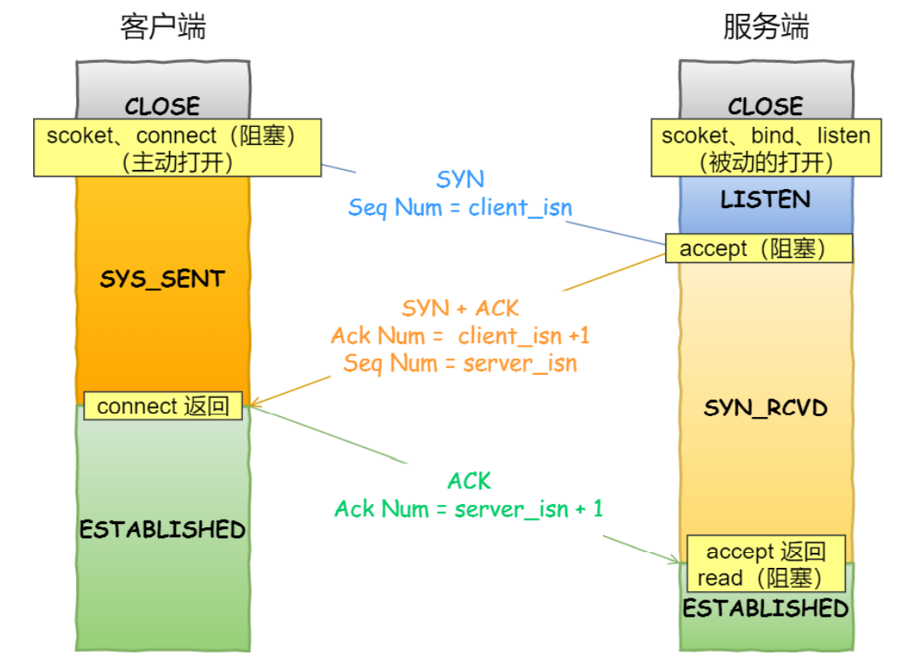

从上图中可以看出，当客户端收到来自己服务器的ACK报文之后，connect才会成功返回，也就是说**connect的成功返回是在第二次握手结束之后**；而**accept是在第三次握手结束之后，**也就是连接完全建立好他才会成功返回，所以**即使服务端没有调用accept，三次握手照样进行，连接照样是能够被正常建立起来的**


> close在四次挥手中的使用时机


- 客户端调用 `close`，表明客户端没有数据需要发送了，则此时会向服务端发送 FIN 报文，进入 FIN_WAIT_1 状态；

- 服务端接收到了 FIN 报文，TCP 协议栈会为 FIN 包插入一个文件结束符 `EOF` 到接收缓冲区中，应用程序可以通过 `read` 调用来感知这个 FIN 包。这个 `EOF` 会被**放在已排队等候的其他已接收的数据之后**，这就意味着服务端需要处理这种异常情况，因为 EOF 表示在该连接上再无额外数据到达。此时，服务端进入 CLOSE_WAIT 状态；

  > 这也就意味着通过伪造一个四元组相同的RST报文来断开连接是不可取的，因为即使服务端收到了RST报文，因为报文的序列号不是服务端所期望的，这个RST包也是会被丢弃掉，**要伪造一个能关闭 TCP 连接的 RST 报文，必须同时满足「四元组相同」和「序列号是对方期望的」这两个条件**，但是可以通过向相同四元组的服务端发送SYN包，来获取seq和ack的值，从而伪造出两个RST包，分别关闭客户端和服务端

- 接着，当处理完数据后，自然就会读到 `EOF`，于是也调用 `close` 关闭它的套接字，这会使得服务端发出一个 FIN 包，之后处于 LAST_ACK 状态；

- 客户端接收到服务端的 FIN 包，并发送 ACK 确认包给服务端，此时客户端将进入 TIME_WAIT 状态；

- 服务端收到 ACK 确认包后，就进入了最后的 CLOSE 状态；

- 客户端经过 `2MSL` 时间之后，也进入 CLOSE 状态；


> **最后，再补充一下time_wait**

我们在前一天写到了只有主动断开连接的一方才有time_wait状态，主动断开连接方是客户端还是服务端造成的危害是不同的：

- 对于客户端而言，过多的time_wait会导致端口不足，因为端口被占用而无法创建新的连接
- 对于服务端而言，过多的time_wait会导致服务器资源被耗尽，虽然服务器只监听一个端口，但是理论上可以处理很多个连接，因为服务器会把连接交给线程池来处理，所以监听的端口可以一直监听，但是线程池中的线程是有限的，处理不了那么多一直不断地连接，所以当在有新连接来的时候，就不能够处理了


### 基于UDP协议通信的网络编程模型


因为UDP是无连接的传输层协议，所以不需要三次握手，也不需要向TCP那样调用`listen`和`connect`，但是UDP通信仍然需要IP地址和端口，所以还需要bind函数

对于UDP来说，不需要维护连接，也就没有了所谓的发送方和传输方，甚至都可以不存在客户端和服务端的概念，只要有一个socket多台机器之间就可以相互通信，因此每一个UDP的socket都需要bind

另外，**每次通信时，都需要调用 `sendto` 和 `recvfrom` ，都要传入目标主机的IP地址和端口**


### 针对本地进程间通信的网络编程模型

- 本地socket编程的接口和IPv4，IPv6套接字编程的接口是一致的，**都可以支持字节流和数据报两种形式**
- 很明显，**本地socket的效率要比IPv4，IPv6的socket实现高的多**


对于本地字节流socket，其socket类型是 AF_LOCAL 和 SOCK_STREAM 

对于本地数据报socket，其socket类型是 AF_LOCAL 和 SOCK_DGRAM


**本地字节流socket和本地数据报socket在bind的时候，不像TCP和UDP那样需要绑定端口号和IP，而是需要绑定一个本地文件，这也是Socket本地通信和网络通信的最大区别**


## TCP重传（解决丢包）

我们知道，**TCP实现可靠传输的方式之一就是通过序列号和确认应答号**

在TCP中，当发送端的数据到达接收端的时候，接收端主机会返回一个确认应答消息，表示已经收到了消息，如下图

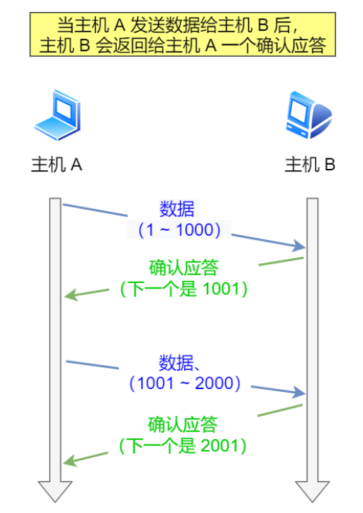

但是在错综复杂的网络环境中，并不能够保证上图中的过程一定能够顺利进行，有可能数据在传输过程中丢失，也有可能确认应答消息在传输中丢失，所以我们需要一个机制来保证接收方一定能够收到发送方的数据，这个机制就是**重传机制**，重传机制大致上分成了四个方法：超时重传、快速重传、SACK、D-SACK


### 超时重传

超时重传指的就是在发送数据的时候设置一个定时器，当超过指定的时间之后，如果没有收到对方的ACK确认应答报文，就会重发数据

TCP会在以下两种情况触发超时重传：

- 数据包丢失
- 确认应答信息丢失


**超时重传时间（Retransmission Timeout,RTO）一般要比RTT（Round Trip Time）稍微大一点**，如果RTO过大或者过小会有什么后果？

- 如果RTO过大，数据包/确认应答信息丢失了很长一段时间之后，才会触发重传，效率低
- 如果RTO过小，有可能数据包/确认应答信息并没有丢失，只是因为网络比较拥堵，到达对端的时间比较长，这样会增大网络的压力，增大拥堵，导致更多的重传，导致更拥堵的网络环境

Linux中有一套机制来计算RTO的值，具体就不展开了，大致思路是：

- 需要TCP通过采样RTT的时间，然后进行加权平均，算出一个平滑的RTT的值，而且这个值还是要不断变化的，因为网络状况在不断地变化
- 除了采样RTT的时间，还需要采样RTT的波动范围，这样就避免了如果RTT有一个很大的波动的话，很难被发现的情况


如果超时重传的数据包/确认应答包再次超时，又需要重传的时候，TCP的策略是**超时时间加倍**

**也就是当每一次遇到超时重传的时候，都会将下一次超时重传时间的间隔设置为之前的两倍，两次超时说明目前网络环境较差，不适合频繁发送数据包**

因此，可以看出，超时重传的超时时间周期会比较长，为了解决这个问题，又出现了快速重传


### 快速重传

通过前面对超时重传的描述，我们知道了**超时重传是以时间驱动，而快速重传则是以数据驱动**


可以看出，快速重传的思想就是当重复收到三个相同的ACK时，就会触发重传机制

但是，快速重传中存在一个问题，比如上图中，收到了三个相同的ACK2，我们知道Seq2肯定是丢失了，但是我们不知道的是Seq3，Seq4，Seq5有没有丢失，比如下图：


Seq2和Seq5都丢失了，但是当Seq6的ACK2被接收到的时候，左侧的发送方是不知道Seq5也是丢失的，因此这时候不知道是只重发Seq2还是重发Seq2，Seq3，Seq4，Seq5（Seq2到Seq6之间的数据包）

**总结一下，快速重传只是解决了超时重传中的时间问题，但是快速重传不知道是重传之前的一个数据包，还是重传的所有数据包**

举个例子，假设发送方发了 6 个数据，编号的顺序是 Seq1 ~ Seq6 ，但是 Seq2、Seq3 都丢失了，那么接收方在收到 Seq4、Seq5、Seq6 时，都是回复 ACK2 给发送方，但是发送方并不清楚这连续的 ACK2 是接收方收到哪个报文而回复的， 那是选择重传 Seq2 一个报文，还是重传 Seq2 之后已发送的所有报文呢（Seq2、Seq3、 Seq4、Seq5、 Seq6） 呢？

- 如果只选择重传 Seq2 一个报文，那么重传的效率很低。因为对于丢失的 Seq3 报文，还得在后续收到三个重复的 ACK3 才能触发重传。
- 如果选择重传 Seq2 之后已发送的所有报文，虽然能同时重传已丢失的 Seq2 和 Seq3 报文，但是 Seq4、Seq5、Seq6 的报文是已经被接收过了，对于重传 Seq4 ～Seq6 折部分数据相当于做了一次无用功，浪费资源。

可以看到，不管是重传一个报文，还是重传已发送的报文，都存在问题。

为了解决快速重传中的这个问题，SACK机制出现了，SACK是为了解决快速重传不知道传输哪些TCP报文而诞生的


### SACK

SACK（Selective Acknowledgment，选择性确认），这种方式需要在TCP报文头部的**`选项`**字段加上SACK字段，**它可以将缓存的地图发送给发送方，**这样发送方就知道了哪些包被收到了，哪些包没有被收到，知道了这些信息，发送方就可以只重发没有被收到的数据包了


如上图，发送方收到了三次相同的ACK报文，则会立刻触发快速重传机制，通过SACK信息发现只有200~300这段的数据丢失，则重发时，就只选择了TCP段进行重复

**如果要支持SACK，必须双方都要支持**，在Linux中，通过`net.ipv4.tcp_sack`参数打开这个功能（Linux2.4以后默认打开）

```
linux CentOs7中Linux参数在/etc/sysctl.conf中设置
链接中是TCP的一些参数：https://www.cnblogs.com/jdonson/p/4746094.html
```


### D-SACK

**全称Duplicate SACK，主要使用了SACK来告诉发送方有哪些数据被重复接收了**

> 例子1：ACK丢包


- 接收方给发送方发送的两个ACK报文都丢失，所以发送方超时之后，会重传第一个数据包（3000~3499）
- 接收方收到这个重传的数据包之后，发现数据是重复收到的，于是回了一个SACK=3000~3500，告诉发送方3000-3500这段的数据早就收到了，而ACK=4000，又表示4000之前的所有数据已经收到了，所以这个SACK就代表着D-SACK
- 这样发送方就知道了数据没有丢，只是接收方的ACK确认报文丢失了


> 例子2：网络延时


- 数据包1000-1499被网络延迟了，导致发送方没有收到ACK1500的确认报文
- 而后面报文到达的三个相同的ACK确认报文，使得发送方出发快速重传机制，但是在重传之后被延迟的1000-1499数据包又到了接收方
- 所以接收方会回复一个SACK=1000-1500，表示这个数据包已经收到过了，因为ACK已经到了3000，所以这个SACK是D-SACK，表示收到了重复的包
- 这样发送方就能够知道触发快速重传的原因不是发出去的包丢了，而是被网络延迟了


所以D-SACK有以下的好处：

- 可以让发送方知道是他自己发出去的包丢了，还是接收方回复的ACK包丢了
- 可以让发送方知道自己发出去的包是丢了，还是因为网络延迟没有到
- 可以知道网络中是否把发送方的数据包给复制了


在Linux中通过`net.ipv4.tcp_dsack`来开D-SACK，在Linux2.4以后是默认开启的


> 好像是重复的包被收到，SACK的值是要小于ACK的，这种情况下是D-SACK，如果SACK的值大于ACK，说明是丢包了，这种情况下就是SACK了


## 滑动窗口

前面我们提到过，TCP是每发送一个数据就会收到一个应答，只有收到应答之后才能够继续发送数据，相当于`我说一句话，对方回我一句，然后我再说下一句话`，这样的效率明显是很低的，而且**包的往返时间越长，网络的吞吐量就越低**


因此，为了提高系统的吞吐量，TCP出现了滑动窗口机制，**窗口大小指的就是无需确认等待应答，就可以继续发送数据的最大值**

**窗口的实现实际上是在操作系统上开辟一个缓冲区，** *发送方在收到确认应答之前，必须在缓冲区保留发送出去的数据（确保可靠传输，丢包后可以重传）*，如果按期收到确认应答，此时数据就可以从缓冲区中去除

假设窗口的大小为3个TCP段，那么发送方就可以连续发送3个TCP段，并且中途若有ACK丢失，可以通过下一个确认应答进行确认，如下图：


图中的ACK 600确认应答报文丢失，也没有关系，因为可以通过下面的ACK 700来进行确认，ACK 700表示的是700之前的数据都已经收到了，这种模式就叫做**累计确认**或者**累计应答**


> <font color=red>**窗口的大小通常由接收方来确定**</font>

TCP的头部字段中有一个Window，也就是窗口大小

**这个字段是接收端告诉发送方自己还有多少缓冲区可以接收数据**，于是发送端就可以根据这个接收端的处理能力来发送数据，从而不至于导致接收端处理不过来，所以窗口的大小通常是由接收端的窗口大小决定的，发送方发送的数据大小不能够超过接收方窗口的大小，否则接收方就没办法正常处理接收到的数据了


>**<font color=red>发送方的滑动窗口</font>**

发送方的滑动窗口根据处理情况分成了四个部分：


- `#1`已发送并且已经收到ACK确认的数据
- `#2`已发送但是还没有收到ACK确认的数据
- `#3`未发送但总大小在接收方处理范围之内的数据，叫做可用窗口大小
- `#4`未发送但是总大小在接收方处理范围之外的数据

当发送方把自己可用窗口中的数据全部发送出去之后，`#2`和`#3`区域合并，`#3`区域变为0，意味着此时发送方的可用窗口变为0，表明**可用窗口耗尽，在没有收到ACK确认之前无法继续发送数据**，如下图


接着，如果发送方收到了之前发送的`32~36`区域的ACK确认应答报文，**如果此时发送方窗口大小没有变化**，那么滑动窗口将向右滑动5个单位，因为前面是`32~36`5个单位的报文被收到了，接下来，`52~56`又变成了可用窗口，那么后续也就可以发送`52~56`这5个字节的数据了


> <font color=red>**程序是如何表示发送窗口的四个部分的呢？**</font>

TCP滑动窗口方案使用三个指针来跟踪四个传输类别中的每一个类别中的字节，其中两个指针是绝对指针（指特定的序列号），一个是相对指针（需要做偏移）


1. 第一个指针，`SND.WND`表示的是发送窗口的大小，这个指针是相对指针，因为它需要由接收方窗口来指定，可能发生变化
2. 第二个指针，`SND.UNA`指向的是已发送但是还没有收到ACK确认的数据的第一个字节的序列号（`#2`的第一个字节的序列号），这个指针是一个绝对指针
3. 第三个指针，`SND_NXT`指向的是未发送但是总大小在接收方处理范围内的第一个字节的序列号（`#3`的第一个字节的序列号），这个指针是一个绝对指针
4. 通过前面的三个指针，我们就能够算出可用窗口的大小`SND.WND-(SND.NXT-SND.UNA)`，同时也能够算出`#4`区域的开头位置，通过`SND.UNA+SUN.WND`就可以得到这个位置


><font color=red>**程序是如何表示接收窗口**</font>

接收窗口相较于发送窗口比较简单，根据处理情况他能够分成3个部分，通过两个指针能够表示这三个部分

- `#1 + #2`，表示接收方已经成功接收并确认的数据，这部分数据等待被应用进程读取就好了
- `#3`表示未收到但是可以接收的数据
- `#4`表示未收到但是不可以接受的数据


1. `RCV.WND`表示接收窗口的大小，他会被通知给发送方
2. `RCV.NXT`表示的是期望从发送方发送来的下一个数据字节的序列号，也就是`#3`的第一个字节
3. 指向`#4`的是一个相对指针，能够通过`RCV.NXT+RCV.WND`算出来


> **<font color=red>接收窗口和发送窗口是完全相等的吗</font>**

**并不是完全相等，而是发送窗口约等于接收方窗口，为什么这么说呢？**

因为我们知道滑动窗口并不是一成不变的，比如当接收方的应用程序读取数据非常快的时候，接收窗口就会很快的空闲出来，可能会调大接收方窗口的大小，那么新的接收窗口大小，是通过 TCP 报⽂中的 Windows 字段来告诉发送方。那么这个传输过程是存在时延的，所以接收窗口和发送窗口是约等于的关系

> 而且如果考虑到阻塞窗口，那么发送窗口其实是min{阻塞窗口，接收窗口}


> **<font color=red>窗口大小</font>**

通过TCP的报文头部字段可以知道，窗口字段的长度为16位，所以窗口一次性最多能够发送的数据是$2^{16}=64k$，在当今高速网络下，很明显是不够用的，所以后续有了扩充窗口的方法：在TCP选项字段定义了窗口扩大因子，用于扩大TCP通告窗口，其值是$2^{14}$，也就是说目前窗口最大可达到$2^{30}=1G$

> **在Linux中通过`/proc/sys/net/ipv4/tcp_window_scaling`来启用窗口扩大因子**
>
> 要使用窗口扩大选项，通讯双方必须在各自的 SYN 报文中发送这个选项： 
>
> - 主动建立连接的一方在 SYN 报文中发送这个选项 
> - 而被动建立连接的一方只有在收到带窗口扩大选项的 SYN 报文之后才能发送这个选项

这样看来，只要进程能及时地调用 read 函数读取数据，并且接收缓冲区配置得足够大，那么接收窗口就可以无限地放大，发送方也就无限地提升发送速度。

**这是不可能的，因为网络的传输能力是有限的，当发送方依据发送窗口，发送超过网络处理能力的报文时，路由器会直接丢弃这些报文。因此，缓冲区的内存并不是越大越好**


> **<font color=red>带宽时延积</font>**

上面说到了，窗口并不是越大越好，因为网络的传输能力是有限的，我们直到在考虑拥塞控制的情况下，发送窗口约等于min{拥塞窗口，接收方窗口}，但是这里有一个新概念，带宽时延积，它决定网络中飞行报文的大小，也就是在网络线路、路由器等网络设备中的报文数量，他的计算方式是

```tex
带宽时延积BDP=RTT*带宽
```

**由于发送缓冲区大小决定了发送窗口的上限，而发送窗口又决定了「已发送未确认」的飞行报文的上限。因此，发送缓冲区不能超过「带宽时延积」**

最理想的情况就是发送缓冲区的大小向带宽时延积靠近


> **<font color=red>发送缓冲区和接收缓冲区的调整</font>**

发送缓冲区的范围可以通过内核参数`tcp_wmem`来调整，如下图所示

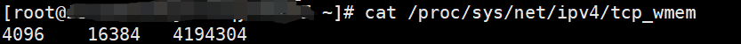

**首先需要明确的是`tcp_wmem`和`tcp_rmem`的单位都是字节，而`tcp_mem`的单位是页数，每页4K**

- 4096代表的是发送缓冲区的最小值，4K，动态变化范围的最低值
- 16384≈16K，表示的是默认初始值
- 4194304=4M，表示的是发送缓冲区的最大值，动态变化范围的最大值

Linux默认情况下，对于每个TCP连接，发送缓冲区的初始默认值是16K，范围从4K到4M动态变化

**发送窗口的调节功能是自动开启的，而接收窗口的调节功能必须要手动打开**


接收缓冲区的大小范围由`tcp_rmem`来指定，但是它的调整比较复杂。

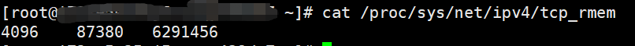

- 第一个数值是动态范围的最小值，表示即使在内存压力下也可以保证的最小接收缓冲区大小，4096 byte = 4K 
- 第二个数值是初始默认值，87380 byte ≈ 86K 
- 第三个数值是动态范围的最大值，6291456 byte = 6144K（6M)

**接收缓冲区可以根据系统空闲内存的大小来调节接收窗口，但是需要配置`tcp_moderate_rcvbuf`为1来开启调节功能**

- 如果系统的空闲内存很多，就可以自动把缓冲区增大一些，这样传给对方的接收窗口也会变大，因而提升发送方发送的传输数据数量；
- 反之，如果系统的内存很紧张，就会减少缓冲区，这虽然会降低传输效率，可以保证更多的并发连接正常工作；

那么接收缓冲区调整时，是怎么知道内存紧张与否的呢？这是根据`tcp_mem`配置完成的


上面三个数字单位不是字节，而是「页面大小」，1 页表示 4KB，它们分别表示：

- 当 TCP 内存小于第 1 个值时，不需要进行自动调节；
- 在第 1 和第 2 个值之间时，内核开始调节接收缓冲区的大小；
- 大于第 3 个值时，内核不再为 TCP 分配新内存，此时新连接是无法建立的；

一般情况下这些值是在系统启动时根据系统内存数量计算得到的。根据当前 tcp_mem 最大内存页面数是 177120，当内存为 (177120 * 4) / 1024K ≈ 692M 时，系统将无法为新的 TCP 连接分配内存，即 TCP 连接将被拒绝。


**千万不要在 socket 上直接设置 SO_SNDBUF 或者 SO_RCVBUF，这样会关闭缓冲区的动态调整功能**


## 流量控制

基于滑动窗口这种数据结构TCP中提供了一种**可以根据接收方实际接受能力控制发送的数据量**的机制，这就是所谓的**流量控制**


### 流量控制的经典场景

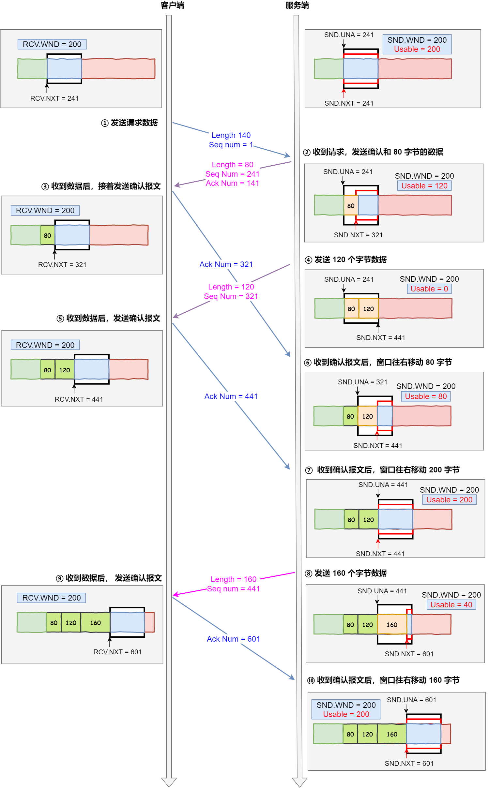


上图中是以服务器作为发送方，客户端作为接收方，客户端向服务器发送请求数据报文

- 服务端收到客户端的请求报文之后，发送确认报文和80个字节的数据，于是可用窗口大小减少80，变成120，`SND.NXT`向右偏移80字节，指向321，这意味这**下次发送数据的时候从321开始**
- 客户端收到这80个字节的数据之后，接收窗口向右移动80字节，`RCV.NXT`也就指向321，这意味着**客户端期望的下一个报文的序列号是321**，接着发送确认报文给服务端
- 服务端再次发送120字节的数据，此时可用窗口大小变为0，意味着服务端无法发送数据了
- 服务端收到对 80 字节数据的确认报文后，`SND.UNA` 指针往右偏移后指向 321，于是可用窗口 `Usable` 增大到 80
- 服务端收到对 120 字节数据的确认报文后，`SND.UNA` 指针往右偏移后指向 441，于是可用窗口 `Usable` 增大到 200
- 服务端又可以继续发送了，于是发送160字节的数据之后，`SND.NXT`指向601，于是可用窗口`Usable`减少到40
- 客户端收到 160 字节后，接收窗口往右移动了 160 字节，`RCV.NXT` 也就是指向了 601，接着发送确认报文给服务端
- 服务端收到对 160 字节数据的确认报文后，发送窗口往右移动了 160 字节，于是 `SND.UNA` 指针偏移了 160 后指向 601，可用窗口 `Usable` 也就增大至了 200


可以看出，这个例子中假设了发送窗口和接收窗口都是不变的，但实际上，**发送窗口和接收窗口中所存放的字节数，都是放在操作系统内存缓冲区中的，操作系统会根据实际情况调整缓冲区的大小**


比如当应用程序没有办法及时读取缓冲区的内容时，会对我们的缓冲区造成影响

**那么操作系统的缓冲区是如何影响发送和接收窗口的呢？**


### 操作系统缓冲区与滑动窗口的关系

> **<font color=red size=4pt>场景一：当应用程序没有及时读取缓存时</font>**

- 客户端作为发送方，服务端作为接收方，发送窗口和接收窗口初始大小为 `360`；
- 服务端非常的繁忙，当收到客户端的数据时，应用层不能及时读取数据


- 客户端发送140字节的数据，可用窗口大小变成了220
- 服务器收到这140字节的数据之后，由于服务器非常繁忙，应用程序只读取了40字节的数据，还有100字节的数据占据着内存缓冲区，于是接收窗口的大小收缩到了360-100=260，并在发送确认报文时，通知客户端接收窗口大小已经变成了260
- 客户端接收到确认报文之后，发送窗口减少为260
- 客户端发送 180 字节数据，此时可用窗口减少到 80
- 服务器收到这180字节的数据之后，这时候应用程序并没有读取任何的数据，于是这180字节的数据都留在了内存缓冲区中，于是接收窗口继续减少变成80（260-180），并在发送确认报文时，通知客户端接收窗口大小已经变成了80
- 客户端收到确认报文之后，发送窗口大小减少为80
- 客户端发送 80 字节数据后，可用窗口耗尽
- 服务端收到 80 字节数据，**但是应用程序依然没有读取任何数据，这 80 字节留在了缓冲区，于是接收窗口收缩到了 0**，并在发送确认信息时，通过窗口大小给客户端。
- 客户端收到确认和窗口通告报文后，发送窗口减少为 0

可见，最后发送窗口和接收窗口都缩减成了0，也就是发生了**窗口关闭**，当发送方可用窗口变为0的时候，发送方实际上会向接收方定期发送一个探测报文，看看接收方的可用窗口是否已经发生了变化


> **<font color=red size=4pt>场景二：由于服务器系统资源紧张，直接减少了接收缓冲区的大小，这时候应用程序又无法及时读取缓存数据</font>**

当服务端系统资源非常紧张的时候，操心系统可能会直接减少了接收缓冲区大小，这时应用程序又无法及时读取缓存数据，那么这时候就有严重的事情发生了，**会出现数据包丢失的现象**


- 客户端发送 140 字节的数据，于是可用窗口减少到了 220
- **服务端因为现在非常的繁忙，操作系统于是就把接收缓存减少了 120 字节**，当收到 140 字节数据后，又因为应用程序没有读取任何数据，所以 140 字节留在了缓冲区中，于是接收窗口大小从 360 收缩成了 100，最后发送确认信息时，通告窗口大小给对方
- 此时**客户端因为还没有收到服务端的通告窗口报文，所以不知道此时接收窗口收缩成了 100**，客户端只会看自己的可用窗口还有 220，所以客户端就发送了 180 字节数据，于是可用窗口减少到 40
- 服务端收到了 180 字节数据时，发现数据大小超过了接收窗口的大小，于是就把数据包丢失了
- 客户端收到第 2 步时，服务端发送的确认报文和通告窗口报文，尝试减少发送窗口到 100，把窗口的右端向左收缩了 80，此时可用窗口的大小就会出现诡异的负值

**所以，如果发生了先减少缓存，再收缩窗口，就会出现丢包的现象**

**因此，为了防止这种情况的发生，TCP规定是不允许同时减少缓存又缩小窗口的，而是采用先收缩窗口，过段时间在减少缓存，这样就能够避免丢包情况了**


### 窗口关闭

上面的两个场景解释了为了避免丢包现象，TCP规定了只能够先收缩窗口，隔一段时间之后在减少缓冲区的大小，同时我们从上面的场景一中也能够注意到**接收窗口和发送窗口的窗口大小有都变为0**的情况，也就是产生了**窗口关闭**这个现象


> **<font color=red size=4pt>窗口关闭存在潜在风险</font>**

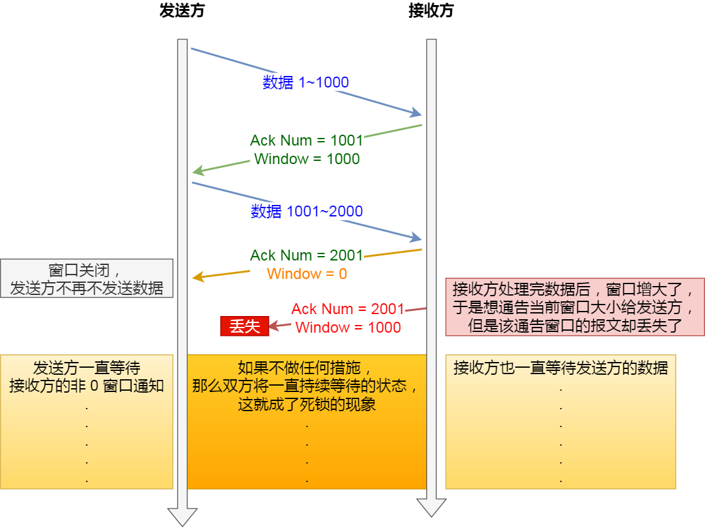

**接收方向发送方通知窗口大小时，是通过ACK报文来通告的**

如果发送窗口变成0的时候，接收方在处理完数据之后，会向发送方发送ACK报文来通知发送方窗口非0，但是如果这个**ACK报文在网络中丢失**了，那就会产生问题了，如上图：这可能导致发送方一直等待接受方的非0窗口通知，而接受方一直等待发送方的数据，如果不采取措施，那么这种相互等待的过程，就成了死锁的现象


> **<font color=red size=4pt>TCP中是如何解决窗口关闭时存在的潜在死锁问题</font>**

为了解决窗口关闭时可能存在的潜在死锁问题，TCP会为每个连接设置一个定时器，直到TCP连接的一方收到零窗口通知，计时器就开始启动，如果计时器超时，那么就会发送**窗口探测报文**，而对方在确认这个探测报文的时候，会给出自己现在的接收窗口大小

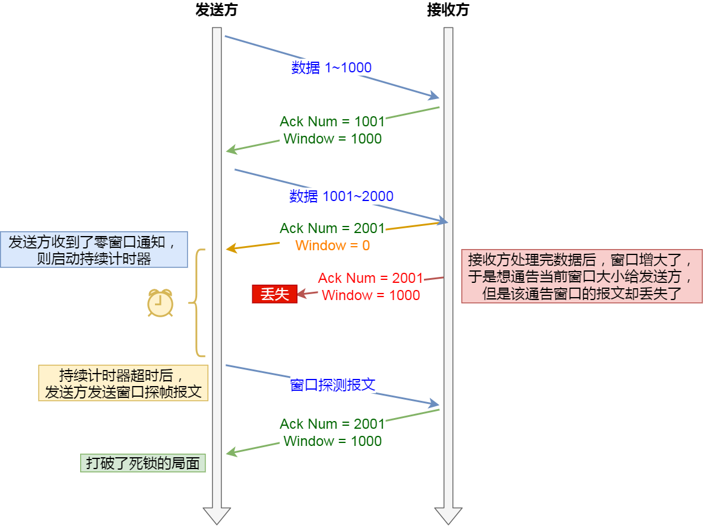

- 如果接收窗口的可用大小仍为0，那么计时器将会被重置，重新开始计时
- 如果接收窗口的可用大小变为非0，那么死锁的局面就可以被打破了

> 窗口探测的次数一般为3次，每次大约30~60秒，如果3次之后，窗口的大小仍然为0，有的TCP就会发送RST报文来中断连接


### 糊涂窗口综合症

**如果接收方太忙了，来不及取走接收窗口里面的数据，那么就会导致发送方的发送窗口越来越小，到最后，如果接受方腾出几个字节并告诉发送方现在有几个字节的窗口，而发送方会义无反顾地发送这几个字节，这就是糊涂窗口综合症**，示意如下图：

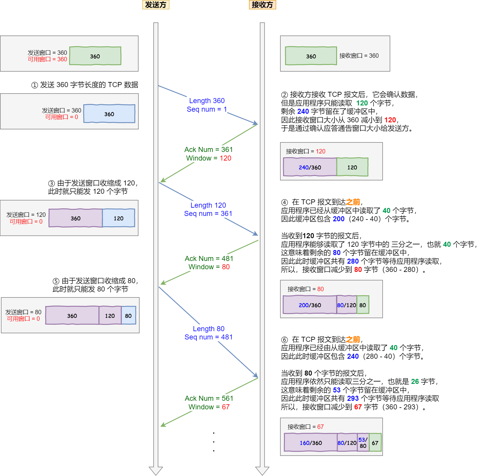

通过上图也可以看出，糊涂窗口综合症就是双方的窗口越来越小，造成这种现象必须满足两个条件：

- 接收方会通告较小的窗口大小

- 发送方会发送较小的数据报文

于是，避免糊涂窗口综合症需要同时破坏这两个条件：

- **接收方不通告较小的窗口大小**
- **发送方不发送较小的数据报文**

> 怎么让接收方不通告小窗口呢？

接收方通常的策略如下:

- 当「窗口大小」小于 min( MSS，缓存空间/2 ) ，也就是小于 MSS 与 1/2 缓存大小中的最小值时，就会向发送方通告窗口为 0，也就阻止了发送方再发数据过来

等到接收方处理了一些数据后，窗口大小 >= MSS，或者接收方缓存空间有一半可以使用，就可以把窗口打开让发送方发送数据过来


> 怎么让发送方避免发送小数据呢？

发送方通常的策略:

**使用 Nagle 算法**，该算法的思路是延时处理，它满足以下两个条件中的一条才可以发送数据：

- 要等到窗口大小 >= MSS 或是 数据大小 >= MSS
- 收到之前发送数据的 ack 回包

只要没满足上面条件中的一条，**发送方一直在囤积数据**，直到满足上面的发送条件。

但需要注意的是如果接收方不能够满足 不通报小窗口给发送方，那么即使开启了Nagle算法，也无法避免糊涂窗口综合征，因为如果对端ACK回复很快的话（达到Nagle算法的条件二），Nagle算法就不会拼接太多的数据包，这种情况下依然会有小数据包的传输，网络总体的利用率依然很低

所以，**接收方不通告小窗口给发送方+发送方开启Nagle算法才能够避免糊涂窗口综合征**

另外，**Nagle 算法默认是打开的**，如果对于一些需要小数据包交互的场景的程序，比如，telnet 或 ssh 这样的交互性比较强的程序，则需要关闭 Nagle 算法。

可以在 Socket 设置 TCP_NODELAY 选项来关闭这个算法（关闭 Nagle 算法没有全局参数，需要根据每个应用自己的特点来关闭）

```c
setsockopt(sock_fd, IPPROTO_TCP, TCP_NODELAY, (char *)&value, sizeof(int));
```


> Nagle算法

要知道，当我们传输数据包的时候，TCP+IP的头部就有40个字节，如果数据包的body远小于head的40字节的话，这显然是很不划算的，所以就出现了基于延迟发送思想的Nagle算法，这个算法的目的就是为了减少网络中小数据包的数量，从而减少网络拥堵。

Nagle算法对数据包的处理如下：在未确认数据发送的时候让发送器把数据送到缓存里。任何数据随后继续直到得到明显的数据确认或者直到攒到了一定数量的数据了再发包，因此**Nagle 算法在最开始的时候一定会有一个小报文。**


事实上，Nagle算法和延迟确认算法分别是**客户端和服务端避免发送小数据的两种方法**，**服务端延迟确认机制**诞生的原因在于一个没有携带数据的 ACK包，它的网络效率也是很低的，因为它也有 40 个字节的 IP 头 和 TCP 头，但却没有携带数据报文。TCP延迟确认的策略是：

- 当有响应数据要发送时，ACK 会随着响应数据一起立刻发送给对方
- 当没有响应数据要发送时，ACK 将会延迟一段时间，以等待是否有响应数据可以一起发送
- 如果在延迟等待发送 ACK 期间，对方的第二个数据报文又到达了，这时就会立刻发送 ACK


但是需要注意的是**TCP 延迟确认 和 Nagle 算法混合使用，会导致时耗增长**

发送方使用了` Nagle` 算法，接收方使用了` TCP` 延迟确认会发生如下的过程：

- 发送方先发出一个小报文，接收方收到后，由于延迟确认机制，自己又没有要发送的数据，只能干等着发送方的下一个报文到达；
- 而发送方由于 `Nagle` 算法机制，在未收到第一个报文的确认前，是不会发送后续的数据；
- 所以接收方只能等待最大时间 200 ms 后，才回 ACK 报文，发送方收到第一个报文的确认报文后，也才可以发送后续的数据。

很明显，这两个同时使用会造成额外的时延，这就会使得网络"很慢"的感觉。

要解决这个问题，只有两个办法：

- 要不发送方关闭 `Nagle` 算法
- 要不接收方关闭 `TCP` 延迟确认


## 拥塞控制

前面我们说了流量控制，这里又提到阻塞控制，那么我们首先要做的就是区分阻塞控制和流量控制

- 流量控制的作用是根据接收窗口的大小发送数据，**避免发送方发送的数据填满接收方缓存**
- 阻塞控制的作用是**避免发送方的发送数据填满整个网络，造成更严重的网络拥堵**

> 在网络上出现拥堵时，如果继续发送大量的数据包，可能会导致数据包时延、丢失等，这时TCP就会重传数据，但是一重传就会导致更多的数据包进入网络，加重网络的阻塞，于是就会导致更大的时延以及更多的丢包，这样一直恶性循环...

所以，TCP不能忽略网络上发生的时候，事实上，TCP被设计成了一个无私的协议，当网络出现拥堵时，TCP会进行自我牺牲，即减少自己发送数据包的数量，也就是阻塞控制，为了调节发送方发送数据包的数量，阻塞控制中定义了一个**拥塞窗口**的概念


### 拥塞窗口

拥塞窗口是**由发送方维护**的一个状态变量，它**会根据网络的拥塞程度动态变化**，使用`cwnd`来表示

那么`cwnd`和我们前面提到的发送窗口`swnd`、接收窗口`rwnd`有什么关系呢？我们知道由于存在网络时延，发送窗口和接收窗口是约等于的关系，加入了阻塞窗口的概念之后，**发送窗口的大小等于`min{cwnd, rwnd}`，也就是接收窗口和拥塞窗口中的最小值**

拥塞窗口的变化机制：

- 当网络中没有出现拥塞的时候，拥塞窗口会变大
- 当网络中出现拥塞的时候，拥塞窗口会变小

看到拥塞窗口的变化机制，就有了一个问题了，TCP协议是怎么知道网络中是否出现阻塞的呢

**其实只要是发送方在规定时间内没有收到ACK应答报文，也就是发生了超时重传，TCP就会认为网络中出现了阻塞**


**拥塞控制主要有四个算法：慢启动、拥塞避免、拥塞发生、快速恢复**


### 慢启动

首先我们来看一下慢启动，TCP在连接刚刚建立完成后，首先会有一个慢启动的过程，这个慢启动的意思就是一点点的增加发送数据包的量，如果一上来就给网络发送大量数据包，那岂不是会给网络带来很大的负担吗？

**对于慢启动，我们只需要要记住的一个规则就是在慢启动中，每收到一个ACK应答报文，拥塞窗口`cwnd`的大小就会增加1**

这里假定拥塞窗口和发送窗口相等，有下面场景：

- 连接建立完成后，一开始初始化 `cwnd = 1`，表示可以传一个 MSS 大小的数据
- 当收到一个 ACK 确认应答后，`cwnd` 增加 1，于是一次能够发送 2 
- 当收到 2 个的 ACK 确认应答后， `cwnd `增加 2，于是就可以比之前多发2 个，所以这一次能够发送 4 个
- 当这 4 个的 ACK 确认到来的时候，每个确认 `cwnd `增加 1， 4 个确认 `cwnd` 增加 4，于是就可以比之前多发 4 个，所以这一次能够发送 8 个

通过上面的描述，我们能够知道**在慢启动算法中发包个数是指数式增加的**，如下图：


我们肯定不能让发包的数量一直这么增长下去，那么涨到什么时候是个头呢？

所以，这里又出现了一个变量**`ssthresh(slow start threshold)`，叫做慢启动门限**，一般来说`ssthreshold`的大小是65535字节

- 当`cwnd < ssthresh`时，继续使用慢启动算法

- 当`cwnd >= ssthresh`时，就使用拥塞避免算法


### 拥塞避免

我们前面说到，当拥塞窗口的大小大于慢启动门限之后，就会进入拥塞避免算法，那么拥塞避免算法的规则就是：**当进入了拥塞避免算法之后，每收到一个ACK，拥塞窗口的大小增加`1/cwnd`**

接上前面的慢启动的场景，现假定 `ssthresh` 为 `8`：

- 当 8 个 ACK 应答确认到来时，每个确认增加 1/8，8 个 ACK 确认 `cwnd` 一共增加 1，于是这一次能够发送 9 个 `MSS` 大小的数据，也就是说拥塞窗口的大小**从指数增长变成了线性增长**


我们可以发送，**拥塞避免算法就是将拥塞窗口的大小从指数式增加变成了现在的线性增加，但是还是处于增长阶段，只是速度放缓了**

然后就这么增长着，网络慢慢就会进入阻塞的状态了，于是就会出现丢包现象，这时候就需要对丢失的包进行重传

**当触发了重传机制，也就意味着网络出现了拥堵，也就进入了拥塞发生算法**


### 拥塞发生

我们在前面知道了重传机制的算法主要有四种：超时重传、快速重传、SACK、D-SACK，但事实上，SACK和D-SACK都是在快速重传的基础上改进的（在TCP头部选项字段添加sack字段）

在拥塞发生算法中，使用不同的重传机制，算法具体的实现是有区别的


#### 发生超时重传的拥塞发生算法

如果触发了超时重传，那么这时候就会进入拥塞发生算法，这个时候`ssthresh`和`cwnd`的大小也会发生变化

- `ssthresh`变为`cwnd/2`
- `cwnd`变为1

变化完之后，就会重新开始慢启动的过程，如下图，可以看出来，一旦发生了超时重传，拥塞窗口的大小直接变成1，也就是从头开始慢启动，“一夜回到解放前”，这种做法太激进了，会造成网络的卡顿感严重


#### 发生快速重传的拥塞发生算法（快速恢复）

前面我们提到了快速重传，当发送方连续收到三个相同的ACK时，于是发送端就会快速地重传，不必等待超时再重传。

这种情况下，TCP会认为网络拥堵不严重，因为发送方还能收到三个相同的ACK了，说明大部分没丢，丢掉的是一小部分，然后`ssthresh`和`cwnd`的变化过程如下：

- `cwnd=cwnd/2`，拥塞窗口变成原来的一半
- `ssthresh=cwnd`
- 进入快速恢复算法

### 快速恢复

快速恢复算法的过程如下：

- `cwnd = ssthresh + 3`，这个加三的意思就是有三个数据包已经被收到了，指的是三个相同的ACK数据包
- 重传丢失的数据包
- 如果再收到重复的ACK，则`cwnd + 1`
- 如果收到了新的ACK，把`cwnd`的值设置成第一步（慢启动）时`ssthresh`的大小，原因是该ACK确认了新的数据，说明从 duplicated ACK 时的缺失数据都已收到，该恢复过程已经结束了，可以恢复到之前的状态了，然后再次进入拥塞避免状态


可以看出，没有像超时重传那样，一夜回到解放前


快速恢复算法过程中，为什么收到新的数据后，cwnd 设置回了 ssthresh ？

**首先，快速恢复是拥塞发生后慢启动的优化，其首要目的仍然是降低 cwnd 来减缓拥塞，所以必然会出现 cwnd 从大到小的改变。**

**其次，过程2（cwnd逐渐加1）的存在是为了尽快将丢失的数据包发给目标，从而解决拥塞的根本问题（三次相同的 ACK 导致的快速重传），所以这一过程中 cwnd 反而是逐渐增大的。**


## 如果连接已经建立好了，但是客户端突然发生故障（TCP保活机制）

这种情况下就用到了TCP连接的**保活机制（TCP keepalive，注意与`Connection:Keep-Alive`的区别）**，这个机制的原理是：定义一个时间段，如果在这个时间段内，没有任何的连接的活动，那么TCP保活机制就会开始工作，每个一段时间发送一个**探测报文**，该探测报文发送的数据很少，如果连续几个探测报文都没有得到响应，则会认为当前TCP连接死亡，系统内核将错误信息通知给上层应用程序

注意，TCP保护机制在Linux系统中是关闭的，所以如果想要使用必须开启，客户端也一样，只有开启了后续才能够发送探测报文

如果开启了TCP保活机制之后，需要考虑以下三种情况：

- 第一种，对端是正常工作的，当TCP保活的探测报文发送给对端的时候，对端是会正常响应的（返回一个ACK报文），这样TCP保活机制就会被重置，等待一下个保活机制的到来
- 第二种，对端程序崩溃并重启，当TCP保活的探测报文发送到对端的时候，对端是可以响应的，但是由于已经没有了有效的连接信息，这时候就会回复一个`RST`报文给对端，这样很快这个TCP连接就会被重置了
- 第三种，对端程序奔溃或者保活的探测报文由于网络等原因没有达到对端，也就是发送探测报文的这一方收不到响应，这样经过连续的几次探测之后，TCP就会报告这条连接已经死亡，释放它的资源


- 保活时间：默认7200秒（2小时），如果这两个小时内没有任何的活动，那么就会启动保活机制
- 保活时间间隔：默认75秒，每次检测间隔75秒
- 保活探测数：默认9次，表示连续监测9次无响应，则认为对方不可达，从而终端连接

所以说，整套的保活机制下来最多需要`7200+75*9=2小时11分15秒`才能够发现一个死亡连接，这个时间是有点长的，所以我们可以更具实际情况对其进行更改，比如可以在应用层实现一个心跳机制，就像上面说的`keepalive_timeout`一样


**TCP 保活机制（客户端和服务端一样）需要通过 socket 接口设置 `SO_KEEPALIVE` 选项才能够生效，如果没有设置，那么就无法使用 TCP 保活机制。**


实际上，保活机制是比较有争议的，通过上面的描述也不难发现他有两个缺陷

- 发送探测报文会占用带宽
- 在出现短暂的网络错误的时候，保活机制会使一个好的连接断开

所以，保活机制是存在争议的，主要争议之处在于是否应在TCP协议层实现，有两种主要观点：其一，保活机制不必在TCP协议中提供，而应该有应用层实现；其二，认为大多数应用都需要保活机制，应该在TCP协议层实现。

> 保活功能在默认情况下是关闭的。没有经过应用层的请求，Linux系统不会提供保活功能。 


## 如果连接已经建立好了，但是服务端进程崩溃了会发生什么

TCP 的连接信息是由内核维护的，所以当服务端的进程崩溃后，内核需要回收该进程的所有 TCP 连接资源，于是内核会发送第一次挥手 FIN 报文，后续的挥手过程也都是在内核完成，并不需要进程的参与，所以即使服务端的进程退出了，还是能与客户端完成 TCP 四次挥手的过程。

> 也就是说进程崩溃之后，操作系统能够感知到

我自己做了个实验，使用 kill -9 来模拟进程崩溃的情况，发现**在 kill 掉进程后，服务端会发送 FIN 报文，与客户端进行四次挥手**。


## SYN攻击

### 什么是SYN攻击

我们知道TCP的连接建立是需要进行三次握手的，所以如果攻击者在短时间内伪造出大量的SYN请求报文发送给服务器，那么服务器就会进入`SYN_RCVD`状态，而服务器发送出去的`ACK+SYN`报文迟迟得不到响应，所以用不了多长时间**服务器的半连接队列就会被占满，**导致服务器不能够为正常用户服务


### 怎么样避免SYN攻击

#### 方法一 增大半连接队列

这种方式就是通过修改内核参数的方式来控制队列大小和当队列满的时候应该做什么处理

**要想增大半连接队列，我们得知不能只单纯增大 tcp_max_syn_backlog 的值，还需一同增大 somaxconn 和 backlog，也就是增大全连接队列**。否则，只单纯增大 tcp_max_syn_backlog 是无效的。


超出处理能力时，对新的 SYN 直接回报 RST，丢弃连接：

```shell
# net.ipv4.tcp_abort_on_overflow
```


#### 方法二 开启tcp_syncookies

在讲解方法二之前，我们先来看一下正常的三次握手过程，Linux内核中全连接队列（Accept）和半连接队列（SYN队列）的变化

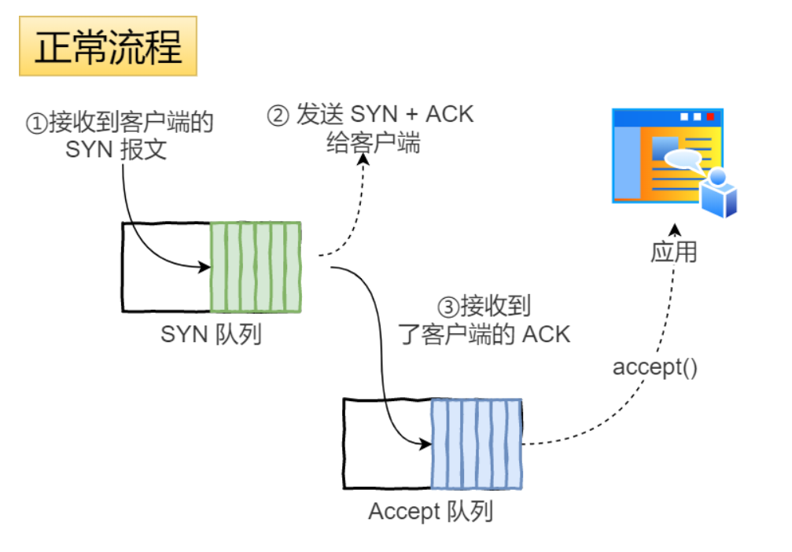

- 服务器收到来自客户端的SYN请求报文之后，会将这个请求加入到内核的SYN队列中
- 然后服务器发送`SYN+ACK`报文给客户端，等待客户端回应ACK报文
- 服务器接收到客户端回应的ACK报文之后，会将请求从SYN队列中取出，放入到Accept队列中
- 应用通过调用`accept()`函数将连接从Accept队列中取出


所以，当收到SYN攻击之后，会导致内核中的SYN队列变满，而由于服务器迟迟接收不到客户端对`ACK+SYN`报文的响应，会导致accept队列中的连接慢慢被应用程序取走，直至为空，如下图：


方法二就是通过使用内核参数`net.ipv4.tcp_syncookies = 1`启动cookie来解决SYN攻击问题


**当半连接队列满时，`SYNcookies`并不丢弃SYN请求，而是通过加密技术来标识半连接状态。**

也就是说，当SYN队列满的时候，服务器并不会丢弃SYN请求，而是计算出一个Cookie值（ACK + SYN包中的序列号），把这个Cookie值发送给客户端，之后，如果服务端接收到客户端的应答报文时，服务器会检查这个 ACK 包的合法性。如果合法，直接放入到「 Accept 队列」。等待应用程序使用accept函数调用

> 生成的cookie会被保存在哪里呢？是不是也有一个队列保存cookie呢？
>
> 答案是否定的，如果有一个队列保存cookie，那么它就会和半连接队列一样，还是会被SYN Flood攻击打满，这样cookie就丧失了它存在的意义了
>
> 实际上，cookie是通过通信双方的IP地址、端口、时间戳、MSS等信息进行实时计算的，保存在TCP报文的序列号（seq）位置处，当服务端收到客户端发来的第三次握手包时，会通过seq还原出通信双方的IP地址、端口、时间戳、MSS，验证通过则建立连接

因为cookie并不占用服务端的内存空间，而且能够解决SYN Flood攻击，为什么不使用cookie来代替半连接队列呢？

凡事皆有利弊，`cookies`方案虽然能防 **SYN Flood攻击**，但是也有一些问题，因为服务端并不会保存连接信息，所以如果传输过程中的数据包丢失了，不会重发第二次握手的信息。另外，编码解码`cookies`这两个过程是比较耗CPU的，利用这一点，如果此时攻击者构造大量的第三次握手包（ACK包），同时带上各种瞎编的`cookies`信息，服务端收到ACK包后也会进行解码，最后发现不合法才会丢弃，这种通过构造大量ACK包去消耗服务端资源的攻击叫做**ACK攻击**，收到攻击的服务器可能因为CPU资源耗尽导致没能响应正常的请求


### 方法三 防火墙

过滤网关防护保护


### 方法四 减少SYN+ACK包的重传次数

当服务端受到 SYN 攻击时，就会有大量处于 SYN_RECV 状态的 TCP 连接，处于这个状态的 TCP 会重传 SYN+ACK ，当重传超过次数达到上限后，就会断开连接。

那么针对 SYN 攻击的场景，我们可以减少 SYN+ACK 的重传次数，以加快处于 SYN_RECV 状态的 TCP 连接断开。


## SYN报文什么情况下会被丢弃

首先，全连接队列或半连接队列满的时候SYN报文会被丢弃，连接不会成功。

第二，当开启了`tcp_tw_recycle`参数，并且在NAT环境下会造成SYN报文被丢弃

当开启了`tcp_tw_recycle`选项，允许处于`TIME_WAIT`状态的连接被快速回收，与`tcp_tw_reuse`一样，想要`tcp_tw_recycle`生效，也是需要开启`tcp_wimestamps`，但是对于服务器来说，**如果开启了`recycle`和`timestamps`选项，则会开启pre-host的PAWS机制**

在说【初始序列号为什么是随机的】问题中，提到了PAWS机制，该机制的目的就是通过时间戳来避免SEQ发生回绕，造成历史数据被接收，导致数据混乱的问题，那么什么是pre-host的PAWS机制呢？**`per-host` 是对「对端 IP 做 PAWS 检查」**，而非对「IP + 端口」四元组做 PAWS 检查。这里就有了一个问题了：但是如果*客户端网络环境是用了 `NAT` 网关，那么客户端环境的每一台机器通过 `NAT` 网关后，都会是相同的 IP 地址，在服务端看来，就好像只是在跟一个客户端打交道一样，无法区分出来。*

当客户端 A 通过 NAT 网关和服务器建立 TCP 连接，然后服务器主动关闭并且快速回收 TIME-WAIT 状态的连接后，**客户端 B 也通过 NAT 网关和服务器建立 TCP 连接，注意客户端 A 和 客户端 B 因为经过相同的 NAT 网关，所以是用相同的 IP 地址与服务端建立 TCP 连接，如果客户端 B 的 timestamp 比 客户端 A 的 timestamp 小，那么由于服务端的 per-host 的 PAWS 机制的作用，服务端就会丢弃客户端主机 B 发来的 SYN 包，所以客户端B是无法与服务器建立连接的**。因此，tcp_tw_recycle 在使用了 NAT 的网络下是存在问题的，如果它是对 TCP 四元组做 PAWS 检查，而不是对「相同的 IP 做 PAWS 检查」，那么就不会存在这个问题了。

**tcp_tw_recycle 在使用了 NAT 的网络下是不安全的！**

第三，处于TIME_WAIT状态的连接收到了SYN包，如果发送过来的SYN包中的序列号或者时间戳比期望的要小，那就丢弃


## TCP连接中一端断电和进程奔溃有啥区别

这个问题的场景1是：一个TCP连接在没有打开`keepalive`选项，没有数据交互的情况下，连接的一端突然断电和一端进程crash有什么区别？

> `keepalive`就是保活机制，和HTTP头部中的`Connection:Keep-Alive`没有任何关系

- 在没有开启保活机制，且双方一直没有数据交互的情况下，如果客户端主机崩溃了，会发生什么？

  客户端主机崩溃了，服务端是无法感知到的，在加上服务端没有开启`tcp keepalive`，又没有数据交互的情况下，服务端会一直处于Established状态，直到服务端重启进程

  > 所以，我们可以得知一个点，在没有使用 TCP 保活机制且双方不传输数据的情况下，一方的 TCP 连接处在 ESTABLISHED 状态，并不代表另一方的连接还一定正常

- 在没有开启保活机制，且双方一直没有数据交互的情况下，如果服务端的进程崩溃了，会发生什么？

  TCP的连接信息是由内核维护的，当服务器的进程崩溃后，内核需要回收该进程所有的TCP连接资源，于是内核会发送第一次挥手FIN报文，后续的挥手过程也都是在内核中完成的， 并不需要进程的参与，所以即使服务端的进程退出了，还是能与客户端进行四次挥手的过程

  > 但是这个需要注意：在进程正常的情况下，内核是没有权限去关闭连接的，连接的关闭必须是由进程主动发起的，然后再去内核中执行四次挥手，这里是因为进程崩溃，内核需要回收资源，所以才会执行四次挥手的过程。


场景2是：一个TCP连接在没有打开`keepalive`选项，但是有数据交互的情况下，客户端宕机了之后马上重启和一直没有重启有什么区别？

在客户端宕机后，服务端向客户端发送的报文得不到任何的响应，在一定时长后，服务端就会触发超时重传机制，

- 服务端重传/发送报文的过程中，客户端主机重启完成后，客户端的内核就会接收重传的报文，然后根据报文的信息传递给对应的进程：

  - 如果客户端主机上没有进程绑定了该TCP报文的目标端口号，那么客户端内核就会恢复RST报文，重置该TCP连接
  - 如果客户端主机上有进程绑定了该TCP报文的目标端口号，由于客户端宕机重启，之前的TCP连接信息都丢失了，所以客户端内核找不到该TCP报文的socket结构体、序列号等信息，同样会返回RST报文给服务器，重置该连接

  所以，**只要有一方重启完成后，收到之前 TCP 连接的报文，都会回复 RST 报文，以断开连接**

- 客户端主机一直没有重启，那么服务端重传报文的次数达到阈值后，内核就会判断该TCP连接出了问题，然后通过socket接口告诉应用程序连接出问题了，然后就断开连接了。

  > 重传次数由`tcp_retires2`决定，默认是15次，每次重传时间间隔会加倍，所以如果重传的时间超过了`timeout`值，即使没有达到`tcp_retires2`的值，连接也会被断开


## 拔掉网线后，原本的TCP连接还存在吗

首先，拔网线这个动作不会影响传输层，客户端和服务端的连接状态仍然会保持。后续需要看双方做了什么动作，针对这个问题，需要分场景来讨论。

- **拔掉网线后，有数据传输：**在客户端拔掉网线后，服务端向客户端发送的数据报文会得不到任何响应，在等待一定时长后，服务端就会触发超时重传机制，重传未得到响应的数据报文。**如果在服务端重传报文的过程中，客户端刚好把网线插回去了，**由于拔掉网线并不会改变客户端的TCP连接状态，并且还是处于Established状态，所以这时候客户端是可以正常接收服务端发来的数据报文的，然后客户端就会回ACK响应报文。

  此时，客户端和服务端的TCP连接依然存在，就像什么事情也没发生一样

  **但是如果在服务端重传报文的过程中，客户端一直没有将网线插回去**，服务端超时重传报文的次数达到一定阈值后，内核就会判断该TCP连接出现了问题，然后通过 Socket 接口告诉应用程序该 TCP 连接出问题了，于是服务端的 TCP 连接就会断开。而等客户端插回网线后，如果客户端向服务端发送了数据，由于服务端已经没有与客户端相同四元祖的 TCP 连接了，因此服务端内核就会回复 RST 报文，客户端收到后就会释放该 TCP 连接。

- **拔掉网线后，没有数据传输：**如果没有开启TCP keepalive机制，那么客户端和服务端的连接状态就会这样一直保持下去；如果开启了TCP keepalive机制，即使双方都没有数据传输，在持续一段时间后，TCP就会发送探测报文：

  - 如果**对端是正常工作**的。当 TCP 保活的探测报文发送给对端, 对端会正常响应，这样 **TCP 保活时间会被重置**，等待下一个 TCP 保活时间的到来。
  - 如果**对端主机宕机**（*注意不是进程崩溃，进程崩溃后操作系统在回收进程资源的时候，会发送 FIN 报文，而主机宕机则是无法感知的，所以需要 TCP 保活机制来探测对方是不是发生了主机宕机*），或对端由于其他原因导致报文不可达。当 TCP 保活的探测报文发送给对端后，石沉大海，没有响应，连续几次，达到保活探测次数后，**TCP 会报告该 TCP 连接已经死亡**。


## TCP有哪些缺点

- **升级TCP的工作很困难：**TCP协议是在内核中实现的，所以应用程序只能使用不能修改，如果想要升级TCP协议，那么只能升级内核，所以即使TCP有一些很好的特性更新，也很难快速推广

  > 很多 TCP 协议的新特性，都是需要客户端和服务端同时支持才能生效的，比如 TCP Fast Open 这个特性，虽然在2013 年就被提出了，但是 Windows 很多系统版本依然不支持它，这是因为 PC 端的系统升级滞后很严重，W indows Xp 现在还有大量用户在使用，尽管它已经存在快 20 年

- TCP建立连接时的延迟：基于TCP实现的应用协议，都需要先建立三次握手才能够进行数据传输，即使存在了TFO机制，推广起来还是很慢的

- **TCP 是在内核实现的，所以 TLS 是无法对 TCP 头部加密的，这意味着 TCP 的序列号都是明文传输，所以就存安全的问题**。

  一个典型的例子就是攻击者伪造一个的 RST 报文强制关闭一条 TCP 连接，而攻击成功的关键则是 TCP 字段里的序列号位于接收方的滑动窗口内，该报文就是合法的。

  为此 TCP 也不得不进行三次握手来同步各自的序列号，而且初始化序列号时是采用随机的方式（不完全随机，而是随着时间流逝而线性增长，到了 2^32 尽头再回滚）来提升攻击者猜测序列号的难度，以增加安全性。

  但是这种方式只能避免攻击者预测出合法的 RST 报文，而无法避免攻击者截获客户端的报文，然后中途伪造出合法 RST 报文的攻击的方式。

- TCP存在队头阻塞问题，本质上是因为TCP是字节流协议，必须保证收到的字节数据是完整且有序的。

- TCP网络迁移需要重新建立连接，一条TCP连接的启动势必会先经历慢启动的过程，所以重新连接会造成一定程度上的卡顿


## 如何基于UDP实现可靠传输（QUIC）

想要基于UDP实现可靠的传输协议，需要在应用层作出一定的修改

拿 HTTP/3 举例子，在 UDP 报文头部与 HTTP 消息之间，共有 3 层头部：


### QUIC Packet Header

`Packet Header`首次建立连接时和日常传输数据时使用的`Header`是不同的， 如下图所示（并不是全部的header）：


`Packet Header`分成了两种：

- `Long Packet Header`：用于首次建立连接
- `Short Packet Header`：用于日常传输数据

**QUIC也是需要三次握手来建立连接的，主要目的是为了协商连接ID**，协商出连接ID后，后续传输时，双方只需要固定住连接ID，从而实现连接迁移功能。所以，在`Short Packet Header`中不需要再传输`Source Connection ID`字段了，只需要传输`Destination Connection ID`

`Short Packet Header`中的`Packet Number`是每个报文独一无二的编号，它是**严格递增**的，也就是说就算`Packet N`丢失了，重传的`Packet N`中的`Packet Number`也已经不是`N`了，而是一个比`N`大的值


> 这么做的好处/目的是？

TCP中重传报文和原始报文的序列号是一样的，这样其实会出现**歧义**的问题


比如上图，当TCP发生超时重传后，客户端发起重传，然后接收到服务端的ACK，由于客户端原始报文和重传报文序列号是一样的，那么服务端针对这两个报文回复的都是相同的ACK。

这样的话，客户端就无法判断出这个ACK是原始报文的响应还是重传报文的响应，这样在计算RTT的时候就会出现歧义：

- 如果算成原始请求的响应，但实际上是重传请求的响应（上图左），会导致采样 RTT 变大。
- 如果算成重传请求的响应，但实际上是原始请求的响应（上图右），又很容易导致采样 RTT 过小。

RTO是基于RTT来计算的，那么如果RTT计算不够精准，那么RTO（超时时间）也不会精准，这样可能导致重传的概率事件增大。

QUIC 报文中的 Pakcet Number 是严格递增的， 即使是重传报文，它的 Pakcet Number 也是递增的，这样就能更加精确计算出报文的 RTT。


另外，还有一个好处，QUIC使用的`Packet Number`单调递增的设计，可以让数据包不再像TCP那样必须有序确认，**QUIC支持乱序确认，**当数据包Packet N丢失后，只要有新的已接收数据包确认，当前窗口就会向右滑动

待发送端获知数据包Packet N 丢失后，会将需要重传的数据包放到待发送队列，重新编号比如数据包Packet N+M 后重新发送给接收端，对重传数据包的处理跟发送新的数据包类似，这样就不会因为丢包重传将当前窗口阻塞在原地，从而解决了队头阻塞问题。

所以，Packet Number 单调递增的两个好处：

- 可以更加精确计算 RTT，**没有** TCP 重传的**歧义性问题**；
- 可以**支持乱序确认**，因为丢包重传将当前窗口阻塞在原地，而 TCP 必须是顺序确认的，丢包时会导致窗口不滑动


### QUIC Frame Header

前面我们说到了，`Packet Number`是严格递增的，即使重传报文的`Packet Number`也是递增的，既然重传数据包的`Packet N+M`与丢失数据包的`Packet N`编号并不一致，我们怎么**确定这两个数据包的内容是一样**的呢？

所以引入了**`Frame Header`层**，通过`Stream ID + Offset`字段信息实现数据的有序性，通过比较两个数据包的`Stream ID`和`offset`，如果一致就说明这两个数据包的内容是一致的

一个`Packet`报文中可以存放多个QUIC Frame，每一个Frame都有明确的类型，针对类型的不同，功能也就不用，格式自然也就不同了


以`Stream`为例，`Stream`可以认为是一条HTTP请求

- Stream ID 作用：多个并发传输的 HTTP 消息，通过不同的 Stream ID 加以区别，类似于 HTTP2 的 Stream ID；
- Offset 作用：类似于 TCP 协议中的 Seq 序号，**保证数据的顺序性和可靠性**；
- Length 作用：指明了 Frame 数据的长度。


举个例子，下图中，数据包 Packet N 丢失了，后面重传该数据包的编号为 Packet N+2，**丢失的数据包和重传的数据包 Stream ID 与 Offset 都一致，说明这两个数据包的内容一致**。这些数据包传输到接收端后，接收端能根据 Stream ID 与 Offset 字段信息将 Stream x 和 Stream x+y 按照顺序组织起来，然后交给应用程序处理。

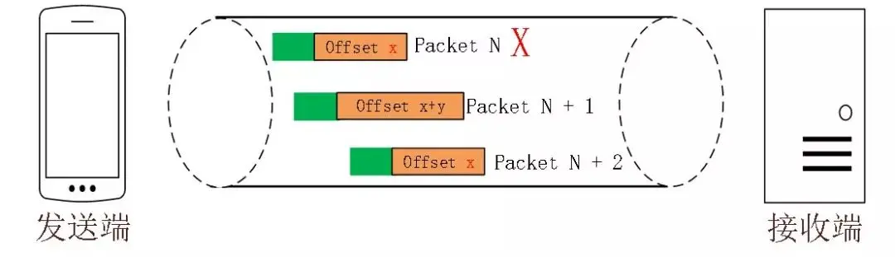

总结一下，`Packet Header`中的`Packet Number`是严格递增的，即使重传数据包，两个数据包中的`Packet Number`也是不一致的，这样做有两个好处，一是在计算`RTT`时不会产生歧义，二是在允许报文能够被乱序确认，这样就解决了TCP中的队头阻塞问题，但需要注意的问题是因为`Packet Number`是不一样的，怎么确保丢失的数据包被重传回来了呢？这里就需要用到`Frame Header`，以`Stream`为例，根据其中的`Stream ID`和`offset`字段来进行比较，如果都相同，那么就是丢失的数据包被重传回来了


**看一下乱序接收是怎么实现的？**

如图所示，当前发送方的缓冲区大小为8，发送方 QUIC 按序（offset顺序）发送 29-36 的数据包：


31、32、34数据包先到达，基于 offset 被优先乱序确认，但 30 数据包没有确认，所以当前已提交的字节偏移量不变，发送方的缓存区不变。


30 到达并确认，发送方的缓存区收缩到阈值，接收方发送 MAX_STREAM_DATA Frame（协商缓存大小的特定帧）给发送方，请求增长最大绝对字节偏移量。


协商完毕后最大绝对字节偏移量右移，发送方的缓存区变大，同时发送方发现数据包33超时


发送方将超时数据包重新编号为 42 继续发送


### QUIC是如何解决TCP的队头阻塞的

#### 什么是TCP的队头阻塞

TCP队头阻塞问题其实就是**接收窗口的队头阻塞问题**

接收方收到的数据范围必须在接收窗口范围内，如果收到超出接收窗口的报文则直接丢弃，比如下图接收窗口的范围是 32 ～ 51 字节，如果收到第 52 字节以上数据都会被丢弃。


接收窗口什么情况下可以滑动呢？

当窗口收到有序数据时，接收窗口才能往前滑动，然后那些已经接收并确认了的有序数据就可以被应用层读取。

但是，**当窗口中接收到不是有序的数据，比如收到了33~40字节的数据，由于第32字节数据没有收到，接收窗口没有办法向前移动，即使收到了 33～40 字节的数据，这些数据也无法被应用层读取的，**只有当发送方重传了第 32 字节数据并且被接收方收到后，接收窗口才会往前滑动，然后应用层才能从内核读取第 32～40 字节的数据。

导致接收窗口队头阻塞问题的根本原因是因为TCP必须按序处理数据，也就是TCP层为了保证数据的有序性，只有在处理完有序数据后，滑动窗口才能往前滑动，否则就会停留，停留「接收窗口」会使得应用层无法读取新的数据。

> 其实这也不能怪TCP，它这么设计的初衷就是为了保证数据的有序性


同理，由于HTTP/2还是基于TCP的，**多个 Stream 请求都是在一条 TCP 连接上传输，这意味着多个 Stream 共用同一个 TCP 滑动窗口，那么当发生数据丢失，滑动窗口是无法往前移动的，此时就会阻塞住所有的 HTTP 请求，这属于 TCP 层队头阻塞**。


#### QUIC是如何解决队头阻塞的呢

QUIC借鉴了HTTP/2里的Stream概念，在一条TCP连接中可以并发多个HTTP请求（Stream）

但是**QUIC给每一个Stream都分配了一个独立的滑动窗口**，这样使得一个连接上的多个Stream之间没有依赖关系，都是相互独立的，各自控制的滑动窗口


### QUIC是如何做流量控制的

TCP流量控制是通过让接收方告诉发送方，接收方的接收窗口有多大，从而让发送方根据接收方的实际接收能力控制发送的数据量

QUIC是基于UDP传输的，而UDP没有流量控制，因此，QUIC实现了自己的流量控制机制，QUIC的滑动窗口滑动的条件跟TCP有一点差别，但是同一个Stream的数据也是要保证顺序的，不然无法实现可靠传输，因此同一个Stream的数据包丢失了，也会造成窗口无法滑动

**QUIC 的 每个 Stream 都有各自的滑动窗口，不同 Stream 互相独立，队头的 Stream A 被阻塞后，不妨碍 StreamB、C的读取**。而对于 HTTP/2 而言，所有的 Stream 都跑在一条 TCP 连接上，而这些 Stream 共享一个滑动窗口，因此同一个Connection内，Stream A 被阻塞后，StreamB、C 必须等待。

QUIC控制窗口大小的方式：

- 通过`window_update`帧告诉对端自己可以接收的字节数，这样发送方就不会发送超过这个数量的数据
- 通过`BlockFrame`告诉对端由于流量控制被阻塞了，无法发送数据

QUIC实现了两种级别的流量控制，分别为Stream和Connection两种级别：

- Stream级别的流量控制：Stream可以认为是一条HTTP请求，每个Stream都有独立的滑动窗口，所以每个Stream都可以做流量控制，防止单个Stream消耗连接（Connection）的全部缓冲区
- Connection流量控制：限制连接中所有Stream相加起来的总字节数，防止发送方超过连接的缓冲容量


#### Stream级别的流量控制

最开始，接收方的接收窗口初始状态如下：


接着，接收方收到了发送方发送过来的数据，有的数据被上层读取了，有的数据丢包了，此时的接收窗口状况如下：


可以看到，接收窗口的左边界取决于接收到的最大偏移字节数，此时的`接收窗口 = 最大窗口数 - 接收到的最大偏移数`

这里就可以看出 QUIC 的流量控制和 TCP 有点区别了：

- TCP 的接收窗口只有在前面所有的 Segment 都接收的情况下才会移动左边界，当在前面还有字节未接收但收到后面字节的情况下，窗口也不会移动。
- QUIC 的接收窗口的左边界滑动条件取决于接收到的最大偏移字节数。


那么接收窗口的右边界是如何移动的呢？


当图中的绿色部分数据超过最大接收窗口的一半后，最大接收窗口向右移动，接收窗口的右边界也向右扩展，同时给对端发送「窗口更新帧」，当发送方收到接收方的窗口更新帧后，发送窗口的右边界也会往右扩展，以此达到窗口滑动的效果。

绿色部分的数据是已收到的顺序的数据，**如果中途丢失了数据包，导致绿色部分的数据没有超过最大接收窗口的一半，那接收窗口就无法滑动了**，这个只影响同一个 Stream，其他 Stream 是不会影响的，因为每个 Stream 都有各自的滑动窗口。


#### Connection流量控制


对于Connection级别的流量窗口，其接收窗口大小就是各个Stream接收窗口大小之和。

上图所示的例子，所有 Streams 的最大窗口数为 120，其中：

- Stream 1 的最大接收偏移为 100，可用窗口 = 120 - 100 = 20
- Stream 2 的最大接收偏移为 90，可用窗口 = 120 - 90 = 30
- Stream 3 的最大接收偏移为 110，可用窗口 = 120 - 110 = 10

那么整个 Connection 的可用窗口 = 20 + 30 + 10 = 60


### QUIC对拥塞控制的改进

QUIC 协议当前默认使用了 TCP 的 Cubic 拥塞控制算法（我们熟知的慢开始、拥塞避免、快重传、快恢复策略），同时也支持 CubicBytes、Reno、RenoBytes、BBR、PCC 等拥塞控制算法，相当于将 TCP 的拥塞控制算法照搬过来了

QUIC 是处于应用层的，也就是说QUIC在应用程序层面实现了TCP中支持的不同的拥塞控制算法，而不再需要操作系统、内核的支持。这是一个飞跃，因为传统的 TCP 拥塞控制，必须要端到端的网络协议栈支持，才能实现控制效果。而内核和操作系统的部署成本非常高，升级周期很长，所以 TCP 拥塞控制算法迭代速度是很慢的。而 **QUIC 可以随浏览器更新，QUIC 的拥塞控制算法就可以有较快的迭代速度**。

TCP 更改拥塞控制算法是对系统中所有应用都生效，无法根据不同应用设定不同的拥塞控制策略。但是因为 QUIC 处于应用层，所以就**可以针对不同的应用设置不同的拥塞控制算法**，这样灵活性就很高了


### QUIC更快的建立连接

对于 HTTP/1 和 HTTP/2 协议，TCP 和 TLS 是分层的，分别属于内核实现的传输层、openssl 库实现的表示层，因此它们难以合并在一起，需要分批次来握手，先 TCP 握手（1RTT），再 TLS 握手（2RTT），所以需要 3RTT 的延迟才能传输数据，就算 Session 会话服用，也需要至少 2 个 RTT。

HTTP/3 在传输数据前虽然需要 QUIC 协议握手，这个握手过程只需要 1 RTT，**握手的目的是为确认双方的「连接 ID」**，连接迁移就是基于连接 ID 实现的。

但是 HTTP/3 的 QUIC 协议并不是与 TLS 分层，而是**QUIC 内部包含了 TLS，它在自己的帧会携带 TLS 里的“记录”，再加上 QUIC 使用的是 TLS1.3，因此仅需 1 个 RTT 就可以「同时」完成建立连接与密钥协商，甚至在第二次连接的时候，应用数据包可以和 QUIC 握手信息（连接信息 + TLS 信息）一起发送，达到 0-RTT 的效果**。

> 在握手的同时，协商好密钥，因为QUIC和TLS都是在应用层，所以不向TCP在传输层那样难以合并


### QUIC实现连接迁移

基于 TCP 传输协议的 HTTP 协议，由于是通过四元组（源 IP、源端口、目的 IP、目的端口）确定一条 TCP 连接。

那么**当移动设备的网络从 4G 切换到 WIFI 时，意味着 IP 地址变化了，那么就必须要断开连接，然后重新建立 TCP 连接**。

而建立连接的过程包含 TCP 三次握手和 TLS 四次握手的时延，以及 TCP 慢启动的减速过程，给用户的感觉就是网络突然卡顿了一下，因此连接的迁移成本是很高的。

QUIC 协议没有用四元组的方式来“绑定”连接，而是**通过连接 ID来标记通信的两个端点**，客户端和服务器可以各自选择一组 ID 来标记自己，因此即使移动设备的网络变化后，导致 IP 地址变化了，只要仍保有上下文信息（比如连接 ID、TLS 密钥等），就可以“无缝”地复用原连接，消除重连的成本，没有丝毫卡顿感，达到了**连接迁移**的功能。


## 用了TCP协议后，数据包一定不会丢失吗？

网络世界中丢包现象是非常常见的，为了弄清楚在哪个环节数据包可能丢失，先来说一下一个数据包从一端到对端的流程：

一个数据包，从聊天框里发出，消息会从**聊天软件**所在的**用户空间**拷贝到**内核空间**的**发送缓冲区（send buffer）**，数据包就这样顺着**传输层、网络层，进入到数据链路层，在这里数据包会经过流控（qdisc），再通过RingBuffer发到物理层的网卡**。数据就这样顺着**网卡**发到了**纷繁复杂**的网络世界里。这里头数据会经过n多个**路由器和交换机**之间的跳转，最后到达**目的机器的网卡**处。

此时目的机器的网卡会通知**DMA**将数据包信息放到`RingBuffer`中，再触发一个**硬中断**给`CPU`，`CPU`触发**软中断**让`ksoftirqd`去`RingBuffer`收包，于是一个数据包就这样顺着**物理层，数据链路层，网络层，传输层**，最后从内核空间拷贝到用户空间里的**聊天软件**里。

在数据包的传输过程中，任意的一个环节都有可能发生丢包

- **建立连接时丢包，**服务端调用listen之后内核会自动创建出半连接队列和全连接队列，如果这两个队列满了，那么默认情况下新的连接数据包到达就会被直接丢弃掉

- **流量控制阶段丢包，**应用层能够发送网络数据包的软件非常多，如果所有数据不加控制都一股脑的冲入到网卡中，网卡会吃不消，因此需要让数据按照一定的规则排队依次处理，也就是所谓的qdisc（Queueing Disciplines，排队规则），这也就是我们常说的流量控制。排队就先需要有个队列，队列就有长度，所以当发送数据过快，流控队列长度（`txqueuelen`）又不够大时，就容易出现丢包现象

- **网卡丢包**，首先是一些硬件级别上的缺陷导致丢包，比如网线质量差、接触不良等，第二，前面我们说到了，目的机器的网卡通知DMA将数据包放到`RingBuffer`中，然后等着内核触发软中断慢慢收走。如果这个**缓冲区过小**，而这时候发送的数据又过快，就有可能发生溢出，此时也会产生**丢包**。第三，网卡作为硬件，**传输速度是有上限的**。当网络传输速度过大，达到网卡上限时，就会发生丢包。这种情况一般常见于压测场景。

- **接收缓冲区丢包**，当使用`TCP socket`进行网络编程的时候，内核都会分配一个**发送缓冲区`tcp_wmem`和接收缓冲区`tcp_rmem`**，当我们想要发送一个数据包时，会在代码里执行`send(msg)`，这时候数据包并不是直接就通过网卡就发出去了，而是将数据拷贝到发送内核缓冲区中就返回了，至于什么时候发送由内核决定。接收缓冲也类似，从外部网络收到的数据包就暂存在这个地方，然后坐等用户空间的应用程序将数据包取走。

  如果这两个缓冲区设置过小会怎么办呢？

  - 对于发送缓冲区而言，在执行`send`方法的时候，如果采用的是阻塞调用，那么就会等待，等到缓冲区有空位的时候就可以发送数据了；如果采用的是非阻塞调用，就会立刻返回一个`EAGAIN`的错误信息，意思是`try again`，让应用程序重试，这种情况下一般不会发生丢包
  - 对于接收缓冲区而言，如果接收端缓冲区满了，那么TCP的接收窗口就会变为0，这时候会向发送端发送零窗口通知，但是如果在发送方收到这个报文之前有数据已经被发送出来了，那么这一部分的数据就会被丢弃

- **两端之间的网络丢包，**两端之间一般会有一条很长的链路，链路上的设备都属于外部网络，这中间有各种路由器和交换机还有光缆啥的，丢包也是很经常发生的


解决上面的丢包问题就是使用TCP协议，但是使用TCP协议一定不会丢包吗？

TCP保证的可靠性，是**传输层的可靠性**。也就是说，**TCP只保证数据从A机器的传输层可靠地发到B机器的传输层。**至于数据到了接收端的传输层之后，能不能保证到应用层，TCP并不管。举个例子：

假设现在，我们输入一条消息，从聊天框发出，走到**传输层TCP协议的发送缓冲区**，不管中间有没有丢包，最后通过重传都保证发到了对方的**传输层TCP接收缓冲区**，此时接收端回复了一个`ack`，发送端收到这个`ack`后就会将自己**发送缓冲区**里的消息给扔掉。到这里TCP的任务就结束了。

TCP任务是结束了，但聊天软件的任务没结束。

**聊天软件还需要将数据从TCP的接收缓冲区里读出来，如果在读出来这一刻，手机由于内存不足或其他各种原因，导致软件崩溃闪退了。**

发送端以为自己发的消息已经发给对方了，但接收端却并没有收到这条消息。

于是乎，**消息就丢了。**


***那么这类的丢包问题应该怎么解决呢？***

以微信为例，在两个客户端通信时，中间肯定会经过微信的服务器，服务器上应该是记录了我们最近发送的一些信息数据，假设每条数据都有一个id，服务器和聊天软件每次都拿最新消息的id进行对比，就能够知道两端消息是否一致。

对于**发送方**，只要定时跟服务端的内容对账一下，就知道哪条消息没发送成功，直接重发就好了。

如果**接收方**的聊天软件崩溃了，重启后跟服务器稍微通信一下就知道少了哪条数据，同步上来就是了，所以也不存在上面提到的丢包情况。

可以看出，**TCP只保证传输层的消息可靠性，并不保证应用层的消息可靠性。如果我们还想保证应用层的消息可靠性，就需要应用层自己去实现逻辑做保证。**

那么问题又来了，**如果仅仅是实现上面的比对功能，两端通信的时候就能实现对账，为什么还要引入第三端服务器？**

主要有三个原因。

- 第一，如果是两端通信，你聊天软件里有`1000个`好友，你就得建立`1000个`连接。但如果引入服务端，你只需要跟服务器建立`1个`连接就够了，**聊天软件消耗的资源越少，手机就越省电**。
- 第二，就是**安全问题**，如果还是两端通信，随便一个人找你对账一下，你就把聊天记录给同步过去了，这并不合适吧。如果对方别有用心，信息就泄露了。引入第三方服务端就可以很方便的做各种**鉴权**校验。
- 第三，是**软件版本问题**。软件装到用户手机之后，软件更不更新就是由用户说了算了。如果还是两端通信，且两端的**软件版本跨度太大**，很容易产生各种兼容性问题，但引入第三端服务器，就可以强制部分过低版本升级，否则不能使用软件。但对于大部分兼容性问题，给服务端加兼容逻辑就好了，不需要强制用户更新软件。


## 问题

**问题一：**有`tcp_retries2`就有`tcp_retries1`，`tcp_retries1`是什么场景下生效？ `tcp_retries2`是不是只受限于规定的次数，还是受限于次数和时间限制的最小值？

`tcp_retries1`和`tcp_retries2`都是在TCP三次握手之后的场景。

- 当重传次数超过`tcp_retries1`就会指示 IP 层进行 MTU 探测、刷新路由等过程，并不会断开TCP连接，当重传次数超过 `tcp_retries2`才会断开TCP流。
- `tcp_retries1` 和 `tcp_retries2` 两个重传次数都是受一个 timeout 值限制的，timeout 的值是根据它俩的值计算出来的，当重传时间超过 timeout，就不会继续重传了，即使次数还没到达。


**问题二：**`tcp_orphan_retries`也是控制TCP连接的关闭，这个跟`tcp_retries1`、`tcp_retries2`有啥区别吗

主动方发送 FIN 报文后，连接就处于 `FIN_WAIT1` 状态下，该状态通常应在数十毫秒内转为 `FIN_WAIT2`。如果迟迟收不到对方返回的 ACK 时，此时，内核会定时重发` FIN` 报文，其中重发次数由` tcp_orphan_retries` 参数控制。


**问题三：**为什么连续两个报文的`seq`会是一样的呢，比如三次握手之后的那个报文？

1. 三次握手中的前两次，是 `seq+1`；
2. 三次握手中的最后一个 ack，实际上是可以携带数据的，由于我文章的例子是没有发送数据的，你可以看到第三次握手的` len=0` ，在数据传输阶段「下一个 `seq=seq+len` 」，所以第三次握手的` seq` 和下一个数据报的 `seq` 是一样的，因为 `len` 为 0


**问题四：**TCP KeepAlive和HTTP Keep-Alive是一个东西吗？

这两个是完全不同的东西

- HTTP 的 Keep-Alive，是由**应用层（用户态）** 实现的，称为 HTTP 长连接；
- TCP 的 Keepalive，是由 **TCP 层（内核态）** 实现的，称为 TCP 保活机制；


**问题五：**TCP和UDP可以同时绑定相同的端口吗？

可以的，TCP和UDP是传输层协议，在内核中是两个完全独立的软件模块实现的。当主机收到数据包后，**可以在IP包头的协议号字段知道该数据包是TCP还是UDP**，所以可以根据这个信息确定送给哪个模块（TCP/UDP）处理，送给TCP/UDP模块的报文根据端口号确定送给哪个应用进程处理


**问题六：**多个TCP服务进程可以同时绑定同一个端口吗？

如果两个TCP服务进程同时绑定的IP地址和端口都相同，那么执行`bind()`的时候就会出错，错误是`Address already in use`

如果两个TCP服务进程绑定的端口相同，但是IP地址是不同的，那么执行`bind()`不会出错

> 其实如果想要相同IP地址机器上的两个进程绑定同一个端口，也是有办法的的，通过设置socket的`SO_REUSEPORT`
>
> linux kernel 3.9 引入了最新的SO_REUSEPORT选项，使得多进程或者多线程创建多个绑定同一个ip:port的监听socket，提高服务器的接收链接的并发能力,程序的扩展性更好（**注意所有进程都要设置才生效**）。
>
> `setsockopt(listenfd, SOL_SOCKET, SO_REUSEPORT,(const void *)&reuse , sizeof(int));`
>
> 目的：每一个进程有一个独立的监听socket，并且bind相同的ip:port，独立的listen()和accept()；提高接收连接的能力。（例如nginx多进程同时监听同一个ip:port）
>
> 解决的问题：
>
> **（1）避免了应用层多线程或者进程监听同一ip:port的“惊群效应”。**
>
> > 操作系统可以将传入的连接请求均匀地分发给这些套接字。这样，当一个连接请求到达时，操作系统可以选择其中一个套接字来处理该请求，而不是将所有等待的套接字同时唤醒。
>
> **（2）内核层面实现负载均衡，保证每个进程或者线程接收均衡的连接数。**
>
> **（3）只有effective-user-id相同的服务器进程才能监听同一ip:port （安全性考虑）**
>
> > effective-user-id（有效用户ID）是一个与用户身份验证和权限控制相关的概念


**问题七：**重启TCP服务进程时，为什么会有`Address in use`的报错信息？

当我们重启服务器进程时，意味着通过服务端发起了关闭连接操作，于是就会经过四次挥手，而对于主动关闭方，会在TIME_WAIT这个状态里停留一段时间，这个时间是2MSL（默认为60秒），**TIME_WAIT 状态的连接使用的 IP+PORT 仍然被认为是一个有效的 IP+PORT 组合，相同机器上不能够在该 IP+PORT 组合上进行绑定，那么执行 bind() 函数的时候，就会返回了 Address already in use 的错误**。

等到`TIME_WAIT`状态结束之后，重启TCP服务就能成功


**问题八：**重启TCP服务进程后，如何避免`Address already in use`的报错信息？

我们在调用bind之前，对socket设置`SO_REUSEADDR`属性，因为 SO_REUSEADDR 作用是：**如果当前启动进程绑定的 IP+PORT 与处于TIME_WAIT 状态的连接占用的 IP+PORT 存在冲突，但是新启动的进程使用了 SO_REUSEADDR 选项，那么该进程就可以绑定成功**。

而且`SO_REUSEADDR`还有一个作用，那就是**在绑定的 IP地址 + 端口时，只要 IP 地址不是正好(exactly)相同，那么允许绑定。**

> 我们知道0.0.0.0表示的是任意地址，如果一个socket绑定的是0.0.0.0和8080端口，那么就相当于主机上所有的IP地址都被绑定了8080端口，因此如果使用主机其他网卡上的IP地址（比如192.168.1.100）绑定8080端口，在没有开启`SO_REUSEADDR`的情况下，会出现`Address already in use`的问题，如果开启了`SO_REUSEADDR`，那么虽然逻辑意义上0.0.0.0包含了后者，但是 0.0.0.0 泛指所有本地 IP，而 192.168.1.100 特指某一IP，两者并不是完全相同，所以在对 socket 设置 SO_REUSEADDR 属性后，那么执行 bind() 时候就会绑定成功


**问题九：**客户端的端口可以重复使用吗

在客户端执行 connect 函数的时候，只要客户端连接的服务器不是同一个，内核允许端口重复使用。

TCP 连接是由四元组（源IP地址，源端口，目的IP地址，目的端口）唯一确认的，那么只要四元组中其中一个元素发生了变化，那么就表示不同的 TCP 连接的。

所以，如果客户端已使用端口 64992 与服务端 A 建立了连接，那么客户端要与服务端 B 建立连接，还是可以使用端口 64992 的，因为内核是通过四元祖信息来定位一个 TCP 连接的，并不会因为客户端的端口号相同，而导致连接冲突的问题。


**问题十：**客户端TCP连接`TIME_WAIT`状态过多，会导致端口资源耗尽而无法建立新的连接吗？

要看客户端是否都是与同一个服务器（目标地址和目标端口一样）建立连接。

如果客户端都是与同一个服务器（目标地址和目标端口一样）建立连接，那么如果客户端 TIME_WAIT 状态的连接过多，当端口资源被耗尽，就无法与这个服务器再建立连接了。即使在这种状态下，还是可以与其他服务器建立连接的，只要客户端连接的服务器不是同一个，那么端口是重复使用的。所以，如果客户端都是与不同的服务器建立连接，即使客户端端口资源只有几万个， 客户端发起百万级连接也是没问题的（当然这个过程还会受限于其他资源，比如文件描述符、内存、CPU 等）。


**问题十一：**如何解决客户端TCP连接`TIME_WAIT`过多，导致无法与同一服务器建立连接的问题？

打开 `net.ipv4.tcp_tw_reuse` 这个内核参数。

因为开启了这个内核参数后，客户端调用 connect 函数时，如果选择到的端口，已经被相同四元组的连接占用的时候，就会判断该连接是否处于 TIME_WAIT 状态。

如果该连接处于 TIME_WAIT 状态并且 TIME_WAIT 状态持续的时间超过了 1 秒，那么就会重用这个连接，然后就可以正常使用该端口了。

如果没有开启这个内核参数，那么内核就会选择下一个端口，然后继续判断，直到找到一个没有被相同四元组的连接使用的端口，如果端口资源被耗尽没有找到，那么`connect()`会返回错误


**问题十二：**多个客户端可以bind同一个端口吗？

bind 函数虽然常用于服务端网络编程中，但是它也是用于客户端的。

前面我们知道，客户端是*在调用 connect 函数的时候，由内核随机选取一个端口作为连接的端口。*

而如果我们想自己指定连接的端口，就可以用 bind 函数来实现：客户端先通过 bind 函数绑定一个端口，然后调用 connect 函数就会跳过端口选择的过程了，转而使用 bind 时确定的端口。

针对这个问题：多个客户端可以 bind 同一个端口吗？

要看多个客户端绑定的 IP + PORT 是否都相同，如果都是相同的，那么在执行 bind() 时候就会出错，错误是“Address already in use”。

如果一个绑定在 192.168.1.100:6666，一个绑定在 192.168.1.200:6666，因为 IP 不相同，所以执行 bind() 的时候，能正常绑定。

所以， 如果多个客户端同时绑定的 IP 地址和端口都是相同的，那么执行 bind() 时候就会出错，错误是“Address already in use”。

**一般而言，客户端不建议使用 bind 函数，应该交由 connect 函数来选择端口会比较好，因为客户端的端口通常都没什么意义。**


**问题十三：**服务端没有listen，客户端发起连接建立，会发生什么？

服务端如果只bind了IP地址和端口，而没有调用listen的话，然后客户端对服务端发起了连接建立，服务端会返回RST报文


**问题十四：**没有listen，能建立TCP连接吗？

是可以的，客户端是可以自己连自己形成连接的（TCP自连接），也可以两个客户端同时向对方发出请求建立连接（TCP同时打开），这两个情况有一个共同点，那就是没有服务端的参与。

形成连接需要有一个前提，我们需要有个地方来存放连接信息，方便握手的时候能够根据IP地址+端口等信息找到对应的socket，当执行listen方法时内核会自动创建半连接队列和全连接队列，三次握手的过程中会在两个队列中暂存连接信息，三次握手过程中会在这两个队列中暂存连接信息。这是有服务端参与的连接建立过程。

无论是TCP自连接还是两个客户端同时向对方发出连接请求，因为客户端***没有执行listen，也就没有半连接队列和全连接队列***，但是**内核中还有一个全局的哈希表，可以用于存放socket连接的信息**。

在TCP自连接的情况中，客户端在connect方法时，最后会将自己的连接信息放入到这个全局的hash表中，然后将信息发出，消息在经过回环地址重新回到TCP传输层的时候，就会根据IP地址和端口从这个全局的哈希表中取出socket信息，于是握手包一来一回最后成功建立连接


