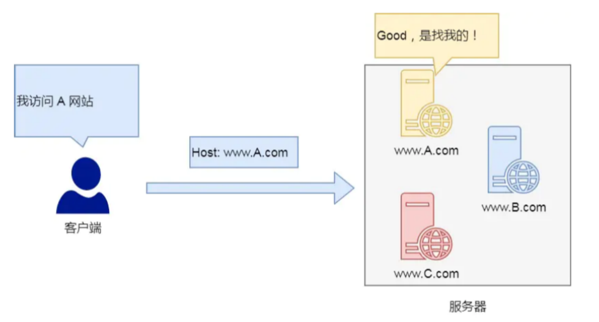
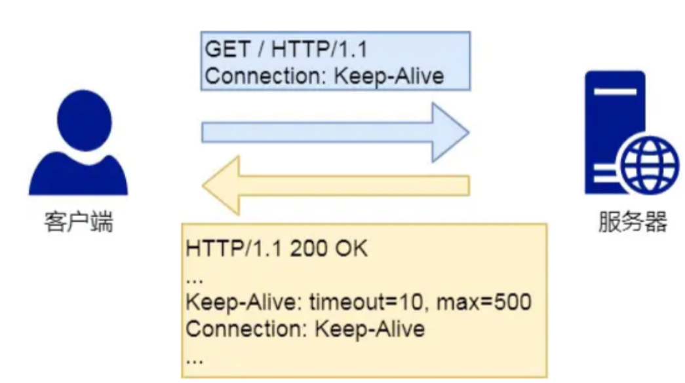
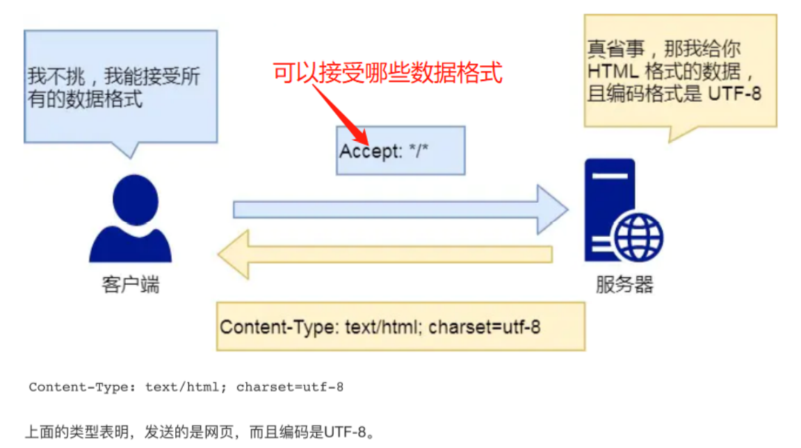
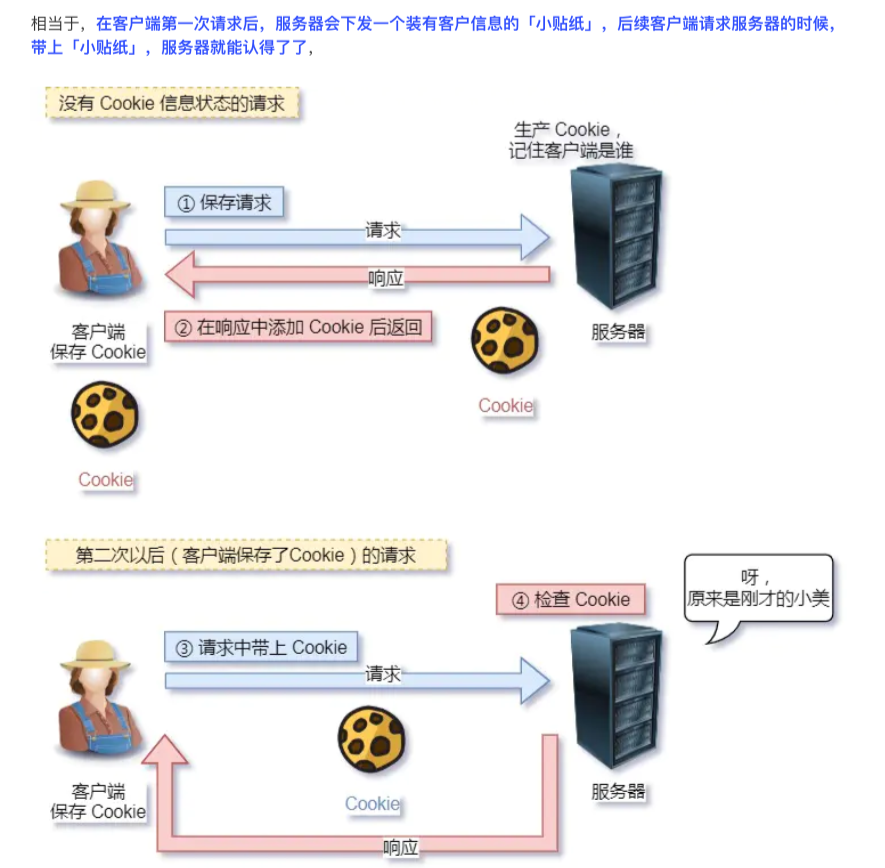
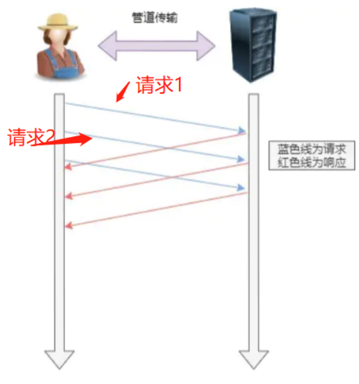
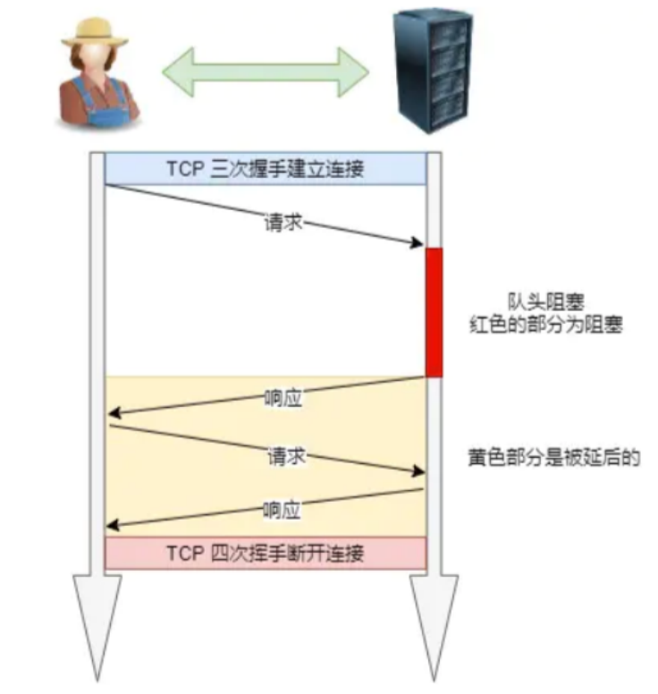
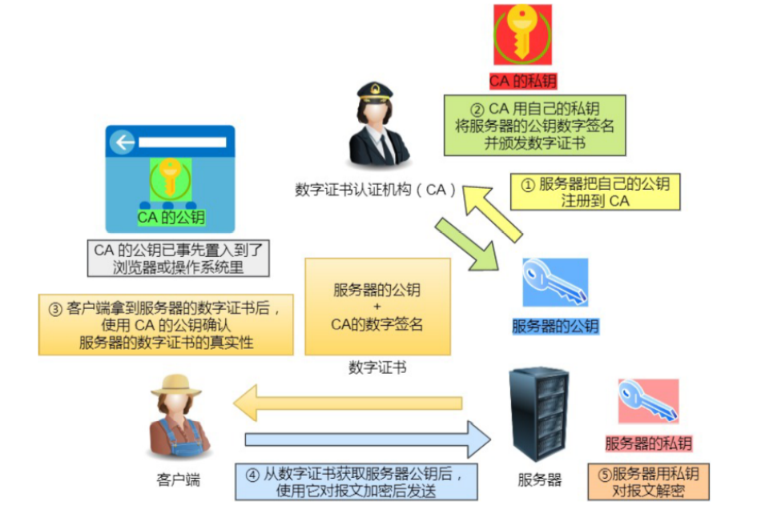
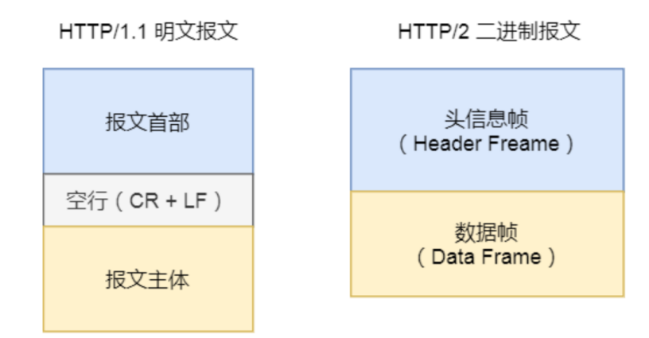

## TCP/IP网络模型

同一台设备上的进程之间的通信有很多种方式，比如管道、消息队列、共享内存、信号量、信号等，而对于不同设备上进程的通信就需要用到网络来进行通信，但是由于设备与设备之间的差异巨大，所以需要一套规范的通用网络模型。

这个网络模型是分层的，每一层都有不同的协议来完成不同的工作，下面概括地从上到下看一下每一层


### 应用层

代表协议HTTP,HTTPS,DNS,FTP等

我们的电脑，手机等设备上使用的软件就是在应用层开发的，应用层只专注于为用户提供服务，而不去关注数据是如何传输的，当不同设备之间需要进行网络通信的时候，应用就会把应用数据打包发送至传输层，由后面的层来完成数据的传输工作

应用层工作在用户态，而应用层以下的其他层都工作在内核态


### 传输层

应用层的数据包会发送至传输层，传输层为应用层提供网络支持

传输层有两个重要的协议：TCP和UDP

TCP全称叫做传输控制协议（Transmission Control Protocol），大部分的应用使用的都是TCP传输协议，因为TCP协议提供了很多的特性比如流量控制、超时重传、阻塞控制等来实现其可靠传输

而UDP就不考虑这些特性，他只管发送数据包，不在乎是否发生丢包等现象，因此UDP协议的速度会比TCP快，但是它不可靠，事实上，如果想要实现可靠的UDP传输也并非不可能（比如HTTPS/3中就将TCP换成了UDP），将TCP的特性在应用层上实现即可，但是实现一个商用的UDP也并非易事

当应用层需要传输的数据非常大时，直接传输不好控制，当数据包大小超过了MSS（TCP最大的报文段长度）时，传输层就会将数据包分片，这样即使在传输过程中发生了丢包现象，那么也不用重新传输整个的数据包，只需要重传丢失的数据包即可。


上图中的每一个分块都叫做一个TCP分段（TCP Segment）

而且，当设备作为接收方的时候，TCP协议还需要把数据发送至应用程序，但是有一个问题：设备中可能会存在多个程序在等待数据或者发送数据，那么TCP是怎么知道将这个数据发送给哪个程序呢？解决这一问题的答案就是端口，端口能够将应用程序区分开

比如80端口通常是web服务器使用的，22端口通常是登录远程服务器时使用的，而对于浏览器中的每个标签栏都是一个独立的进程，此时操作系统会给他们分配一个临时的端口号

**<font color=red>综上，传输层实现的不是设备与设备之间的网络通信，而是应用到应用之间的网络通信，传输层是应用之间数据传输的媒介，能够通过端口将数据包正确地分发给响应的应用程序</font>**


### 网络层

网络层中最常用的协议是IP协议，网络层会将传输层的数据包当成自己的数据部分，然后再加上IP头部组装成IP报文，如果IP报文的大小超过MTU（以太网中MTU的大小是1500字节）会再次进行分片，得到一个即将发送的IP报文，如下图


网络层实现的是设备和设备之间的通信，世界上有很多的设备，那么通信双方是如何找到对方的呢？答案是IP地址，IP地址作为标识设备的编号可以让通信双方找到彼此，对于IPv4协议，IP地址移动有32位，共分成了4段，每段8位，很显然，如果通过字符串匹配的方式去**寻址**的话效率很低，因此，IP地址被划分成了两个部分，分别代表不同的意义：

- 网络号：标识该IP地址属于那一个子网
- 主机号：标识该IP地址是子网下的哪个主机

IP地址会配合子网掩码来计算出网络号和主机号，在寻址过程中，先去找到相同的网络号，再去匹配对应的主机号

IP协议还有一个重要的功能就是**路由**，在实际场景中，两台设备很少是通过网线直接传输，而是他们之间可能是通过很多的路由器、交换机等设备连接起来的，那么就会形成很多条网络路径，因此当数据包到达一个网络节点时，需要通过特定的算法计算出下一步往哪里走，应该选择哪一条路径

**<font color=red>综上，IP协议有两个作用，一个是寻址，一个是路由，寻址的作用是告诉我们下一个目的地该往哪个方向走（下一个目的地在哪里），路由的作用是告诉我们去下一个目的地应该选择哪一条路径，可以看出，无论是寻址还是路由，都没有真正意义上进行传输，而是指明方向和路径</font>**

> 寻址是找到目的地在哪里，路由是从当前位置到目的地走哪条路


### 数据链路层

上面说到，网络层只是指明了数据包应该往哪里发送，走哪条路发送，而真正对数据包发送的是数据链路层（data link layer），**数据链路层为网络层提供链路级别的传输服务。**

我们从上面知道了，设备与设备很可能不属于同一个子网，那么他们之间通信必须经过一些中间设备，这个设备通常是路由器，路由器可以通过路由表计算出IP地址，那么这时候问题就来了，计算出IP地址后，路由器怎么知道这个IP地址是哪个设备的呢？这时就需要数据链路层了，这层为每个设备添加了一个**唯一标识，也就是MAC地址，**路由器计算了下一个目的地的IP地址，然后再通过ARP协议找到该目的地的MAC地址，这样就能够知道这个IP地址标识的是哪个设备了


### 物理层

当数据准备从设备发送到网络时，需要把数据包转化成电信号，让其可以在物理介质中传输，这一层叫做物理层，他主要为数据链路层提供二进制传输的服务


## HTTP常见的五类面试题

### 一、HTTP的基本常识

#### HTTP协议的定义

HTTP全称是HyperText Transfer Protocol超文本传输协议，对于这个协议的理解可以分成三部分：协议、传输、超文本

- 协议：首先HTTP是一个应用层协议，它使用了计算机能够理解的语言确立了一种能够在计算机之间交流通信的规范（两个以上的参与者），以及各种相关的控制和错误处理方式
- 传输：这里的传输指的是数据可以从A点传输到B点，也可以从B点传输到A点，是一个双向传输，而且允许A点和B点之间有其他的中转或者接力
- 超文本：超文本的意思就是不仅仅是文本，它可以是文本、图片、视频、超链接等的混合体，HTML就是最常见的超文本，HTML本身只是纯文字文件，但是内部使用了很多标签定义了图片、视频等的链接，在经过浏览器解释，呈现给我们的就是一个有文字和画面的网页了

**<font color=red>综上，HTTP是一个在计算机世界里专门在两点之间传输文本、图片、音频、视频、超链接等超文本数据的约定和规范</font>**


#### HTTP状态码

- `1xx`，表示目前是协议处理的中间过程，一般不会用到
- `2xx`，提示成功，表示服务器已经收到了报文并且成功处理了
  - `200  OK`，表示一切正常，返回的数据中包含`body`数据
  - `204  No Content`，类似于`200`，只是返回的数据中只有头部，没有`body`
  - `206  Partial Content`，应用于`HTTP`分块下载或者断点续传，表示响应返回的`body`数据只是一部分，不是资源的全部，也是服务器成功处理的状态之一
- `3xx`，表示客户端请求的资源发生了变动，客户端需要修改url重新请求资源，即重定向
  - `301  Moved Permanently`，表示永久重定向，请求的资源已经不存在了，需要更换url重新访问
  - `302  Found`，表示临时重定向，说明请求的资源还在，只是暂时需要使用新的url来访问
  - `304  Not Modified`，不具备跳转的含义，表示客户端请求的资源在本地存在缓存，而且服务端上的资源也没有发生变化，因为重定向到本地的缓存，因此304又被称作缓冲重定向，用于缓存控制
- `4xx`，表示客户端请求出错，服务端无法处理
  - `400  Bad Request`，表示客户端请求出错，是一个比较笼统的错误
  - `403  Forbidden`，表示服务器禁止访问资源，并不是客户端的请求出错了，但是可能是由于客户端的权限不够
  - `404  Not Found`，表示客户端请求的服务器资源没有找到，因此没有办法返回给客户端
- `5xx`，表示客户端的请求没有问题，服务端处理时内部出错
  - `500  Internal Server Error`，和`400`类似，都是一个比较笼统的状态码，表示服务端内部出现问题
  - `501  Not Implemented`，表示客户端请求的功能服务端暂时还没有实现，类似于“敬请期待”
  - `502  Bad Gateway`，通常是服务端作为网关或者代理时返回的状态码，这个状态码表示服务端本身工作正常，但是它的后台服务器却发生了错误
  - `503  Service Unavaiable`，表示服务器繁忙，暂时无法响应客户端，类似于“服务端正忙，暂时无法提供服务”


#### HTTP中常见字段

> host字段



我们通过域名能够解析出IP地址，一台服务器上可以部署多个网站，因此host字段的作用就是**将请求发送到一台服务器上的不同网站**

> Content-length字段

这个字段表示的是服务器本次响应返回的数据的长度


> Connection字段

Connection字段最常应用于客户端要求服务器使用TCP的长连接，以便请求复用



事实上，在HTTP/1.1中默认就是持久连接的，但是为了兼容新版本的HTTP，需要指定首部的`Connection`字段为`keep-alive`，这样一个可以复用的TCP连接就建立了，直到客户端或者服务端主动要求断开


> Accept和Content-Type



`Accept`表示客户端告诉服务器自己能够接受的数据类型

`Content-Type`表示服务器返回给客户端的数据类型


> Accept-Encoding和Content-Encoding


`Accept-Encoding`表示的是客户端告诉服务端自己能够接受的压缩方式

`Content-Encoding`表示的服务端使用的是怎样的压缩方式


#### GET与POST

Get是向服务器请求资源，这个资源可以是文本、图片、视频等，请求的参数被放在了URL中

Post是向服务器上指定的资源提交数据，数据被放在了请求的报文中

事实上，不管是GET还是POST，他们两个都是HTTP的请求方法，而HTTP是基于TCP/IP协议的，所以GET和POST请求方法的底层也是TCP/IP，因此GET和POST请求都是TCP连接，也就是说给GET加上一个`request body`或者给POST加上一个URL在技术上是可行的，但是由于HTTP的规定和浏览器/服务器的限制，GET和POST在使用过程中表现出一下不同，比如：

- Get的请求参数被放在了URL中，对用户是完全可见的，而POST的请求参数放在了`Request Body`中，安全性较好
- Get请求只能够接受URL编码，而POST请求能够接受多种编码
- GET请求的参数有长度限制，而POST请求的请求参数没有长度限制
- GET请求会被浏览器主动缓存，而POST不会
- ...

**GET和POST还有一个很重要的区别就是使用GET请求会产生一个TCP数据包，使用GET方式浏览器会把`http header + data`一起发送出去，服务器响应200；而是用POST请求会产生两个TCP数据包，最开始发送的是`http header`，当服务器响应了`100 continue`之后，浏览器才会把`data`发送出去，服务器再响应200**


#### 安全与幂等

- 在HTTP中，安全指的是请求方法不会破坏服务器上的资源

- 幂等指的是多次相同的操作返回的结果相同

因此，GET操作是安全且幂等的，因为GET操作就相当于查询数据，是一个只读操作，无论他进行多少次，都不会改变服务器上的资源，而且每次结果都相同，但是POST是不安全且不幂等的，因为使用POST提交请求会新增/修改服务器上的资源，所以他是不安全的，而多次提交数据就会创建多个不同的资源，因此POST也是不幂等的

```
POST所对应的URI并非创建的资源本身，而是资源的接收者。比如：POST http://www.forum.com/articles的语义是在http://www.forum.com/articles下创建一篇帖子，HTTP响应中应包含帖子的创建状态以及帖子的URI。两次相同的POST请求会在服务器端创建两份资源，它们具有不同的URI；所以，POST方法不具备幂等性。
```


### 二、HTTP的特性

HTTP最突出的优点就是简单、灵活和易于扩展、应用广泛和跨平台

- HTTP的简单体现在它的基本报文格式就是`header + body`，头部信息也是`key-value`的形式
- HTTP的灵活和易于扩展体现在HTTP协议中的各类请求方法、URI/URL、状态码、头字段等每个组成要求都没有被固定死，允许开发人员自定义和扩充
- HTTP的应用广泛和跨平台体现在日常生活中，从电脑上的浏览器到手机上的各种APP，HTTP应用遍地开花

**HTTP还有两个重要特性，一个是无状态，另一个是明文传输**

- 首先是无状态，无状态的好处是因为浏览器不回去记忆HTTP的状态，这样能够节省资源，使得CPU能够更好地去服务请求，而无状态的坏处在于当进行一些关联操作的时候比较麻烦，比如再进行网上购物时，流程通常是`登录 -> 添加购物车 -> 下单 -> 结算 -> 支付`每一个过程需要验证用户的身份信息，这显然会带来很差的用户体验，对于HTTP无状态的解决方式通常是可以使用Cookie技术，Cookie技术通过在请求和响应报文中写入Cookie信息来控制客户端的状态

  

- 其次是明文传输，明文传输意味着应用数据在传输过程中是易于阅读的，通过浏览器的F12和其他的抓包软件都可以直接看到，方便调试，也正是由于这个特性，HTTP是不安全的，这相当于应用信息在网络中裸奔

其实HTTP最显著的一个特点就是**<font color=red>不安全</font>**，原因是：

- 通信使用明文传输，内容可能受到窃听
- 通信过程中不去验证服务端身份，容易遭到伪装，比如假的淘宝网站
- 通信无法验证报文的完整性，内容可能被篡改


### 三、HTTP/1.1的性能

HTTP协议是基于**TCP/IP**协议的，并且是基于**请求-应答**的模式，所以HTTP/1.1的性能关键就在这两个地方了：

- **首先是长连接**，在HTTP/1.0中，每一次的请求都需要建立一个TCP连接（三次握手），而且是串行请求，这也就导致了很多无谓的连接建立和断开，增加了通信的开销，而在HTTP/1.1中客户端可以通过`Connection`字段请求服务端开始长连接，使多个请求复用一个TCP连接，这样能够避免重复的连接和断开造成的开销，提高网络传输效率

  

  

- **第二是管道网络传输**，因为HTTP/1.1能够开启长连接，这也使得管道网络传输成为可能，即在同一个TCP连接中客户端发送多个请求，即第一个请求发送出去之后，不需要等待这个请求的响应，第二个请求也可以马上发出去，这样的做法能够减少整体的响应时间

  

  但是服务端是按照先后顺序来处理请求的，如果前面的请求特别慢，那么后面的请求只能等着，所以HTTP/1.1中存在**队头阻塞问题**，如下图：

  

总之，HTTP/1.1的性能一般，后面的HTTP/2，HTTP/3都是对HTTP协议的不断优化


### 四、HTTP和HTTPS

#### **<font size=4pt>HTTP和HTTPS的区别</font>**

- HTTP是超文本传输协议，使用明文传输，存在安全问题，而HTTPS则解决了HTTP中的安全缺陷，具体解决办法是通过在HTTP和TCP层之间加上了一层SSL/TLS层，能够对传输报文进行加密、验证服务器身份，并对报文进行完整性检查
- HTTP在TCP三次握手完成之后，便可以进行HTTP报文的传输了，而HTTPS在TCP三次握手之后，还需要进行TLS/SSL的握手过程，才能够进行加密传输
- HTTP的开放的端口号是80，HTTPS开放的端口号是443
- HTTPS需要向CA申请数据证书，来验证服务器的身份是否可靠


#### **<font size=4pt>改进</font>**

在前面提到了由于HTTP的明文传输，导致HTTP协议存在三个安全风险，分别是：

- 窃听风险：因为报文是明文的，所以很容易就被监听
- 篡改风险：HTTP没有对报文进行完整性检查，所以很容易受到攻击者的篡改
- 假冒风险：HTTP没有对服务器的身份进行验证，所以可能会存在假冒风险，比如假的淘宝网站

那么HTTPS就是通过在HTTP和TCP之间加入了SSL/TLS层解决了上面的三个安全问题


那么HTTPS是如何通过加了一层SSL/TLS解决了上面的三个风险的呢？

- 首先，通过**混合加密**的方式来对通信内容进行加密，解决了由明文传输带来的窃听风险
- 第二，通过**摘要算法**的方式来对HTTP报文进行完整性检查，解决了篡改风险
- 第三，通过**数字证书**的方式来对服务器身份进行校验，解决了假冒风险


1. 混合加密就是使用非对称加密交换客户端和服务端的密钥，使用对称加密来对通信报文进行加密，使用混合加密的原因在于对称加密运算速度快，但是只有一个密钥，因此需要保证密钥的安全性；而非对称加密有两个密钥，公钥可以随意分发而私钥保密，所以使用非对称加密能够解决密钥交换问题
2. 摘要算法就是对就是对将要发送的数据做一次Hash，相当于这个数据的指纹，发送的时候把这个指纹和明文同时加密发送给对方，对方解密之后在对明文计算一下Hash，看看和传过来的指纹是否一致，这样就能够验证数据的完整性了
3. 前面说到，在混合加密中，客户端首先会索要服务器的公钥，然后用这个公钥加密自己的私钥，服务端收到密文之后，用自己的私钥解开密文，就能够得到客户端的私钥了。但是这个过程中存在一个问题，那就是如何保证服务端的公钥的信任度和不被篡改呢？这里就需要借助第三方的权威认证机构CA（数字认证中心），将服务器公钥放在数字证书（由CA颁发）中，只要证书是可信的，公钥就是可信的



 

> 后面再详细讲解HTTPS和HTTP是如何建立建立的


### 五、HTTP/1.1 到 HTTP/2 到HTTP/3的演变历史

#### HTTP/1.1相较于HTTP/1.0的改进之处

- HTTP/1.1中使用了长连接，解决了HTTP/1.0中由于短连接而导致频繁TCP连接的建立与断开造成的性能开销
- HTTP/1.1中使用了管道网络传输，不需要等待请求的响应，只要前一个请求发送成功了，后一个请求就能够发出，这种做法降低了整体的响应时间

#### HTTP/1.1中存在的缺点

- 队头阻塞，可以看出在HTTP/1.1中使用管道网络传输能够发送多个请求给服务器，但是服务器对于请求是按照顺序响应的，如果前一个请求花费的时间过长，则会导致后面的请求迟迟得不到响应
- HTTP/1.1中请求只能从客户端发起，由服务器响应
- 请求和响应的头部没有经过压缩，首部信息越多延迟越大，只能够压缩body部分
- 发送冗余的首部，存在相当一部分请求的头部是相同的，那么每次发送相同的头部肯定会造成资源的浪费


#### HTTP/2相较于HTTP/1.1的改进之处

首先，**HTTP/2是基于HTTPS的了**，在安全性方面有了一定的保证，针对HTTP/1.1中存在的问题，HTTP/2做了如下的优化

- **多路复用，**HTTP/2中移除了HTTP/1.1中请求串行的要求，即在一个TCP连接中可以并发多个请求或者回应，而不用按照顺序一一对应，这样也就不会出现队头阻塞问题了，降低了延迟，提高了连接的使用率

  - 举例：在一个TCP连接里面，服务端收到了来自客户端的两个请求A、B，假设服务端先处理A请求，结果在处理过程中发现A非常耗时，那么他就会先停止处理A，转而去处理B，把请求B处理完之后，再去处理A剩下的部分

    

- **服务器推送，**HTTP/2在一定程度上改进了“请求-应答”这个模式，即服务器不再是被动地等待响应客户端的请求，也能够主动地向客户端推送一些信息

  - 比如：在浏览器请求HTML的时候，服务器可能会把JS，CSS等一些静态资源主动地推送给客户端，减少延时的等待，也就是服务器推送（Server Push，也叫Cache Push）

- **头部压缩，**HTTP/2会对头部信息进行压缩，如果同时发送多个请求，这些请求的头部类似或者一样，HTTP/2能够通过头部压缩算法来消除这部分的冗余，这个算法是**HPACK算法**：即在客户端和服务端同时维护者一张表，所有的字段都会存入这样表中，然后生成一个索引号，这样就不用发送相同的字段了，能够使用索引号来代替

- **二进制帧，**HTTP/2不再像HTTP/1.1那样传输的是纯文本的明文格式了，而是全面采用二进制格式，头和body都是二进制，统称为帧：头信息帧和数据帧，使用二进制虽然对人不友好，但是计算机处理起来是更快的

  

- **数据流，**HTTP/2中的请求不是按照顺序发送的，所以同一个连接里面相邻的数据包可能是属于不同的请求响应，因此要对每个数据包进行编号，指出它是属于哪个请求/响应 ，每个请求/响应的所有数据包统称为一个数据流，每个数据流都有着自己独一无二的编号，其中规定客户端发送的数据包编号为奇数，服务端发送的数据包编号为偶数，客户端还可以通过指定数据流的优先级来使服务器优先响应


#### HTTP/2存在哪些缺点，HTTP/3又是怎样改进的呢

HTTP/2的主要问题在于多个请求复用一个TCP连接，而下层的TCP并不知道这一个连接里面有多少个HTTP请求，所以一旦发生丢包现象，就会触发TCP重传机制，**这条TCP连接里面的所有HTTP请求都会被阻塞，直到丢失的包被重传回来**

**这时基于TCP传输层的问题，所以HTTP/3把HTTP下层的TCP协议换成了UDP**

因为UDP是不管顺序，也不管是否发生了丢包，所以使用UDP既不会有HTTP/1.1中队头阻塞问题，也不会出现HTTP/2中丢包之后所有HTTP请求被阻塞的问题，但是UDP是不可靠的传输层协议，因此出现了QUIC协议，**QUIC协议是基于UDP的，但是能够实现TCP的可靠传输**

- QUIC协议有自己的一套机制可以保证可靠传输，当某个流发生丢包时，只会阻塞这个流，而不会阻塞全部的流
- 在HTTP/3中头部压缩算法由HPACK换成了更好的QPACK，而且TLS从1.2变成了1.3
- HTTPS要建立一次连接，需要花费6次交互，先是建立TCP三次握手，然后是TLS1.3三次握手（TLS1.2是4次握手），QUIC协议直接把以往的TCP和TLS1.3的6次交互合并成了3次，减少了交互次数


所以，QUIC协议是一个基于UDP的伪TCP+TLS+HTTP/2的多路复用协议，QUCI是新协议，有很多设备不知道什么是QUIC，只会把他当成UDP，所以可能会产生一些问题，目前HTTP/3还未普及


参考链接

 https://blog.csdn.net/weixin_39843414/article/details/105213009

https://blog.csdn.net/weixin_45462681/article/details/113519269

