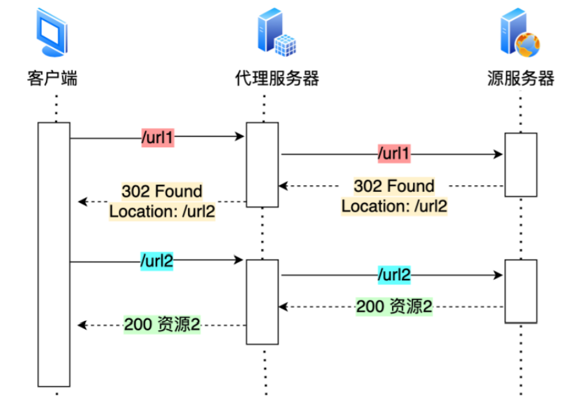
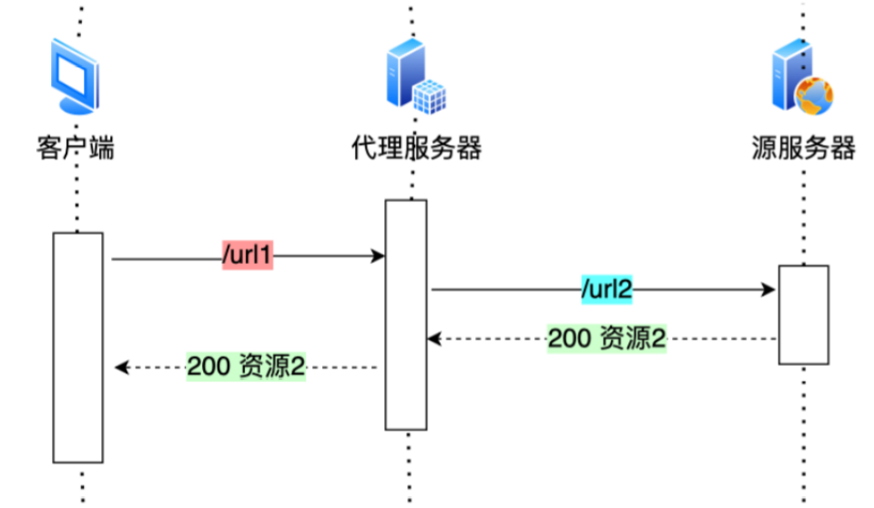
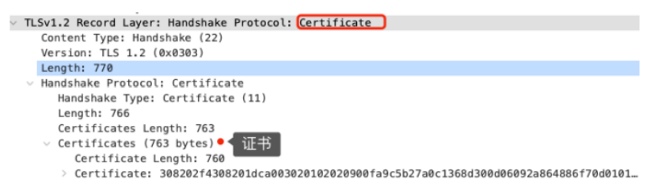
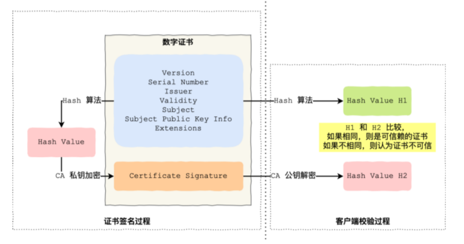
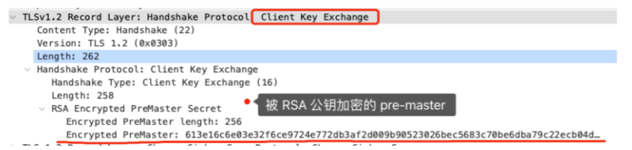
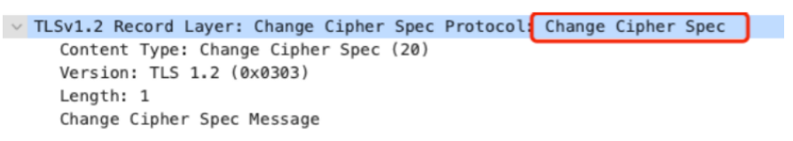

## HTTP协议还可以从哪些方面进行优化

前面我复习过了HTTP/1.1对于HTTP/1.0的优化是使用了长连接和管道网络传输，这样能够减少TCP连接创建和断开导致的时间开销，但是会出现队头阻塞、头部信息冗余等问题；HTTP/2对于HTTP/1.1的优化是使用了多路复用机制、二进制帧、数据流、头部压缩算法来解决了上述的问题，但是因为HTTP/2的底层是TCP，所以一旦发生丢包现象，这一个TCP连接里面的请求都会被阻塞，知道丢失的包被重传回来，所以HTTP/3对于HTTP/2的优化就在于将底层TCP更换成了UDP，实现了一个QUIC协议，这个协议能够实现稳定传输，换句话说，QUIC是一个基于UDP的伪TCP协议

除了上面这些，从哪些方面还可以对HTTP协议进行优化呢？

### 避免发送HTTP请求

怎么能够避免发送HTTP请求呢？答案是通过**缓存**，对于一些重复的HTTP请求，其响应是一样的，那么我们可以把`请求-响应`看作是`key-value`缓存到本地，当发送HTTP请求之前，现在本地缓存中查找一下，如果能够找到，那么就不用再发送请求了


但是上面的缓存存在一个问题：如果服务器上的资源发生了变化，而请求并没有到达服务器，这样就会造成请求的数据和服务器上现在的数据不一致，那么怎么解决这个问题的？答案是给响应设置一个**过期时间**，具体流程为：

- 第一次的请求会被发送到服务端，服务端会在响应数据的头部设置一个字段叫做过期时间，这个过期时间是服务器计算出来的，预估的一个数值，然后客户端会把这个响应数据缓存起来
- 当客户端再次发送相同的请求时，回先查看自己本地的缓存中数据头部的过期时间
  - 如果没有超过过期时间，那么客户端不用在向服务器发送请求，直接使用缓存中的数据就好了
  - 如果超过了过期时间，那么客户端需要向服务端再次发送请求，在请求的头部带上本地缓存中响应数据的摘要，这个摘要是本地缓存中数据的唯一标识，服务端收到请求之后，会把自己将要发送的数据和本地缓存中的数据进行比较，如果没有发生变化，那么返回的响应数据中可以没有body，状态码为204，而如果发生了变化，则返回的响应中需要携带上最新的数据


### 减少发送HTTP请求的次数

#### 减少重定向的次数

服务器上的资源可能由于维护、迁移等原因由url1变成了url2，但是客户端并不知道这种改动，而当客户端通过url1访问时，服务端不能够仅仅简单地返回404，而是应该返回302（临时重定向）和Location头部，告诉客户端服务器的资源已经迁移至url2，于是客户端需要向url2发送请求以获得服务器资源，如下图：



而且客户端和服务端之间往往不是直接相连，中间会存在一台或者多台代理服务器，因此重定向的次数越多，客户端发送的请求次数就越多，越会加重网络的负担

如果代理服务器能够完成重定向的工作，就可以减少HTTP重定向的请求次数了


如果代理服务器知道了重定向的规则，那么就能够进一步减少重定向的请求次数了



如果在重定向过程中返回的是301状态码，那么客户端可以想重定向的结果缓存到本地，以后直接通过发送url2就可以了


#### 合并请求

把多个小请求合并成一个大请求，虽然传输的总资源没有发生变化，但是将多个小请求合并成一个大请求，会**减少发送重复的请求头部**

另外，如果是HTTP/1.1，因为他是请求-响应模式，如果一个请求迟迟未得到响应，那么后面的请求就发不出去（队头阻塞），所以在HTTP/1.1中，为了防止单个请求的阻塞，浏览器一般会同时发送`5~6`个请求，每一个请求都是不同的TCP连接，那么如果合并了请求，也就是会减少TCP连接的数量，也较少了TCO连接握手和慢启动过程的耗时

**合并请求的方式就是合并资源，以一个大资源的请求代替多个小资源的请求，但是这样的合并请求会带来新的问题，如果大资源中的小资源发生了变化，客户端必须重新下载整个的大资源**


#### 延迟发送请求

 ⼀般 HTML 里会含有很多 HTTP 的 URL，当前不需要的资源，我们没必要也获取过来， 于是可以通过 **「按需获取」**的方式，来减少第⼀时间的HTTP 请求次数。 请求网页的时候，没必要把全部资源都获取到，而是只获取当前用户所看到的页面资源，当用户向下滑动页面的时候，再向服务器获取接下来的资源，这样就达到了延迟发送请求的效果。


### 压缩响应数据的大小

这里特指的HTTP/1.1，因为HTTP/2中有头部压缩算法，而且无论是头部还是数据部分，都被转化成了二进制帧，所以也没有太大压缩的必要，而HTTP/1.1中是没有办法对头部进行压缩的，静态表、动态表、Huffman编码是HTTP/2的内容，所以他可以对响应数据的body进行压缩

压缩方式主要分成了有损压缩和无损压缩

- 无损压缩主要是用在压缩程序源代码、可执行文件、文本文件等
- 有损压缩主要用在视频、图片等，他的压缩效果更好，但是会降低源文件的质量


## HTTPS的解析过程

在`day01.md`中就已经说到了HTTPS相较于HTTP就是多了一层`SSL/TLS`层，如下图


HTTPS就是通过`SSL/TLS`这一层解决了HTTP中存在的三个问题：窃听风险、假冒风险、篡改风险，而且HTTP在TCP三次握手之后就能够开始进行明文通信了，而HTTPS需要在TCP三次握手之后，在等`SSL/TLS`握手之后才能够进行加密通信

### SSL/TLS握手过程（以RSA密钥交换算法为例）

接下来，来看一下`SSL/TLS`的握手过程


上图简要概述了TLS握手的过程，每一个框都表示一条记录（record），类似于TCP中的`segment`，**记录是TLS收发数据的基本单位**，多个记录可以组成一个TCP包发送，所以通常需要经过四次TLS握手，2个RTT的时延，然后就能够在安全的通信环境里面进行加密通信了

**事实上，不同的密钥交换算法，TLS握手过程可能会有一些不同**

TLS中的密钥交换算法，考虑到加密通信的性能问题，在加密过程中通过对称加密算法，而对称加密算法的密钥是不能够被泄露的，因此为了保证密钥的安全性，使用非对称加密算法对密钥进行保护，这个工作就是由密钥交换算法来完成的

TLS握手的具体过程

- **<font color=red>第一次握手</font>**

  客户端发送`ClientHello`，具体包含TLS版本，客户端能够支持的密码套件列表以及客户端产生的一个随机数`Client-Random`，将这些信息发送到服务器，上面的这个随机数将会被服务端保留，用于后面的会话密钥制作

  

- **<font color=red>第二次握手</font>**

  第二次握手的过程比较多，可以分为`ServerHello`，`Certificate`，`ServerKeyExchange`，`ServerHelloDone`四个子流程

  - 首先是`ServerHello`，这一个过程中服务器会根据客户端发送过来的信息进行处理，首先确认TLS的版本，看看自己是否支持，然后他也会产生一个随机数`Server-Random`，最后他会在客户端支持的密码套件列表中选择出一个密码套件用于后续工作

    

    ```shell
    # 密码套件的格式
    # 密钥交换算法 + 签名算法 + 对称加密算法 + 摘要算法
    # 比如上面的TLS_RSA_WITH_AES_128_GCM_SHA256
    # 密钥交换算法和签名算法都是RSA（with前面的两个算法分别是密钥交换算法和签名算法）
    # TLS握手成功之后，通过AES对称加密来加密通信，密钥长度为128，分组模式为GCM
    # 摘要算法使用SHA256用于消息生产和产生随机数
    ```

    

  - 然后是`Certificate`，服务器将上述信息整合成一个记录，随后服务器为了证明自己的身份会将自己的数字证书整合成一个记录

    

    > 当服务器将数字证书发送过去之后，客户端是怎样验证的呢？

    首先，数字证书中包含很多信息，比如公钥、持有者信息，证书认证机构的信息等，数字证书的作用就是用来验证公钥持有者的身份，以防止第三方冒充，在这里面就是用来让客户端验证服务器是否可信

    

    ```shell
    # 证书签名的过程如上图中的左图
    
    # 1.首先CA会把持有者公钥、用途、颁发者、有效时间等信息打成一个包，然后对这个包进行HASH计算，得到一个hash值
    # 2.然后用CA的私钥对这个hash值进行加密，生成Certificate Signature（数字签名）
    # 3.最后将数字签名添加到文件证书上，形成数字证书
    
    # 客户端骄校验数字证书的过程如上图中的右图
    
    # 1.客户端会使用相同的hash算法对持有者信息、证书认证机构等信息进行一次计算
    # 2.客户端使用CA公钥对数字证书中的数字签名进行解密
    # 3.比较解密出来的数字签名和第一步中的计算出来的hash值，如果相同证明服务器可信，如果不同，那么服务器不可信
    ```

  

  - 随后，服务器会发送`ServerHelloDone`，表示服务器将应该发送给客户端的数据都发送过去了，第二次握手结束

  **可以看出，当TLS第一次和第二次握手结束之后，客户端和服务端确定了TLS的版本，并且都知道了后续应该使用什么密码套件来进行工作，而且都有了两个随机数**

- **<font color=red>第三次握手</font>**

  第三次握手发生在客户端校验完成服务器数字证书之后，紧接着客户端会产生另外一个新的随机数，叫做`pre-master`，接着用服务器的RSA公钥加密这个随机数，通过`Client Key Exchange`这条记录将这个随机数发送给服务端

  

  服务器收到之后，会使用RSA私钥解密这个随机数

  **三次握手成功之后，客户端和服务端双方都拥有了三个随机数，分别是Client-Random,Server-Random,pre-master，于是双方会根据这三个随机数生成<font color=red>会话密钥（Master Secret）</font>，他是对称密钥，用于后续的加密通信**

  生成完会话密钥之后，客户端又会产生一个记录，名为`change Ciper Spec`，通知服务端后续将使用上面的会话密钥进行通信了

  

  最后客户端会把之前发过去的全部信息做个摘要，在使用会话密钥加密一下，让服务器做个验证，看看在上面过程中是否发生了篡改，上面的这个摘要会被放到`Encrypted Handshake Message`这个纪录中

  

- **<font color=red>第四次握手</font>**

  服务器收到第三次握手的消息后，也会先生成会话密钥，然后生成`Change Cipher Spec`记录，然后再去验证客户端发送过来的摘要，将验证结果放入`Encrupted Handshake Message`，如果客户端和服务端双方加密和解密都没有问题，那么握手正式完成，之后便会通过上面产生的会话密钥（Master Secret）进行加密通信了


### 不同密钥交换算法的比较


## END

