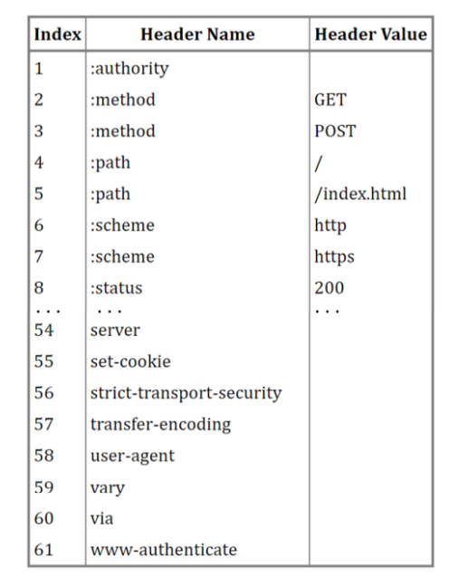
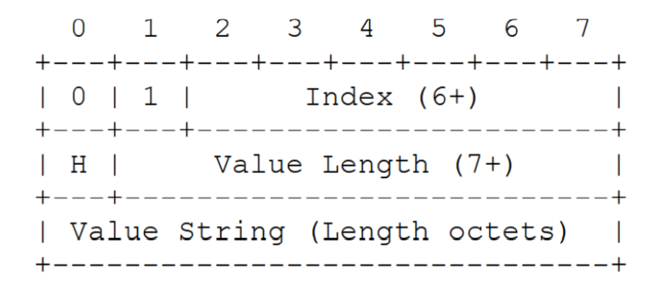
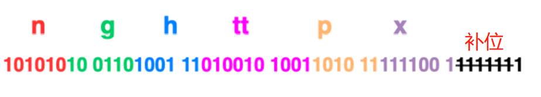
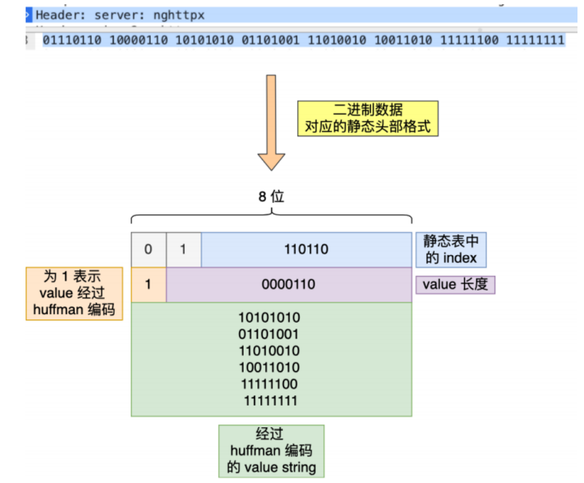
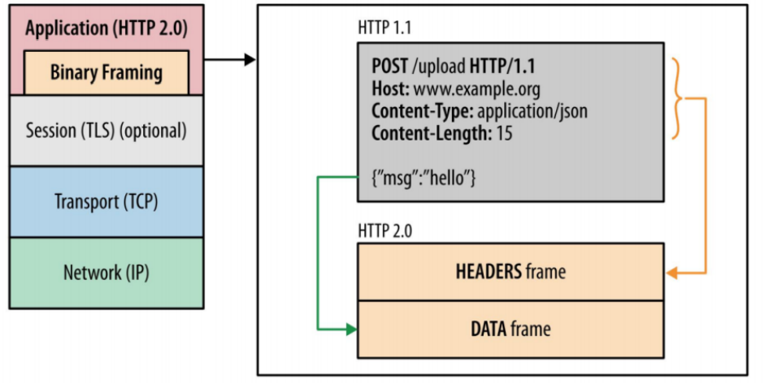
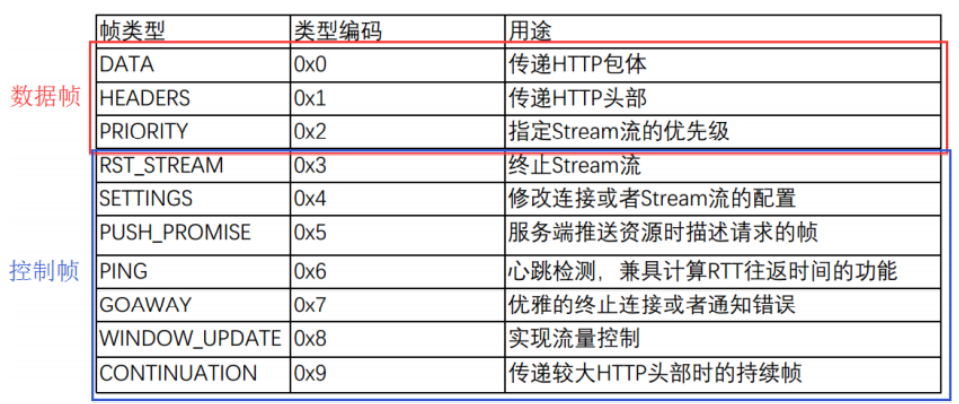
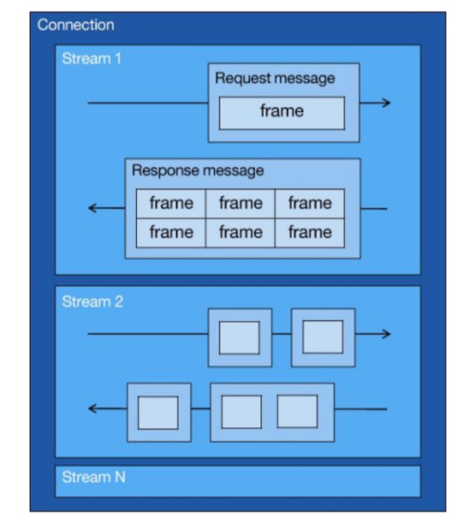
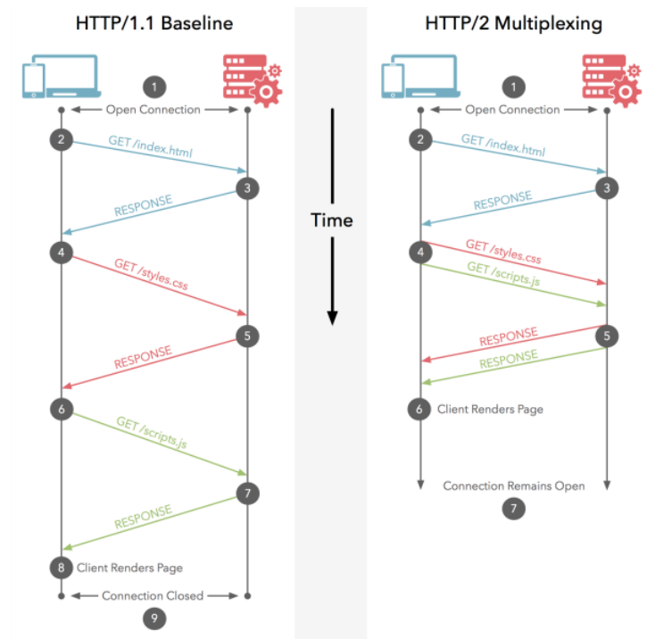
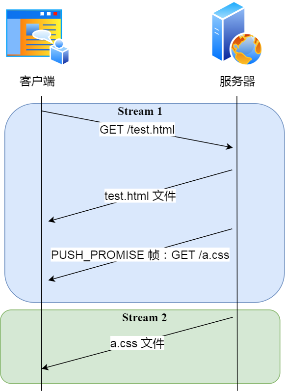

## HTTP/2的厉害之处

HTTP/1.1中存在的缺点队头阻塞，只能够对请求/相应报文中的body进行压缩，而不能够对报文的head进行压缩，并且请求只能从客户端发出，服务器负责响应（请求响应模型）

HTTP/2的厉害之处就在于它解决了HTTP/1.1中的问题，并且能够对HTTP/1.1做到向上兼容

在前面我们说到过对HTTP协议的优化，可以从如下几个方面来进行：

- 避免发送HTTP请求（缓存）
- 减少HTTP请求（减少重定向，合并请求，延迟请求）
- 减小服务器给客户端响应包的大小

但是可以看到，以上的优化策略均是从“外部”开始，也就是说HTTP/1.1的缺点仍然存在，属于治标不治本，因此，HTTP/2从内部出发，解决了HTTP/1.1中的问题


### 首先，HTTP/2的厉害之处在于它对HTTP/1.1做到了向上兼容

首先我们需要明确一个观念，HTTP/2是对HTTP/1.1的一次优化，HTTP/2的出现是为了提高HTTP/1.1的性能，所以协议的升级一个很重要的地方就在于它必须要兼容老版本，否则新版本的推广会受到很大的局限

> 那么HTTP/2是怎么样做到兼容HTTP/1.1的呢？

首先，HTTP/2中没有在URI中引入新的协议名，仍然以`http://`表示明文传输，`https://`表示密文传输，于是只需要客户端和浏览器在背后悄悄的自动升级协议，可以不让用户感受到协议的变化，实现协议的平滑升级

第二，HTTP/2只是在应用层做了改变，它还是基于TCP协议的传输，应用层方面为了保证功能上的兼容，把HTTP/2协议分成了语义层和语法层，语义层和HTTP/1.1中的保持一致，比如请求方法，状态码，头字段等，而**语法层做了较大的变化，基本改变了HTTP传输报文的格式**


### 第二，使用头部压缩算法HPACK来压缩头部

我们知道，HTTP的报文是由`header + body`组成的，对于body部分，HTTP/1.1协议可以在头字段中通过执行`Content-Encoding`来指定对body 的压缩方式，比如`gzip`，这样可以用来节约带宽，但是HTTP/1.1中并没有对header的压缩方式

因此，HTTP/1.1中的数据报文存在以下问题：

- 报文的header中含有很多固定的头字段，比如Cookie,User Agent,Accept等，这些字段加起来也有上百甚至上千字节，所以有必要压缩，有可能body中数据的长度很少，所以传输这样的一个报文明显头重脚轻
- 大量的请求和响应的报文中有很多头字段都是重复的，这样会使得大量的带宽被冗余数据占用，所以有必要避免重复性
- HTTP/1.1的报文是由ASCII码编码的，虽然有利于人类观察，但是计算机处理这样的报文效率低，所以在HTTP/2中把它改成了二进制格式

HTTP/2中没有使用常见的`gzip`等压缩方式来对头部进行压缩，而是采用的HPACK算法对头部进行压缩，该算法主要有三个部分组成：

- 静态表
- 动态表
- Huffman编码（压缩算法）

**这个算法大致的思路就是在客户端和服务器上共同维护一个字典，通过较小的索引号来代替较长的字段名，然后再使用Huffman编码压缩数据，压缩率能够达到50%-90%**

> **<font color=green size=4pt>静态表编码</font>**

**HTTP/2为频繁出现在头部的字符串和字段建立了一张静态表，共61个，他是被写入到了HTTP/2的框架中的，不会发生变化，**如下图：



表中的`Index`表示索引，`Header Value`表示索引对应的`Value`，`Header Name`表示的是字段的名称，比如`index`为2代表着GET，index为8代表着状态码200

同时我们也可以发现，表中有的`Header Value`处是空着的，这是因为这些字段的值是不确定的，需要根据实际情况来填写，当这个value被填写上之后，会先经过Huffman编码之后才能够发送出去

```shell
# 举例
server: nghttpx\r\n # 共有17个字节， \r是一个字节
使用了静态表和 Huffman 编码，可以将它压缩成 8 字节，压缩率大概 47 %
```

**那么HTTP/2中报文中header的格式是什么样子的呢？**

根据RFC7541规范，<font color=red>如果字段在静态表中，并且value是变化的，那么它的HTTP/2头部前两位是`01`，</font>所以对于某个字段在头部中的格式如下：



由于HTTP/2是使用二进制编码，所以不再需要`\r\n`来分割字符串了，改用字符串的长度`value length`来分割index和value

还是上面`server:nghttp\r\n`，通过抓包可以发现它的二进制编码如下：


- 首先看红色部分，因为server是在静态表中，而且它的value值是变化的，所以前两位是`01`，又因为`server`在静态表中的编号是54，对应的二进制是110110，所以红色部分就是01110110
- 然后第二个字节的第一个比特位表示的是是否经过了Huffman编码，1表示经过了Huffman编码，后面的7位表示数据（value）的长度，比如上图中第二个字节为`10000110`，第一个1表示经过了Huffman编码，后面的`0000110`表示value的长度为6
- 也就是说，`nghttp\r\n`经过Huffman编码之后被压缩成了6个字节，事实上，在HPACK算法中，Huffman编码的原理就是将出现频率较多的字符用较短的编码来表示，从而达到压缩的目的

于是，**在统计大量的 HTTP 头部后，HTTP/2 根据出现频率将 ASCII 码编码成了 Huffman 编码表，**可以 在 RFC7541 文档找到这张静态 Huffman 表，通过查表后，字符串`nghttpx`的Huffman编码在下图看到，共有6个字节，每⼀个字符的 Huffman 编码，我用相同的颜色将他们对应起来了，最后的 7 位是补位的。





所以说，在HTTP/2中报文的头部就是由上面这种格式的二进制数据组成的


> **<font color=green size=4pt>动态表编码</font>**

上面我们提到了静态表中总共就有61个高频出现的字段，那么如果头部中出现了这61个之外的字段怎么办呢？解决方法就是使用动态表，动态表的index从62开始，动态表在编码和解码过程中随时更新

比如第一次发送请求时的`user agent`字段的value有几百个字节，经过Huffman编码之后在客户端和服务端的字典中都会把这个字段以及value更新到自己的动态表中，那么下次在发送这个`user agent`的时候，就不用发送这个字段和它的value了，直接发送一个索引就行了，因为服务器能够通过这个索引直接在它的动态表中找到这个字段对应的value

从上面的过程中也能够看出，**动态表能够生效的前提是：必须是同一个TCP连接，重复传输完全相同的HTTP头部，**如果消息字段在一个连接上只发送了依次或者它的value值总是会发生变化，那么动态表就没办法很好的工作了

因此，随着连接上越来越多的HTTP/2请求，理论上客户端和服务器上最终会维护其一个包含全部字段和value的动态表，理论上最终每个头部字段都会变成 1 个字节的 Index，这样便避免了大量的冗余数据的传输，大大节约了带宽。但是随着请求的增多，动态表也会逐渐增大，占用更多的内存，导致服务器效率降低，因此，web服务器都会提供类似 http2_max_requests 的配置，用于限制一个连接上能够传输的请求数量，避免动态表无限增大，请求数量达到阈值之后，就会关闭HTTP/2的连接（**HTTP连接本质上就是TCP连接**）来释放内存


### ==第三，HTTP/2中使用了二进制帧来传输数据==

**HTTP/2中一个很棒的改动就是二进制帧，因为他是HTTP/2并发传输的基础**

HTTP/2将HTTP/1.1中的文本传输格式转化成了二进制格式传输数据，极大地提高了HTTP的传输效率，而且使用二进制能够加速HTTP的加解码操作

HTTP/2把响应报文划分成了两个帧（Frame），图中的HEADERS首部和DATA（消息负载）是帧的类型，也就是说**一条HTTP报文，划分成了两个帧来传输，并且采用二进制编码**



> **<font color=red size=4pt>HTTP/2二进制帧的结构</font>**


可以看到，HTTP/2的二进制帧的帧头很小，一共才9个字节：

- 帧的前三个字节表示帧数据的长度

- 帧长度后面的一个字节用来表示帧的类型，HTTP/2共定义了10中不同类型的帧，一般分为数据帧和控制帧，如下

  

  > 从数据帧里面的类型中也可以看出，HTTP报文的header和body是通过不同的帧分开传输的

- 帧类型后面的一个字节是标志位，可以保存8个标志位，用于携带简单的控制信息，比如：

  - END_HEADERS 表示头数据结束标志，相当于 HTTP/1 种header后的空行（“\r\n”） 
  - END_STREAM 表示单方向数据发送结束，后续不会再有数据帧 
  - PRIORITY 表示流的优先级

- 标志位后面的4个字节是流标识符（Stream ID），但是这32位中最高位保留不用，只有31位可以使用，因此流标识符的最大值是`2^31`，大约是21亿，**它的作用是用来标识该Frame属于哪个Stream**，接收方可以根据这个信息从乱序的帧中找到具有相同Stream ID的帧，从而把他们组装起来

- 最后面就是Frame Payload（帧数据），他存放的是通过HPACK算法压缩过的HTTP头部和二进制包体

  

### 第四，HTTP/2通过Stream实现了并发传输

我们知道HTTP/1.1是基于请求-响应模式的，在同一个连接中，HTTP完成一个事务（请求和响应）之后，才能够处理下一个事务，也就是说请求在等待响应的过程中是不能够干其他事情的，如果响应迟迟不来，那么后续的请求是无法发送的，这也就是队头阻塞问题

HTTP/2中通过Stream解决了HTTP/1.1中的队头阻塞，**多个Stream复用一个TCP连接**，达到并发的效果，提高了系统的吞吐量



> 图中 `Stream` 表示多个数据流，它们可以源源不断地并发传送，同一个 `Stream` 流中的 `frame` 数据是串行发送的。 

从上图中可以看出：

- 一个TCP连接中可以有一个或者多个Stream，Stream是HTTP/2能够并发请求的关键技术
- Stream里可以包含一个或者多个message，Message对应的是HTTP/1.1中的请求/响应
- Message里面包含一个或者多个frame，frame是HTTP/2中最基本的传输单位，以二进制压缩格式存放HTTP报文的header和body


连接 Connection： 1 个 TCP 连接，包含一个或者多个 Stream。
数据流 Stream：一个双向通讯数据流，包含 1 条或者多条 Message。
消息 Message:对应 HTTP/1 中的请求或者响应，包含一条或者多条 Frame。
数据帧 Frame：最小单位，以二进制压缩格式存放 HTTP/1 中的内容


在HTTP/2连接上，**不同Stream的帧是可以乱序发送的（因此可以并发不同的Stream）**，因为每个帧的头部会携带Stream ID信息，所以接收端可以通过Stream ID有序组装成HTTP消息，而**同一Stream内部的帧必须是严格有序的**

客户端和服务端双方都可以建立Stream，Stream ID也是有区别的，客户端建立的Stream必须是奇数号，而服务器建立的Stream必须是偶数号。

**同一个连接中的Stream ID是不能复用的，只能顺序递增**，所以当Stream ID耗尽时，需要发送一个控制帧`GOAWAY`，用来关闭TCP连接

在 Nginx 中，可以通过 `http2_max_concurrent_streams` 配置来设置 Stream 的上限，默认是 128 个。

很显然，使用HTTP/2通过Stream实现并发要比HTTP/1.1实现并发好很多，因为同样要实现100个并发请求，HTTP/2只需要一个TCP连接就可以并发100个Stream，而HTTP/1.1需要建立100个TCP连接，每个TCP连接都需要经过三次握手，慢启动以及TLS握手等过程，这些过程是非常耗时的（==这时没开启长连接的情况吧？！，可能是说的并发==）

HTTP/2同样还可以对每个Stream设置不同的优先级，帧头中的标志位可以设置优先级，比如客户端访问HTML/CSS 和图片资源时，希望服务器先传递 HTML/CSS，再传图片，那么就可以通过设置 Stream 的优先级来实现，以此提高用户体验。




### 第五，HTTP/2能够实现服务器主动推送资源

我们知道在HTTP/1.1中服务器是不会主动推送资源的，因为HTTP/1.1是请求-响应模型，所以只能由客户端发送请求之后，才能够获取到服务器响应的资源

比如。客户端通过HTTP/1.1请求从服务器那里获取到了HTML文件，而HTML文件可能还需要CSS文件来渲染页面，这是客户端还要再发起CSS文件的请求，需要两次消息往返，如下图中的左部分：


如上图中的右部分，在HTTP/2中，客户端在访问HTML时，服务器可以主动推送CSS文件，减少了消息传递的次数

在Nginx中，如果你希望客户端访问/test.html，服务器主动推送/test.css，那么可以这么配置：

```nginx
location /test.html { 
  http2_push /test.css; 
}
```


> 那么服务器推送的原理是什么呢？

我们知道，客户端发送请求时，使用的Stream ID必须是奇数，服务器主动推送发送的Stream ID必须是偶数，在服务器推送资源的时候，会通过`PUSH_PROMISE`帧传输HTTP头部，并通过帧中的`Promised Stream ID`字段告知客户端，接下来会在哪个Stream中发送包体



值得注意的是：服务器在Stream1中通知客户端CSS资源即将到来，然后在Stream2中发送CSS资源，**Stream1和Stream2可以并发**


## 总结

最后，我们来总结一下HTTP/2的厉害之处，共五个方面：

**第一方面：HTTP/2能够对HTTP/1.1做到向上兼容，**因为HTTP/2的底层协议仍然是TCP，所以他只是在应用层做了功能的升级，解决了HTTP/1.1中的缺陷，为了做到兼容，HTTP/2协议分成了两个部分：语义层和语法层，HTTP/2的语义层和HTTP/1.1没有什么区别，比如头字段、状态码等，而语法层却发生了较大的变化，基本改变了HTTP报文的传输格式；除此之外，HTTP/2中没有引入其他的协议名，仍然是以`http://`表示明文传输，`https://`表示密文传输，其中的改动是由浏览器或者客户端在背后悄悄升级的

**第二方面：HTTP/2中使用了头部压缩算法，**我们知道HTTP/1.1中只能通过有损压缩/无损压缩来压缩body，并不能够对头部进行压缩，而一些报文的请求头有很多的相似之处，这可能会导致带宽压力过大，冗余过多，效率低下，因此HTTP/2中使用HPACK算法（静态表 + 动态表 + Huffman编码）来对头部进行压缩，静态表是写入HTTP/2协议中的，而动态表是会随着请求的增多而不断扩充的，但是动态表不断增大会导致服务器内存占用过多，降低效率，所以在一个TCP连接上会限制请求数量

**第三方面：HTTP/2使用了二进制格式（帧）来传输报文，**HTTP/2改变了HTTP/1.1中的文本传输格式，转而使用二进制格式，这种格式更有利于计算机进行加解码，天然上加快了速度，而且使用二进制帧也为后面的并发传输打下了基础，这里需要注意的一点是，对于一个HTTP报文，是分成了两个二进制帧发出去的，具体我们来看二进制帧的格式：

二进制帧的格式（二进制帧的header部分只有9个字节，分别如下）

- 前三个字节表示帧长度
- 第四个字节表示帧的类型，一般有10种类型，分成两个部分：数据帧和控制帧，数据帧中就包括HTTP header和HTTP body
- 第五个字节是标志位，可以传输一些简单的控制信号，比如终止符、优先级等
- 最后四个字节表示流标识符，即Stream ID，用来区分哪些帧是属于同一个流的，应用于后面的组装，但是这四个字节的第一个bit不用，因此Stream ID的最大值是`2^31`


**第四方面：HTTP/2基于二进制帧实现了Stream并发传输，**使用这种方式能够解决HTTP/1.1的队头阻塞，因为在一个TCP连接里面可以乱序发送（并发）Stream，所以对于请求/响应的顺序并不是按照顺序来的，而且一个Stream中可以包含多个message（对应着HTTP/1.1中的响应/请求），一个message中又可以有多个frame，需要注意的是虽然不同Stream中的帧是可以乱序发送的，但是同一个Stream中的帧必须是严格有序的，Stream ID不能复用，客户端的Stream ID是奇数，服务器的Stream ID是偶数


**第五方面：HTTP/2中的服务器能够实现主动推送，**减少了请求次数
