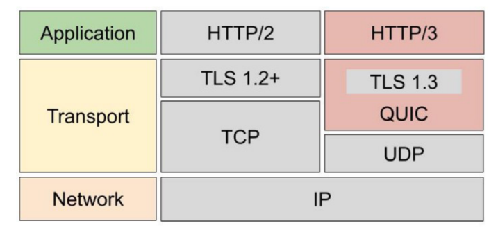
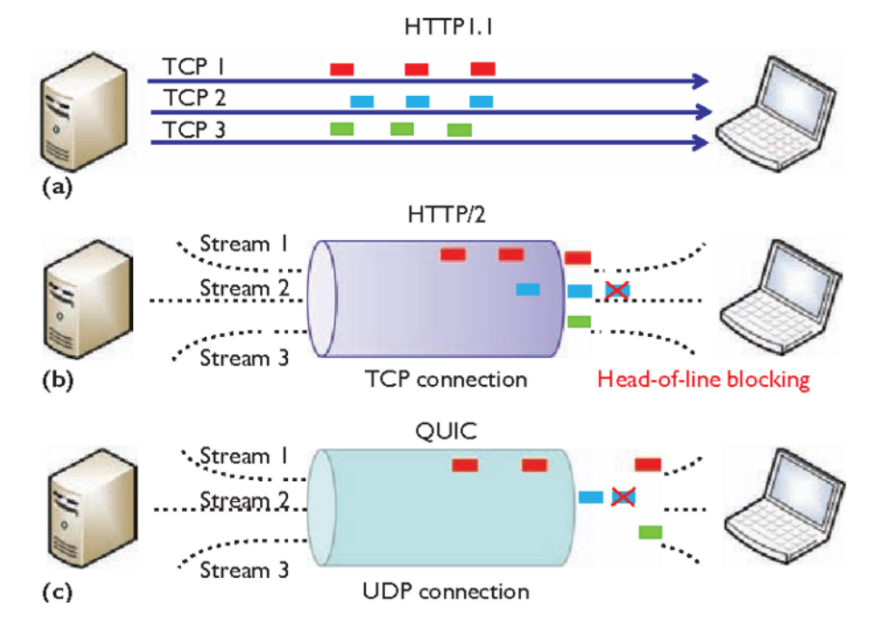
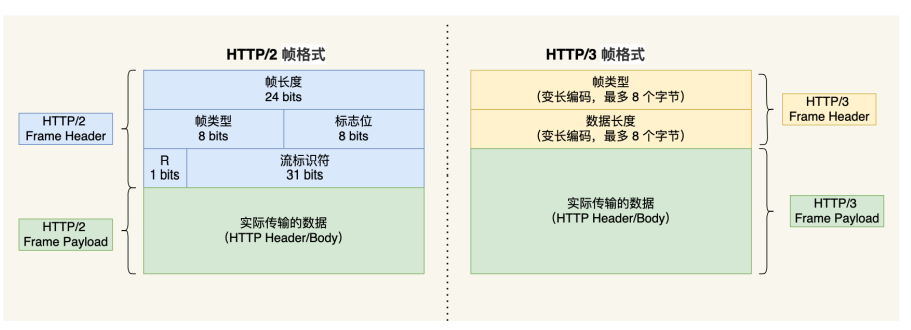

## HTTP/3

HTTP/2基于Stream实现了并发传输，解决了HTTP/1.1中存在的队头阻塞问题，但是实际上，HTTP/2又出现了另外一种形式的队头阻塞，因为HTTP/2是基于TCP协议的，而TCP协议是字节流协议，TCP层必须要保证受到的字节数据是连续且完整的，只有这样内核才会把缓冲区中的数据返回给应用程序，所以说，在传输过程中，如果发生丢包现象，有一个或者多个字节的数据没有到达，后来接收到的数据只能够存放在内核缓冲区中，只有等到缺少的数据都到了之后，HTTP/2应用层才能够从内核中获取到数据，也就是说，只要是一条TCP连接中的某个请求/响应发生了丢包，那么所有的请求都会被阻塞。这就是**HTTP/2中的队头阻塞问题**

==可以看出，HTTP/2中存在的队头阻塞问题的根源是TCP协议，于是HTTP/3的底层就把TCP给换成了UDP==

除了上面的队头阻塞问题，HTTP/2还有两个缺点：

- **TCP和TLS握手延迟：**当客户端发起HTTP请求的时候，需要经过TCP的三次握手和TLS的四次握手（TLS 1.2）才能够建立连接，而且连接建立之后，由于TCP拥塞控制特性，TCP刚建立连接的时候会有一个慢启动的过程，他会对TCP传输有一个减速的效果
- **网络迁移需要重新连接：**我们知道一个TCP连接是有一个四元组来确定（源IP，源端口，目的IP，目的端口），这也就意味着当四元组中的任意一个元素发生了变化，TCP和TLS就需要重新连接，比如移动设备从4G网络切换至WiFi，源IP必然会发生变化，那么这时候就需要和服务器重新连接了

于是，由于HTTP/2基于TCP存在上述的三个问题，所以在HTTP/3中就把TCP换成了UDP，同时把TLS协议更新成了1.3版本

同时为了解决UDP协议的不可靠，HTTP/3基于UDP在应用层实现了QUIC协议，这个协议能够实现类似于TCP协议中的“连接管理，阻塞控制，流量管理”等网络特性，相当于把UDP变成了可靠的协议了，所以不用担心HTTP/3中的丢包问题

从上面的图中，我们能够分析出，因为HTTP/3基于UDP，所以天然上HTTP/3就会比HTTP/2快，因为使用UDP是无连接的，所以也就没有了握手、挥手等过程，而且HTTP/3中还使用TLS 1.3协议，这样TLS握手过程也变成了1个RTT

上面我们提到了HTTP/2的三个缺点：队头阻塞问题，TCP和TLS握手导致的延迟，网络迁移需要重新连接

而HTTP/3中解决了上述的三个问题，我们接下来看一下具体是怎么解决的

### 无队头阻塞

QUIC协议也实现了类似HTTP/2中基于Stream的并发传输，也就是在一条连接上发送多个Stream，每个Stream可以被认为是一个请求/响应，由于QUIC协议使用的是UDP协议，所以他并不关心数据包的发送顺序，也不关心数据包是否丢失

但是为了保证数据包的可靠传输，QUIC协议给每个数据包一个序号来作为唯一标识，当某个stream中的数据包丢失后，即使其他的数据包已经到达了，HTTP/3应用程序也无法获得数据，直到丢失的数据包被重传回来，数据才能够被HTTP/3应用程序获取

如果其他流中的数据报文被完整接受了，HTTP/3就可以读取到数据，这与HTTP/2是不同的，因为一旦HTTP/2的Stream中发生了丢包现象，整个连接中的所有请求都会被阻塞，而HTTP/3则只会阻塞发生丢包的这个流，也就是说，在HTTP/3中每个Stream是相互独立的

### 更快的连接建立

**对于HTTP/1和HTTP/2协议，TCP和TLS是分层的，**分别属于内核实现的传输层，openssl库实现的表现 层，因此他们难以合并在一起，需要分批次来握手，先TCP握手，再TLS握手

HTTP/3在进行数据传输之前虽然需要QUIC协议握手，但是这个握手过程只需要1RTT，握手的目的是为了确定连接双方的连接id，后面的连接迁移就是基于连接id实现的

**但是HTTP/3的QUIC协议并不是与TLS分层，而QUIC协议内部还整合TLS1.3，他会在自己的帧中携带TLS的记录，再加上QUIC使用的是TLS1.3，他会在自己的帧中携带TLS的记录，再加上QUIC使用的是TLS1.3，因此仅需要一个RTT就能够建立连接并且协商出密钥，甚至在第二次连接的时候可以复用这个密钥，将应用数据包和QUIC协议握手信息（连接信息 + TLS握手信息）一起发送，达到0-RTT的效果（pre-shared key）**

### 连接迁移

我们上面提到了，基于TCP的HTTP/2协议是通过四元组来进行连接的，所以当移动设备从4G网络切换至WiFi的时候，源IP会发生变化，所以当切换网络之后，必须要断开当前的TCP连接，重新建立新的TCP连接，而连接过程中包含了TCP三次握手和TLS四次握手以及TCP的慢启动等过程，给用户的感觉就是切换网络之后会卡顿一下

而QUIC协议没有使用四元组来表示连接，他是使用的连接id来表示连接的两个端点，客户端和服务器可以各选一组id来标记自己，因此即使移动设备的IP地址发生了变化，连接也不用中断，只要保留了本次连接的上下文信息（TLS密钥、连接id等）就能够恢复通信，复用原连接，消除重连的成本，达到连接迁移的效果

以上就是HTTP/3对HTTP/2缺点的修正，可以看出，上面都是对TCP传输层的修正，而HTTP/3不仅在传输层上做了工作，同样他也对HTTP/2应用层做了一些优化

### 简化二进制帧格式

HTTP/3 同 HTTP/2 一样采用二进制帧的结构，不同的地方在于 **HTTP/2 的二进制帧里需要定义 Stream（流标识符，Stream ID）**，而 HTTP/3 自身不需要再定义 Stream，直接使用 QUIC 里的 Stream，于是 HTTP/3 的帧的结构也变简单了。

可以看到，相对于HTTP/2的帧格式，HTTP/3中的帧头部分只有帧类型和数据长度两个部分，根据帧类型可以将帧分成两个分布：数据帧和控制帧，HEADERS帧（HTTP头部）和DATA帧（HTTP包体）属于数据帧

### 优化头部压缩算法 

HTTP/3中同样优化了头部压缩算法，由HTTP/2中的HPACK优化成了QPACK，QPACK同样是使用静态表 + 动态表 + Huffman编码的方式来对头部进行压缩

不同的是QPACK中静态表的大小从HPACK中的61变成了91，增加了30个；Huffman编码没有什么不同

**重点是对动态表做了一定的改进**

首先，我们知道，动态表会随着请求的到来而不断维护，也就是说**动态表是具有时序性的**，那么我们可以想象一个场景，**如果首次请求发生了丢包现象（HTTP头部中有静态表中没有的字段），后续的请求就没有办法解析出HPACK头部，因为丢包导致对方还没有建立起响应的动态表，所以后续的请求解码会被阻塞，直到在首次请求中丢失的包被传回来，这也是一种类型的队头阻塞**

而QPACK解决了这个问题，具体是通过QUIC协议中的两个单向流解决了上述的问题：

- QPACK Encoder Stream，用于将一个字典传递给对方，比如面对不属于静态表的HTTP头部，客户端可以通过这个Stream将字段发送给服务端
- QPACK Decoder Stream，服务端收到字典之后，再通过这个Stream发送响应给客户端，告诉他动态表已经更新到自己本地了，后续可以使用这个字典来进行编码了

所谓单向流就是只有一端能够发送消息，通过上面这两个特殊的单向流就能够更新双方的动态表，解码方收到之后会响应告诉对方后续的传输可以使用动态表中的索引来表示字段了

