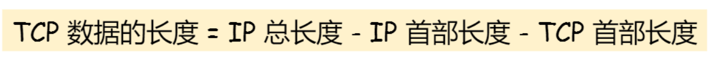
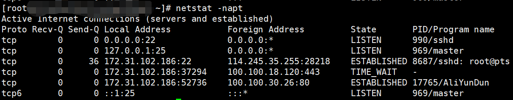

## TCP常见问题（基础知识）

#### TCP的头部格式


- 首先可以看到TCP头部中的是源端口号和目标端口号，因为一个TCP连接是由一个四元组表示的，这里只有端口，实际上源IP和目标IP都在网络层（IP协议头部）
- **序列号（Sequence，Seq）：**在建立连接时由计算机生成的随机数作为其初始值，通过**SYN包**传给接收端主机，每发送一次数据，就累加一次该数据字节数的大小，**用来解决网络包乱序的问题**
- **确认应答号（Acknowledge character，Ack）：**指下一次期望受到的数据的序列号，发送端收到这个确认应答之后可以认为在这个序号以前的数据都已经被正常接收，**用来解决不丢包的问题**

- **控制位，**可以看到图中一共有6个，这里重点说三个
  - `ACK`：该位为1时，确认应答的字段变为有效，TCP规定除了最开始建立连接时的SYN包之外，其他的数据包中该位必须设置为1
  - `SYN`：该位为1时，表示希望建立连接，并在序列号字段处进行序列号的初始值设定
  - `RST`：该位为1时，表示TCP连接过程中出现异常，需要强制断开连接
  - `FIN`：该位为1时，表示今后不再有数据发送，希望断开连接，当通信结束希望断开连接时，通信双方的主机之间就可以相互交换 `FIN` 位为 1 的 TCP 段。


#### 为什么需要TCP协议

因为IP层是不可靠的，他不能够保证网络包的交付，不能够保证网络包的按序交付，也不能够保证网络包中数据的完整性

如果需要保证网络数据包的可靠传输，那么就需要上层的TCP协议来负责

TCP协议是工作在传输层上的可靠的数据传输协议，它能够保证接收端收到的网络包是无损坏、无间隔、非冗余和按序的


#### 什么是TCP协议

**TCP协议是面向连接的、可靠的、基于字节流的数据传输协议**

- 面向连接：TCP一定是一对一的连接，不能够向UDP那样可以一个主机同时向多个主机发送消息，也就是没办法做到一对多
- 可靠的：无论网络链路中发生什么样的变化，TCP总是能够保证一个网络包能够到达接收端
- 基于字节流的：表明消息是没有边界的，无论我们的消息有多大都可以进行传输，并且消息是有序的，这也就意味着当前一个消息没有收到的时候，即使它收到了后面的字节，那么也不能够扔给后面应用层进行处理，同时它还会对重复的报文进行丢弃


#### 什么是TCP连接

**TCP为了保证可靠性和流量控制维护了某些状态信息，这些信息（Socket，序列号，窗口大小）的组合叫做连接**

所以我们知道，建立一个TCP连接是需要客户端和服务器达成上述三个信息的共识

- Socket：由IP地址和端口号组成
- 序列号：用来解决乱序问题等
- 窗口大小：用来做流量控制


#### 如何确定一个唯一的TCP连接

TCP 四元组可以唯一的确定一个连接，四元组包括如下：

- 源地址
- 源端口
- 目的地址
- 目的端口

源地址和目的地址的字段（32位）是在 IP 头部中，作用是通过 IP 协议发送报文给对方主机

源端口和目的端口的字段（16位）是在 TCP 头部中，作用是告诉 TCP 协议应该把报文发给哪个进程


#### 有一个IP的服务器监听了一个端口，理论上能够建立多少条TCP连接

服务器通常固定在某个本地端口上监听，等待客户端的连接请求。

因此，客户端 IP 和 端口是可变的，其理论值计算公式如下:


对 IPv4，客户端的 IP 数最多为 2 的 32 次方，客户端的端口数最多为 2 的 16 次方，也就是服务端单机最大 TCP 连接数，约为 2 的 48 次方。

**当然，服务端最大并发 TCP 连接数远不能达到理论上限。主要受到两个方面的限制：**

- 首先是**文件描述符限制**，Socket都是文件，所以首先要通过 `ulimit` 配置文件描述符的数目；
- 其次是**内存限制，**TCP连接需要占用部分的内存资源，而操作系统的内存是有限的


#### TCP和UDP的区别，分别的应用场景

在具体解答这道题目之前，我们首先来看一下UDP的头部格式


可以看到UDP的头部非常简单，只有8个字节

- 目标端口和源端口：目的是告诉UDP协议要把数据包发送给哪个应用程序
- 包长度：UDP头部和数据部分的总长度
- 校验和：校验和是为了提供可靠的 UDP 首部和数据而设计


**==TCP和UDP的区别主要有7个部分==**

1. 首先就是连接方面
   - TCP是面向连接的传输层协议，在传输数据之前需要先建立连接
   - UDP是无连接的传输层协议，传输数据不需要建立连接
2. 第二是服务对象方面
   - TCP必须是一对一的连接，一个连接有两个端点
   - 而UDP可以从一个主机同时给多个主机发送数据，支持一对一、一对多、多对多的连接
3. 第三是可靠性方面
   - TCP通过序列号、三次握手等机制能够实现数据报文的可靠性传输，达到不丢失、不重复、无差错，按需到达
   - UDP只是尽最大努力的去发送，不关心数据是否发生丢包等问题
4. 第四是阻塞控制和流量控制
   - TCP有阻塞控制和流量控制，用来保证数据报文的安全传输
   - UDP没有上述性质，他只是努力的去发送数据，即使网络非常阻塞了，也不会影响UDP发送数据包的速率
5. 第五是首部开销
   - TCP的首部长度较长，如果加上选项字段，会变得更长
   - UDP的首部长度只有8个字节，并且是固定不变的，开销较小
6. 第六是传输方式不同
   - TCP是基于字节流传输（流式传输），没有边界，但是能够保证可靠和顺序
   - UDP是一个包一个包的发送，是有边界的，但是有可能会有丢包或者乱序
7. 第七是分片方式不同
   - 在TCP中，有了一个新的概念叫做MSS（Maximum Segment Size，MSS），如果数据包的大小超过了MSS，则会在传输层进行分片，接收方收到了之后也会在传输层进行组装，如果传输过程中某个包丢失了，只需要重传丢失的包即可
   - 在UDP中，如果数据包的大小超过了MTU，则会在网络层进行分片，目标主机收到之后，会在网络层进行组装，接着在发送给传输层，但是如果中途丢了某个包，则需要重传所有的数据包，这样传输效率会非常差，所以UDP数据包应该尽可能地小于MTU


**==TCP和UDP的应用场景==**

由于TCP是面向连接的，能够保证数据的可靠性交付，因此经常用于

- FTP文件传输
- HTTP/HTTPS

由于UDP是无连接的，但是可以能够随时发送数据，再加上UDP本身的处理既简单又高效，因此经常用于

- 包总量较少的通信，如DNS，SNMP
- 视频、音频等多媒体通信
- 广播通信


#### 为什么TCP头部字段中有一个首部长度，而UDP头部中没有

因为TCP头部字段中有一个可变长的选项字段，而UDP的头部长度是固定的8字节，不会变化，因此首都长度字段对UDP来说没用


#### 为什么TCP没有包长度字段，而UDP有包长度字段




其中 IP 总长度 和 IP 首部长度，在 IP 首部格式是已知的。TCP 首部长度，则是在 TCP 首部格式已知的，所以就可以求得 TCP 数据的长度。

大家这时就奇怪了问：“ UDP 也是基于 IP 层的呀，那 UDP 的数据长度也可以通过这个公式计算呀？ 为何还要有「包长度」呢？”

这么一问，确实感觉 UDP 「包长度」是冗余的。

**因为为了网络设备硬件设计和处理方便，首部长度需要是 4字节的整数倍。**

如果去掉 UDP 「包长度」字段，那 UDP 首部长度就不是 4 字节的整数倍了，所以小林觉得这可能是为了补全 UDP 首部长度是 4 字节的整数倍，才补充了「包长度」字段。


#### TCP和UDP的全称

TCP的全称叫传输控制协议 Transmission Control Protocol

UDP的全称叫用户数据报协议 User DataPrograme Protocol


## TCP三次握手

TCP是面向连接的可靠协议，连接的建立是通过TCP三次握手来完成的


#### 连接过程


- 最开始客户端和服务器都处于`Close`状态，先是服务器主动监听某个端口，处于`LISTEN`状态

- 第一步，客户端向服务器发起连接请求，客户端会随机初始化一个序号`client_isn`，并将此序号置于TCP首部的序列号字段处，随后将标记位的`SYN`置为1，**随后客户端进入`SYN_SENT`状态，**报文格式如下，**注意：第一次握手时的报文中没有携带应用数据**

  

- 第二步，服务器收到客户端的握手请求报文之后，也会初始化一个随机序列号`server_isn`，并将其放到TCP首部中的序列号位置，其次把TCP首部中的确认应答号填入`client_isn + 1`，**同时把标志位的`ACK`和`SYN`都置为1，**之后**服务器进入`SYN_RCD`状态**，报文格式如下，**注意：第二次握手的过程中也没有携带应用数据**

  

- 第三步，客户端收到来自服务器的`SYN+ACK`报文之后，将TCP首部的确认应答号填充为`server_isn + 1`，并且把控制位的`ACK`置为1，最后把报文发送给服务器，**自己则进入`ESTABLISHED`状态**，报文如下，注意在**第三次握手时可以携带应用数据**

  

- 当服务器收到来自客户端的ACK报文之后，便也会进入`ESTABLISED`状态，至此，TCP三次握手完成，TCP连接建立

==面试中常问的一个点：TCP前两次握手不能够携带应用数据，第三次可以携带应用数据==


> 在Linux系统中，可以通过`netstat -napt`命令查看TCP的连接状态




#### 为什么TCP握手是3次，不是2次或者4次

**三次握手的主要原因就是能够阻止重复历史连接的初始化，减少资源浪费，其次三次握手能够保证客户端和服务器双方的序列号同步**

- 首先是阻止历史连接

  因为网络环境错综复杂，所以发送方可能会连续发送多个建立连接的请求，如果TCP的握手次数之后两次的话，那么服务端只能够选择接收或者拒绝请求，但是他并不知道这次的请求是历史的请求还是正常的请求，所以会导致错误的连接，导致资源浪费

  而如果是三次握手的话，那么发送方在接收到接收方返回回来的`ACK + SYN`报文之后，可以验证报文中的序号确认字段(ack)来判断是不是历史连接，如果是历史连接的话，发送方会给接收方发送一个`RST`报文，表示断开连接，如果不是历史连接的话，则发送方给接收方发送一个`ACK`报文来建立连接

  

- 第二是同步序列号

  我们知道，TCP的一个重要特性就是可靠性，而TCP为了在不稳定的网络环境中构建一个稳定的数据连接，他就需要一个“序列号”来保证自己的稳定性，这个序列号的作用就是为了防止数据包重复发送以及有效解决数据包接收时顺序颠倒的问题

  因此当发送方发送了自己的序列号之后需要收到接收方的确认，接收方发送了自己的序列号之后同样也需要发送方的确认，这样一来一回就是三次握手，而如果两次握手的话，只能够同步一方的序列号，当然，四次握手能够同步双方序列号，但是多一次连接就多了一次消耗，这是可以被优化的


#### 为什么客户端和服务端的初始序列号ISN是不同的


#### 为什么这个ISN要是随机的

如果不是随机的，可能会有安全风险，如果C假冒A的IP向服务器B发送连接请求，如下图，当服务器收到了请求报文之后，会向A发送`SYN + ACK`报文，其中的ack=ISN_C+1，但是由于A并没有发送过`ISN_C`，所以A会给B发送`RST`报文中断连接，但是如果在这个过程中，`ISN_B`不是随机的，而是能够被推测出来的，C就能够向服务器发送`ISN_B + 1`的ACK报文，从而建立起TCP连接，这是很危险的


#### ISN是怎么随机生成的

最开始，ISN是基于时钟周期生成的，每4ms加1，转一圈需要4.55小时

随后，RFC定义了一个比较好的随机生成ISN的算法，如下

*`ISN = M + F (localhost, localport, remotehost, remoteport)`*

- M是一个计时器，每隔4毫秒 + 1
- F是一个hash函数，根据四元组算出一个哈希函数，所以我们需要保证 Hash 算法不能被外部轻易推算得出


#### 即然IP层能够进行分片，那么TCP层为什么还需要MSS呢？


- MTU（Maximum Transmission Unit，最大传输单元），表示一个网络包最大的长度，以太网中一般为1500字节
- MSS（Maximum Segment Size，最大报文段长度），除去IP和TCP头部之后，一个网络包能够容纳TCP数据的最大长度

如果 TCP 的整个报文（头部 + 数据）交给 IP 层进行分片，会有什么异常呢？

当IP层有一个超过MTU大小的数据（TCP头部 + TCP数据）要发送，那么IP层就要进行分片，把数据分片成若干片，然后在接收方的网络层进行组装，然后再交给上方的TCP层，这样看起来是井然有序的，**但实际上如果一个IP分片丢失，整个的IP报文的所有分片都得重传**

因为IP层没有超时重传机制，所以它是由TCP来负责超时和重传机制的

**当接收方发现TCP报文（头部 + 数据）的某一片丢失了之后，他不会给发送方返回ACK报文，那么发送方的TCP超时之后，就会重传整个TCP报文（头部 + 数据）**

因此，可以得知由 IP 层进行分片传输，是非常没有效率的。

所以，为了达到最佳的传输效能 TCP 协议在建立连接的时候通常要协商双方的 MSS 值，当 TCP 层发现数据超过 MSS 时，则就先会进行分片，当然由它形成的 IP 包的长度也就不会大于 MTU ，自然也就不用 IP 分片了。而且每一个分片中都带有TCP的头部，接收方收到一个就会给发送方返回一个ACK，所以如果某个包发生了丢失，只需要重新传会这个丢失的包即可


## SYN攻击

#### 什么是SYN攻击

我们知道TCP的连接建立是需要进行三次握手的，所以如果攻击者在短时间内伪造出大量的SYN请求报文发送给服务器，那么服务器就会进入`SYN_RCVD`状态，而服务器发送出去的`ACK+SYN`报文迟迟得不到响应，所以用不了多长时间**服务器的未连接队列就会被占满，**导致服务器不能够为正常用户服务


#### 怎么样避免SYN攻击


##### 方法一（简单粗暴，处理不了了就不处理了）

这种方式就是通过修改内核参数的方式来控制队列大小和当队列满的时候应该做什么处理

当网卡接收数据包的速度大于内核处理的速度时，会有一个队列保存这些数据包。控制该队列的最大值如下参数：

```shell
# net.core.netdev_max_backlog
```

SYN_RCVD 状态连接的最大个数：

```shell
# net.ipv4.tcp_max_syn_backlog
```

超出处理能力时，对新的 SYN 直接回报 RST，丢弃连接：

```shell
# net.ipv4.tcp_abort_on_overflow
```


##### 方法二（使用Cookie）

在讲解方法二之前，我们先来看一下正常的三次握手过程，Linux内核中全连接队列（Accept）和半连接队列（SYN队列）的变化


- 服务器收到来自客户端的SYN请求报文之后，会将这个请求加入到内核的SYN队列中
- 然后服务器发送`SYN+ACK`报文给客户端，等待客户端回应ACK报文
- 服务器接收到客户端回应的ACK报文之后，会将请求从SYN队列中取出，放入到Accept队列中
- 应用通过调用`accept()`函数将连接从Accept队列中取出


所以，当收到SYN攻击之后，会导致内核中的SYN队列变慢，而由于服务器迟迟接收不到客户端对`ACK+SYN`报文的响应，会导致accept队列中的连接慢慢被应用程序取走，直至为空，如下图：


方法二就是通过使用内核参数`net.ipv4.tcp_syncookies = 1`启动cookie来解决SYN攻击问题


**当半连接队列满时，`SYNcookies`并不丢弃SYN请求，而是通过加密技术来标识半连接状态。**

也就是说，当SYN队列满的时候，服务器并不会丢弃SYN请求，而是计算出一个Cookie值（ACK + SYN包中的序列号），把这个Cookie值发送给客户端，之后，如果服务端接收到客户端的应答报文时，服务器会检查这个 ACK 包的合法性。如果合法，直接放入到「 Accept 队列」。等待应用程序使用accept函数调用


##### 方法三（防火墙）

过滤网关防护保护