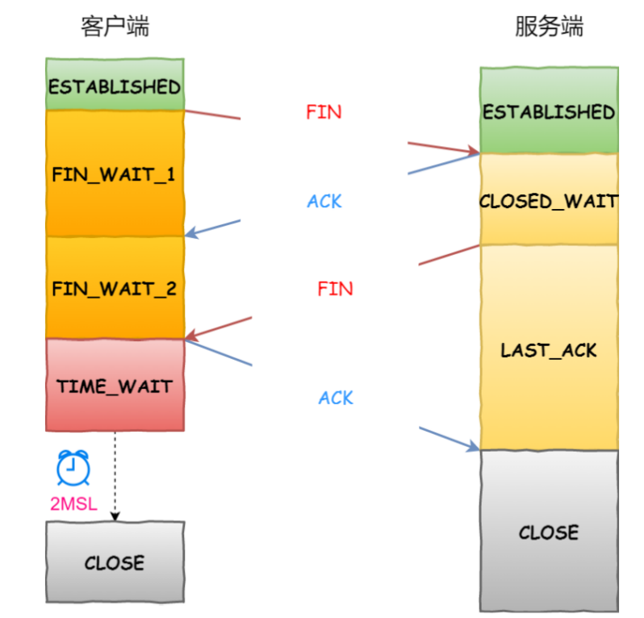
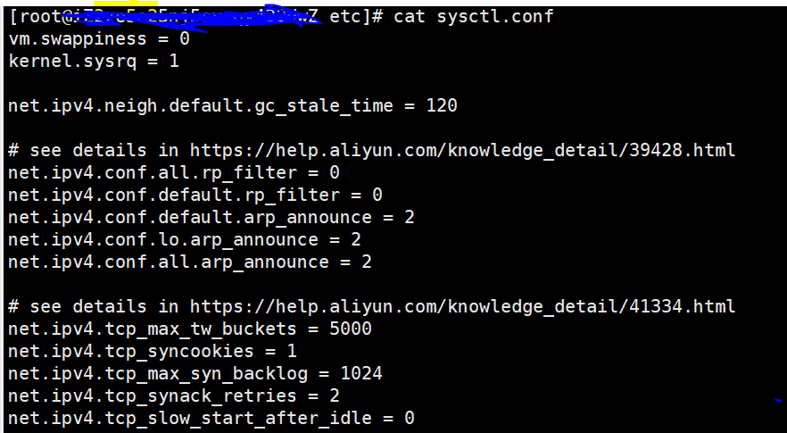

## TCP四次挥手

### 四次挥手的过程



首先明确一下：上图中是把客户端当作主动断开方，服务器作为被动断开方

- 客户端首先发起断开连接的请求，向服务器发送一个FIN报文，随后进入FIN_WAIT_1状态

- 服务端收到客户端的断开请求之后，向客户端回复ACK报文，表明自己已经接受了它的断开请求，随后自己进入CLOSE_WAIT状态

  ```
  客户端收到来自服务器的ACK报文之后，进入FIN_WAIT_2状态，这个时候其实整个的TCP连接已经进入了半关闭状态，此时客户端不会再发送任何的数据，只能够接收来自数据
  ```

- 上面服务器给客户端回复了ACK表示这自己同意断开连接，但是服务器还可能有数据没有发送给客户端，所以发送完ACK之后，服务器还会继续向客户端发送数据，直到发送完自己想要发送的数据之后，服务器会在向客户端发送一个FIN报文，表示自己数据发完了，可以断开连接了，随后进入LAST_ACK状态
- 客户端收到来自服务器的FIN报文之后，会立刻回复ACK报文，随后进入TIME_WAIT状态，2MSL之后，客户端进入CLOSE状态，而服务器收到这个ACK报文之后，立刻变为CLOSE状态


**在TCP断开连接的四次挥手中，需要注意的是只有主动断开方有TIME_WAIT状态**


### 为什么要四次挥手

- 客户端发送FIN报文仅仅表示客户端没有数据要发送了，但是它还能够接收数据
- 服务器在收到客户端的FIN报文之后会先回复一个ACK，**但是服务器可能还有数据没有处理和发送**，所以需要等着服务器处理完这些数据之后，在发送FIN报文

从上面的这个过程可以知道，服务器通常需要完成数据的处理和发送，所以服务器的ACK和FIN报文是分开发送的，所以他需要进行四次握手


### 为什么要有TIME_WAIT状态

两个原因：

- 第一个原因是保证被动断开连接的一方能够完全的断开，即保证被动断开方能够收到最后的ACK报文
- 第二个原因是能够防止旧连接的数据包被新连接收到

同时，为了够保证上面的两个原因，还需要把TIME_WAIT的事件设置成2MSL（MSL，报文最大生存时间）

- 首先，如果最后一个ACK报文没有被被动断开方收到，那么被动断开方会触发超时重传，那么从主动断开方收到FIN，发出ACK开始计时，这个发送的ACK如果能够到达被动断开方的话，他最多能够花费的时间就是1MSL，而如果触发了超时重传，那么还需要1MSL来接受重发的FIN报文，这**一来一回**最多就是2MSL**（注意，当主动断开方收到FIN的时候，会重置2MSL）**

- **通过2MSL的等待时间，能够让所有的旧连接中的数据包过期**，所以这就可以防止新连接中出现旧连接的数据包了

  


### TIME_WAIT状态时间过长有哪些危害

在**高并发短连接**的TCP服务器上，当服务器处理完请求之后会主动向客户端发送断开连接请求，这种场景下会出现大量Socket处于TIME_WAIT状态，如果客户端的并发量持续很高，此时就会有客户端显示连接不上

- **高并发意味着服务器会在短时间内同时占用大量的端口，**而端口数总共就0~65535个，并不是很多，还需要去除系统和其他服务占用的，就更少了
- **短连接意味着业务处理和传输数据的时间远远小于TIMEWAIT需要等待的时间**

综上，可以发现TIME_WAIT状态时间过长会导致客户端端口紧张，同时还会占据这大量的服务器资源，因为处于TIME_WAIT会占用着端口和处理线程，当有新的HTTP请求到来时，并不能够进行处理 “占着茅坑不拉屎”


### 如何优化TIME_WAIT

方式大概有三种，都是通过修改内核参数的方式来完成



- 通过修改`net.ipv4.tcp_max_tw_buckets`，可以减少这么参数，表示最大处于time_wait状态的套接字信息，一般超过这个数值，那么处于time_wait状态的socket将会被立刻重置

- 打开`net.ipv4.tcp_tw_reuse`和`tcp_timestamps`，从字面意思中就就可以看出，`net.ipv4.tcp_tw_reuse`就是复用处于`time_wait`状态的socket连接，场景如下：

  ```
  某一方，需要不断的通过“短连接“连接其他服务器，总是自己先关闭连接(TIME_WAIT在自己这方)，关闭后又不断的重新连接对方。
  ```

  所以这就产生了一个问题，服务器是怎么判断重新连接的请求是新的连接还是旧连接上延迟的数据包，所以`net.ipv4.tcp_tw_reuse`通常和`tcp_timestamps`配合使用，也就是说给每一个数据包一个时间戳，通过时间戳来判断这个数据包是否过期

- 通过设置socket选项，通过调用close来关闭连接

  ```c
  struct linger so_linger;
  so_linger.l_onoff = 1;
  so_linger.l_linger = 0;
  setsockopt(s, SOL_SOCKET, SO_LINGER, &so_linger,sizeof(so_linger));
  ```

  如果`l_onoff`为非 0， 且`l_linger`值为 0，那么调用`close`后，会立该发送一个`RST`标志给对端，**该 `TCP` 连接将跳过四次挥手，也就跳过了TIME_WAIT状态，直接关闭。<font color=red>这种方式很危险，不推荐</font>**


### 如果已经建立了连接，客户端突然发生了故障怎么办

这种情况下就用到了TCP连接的**保活机制**，这个机制的原理是：定义一个时间段，如果在这个时间段内，没有任何的连接的活动，那么TCP保活机制就会开始工作，每个一段时间发送一个**探测报文**，该探测报文发送的数据很少，如果连续几个探测报文都没有得到响应，则会认为当前TCP连接死亡，系统内核将错误信息通知给上层应用程序

注意，TCP保护机制在Linux系统中是关闭的，所以如果想要使用必须开启，客户端也一样，只有开启了后续才能够发送探测报文

如果开启了TCP保活机制之后，需要考虑以下三种情况：

- 第一种，对端是正常工作的，当TCP保活的探测报文发送给对端的时候，对端是会正常响应的（返回一个ACK报文），这样TCP保活机制就会被重置，等待一下个保活机制的到来
- 第二种，对端程序崩溃并重启，当TCP保活的探测报文发送到对端的时候，对端是可以响应的，但是由于已经没有了有效的连接信息，这时候就会回复一个`RST`报文给对端，这样很快这个TCP连接就会被重置了
- 第三种，对端程序奔溃或者保活的探测报文由于网络等原因没有达到对端，也就是发送探测报文的这一方收不到响应，这样经过连续的几次探测之后，TCP就会报告这条连接已经死亡，释放它的资源


- 保活时间：默认7200秒（2小时），如果这两个小时内没有任何的活动，那么就会启动保活机制
- 保活时间间隔：默认75秒，每次检测间隔75秒
- 保活探测数：默认9次，表示连续监测9次无响应，则认为对方不可达，从而终端连接

所以说，整套的保活机制下来最多需要`7200+75*9=2小时11分15秒`才能够发现一个死亡连接，这个时间是有点长的，所以我们可以更具实际情况对其进行更改


实际上，保活机制是比较有争议的，通过上面的描述也不难发现他有两个缺陷

- 发送探测报文会占用带宽
- 在出现短暂的网络错误的时候，保活机制会使一个好的连接断开

所以，保活机制是存在争议的，主要争议之处在于是否应在TCP协议层实现，有两种主要观点：其一，保活机制不必在TCP协议中提供，而应该有应用层实现；其二，认为大多数应用都需要保活机制，应该在TCP协议层实现。

> 保活功能在默认情况下是关闭的。没有经过应用层的请求，Linux系统不会提供保活功能。 


参考链接

https://www.cnblogs.com/dadonggg/p/8778318.html

https://www.maixj.net/ict/net-ipv4-tcp_tw_reuse-24080

https://blog.csdn.net/s_lisheng/article/details/87288445