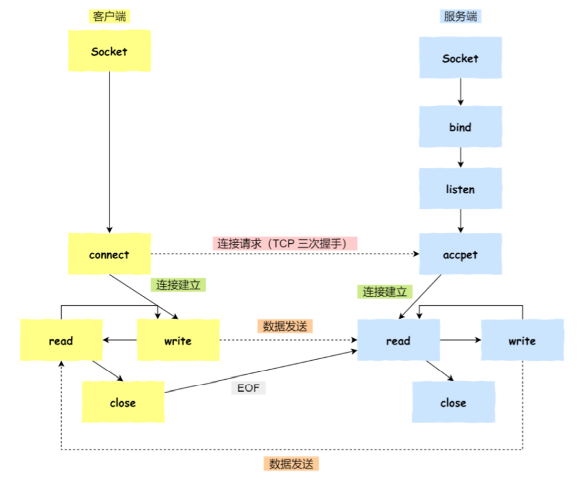
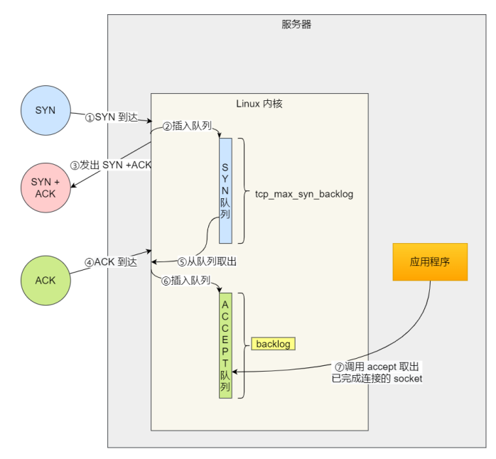
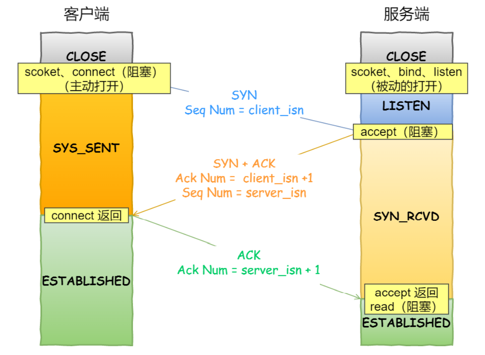
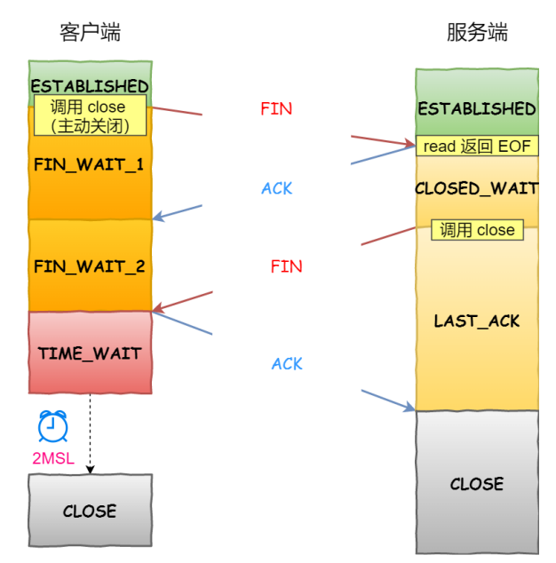

## Socket编程



- 客户端和服务端初始化socket，得到各自的文件描述符
- 服务器通过调用bind函数，使得socket绑定自身的IP地址和端口号
- 服务器通过调用listen函数，来进行监听
- 客户端通过调用`connect`函数向服务器socket绑定的IP地址和端口发起三次握手请求
- 服务器通过调用accept函数，得到已经完全连接的socket的文件描述符，用来后续的数据传输
- 客户端断开连接的时候，会调用`close`，将EOF写入到FIN报文中，当服务器读取到这个EOF时，待处理完数据之后，也会调用close，从而关闭连接

上述过程中需要注意的是，服务端在调用accept之后，会得到一个已经完全连接成功的socket，通过这个socket来进行后续的数据传输，所以监听的socket和实际用来传输数据的socket是两个不同的socket，一个叫做**监听socket**，另一个叫作**已完成连接socket**

**连接成功建立之后，客户端和服务器都可以向已完成连接socket中写入和读取数据，类似于一个双向的文件流**


> 接下来我们看一下这个listen函数

```c
int listen(int socketfd, int backlog)
```

- 参数一表示监听socket的文件表描述符

- 参数二在不同版本中的含义发生了变化



我们知道，在TCP三次握手的过程中Linux内核会维护两个队列

- SYN队列，又叫半连接队列，当服务端收到来自客户端的SYN请求连接报文的时候，会将这个连接加入到SYN队列，此时服务器处于SYN_RCVD状态
- ACCEPT队列，又叫全连接队列，当服务器收到来自客户端的ACK确认连接报文之后，会将连接从SYN队列中移除，并加入到ACCEPT队列中，此时双方都处于`ESTABLISHED`状态

在早期的Linux内核中，backlog表示的就是SYN半连接队列的长度

在Linux内核2.2之后，backlog变成了accept队列的长度，但是backlog的上限是`somaxconn`的大小，也就是所全连接队列的长度等于`min{backlog, somaxconn}`


> **connect和accept分别是在三次握手的哪次握手中返回的**



从上图中可以看出，当客户端收到来自己服务器的ACK报文之后，connect才会成功返回，也就是说**connect的成功返回是在第二次握手结束之后**；而**accept是在第三次握手结束之后，**也就是连接完全建立好他才会成功返回


> close在四次挥手中的使用时机



- 客户端主动调用close函数，表示自己已经没有数据要发送了，所以就会像服务器发送一个FIN报文，随机进入FIN_WAIT-1状态
- 服务器收到这个FIN报文，T**CP协议栈会为这个FIN报插入一个EOF文件描述符到接收缓冲区**，应用程序可以通过调用read来感知到这个FIN包，**这个EOF会被放到接收缓冲区的最后**，这也就意味着服务器需要处理这种异常情况，因为EOF表示该连接上没有额外的数据到来了，此时服务器进入`CLOSE_WAIT`状态
- 当处理完数据之后，服务器也就会读到上述的EOF，然后调用close，表示服务器也没有数据要发送了，可以关闭连接了，于是调用close关闭连接socket，发出一个FIN包，服务器进入CLOSE_WAIT状态，也就是说**被动断开方的close调用发生在第三次挥手的时候**
- 客户端接收到服务端的 FIN 包，并发送 ACK 确认包给服务端，此时客户端将进⼊ TIME_WAIT 状态；
- 服务端收到 ACK 确认包后，就进⼊了最后的 CLOSE 状态
- 客户端经过2MSL的等待之后也进入close状态


> **最后，再补充一下time_wait**

我们在前一天写到了只有主动断开连接的一方才有time_wait状态，主动断开连接方是客户端还是服务端造成的危害是不同的：

- 对于客户端而言，过多的time_wait会导致端口不足，因为端口被占用而无法创建新的连接
- 对于服务端而言，过多的time_wait会导致服务器资源被耗尽，虽然服务器只监听一个端口，但是理论上可以处理很多个连接，因为服务器会把连接交给线程池来处理，所以监听的端口可以一直监听，但是线程池中的线程是有限的，处理不了那么多一直不断地连接，所以当在有新连接来的时候，就不能够处理了


