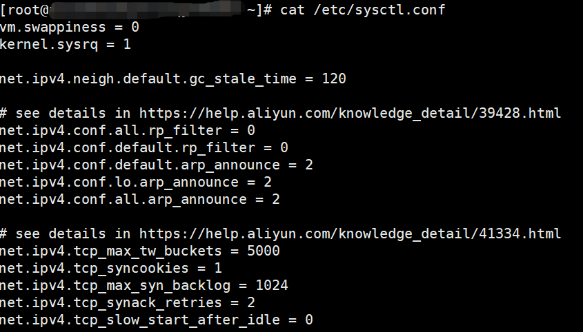
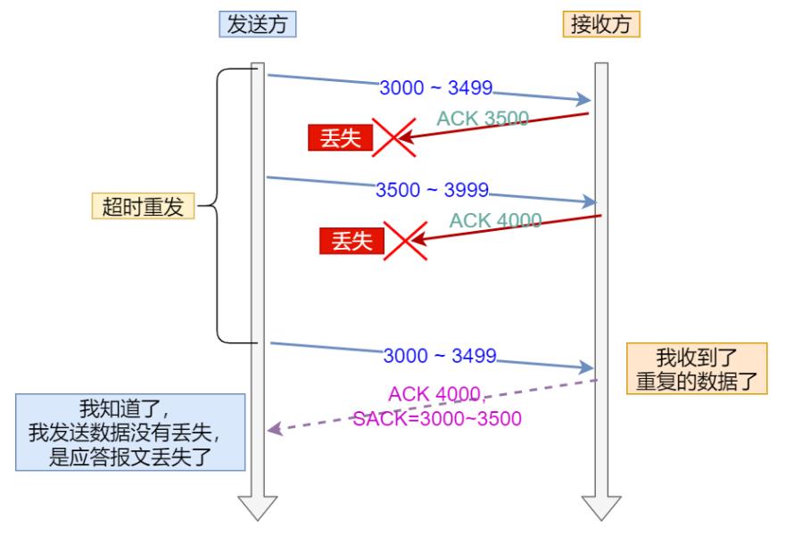
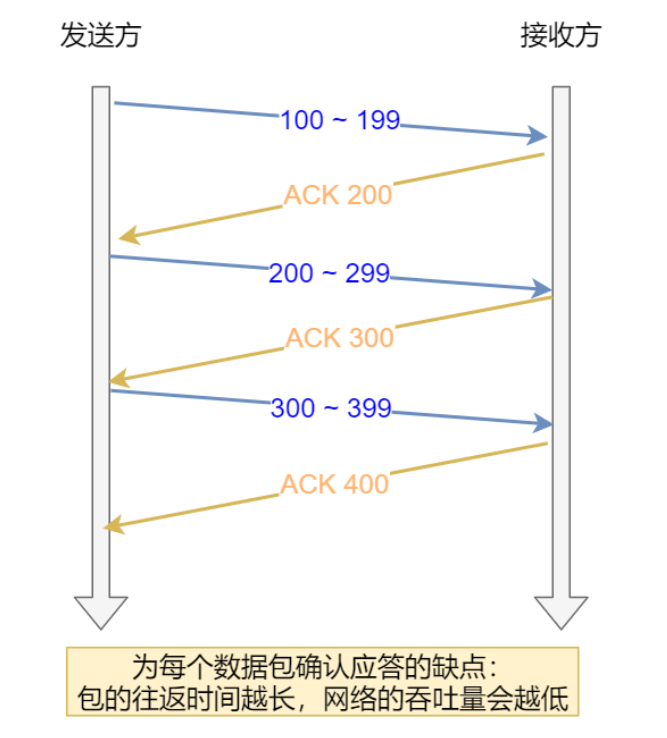
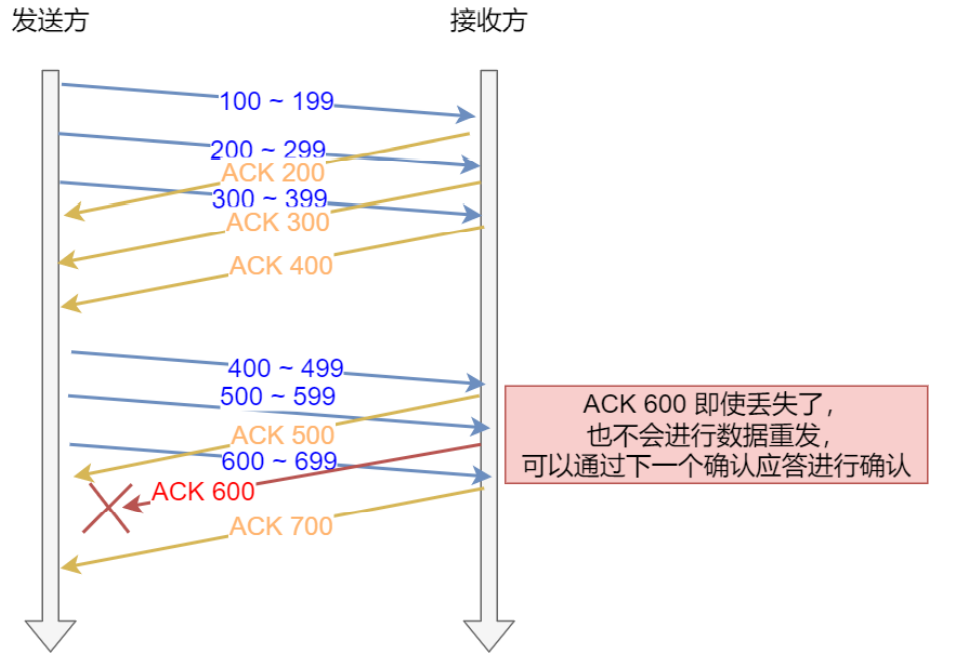
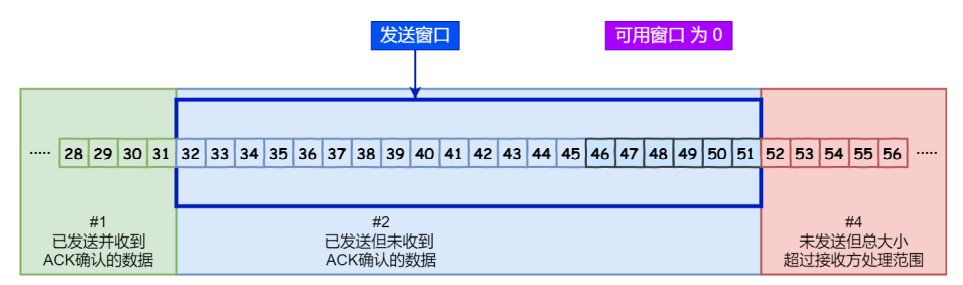
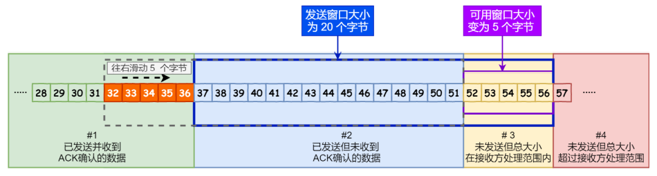
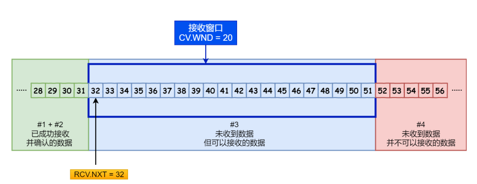

## TCP重传

我们知道，**TCP实现可靠传输的方式之一就是通过序列号和确认应答号**

在TCP中，当发送端的数据到达接收端的时候，接收端主机会返回一个确认应答消息，表示已经收到了消息，如下图


但是在错综复杂的网络环境中，并不能够保证上图中的过程一定能够顺利进行，有可能数据在传输过程中丢失，也有可能确认应答消息在传输中丢失，所以我们需要一个机制来保证接收方一定能够收到发送方的数据，这个机制就是**重传机制**，重传机制大致上分成了四个方法：超时重传、快速重传、SACK、D-SACK


### 超时重传

超时重传指的就是在发送数据的时候设置一个定时器，当超过指定的时间之后，如果没有收到对方的ACK确认应答报文，就会重发数据

TCP会在以下两种情况触发超时重传：

- 数据包丢失
- 确认应答信息丢失


**超时重传时间（Retransmission Timeout,RTO）一般要比RTT稍微大一点**，如果RTO过大或者过小会有什么后果？

- 如果RTO过大，数据包/确认应答信息丢失了很长一段时间之后，才会触发重传，效率低
- 如果RTO过小，有可能数据包/确认应答信息并没有丢失，只是因为网络比较拥堵，到达对端的时间比较长，这样会增大网络的压力，增大拥堵，导致更多的重传，导致更拥堵的网络环境

Linux中有一套机制来计算RTO的值，具体就不展开了，大致思路是：

- 需要TCP通过采样RTT的时间，然后进行加权平均，算出一个平滑的RTT的值，而且这个值还是要不断变化的，因为网络状况在不断地变化
- 除了采样RTT的时间，还需要采样RTT的波动范围，这样就避免了如果RTT有一个很大的波动的话，很难被发现的情况


如果超时重传的数据包/确认应答包再次超时，又需要重传的时候，TCP的策略是**超时时间加倍**

**也就是当每一次遇到超时重传的时候，都会将下一次超时重传时间的间隔设置为之前的两倍，两次超时说明目前网络环境较差，不适合频繁发送数据包**

因此，可以看出，超时重传的超时时间周期会比较长，为了解决这个问题，又出现了快速重传


### 快速重传

通过前面对超时重传的描述，我们知道了**超时重传是以时间驱动，而快速重传则是以数据驱动**


可以看出，快速重传的思想就是当重复收到三个相同的ACK时，就会触发重传机制

但是，快速重传中存在一个问题，比如上图中，收到了三个相同的ACK2，我们知道Seq2肯定是丢失了，但是我们不知道的是Seq3，Seq4，Seq5有没有丢失，比如下图：


Seq2和Seq5都丢失了，但是当Seq6的ACK2被接收到的时候，左侧的发送方是不知道Seq5也是丢失的，因此这时候不知道是只重发Seq2还是重发Seq2，Seq3，Seq4，Seq5（Seq2到Seq6之间的数据包）

**总结一下，快速重传只是解决了超时重传中的时间问题，但是快速重传不知道是重传之前的一个数据包，还是重传之前的所有数据包**

为了解决快速重传中的这个问题，SACK机制出现了，SACK是为了解决快速重传不知道传输哪些TCP报文而诞生的


### SACK

SACK（Selective Acknowledgment，选择性确认），这种方式需要在TCP报文头部的`选项`字段加上SACK字段，**它可以将缓存的地图发送给发送方，**这样发送方就知道了哪些包被收到了，哪些包没有被收到，知道了这些信息，发送方就可以只重发没有被收到的数据包了


如上图，发送方收到了三次相同的ACK报文，则会立刻触发快速重传机制，通过SACK信息发现只有200~300这段的数据丢失，则重发时，就只选择了TCP段进行重复

**如果要支持SACK，必须双方都要支持**，在Linux中，通过`net.ipv4.tcp_sack`参数打开这个功能（Linux2.4以后默认打开）

```
linux CentOs7中Linux参数在/etc/sysctl.conf中设置
链接中是TCP的一些参数：https://www.cnblogs.com/jdonson/p/4746094.html
```




### D-SACK

**全称Duplicate SACK，主要使用了SACK来告诉发送方有哪些数据被重复接收了**

> 例子1：ACK丢包



- 接收方给发送方发送的两个ACK报文都丢失，所以发送方超时之后，会重传第一个数据包（3000~3499）
- 接收方收到这个重传的数据包之后，发现数据是重复收到的，于是回了一个SACK=3000~3500，告诉发送方3000-3500这段的数据早就收到了，而ACK=4000，又表示4000之前的所有数据已经收到了，所以这个SACK就代表着D-SACK
- 这样发送方就知道了数据没有丢，只是接收方的ACK确认报文丢失了


> 例子2：网络延时


- 数据包1000-1499被网络延迟了，导致发送方没有收到ACK1500的确认报文
- 而后面报文到达的三个相同的ACK确认报文，使得发送方出发快速重传机制，但是在重传之后被延迟的1000-1499数据包又到了接收方
- 所以接收方会回复一个SACK=1000-1500，表示这个数据包已经收到过了，因为ACK已经到了3000，所以这个SACK是D-SACK，表示收到了重复的包
- 这样发送方就能够知道触发快速重传的原因不是发出去的包丢了，而是被网络延迟了


所以D-SACK有以下的好处：

- 可以让发送方知道是他自己发出去的包丢了，还是接收方回复的ACK包丢了
- 可以让发送方知道自己发出去的包是丢了，还是因为网络延迟没有到
- 可以知道网络中是否把发送方的数据包给复制了


在Linux中通过`net.ipv4.tcp_dsack`来开D-SACK，在Linux2.4以后是默认开启的


## 滑动窗口

前面我们提到过，TCP是每发送一个数据就会收到一个应答，只有收到应答之后才能够继续发送数据，相当于`我说一句话，对方回我一句，然后我再说下一句话`，这样的效率明显是很低的，而且**包的往返时间越长，网络的吞吐量就越低**



因此，为了提高系统的吞吐量，TCP出现了滑动窗口机制，**窗口大小指的就是无需确认等待应答，就可以继续发送数据的最大值**

**窗口的实现实际上是在操作系统上开辟一个缓冲区，**发送方在收到确认应答之前，必须在缓冲区保留发送出去的数据，如果按期收到确认应答，此时数据就可以从缓冲区中去除

假设窗口的大小为3个TCP段，那么发送方就可以连续发送3个TCP段，并且中途若有ACK丢失，可以通过下一个确认应答进行确认，如下图：



图中的ACK 600确认应答报文丢失，也没有关系，因为可以通过下面的ACK 700来进行确认，ACK 700表示的是700之前的数据都已经收到了，这种模式就叫做**累计确认**或者**累计应答**


> <font color=red>**窗口的大小通常由接收方来确定**</font>

TCP的头部字段中有一个Window，也就是窗口大小

**这个字段是接收端告诉发送方自己还有多少缓冲区可以接收数据**，于是发送端就可以根据这个接收端的处理能力来发送数据，从而不至于导致接收端处理不过来，所以窗口的大小通常是由接收端的窗口大小决定的，发送方发送的数据大小不能够超过接收方窗口的大小，斗则接收方就没办法正常处理接收到的数据了


>**<font color=red>发送方的滑动窗口</font>**

发送方的滑动窗口根据处理情况分成了四个部分：


- `#1`已发送并且已经收到ACK确认的数据
- `#2`已发送但是还没有收到ACK确认的数据
- `#3`未发送但总大小在接收方处理范围之内的数据，叫做可用窗口大小
- `#4`未发送但是总大小在接收方处理范围之外的数据

当发送方把自己可用窗口中的数据全部发送出去之后，`#2`和`#3`区域合并，`#3`区域变为0，意味着此时发送方的可用窗口变为0，表明**可用窗口耗尽，在没有收到ACK确认之前无法继续发送数据**，如下图



接着，如果发送方收到了之前发送的`32~36`区域的ACK确认应答报文，**如果此时发送方窗口大小没有变化**，那么滑动窗口将向右滑动5个单位，因为前面是`32~36`5个单位的报文被收到了，接下来，`52~56`又变成了可用窗口，那么后续也就可以发送`52~56`这5个字节的数据了




> <font color=red>**程序是如何表示发送窗口的四个部分的呢？**</font>

TCP滑动窗口方案使用三个指针来跟踪四个传输类别中的每一个类别中的字节，其中两个指针是绝对指针（指特定的序列号），一个是相对指针（需要做偏移）


1. 第一个指针，`SND.WND`表示的是发送窗口的大小，这个指针是相对指针，因为它需要由接收方窗口来指定，可能发生变化
2. 第二个指针，`SND.UNA`指向的是已发送但是还没有收到ACK确认的数据的第一个字节的序列号（`#2`的第一个字节的序列号），这个指针是一个绝对指针
3. 第三个指针，`SND_NXT`指向的是未发送但是总大小在接收方处理范围内的第一个字节的序列号（`#3`的第一个字节的序列号），这个指针是一个绝对指针
4. 通过前面的三个指针，我们就能够算出可用窗口的大小`SND.WND-(SND.NXT-SND.UNA)`，同时也能够算出`#4`区域的开头位置，通过`SND.UNA+SUN.WND`就可以得到这个位置


><font color=red>**程序是如何表示接收窗口**</font>

接收窗口相较于发送窗口比较简单，根据处理情况他能够分成3个部分，通过两个指针能够表示这三个部分

- `#1 + #2`，表示接收方已经成功接收并确认的数据，这部分数据等待被应用进程读取就好了
- `#3`表示未收到但是可以接收的数据
- `#4`表示未收到但是不可以接受的数据



1. `RCV.WND`表示接收窗口的大小，他会被通知给发送方
2. `RCV.NXT`表示的是期望从发送方发送来的下一个数据字节的序列号，也就是`#3`的第一个字节
3. 指向`#4`的是一个相对指针，能够通过`RCV.NXT+RCV.WND`算出来


> **<font color=red>接收窗口和发送窗口是完全相等的吗</font>**

**并不是完全相等，而是接收窗口约等于发送方窗口，为什么这么说呢？**

因为我们知道滑动窗口并不是一成不变的，比如当接收方的应用程序读取数据非常快的时候，接收窗口就会很快的空闲出来，可能会调大接收方窗口的大小，那么新的接收窗口大小，是通过 TCP 报⽂中的 Windows 字段来告诉发送方。那么这个传输过程是存在时延的，所以接收窗口和发送窗口是约等于的关系


