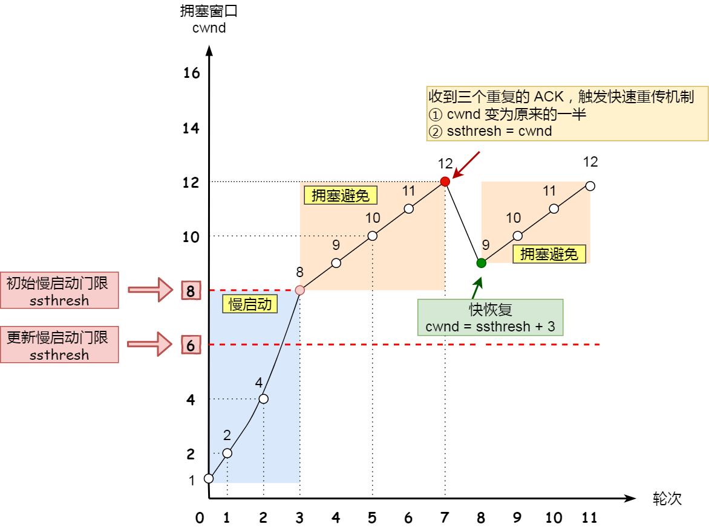

## TCP流量控制

前面我们说到了滑动窗口这种数据结构，基于这种数据结构TCP中提供了一种机制**可以根据接收方实际接受能力控制和发送数据**，这就是所谓的**流量控制**


### 流量控制的经典场景


上图中是以服务器作为发送方，客户端作为接收方，客户端向服务器发送请求数据报文

- 服务端收到客户端的请求报文之后，发送确认报文和80个字节的数据，于是可用窗口大小减少80，变成120，`SND.NXT`向右偏移80字节，指向321，这意味这**下次发送数据的时候从321开始**
- 客户端收到这80个字节的数据之后，接收窗口向右移动80字节，`RCV.NXT`也就指向321，这意味着**客户端期望的下一个报文的序列号是321**，接着发送确认报文给服务端
- 服务端再次发送120字节的数据，此时可用窗口大小变为0，意味着服务端无法发送数据了
- 服务端收到对 80 字节数据的确认报文后，`SND.UNA` 指针往右偏移后指向 321，于是可用窗口 `Usable` 增大到 80
- 服务端收到对 120 字节数据的确认报文后，`SND.UNA` 指针往右偏移后指向 441，于是可用窗口 `Usable` 增大到 200
- 服务端又可以继续发送了，于是发送160字节的数据之后，`SND.NXT`指向601，于是可用窗口`Usable`减少到40
- 客户端收到 160 字节后，接收窗口往右移动了 160 字节，`RCV.NXT` 也就是指向了 601，接着发送确认报文给服务端
- 服务端收到对 160 字节数据的确认报文后，发送窗口往右移动了 160 字节，于是 `SND.UNA` 指针偏移了 160 后指向 601，可用窗口 `Usable` 也就增大至了 200


可以看出，这个例子中假设了发送窗口和接收窗口都是不变的，但实际上，**发送窗口和接收窗口中所存放的字节数，都是放在操作系统内存缓冲区中的，操作系统会根据实际情况调整缓冲区的大小**


比如当应用程序没有办法及时读取缓冲区的内容时，会对我们的缓冲区造成影响

**那么操作系统的缓冲区是如何影响发送和接收窗口的呢？**


### 缓冲区会影响窗口大小


> **<font color=red size=4pt>场景一：当应用程序没有及时读取缓存时</font>**


- 客户端发送140字节的数据，可用窗口大小变成了220
- 服务器收到这140字节的数据之后，由于服务器非常繁忙，应用程序只读取了40字节的数据，还有100字节的数据占据着内存缓冲区，于是接收窗口的大小收缩到了360-100=260，并在发送确认报文时，通知客户端接收窗口大小已经变成了260
- 客户端接收到确认报文之后，发送窗口减少为260
- 客户端发送 180 字节数据，此时可用窗口减少到 80
- 服务器收到这180字节的数据之后，这时候应用程序并没有读取任何的数据，于是这180字节的数据都留在了内存缓冲区中，于是接收窗口继续减少变成80（260-180），并在发送确认报文时，通知客户端接收窗口大小已经变成了80
- 客户端收到确认报文之后，发送窗口大小减少为80
- 客户端发送 80 字节数据后，可用窗口耗尽
- 服务端收到 80 字节数据，**但是应用程序依然没有读取任何数据，这 80 字节留在了缓冲区，于是接收窗口收缩到了 0**，并在发送确认信息时，通过窗口大小给客户端。
- 客户端收到确认和窗口通告报文后，发送窗口减少为 0

可见，最后发送窗口和接收窗口都缩减成了0，也就是发生了**窗口关闭**，当发送方可用窗口变为0的时候，发送方实际上会向接收方定期发送一个探测报文，看看接收方的可用窗口是否已经发生了变化


> **<font color=red size=4pt>场景二：当应用程序没有及时读取缓存时而且由于服务器系统资源紧张，减少了缓冲区大小</font>**

当服务端系统资源非常紧张的时候，操心系统可能会直接减少了接收缓冲区大小，这时应用程序又无法及时读取缓存数据，那么这时候就有严重的事情发生了，**会出现数据包丢失的现象**


- 客户端发送 140 字节的数据，于是可用窗口减少到了 220
- **服务端因为现在非常的繁忙，操作系统于是就把接收缓存减少了 120 字节**，当收到 140 字节数据后，又因为应用程序没有读取任何数据，所以 140 字节留在了缓冲区中，于是接收窗口大小从 360 收缩成了 100，最后发送确认信息时，通告窗口大小给对方
- 此时**客户端因为还没有收到服务端的通告窗口报文，所以不知道此时接收窗口收缩成了 100**，客户端只会看自己的可用窗口还有 220，所以客户端就发送了 180 字节数据，于是可用窗口减少到 40
- 服务端收到了 180 字节数据时，发现数据大小超过了接收窗口的大小，于是就把数据包丢失了
- 客户端收到第 2 步时，服务端发送的确认报文和通告窗口报文，尝试减少发送窗口到 100，把窗口的右端向左收缩了 80，此时可用窗口的大小就会出现诡异的负值

**所以，如果发生了先减少缓存，再收缩窗口，就会出现丢包的现象**

**因此，为了防止这种情况的发生，TCP规定是不允许同时减少缓存又缩小窗口的，而是采用先收缩窗口，过段时间在减少缓存，这样就能够避免丢包情况了**


### 窗口关闭

上面的两个场景解释了为了避免丢包现象，TCP规定了只能够先收缩窗口，隔一段时间之后在减少缓冲区的大小，同时我们从上面的场景一中也能够注意到**接收窗口和发送窗口的窗口大小有都变为0**的情况，也就是产生了**窗口关闭**这个现象


> **<font color=red size=4pt>窗口关闭存在潜在风险</font>**


**接收方向发送方通知窗口大小时，是通过ACK报文来通告的**

如果发送窗口变成0的时候，接收方在处理完数据之后，会向发送方发送ACK报文来通知发送方窗口非0，但是如果这个ACK报文在网络中丢失了，那就会产生问题了，如上图：这可能导致发送方一直等待接受方的非0窗口通知，而接受方一直等待发送方的数据，如果不采取措施，那么这种相互等待的过程，就成了死锁的现象


> **<font color=red size=4pt>TCP中是如何解决窗口关闭时存在的潜在死锁问题</font>**

为了解决窗口关闭时可能存在的潜在死锁问题，TCP会为每个连接设置一个定时器，直到TCP连接的一方收到零窗口通知，计时器就开始启动，如果计时器超时，那么就会发送**窗口探测报文**，而对方在确认这个探测报文的时候，会给出自己现在的接收窗口大小


- 如果接收窗口的可用大小仍为0，那么计时器将会被重置，重新开始计时
- 如果接收窗口的可用大小变为非0，那么死锁的局面就可以被打破了

> 窗口探测的次数一般为3次，每次大约30~60秒，如果3次之后，窗口的大小仍然为0，有的TCP就会发送RST报文来中断连接


### 糊涂窗口综合症

**如果接收方太忙了，来不及取走接收窗口里面的数据，那么就会导致发送方的发送窗口越来越小，到最后，如果接受方腾出几个字节并告诉发送方现在有几个字节的窗口，而发送方会义无反顾地发送这几个字节，这就是糊涂窗口综合症**，示意如下图：


通过上图也可以看出，糊涂窗口综合症就是双方的窗口越来越小，造成这种现象必须满足两个条件：

- 接收方会通告较小的窗口大小

- 发送方会发送较小的数据报文

于是，避免糊涂窗口综合症只需要破坏这两个条件中的一个就好：

- 让接收方不通告较小的窗口大小
- 发送方不在发送较小的数据报文

> 怎么让接收方不通告小窗口呢？

接收方通常的策略如下:

- 当「窗口大小」小于 min( MSS，缓存空间/2 ) ，也就是小于 MSS 与 1/2 缓存大小中的最小值时，就会向发送方通告窗口为 0，也就阻止了发送方再发数据过来

等到接收方处理了一些数据后，窗口大小 >= MSS，或者接收方缓存空间有一半可以使用，就可以把窗口打开让发送方发送数据过来


> 怎么让发送方避免发送小数据呢？

发送方通常的策略:

**使用 Nagle 算法**，该算法的思路是延时处理，它满足以下两个条件中的一条才可以发送数据：

- 要等到窗口大小 >= MSS 或是 数据大小 >= MSS
- 收到之前发送数据的 ack 回包

只要没满足上面条件中的一条，**发送方一直在囤积数据**，直到满足上面的发送条件。

另外，**Nagle 算法默认是打开的**，如果对于一些需要小数据包交互的场景的程序，比如，telnet 或 ssh 这样的交互性比较强的程序，则需要关闭 Nagle 算法。

可以在 Socket 设置 TCP_NODELAY 选项来关闭这个算法（关闭 Nagle 算法没有全局参数，需要根据每个应用自己的特点来关闭）

```c
setsockopt(sock_fd, IPPROTO_TCP, TCP_NODELAY, (char *)&value, sizeof(int));
```


> Nagle算法

要知道，当我们传输数据包的时候，TCP+IP的头部就有40个字节，如果数据包的body远小于head的40字节的话，这显然是很不划算的，所以就出现了基于延迟发送思想的Nagle算法，这个算法的目的就是为了减少网络中小数据包的数量，从而减少网络拥堵。

Nagle算法对数据包的处理如下：在未确认数据发送的时候让发送器把数据送到缓存里。任何数据随后继续直到得到明显的数据确认或者直到攒到了一定数量的数据了再发包


## TCP阻塞控制

前面我们说了流量控制，这里又提到阻塞控制，那么我们首先要做的就是区分阻塞控制和流量控制

- 流量控制的作用是根据接收窗口的大小发送数据，**避免发送方发送的数据填满接收方缓存**
- 阻塞控制的作用是**避免发送方的发送数据填满整个网络，造成更严重的网络拥堵**

> 在网络上出现拥堵时，如果继续发送大量的数据包，可能会导致数据包时延、丢失等，这时TCP就会重传数据，但是一重传就会导致更多的数据包进入网络，加重网络的阻塞，于是就会导致更大的时延以及更多的丢包，这样一直恶性循环...

所以，TCP不能忽略网络上发生的时候，事实上，TCP被设计成了一个无私的协议，当网络出现拥堵时，TCP会进行自我牺牲，即减少自己发送数据包的数量，也就是阻塞控制，为了调节发送方发送数据包的数量，阻塞控制中定义了一个**拥塞窗口**的概念


### 拥塞窗口

拥塞窗口是**由发送方维护**的一个状态变量，它**会根据网络的拥塞程度动态变化**，使用`cwnd`来表示

那么`cwnd`和我们前面提到的发送窗口`swnd`、接收窗口`rwnd`有什么关系呢？我们知道由于存在网络时延，发送窗口和接收窗口是约等于的关系，加入了阻塞窗口的概念之后，**发送窗口的大小等于`min{cwnd, rwnd}`，也就是接收窗口和拥塞窗口中的最小值**

拥塞窗口的变化机制：

- 当网络中没有出现拥塞的时候，拥塞窗口会变大
- 当网络中出现拥塞的时候，拥塞窗口会变小

看到拥塞窗口的变化机制，就有了一个问题了，TCP协议是怎么知道网络中是否出现阻塞的呢

**其实只要是发送方在规定时间内没有收到ACK应答报文，也就是发生了超时重传，TCP就会认为网络中出现了阻塞**


**拥塞控制主要有四个算法：慢启动、拥塞避免、拥塞发生、快速恢复**


### 慢启动

首先我们来看一下慢启动，TCP在连接刚刚建立完成后，首先会有一个慢启动的过程，这个慢启动的意思就是一点点的增加发送数据包的量，如果一上来就给网络发送大量数据包，那岂不是会给网络带来很大的负担吗？

对于慢启动，我们只需要要记住的一个规则就是在慢启动中，每收到一个ACK应答报文，拥塞窗口`cwnd`的大小就会增加1

这里假定拥塞窗口和发送窗口相等，有下面场景：

- 连接建立完成后，一开始初始化 `cwnd = 1`，表示可以传一个 MSS 大小的数据
- 当收到一个 ACK 确认应答后，`cwnd` 增加 1，于是一次能够发送 2 
- 当收到 2 个的 ACK 确认应答后， `cwnd `增加 2，于是就可以比之前多发2 个，所以这一次能够发送 4 个
- 当这 4 个的 ACK 确认到来的时候，每个确认 `cwnd `增加 1， 4 个确认 `cwnd` 增加 4，于是就可以比之前多发 4 个，所以这一次能够发送 8 个

通过上面的描述，我们能够知道**在慢启动算法中发包个数是指数式增加的**，如下图：


我们肯定不能让发包的数量一直这么增长下去，那么涨到什么时候是个头呢？

所以，这里又出现了一个变量**`ssthresh(slow start threshold)`，叫做慢启动门限**，一般来说`ssthreshold`的大小是65535字节

- 当`cwnd < ssthresh`时，继续使用慢启动算法

- 当`cwnd >= ssthresh`时，就使用拥塞避免算法


### 拥塞避免

我们前面说到，当拥塞窗口的大小大于慢启动门限之后，就会进入拥塞避免算法，那么拥塞避免算法的规则就是：**当进入了拥塞避免算法之后，每收到一个ACK，拥塞窗口的大小增加`1/cwnd`**

接上前面的慢启动的场景，现假定 `ssthresh` 为 `8`：

- 当 8 个 ACK 应答确认到来时，每个确认增加 1/8，8 个 ACK 确认 `cwnd` 一共增加 1，于是这一次能够发送 9 个 `MSS` 大小的数据，也就是说拥塞窗口的大小**从指数增长变成了线性增长**


我们可以发送，**拥塞避免算法就是将拥塞窗口的大小从指数式增加变成了现在的线性增加，但是还是处于增长阶段，只是速度放缓了**

然后就这么增长着，网络慢慢就会进入阻塞的状态了，于是就会出现丢包现象，这时候就需要对丢失的包进行重传

**当触发了重传机制，也就意味着网络出现了拥堵，也就进入了拥塞发生算法**


### 拥塞发生

我们在前面知道了重传机制的算法主要有四种：超时重传、快速重传、SACK、D-SACK，但事实上，SACK和D-SACK都是在快速重传的基础上改进的（在TCP头部选项字段添加sack字段）

在拥塞发生算法中，使用不同的重传机制，算法具体的实现是有区别的


### 发生超时重传的拥塞发生算法

如果触发了超时重传，那么这时候就会进入拥塞发生算法，这个时候`ssthresh`和`cwnd`的大小也会发生变化

- `ssthresh`变为`cwnd/2`
- `cwnd`变为1

变化完之后，就会重新开始慢启动的过程，如下图，可以看出来，一旦发生了超时重传，拥塞窗口的大小直接变成1，也就是从头开始慢启动，“一夜回到解放前”，这种做法太激进了，会造成网络的卡顿感严重


### 发生快速重传的拥塞发生算法（快速恢复）

前面我们提到了快速重传，当发送方连续收到三个相同的ACK时，于是发送端就会快速地重传，不必等待超时再重传。

这种情况下，TCP会认为网络拥堵不严重，因为发送方还能收到三个相同的ACK了，说明大部分没丢，丢掉的是一小部分，然后`ssthresh`和`cwnd`的变化过程如下：

- `cwnd=cwnd/2`，拥塞窗口变成原来的一半
- `ssthresh=cwnd`
- 进入快速恢复算法

快速恢复算法的过程如下：

- `cwnd = ssthresh + 3`，这个加三的意思就是有三个数据包已经被收到了，指的是三个相同的ACK数据包
- 重传丢失的数据包
- 如果重传数据包的ACK收到了重复的ACK，则`cwnd + 1`，表示这丢失的数据包已经重传成功了，这个加1表示重传回来的这个ACK
- 如果收到了新的ACK，把`cwnd`的值设置成第一步中`ssthresh`的大小，原因是该ACK确认了新的数据，说明从 duplicated ACK 时的缺失数据都已收到，该恢复过程已经结束了，可以恢复到之前的状态了，然后再次进入拥塞避免状态




可以看出，没有像超时重传那样，一夜回到解放前


**参考链接**

Nagle算法 https://www.cnblogs.com/wanpengcoder/p/5366156.html

Nagle算法 https://segmentfault.com/a/1190000022929052

TCP“粘包” https://www.zhihu.com/question/20210025 第二个回答