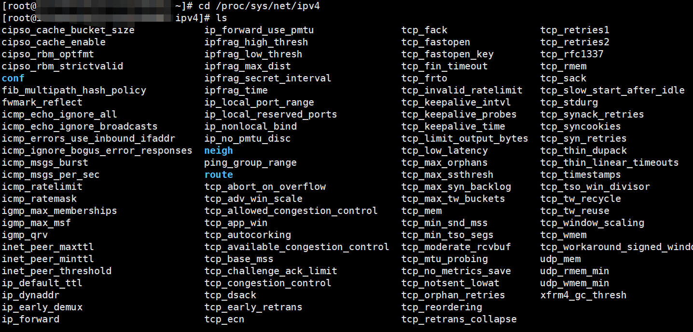
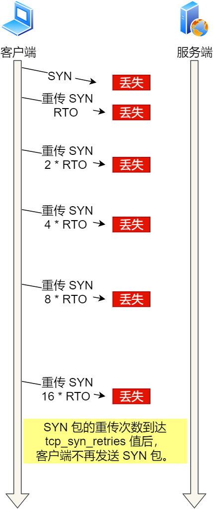
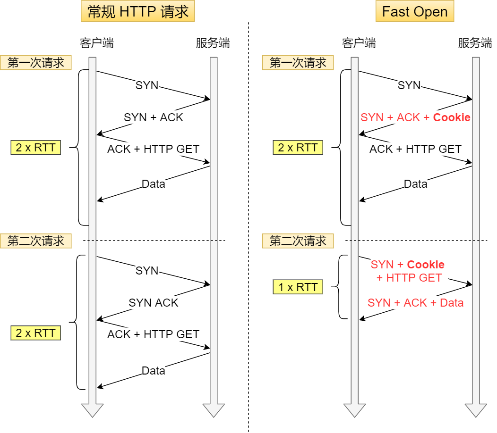
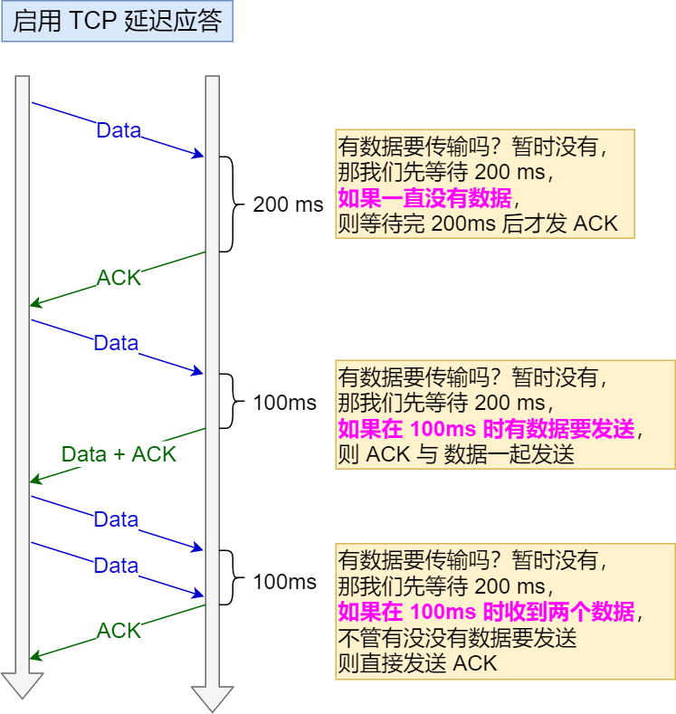
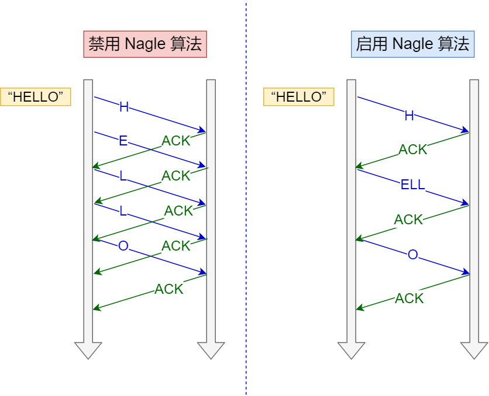
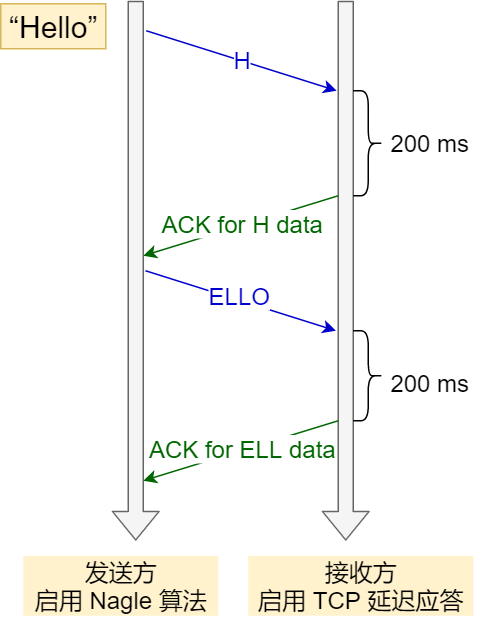

写在最前面，有关TCP,IP的这些内核参数都是`/proc/sys/net/ipv4`路径下




## TCP握手过程中的异常情况


### TCP第一次握手的SYN包丢失

```bash
# 模拟方法：为了模拟 TCP 第一次握手 SYN 丢包的情况，我是在拔掉服务器的网线后，立刻在客户端执行 curl 命令
```

如果第一次握手的SYN包丢失了，那么会触发超时重传机制，**具体重传几次是由内核参数`tcp_syn_retries`决定的，而且每次超时的时间RTO都是指数翻倍往上增长的**，直到SYN包重传的次数到达`tcp_syn_retries`值之后，客户端不在重传




### TCP第二次握手的SYN+ACK包丢失

```bash
# 模拟方法：为了模拟客户端接收不到服务器第二次握手SYN,ACK包，我的做法是在客户端加上防火墙限制，简单粗暴的把来自服务器的数据报都丢掉，防火墙增加规则如下：
iptables -I INPUT -s 192.168.12.1 -j DROP
```

**第二次握手的SYN+ACK包丢失之后，客户端会触发超时重传，重传SYN包，服务器也会触发超时重传，重传SYN+ACK包**

重传SYN+ACK包的次数是由内核参数`tcp_synack_retries`决定的


在这个里面需要注意添加不同的防火墙规则，会有不同的包接收和发送顺序

- 网络包从服务器进入客户端的顺序 Wire -> NIC -> tcpdump -> netfilter/iptables
- 网络包从客户端出去的顺序 iptables -> tcpdump -> NIC -> Wire


### TCP第三次握手ACK丢包

```bash
# 模拟方法：同样是添加防火墙规则
iptables -I INPUT -s 192.168.12.1 -p tcp --tcp-flag ACK ACK -j DROP
```

在建立 TCP 连接时，如果第三次握手的 ACK，服务端无法收到，则**服务端就会短暂处于 SYN_RECV 状态**，而客户端会处于 ESTABLISHED 状态

由于服务端一直收不到 TCP 第三次握手的 ACK，则会一直重传 SYN、ACK 包，直到重传次数超过`tcp_synack_retries` 值后，服务端就会断开 TCP 连接

而客户端则会有两种情况：

- 如果客户端没发送数据包，一直处于 ESTABLISHED 状态，然后经过 2 小时 11 分 15 秒才可以发现一个「死亡」连接（保活机制），于是客户端连接就会断开连接

- 如果客户端发送了数据包，一直没有收到服务端对该数据包的确认报文，则会一直重传该数据包，直到重传次数超过 `tcp_retries2 `值（默认值 15 次）后，客户端就会断开 TCP 连接

  **TCP建立连接之后，数据包最大超时重传次数由内核参数`tcp_retries2`决定**


## TCP快速建立连接

在Linux3.7版本中，提供了TCP Fast Open功能，这个功能可以减少TCP连接建立的时延



开启了Fast Open之后，服务器会在第一次连接的时候产生一个cookie（已加密）并通过SYN+ACK包一起发送给客户端，客户端把这个Cookie保存下来，所以开启了Fast Open之后，第一次连接仍然需要2RTT，但是在第二次连接的时候，客户端发送SYN请求会把cookie一起发生送给服务器，服务器验证cookie，合法之后，这样仅仅需要1RTT就能够建立连接

> 客户端在缓存了cookie之后，客户端能够不断地通过Fast Open直到服务器认为cookie失效，通常是由于过期了


在Linux上如何开启Fast Open呢？

通过设置内核参数`net.ipv4.tcp_fastopen`来开启

net.ipv4.tcp_fastopen 各个值的意义:

- 0 关闭
- 1 作为客户端使用 Fast Open 功能
- 2 作为服务端使用 Fast Open 功能
- 3 无论作为客户端还是服务器，都可以使用 Fast Open 功能

[TCP的所有参数都在`/proc/sys/net/ipv4`路径下可以查看得到，需要在`/etc/sysctl.conf`中设置这些参数](https://help.aliyun.com/knowledge_detail/41334.html)


## TCP延迟确认和Nagle算法

当我们TCP数据报文承载的数据非常小的时候，比如只有几个字节，那么网络整体的效率是很低的，因为TCP头部最少要有20个字节，IP头部要有20个字节，而数据只有几个字节，所以整个报文中有效数据的比重就会很低，这好像是快递员开大车拉小货

为了解决上面的问题，就出现了两种机制：

- 延迟确认
- Nagle算法

首先，**延迟确认机制是开启在接收方，Nagle算法是开启在发送方**


### 延迟确认机制

事实上，没有携带数据的ACK报文在网络中的传输效率也是很低的，因为他有40个字节的TCP头+IP头，却没有携带数据，所以为了解决ACK传输效率低的问题，就衍生出了TCP延迟确认

TCP延迟确认的策略：

- 当有响应数据要发送时，ACK会随着响应数据一起发送给对方
- 当没有响应数据要发送时，ACK将会延迟一段时间，以等待是否有响应数据要发送
- 如果在延迟等待发送ACK期间，对方的第二个数据报文到了，这时候会立刻发送ACK

**TCP延迟确认可以在Socket中设置`TCP_QUICKACK`选项来关闭这个算法**




### Nagle算法

Nagle算法做了一些策略来避免一些小的报文发送，策略如下：

- 没有已发送但是未确认报文的时候，立刻发送数据
- 存在已发送但是未确认报文，当数据长度达到MSS大小或者发送窗口大小大于缓存的一半就可以发送数据了



可以看出，**Nagle算法肯定会有一个小报文发送，即最开始发送的时候**

**Nagle算法可以通过设置Socket中的参数`tcp_nodelay`来开启或者关闭**


> 如果同时开启延迟确认机制和Nagle算法会造成网络很卡的现象



这两个同时使用会造成额外的时延

解决方法就是关闭发送方的Nagle算法或者关闭接收方的延迟确认机制
