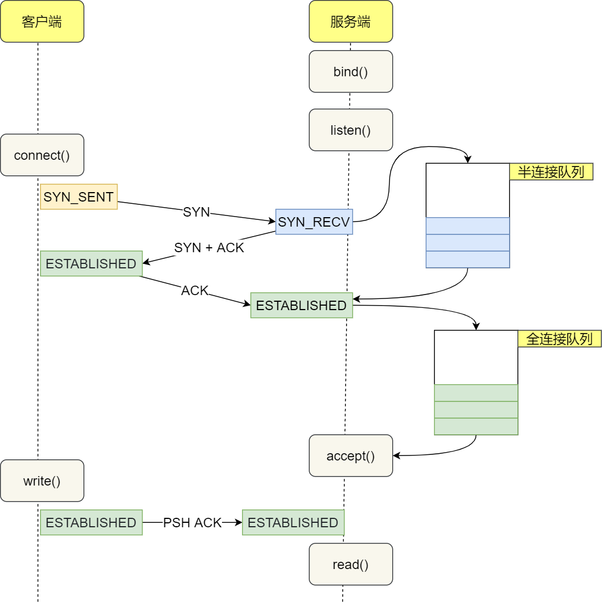

## TCP全连接队列和半连接队列

我们知道，在TCP三次握手时服务器内核会维护两个队列

- 当服务器收到客户端的连接请求报文SYN时，会把这个连接放入到SYN队列中，SYN队列又叫做半连接队列
- 当服务器收到客户端第三次握手的ACK报文时，会把这个完全的连接从SYN中取出，放入到accept队列中，accept队列又叫做全连接队列，全连接队列中的连接等待着服务器上的应用程序通过accept函数调用



**不管是全连接队列，还是半连接队列，他们都有长度限制，一旦超过了这个长度限制连接就会被丢弃（Drop）或者重置（Reset）**


### TCP全连接队列

> <font color=red>Listen和非listen状态下的不同含义</font>

在服务器端可以**通过`ss`命令来查看全连接队列的大小**，但是需要注意的是在LISTEN和非LISTEN状态下的Recv-Q和Send-Q表达的意思是不一样的，如下：

- 下图表示的是处于监听状态下的socket，其中
  - Recv-Q表示的意思是当前全连接队列的大小，即完成了三次握手等到被应用程序accept调用的TCP连接数
  - Send-Q表示的意思是全连接队列的最大长度，下图所示，说明监听8088端口的TCP服务，最大全连接长度为128


- 下图表示的是处于非LISTEN状态下的socket，其中

  - Recv-Q表示的是已被服务器收到，但是还没有被应用程序读取的字节数
  - Send-Q表示的是已发送，但是还没有收到确认回复的字节数

  


> <font color=red>模拟全连接队列溢出的条件</font>

模拟全连接队列溢出的思想就是并发大量的请求，让服务器的应用程序处理不过来，可以使用wrk工具来模拟

```
 wrk 工具，它是一款简单的 HTTP 压测工具，它能够在单机多核 CPU 的条件下，使用系统自带的高性能 I/O 机制，通过多线程和事件模式，对目标机器产生大量的负载。
```


**当服务器并发处理大量请求的时候，如果全连接队列过小，就容易发生溢出现象，当TCP全连接队列溢出之后，后续的请求就会被丢弃，这样就会导致服务器端的请求数量上不去**


当全连接队列溢出之后，服务器的默认行为就是丢弃后续的请求，但是实际上，Linux中有一个参数能够用来指定全连接队列溢出时，使用什么策略，可以通过**修改`/proc/sys/net/ipv4/tcp_abort_on_overflow`这个参数来指定策略**

- `tcp_abort_on_overflow`的默认值是0，也就是Linux的默认行为就是丢弃连接
- 可以把`tcp_abort_on_overflow`修改为1，这样的话，当全连接队列满的时候，服务器会返回给客户端一个RST复位报文，告诉客户端连接已失效，被重置了

但是通常情况下应该让`tcp_abort_on_overflow`保持默认值，因为这样的话能够更好的应对突发流量，如下例子

```
当TCP全连接队列溢出时，服务器会丢掉客户端返回的ACK，但是此时客户端的状态已经是ESTABLISHED了，于是客户端进程就会在建立好的连接上进行通信，只要服务器没有为请求回复ACK，客户端就会重发请求，如果服务器此时只是由于短暂的繁忙而导致全连接队列溢出了，那么当TCP全连接队列有空位的时候，再次受到的请求中由于含有ACK报文，服务器仍然可以和客户端建立连接
```

所以`tcp_abort_on_overflow`等于0可以提高连接的成功率，只有非常确定全连接队列会长期溢出的时候，才能够将其设置为1


> <font color=red>如何增大TCP全连接队列呢</font>

当全连接队列发生溢出的时候，我们就应该考虑增大全连接队列长度，以便可以应对更多的客户端请求

**TCP全连接队列的最大值取决于`somaxconn`和`backlog`的最小值，也就是`min{somaxconn, backlog}`**

- `somaxconn`是Linux内核参数，默认是是128字节，在`/proc/sys/net/core/somaxconn`
- `backlog`是listen()函数的一个参数，Nginx的默认值是511，可以通过修改Nginx的配置文件来设置其长度

所以，如果想要增大全连接队列的长度，需要同时增大`somaxconn`和`backlog`


### TCP半连接队列

半连接队列的长度不能够向全连接长度那样直接查看，但是我们可以通过以下命令，来查看服务器处于SYN_RECV状态的连接数

```shell
netstat -nasp | grep SYN_RECV | wc -l 
256 # 表示当前处于半连接状态的TCP连接有256个
```


> <font color=red>如何模拟半连接队列溢出呢</font>

我们之前所说的SYN攻击就是让半连接队列溢出，我们可以对服务器一直发送SYN，但是不给服务器回复ACK，这样就能够使得服务器的半连接队列溢出


> <font color=red>半连接队列的长度</font>

**很多人说半连接队列的长度是由`tcp_max_syn_backlog`决定的，这种说法是不对的**


因为半连接队列的长度不仅仅是由`tcp_max_syn_backlog`决定的，他还跟`somaxconn`和`backlog`有关系，也就是说半连接队列的长度和全连接队列的长度也有关系，具体关系如下：

- 当`tcp_max_syn_backlog > min{somaxconn, backlog}`的时候，半连接队列的长度等于`2 * min{somaxconn, backlog}`
- 当`tcp_max_syn_backlog < min{somaxconn, backlog}`的时候，半连接队列的长度等于`2 * tcp_max_syn_backlog`

**源码中，全连接队列的长度使用`sk_max_ack_backlog`表示，半连接队列的长度使用`max_qlen_log`表示**


> <font color=red>`max_qlen_log`是服务器端处于SYN_RECV状态的TCP连接的最大个数吗</font>

不一定。**max_qlen_log 理论上是半连接队列的最大值，并不一定代表服务端处于 SYN_RECV 状态的最大个数**

我们直到，当全连接或者半连接队列溢出的时候，服务器有两种策略：一是丢弃，二是Reset，对于半连接队列，它对应的是TCP的第一次握手，这时候会有三种情况会被丢弃

- 如果半连接队列满了，且没有开启`tcp_cookies`，那么连接将会被丢弃
- 如果全连接队列满了，且没有重传 SYN+ACK 包的连接请求多于 1 个，则会丢弃
- 如果没有开启`tcp_cookies`，且`tcp_max_syn_backlog - 当前TCP半连接队列的长度 < (tcp_max_syn_backlog >> 2)`，连接将会被丢弃

所以，服务端处于 SYN_RECV 状态的最大个数分为如下两种情况：

- 如果「当前半连接队列」没超过「理论半连接队列最大值」，但是超过 max_syn_backlog - (max_syn_backlog >> 2)，那么处于 SYN_RECV 状态的最⼤个数就是 max_syn_backlog - (max_syn_backlog >> 2)
- 如果「当前半连接队列」超过「理论半连接队列最大值」，那么处于 SYN_RECV 状态的最大个数就是「理论 半连接队列最大值」


### 如何抵御SYN攻击

增大半连接队列的长度，开启SYN_Cookie，减少重发`SYN+ACK`包的次数


## 优化

这一部分是通过TCP内核参数对三次握手、四次挥手、数据传输过程的优化，也可以看成是对TCP知识的总结


### TCP三次握手的优化


- **客户端优化：**客户端发出SYN请求之后，进入SYN_SENT状态，理论上几毫秒之内就能够受到服务器返回的SYN+ACK报文，如果没有收到，客户端将重发SYN请求，重发次数由`tcp_syn_retires`决定

- **服务器优化**

  - 当服务器迟迟收不到ACK报文时，服务器就会重发`SYN+ACK`包，重传次数由`tcp_synack_retires`决定

  - 服务器收到了来自客户端的ACK报文之后，就会把该连接放入半连接队列中，如果半连接队列满了，连接会被丢弃，可以通过命令`netstat -s |grep "SYNs to LISTEN"`来查看由于半连接队列满了而导致被丢弃的连接情况；

    - 如果想要修改半连接队列的长度，需要同时考虑三个参数：`tcp_max_syn_backlog`，`somaxconn`和`backlog`
    - 如果在半连接队列满了的情况下（SYN攻击），不想要丢弃连接，那么还可以通过开启`tcp_syncookies`来绕过半连接队列建立连接

  - 服务器收到了来自客户端的ACK之后，会把SYN请求从半连接队列中取出来，加工成一个完成的TCP连接放入到全连接队列中，等待应用程序使用accept调用函数将其取出，如果accept队列满了（accept队列满了之后不仅是ACK会被丢弃，就连新请求的SYN也会被丢弃），则会丢弃或者重置连接，策略是由`tcp_abort_on_overflow`决定

    - 默认情况下，`tcp_abort_on_overflow = 0`，这样更容易应对突发流量

    - `tcp_abort_on_overflow = 1`表示当全连接队列溢出时，服务器会返回给客户端RST报文，只有当确认全连接队列会长时间溢出的时候，才将其设置成1

    - 如果全连接队列溢出严重，我们还可以通过增大全连接队列的长度，其长度等于`min{somaxconn, backlog}`

      `somaxconn`位于`/proc/sys/net/core/somaxconn`中

      `backlog`位于listen()方法的参数中，可以通过Nginx来设置

      半连接队列中涉及到的`tcp_max_syn_backlog`位于`/proc/sys/net/ipv4/tcp_max_syn_backlog`中

- **绕过三次握手，**客户端和服务器可以通过开启`fast_open`来绕过三次握手，其核心就是通过一个cookie来携带双方的连接信息，使得双方**第一次通信之后**只需要1RTT就能够完成通信

  在`/proc/sys/net/ipv4/tcp_fastopen`中设置


### TCP四次挥手的优化


在进行总结之前，我们首先来看一下close和shutdown的区别，主动断开方调用`close`或者`shutdown`后会立刻向被动断开方发送`FIN`报文，这两个方法的区别在于

- **调用了`close`意味着完全断开连接**，**完全断开连接不仅无法传输数据，也不能够发送数据**，此时调用`close`函数的一方的连接叫做**孤儿连接**，如果用`netstat -p`命令会发现对应的进程名为空

- **`shutdown`是比`close`更加优雅的一种方式，它可以控制只关闭一个方向上的连接**

  ```c
  // shutdown的函数签名
  int shutdown(int sock, int howto)
  // 第二个参数决定了断开连接的方式
  ```

  - `SHUT_RD(0)`表示关闭连接的`READ`方向，如果接收缓冲区有已经接收到的数据，则会丢弃，后续收到新的数据之后，会对数据进行ACK确认应答，然后悄悄地丢弃掉，也就是说发送数据的一方会收到确认数据的ACK，但是他不知道数据已经被丢了
  - `SHUT_WR(1)`表示关闭连接的`WRITE`方向，这个就是被称作半连接的关闭，如果发送缓冲区中还有未发送的数据，将立即被发送出去，并发送一个FIN报文给对端
  - `SHUT_RDWR(2)`直接关闭套接字的读写两个方向，相当于`SHUT_RD`和`SHUT_WR`各做一次


- **主动方的优化**

  - **第一次挥手：**主动发起FIN报文断开连接的一方，如果迟迟没收到对方的ACK回复，则会重传FIN报文，重传的次数由`tcp_orphan_retires`决定，在Linux中`tcp_orphan_retires`的默认值是0，但是这个0特指8次

  - **第二次挥手：**当主动方收到ACK报文之后，连接就会进入`FIN_WAIT2`状态，根据关闭方式的不同，优化的策略也不同

    - 如果使用close函数关闭的连接，那么他就是孤儿连接，如果在**`tcp_fin_timeout`**秒内没有收到对方的FIN报文，连接就直接关闭，同时为了应对孤儿连接占用太多的系统资源，还通过**`tcp_max_orphans`定义了孤儿连接的最大数量**
    - 如果使用了shutdown函数关闭连接，那么就不受上述参数的限制了

  - **第三次挥手：**当主动方接收到FIN报文，并返回ACK报文之后，会进入到TIME_WAIT状态，`TIME_WAIT`状态会持续`2MSL`，原因有二：一是能够防止新连接收到旧连接的数据包，二是能够确保被动断开方完全正确地断开连接；那么为什么不是4MSL,8MSL呢？首先如果TIME_WAIT时间过长，会导致系统资源紧张，假设有一个丢包率为1%的糟糕网络，连续两次丢包的概率才为万分之一，可以接收

  - **当TIME_WAIT状态的连接过多时，**可以通过开启`tcp_tw_reuse`和`tcp_timestamps`来复用处于`TIME_WAIT`状态的连接；还可以通过设置`tcp_max_tw_buckets`来设置能够处于`time_wait`状态连接的最大值

    

- **被动方的优化**

  被动断开方的优化就相对简单了，他在收到FIN并回复ACK之后就进入了CLOSE_WAIT状态，等待调用close函数发送FIN报文，因此当被动断开方中出现大量CLOSE_WAIT状态的连接时，需要看一下应用程序中是否有bug，可能没有调用close函数

  当被动方发送FIN报文之后，他就进入了Last Ack状态，如果在规定时间内没有收到ACK，那么就会重发FIN报文，重发次数仍然是由`tcp_orphan_retires`决定


### TCP数据传输性能的提升


TCP连接是由内核维护的，内核会为每个连接建立一个内存缓冲区

- 如果连接的内存配置过小，就无法充分使用网络带宽，传输效率低
- 如果连接的内存配置过大，就容易耗尽服务器资源，导致新的连接无法建立


我们从滑动窗口那部分就知道了：滑动窗口机制的目的就是为了让发送方根据接收方的能力来控制发送的数据量，在不考虑拥塞控制的前提下，发送窗口约等于阻塞窗口，因为窗口大小的传递是具有时延的


我们再来看一下TCP的头部格式


可以看到，默认情况下窗口大小只有16位，也就是`2^6 kb = 64kb`，在当今高速网络的环境下这显然是不够用的，所以在选项字段中可以对窗口大小进行扩充，TCP 选项字段定义了**窗口扩大因子**，用于扩大 TCP 通告窗口，其值大小是 2^14，这样就使 TCP 的窗口大小从 16 位扩大为 30 位（2^16 * 2^ 14 = 2^30），所以此时**窗口的最大值可以达到 1GB**

**在Linux中通过`/proc/sys/net/ipv4/tcp_window_scaling`来启用窗口扩大因子**

要使用窗口扩大选项，通讯双方必须在各自的 SYN 报文中发送这个选项： 

- 主动建立连接的一方在 SYN 报文中发送这个选项 
- 而被动建立连接的一方只有在收到带窗口扩大选项的 SYN 报文之后才能发送这个选项


窗口的扩大也需要考虑服务器内存的限制以及网络传输能力，超过了网络传输能力的报文会直接被丢弃，所以连接的内存缓冲区不是越大越好，那么怎么修改连接双方的缓冲区大小呢？

**可以分别通过`/proc/sys/net/ipv4/tcp_wmem`和`/proc/sys/net/ipv4/tcp_rmem`来修改发送缓冲区和接收缓冲区的大小**

我们知道，发送缓冲区决定了发送窗口的上限，而发送窗口的大小又决定了飞行报文大小的上限

```bash
# 带宽时延积BDP = 带宽 * RTT
# 带宽描述的是网络传输能力
# 比如最大带宽是100MB/S，网络时延RTT是10ms时，意味着客户端到服务端的网络中一共可以存放100MB/S*0.01s=1MB的字节
# 这个1MB是带宽和时延的乘积，所以他们就叫做带宽时延积（BDP,Bandwidth Delay Product）.同时这1MB也表示飞行中的TCP报文大小，他们就在网络线路、路由器等网络设备上，如果飞行报文的大小超过了1MB，就会导致网络过载，容易丢包
```

所以，**发送缓冲区的大小也不能超过带宽时延积**

因为一旦发送缓冲区的大小超过了带宽时延积，就意味着发送报文的数量超过了网络传输的能力，于是就容易产生网络过载、丢包等现象，而如果小于带宽时延积的话，就没有办法充分利用网络的传输能力，所以**发送缓冲区应该尽可能地去接近带宽时延积**


那么怎么通过`tcp_wmem`来调整发送缓冲区的大小呢，如下图所示


**首先需要明确的是`tcp_wmem`和`tcp_rmem`的单位都是字节，而`tcp_mem`的单位是页数，每页4K**

- 4096代表的是发送缓冲区的最小值，4K，动态变化范围的最低值
- 16384≈16K，表示的是默认初始值
- 4194304=4M，表示的是发送缓冲区的最大值，动态变化范围的最大值

Linux默认情况下，对于每个TCP连接，发送缓冲区的初始默认值是16K，范围从4K到4M动态变化

**发送窗口的调节功能是自动开启的，而接收窗口的调节功能必须要手动打开**


通过`tcp_rmem`来修改接收缓冲区的大小，单位也是字节


- 第一个数值是动态范围的最小值，表示即使在内存压力下也可以保证的最小接收缓冲区大小，4096 byte = 4K 
- 第二个数值是初始默认值，87380 byte ≈ 86K 
- 第三个数值是动态范围的最大值，6291456 byte = 6144K（6M)

**接收缓冲区可以根据系统空闲内存来调节接收窗口的大小，但是该功能需要将`/proc/sys/net/ipv4/tcp_moderate_rcvbuf`设置为1来开启**

- 当系统空闲内存比较多的时候，可以把接收缓冲区调大一些，这样也会通知发送方扩大自己的发送窗口，从而提高发送量
- 当系统空闲内存比较少的时候，可以减少缓冲区，这样虽然会降低传输效率，但是可以保证更多的并发连接保证效率


我们上面提到，接收缓冲区的调节是需要看系统内存紧不紧张，那么怎么看紧不紧张呢？

**通过`tcp_mem`这个参数来查看系统内存的使用情况，单位是页面数，每页4k**


- 当 TCP 内存小于第 1 个值时，不需要进行自动调节 
- 在第 1 和第 2 个值之间时，内核开始调节接收缓冲区的大小 
- 大于第 3 个值时，内核不再为 TCP 分配新内存，此时新连接是无法建立的


> 根据实际场景调节的策略

在高并发的服务器中，为了兼顾网络和并发量，我们应该保证缓冲区的动态调整的最大值是带宽时延积，而最小值保持默认的4K不变即可，而对于内存紧张的服务来说，适当降低最小值可以提高并发量

同时，如果这是网络I/O型服务器，那么**调大`tcp_mem`的上限可以让TCP连接使用更多的系统内存，这有利于提高并发能力（这么说是没有问题的）**，需要注意的是`tcp_wmem,tcp_rmem`的单位是字节，而`tcp_mem`的单位是页数，而且**尽量不要再socket中直接设置发送缓冲区（SO_SNDBUF）和接收缓冲区（SO_RCVBUF）的大小，因为这样会导致自动调节功能失效，这种事情修改内核参数就好了**


> **注意：很重要的理解：`tcp_mem`指的是连接方能够提供给TCP的内存大小，而`tcp_wmem,tcp_rmem`指的是一条连接的内存缓冲区大小**