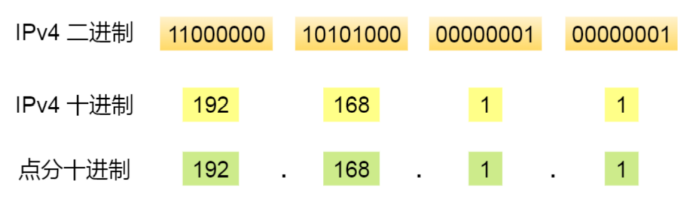
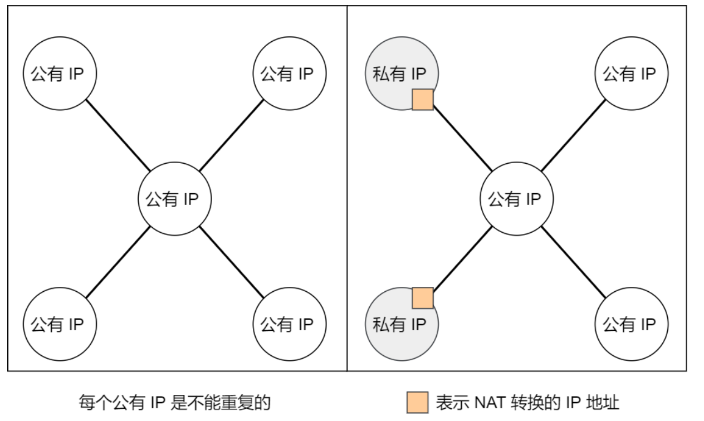
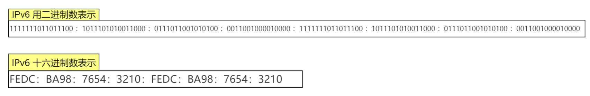

## IP的基本知识

IP在TCP/IP参考模型中的第三层，也就是网络层

网络层的主要作用是：实现主机与主机之间的通信，也叫点对点（end to end）通信

IP的作用就是在复杂的网络环境中将数据包发送给最终目的主机

**==问题：为什么有了IP地址还要有MAC地址（IP地址和MAC地址的关系）==**

IP的作用是实现两个主机之间的通信，而MAC的作用是实现直连的两个设备之间的通信，在网络传输数据包的过程中，源IP地址和目标IP地址是不会发生变化的，只有源MAC地址和目标MAC地址才会一直发生变化，也就是说通过IP地址能够找到目的主机，而实际的转发是由MAC地址完成的，MAC地址起到记录下一跳信息的作用。

## IP地址

IPv4地址有32位，每8位为一组，共分为4组，每组之间以`.`隔开

所以IPv4地址总共可以有`2^32`，大约43个地址

但是如今一个网卡、路由器等都可以有2个及以上的IP地址，而且移动设备的普及，手机、平板等设备也需要IP地址，导致IPv4的地址早就被用完了，目前是可以根据NAT技术来进行处理（后面会说）

因此，现在IPv6正在逐渐发展和普及

### IP地址的分类

IP地址被分成了5种类型，分别是A类，B类，C类，D类，E类

上图中的黄色部分表示的是分类号，用以区分IP地址类别

可以看到，**D类和E类地址是没有主机号的，因此这两类地址不能用于主机IP**

> 先来看一下A类，B类，C类地址

可以看出，不同类别的IP地址都是有范围的，因为不同类别的IP地址在高位都有标记

而且不同类别的地址划分，导致网络号和主机号的位数也不相同，这也就导致了每类地址所能表示的主机个数也是不同的，比如C类地址，主机号占8位，能够表示的主机是`2^8 - 2 = 254`个，为什么需要减2呢？这是因为有两个主机号是特殊的

- 主机号全是0，用来指定某个网络
- 主机号全是1，用来指定某个网络下的全部主机，用于广播

广播地址可以分为两类：本地广播和直接广播

- 本地广播：**在本网络内的广播叫做本地广播，**例如网络地址为192.168.0.0/24的情况下，广播地址 是192.168.0.255，因为这个广播地址的IP包会被路由器屏蔽，所以不会到达192.168.0.0之外的其 他链路上，比如192.168.1.0这个链路上的主机就不会收到。

  > 也就是说只能够在自己子网的这个范围内进行广播

- 直接广播：**在不同网络之间的广播叫做直接广播，**例如网络地址为192.168.0.0/24中的某个主机向192.168.1.255/24的目标地址发送IP包，收到这个包的路由器，会将数据转发给192.168.1.0/24，从而使所有的192.168.1.1/24-192.168.1.254的主机都接受到这个数据包（由于直接广播有一定的安全问题，所以多数情况下路由器设置为不转发）

> 有关广播地址计算的链接
>
> [直接广播地址怎么算出来_百度知道 (baidu.com)](https://zhidao.baidu.com/question/169673315.html)
>
> [四种IP广播地址_hh_xlp的专栏-CSDN博客_ip广播地址](https://blog.csdn.net/hh_xlp/article/details/7030245)

> 然后我们再来看一下D类，E类地址

D类地址和E类地址没有主机号，因此不能够用作IP地址，D类地址常常被用于多播（组播），E类是预留的分类，暂时未使用

**多播用于将数据包发送给特定组内的所有主机**

由于广播无法穿透路由，若想给其他网络发送同样的包，就可以使用能够穿透路由的组播

**一定要注意广播和组播只用于UDP，而TCP只有单播，因为TCP是面向连接的协议，链接的两端肯定是两个主机**

多播使用的是D类IP，其前四位`1110`就表示是多播地址，而剩下的28位是多播的组播号 

从 `224.0.0.0~239.255.255.255` 都是多播的可用范围，其划分为以下三类 

- 224.0.0.0 ~ 224.0.0.255 为预留的组播地址，只能在局域网中，路由器是不会进行转发的 
- 224.0.1.0 ~ 238.255.255.255 为用户可用的组播地址，可以用于 Internet 上 
- 239.0.0.0 ~ 239.255.255.255 为本地管理组播地址，可供内部网在内部使用，仅在特定的本地范围内有效

因为组播地址没有网络号和主机号，所以跟DHCP没有什么关系，组播地址一般是用于UDP协议，主机发送UDP组播数据时，目标地址填的是组播地址，那么在组播组内的机器能够收到数据包

> [单播、多播（组播）和广播的区别 - Roger Luo - 博客园 (cnblogs.com)](https://www.cnblogs.com/rogerroddick/archive/2009/08/31/1557228.html)

**IP分类的优缺点**

- 优点：不管是路由器还是主机，解析一个IP地址的时候，我们会判断其首位是0还是1，如果是0的话，说明他是A类地址，以此类推...通过这种方式**很快就能够找到网络地址和主机地址，简单明了，基于网络地址选路简单**
- 缺点：
  - 同一网络下没有地址层次，比如一个公司里用了B类地址，但是可能需要根据生产环境、测试 环境、开发环境来划分地址层次（我感觉这里的地址层次应该就是说的子网），而这种IP分类是没有地 址层次划分的功能，所以这就缺少了地址的灵活性
  - ABC类地址不能够很好的与现实情况契合
    - C类地址能够包含的主机数实在是太少了，只有254个，估计一个网吧都不够用 
    - B类地址能包含的主机数又太多了，6万多台机器放到一个网络下面，一般企业达不到这个规模，但是闲着的地址就是浪费

### CIDR无地址分类

**IP分类的缺点可以通过`CIDR`无分类地址解决**

这种方式不再有分类地址的概念，而是把32位的主机号分成了2部分：前面是网络号，后面是主机号

表示形式 `a.b.c.d/x` ，其中 `/x `表示前x位属于网络号，x的范围是 0~32 ，这就使得IP地址更加具有灵活性 

比如 10.100.122.2/24，这种地址表示形式就是 CIDR，/24 表示前 24 位是网络号，剩余的 8 位是主机号

还有一种划分网络号和主机号的形式，那就是子网掩码，掩码的意思就是掩盖掉主机号，剩下的就是网络号，**将子网掩码和IP地址按位与，就可以得到网络号了，此外，让IP地址和子网掩码的反码按位与就能够得到主机号了**

> [子网个数、网络号、主机号、广播地址、可用IP个数的计算](https://zhidao.baidu.com/question/169673315.html)

比如上面的IP地址10.100.122.2/24，其子网掩码是`255.255.255.0`，可以通过`/24`来得到，`/24`就表示前面的24位都是1，后8位是0

**那么为什么要分离网络号和主机号呢？**

因为两台机器要通讯，首先要判断的就是两台机器是否处于同一个网络下，如果网络号相同，那么表示这两台机器是出于同一个网络下的，可以把数据包直接发送到目标主机

路由器的寻址工作中，也就是通过这样的方式来找到对应的网络号的，进而把数据包转发给对应的网络内

**怎么样进行子网划分呢？**

在上面我们知道了通过子网掩码可以划分出网络号和主机号，那实际上子网掩码还有一个作用，就是划分子网，**子网的划分实际上是将主机地址分成两个部分：子网网络地址和子网主机地址**，形式如下：

假设对 C 类地址进行子网划分，网络地址192.168.1.0，使用子网掩码 255.255.255.192 对其进行子网划分

> 通过这个子网掩码255.255.255.192，一看就是做了子网划分的了，因为把它转成二进制可以看出 11111111 11111111 11111111 **11**000000，因为他后面是192，所以他肯定是将主机地址的前两位给划成了子网网络地址
>
> 只有当子网掩码是255.255.255.0的时候，才是没有划分子网的时候

C 类地址中前 24 位是网络号，最后 8 位是主机号，根据子网掩码可知从 8 位主机号中借用 2 位作为子网号（这里仅仅是当个例子，不一定非要借用2位，比他多也行，比他少也行）。

由于子网地址被划分成了两位，那么子网地址也就有4个，分别是`00,01,10,11`，具体的划分如下图：

将每个子网的主机地址范围整理一下，如下图所示

可以看出，**如果子网的个数越多，每个子网内的主机数就会越少**

### 公有地址和私有地址

其实在A类，B类，C类地址中都分为**公有IP地址和私有IP地址**

平时我们办公室、家里、学校用的 IP 地址，一般都是私有 IP 地址。因为这些地址允许组织内部的 IT 人员自己管理、自己分配，而且可以重复。因此，你学校的某个私有 IP 地址和我学校的可以是一样的。

就像每个小区都有自己的楼编号和门牌号，你小区家可以叫 1 栋 101 号，我小区家也可以叫 1 栋 101，没有任何问题。但一旦出了小区，就需要带上中山路 666 号（公网 IP 地址），是国家统一分配的，不能两个小区都叫中山路 666。

所以，公有 IP 地址是有个组织统一分配的，假设你要开一个博客网站，那么你就需要去申请购买一个公有 IP，这样全世界的人才能访问。并且公有 IP 地址基本上要在整个互联网范围内保持唯一。

> 私有IP可以重复，但是公有IP不可以重复

> 那么这个公有IP地址是由谁管理呢？

私有IP地址通常是由内部的it人员进行管理，而公有IP地址是由ICANN组织管理，中文叫互联网名称和数字地址分配机构

IANA是ICANN的其中一个机构，它负责分配互联网IP地址，是按照洲的方式层层分配的

其中中国的IP地址分配是由CNNIC机构管理的，他是中国国内唯一指定的全局IP地址管理的组织

### IP地址和路由控制

IP地址中的网络地址这一部分是用来做路由控制的

在路由器和主机上都会有各自的路由器控制表，路由器控制表中记录着网络地址和下一跳的IP地址

**在发送IP数据包的时候，首先要确定IP头部中的目标地址，再从路由控制表中找到与该地址具有相同网络地址的记录，根据该纪录将IP包转发给相应的下一个路由器，如果路由控制表中存在多条相同的网络地址的记录，就选择相同位数最多的网络地址，也就是最长匹配**

1. 主机 A 要发送一个 IP 包，其源地址是 10.1.1.30 和目标地址是 10.1.2.10，由于没有在主机 A 的路由表找到与目标地址 10.1.2.10 的网络地址，于是包被转发到默认路由（路由器 1 ）
2. 路由器 1 收到 IP 包后，也在路由器 1 的路由表匹配与目标地址相同的网络地址记录，发现匹配到了，于是就把 IP 数据包转发到了 10.1.0.2 这台路由器 2
3. 路由器 2 收到后，同样对比自身的路由表，发现匹配到了，于是把 IP 包从路由器 2 的 10.1.2.1 这个接口出去，最终经过交换机把 IP 数据包转发到了目标主机

> 回环地址是不会流向网络的，**回环地址是在同一台计算机上的程序之间进行网络通信时所使用的一个默认地址**
>
> 计算机使用一个特殊的 IP 地址 **127.0.0.1 作为环回地址**。与该地址具有相同意义的是一个叫做 `localhost` 的主机名。使用这个 IP 或主机名时，数据包不会流向网络。

### IP分片与重组

每种数据链路的最大传输单元MTU是不同的，比如以太网的MTU是1500字节

每种数据链路的MTU之所以不同是因为不同类型的数据链路的使用目的不同，使用目的不同，所能够承载的MTU也就不同

其中，我们最常见的数据链路就是以太网了

当IP数据包的大小大于数据链路的MTU时，IP数据包就会被分片，经过分片之后的IP数据包在被重组的时候，**只能够在目标主机进行，路由器是不会进行重组的**

假设发送方发送一个4000字节的大数据包，若要传输在以太网链路，则需要把数据包分片成3个小数据包进行传输，再交由接收方重组成大数据包

在IP数据包的分片的传输过程中，如果有一个分片丢失，那么整个的IP数据包都会作废，因此在TCP协议中引入了MSS，也就是TCP数据报由TCP层进行分片，而不用IP层进行分片，对于UDP来说，我们只能够尽量不要发送超过MTU大小的数据报了

### IPv6的基本认识

IPv4的地址是32位的，所以他总共大约有42亿个地址，早在2011年地址就已经被分配完了

但是IPv6的地址是128位的，它的一个标语就是**让地球上的每一粒沙子都有一个IP地址**

此外，IPv6除了有更多的IP地址以外，还有更好的安全性和可扩展性，说简单点就是IPv6相比于IPv4能带来更好的用户体验

但是由于IPv6和IPv4并不能互相兼容，所以不但要我们的电脑、手机等设备能够支持IPv6，还需要网络运行商对现有的设备进行升级，所以这可能是IPv6普及比较慢的一个因素

> IPv6 的亮点

IPv6 不仅仅只是可分配的地址变多了，它还有非常多的亮点。

- **即插即用：**IPv6可以自动配置，即使没有DHCP服务器也可以自动分配IP地址
- **简化头部结构，提高传输性能：**IPv6的包头首部长度采用固定的40字节，去掉了包头检验和，简化了首部结构，减轻了路由器负担
- **更高的安全性：**IPv6 有应对伪造 IP 地址的网络安全功能以及防止线路窃听的功能，大大提升了安全性
- … （由你发现更多的亮点）

> IPv6地址的表示方法

IPv4地址一共32位，每8位为一组，使用点分十进制的表示方式

IPv6地址一共128位，每16位为一组，每组之间用`:`隔开

如果IPv6地址中出现连续的0，可以将这些连续的0省略掉，中间用`::`隔开，但是一个IPv6地址中只允许出现一次`::`

> IPv6和IPv4的首部比较

IPv6相较于IPv4的首部改进：

- 取消了`首部校验和`字段，因为在传输层和数据链路层都会进行校验，所以IPv6直接取消了IP的校验
- 取消了分片/重新组装相关字段，分片和重组是非常耗时的过程，IPv6不允许中间路由器进行分片或者重组，这种操作只能够在源和目标主机之间进行，大大加快了路由器转发的效率
- 取消了选项字段，选项字段不再是标准IP头部中的一部分，但是他并没有消失，而是可能出现在IPv6首部的下一个首部指出的位置上，删除该字段使IPv6数据包头部称为固定的40字节

