## IP协议相关技术

DNS      域名  --->  IP地址

ARP       IP地址   --->  MAC地址

RARP    MAC地址  --->  IP地址

DHCP   动态分配IP地址

NAT      网络地址转换，多个私有地址转化成一个公有IP地址，通过端口号区分

ICMP    用于诊断的查询消息的查询报文类型和用于通知出错原因的差错报文类型

IGMP

### DNS

DNS全称Domain Name Service（域名服务），他是一个将域名和IP地址互相映射的一个分布式数据库，**DNS使用UDP端口53，**当然对于每一级域名长度的限制是63个字符，域名总长度则不能超过253个字符。

> 我们通常在想要浏览某个网页的时候，是需要在浏览器中输入它的域名，而不是IP地址，比如我想要访问百度，我在浏览器中输入的是`www.baidu.com`，百度的IP地址是多少我不知道，但实际上，网络通信双方连接需要用到IP地址，那么将域名映射到IP地址的工作就是由DNS来完成的

**域名的层级关系类似于一个树状结构，分为根域、顶级域和权威域**

DNS中的域名是通过`.`来分割的，**越靠右的位置说明层级越高**，根域是在最顶层，其次是顶级域，然后是权威域

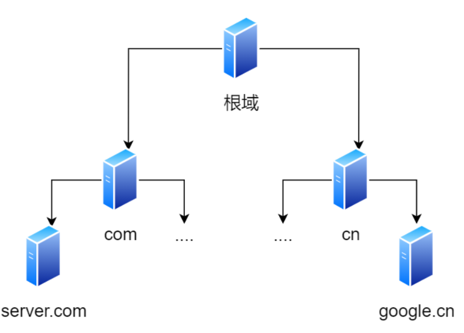

比如上图中`.com`就是顶级域，而`server.com`就是权威域，所谓权威域，就是域名由他做主

**根域的DNS服务器信息保存在互联网中任意一台的DNS服务器中，这样一来，任何的DNS服务器都能够找到并访问根域DNS服务器了**

因此，只要客户端能够找到任意的一台DNS服务器，他就能够找到根域，然后“顺藤摸瓜”找到位于下层的某台DNS服务器

==**域名的解析流程**==

在域名发往域名服务器之前，客户端首先会检查一下本地缓存中是否存在，依次检查浏览器缓存，操作系统缓存和本地的HOST文件，如果都没有，就会向DNS服务器进行查询，查询的过程如下：

1. 客户端首先会发出一个DNS请求，询问本地DNS服务器`www.server.com`的IP地址是啥

   > 本地DNS服务器指的是在物理地址上更靠近用户的DNS服务器（任意的一台DNS服务器上都有根域的信息），所以本地服务器叫做本地区DNS服务器更加契合 [本地dns服务器到底是什么？有没有精确的概念？ - 知乎 (zhihu.com)](https://www.zhihu.com/question/48085305)
   >
   > 本地DNS服务器地址是在客户端的 TCP/IP 设置中填写的 DNS 服务器地址

2. 本地域名服务器收到客户端的请求之后，如果缓存的表格中能够找到`www.server.com`的IP地址，那么就将这个IP地址返回给客户端，如果没有找到，本地域名服务器就会像根域发起请求
3. 根域接收到本地域名服务器发来的请求之后，会将顶级域名服务器的地址返回给本地域名服务器
4. 本地域名服务器收到顶级域名服务器的地址之后，就会向顶级域名服务器发起查询请求，然后顶级域名服务器将权威域名服务器的地址再返回给本地域名服务器
5. 本地域名服务器收到权威域名服务器的地址之后，就会向权威域名服务器发起查询请求，权威域名服务器查询之后就会将`www.server.com`对应的IP地址告诉本地DNS服务器
6. 本地DNS服务器再将IP地址返回给客户端，客户端和目标建立连接

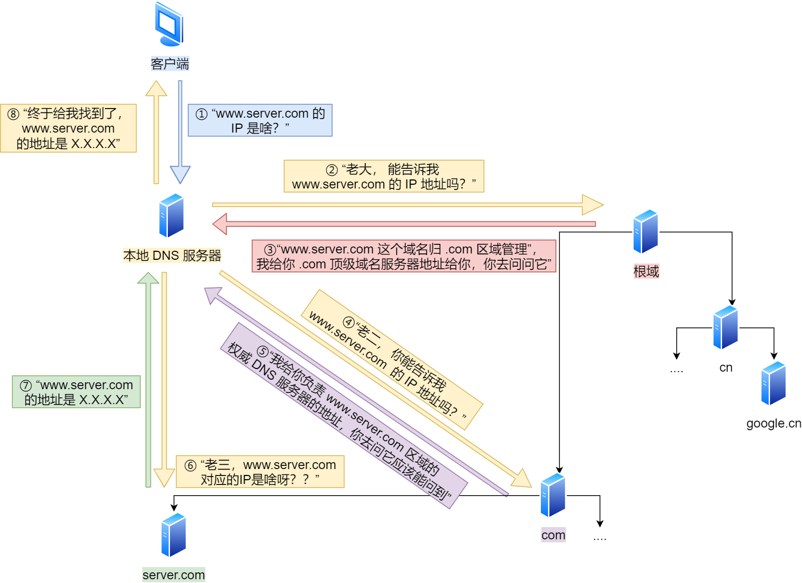

### ARP与RARP

> **ARP协议，Address Resolution Protocol，地址解析协议**

在传输一个IP数据报的时候，确定了源IP地址和目标IP地址之后，就会通过主机路由表确定下一跳的地址，但这也仅仅是知道了下一跳的地址，真正的传输还是需要网络层的下一层-数据链路层来完成，所以我们还需要知道下一层的MAC地址

由于主机路由表中可以找到下一跳的IP地址，所以可以通过ARP协议找到对应的MAC地址

**ARP是通过ARP请求和ARP响应两种类型的包来确定MAC地址的**

- **主机会通过广播发送ARP请求**，这个包中包含了想知道MAC地址的主机IP地址
- 当处于同一个链路中的设备收到这个ARP请求包之后，就会拆开这个请求包查看里面的内容，如果ARP请求包中的目标IP地址和自己的IP地址一致，那么这个设备就将自己的MAC地址塞入**ARP响应包**返回给主机

操作系统通常会把第一次通过ARP请求得到的MAC地址**缓存**起来，以便下次直接从缓存中查找IP地址对应的MAC地址。不过这个缓存是有一定期限的，超过这个期限，缓存的内容将被清除

> **RARP协议，Reverse Address Resolution Protocol，反向地址解析协议**

ARP协议是将IP地址转化成MAC地址，而RARP恰恰相反，他是把MAC地址转化成IP地址，对于一些无盘工作站通常会用到RARP协议

> 无盘工作站指的是将硬盘和主机分离的工作站，这个工作站只执行操作，不进行存储

使用RARP协议通常需要架设一台RARP服务器，在这个服务器上注册设备的MAC地址和IP地址，然后再将这个设备接入到网络中

- 主机会发送一条请求报文，报文中包含自己的MAC地址
- RARP服务器收到这条报文之后，会查询本地的注册表，找到之后将IP地址填入到响应报文中发送回去

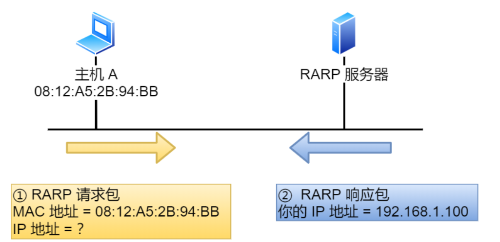

### DHCP

DHCP在我们生活中很常见，我们的电脑都是通过**DHCP来动态的获取IP地址**，省去了配置IP信息的繁琐过程

> **DHCP客户端监听的是68号端口，DHCP服务器监听的是67号端口**

DHCP的工作流程如下：

- 客户端首先发起**DHCP发现报文（DHCP DISCOVER）**的IP数据报，由于客户端没有IP地址，也不知道服务器的IP地址，所以它使用的是UDP广播通信，其使用广播目的地址是255.255.255.255（端口67），并使用0.0.0.0（端口68）来作为源IP地址，DHCP客户端没有将IP数据报传递给数据链路层，链路层然后将帧广播到所有的网络中设备
- DHCP服务器收到DHCP发现报文之后，用**DHCP提供报文（DHCP OFFER）**向客户端做出响应，该报文仍然使用IP广播地址`255.255.255.255`，该报文信息携带服务器提供可租约的IP地址、子网掩码、默认网关、DNS服务器以及IP地址租用期
- 客户端收到**一个或者多个**服务器的DHCP提供报文之后，从中选出一个，并向选中的服务器发送**DHCP请求报文（DHCP REQUEST）**进行响应，回显配置的参数
- 最后，服务器用**DHCP ACK报文**对DHCP请求报文进行响应，应答所要求的参数

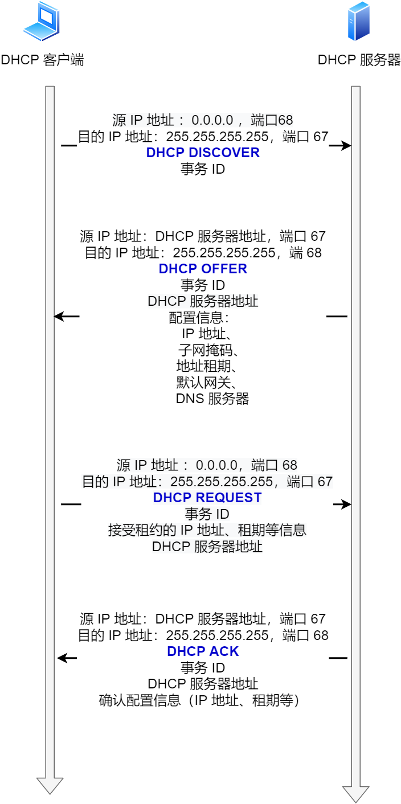

客户端一旦收到了DHCP ACK之后，交互便完成了，客户端能够在租用期内使用DHCP服务器分配的IP地址

如果租期的IP地址快过期了，客户端便会向DHCP服务器发送DHCP请求报文

- 如果服务器同意继续租用，则用DHCP ACK报文进行应答，客户端就会延长租期
- 如果服务器不同意继续租用，则会用DHCP NACK报文进行应答，客户端会在租约到期后停止使用这个IP地址

**可以发现，在DHCP交互的过程中，全程使用的都是UDP广播通信**

> 那这里就有了一个问题，我们知道通过广播数据报不能够穿透路由器，也就是路由器不转发广播数据包，如果DHCP服务器和客户端主机不再同一个局域网内，是不是每一个网络下都要配一个DHCP服务器？

为了解决上面的这个问题，就出现了**DHCP中继代理**，有了中继代理之后，**对不同网段的IP地址分配也可以由一个DHCP服务器来完成**

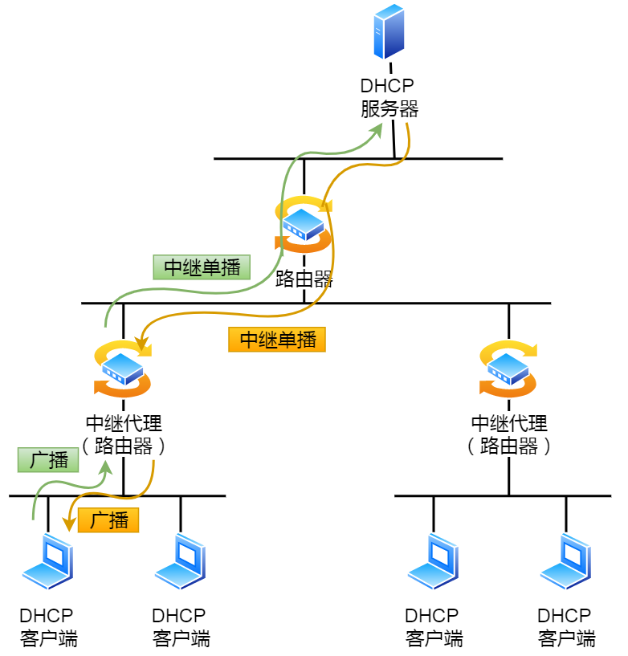

如上图所示

- DHCP客户端会先向DHCP中继代理发送DHCP请求包，而DHCP中继代理在收到这个广播包之后再以**单播**的形式发给DHCP服务器

- DHCP服务器收到这个广播包之后，再向DHCP中继代理返回应答，并由DHCP中继代理将此包广播给DHCP客户端

因此，**DHCP服务器即使和客户端不在同一条链路上也可以实现统一分配和管理IP地址**

### NAT

NAT的全称是Network Address Translation（网络地址转换）,NAT被提出的主要目的就是用来缓解IPv4地址被耗尽的速度。

简单的来说，NAT就是将同一个公司、家庭、教室内的主机对外部通信时，把私有IP地址转换成公有IP地址，如下图所示

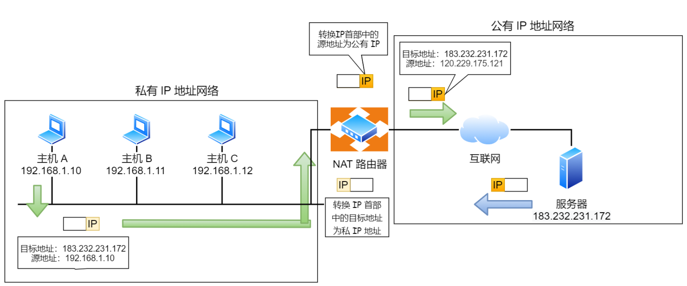

上图所示，如果把N个私有地址转化成N个共有地址，那么NAT的目的并没有达到，因此普通的NAT转化是没啥意义的

由于绝大多数的网络应用都是用传输层协议TCP或UDP来传输数据的，因此可以把IP地址 + 端口一起转换，这样就能够达到多个私有地址对应一个公有IP的目的，这种转化技术就叫做**NAPT技术（网络地址与端口转化）**

> 一般情况下问NAT，就是问的NAPT

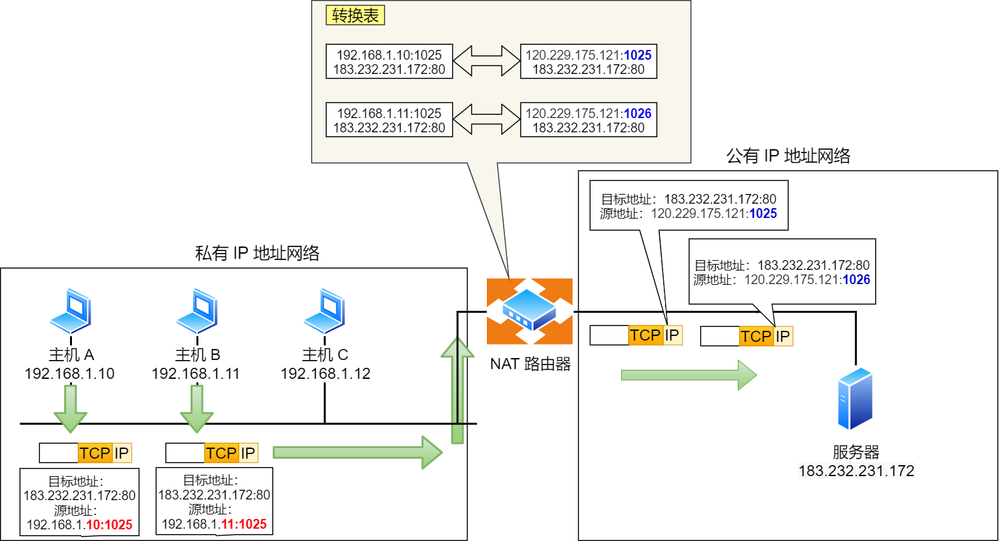

如上图所示，图中有两个客户端`192.168.1.10`和`192.168.1.11`同时和服务器`183.232.231.172`进行通信，并且这两个客户端的本地端口都是1025

此时，**两个私有IP地址都转换IP地址为公有地址`120.229.172.221`，但是以不同的端口号作为区分**

于是，就生成了一个**NAPT路由器转换表**，就可以正确地转化地址和端口的组合，令客户端A,B能够同时和服务器之间进行通信

**这个转化表在NAT路由器上自动生成**，比如在TCP的情况下，建立TCP连接首次握手时的SYN包一经发出，就会生成这个表，而后又随着收到关闭连接时发出的FIN包的确认应答从表中删除

NAT的优点不用多说，自然就是能够将多个私有地址映射到同一个公有IP地址上，这样能够大大缓解IPv4地址被耗尽的速度

NAT的缺点也有很多

- 转换表的生成和转换操作都会产生性能开销
- 通信过程中，如果NAT路由器重启了，所有的TCP连接都将被重置
- 外部无法与NAT路由器内部的服务器建立连接，因为NAPT/NAT转化表中没有这条记录（同时这也是一个优点，能够保证安全性）
- NAT的使用将IP从面向无连接变成了面向有链接，因为NAT转换表中维护了私有IP和公有IP以及端口之间的映射关系
- 同时NAT还违反了基本的网络分层结构模型的设计原则，因为在传统的网络分层结构模型中，第N层是不能够修改第N+1层的报头内容的，NAT破坏了这种各层独立的原则，**因为他需要修改TCP报文中的源端口**
- ...

此外，解决NAT缺点最好的方法就是使用**IPv6**，IPv6能够包含的地址很多，不需要进行地址转换，也就没有这些缺点了，但是IPv6的普及需要时间；此外，还可以通过**NAT穿透技术**来降低NAT设备的压力，我们知道转换表的生成和维护都是由NAT路由器来自动完成的，如果使用了NAT穿透技术，客户端会主动从NAT设备上获取公有IP地址，然后自己建立端口映射条目，然后使用这个条目对外通信，这样就不需要NAT路由器来进行转换了

>[网络地址转换协议NAT功能详解及NAT基础知识介绍 - 知乎 (zhihu.com)](https://zhuanlan.zhihu.com/p/26992935)

### ICMP

ICMP协议的全称是Internet Controll Message Protocol（互联网控制报文协议）

**ICMP协议的主要功能就是：确认IP包是否成功送达目标地址，报告发送过程中IP包被废弃的主要原因和改善网络设置等**

**如果在IP通信中某个IP包未能到达目标主机，那么这个具体的原因将由ICMP负责通知**

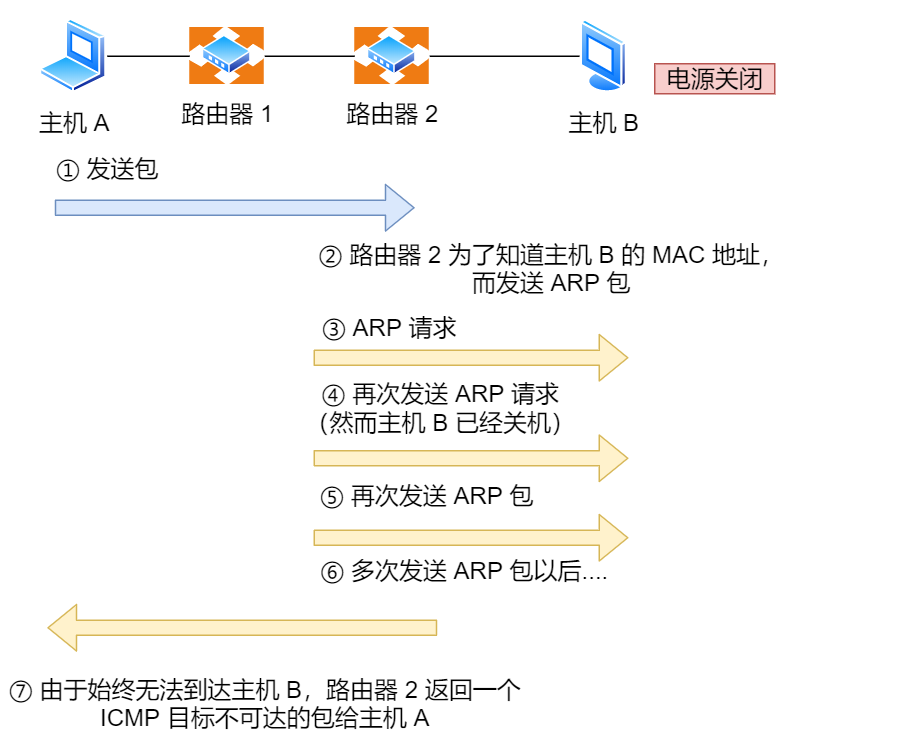

如上图所示的例子，主机A向主机B发送了数据包，由于某种原因，路由器2不能找到主机B的存在，这时，路由器2就会向主机A发送一个ICMP目标不可达数据包，说明发往主机B的包未能成功

ICMP的这种通知消息会使用IP进行发送，所以从路由器2返回的ICMP数据包会按照往常的路由控制先经过路由器1，再转发到主机A上，收到该ICMP包的主机A则分解ICMP的首部和数据域以后得知具体发生问题的原因

> **ICMP的类型**

ICMP大致上可以分成两大类：

- 一类是用于诊断的查询消息，也就是**查询报文类型**
- 一类是用于通知出错原因的错误消息，也就是**差错报文类型**

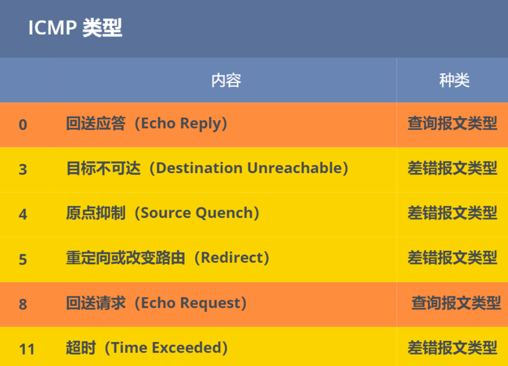

### IGMP

IGMP和ICMP一点关系也没有

IGMP的全称是Internet Group Management Protocol（因特网组管理协议），该协议运行在主机和组播路由器（最后一跳路由）之间（下图的蓝色部分），共有三个版本分别是IGMP v1，IGMP v2，IGMP v3

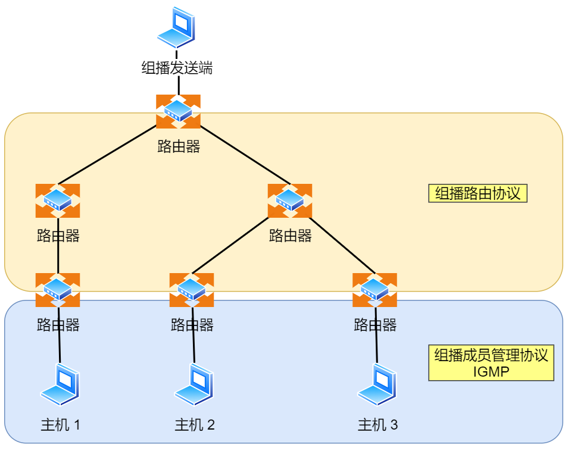

前面我们知道了D类地址是被用来当作组播地址，既然是组播，也就是只能够是特定组内的主机能够接收到数据报，不在同一组内的主机收不到数据报，怎么**管理是否在一组的呢？这就需要IGMP协议了**

- 主机通过IGMP报文向路由器申请加入或者退出组播组，默认情况下路由器是不会转发组播包到主机的，除非主机通过IGMP加入到组播组中，路由器就会记录IGMP路由器表，路由器后续就会转发组播包到对应的主机了
- IGMP报文采用IP封装，IP头部的协议号是2，而且TTL通常设置为1，因为IGMP是工作在主机和连接的路由器之间的（只需要1跳）

> IGMP的工作机制

以IGMP v2作为例子，说说**常规查询与响应**和**离开组播组**这两个工作机制

> 常规查询和响应

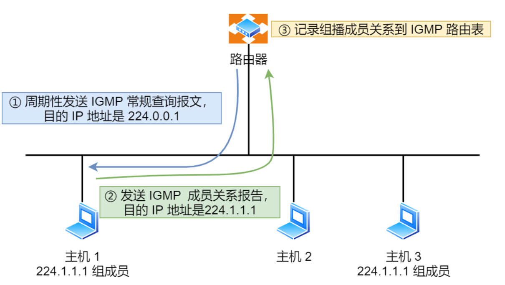

- 路由器会周期性地发送目的地址为`224.0.0.1`（表示同一网段内所有的主机和路由器）**IGMP常规查询报文**
- 主机1和主机3收到这个查询，随后会启动报告延迟计时器，计时器的时间是随机的，通常是0~10秒，计时器超时后主机就会发送**IGMP成员关系报文**（源IP地址是自己的IP地址，目标IP地址是组播地址）。如果在定时器超时之前，收到同一个组内的其他主机发送的成员关系报告报文，则自己不在发送，这样可以减少网络中多余的IGMP报文数量
- 路由器收到主机的成员关系报告之后，就会在IGMP路由表中加入该组播组，后续网络中一旦该组播地址的数据到达路由器，他会把数据报转发出去

> 离开组播组的工作机制

离开组播组分成了两种情况，一个情况是主机离开组播组之后，组播组中还有其他主机，另一种情况是主机离开之后，没有其他主机了

我们先来看第一种情况，主机离开组播组之后还有其他的主机

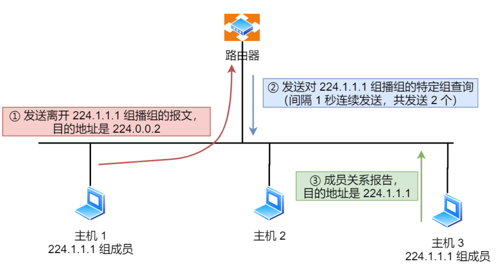

- 主机1要离开组224.1.1.1，**发送IGMPv2离组报文**，报文的目的地址是224.0.0.2（表示发向网段内的所有路由器）
- 路由器收到该报文以后，以1秒为间隔连续发送IGMP特定组查询报文（共计2个），以便确认网络中是否还存在224.1.1.1组的其他成员
- 主机3仍然是组224.1.1.1的成员，因此它会立即响应这个特定组的查询，那么路由器就能够知道该网络中仍然存在该组播组的成员，于是继续向该网络转发224.1.1.1的组播数据包

第二种情况是，主机离开组播组之后，组播组中没有其他主机了

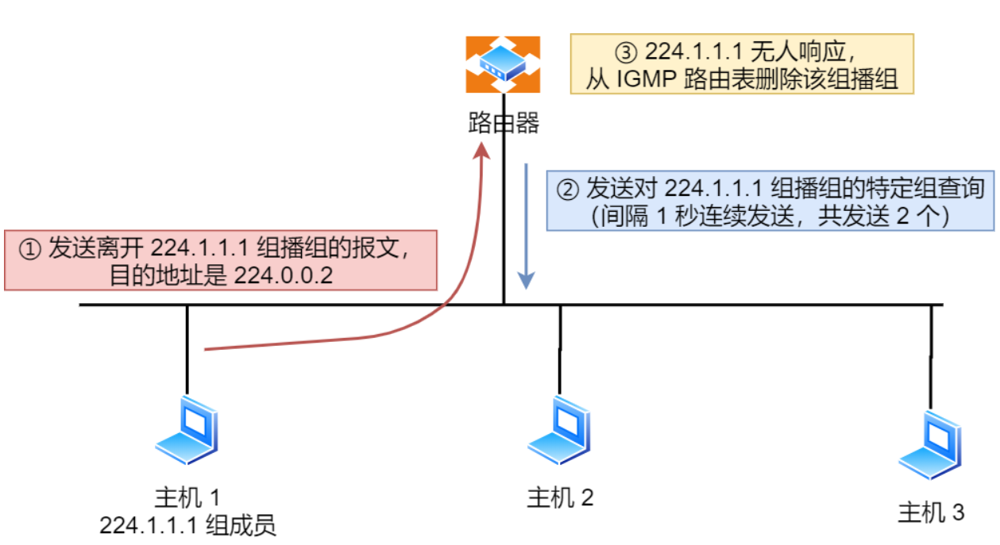

- 主机 1 要离开组播组 224.1.1.1，发送 IGMP 离组报文
- 路由器收到该报文后，以 1 秒为间隔连续发送 IGMP 特定组查询报文（共计发送 2 个）。此时在该网段内，组 224.1.1.1 已经没有其他成员了，因此没有主机响应这个查询
- 一定时间后，路由器认为该网段中已经没有 224.1.1.1 组播组成员了，将不会再向这个网段转发该组播地址的数据包

