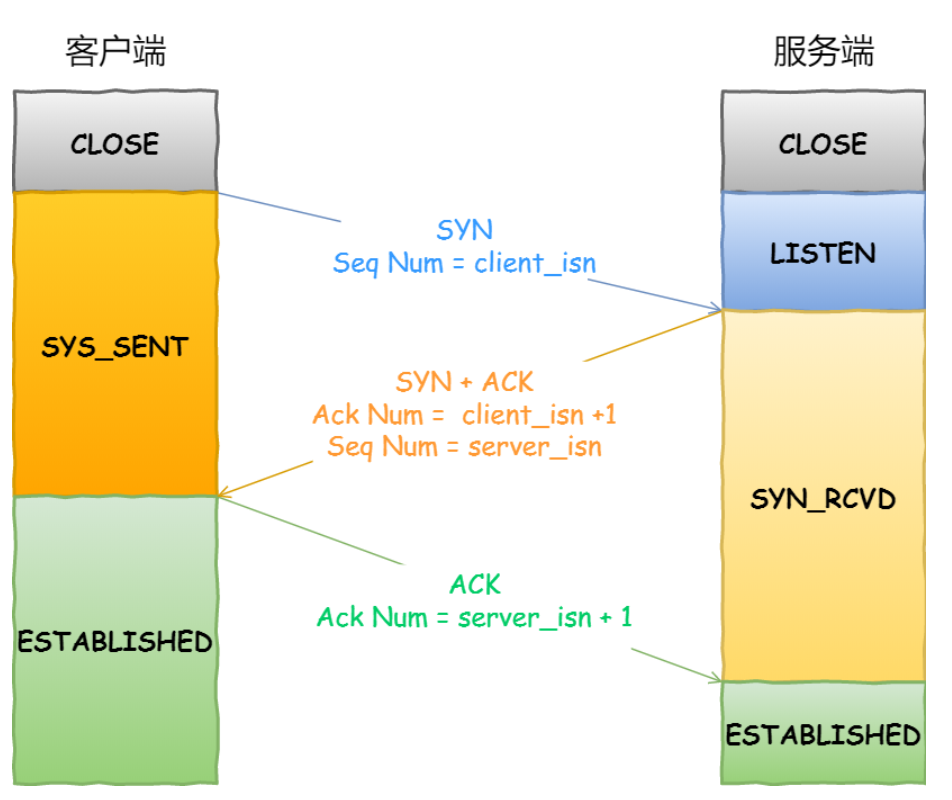

## ping的工作原理

写在最前面，**ping是基于ICMP协议工作的**，所以在具体讲解ping过程之前我们先来复习一下ICMP协议

### ICMP协议

#### ICMP概念

ICMP协议又叫互联网控制报文协议，重点就在“控制”两个字，ICMP协议报文有两种类型，分别是查询报文类型和差错报文类型，因为网络环境错综复杂，所以发出去的网络包不一定能够到达目的地，而**ICMP的功能就是确认IP包是否成功送达到目标地址，向主机报告错误原因，改善网络设置等**

在IP通信中，如果某个IP包由于某种原因没能达到目标地址，那么这个具体的原因将由ICMP报告

**ICMP报文是封装在IP包里面的**，它工作在网络层，ICMP是IP协议的助手

在前面我们只复习了ICMP中有两个数据类型，但是却没有对这两种数据类型进行详细的介绍

如上图所示，ICMP中的数据类型分为查询报文类型和错误报文类型，查询报文类型主要是回送消息，类型0和8；差错报文类型主要包含了目标不可达（3），原点抑制（类型4），重定向消息（类型5），超时消息（类型11），下面我们就来分别解释一下这几种报文类型

#### ICMP类型

> 首先是查询报文类型

上面说了主要是回送请求（类型8）和回送应答（类型0）两种查询报文类型

**回送消息用于进行通信的主机和路由器之间，判断所发送的数据包是否已经成功到达对端的一种消息，ping命令就是根据这种消息实现的**

可以向对端主机发送回送请求的消息（类型8），也可以接收对端主机发回来的回送应答的消息（类型0）

相比于原生的ICMP报文内容，这里多个两个字段

- **标识符**，用于区别是哪个应用程序发送的ICMP包，比如用进程ID作为标识符
- **序号**，序列号从0开始，每发送一次新的回送请求就会加1，可以用来确认网络包中是否有丢失

**在选项数据中，ping还会存放发送请求的时间值，来计算往返时间，说明路程的长短**

> 然后是差错报文类型

- 首先是目标不可达消息（类型3），表示的是IP路由器无法将IP数据包发送给目标主机，然后路由器就会返回给发送主机一个目标不可达的ICMP消息，并在这个消息中显示不可达的具体原因，**原因记录在ICMP包头的代码字段**

  

  - 网络不可达（代码0），在路由器的路由表中匹配不到接收方IP的网络号
  - 主机不可达（代码1），当路由器表中没有该主机的信息，或者该主机没有连接到网络上时，会通过ICMP协议以主机不可达的原因告诉发送主机
  - 协议不可达（代码2），当主机使用TCP协议访问对端主机时，能够找到对端主机，但是对端主机防火墙已经禁止TCP协议访问了，那么会通过ICMP协议以协议不可达的原因告知主机
  - 端口不可达（代码3），当主机访问的是对端主机的8080端口，这次能够找到主机而且防火墙也没有限制，可以发现对端主机没有进程监听8080端口，那么会通过ICMP协议以端口不可达的原因告知主机
  - 需要进行分片但是设置了不分片（代码4），发送端主机发送IP数据报的时候，将IP首部的分片禁止位设置为1，根据这个标志位，图中的路由器遇到超过MTU大小的数据包时，不会进行分片，而是会直接丢弃，随后通过一个ICMP的消息不可达类型通知发送方主机

- 第二是原点抑制消息（类型4），在使用低速广域线路的情况下，连接WAN口的路由器可能会遇到网络拥堵的问题，**ICMP原点抑制消息的目的就是为了缓和这种拥堵情况**

  当路由器向低速广域线路发送数据的时候，其发送队列的缓存变成了0而无法发送，可以向IP包的源地址发送一个ICMP原点抑制消息，收到这消息的主机能够了解到网络线路中的某个地方发生了拥堵，因此他会延长IP包的发送间隔，从而减少网络拥堵的情况。

  然而，由于这种ICMP可能会引起不公平的网络通信，所以一般不被使用

- 第三是重定向消息（类型5），如果路由器发现主机并不是通过最优路径发送数据，那么路由器会向主机响应一个ICMP重定向消息，在这个消息里面包含了最合适的路由信息和源数据，这主要发生在路由器持有更好的路由信息的情况下。路由器会通过这样的 ICMP 消息告知发送端，让它下次发给另外⼀个路由器

- 最后是超时消息（类型11），IP包中有一个字段是TTL（Time To Live），它的值随着每经过一次路由器就会减1，直到减到0的时候该IP包会被丢弃，此时路由器会发送一个ICMP超时信息给发送端主机，并通知发送端主机该包已经被丢弃了

  **设置IP包生存周期的主要目的是为了在路由控制遇到问题发生循环状况的时候，避免IP包无休止的在网络上转发**

  

### ==ping原理（ping其实就是查询类型报文的应用）==

ping实际上就是使用了ICMP中的查询报文类型

> 我们这里使用在同一个局域网下的两台主机为例，主机Aping主机B之后会发生什么？

ping命令执行的时候，**源主机首先会构建一个ICMP回送请求消息数据包**，ICMP数据包内包含多个字段，最重要的两个是：

- 第一个是类型，对于回送请求消息而言该字段为8
- 第二个是序号，主要用于区分连续ping时发出的多个数据包

每发送一个请求数据包，序号会自动加1，为了能够计算往返时间RTT，他会在报文的数据部分插入发送时间

然后，由ICMP协议将这个数据包连同IP地址192.168.1.1一起发送给IP层，IP层将以192.168.1.1作为源IP地址，192.168.1.2作为目标IP地址，将协议字段设置为1（表示ICMP协议），再加上一些控制字段，构成IP数据包

接下来，需要加入MAC头，如果能够在本地的ARP映射表中找到192.168.1.2的MAC地址，则可以直接使用，如果没有，则需要发送ARP协议查询MAC地址，获得MAC地址后，由数据链路层构建一个数据帧，目的地址是IP层传过来的MAC地址，源地址是本地的MAC地址，还要附加上一些控制信息，依据以太网的介质访问规则，将他们传送出去

主机B接受到上图所示数据帧后，先检查它的MAC地址，看看是否和自己的MAC地址一致，如果不一致则丢弃这个数据包，一致的话继续往下处理，将IP数据报从帧中提取出来，交给本机的IP层，同样IP层也要检查目标地址等，通过检查之后将有用的信息提取出来交给ICMP协议

主机B会构建一个ICMP回送响应消息数据报，类型为0，序号为收到的ICMP请求数据包中的序号，然后再通过相同的顺序发送回主机A

如果在规定时间内没有收到ICMP回送应答消息，则说明目标主机不可达，如果收到了应答包，则说明目标主机可达

此时，主机会检查，用当前时刻减去该数据包最初从源主机上发出的时刻，就是**ICMP数据包的时间延迟**

上述过程如下图所示

上述过程是最简单的，只是在同一个局域网里面的情况，如果跨网段，还会涉及到网关、路由器的转发等

但是对于ICMP头来说不会发生变化，影响的是根据目标IP地址选择路由的下一跳，还有每经过一个路由器到达一个新的局域网就会更换报文中的MAC地址

> 说了这么多，对于ping这个程序它使用的其实就是ICMP中的回送请求消息（类型8）和回送应答消息（类型0）

### traceroute差错类型报文的应用

在Unix和macos中有一款充分利用ICMP差错类型报文的应用叫做traceroute，在Windows中叫做tracert

traceroute主要有两个作用：

- **第一个作用是：通过设置特殊的TTL，来追踪去往目的地时沿途经过的路由器**

  这个作用实现的工作原理就是将IP包的TTL从1按照顺序递增的同时发送UDP包，强制接收ICMP超时信息的一种方法

  比如将TTL设置为1，遇到第一个路由器就牺牲了，返回路由器**返回差错类型报文信息，类型是超时信息（类型11）**

  将TTL设置为2，遇到第二个路由器会牺牲，返回第二个路由器返回差错类型报文信息，类型是超时信息（类型11）

  如此往复，也就能够到达目标主机，从而得到到目标主机路径上的全部路由信息了

  

  > 这里其实有一个问题，那就是如何知道已经到达了目标主机呢？

  traceroute在发送UDP包的时候，会填入一个不可能的端口号来作为UDP的目标端口号，当目标主机收到这个数据报后，会返回一个差错报文类型的消息，即端口不可达

  **所以当差错报文类型是端口不可达时，说明发送方发出的UDP包已经到达了目标主机**

  

- **第二个作用是：通过故意设置不分片，来确定路径的MTU**

  

  工作原理如上图所示：

  - 首先发送端主机在发送IP数据报的时候将IP包首部的分片禁止标志位设置为1，根据这个标志位，图中的路由器不会对大数据包进行分片，而是将包丢弃
  - 随后，路由器通过一个ICMP的不可达消息将数据链路上的MTU值一起发送给主机，不可达消息类型为需要分片但是设置了禁止分片位

  - 发送端主机每次收到ICMP差错类型报文的时候就会减少包的大小，以此定位一个合适的MTU值，以便能够到达目标主机

## 键入网址到网页显示，中间经历了哪些过程

在这一部分，先写总结，随后再总结每一步骤中的细节

1. 输入网址之后，浏览器首先做的工作就是**解析URL**
2. 解析成功之后，就是**生产HTTP请求信息**（HTTP报文）
3. 在请求信息发送之前，还需要**查找域名对应的IP地址**，这个工作由DNS来完成
4. 知道了目标主机的IP地址之后，先由**TCP发起三次握手，建立连接**，只有连接建立成功之后，才能够通过TCP传输数据
5. 数据包的发送过程是HTTP请求信息从网络协议栈中不断向下，**依次给数据包加上TCP头部，IP头部，Mac头部，然后通过网卡、交换机、路由器发送到目标主机（服务器）**
6. 服务器收到网络包之后也**按照网络协议栈从下到上依次处理，然后再将响应结果发送给客户端浏览器**
7. 浏览器收到响应结果之后，处理网络包，然后**把结果渲染出来**
8. 请求结束之后，通过**TCP四次挥手断开连接**

> 第一步，解析URL

> 第二步，生产HTTP请求

对URL解析成功之后，就获得了web服务器名和访问文件名称，接下来根据这些信息生成HTTP请求

> 第三步，将HTTP请求消息发送给传输层之前，需要先查询域名对应的IP地址

查找域名对应的IP地址首先要依次看浏览器缓存、本地缓存、本地host文件中是否有相关记录，如果有的话，不需要通过DNS服务器查询，如果没有的话，那么也要先去DNS本地服务器查询，如果DNS本地服务器中有缓存，那么也将IP地址直接返回给客户端，没有的话，则本地服务器依次访问根域、顶级域、权威域，最终权威域将域名对应的IP地址告诉本地DNS服务器，然后本地DNS服务器再通知客户端

> 第四步，将HTTP请求报文发送给传输层来进行处理（这里假设使用TCP来进行传输）

TCP中有很多重要的特性，比如TCP头部中的序号和确认应答号，序号是为了保证数据包的顺序发送，而确认应答号是为了保证TCP的可靠连接，保证数据包一定能够被对端收到。又比如流量控制和拥塞控制，流量控制通过滑动窗口来完成，窗口大小可以在TCP头部中指定，发送窗口的大小等于min{接收窗口，拥塞窗口}，流量控制的目的是为了让发送方能够根据接收方的接受能力尽可能多的发送数据包，而拥塞控制是为了让发送方根据当前网络状态发送数据包；再比如TCP中通过MSS进行分片，这样的话即使发生了丢包现象，也不用重传整个的数据包，只需要重传丢失的分片即可

使用TCP进行数据传输之前，首先需要TCP通过三次握手建立连接

三次握手的目的是为了保证连接正确建立，以及连接双方都具备接受和发送的能力

此时的网络包报文如下：（再HTTP请求数据的基础上加上了TCP头部）

> 第五步是将TCP头部 + HTTP请求数据这个数据包发送给网络层

因为是TCP传输，所以需要将IP头部的协议号字段填上06（十六进制）表示的是使用TCP传输，01表示的是ICMP协议

这里我们知道，一个客户端能够有多个网卡，这就意味着一个客户端有多个IP地址，那么选择哪个IP地址作为源地址呢？

上面的这个问题相当于判断使用哪块网卡来发送数据，我们首先可以使用`route -n`来查看客户端中网卡的信息

我们假设web服务器的IP地址是192.168.10.200

从上图中可以看到，第三个条目比较特殊，它的目标地址和子网掩码都是0.0.0.0，这表示默认网关，如果所有其他的条目都无法匹配的话，就会自动匹配这一行，并且把后续的包发给路由器，Gateway即是路由器的IP地址

至此，网络包如下所示

> 第7步，将网络包交给数据链路层，给网络包加上MAC头部

MAC头部的格式如下，发送方的MAC地址很好确定，设备出厂时MAC地址就被写入到了ROM中，而对于接收方的MAC地址我们可以使用ARP协议来获得，此外，我们不是每次都需要通过UDP广播来调用ARP协议获得MAC地址的，因为使用ARP协议后，会在本地留下缓存，我们可以通过`arp -a`命令来查看本地的arp缓存

上图中的协议类型一般就两种

- 0800，表示IP协议
- 0806，表示ARP协议

> 第8步，网络包经过协议栈的处理，发送到网卡

网络包存放在内存中只是一串串的二进制数字信息，没有办法直接发送给对方，因此我们需要将数字信息转换成电信号，才能够在网线上传输，也就是说这才是真正的数据发送过程

**执行上述操作的是网卡，而控制网卡还需要网卡驱动程序**

网卡驱动在IP模块中收到网络包之后，会将其复制到网卡内的缓冲区中，然后**在这个网络包的开头加上报头和起始帧分节符，在这个网络包的结尾加上用于监测错误的帧校验序列（FCS）**

最后，网卡会将网络包变为电信号，通过网线发送出去

> 第9步，通过交换机和路由器将数据包传输到目的地

**交换机的设计是将网络包原样地转发到目的地，交换机工作在MAC层，也成为二级网络设备**

电信号的数据包到达网线接口时，交换机开始接收数据，将电信号转换成数字信号，然后校验网络包末尾的FCS，通过的话则把这个网络包放到自己的缓冲区中，后面的工作方式就和网卡的工作方式不同了，交换机不会检查网络包中的MAC地址，因为**交换机的端口不具有MAC地址**

将包存入缓冲区后，接下来需要查询一下这个包的接收方MAC地址是否已经在MAC地址表中有记录了

交换机上的MAC地址表中主要有两个信息

- 一个是设备的MAC地址
- 另一个是该设备连接到交换机的哪个端口上

举个例⼦，如果收到的包的接收方MAC 地址为 00-02-B3-1C-9C-F9 ，则与图中表中的第 3 行匹配，根据端口列的信息，可知这个地址位于 3 号端口上，然后就可以通过交换电路将包发送到相应的端口了。 

**所以，交换机根据 MAC 地址表查找 MAC 地址，然后将信号发送到相应的端口**

加入MAC地址表中找不到相应的MAC地址，怎么办呢？

如果在MAC地址表中找不到相应的MAC地址，可能是因为具备该MAC地址的设备还没有向该交换机发送过数据，或者该设备一段时间内没有工作导致地址从地址表中删除了

这种情况下，交换机没法判断将数据包发送给哪个端口，因此它只能够**把数据包发送给除了源端口以外的其他全部端口**，无论这个设备连接到哪个端口上都可以收到这个数据包了，这样的做法没有问题，**因为以太网的设计本来就是将网络包发送到整个网络上的，然后只有相应的接收者才可以接受包，其他设备则会忽略这个包**

那么有没有可能导致网络阻塞呢？

影响不大，局域网中每秒钟会发送上千个网络包，多出几个网络包问题不大，而且只要目标设备返回了响应包之后，它的MAC地址就会被写入到MAC地址表中了，下一次也就不会再把包发送到全部端口了

网络包经过交换机之后，会进入到路由器，然后由路由器将网络包转发至下一个路由器或者目标设备中

**路由器和交换机的工作原理类似，都是通过查表判断网络包的转发目标**

**但是路由器和交换机也有区别：**

- 路由器是基于IP设计的，俗称三级网络设备，路由器的各个端口都有IP地址和MAC地址
- 交换机是基于以太网设计的，俗称二级网络设备。交换机的各个端口都没有MAC地址

路由器的工作方式和交换机类似，都是收到网络包之后，先检查网络包末尾的帧校验序列，不同的是，路由器还需要检查网络包的MAC地址，都通过校验之后才将网络包放入到自己的缓冲区中。

完成包的接受操作后，路由器就会将网络包的MAC地址丢弃掉，因为当前网络包的MAC头部的作用就是将该网络包转发到该路由器上，现在它的任务完成了，所以就会把这个MAC头部给去掉

然后通过查询路由表中的IP地址，来确定网络的下一跳地址，路由表如下所示：

确定了下一跳的目标地址之后，就会进入网络包的发送操作，首先要根据网关列来判断对方的地址：

- 如果网关列是一个IP地址，则说明还没有到达终点
- 如果网关列是为空，则说明已经到达终点了

直到IP地址后，需要获得MAC地址，这里就不多过赘述了...，然后再给网络包加上MAC头部

网络包加工完成之后，会转换成电信号并通过端口转发出去，**发出去的网络包会通过交换机到达下一个路由器**，由于接收方的MAC地址就是下一个路由器的地址，所以交换机会根据这一地址将包传输到下一个路由器

> 在网络包传输的过程中，源 IP 和⽬标 IP 始终是不会变的，⼀直变化的是 MAC 地址，因为需 要 MAC 地址在以太⽹内进⾏两个设备之间的包传输

其实现在的路由器本身就已经携带了交换机的功能了

