## Java内存区域详解

如果没有特殊说明，，Java内存管理这一部分说的都是`HotSpot`虚拟机

>SUN的JDK版本从1.3.1开始运用`HotSpot`虚拟机， 2006年底开源，主要使用C++实现，JNI接口部分用C实现。
>
>`HotSpot`是较新的Java虚拟机，用来代替`JIT(Just in Time)`，可以大大提高Java运行的性能。
>
>Java原先是把源代码编译为字节码在虚拟机执行，这样执行速度较慢。而`HotSpot`将常用的部分代码编译为本地(原生，native)代码，这样显着提高了性能。 `HotSpot` JVM 参数可以分为规则参数(standard options)和非规则参数(non-standard options)。


### 基本问题

- **介绍下 Java 内存区域（运行时数据区）**
- **Java 对象的创建过程（五步，建议能默写出来并且要知道每一步虚拟机做了什么）**
- **对象的访问定位的两种方式（句柄和直接指针两种方式）**

### 拓展问题

- **String 类和常量池**
- **8 种基本类型的包装类和常量池**


### Java内存区域（运行时内存区域）

Java虚拟机在运行Java程序的时候会把它管理的内存划分成若干个不同的数据区域，Java1.8和之前的版本略有不同

**Java1.8之前的版本**


**Java1.8**


**<font color=red>可以看到，线程私有的内存空间是：程序计数器、本地方法栈、虚拟机栈</font>**

下面将分别介绍线程的私有内存空间、堆空间、方法区、运行时常量池和直接内存（元空间使用的就是直接内存）


#### 程序计数器

程序计数器是一块比较小的内存空间，可以看作是当前线程所执行的字节码的行号指示器，**字节码解释器工作时就是通过修改程序计数器的值来选取下一条需要执行的字节码所在的地址，分支、循环、跳转、异常处理、线程恢复等功能都需要依赖这个计数器来执行**

> 为什么程序计数器必须是线程私有的呢？
>
> 这是为了线程发生切换之后能够恢复到切换之前的正确位置继续执行，所以每条线程都需要有自己的程序计数器，各个线程之间的程序计数器独立存储，互不影响，因此我们称这类存储区域为线程私有的内存

从上面的介绍中我们知道了<font color=red>程序计数器总共有两个作用</font>

- **字节码解释器通过改变程序计数器来依次读取指令，从而实现代码的流程控制**，如：顺序执行、选择、循环、异常处理
- **在多线程的情况下，程序计数器用于记录当前线程执行的位置，从而当线程被切换回来的时候能够知道上次切换之前运行到哪里了，继续执行**


> 还有一点值得注意的是：程序计数器是唯一一个不会出现`OutOfMemoryError`的内存区域，它的生命周期随着线程的创建而创建，线程的消亡而消亡


#### Java虚拟机栈

**与程序计数器一样，Java虚拟机栈也是通过也是线程私有的，它的生命周期和线程一致，描述的是Java方法执行的内存模型，每次方法调用的数据都是通过栈传递的**

<font color=red>Java内存可以粗略的分为栈内存和堆内存，其中的栈就是指的现在所说的Java虚拟机栈，或者说是虚拟机栈中局部变量表部分（实际上，Java虚拟机栈是由一个个栈帧组成，而每个栈帧中都拥有：局部变量表、操作数栈、动态链接、方法出口信息）</font>

**局部变量表中主要存放了编译期可知的各种数据类型**（8大基本数据类型：`int,float,double,long,short,byte,char,boolean`）**和对象引用**（reference类型，它不同于对象本身，可能是一个指向对象起始地址的引用指针，也可能是指向一个代表对象的句柄或其他与此对象相关的位置）

Java虚拟机栈中会出现两种错误：`OutOfMemoryError`和`StackOverFlowError`

- **`StackOverFlowError`：**若Java虚拟机栈的内存大小不允许动态扩展，那么当线程的请求栈的深度超过当前Java虚拟机栈的最大深度的时候，就会抛出`StackOverFlowError`的错误
- **`OutOfMemoryError`：**Java虚拟机栈的内存可以动态扩展，如果虚拟机在动态扩展栈时无法申请到足够的内存空间，则抛出`OutOfMemoryError`错误

> 注意，在HotSpot虚拟机中是不允许Java虚拟机栈动态扩展的，除了线程最开始申请栈空间时失败，否则在HotSpot中是不会出现`OutOfMemoryError`错误的


**问题：方法/函数是如何调用虚拟机栈中的内容的？**

Java栈可以类比数据结构中的栈，Java栈中保存的内容主要是栈帧，每一次函数调用都会有一个栈帧被压入虚拟机栈，每一个函数调用结束之后，都会有一个栈帧被弹出

Java方法有两种返回方式：

- return语句
- 抛出异常

不管哪种返回方式都会使得栈帧被弹出


#### 本地方法栈

本地方法栈和Java虚拟机栈的作用非常相似，他们两个的区别在于

- 虚拟机栈为虚拟机执行Java方法（字节码）服务
- 本地方法栈为虚拟机使用到的Native方法服务

> 因为HotSpot中是先把常用到的部分代码编译到本地（Native），所以在HotSpot中本地方法栈和Java虚拟机栈合二为一了

本地方法被执行的时候，在本地方法栈中会创建一个栈帧，栈帧中包含了局部变量表、操作数栈、动态链接、出口信息

方法执行完毕之后相应的栈帧也会被弹出栈并释放内存空间，也会出现`StackOverFlowError`和`OutOfMemoryError`两种错误


#### 堆内存

Java虚拟机所管理的内存中最大的一块，Java堆是所有线程共享的一块内存区域，在虚拟机启动时创建，**此内存区域的唯一目的就是存放对象实例，几乎所有的对象实例以及数组都会在这里分配内存**

> Java 世界中“几乎”所有的对象都在堆中分配，但是，随着 JIT 编译器的发展与**逃逸分析技术**逐渐成熟，栈上分配、标量替换优化技术将会导致一些微妙的变化，所有的对象都分配到堆上也渐渐变得不那么“绝对”了。从 JDK 1.7 开始已经默认开启逃逸分析，如果某些方法中的对象引用没有被返回或者未被外面使用（也就是未逃逸出去），那么对象可以直接在栈上分配内存。 
>
> 在这里未逃逸出去的变量我感觉就是局部变量，我们在“对象及其内存管理”那一章中就已经知道了局部变量只会被放到栈空间中

Java的堆内存是垃圾收集器管理的主要区域，因此堆内存也被称作**GC堆（Garbage Collected Heap）**，从垃圾回收的角度，由于现在收集器基本都采用**分代垃圾收集算法**，所以**Java堆还可以细分为：新生代和老年代，**更具体一些是：Eden空间、From Survivor、To Survivor空间等，**进一步划分的目的是为了更好地回收内存，或者更快地分配内存**


事实上，在Java7及之前版本中，Java堆空间分成了三个部分：新生代、老年代和永生代，如下图所示

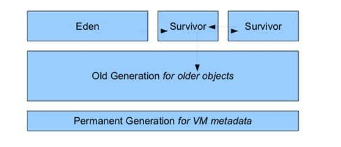

Java8版本之后方法区被彻底删除了（HotSpot中的永生代也被删除了），取而代之的是元空间，元空间使用的是直接内存

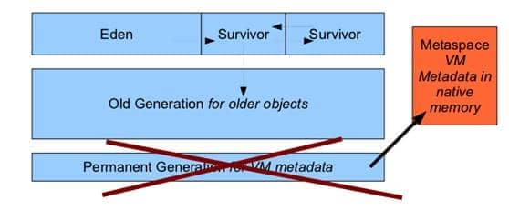

**上图所示的Eden区、两个Survivor区都是属于新生代（为了便于区别，这两个Survivor区域按照顺序被命名为From Survivor和To Survivor），中间一层是老年代**

大部分情况，对象都会首先在 Eden 区域分配，在一次新生代垃圾回收后，如果对象还存活，则会进入 s0 或者 s1，并且对象的年龄还会加 1(Eden 区->Survivor 区后对象的初始年龄变为 1)，当它的年龄增加到一定程度（默认为 15 岁），就会被晋升到老年代中。对象晋升到老年代的年龄阈值，可以通过参数 `-XX:MaxTenuringThreshold` 来设置。

> “Hotspot 遍历所有对象时，按照年龄从小到大对其所占用的大小进行累积，当累积的某个年龄大小超过了 survivor 区的一半时，取这个年龄和 MaxTenuringThreshold 中更小的一个值，作为新的晋升年龄阈值”。


**堆空间这里最容易出现的错误就是`OutOfMemoryError`错误，**并且出现这种错误之后的表现形式还会有几种，比如：

1. `java.lang.OutOfMemroyError: GC Overhead Limit Exceeded`：当JVM花了太多的时间执行垃圾回收并且只能回收很少的堆空间时，就会发生此错误
2. `java.lang.OutOfMemoryError: Java heap space`：加入在创建新的对象时，堆内存中的空间不足以存放新创建的对象，就会引发此错误


#### 方法区

**方法区**和Java堆一样，是各个线程共享的内存区域，它**用于存储已被虚拟机加载**的类信息、常量、静态变量等、即时编译器编译后的代码等**数据**，因此**方法区也被称为永久代，**虽然Java虚拟机规范把方法区描述为堆的一个逻辑部分，但是它却有一个别名叫做**`Non-Heap(非堆)`**，目的应该是和Java堆区分开来

Java8之前永久代还没有被完全移除的时候，通常通过下面这些参数来调节方法区的大小

```java
-XX:PermSize=N //方法区 (永久代) 初始大小
-XX:MaxPermSize=N //方法区 (永久代) 最大大小,超过这个值将会抛出 OutOfMemoryError 异常:java.lang.OutOfMemoryError: PermGen
```


> 方法区和永久代的关系如下：
>
> 方法区和永久代的关系很像Java中接口和类的关系，类实现了接口，而**永久代就是HotSpot虚拟机对虚拟机规范中方法区的一种实现**。也就是说，永久代是HotSpot虚拟机中的概念，永久代是一种实现，而方法区是Java虚拟机规范中的概念，是一种规范

**相对而言，GC在这个空间区域中是较少出现的，但并非数据进入方法区之后就“永久存在”了**

Java8之后，方法区（HotSpot的永久代）就被彻底移除了，取而代之的是元空间，元空间使用的是直接内存

元空间中的一些常用参数

```c
-XX:MetaspaceSize=N 		//设置 Metaspace 的初始（和最小大小）
-XX:MaxMetaspaceSize=N 		//设置 Metaspace 的最大大小
```

**为什么要使用元空间（MetaSpace）代替永久代（PermGen）呢**

1. 整个永久代有一个JVM本身设置的固定大小上限，无法进行调整，而元空间使用的是直接内存，受本机可用内存的限制，虽然元空间仍然有可能溢出，但是比原来出现的几率会更小

   > 当元空间溢出时会得到如下错误： `java.lang.OutOfMemoryError: MetaSpace` 

2. 元空间里面存放的是类的元数据，这样加载多少类的元数据就不由`MaxPermSize`控制了，而由系统的实际可用空间来控制，这样能加载的类就更多了

3. 在JDK8中，合并`HotSpot`和`JRockit`的代码时，`JRockit`从来没有一个叫做永生代的东西，合并之后就没有必要额外设置这么一个永久代的地方了


#### 运行时常量池

运行时常量池是方法区的一部分，Class文件中除了有类的版本、字段、方法、接口等描述信息外，还有常量池表示（用于存放编译器生成的各种字面量和符号引用）

即然运行时常量池是方法区的一部分，自然受到方法区内存的限制，当常量池无法再申请到内存时会抛出`OutOfMemoryError`错误

- Java1.7之前运行时常量池逻辑包含字符串常量池存放在方法区，此时HotSpot虚拟机对方法区的实现成为永久代
- Java1.7字符串常量池被从方法区拿到了堆中，这里没有提高运行时常量池，也就是说除了字符串常量池被单独拿到堆，运行时常量池剩下的东西还在方法区，也就是HotSpot中的永久代
- Java1.8HotSpot移除了永久代，用元空间取而代之，这时候字符串常量池还在堆中，运行时常量池还在方法区中，只不过方法区的实现由永久代变成了元空间


#### 直接内存

**直接内存并不是虚拟机运行时数据区的一部分，也不是虚拟机规范中定义的内存区域，但是这部分内存也被频繁地使用。而且也可能导致 OutOfMemoryError 错误出现。**

JDK1.4 中新加入的 **NIO(New Input/Output) 类**，引入了一种基于**通道（Channel）与缓存区（Buffer）的 I/O 方式，它可以直接使用 Native 函数库直接分配堆外内存，然后通过一个存储在 Java 堆中的 DirectByteBuffer 对象作为这块内存的引用进行操作。这样就能在一些场景中显著提高性能，因为避免了在 Java 堆和 Native 堆之间来回复制数据**。

本机直接内存的分配不会受到 Java 堆的限制，但是，既然是内存就会受到本机总内存大小以及处理器寻址空间的限制。


### HotSpot虚拟机对象

#### 对象的创建

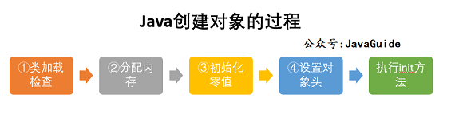

- **类加载检查，**虚拟机在遇到一条new指令时，首先会去检查这个指令的参数能否在常量池中定位到这个类的符号引用，并且检查这个符号引用代表的类是否已经被加载过、解析过和初始化过。如果没有，那必须先执行相应的类加载过程

- **分配内存，**在类加载检查通过后，接下来虚拟机将为新生对象分配内存空间，**对象所需的内存大小在类加载完成后便可以确定**，为对象分配空间的任务等同于**把一块确定大小的内存从Java堆中划分出来**，**分配方式有“指针碰撞”和“空闲列表”两种，选择哪种分配方式是根据堆内存空间是否规整决定的，而堆内存空间是否规整又是由垃圾收集器是否带有压缩整理功能决定**

  > **<font color=red>内存分配的两种方式</font>**

  选择指针碰撞还是空闲列表是由堆内存空间是否规整决定的，而堆内存空间是否规整，取决于垃圾收集器的算法是“标记-清除”还是“标记-整理（也称作标记-压缩）”

  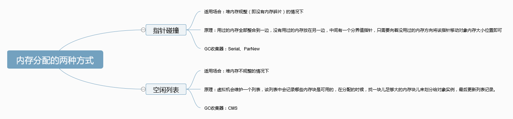

  > **<font color=red>内存分配并发问题</font>**

  在创建对象时有一个很重要的问题就是线程安全，因为在实际开发过程中，创建对象是一件很频繁的事情，作为虚拟机来说，必须要保证线程是安全的，通常来讲，虚拟机采用两种方式来保证线程安全

  - **CAS + 失败重试：**CAS 是乐观锁的一种实现方式。所谓乐观锁就是，每次不加锁而是假设没有冲突而去完成某项操作，如果因为冲突失败就重试，直到成功为止。**虚拟机采用 CAS 配上失败重试的方式保证更新操作的原子性。**
  - **TLAB：**为每个线程预先在Eden区分配一块内存，JVM在给线程中的对象分配内存时，首先在TLAB分配，当对象大于TLAB中剩余内存或者TLAB的内存已经用尽时，再采用上述的CAS进行内存分配

- **初始化零值，**内存分配完成之后，虚拟机需要将分配到的内存空间都初始化为零值（不包括对象头），这一步操作保证了对象的实例字段在Java代码中可以不赋初始值就直接使用，程序能访问到这些字段的数据类型的零值（默认值）

- **设置对象头，**初始化零值完成之后，**虚拟机要对对象进行必要的设置**，例如这个对象是哪个类的实例、如何才能找到类的的元数据信息、对象的哈希码、对象的GC分代年龄等信息，**这些信息放在对象头中**，另外，根据虚拟机当前运行状态的不同，如是否启用偏向锁等，对象头会有不同的设置方式

- **执行init方法，**上面的4步工作都完成以后，从虚拟机的视角来看，一个新的对象已经产生，但是从Java程序的视角来看，对象创建才刚开始，`<init>`方法还没有执行，所有的字段都还是零值，所以一般来说，执行完`new`指令之后会接着执行`init`方法，把对象按照程序员的意愿进行初始化，这样一个真正可用的对象才算完全产生出来


#### 对象的内存布局

在HotSpot虚拟机中，对象在内存中的布局可以分成三块区域：**对象头、实例数据和对齐填充**

HotSpot虚拟机的对象头包括两部分信息，**第一部分是用来存储对象的自身运行时数据**（哈希码、GC分代年龄、锁状态标志等），**另一部分是类型指针**，即对象指向它的类元数据的指针，虚拟机通过这个指针来确定这个对象是哪个类的实例

**实例数据部分是对象真正存储的有效信息**，也是在程序中所定义的各种类型的字段内容

**对齐填充部分不是必然存在的，也没有什么特殊的含义，仅仅是起到占位的作用**，因为HotSpot虚拟机的自动内存管理系统要求对象起始地址必须是8字节的整数倍，换句话说就是对象的大小必须是8字节的整数倍，而对象头部分正好是8字节的倍数（1倍或者2倍），因此，当对象实例数据部分没有对齐时，就需要通过对齐填充来补全


#### 对象的访问定位

建立对象就是为了使用对象，我们的Java程序通过栈上的reference数据来操作堆上的具体对象，**对象的访问方式由虚拟机实现而定**，目前主流的访问方式有**使用句柄**和**直接指针**两种

- **句柄：**如果使用的是句柄的话，那么Java堆中就会划分出一块空间来作为句柄池，reference中存储的就是对象的句柄地址，而句柄中包含了对象实例数据和类型数据各自的具体地址信息

  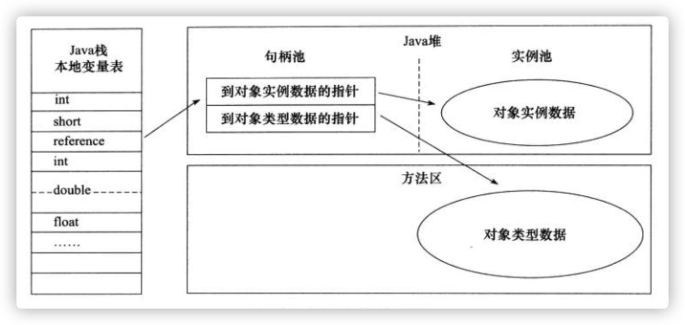

- **直接指针：**如果使用直接指针访问，那么Java堆对象的布局中就必须考虑如何放置访问类型数据的相关信息，而reference中存放的直接就是对象的地址

  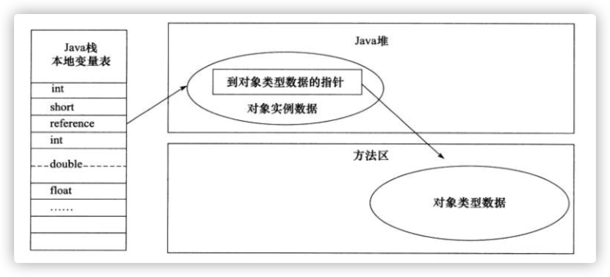

**这两种对象访问方式各有优势，使用句柄访问的最大好处就是reference中存放的是稳定的句柄地址，在对象被移动时只会改变句柄中的实例数据指针，而reference本身不需要修改，使用直接指针访问方式的最大好处就是速度很快，因为他节省了一次指针定位的时间开销**


### 补充内容1：字符串常量池

> 常见的面试题：String类型的变量和常量做“+”运算时发生了什么？

```java
String str1 = "str";
String str2 = "ing";
String str3 = "str" + "ing";//常量池中的对象
String str4 = str1 + str2; //在堆上创建的新的对象
String str5 = "string";//常量池中的对象
System.out.println(str3 == str4);//false
System.out.println(str3 == str5);//true
System.out.println(str4 == str5);//false

// 对于基本数据类型来说，== 比较的是值。对于引用数据类型来说，==比较的是对象的内存地址。
```

**对于编译期可以确定值的字符串，也就是常量字符串，JVM会将其加入到字符串常量池中**

字符串常量池是JVM为了提升性能和减少内存消耗针对字符串（String类）专门开辟的一块区域，主要目的是为了避免字符串的重复创建

```java
String aa = "ab"; // 放在常量池中
String bb = "ab"; // 从常量池中查找
System.out.println(aa==bb);// true
```

在Java1.7之前，字符串常量池被放在方法区中，在1.7之后，字符串常量池被移出到Java堆中

并且，**字符串常量拼接得到的字符串常量在编译阶段就会被放入到字符串常量池中**，这个得益于编译器的优化

在编译过程中，Javac编译器会进行一个**常量折叠**的代码优化，常量折叠会把常量表达式的值求出来作为常量嵌入到最终生成的代码中，这时Javac编译器会对源代码做的极少量优化措施之一（代码优化几乎在即时编译器中进行）

能够进行常量折叠的情况：（**编译器在程序编译期就能够确定常量的值**）

- 基本数据类型(byte、boolean、short、char、int、float、long、double)以及字符串常量

- `final` 修饰的基本数据类型和字符串变量

- 字符串通过 “+”拼接得到的字符串、基本数据类型之间算数运算（加减乘除）、基本数据类型的位运算（<<、>>、>>> ）


**对象引用和“+”的字符串拼接方式实际上是通过`StringBuilder`调用`append()`方法实现的，拼接完成之后调用`toString()`得到一个`String`对象**

```java
// 比如上面例子中的String str4 = str1 + str2
// 实际上是 String str4 = new StringBuilder().append(str1).append(str2).toString();
```

**因此str4并不是字符串常量池中存在的对象，属于堆上的新对象**

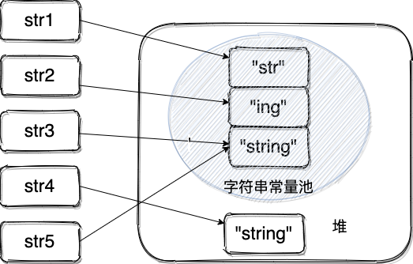


我们在平时写代码的时候，应该避免多个字符串的拼接，如果字符串需要改变的话我们使用`StringBuilder`和`StringBuffer`

当`String`对象被`final`修饰的时候，可以让编译器把它当成常量来处理，如下例

```java
final String str1 = "str";
final String str2 = "ing";
// 下面两个表达式其实是等价的
String c = "str" + "ing";// 常量池中的对象
String d = str1 + str2; // 常量池中的对象
System.out.println(c == d);// true
```


如果编译器在运行期才能够知道变量的值，那么就无法进行如下，如下例子

```java
final String str1 = "str";
final String str2 = getStr();
String c = "str" + "ing";// 常量池中的对象
String d = str1 + str2; // 在堆上创建的新的对象
System.out.println(c == d);// false
public static String getStr() {
      return "ing";
}
```


**<font color=red>只要使用new的方式创建对象，便需要创建新的对象</font>**

因此使用`String str = new String("aaa")`的时候会在堆内存中创建一个新的String对象

使用new创建对象的方式可以分为以下三步：

1. 在堆中创建一个字符串对象
2. 检查字符串常量池中是否有和new的字符串值相等的字符串常量
3. 如果没有的话则需要在字符串常量池中创建一个值相等的字符串常量，如果有的话就直接返回堆中的字符串实例对象地址

基于上述，我们可以下另外一个例子

```java
String str1 = "abcd";
String str2 = new String("abcd");
String str3 = new String("abcd");
System.out.println(str1==str2);
System.out.println(str2==str3);
// str1不用多说，“abcd”会被放入字符串常量池中，然后str1指向它在字符串常量池中的地址
// str2是使用new来创建的，所以它会在堆内存中创建一个新的对象
// str3同样是使用new来创建的，所以它也会在堆内存中创建一个新的对象
// 因此，输出的是两个false
```


**字符串常量池比较特殊，它的主要使用方法有两种**

1. 直接使用双引号声明出来String对象会直接存储在常量池中

2. 如果不是使用双引号声明出来的String对象，使用String提供的`intern()`方法也有相同的效果

   `String.intern()` 是一个 Native 方法，它的作用是：如果运行时常量池中已经包含一个等于此 String 对象内容的字符串，则返回常量池中该字符串的引用；如果没有，JDK1.7 之前（不包含 1.7）的处理方式是在常量池中创建与此 `String` 内容相同的字符串，并返回常量池中创建的字符串的引用，JDK1.7 以及之后，字符串常量池被从方法区拿到了堆中，jvm 不会在常量池中创建该对象，而是将堆中这个对象的引用直接放到常量池中（这是在常量池中没有这个字符串的情况下，有这个字符串的话，直接使用常量池中字符串的引用），减少不必要的内存开销。

   ```java
           String s1 = "java";
           String s2 = s1.intern();
   
           String s3 = new String("java");  // 它的引用也是常量池中的，因为在他实例化之前，常量池中就已经存在java了,但是他的地址却是堆内存中地址
           String s4 = s3.intern();
   
           System.out.println(s1 == s2);  // true
           System.out.println(s3 == s4);  // false
           System.out.println(s1 == s3);  // false
           System.out.println(s1 == s4);  // true
           System.out.println(s2 == s3);  // false;
           System.out.println(s2 == s4);  // true
   ```


> 因此，我们就能够回答这个问题了：**<font color=red>String s1 = new String("abc");创建了几个对象？</font>**

**答案是一个或者两个**

- 如果字符串常量池中已经有`abc`这个字符串了，那么只需要在堆内存中创建一个字符串常量"abc"
- 如果字符串常量池中没有`abc`这个字符串的话，那么它将首先在字符串常量池中创建，然后再在堆空间中创建，因此创建总共2个字符串对象

```java
String s1 = new String("abc");// 堆内存的地址值
String s2 = "abc";
System.out.println(s1 == s2);// 输出 false,因为一个是堆内存，一个是常量池的内存，故两者是不同的。
System.out.println(s1.equals(s2));// 输出 true
```


### 补充内容2：8种基本数据类型的包装类和常量池

Java中除了两个浮点数类型的包装类`Float`和`Double`没有实现常量池技术，其余的6个均实现了常量池技术

`Byte,Integer,Short,Long`这4中包装类默认创建了数值`[-128, 127]`的相应类型的缓存数据，`Character`创建了数值在`[0,127]`范围的缓存数据，`Boolean`直接返回`True`或者`False`

```java
Integer i1 = 33;
Integer i2 = 33;
System.out.println(i1 == i2);// 输出 true
Integer i11 = 333;
Integer i22 = 333;
System.out.println(i11 == i22);// 输出 false
Double i3 = 1.2;
Double i4 = 1.2;
System.out.println(i3 == i4);// 输出 false
```


```java
Integer i1 = 40;
Integer i2 = new Integer(40);
System.out.println(i1==i2);
```

`Integer i1=40` 这一行代码会发生**<font color=red>装箱</font>**，也就是说这行代码等价于 `Integer i1=Integer.valueOf(40)` 。因此，`i1` 直接使用的是常量池中的对象。而`Integer i1 = new Integer(40)` 会直接创建新的对象。

因此，答案是 `false` 。


**<font color=red>所有整型包装类对象之间值的比较，全部使用 equals 方法比较</font>(这个在做题的时候已经碰到过了)**。


`Integer`类型之间比较更加丰富的一个例子

```java
Integer i1 = 40;
Integer i2 = 40;
Integer i3 = 0;
Integer i4 = new Integer(40);
Integer i5 = new Integer(40);
Integer i6 = new Integer(0);

System.out.println(i1 == i2);// true
System.out.println(i1 == i2 + i3);//true
System.out.println(i1 == i4);// false
System.out.println(i4 == i5);// false
System.out.println(i4 == i5 + i6);// true
System.out.println(40 == i5 + i6);// true
```

上面例子中我们知道`i1,i2,i3`都是常量池中的对象，`i4,i5,i6`都是堆内存中的对象

这里需要注意的是`i1 == i2 + i3`，不同于字符串常量池中的比较

```java
String a = "a";
String b = "b";
String ab = "ab";
System.out.println(ab == a + b);   // false
```

上面的`i1 == i2 + i3`返回的是true，我猜测应该是发生了拆箱操作

那`i4 == i5 + i6` 为什么是 true 呢？因为， **`i5` 和 `i6` 会进行自动拆箱操作，进行数值相加**，即 `i4 == 40` 。 `Integer` 对象无法与数值进行直接比较，所以 `i4` 自动拆箱转为 int 值 40，最终这条语句转为 `40 == 40` 进行数值比较。

所以Integer最终会变成数值之间的比较，而String中最终仍然是地址之间的比较


## JVM垃圾回收

### 本节常见面试题

问题答案在文中都有提到

- 如何判断对象是否死亡（两种方法）。
- 简单的介绍一下强引用、软引用、弱引用、虚引用（虚引用与软引用和弱引用的区别、使用软引用能带来的好处）。
- 如何判断一个常量是废弃常量
- 如何判断一个类是无用的类
- 垃圾收集有哪些算法，各自的特点？
- HotSpot 为什么要分为新生代和老年代？
- 常见的垃圾回收器有哪些？
- 介绍一下 CMS,G1 收集器。
- Minor Gc 和 Full GC 有什么不同呢


从上一部分“Java内存区域详解”中，我们能够知道，Java的自动内存管理系统主要针对的是对象内存的回收和对象内存的分配，同时Java自动内存管理主要针对的就是堆空间中对象的内存分配和管理

Java堆是垃圾收集器管理的主要区域，因此也被称为**GC堆**，从垃圾回收的角度来看，由于现在收集器基本都采用**分代垃圾收集算法**，所以Java堆还可以细分为新生代和老年代，在详细一点可以分成Eden空间、From Survivor、To Surivivor空间等，进一步划分是为了更好的回收内存，或者更快的分配内存

通过上面描述，我们能够知道**堆空间的基本结构**如下：


可以看到，Eden空间、From Survivor、To Survivor空间都属于新生代，Old Memory属于老年代

大部分情况下，对象首先会在Eden区分配，**在一次新生代垃圾回收后，如果对象还活着，则会进入so或者s1**，并且对象的年龄还会增加1（Eden区->Survivor区后对象的初始年龄变为1），当他的年龄增大到一定程度（默认为大于15岁），就会晋升到老年代。对象晋升到老年代的年龄阈值，可以通过参数 `-XX:MaxTenuringThreshold` 来设置默认值，这个值会在虚拟机运行过程中进行调整，可以通过`-XX:+PrintTenuringDistribution`来打印出当次GC后的Threshold。

**经过一次GC之后，Eden区和From区都会被清空，**这时候，From和To交换他们的角色，也就是新的"To"就是上次 GC 前的“From”，新的"From"就是上次 GC 前的"To"。也就是说，不管怎样，都是要保证To区是空的，Minor GC会一直重复这样的过程，在这个过程中，有可能当次Minor GC过后，Survivor的From区域空间不够用，有一些还达不到进入老年代条件的实例放不下，则放不下的部分会提前进入老年代


### 堆内存常见的分配策略

#### 对象优先在Eden区分配

大多数情况下，对象在新生代中eden区分配，当eden区没有足够的空间时，虚拟机将发起一次Minor GC。我们知道进行一次新生代垃圾回收之后（Minor GC），如果对象还活着则会进入s0或者s1，但是如果survivor区域的空间不足呢？这也就意味着位于eden区的对象无法进入survivor区，所以这时候只好通过**分配担保机制**把新生代的对象提前转移到老年代中去，如果老年代中的空间足够存放来自新生代的对象，则不会发生Full GC。

> 空间分配担保是为了确保Minor GC之前老年代本身还有容纳新生代所有对象的剩余空间

#### 大对象直接进入老年代

大对象指的就是需要大量连续内存空间的对象（比如：字符串、数组）

> 为什么要这样呢？

这样做是为了避免大对象分配内存时由于分配担保机制带来的复制而降低效率

#### 长期存活的对象将进入老年代

即然虚拟机采用了分代收集的思想来管理内存，那么内存回收时就必须能够识别哪些对象应放在新生代，哪些对象应放在老年代，为了做到这一点，虚拟机给每一个对象都加上了一个对象年龄（Age）计数器

如果对象在Eden区出生，并且经过一次Minor GC之后仍然存活，并且能够被Survivor存放的话，它将被移动到Survivor区中，并将对象年龄设为1，对象在Survivor中每“熬过”一次Minor GC，年龄就会增加一岁，当他的年龄增加到一定程度时，就会被晋升到老年代


### GC的分类

针对HotSpot VM的实现，它里面的GC其实准确分类只有两大种：

**部分收集（Partial GC）**

- 新生代收集（Young GC/Minor GC）：只对新生代进行垃圾收集
- 老年代收集（Old GC/Major GC）：只对老年代进行垃圾收集，需要注意的是Major GC在某些语境下，还可能指的是Full GC
- 混合收集（Mix GC）：对整个新生代和部分老年代进行垃圾收集

**整堆收集（Full GC）**：收集整个Java堆内存和方法区


### 如何判断对象是否死亡（两种方法）

堆中几乎存放着所有的对象实例，对堆垃圾回收前的第一步就是要判断哪些对象已经死亡（即**不能再被任何途径使用的对象**）

判断对象是否死亡共有两种方法，分别是：引用计数法和<font color=red>可达性分析算法</font>

- 引用计数法：就是给对象添加一个引用计数器，每当有一个地方引用他，计数器就会加1，当引用失效，计数器就会减1，任何时候计数器为0的对象就是不可能再被使用的

  这个方法实现简单，效率高，但是目前主流的虚拟机中并没有选择这种算法来管理内存，其最主要的原因就是**引用计数法很难解决对象之间相互循环引用的问题。**所谓对象之间的相互引用问题，如下面代码所示：除了对象 objA 和 objB 相互引用着对方之外，这两个对象之间再无任何引用。但是他们因为互相引用对方，导致它们的引用计数器都不为 0，于是引用计数算法无法通知 GC 回收器回收他们。

  ```java
  public class ReferenceCountingGc {
      Object instance = null;
  	public static void main(String[] args) {
  		ReferenceCountingGc objA = new ReferenceCountingGc();
  		ReferenceCountingGc objB = new ReferenceCountingGc();
  		objA.instance = objB;
  		objB.instance = objA;
  		objA = null;
  		objB = null;
  
  	}
  }
  ```

- **可达性分析算法：**这个算法的思想就是通过一系列的称为`GC ROOTS`的对象作为起点，从这些节点开始向下搜索，节点所走过的路径叫做引用链，当一个对象到GC Roots没有任何引用链相连的话，则证明此对象是不可达的

  

  可作为 GC Roots 的对象包括下面几种:

  - 虚拟机栈(栈帧中的本地变量表)中引用的对象
  - 本地方法栈(Native 方法)中引用的对象
  - 方法区中类静态属性引用的对象
  - 方法区中常量引用的对象
  - 所有被同步锁持有的对象

  所以，我们可以把JVM内存中的对象引用理解为一种有向图，把引用变量、对象都当成有向图的顶点，把引用关系当成图的有向边，每个图都有一个**起始顶点（也就是进程根）**，比如对于单线程程序而言，整个程序只有一条main线程，那么该图就是以main进程为顶点的有向图。只要有向图中进程根无法到达的顶点，都是不可达状态，垃圾回收机制就会去处理这些顶点，这也就解决了循环引用的问题

> 对于JVM的垃圾回收机制来说，是否回收一个对象的标准在于：是否还有引用变量引用该对象？

当一个对象在堆内存中运行时，根据他在对应有向图中的状态，可以把它所处的状态分成三种：

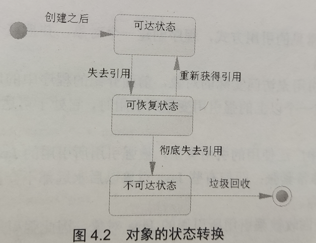

- **可达状态：**当一个对象被创建以后，有一个以上的引用变量引用他，在有向图中可以从起始顶点导航到该对象，那么它就处于可达状态，程序可以通过引用变量来调用该对象的属性和方法
- **可恢复状态：**如果程序中某个对象不再有任何引用变量引用他，他将先进入可恢复状态，此时从有向图的起始顶点不能导航到该对象，在这种状态下，系统的垃圾回收机制准备回收该对象所占用的内存，再回收该对象之前，系统会调用可恢复状态的对象的`finalize`方法进行资源清理，如果系统调用`finalize`方法重新让一个以上的引用变量引用该对象，则这个对象会再次变成可达状态，否则该对象会进入不可达状态
- **不可达状态：**当对象的所有关联都被切断，且系统调用所有对象的`finalize`方法依然没有使该对象变成可达状态时，这个对象将永久性地使用引用，最后变成不可达状态，只有当一个对象处于不可达状态时，系统才会真正回收该对象所占有的资源

> 所以说，处于不可达状态的对象并不是“非死不可”，他有可能处于可恢复状态

### 引用的类型

无论是引用计数法还是可达分析算法，判定对象是否存活都与引用有关

JDK1.2之前，Java中引用的定义很传统：如果`reference`类型的数据存储的数值代表的是另一块内存的起始地址，就成这块内存代表一个引用

在JDK1.2以后，Java对引用的概念进行了扩充，将引用分成了强引用、软引用、弱引用和虚引用（引用强度逐渐减弱）

#### 强引用（StrongReference）

这是Java程序中最常见的引用方式，程序创建一个对象，并把这个对象赋给一个引用变量，这个引用变量就是强引用

**JVM是肯定不会回收强引用所引用的对象，即使内存非常紧张，即使有些对象永远不会被用到。因此强引用也是造成内存泄漏的主要原因之一**

> 强引用可以类比成必不可少的生活必需品

#### 软引用（SoftReference）

当一个对象只有软引用时，它有可能被垃圾回收机制回收，对于只有软引用的对象而言，当系统内存空间足够时，它不会被系统回收，程序也可以使用该对象，当系统空间内存不足时，系统将会回收它

**所以，软引用通常是用在对内存敏感的程序中，软引用是强引用很好的替代。**

软引用和强引用的区别就在于：即使系统空间不足，就算发生`OutOfMemoryError`错误，垃圾回收机制也不会回收强引用所引用的对象，而对于软引用，当内存空间不足时，垃圾回收机制是能够回收软引用所引用的对象的，所以使用软引用程序不会因为内存不足而导致程序中止

```java
package chaptor04;

import java.lang.ref.SoftReference;

public class Reference {
    public static void main(String[] args) {

        SoftReference<Person>[] people = new SoftReference[10000];
        for (int var = 0; var < 10000; var++) {
            people[var] = new SoftReference<>(new Person("名字" + var, var + 1));
        }

        System.out.println(people[2].get());
        System.out.println(people[4].get());

        // 通知系统进行垃圾回收
        System.gc();
        System.runFinalization();

        // 垃圾回收机制运行之后，SoftReference数组里面的元素不变
        System.out.println(people[2].get());
        System.out.println(people[4].get());
    }
}

class Person{
    String name;
    int age;
    public Person(String name, int age) {
        this.name = name;
        this.age = age;
    }

    public String toString() {
        return "Person{name=" + name + ", age = " + age + "}";
    }
}

```

对于上述代码，我们使用软引用创建一个长度为10000的people数组，因为是软引用，当堆空间充足的时候，它的用法和强引用是一样的，所以垃圾回收前后的输出结果没有变化

但是如果我们加入执行参数，`java -Xmx8m -Xms8m Reference`，这表示着将堆空间缩小为8M，此时堆内存比较紧张，所以软引用所引用的对象会被垃圾回收机制处理掉，这时返回的结果就都是null了

如果这时候程序中是强引用，那么返回的结果就是内存溢出错误了

> 软引用可以类比为可有可无的生活用品

#### 弱引用（WeakReference）

弱引用和软引用有点类似，区别在于弱引用所引用对象的生存期更短，弱引用通过WeakReference类实现，弱引用的引用级别更低，对于只有弱引用的对象而言，**当系统垃圾回收机制运行时**，不管系统内存是否足够，总会回收该对象所占用的内存。由于垃圾回收器是一个优先级很低的线程， 因此不一定会很快发现那些只具有弱引用的对象。

弱引用具有很大的不确定性，因为每次垃圾回收机制运行的时候都会回收只有弱引用所引用的对象，而垃圾回收机制的运行又是不受程序员控制的，因此程序获取弱引用所引用的Java对象时必须要小心空指针异常，通过弱引用所获取的Java对象可能是null

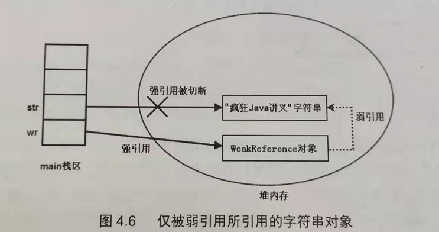

> 弱引用也可以类比为可有可无的生活用品，与WeakReference功能类似的还有WeakHashMap，因为程序很少会使用单个的WeakReference来引用某个Java对象，因此这个时候系统内存往往不会特别紧张，当程序有大量的Java对象需要使用弱引用来引用时，可以考虑使用WeakHashMap来保存他们，垃圾回收机制运行之后，WeakHashMap中的所有键值对都会被清空


#### 虚引用

软引用和弱引用都可以单独使用，但是虚引用是不可以单独使用的，单独使用虚引用没有太大的意义，**虚引用的主要作用就是跟踪对象被垃圾回收的状态。**

虚引用通过`PhantomReference`类实现，它完全类似于没有引用，虚引用对对象本身没有太大影响，对象甚至感觉不到虚引用的存在，如果一个对象只有虚引用，那么他和没有引用的效果大致相同，虚引用主要用于跟踪对象被垃圾回收的状态，虚引用不能单独使用，**虚引用必须和引用队列（ReferenceQueue）联合使用**

**虚引用与软引用和弱引用的一个区别在于：** 虚引用必须和引用队列（ReferenceQueue）联合使用。当垃圾回收器准备回收一个对象时，如果发现它还有虚引用，就会在回收对象的内存之前，把这个虚引用加入到与之关联的引用队列中。程序可以通过判断引用队列中是否已经加入了虚引用，来了解被引用的对象是否将要被垃圾回收。程序如果发现某个虚引用已经被加入到引用队列，那么就可以在所引用的对象的内存被回收之前采取必要的行动。


### 如何判断一个常量是废弃常量

**运行时常量池主要回收的是废弃的常量。**

- JDK1.7 之前运行时常量池逻辑包含字符串常量池存放在方法区, 此时 hotspot 虚拟机对方法区的实现为永久代
- JDK1.7 字符串常量池被从方法区拿到了堆中, 这里没有提到运行时常量池,也就是说字符串常量池被单独拿到堆,运行时常量池剩下的东西还在方法区, 也就是 hotspot 中的永久代 
- JDK1.8 hotspot 移除了永久代用元空间(Metaspace)取而代之, 这时候字符串常量池还在堆, 运行时常量池还在方法区, 只不过方法区的实现从永久代变成了元空间(Metaspace)

假如在字符串常量池中存在字符串“abc”，如果当前没有任何String对象引用该字符串常量的话，就说明常量“abc”就是废弃常量，如果这时发生内存回收且有必要的话，“abc”就会被系统清理出常量池了


### 如何判断一个类是一个无用类

**方法区主要回收的是无用的类**，那么如何判断一个类是无用的类呢？

上面判断一个常量是否是废弃常量比较简单，但是判断一个类是否为无用类就比较复杂了，**类要同时满足三个条件才能算是“无用的类”：**

- 该类的所有实例都已经被回收，也就是Java堆中不存在该类的任何实例
- 加载该类的`ClassLoader`已经被回收
- 该类对应的`java.lang.Class`对象没有在任何地方被引用，无法在任何地方通过反射访问该类的方法

虚拟机**可以**对满足了上面三个条件的类进行回收，注意这里仅仅是可以，而并不是和对象那样不使用了就必然会被回收


### ==Java的内存泄漏==

程序在运行过程中会不断地分配内存空间，那些不再使用的内存空间应该即时被回收，从而保证系统可以再次使用这些内存，如果存在无用的内存没有被回收回来，那就是**<font color=red>内存泄漏</font>**

> 对于C++程序而言，对象占用的内存空间都必须由程序员来显式回收，如果程序员忘记了回收他们，就会产生内存泄漏，对于Java程序来说，所有不可达的对象都会被垃圾回收机制回收，因此程序员不需要考虑这部分的内存泄漏，但如果程序中有一些Java对象，他们处于可达状态，但程序以后永远也不会再访问他们了，那么他们所占用的内存空间也不会被释放（前提是强引用），他们所占用的内存空间也会产生内存泄漏

我们可以来看一下ArrayList中的remove方法的源代码

```java
// remove()底层调用的是fastRemove方法
private void fastRemove(Object[] es, int i) {
    modCount++;
    final int newSize;
    if ((newSize == size - 1) > i) {
        // 对数组元素进行整体搬家
        System.arraycopy(es, i + 1, es, i, newSize - i);
    }
    es[size = newSize] = null;    // 这句话就是为了解决内存泄漏问题的
}
```

加入上述代码中没有`es[size = newSize] = null`这句话，如果我们试图删除下面列表中的最后一个元素，如下图所示

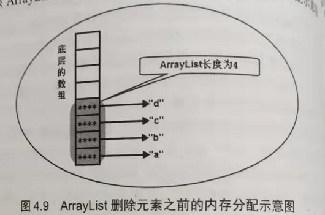

当程序删除ArrayList中的最后一个元素，也就是删除上图中的"d"，要删除的元素的index=size-1，此时ArrayList无需整体搬家，程序只需要将ArrayList的size-1即可，但是如果不执行`es[size = newSize] = null`的话，就会造成如下情况

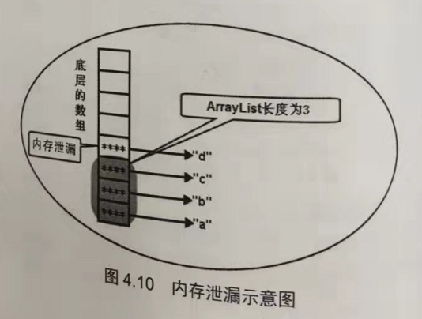

也就是造成了内存泄漏，因为数组中的第4个对象将一直处于可达状态，但是对于ArrayList而言，它的size等于3，也就是说，ArrayList自己也认为自己只有3个元素了，因此他永远也不会去访问底层数组的第四个元素，对于程序来说，他已经变成垃圾了，但是对于垃圾回收机制来说，由于它是可达的，并不会去回收他，所以这就产生了内存泄漏


> 这个内存泄漏感觉在实际开发中应该时刻警醒，感觉应该会被经常用到，尤其是上面这种删除数据、栈弹出数据等的场景，一定要记得看看他是不是真的删除了


### 垃圾回收机制

垃圾回收机制主要完成两个工作：

- 跟踪并监控每个Java对象，当某个对象处于不可达状态时，回收该对象所占用的内存
- 清理内存分配、回收过程中产生的内存碎片

垃圾回收机制需要完成这两个方面的工作，这两方面工作的工作量都不算太小，因此垃圾回收算法也就成为限制Java程序运行效率的重要因素，实现高效JVM的一个重要方面就是提供高效的垃圾回收机制，高效的垃圾回收机制既能保证垃圾回收的快速运行，避免内存的分配和回收成为应用程序的性能瓶颈，又不能导致应用程序产生停顿

#### 垃圾回收算法

- **标记-清除算法**：从名字可以看出，该算法分成了两个阶段，首先标记出所有不需要回收的对象，在标记完成后统一回收掉所有没有被标记的对象，他是最基础的收集算法，后续的算法都是基于标记-清除算法的改进

  该算法存在效率和空间上的两个问题，效率上很好理解，首先需要遍历整个的空间做标记，然后再能够清除，空间上的问题是在标记清除以后会产生大量不连续的空间碎片

  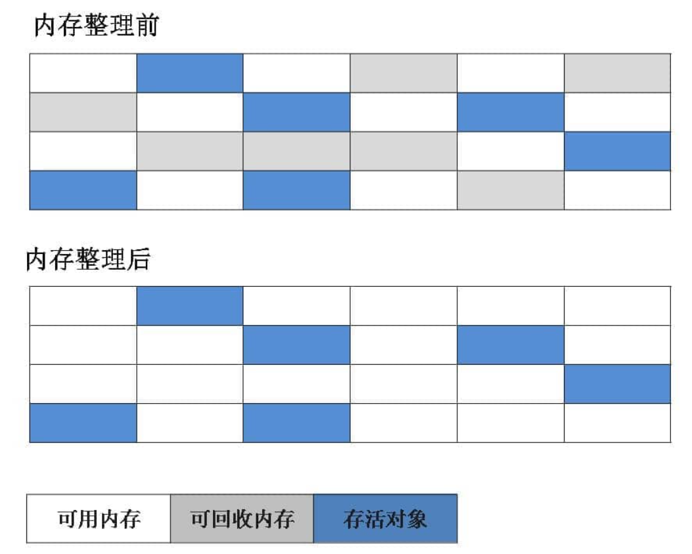

  > 也就是不压缩回收方式，垃圾回收器先从根开始访问所有可达对象，将他们标记位可达状态，然后再遍历一次整个内存区域，对所有的没有标记为可达的对象进行回收处理（和上面说的相反，但是思想一样）.
  >
  > 标记-清除算法无需进行大规模的赋值操作，速度快，而且内存利用率较高，但这种算法需要两次遍历堆内存空间，遍历的成本比较大，因此造成应用程序暂停的时间随堆空间的大小线性增大，而且垃圾回收回来的内存往往是不连续的，这样也会导致后面分配和回收内存更慢

- **标记-复制算法：**为了解决效率上的问题，标记-复制收集算法出现了，它可以将内存分成大小相同的两块，每次使用其中一块，当这一块的内存使用完了之后，就将还存活的对象复制到另一块去，然后再把使用的空间一次清理掉，这样就使每次的内存回收都是对内存空间的一半进行回收

  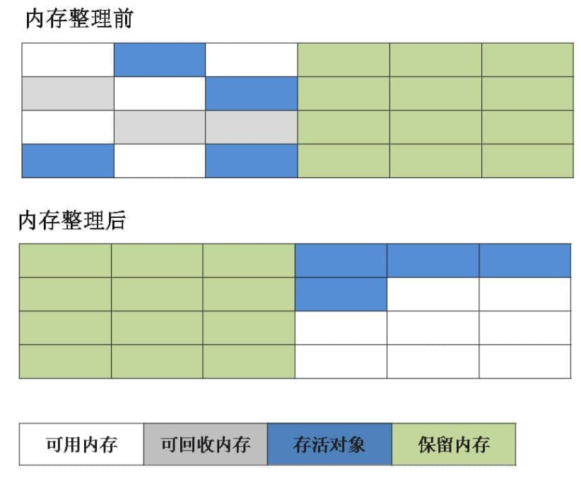

  > 复制也就是将堆内存分成两个相同空间，从根（类似于前面介绍的有向图的起始节点）开始访问每一个关联的可达对象，将空间A的可达对象全部复制到空间B，然后一次性回收整个空间A
  >
  > 对于复制算法而言，因为只需要访问所有可达对象，将所有的可大对象复制完成后就回收整个空间，完全不用理会那些不可达的对象，所以遍历空间的成本比较低，但是需要巨大的复制成本和较多的内存

- **标记-整理/压缩算法：**这是压缩回收方式，垃圾回收器先从根节点开始访问所有的可达对象，将他们标记为可达状态。这一步和标记-清除算法是一样的，但是接下来垃圾回收器不会清除未被标记的对象，而是将已经被标记的可达对象搬迁到一起，这个过程也叫做内存压缩，然后垃圾回收机制再次回收那些不可大对象所占用的内存空间，这样就避免了回收产生内存碎片

> 从上面的介绍中可以看出，不管采用哪种方式实现垃圾回收，实现起来总是利弊参半的，所以现在的虚拟机中的垃圾回收器都是综合使用多种方式，也就是针对不同的情况采用不同的垃圾回收方式，也就是我们前面说的**分代**的思想，将堆内存空间分成新生代、老年代和永久代，**垃圾回收器会根据不同代的特点采用不同的回收算法**，从而充分利用各种回收算法的优点

**分代收集算法（这也是为什么HotSpot虚拟机要将堆空间分为新生代和老年代的原因）**

采用分代回收的策略基于下面的两点事实（不仅仅是Java语言，其他编程语言也这样）：

- 绝大多数对象不会被长时间引用，这些对象在其Young期间就会被回收
- 很老的对象（生存时间很长）和很新的对象（生存时间很短）之间很少存在互相引用的情况

基于上面的两点事实，对于新生代的对象而言，大部分对象都会很快进入不可达状态，只有少量的对象能够熬到垃圾回收执行时，而垃圾回收器只需要保存新生代中处于可达状态的对象，如果采用复制算法，只需要少量的复制成本，因此**<font color=red>大部分垃圾回收器对新生代都采用复制算法</font>**

> 新生代由一个Eden区和两个Survivor区构成，绝大多数对象先分配到Eden区中（有一些大的对象可能直接被分配到老年代中），Survivor区中的对象都至少在新生代经历过一次垃圾回收，所以这些对象在转移到老年代之前都会被保留在Survivor区中。同一个时间节点下，两个Survivor空间中有一个用来保存对象，另一个是空的，用来在下次垃圾回收时保存新生代中的对象。每次复制就是将Eden和第一个Survivor区的可达对象复制到第二个Survivor区，然后清空Eden区和第一个Survivor区。（意思和我们前面说的交换From Survivor和To Survivor一样），Eden和Survivor区的比例通过`-XX:SurvivorRatio`附加选项来设置，默认为32，**如果Survivor区太大则会产生浪费，太小则会导致新生代的对象提交进入老年代**

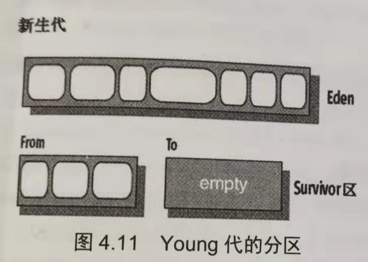

> 如果新生代中的对象经过多次垃圾回收之后仍然没有被回收掉，即这个对象经过了足够长的时间还处于可达状态，垃圾回收机制就会将这个对象转移到老年代。因此老年代中的对象都是一些“久经沙场”的对象了，没那么容易死掉，而且随着时间的六室，老年代的对象会越来越多，因此老年代的空间要比新生代的空间更大，处于这两点考虑，老年代的垃圾回收具有如下两个特征：
>
> - 老年代垃圾回收的执行频率没必要太高，因为很少有对象会死掉
> - 每次对老年代执行垃圾回收都需要更长的时间来完成
>
> 基于以上考虑，**<font color=red>对于老年代的对象垃圾回收器通常会使用标记-整理算法</font>**，这种算法可以避免复制老年代的大量对象，而且由于老年代的对象不会很快死亡，回收过程不会大量地产生内存碎片，所以使用标记-整理算法相对比较划算

在李刚老师的《疯狂Java面试讲义》中，他就是把Major collection给描述成了Full GC，原话是这样的

```tex
当Young代的内存将要用完时，垃圾回收机制会对Young代进行垃圾回收，垃圾回收机制会采用较高的频率对Young代进行扫描和回收。因为这种回收的系统开销比较小，因此也被称为“次要回收”（minor collection）。当Old代的内存将要用完时，垃圾回收机制会进行全回收，也就是对Young代和Old代都要进行回收，此时回收的成本就大得多了，因此被称为“主要回收”（major collection）
```

> HotSpot虚拟机要将堆空间分为新生代和老年代的原因就是能够更加高效地进行垃圾回收
>
> 目前主流的垃圾收集器都会采用分代回收算法，因此需要将堆内存分为新生代和老年代，这样我们就可以根据各个年代的特点选择合适的垃圾收集算法。


#### 垃圾回收器

##### 1.串行回收器（Serial Collector）

串行回收器通过运行Java程序时使用`-XX:+UseSerialGC`附加选项启用

串行回收器对新生代和老年代的回收都是串行的，即只是用一个CPU，而且**垃圾回收执行期间会使得应用程序发生暂停（stop the world）**，具体策略为：对于新生代的垃圾回收采用串行标记复制算法，对于老年代的垃圾回收采用串行标记整理算法

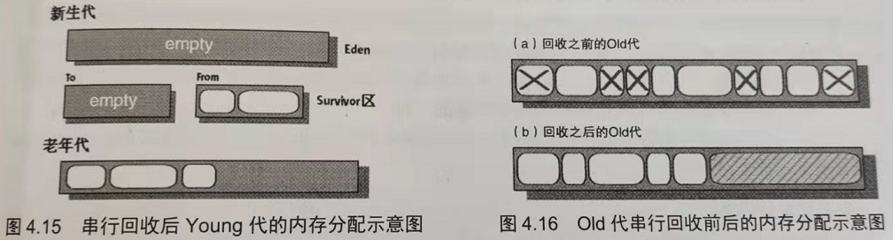


##### 2.并行压缩回收器（Parallel Compacting Collector）

并行压缩回收器通过运行Java程序时使用`-XX:+UseParallelGC`附加选项启用，他可以充分利用计算机的多CPU来提高垃圾回收的吞吐量

**ParNew 收集器其实就是 Serial 收集器的多线程版本，除了使用多线程进行垃圾收集外，其余行为（控制参数、收集算法、回收策略等等）和 Serial 收集器完全一样。**

**新生代采用标记-复制算法，老年代采用标记-整理算法。**

当计算机中的CPU很多时，可以通过`-XX:PARALLELGCThreads=size`来减少并行线程的数目

**并行和并发概念补充：**

- **并行（Parallel）** ：指多条垃圾收集线程并行工作，但此时用户线程仍然处于等待状态。
- **并发（Concurrent）**：指用户线程与垃圾收集线程同时执行（但不一定是并行，可能会交替执行），用户程序在继续运行，而垃圾收集器运行在另一个 CPU 上。


##### 3.并发回收器

JVM提供了两种并发回收器：

- **Concurrent Mark Sweep（CMS,并发标记、清除回收器）**：CMS回收器是一种以获取最短回收停顿时间为目标的收集器，她非常符合在注重用户体验的应用上使用，CMS是HotSpot虚拟机第一款真正意义上的并发回收器，她第一次实现了让垃圾收集线程和用户线程基本上同时工作

  从名字中的**Mark Sweep**这两个词可以看出，CMS 收集器是一种 **“标记-清除”算法**实现的，它的运作过程相比于前面几种垃圾收集器来说更加复杂一些。整个过程分为四个步骤：

  - **初始标记：**暂停所有的其他线程，并记录下直接与root相连的对象，速度很快
  - **并发标记：**同时开启GC和用户线程，用一个闭包结构去记录可达对象，但在这个阶段结束，这个闭包结构并不能保证包含当前所有的可达对象，因为用户线程可能会不断地更新引用域，所以GC线程无法保证可达性分析的实时性，所以这个算法里会跟踪记录发生引用更新的地方
  - **重新标记：**重新标记阶段就是为了修正并发标记期间用户程序继续运行而导致标记发生变动的那一部分对象的标记记录，这个阶段的停顿时间会比初始标记阶段的停顿时间稍长，但是远比并发标记阶段的时间短
  - **并发清除：**开始用户线程，同时GC线程对未被标记的区域进行清扫

  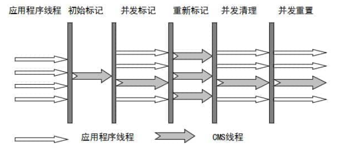

  > CMS收集器的优点在于它能够并发收集，虽然需要经过两次停顿，但是都是低停顿。

  CMS还有三个明显的缺点：

  - 对CPU资源敏感
  - 无法处理浮动垃圾
  - 它使用的垃圾回收算法为“标记-清理”算法，收集结束以后会产生大量的内存碎片

  > 因此，CMS回收器在JDK9开始，就不再推荐使用了

- **Garberage First（G1）收集器：**是一款面向服务器的垃圾收集器，主要针对配备多颗CPU以及大容量内存的机器，以极高概率满足GC停顿时间要求的同时，还具备高吞吐量性能特征

  G1收集器有以下特点：

  - **并行与并发**：G1 能充分利用 CPU、多核环境下的硬件优势，使用多个 CPU（CPU 或者 CPU 核心）来缩短 Stop-The-World 停顿时间。部分其他收集器原本需要停顿 Java 线程执行的 GC 动作，G1 收集器仍然可以通过并发的方式让 java 程序继续执行。

  - **分代收集**：虽然 G1 可以不需要其他收集器配合就能独立管理整个 GC 堆，但是还是保留了分代的概念。

  - **空间整合**：与 CMS 的“标记-清理”算法不同，G1 从整体来看是基于“标记-整理”算法实现的收集器；从局部上来看是基于“标记-复制”算法实现的。

  - **可预测的停顿**：这是 G1 相对于 CMS 的另一个大优势，降低停顿时间是 G1 和 CMS 共同的关注点，但 G1 除了追求低停顿外，还能建立可预测的停顿时间模型，能让使用者明确指定在一个长度为 M 毫秒的时间片段内

  G1收集器在后台维护了一个优先列表，每次根据允许的收集时间，优先选择回收价值最大的Region（这也是他名字的由来），这样使用Region划分内存空间以及有优先级的区域回收方式，保证了G1收集器在有限时间内可以尽可能高的收集效率（把内存化整为零）


##### 4.Z垃圾回收器

Z垃圾回收器是伴随着JDK11引入的，它是一种可伸缩的、低延迟的垃圾回收器，Z垃圾回收器可以并发地完成垃圾回收，完全不需要暂停应用程序的线程。

Z垃圾回收器可以实现极低延迟的高响应，但他对服务器内存有极高的要求，他要求服务器的内存达到TB级别，Z垃圾回收器是专门为低延迟应用设计的垃圾回收器
