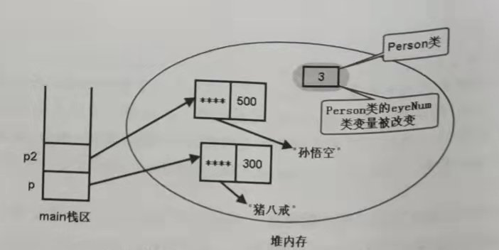
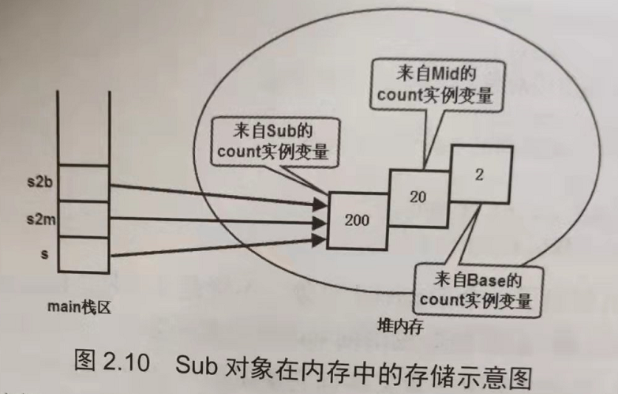

1. Java的内存管理分成了两个方面：内存分配和内存回收，这里的内存分配特指创建Java对象时JVM为该对象在堆空间内分配的内存空间，内存回收指的是当该Java对象失去引用，变成垃圾时，则回收失去引用的Java对象所占的内存，通过这种方式看起来在Java中可能不存在内存泄漏，但是实际上这是一种错觉，Java程序也会存在内存泄漏

2. Java中的变量大致上分成了两个部分：成员变量和局部变量，

   类体内定义的变量称为成员变量（field），如果使用static修饰成员变量，那么该成员变量又叫类变量，这表明这个成员属于类本身了，static不可以修饰局部变量

   **成员变量（包括类变量）会被放在堆空间中，栈空间中的是它的引用**

   **使用static修饰的成员变量是类变量，属于类本身，没有使用static修饰的成员变量是实例变量，属于该类的实例（也就是说实例变量属于对象）**

   局部变量又可以分成三个部分

   - 形参：在方法签名中定义的局部变量，由方法调用者为其赋值

   - 方法内部的局部变量，在方法内定义的局部变量，必须在方法内完成显式初始化，生命周期同方法
   - 代码块中的局部变量，在代码块内定义的局部变量，必须在代码块内完成显式初始化，生命周期同代码块

   **由于局部变量的作用时间很短，所以局部变量被放在栈空间中**

   ```java
   // 对于类变量和成员变量的区别，我想下面这段代码能够很好的表现出来
   public class demo {
       int a = b + 1;
       static int b = 2;
   }
   // 这段代码完全没有错误，因为变量b被static修饰，所以类加载的时候他就被初始化了，也就是说虽然他的位置在a后面，但是他是先被初始化的，因此在成员变量被初始化的时候能够引用他；而如果不用static修饰，那么就会有“非法前向引用”的错误
   ```

   我们知道JVM中一个类只能够对应一个class对象，所以对于类变量来说，每个类变量只需要一块内存空间。

   因为一个类能够创建多个Java对象，所以类每创建一次实例，就需要为实例变量分配一块内存空间，也就是说程序中有多少个实例，实例变量就需要多少块空间，如下实例

   ```java
   class Person {
       int age;
       String name;
       static int eyeNums;
   }
   
   public class demo{
       psvm(String[] args) {
           Person.eyeNums = 2;
           Person p1 = new Person();
           p1.age = 300;
           p1.name = "猪八戒";
           ...
           // 虽然我们也能够通过p1.eyeNnums得到eyeNums的值，看起来eyeNums是实例变量了，其实不然，在底层仍然是通过将p1转换成Person类去查找的
          Person.eyeNums = 3;     
       }
   }
   ```

   

   从上图中也可以看出，类变量只会被分配一块空间


3. 如果类中包含非静态初始化块，那么非静态初始化块的执行会在构造函数之前

4. 创建任何Java对象时，程序总会先依次调用每个父类的非静态初始化块，构造器（总是从object开始）执行初始化，然后才调用本类的非静态初始化块、构造器进行初始化

5. super调用用于显式调用父类构造器，this调用用于显式调用本类中另一个重载的构造器。super调用核this调用都只能在构造器中使用，而且super和this调用都必须作为构造器的第一行代码

6. **Java继承中对成员变量和方法的处理是不同的**

   理论上，子类的方法可以访问到父类的实例变量，这是因为子类继承父类也会获得父类的成员变量和方法，但是父类不能访问子类的实例变量，因为父类根本没办法知道它会被哪个子类继承，它的子类又会增加哪些成员变量。

   但是，**当变量的编译时类型和运行时类型不同的时候，通过该变量访问它引用的对象的实例变量时，该实例变量的值由声明该变量的类型决定，但是通过该变量调用它引用的对象的实例方法时，该方法行为将由它实际所引用的对象来决定。**

   ```java
   class Base{
       int count = 2;
       public void dispaly() {
           sout(this.count);
       }
   }
   
   class Derived extends Base {
       int count = 20;
       @Override
       public void dispaly() {
           sout(this.count);
       }
   }
   
   public class Test{
       psvm(String[] args) {
           Base b = new Base();
           sout(b.count);
           b.dispaly();
           // 上面这两个没有疑问，输出的肯定就是2
           Derived d = new Derived();
          	sout(d.count);
           d.dispaly();
           // 同理，这两个的输出也肯定就是20
           Base bd = new Derived();
           sout(bd.count);    // 2
           bd.dispaly();      // 20
           // 根据上面我们说的，bd的编译类型时Base，运行时类型时Derived，也就是说变量bd的声明类型是Base，但是bd的引用对象类型确实Derived，因此bd.count输出的是声明类型Base中的count值，db.dispaly()调用的却是Derived中的dispaly
           Base b2d = d;
           // 通过上面我们知道了b2d和d指向的是同一个堆内存中的对象，但是b2d.count和d.count却不是相同的值，理由不用再赘述了
       }
   }
   ```

   我们通过一个更极端的例子来说明上面这些情况下的成员变量的内存分布情况

   ```java
   class Base{
       int count=2;
   }
   class Mid {
       int count=20;
   }
   public class Sub extends Mid{
       int count=200;
       psvm(String[] args) {
           Sub s = new Sub();
           Mid s2m = s;
           Base s2b = s;
           
           sout(s.count);        // 200
           sout(s2m.count);      // 20
           sout(s2b.count);      // 2
       }
   }
   ```

   

   事实上，系统内存中只有一个Sub对象，只是这个Sub对象中不仅保存了在Sub类中定义的所有实例变量，还保存了他所有父类所定义的全部实例变量

   > <font color=red>综上，当程序创建一个子类对象的时候，系统不仅仅会为该类中定义的实例变量分配内存，也会为其父类中定义的所有实例变量分配内存，即使子类定义了与父类同名的实例变量，也就是说当系统创建了一个Java对象的时候，如果该Java类有两个父类（一个直接父类A，一个间接父类B），假设A类中定义了2个实例变量，B类中定义了3个实例变量，当前类中定义了2个实例变量，那么这个Java对象将会保存2+3+2个实例变量</font>
   >
   > <font color=blue>如果在子类中定义了与父类中已有变量同名的变量，那么子类中定义的变量会隐藏父类中定义的变量，这里需要注意的是：所谓覆盖，并不是完全覆盖，在系统创建子类对象是，依然会为父类中定义的、被隐藏的变量分配内存空间。</font>
   >
   > <font color=purple>为了在子类方法中访问父类中定义的、被隐藏的实例变量，或者为了在子类方法中调用父类中定义的、被覆盖的方法，**可以使用super，作为限定来修饰这些实例变量和实例方法**</font>
   >
   > 上面加粗的部分就是super的作用，super关键字本身并没有引用任何对象！！所以super代表父类的默认实例这种说法是不对的


7. Java会缓存所有曾经用过的字符串直接量，例如，执行`String a = "java"`语句之后，系统的字符串池就会缓存一个字符串，如果程序再次执行`String b="java"`，系统将会让b直接指向字符串池中的"java"字符串，因此`a==b`也会返回true

```java
public class test{
    psvm(String[] args) {
        String s1 = "疯狂Java";
        String s2 = "疯狂" + "Java";
        sout(s1 == s2);              // true
        String str1 = "疯狂";
        String str2 = "Java";
        String str3 = str1 + str2;  // false
        sout(s1 == str3);
    }
}

// 上述结果出现差异的原因是因为s2是两个字符串的连接值，在编译的时候就能够确定值，所以s1和s2都能够指向同一个地址
// 而str3无法在编译时确定它的值，不会让s3也指向缓冲区中的字符串
// 如果想让s1 == str3，那么只需要把str1和str2都改成final类型即可
```

对于final变量而言，只有在定义该变量时指定初始值才会有**宏变量**的效果，在非静态初始化块、构造函数中指定初始值则不会有这种效果

如果用final修饰方法，那么这个方法将不能够被重写，如果父类方法中有一个方法是`private final void test()`，那么在子类中还可以定义`test()`方法，因为有`private`权限修饰符，子类根本访问不到父类的这个方法

如果程序需要在内部类中使用局部变量，那么这个局部变量默认就有final修饰，不管写不写，这个final修饰符都存在；同时lambda表达式访问的局部变量自动也带有final修饰符，如下代码

```java
psvm(String[] args) {
    int count = 0;
    Stream.of("java","Python","Swift")
        .forEach(s ->{
            if (s.length() > 5) {
                count++;  // count会自动带有final
            }
        })
}

// 但是我们有时确实需要局部变量来保存内部类（或lambda表达式）所返回的数据，那么应该怎么办呢?
// 虽然Java不允许final变量被重新赋值，但是变量引用的对象是可以改变的
psvm(String[] args) {
    int[] count = new int[1];
    Stream.of("java","Python","Swift","Kotlin")
        .forEach(s ->{
            if (s.length() > 5) {
                count[0]++;  // count会自动带有final，但是我们可以通过不断修改引用来保存lambda表达式的值
            }
        })
}
```


