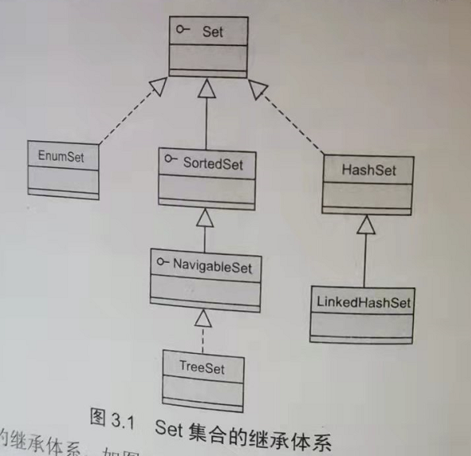
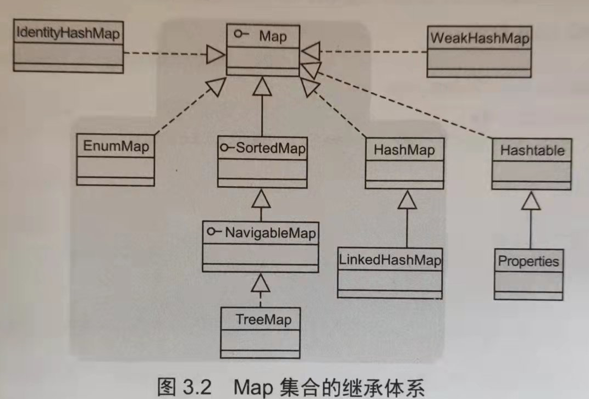
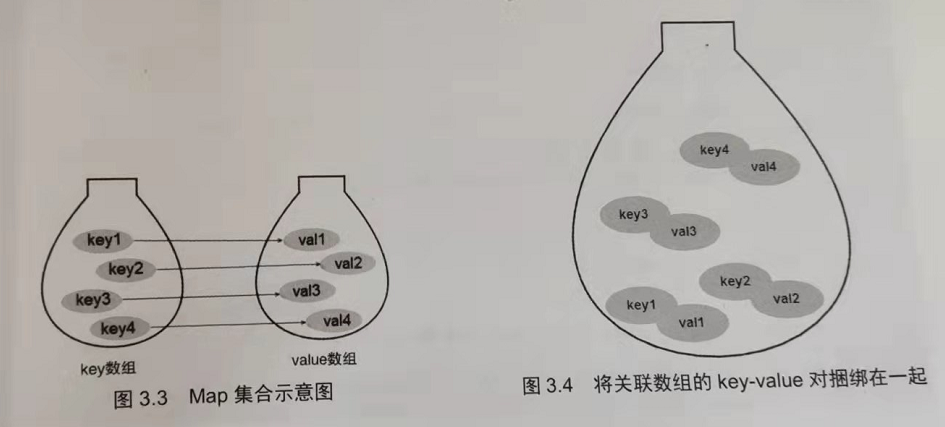
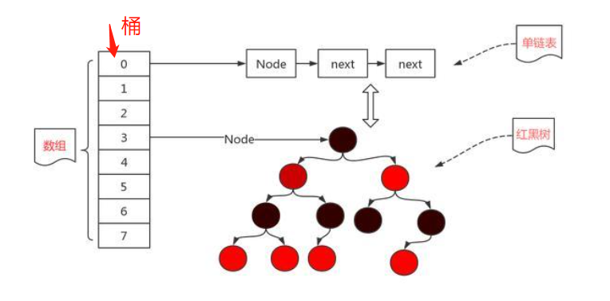
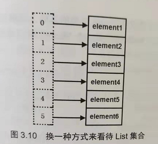

1. Set代表一种元素无序、不可重复的集合，Map代表一种由多个key-value对组成的集合，实际上，Map是Set的扩展

   我们知道Map中的key也是无序且不可重复的，所以要是把Map集合中的所有key都集中起来，那么他就是一个Set，这实现了从Map到Set的转换，事实上，Map中也提供了这个方法-----`keySet()`用来返回所有key组成的Set集合

   实际上，Map和Set的继承体系特别像，如下图所示，从这个方面来看，Map和Set也是有一定的关联关系的

   

   

   对于一个Map集合而言，只要给出了指定的key，Map总是可以根据key快速查询到value，所以如果我们换一种思维来看Map，即把value当成key的附属物，那么我们就可以把Set扩展成Map，不同的是Set中仅存放key，而Map中存放的是key-value这对关联数组

   

2. Java集合实际上是多个引用变量所组成的集合，这些引用变量指向实际的Java对象，和引用类型的数组一样

3. 从Java8开始，HashMap得到了重大改进，HashMap不再是简单的HashMap实现，而是HashMap和红黑树的结合，也就是说，当向HashMap中添加key-value对时，由其key的`hashCode()`返回值决定该key-value对（源码中这个key-value对就是Node对象）的存储位置，当两个Node对象的key的`hashCode()`返回值相同时，将由key通过`equals()`比较值决定是采用覆盖行为（返回true）还是红黑树或者Node链（返回false）

4. HashMap的实现源码中三个重要的变量

   ```java
   // 1. capacity  表示的是HashMap的容量，HashMap中共有三个构造函数，分别是
   public HashMap(){}  // 默认初始容量为16，负载因子默认为0.75
   public HashMap(int initialCapacity){} // 构建一个初始容量为initialCapacity 、负载因子为0.75的HashMap，但是需要注意的是，虽然在构造函数中显示指定了initialCapacity，但是实际上的HashMap容量是要比initialCapacity略大的，因为在源码中还有一个方法是tableSizeFor()，这个方法的作用是找到大于initialCapacity的最小的2的n次方的值，比如initialCapacity = 10，那么哈希表的实际容量就是16，因此我们在初始化initialCapacity也尽量将其初始化为2的n次方，因为这样能够减小计算量
   public HashMap(int initialCapacity, float loadFactor){} // 指定初始容量和负载因子
   // 所以capacity大于等于initialCapacity
   
   // 2. loadFactor 负载因子，用来衡量HashMap装载程度的变量
   
   // 3. threshold  当HashMap的size大于threshold的时候，哈希表会进行扩容，每次扩容都会增大一倍，也就是哈希表的容量始终是2的n次幂     threshold = capacity * loadFactor
   
   // 综上，我们能够看出，loadFactor是时间和空间成本的一种折中，增大负载因子，也就意味着哈希表中的数据更多的时候才会进行扩容，这也就意味着会有更多的数据发生“桶冲突”，不管是Node链还是红黑树，这样的后果就是查询效率变差，虽然它的空间利用率提高了
   // 当我们减少负载因子，哈希表中填充的元素会减少，哈希冲突也会减少，底层的Node链长度和红黑树的高度也会降低，查询效率变高，但是空间利用率却降低了
   // 所以当内存比较紧张的时候，我们可以适当增加负载因子，当内存比较充足，但是对时间效率要求较高时，我们可以适当减小负载因子
   ```

   > [负载因子增大和减少的影响](https://www.zhihu.com/question/276736347/answer/1268886570)

5. 对于HashMap及其子类来说，它们采用hash算法来决定集合中元素的存储位置，当系统开始初始化HashMap时，系统会创建一个capacity长度的Node数组，这个数组里可以存储元素的位置被称为“桶”（bucket），每个“桶”都有其指定索引，系统可以根据其索引快速访问该桶里存储的元素

   

   > 当某个“桶”处的Node链的长度大于或者等于7时，就会触发HashMap中的树化操作

6. HashSet的实现是通过封装了一个HashMap对象来存储所有的集合元素，所有放入HashSet中的集合元素实际上由HashMap的key来保存，而HashMap的value则存储了一个PRESENT，他是一个静态的Object对象

   HashSet的绝大多数方法都是通过调用HashMap的方法来实现的，因此HashSet和HashMap两个集合在实现本质上是相同的

7. TreeMap和TreeSet类似于HashMap和HashSet的关系，HashSet的底层依赖于HashMap的实现，TreeSet底层则采用了一个NavigableMap来保存所有的Set元素，但是NavigableMap只是一个接口，因此底层仍然是使用TreeMap来包含Set集合中的所有元素，对于TreeMap而言，它采用一种被称为**“红黑树”**的排序二叉树来保存Map中的每个Entry，每个Entry都会被当作红黑树的一个节点

   > 因此，我们就能够得出结论
   >
   > 对于TreeMap而言，由于它底层采用了一颗红黑树来保存集合中的Entry，这意味着TreeMap中查找、增加、删除某个节点时的效率是要比HashMap低的，因为TreeMap首先需要通过循环/递归查找到合适的位置
   >
   > 但是TreeMap，TreeSet相对于HashMap，HashSet的优势就在于TreeMap中的所有Entry总是按照key根据指定的排序规则保持有序的状态，TreeSet中的所有元素总是根据指定的排序规则保持有序状态

8. Map和List其实并没有什么关系，他们两个的底层实现并没有太大的相似之处，只是他们两个在用法上存在一些相似之处—既可以说List相当于所有key都是int类型的Map，也可以说Map相当于索引是任意类型的List

   

9. 在List集合的实现类中，主要有三个实现类，分别是：ArrayList，Vector和LinkedList，其他Vector还有一个Stack子类，这个Stack子类仅仅是在Vector父类的基础上增加了5个方法，这五个方法就将一个Vector扩展成了Stack，因此本质上Stack还是一个Vector

   **虽然Stack是一个线程安全的类，但是实际上即使程序中需要栈这种数据结构，Java也不再推荐使用Stack类了，而是推荐使用Deque实现类，从JDK1.6开始，Java便提供了一个Deque接口，并为该接口提供了一个ArrayDeque实现类，在无需保证线程安全的情况下，程序完全可以使用ArrayDeque来代替Stack类，Deque代表的是双端队列这种结构，但是双端队列不仅仅能够代表队列（FIFO），也是能够代表栈（FILO）**

   > Deque可以由ArrayDeuqe或者LinkedList实现，它们两者使用的区别以及优劣也就是数组和链表的区别。 

   > [为什么使用Deque代替Stack](https://www.baifachuan.com/posts/1ed50096.html)

10. **Vector和ArrayList的区别**

    这两个集合类本质上并没有什么不同，他们都实现了List接口，而且底层都是基于Java数组来存储集合元素的，Vector其实就是ArrayList的线程安全版本，Vector和ArrayList绝大部分方法的实现都是相同的，只是Vector比ArrayList中的方法增加了synchronized修饰

    两者还有一点不同的是，ArrayList在扩容的时候总是将底层数组容量扩充为原来的1.5倍，但是Vector扩容有两种选择：当capacityIncrement实例变量大于0时，扩充后的容量等于原来的容量加上capacityIncrement的值；当capacityIncrement小于等于0的时候，Vector就是将底层数组的容量扩充为原来的2倍

    Vector是一个很古老的类，Vector现在已经几乎被ArrayList所替代了，Vector的唯一好处就是他是线程安全的，但是在多线程环境下使用List集合，而且需要保证List集合的线程安全时也依然可以避免使用Vector，而是可以考虑将ArrayList包装成线程安全的集合类（通过Collections里面的synchronizedList方法）

11. **ArrayList和LinkedList的区别**

    ArrayList是一种顺序存储的线性表，其底层采用的是数据来保存每个集合中的元素，LinkedList则是一种链式存储的线性表，其本质上是一个双向链表，但是LinkedList不仅实现了List接口，还实现了Deque接口，也就是说LinkedList不仅可以当作双向链表使用，还可以用作队列和栈

    所以，对于ArrayList集合而言，当程序向ArrayList中插入、删除集合元素时，ArrayList底层都需要对数组进行“整体搬家”，因此性能较差，但是当查询ArrayList中的元素时，其性能和数组几乎相同，非常快

    对于LinkedList集合而言，虽然在搜索某个节点之前会先判断是从链头开始，还是从链尾开始，但是无论如何都是需要经过循环的，所以LinkedList中寻找某个特定的节点的效率是比较低的，如果仅仅是单纯地添加某个节点，那么LinkedList的性能会非常好，比如addFirst，pollLast，pollFirst等方法，因为他们不需要搜索过程，但是如果在某个特定的索引处添加节点，比如`add(int index, E element)`那么这个方法的性能也不是特别好，因为这个方法也避免不了搜索过程

12. **Iterator是一个迭代器接口，他专门用于迭代各种Collection集合，包括Set集合和List集合**

    Java中要求各种集合都必须提供一个`iterator()`方法，该方法可以返回一个`Iterator`用于遍历该集合中的元素，至于返回的Iterator到底是哪种实现类，程序并不关心，这就是典型的迭代器模式

    由于Iterator迭代器只负责对各种集合所包含的元素进行迭代，他自己并没有保留集合元素，因此使用Iterator进行迭代时，通常不应该删除集合元素，否则将会引发`java.util.ConcurrentModificationException`

    但是实际上在某些特殊情况下，可以在使用Iterator迭代集合时直接删除集合中的某个元素，具体的情况有两种：

    - 第一种情况是，对于ArrayList、Vector、LinkedList等List集合而言，当使用Iterator遍历他们的时候，如果正在遍历倒数第二个元素，那么使用List集合的remove方法删除集合中的任意一个元素都不会产生异常，当正在遍历其他元素的时候删除其他元素就会引发异常

      ```java
          public static void main(String[] args) {
              ArrayList<String> list = new ArrayList<>();
              list.add("111");
              list.add("222");
              list.add("333");
              for (Iterator<String> it = list.iterator(); it.hasNext();) {
                  String ele = it.next();
                  System.out.println(ele);
                  
                  if (ele.equals("222")){
                      list.remove(ele);
                  }
              }
          }
      
      // 其实问题的关键就在于hasNext()这个方法上，他在ArrayList中的实现如下
      public boolean hasNext() {
          // 如果下一步即将访问的集合元素的索引不等于集合的大小，则返回true
          return cursor != size;
      }
      // 也就是说，当程序使用Iterator遍历List集合的倒数第二个元素时，下一步将访问的元素的索引是size-1，如果此时通过list集合中的remove方法删除一个元素的话，将会导致集合的size()变为size-1，这将导致hasNext返回false，也就是说不会再去执行it.next()方法了，也就不会产生异常了
      ```

      

    - 第二种情况是，对于TreeSet，HashSet等集合而言，当使用Iterator遍历他们的时候，如果正在遍历最后一个集合元素，那么使用Set集合的remove方法删除集合中的任意元素都不会产生一场，当正在遍历其他元素的时候删除其他元素就会引发异常

      ```java
      // hasNext在HashMap中的实现
      public final boolean hasNext() {
           return next != null;
      }
      // 同理，当next不为空的时候，返回true，当迭代器遍历到最后一个元素的时候，不管怎么样，接下来都不会再去执行next()方法了，所以删除集合中的元素也无所谓
      ```

      

