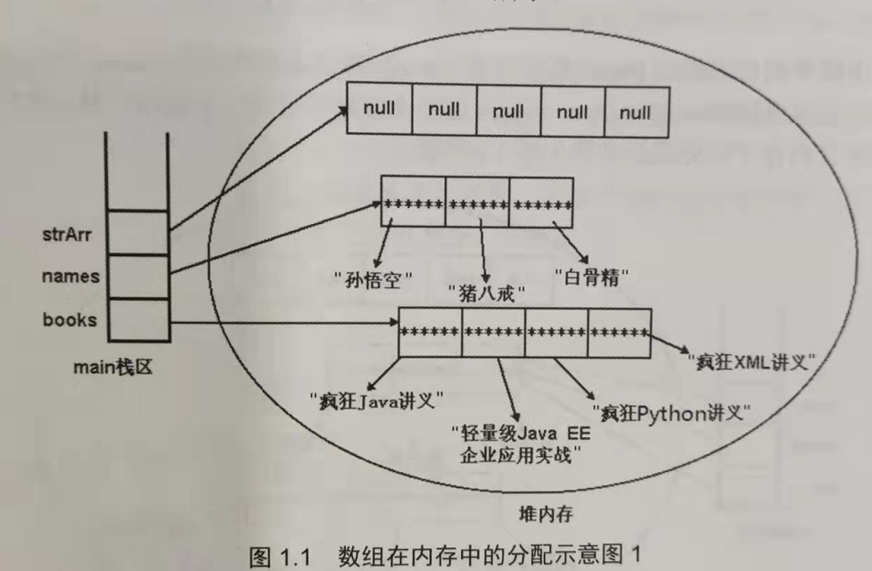
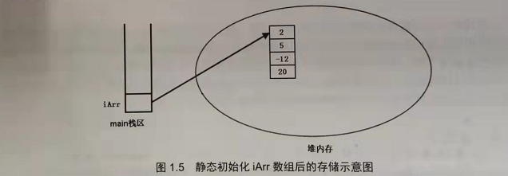
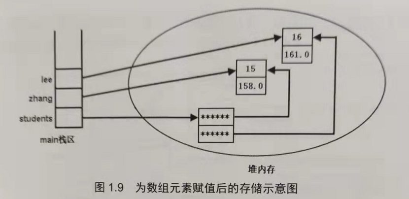
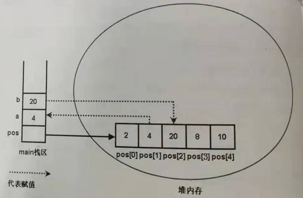
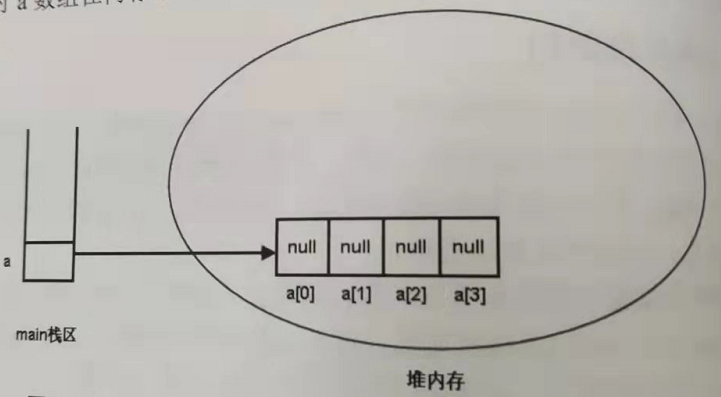
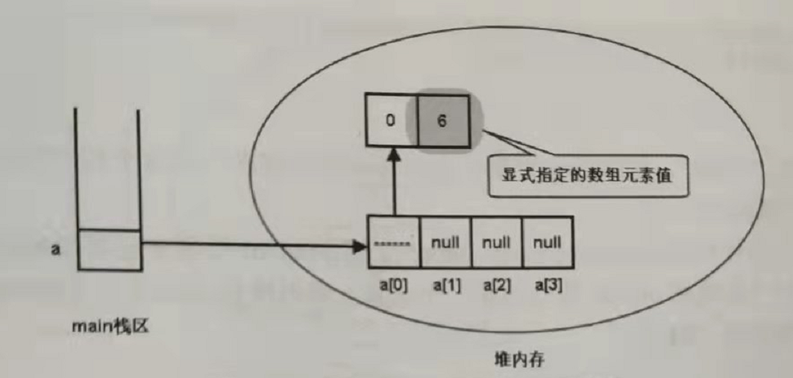
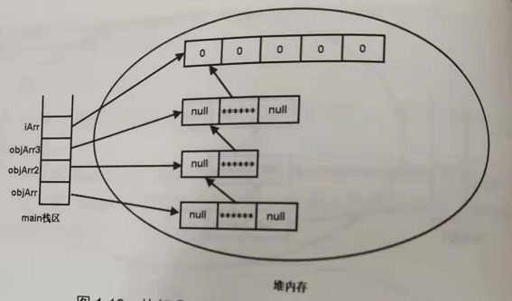

1. Java数组是静态的，即当数组被初始化之后，该数组所占的内存空间、数组长度都是不可变的，Java数组必须经过初始化之后才能够使用，所谓初始化，即创建实际的数组对象，也就是在内存中为数组对象分配内存空间，并为每个数组元素指定初始值。从用法角度看，数组相当于普通变量，因为既可以把数组元素的值赋给普通变量，又可以把普通变量的值赋给数组元素

2. 数组的初始化有两种方式：

   - 静态初始化，指的是在初始化的时候由程序员显式地指定每个元素的初始值，由系统决定数组的长度
   - 动态初始化，指的是程序员只指定数组的长度，由系统为数组元素分配初始值

   ```java
   // 静态初始化
   String[] books = {"疯狂java讲义", "...", "...", "..."};
   
   // 动态初始化
   String[] strArr = new String[5];
   ```

   

   **Java的数组变量是一种引用类型的变量，数组变量并不是数组本身，他只是指向堆内存中的数组对象，如上图所示**

   ```java
   // 如果执行下面代码
   strArr = names;
   // 那么strArr将会指向names在堆内存中的数组对象，而strArr之前的数组对象由于没有引用了，会被Java垃圾回收机制处理掉
   ```

   **<font color=red>因此对于数组变量来说不需要所谓的初始化，只要让数组变量指向一个有效的数组对象，程序便能够正常使用该数组对象</font>**

   如果程序仅仅执行声明代码，如下：

   ```java
   int[] arr1;
   ```

   那么只会在栈区生成一个数组变量引用

   

   > 注意：上面说的是数组的引用变量不用初始化，需要初始化的是堆内存中的数据对象，需要注意的是**Java中局部变量必须由程序员提供初始值**，所以如果定义的局部变量是数组变量，那么程序必须对数组变量进行初始化，哪怕是初始化成默认值


3. 所有局部变量都是放在栈内存里保存的，不管其是基本类型的变量还是引用类型的变量，都是存储在各自的方法栈内存中的，但是引用类型的变量所引用的对象（包括数组、普通的Java对象）则总是存储在堆内存中

4. 对于Java对象而言，堆内存中的对象（不管是数组对象，还是普通的Java对象）通常是不允许直接访问，为了访问堆内存的对象，通常只能通过引用变量，如下图：

   

   ```java
   int[] iArr = new int[]{2, 5, -12, 20};
   ```

   `iArr`本质上只是main栈区的引用变量，但是使用`iArr.length,iArr[2]`等的时候，系统将自动变为访问堆内存中的数组对象

   比较容易混淆的是：引用类型的变量什么时候指的是栈内存中的变量本身，何时又变为引用实际的Java对象，其实规则很简单：引用变量本质上是一个指针，只要程序通过引用变量访问属性，或者通过引用变量调用方法，该引用变量就会由它所引用的对象代替

   > 之前碰到过的Runtime异常：NullPointerException（空指针异常）就是由引用变量没有引用一个有效的对象时候引起的异常


5. 引用类型数组的初始化

   ```java
   class Person{
       int age;
       double height;
       // 构造方法等
       ...
   }
   
   public class test {
       public static void main(String[] args) {
           Person[] students = new Person(2);
           ...
           Person zhang = new Person(15, 158);
           ...
           Person lee = new Person(16, 161);
           ...
           student[0] = zhang;
           student[1] = lee;
           ...
       }
   }
   ```

   

6. Java语言不允许直接访问堆内存中的数据，因此只能通过数组引用变量来访问数组

7. main方法声明的变量都是局部变量，因此他们都被保存在main方法栈区中，但**数组元素**作为数组对象的一部分，总是**保存在堆内存中**，不管他们是基本类型的数组元素，还是引用类型的数组元素

   ```java
   public static void main(Stirng[] args) {
       int[] pos = new int[5];
       // 对数组进行初始化
       ...
       int a = pos[1];
       ...
       int b = 20;    
       pos[2] = b;    
       ...
   }
   ```

   

8. Java允许将多维数组当成一维数组来处理，**初始化多维数组时可以先只初始化最左边的维数，**此时该数组的每个元素都相当于一个数组引用变量，这些数组元素还需要进一步初始化。

   ```java
   int[][] a = new int[4][];  // 这是合法的
   // a[i]就是一个一维数组
   ```

   通过上述代码，就是让a变量指向一块长度为4的数组内存，这个长度为4的数组里的每个数组元素都是引用类型（数组类型），系统为这些数组元素分配默认值null

   

   如果接下来的程序对a[0]进行初始化，也就是让堆内存中的第一个数组元素指向一个有效的int[]数组对象，如下图所示

   

   从上面这两幅图中，就能够知道了，为什么二维数组的行数使用`arr.length`，列数使用`arr[0].length`

   ```java
   int[][] a = new int[2][5];
   // a.length 表示的第一幅图
   // a[0].length  表示的是第二幅图
   ```

   > 理论上说，如果让上图中灰色覆盖的数组元素再次指向另一个数组，也就可以将其扩展成三维数组，甚至更多维的数组，但在实际编程中这样是行不通的，**因为Java是强语言类型**，a[0]数组元素相当于int[]类型的数组，所以`a[0][1]`只能是int类型的值,但如果定义的是一个Object[]类型的数组，每一个数组元素都相当于一个Object类型的应用变量，因此可以指向任何对象
   >
   > ```java
   > public static void main(String[] args) {
   >     Object[] objArr = new Object[3];
   >     
   >     objArr[1] = new Object[2];
   >     
   >     Object[] objArr2 = (Object[]) objArr[1]; // 让objArr2和objArr[1]指向同一个数组对象
   >     
   >     objArr2[1] = new Object[3];
   >     
   >     Object[] objArr3 = (Object[]) objArr2[1];
   >     
   >     objArr3[1] = new int[5];
   >     
   >     int[] iArr = (int[]) objArr3[1];
   > }
   > ```
   >
   > 执行了上述代码之后，堆内存中各个数组对象之间的关系如下图所示
   >
   > 


## END

