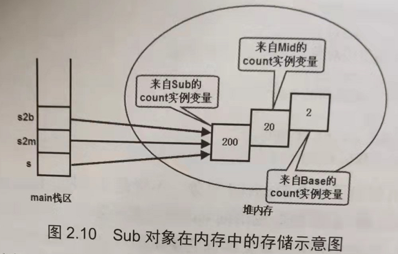

1. Java数组是静态的，即当数组被初始化之后，该数组所占的内存空间、数组长度都是不可变的，Java数组必须经过初始化之后才能够使用，所谓初始化，即创建实际的数组对象，也就是在内存中为数组对象分配内存空间，并为每个数组元素指定初始值。从用法角度看，数组相当于普通变量，因为既可以把数组元素的值赋给普通变量，又可以把普通变量的值赋给数组元素

2. 数组的初始化有两种方式：

   - 静态初始化，指的是在初始化的时候由程序员显式地指定每个元素的初始值，由系统决定数组的长度
   - 动态初始化，指的是程序员只指定数组的长度，由系统为数组元素分配初始值

   ```java
   // 静态初始化
   String[] books = {"疯狂java讲义", "...", "...", "..."};
   
   // 动态初始化
   String[] strArr = new String[5];
   ```

   

   **Java的数组变量是一种引用类型的变量，数组变量并不是数组本身，他只是指向堆内存中的数组对象，如上图所示**

   ```java
   // 如果执行下面代码
   strArr = names;
   // 那么strArr将会指向names在堆内存中的数组对象，而strArr之前的数组对象由于没有引用了，会被Java垃圾回收机制处理掉
   ```

   **<font color=red>因此对于数组变量来说不需要所谓的初始化，只要让数组变量指向一个有效的数组对象，程序便能够正常使用该数组对象</font>**

   如果程序仅仅执行声明代码，如下：

   ```java
   int[] arr1;
   ```

   那么只会在栈区生成一个数组变量引用

   

   > 注意：上面说的是数组的引用变量不用初始化，需要初始化的是堆内存中的数据对象，需要注意的是**Java中局部变量必须由程序员提供初始值**，所以如果定义的局部变量是数组变量，那么程序必须对数组变量进行初始化，哪怕是初始化成默认值


3. 所有局部变量都是放在栈内存里保存的，不管其是基本类型的变量还是引用类型的变量，都是存储在各自的方法栈内存中的，但是引用类型的变量所引用的对象（包括数组、普通的Java对象）则总是存储在堆内存中

4. 对于Java对象而言，堆内存中的对象（不管是数组对象，还是普通的Java对象）通常是不允许直接访问，为了访问堆内存的对象，通常只能通过引用变量，如下图：

   

   ```java
   int[] iArr = new int[]{2, 5, -12, 20};
   ```

   `iArr`本质上只是main栈区的引用变量，但是使用`iArr.length,iArr[2]`等的时候，系统将自动变为访问堆内存中的数组对象

   比较容易混淆的是：引用类型的变量什么时候指的是栈内存中的变量本身，何时又变为引用实际的Java对象，其实规则很简单：引用变量本质上是一个指针，只要程序通过引用变量访问属性，或者通过引用变量调用方法，该引用变量就会由它所引用的对象代替

   > 之前碰到过的Runtime异常：NullPointerException（空指针异常）就是由引用变量没有引用一个有效的对象时候引起的异常


5. 引用类型数组的初始化

   ```java
   class Person{
       int age;
       double height;
       // 构造方法等
       ...
   }
   
   public class test {
       public static void main(String[] args) {
           Person[] students = new Person(2);
           ...
           Person zhang = new Person(15, 158);
           ...
           Person lee = new Person(16, 161);
           ...
           student[0] = zhang;
           student[1] = lee;
           ...
       }
   }
   ```

   

6. Java语言不允许直接访问堆内存中的数据，因此只能通过数组引用变量来访问数组

7. main方法声明的变量都是局部变量，因此他们都被保存在main方法栈区中，但**数组元素**作为数组对象的一部分，总是**保存在堆内存中**，不管他们是基本类型的数组元素，还是引用类型的数组元素

   ```java
   public static void main(Stirng[] args) {
       int[] pos = new int[5];
       // 对数组进行初始化
       ...
       int a = pos[1];
       ...
       int b = 20;    
       pos[2] = b;    
       ...
   }
   ```

   

8. Java允许将多维数组当成一维数组来处理，**初始化多维数组时可以先只初始化最左边的维数，**此时该数组的每个元素都相当于一个数组引用变量，这些数组元素还需要进一步初始化。

   ```java
   int[][] a = new int[4][];  // 这是合法的
   // a[i]就是一个一维数组
   ```

   通过上述代码，就是让a变量指向一块长度为4的数组内存，这个长度为4的数组里的每个数组元素都是引用类型（数组类型），系统为这些数组元素分配默认值null

   

   如果接下来的程序对a[0]进行初始化，也就是让堆内存中的第一个数组元素指向一个有效的int[]数组对象，如下图所示

   

   从上面这两幅图中，就能够知道了，为什么二维数组的行数使用`arr.length`，列数使用`arr[0].length`

   ```java
   int[][] a = new int[2][5];
   // a.length 表示的第一幅图
   // a[0].length  表示的是第二幅图
   ```

   > 理论上说，如果让上图中灰色覆盖的数组元素再次指向另一个数组，也就可以将其扩展成三维数组，甚至更多维的数组，但在实际编程中这样是行不通的，**因为Java是强语言类型**，a[0]数组元素相当于int[]类型的数组，所以`a[0][1]`只能是int类型的值,但如果定义的是一个Object[]类型的数组，每一个数组元素都相当于一个Object类型的应用变量，因此可以指向任何对象
   >
   > ```java
   > public static void main(String[] args) {
   >     Object[] objArr = new Object[3];
   >     
   >     objArr[1] = new Object[2];
   >     
   >     Object[] objArr2 = (Object[]) objArr[1]; // 让objArr2和objArr[1]指向同一个数组对象
   >     
   >     objArr2[1] = new Object[3];
   >     
   >     Object[] objArr3 = (Object[]) objArr2[1];
   >     
   >     objArr3[1] = new int[5];
   >     
   >     int[] iArr = (int[]) objArr3[1];
   > }
   > ```
   >
   > 执行了上述代码之后，堆内存中各个数组对象之间的关系如下图所示
   >
   > 


9. 如果类中包含非静态初始化块，那么非静态初始化块的执行会在构造函数之前

10. 创建任何Java对象时，程序总会先依次调用每个父类的非静态初始化块，构造器（总是从object开始）执行初始化，然后才调用本类的非静态初始化块、构造器进行初始化

11. super调用用于显式调用父类构造器，this调用用于显式调用本类中另一个重载的构造器。super调用核this调用都只能在构造器中使用，而且super和this调用都必须作为构造器的第一行代码

12. **Java继承中对成员变量和方法的处理是不同的**

    理论上，子类的方法可以访问到父类的实例变量，这是因为子类继承父类也会获得父类的成员变量和方法，但是父类不能访问子类的实例变量，因为父类根本没办法知道它会被哪个子类继承，它的子类又会增加哪些成员变量。

    但是，当变量的编译时类型和运行时类型不同的时候，通过该变量访问它引用的对象的实例变量时，该实例变量的值由声明该变量的类型决定，但是通过该变量调用它引用的对象的实例方法时，该方法行为将由它实际所引用的对象来决定。

    ```java
    class Base{
        int count = 2;
        public void dispaly() {
            sout(this.count);
        }
    }
    
    class Derived extends Base {
        int count = 20;
        @Override
        public void dispaly() {
            sout(this.count);
        }
    }
    
    public class Test{
        psvm(String[] args) {
            Base b = new Base();
            sout(b.count);
            b.dispaly();
            // 上面这两个没有疑问，输出的肯定就是2
            Derived d = new Derived();
           	sout(d.count);
            d.dispaly();
            // 同理，这两个的输出也肯定就是20
            Base bd = new Derived();
            sout(bd.count);    // 2
            bd.dispaly();      // 20
            // 根据上面我们说的，bd的编译类型时Base，运行时类型时Derived，也就是说变量bd的声明类型是Base，但是bd的引用对象类型确实Derived，因此bd.count输出的是声明类型Base中的count值，db.dispaly()调用的却是Derived中的dispaly
            Base b2d = d;
            // 通过上面我们知道了b2d和d指向的是同一个堆内存中的对象，但是b2d.count和d.count却不是相同的值，理由不用再赘述了
        }
    }
    ```

    我们通过一个更极端的例子来说明上面这些情况下的成员变量的内存分布情况

    ```java
    class Base{
        int count=2;
    }
    class Mid {
        int count=20;
    }
    public class Sub extends Mid{
        int count=200;
        psvm(String[] args) {
            Sub s = new Sub();
            Mid s2m = s;
            Base s2b = s;
            
            sout(s.count);        // 200
            sout(s2m.count);      // 20
            sout(s2b.count);      // 2
        }
    }
    ```

    

    事实上，系统内存中只有一个Sub对象，只是这个Sub对象中不仅保存了在Sub类中定义的所有实例变量，还保存了他所有父类所定义的全部实例变量

    > <font color=red>综上，当程序创建一个子类对象的时候，系统不仅仅会为该类中定义的实例变量分配内存，也会为其父类中定义的所有实例变量分配内存，即使子类定义了与父类同名的实例变量，也就是说当系统创建了一个Java对象的时候，如果该Java类有两个父类（一个直接父类A，一个间接父类B），假设A类中定义了2个实例变量，B类中定义了3个实例变量，当前类中定义了2个实例变量，那么这个Java对象将会保存2+3+2个实例变量</font>
    >
    > <font color=blue>如果在子类中定义了与父类中已有变量同名的变量，那么子类中定义的变量会隐藏父类中定义的变量，这里需要注意的是：所谓覆盖，并不是完全覆盖，在系统创建子类对象是，依然会为父类中定义的、被隐藏的变量分配内存空间。</font>
    >
    > <font color=purple>为了在子类方法中访问父类中定义的、被隐藏的实例变量，或者为了在子类方法中调用父类中定义的、被覆盖的方法，**可以使用super，作为限定来修饰这些实例变量和实例方法**</font>
    >
    > 上面加粗的部分就是super的作用，super关键字本身并没有引用任何对象！！所以super代表父类的默认实例这种说法是不对的


13. Java会缓存所有曾经用过的字符串直接量，例如，执行`String a = "java"`语句之后，系统的字符串池就会缓存一个字符串，如果程序再次执行`String b="java"`，系统将会让b直接指向字符串池中的"java"字符串，因此`a==b`也会返回true

    ```java
    public class test{
        psvm(String[] args) {
            String s1 = "疯狂Java";
            String s2 = "疯狂" + "Java";
            sout(s1 == s2);              // true
            String str1 = "疯狂";
            String str2 = "Java";
            String str3 = str1 + str2;  // false
            sout(s1 == str3);
        }
    }
    
    // 上述结果出现差异的原因是因为s2是两个字符串的连接值，在编译的时候就能够确定值，所以s1和s2都能够指向同一个地址
    // 而str3无法在编译时确定它的值，不会让s3也指向缓冲区中的字符串
    // 如果想让s1 == str3，那么只需要把str1和str2都改成final类型即可
    ```

    对于final变量而言，只有在定义该变量时指定初始值才会有**宏变量**的效果，在非静态初始化块、构造函数中指定初始值则不会有这种效果

    如果用final修饰方法，那么这个方法将不能够被重写，如果父类方法中有一个方法是`private final void test()`，那么在子类中还可以定义`test()`方法，因为有`private`权限修饰符，子类根本访问不到父类的这个方法

    如果程序需要在内部类中使用局部变量，那么这个局部变量默认就有final修饰，不管写不写，这个final修饰符都存在；同时lambda表达式访问的局部变量自动也带有final修饰符，如下代码

    ```java
    psvm(String[] args) {
        int count = 0;
        Stream.of("java","Python","Swift")
            .forEach(s ->{
                if (s.length() > 5) {
                    count++;  // count会自动带有final
                }
            })
    }
    
    // 但是我们有时确实需要局部变量来保存内部类（或lambda表达式）所返回的数据，那么应该怎么办呢?
    // 虽然Java不允许final变量被重新赋值，但是变量引用的对象是可以改变的
    psvm(String[] args) {
        int[] count = new int[1];
        Stream.of("java","Python","Swift","Kotlin")
            .forEach(s ->{
                if (s.length() > 5) {
                    count[0]++;  // count会自动带有final，但是我们可以通过不断修改引用来保存lambda表达式的值
                }
            })
    }
    ```

    


## END

