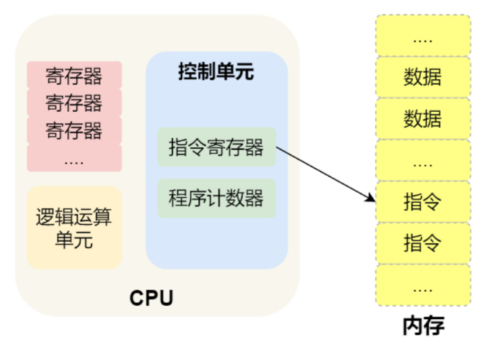
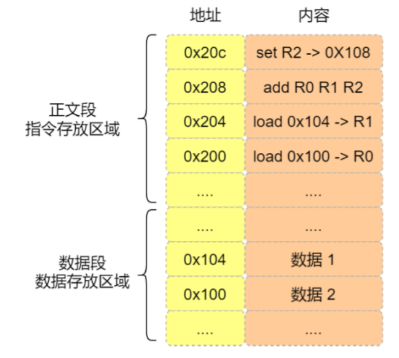

## CPU是如何执行程序的

### 冯诺依曼结构

冯诺依曼结构将计算机分成了五个部分，分别是中央处理器（CPU），内存，总线，输入输出设备


- **内存：**程序和数据都存储在内存中，而且存储的区域是线性的，数据存储的单位是一个二进制位(bit)，即0或1，最小的存储单位是字节，1字节等于8位，内存的地址从0开始，然后自增排序，最后一个地址是`总字节数-1`，这种结构类似于程序中的数据，所以内存中读取任何一个数据的速度都想相同的

- **中央处理器：**也就是常说的CPU，目前常见的有32位和64位的CPU，**这里的32位和64位指的是CPU的位宽，**这两个区别在于

  - 32位表示一次能够计算一个32位的数据，处理4个字节
  - 64位表示一次能够计算一个64位的数据，处理8个字节

  假设有一个8位CPU，那么他能够计算的范围就是`0~255`，他就不能计算出`100*100`，所以CPU的位宽越大，能够计算的数值也就越大，比如说32位计算机上能够计算出的最大整数是`2^32 - 1`

  CPU内部还有一些组件，主要包括寄存器、控制单元和逻辑运算单元，控制单元的作用是控制CPU工作，逻辑运算单元的作用是负责计算，而寄存器可以分为多种类，每种寄存器的作用也是不相同的，但是概括地说寄存器的作用就是存储计算时的数据（包括指令），寄存器分为以下几种：
  
  - **通用寄存器：**用来存放需要进行计算的数据，比如加和操作中的两个操作数
  - **程序计数器：**用来存储下一条指令的内存地址，也就是指令的内存地址
  - **指令寄存器：**用来存储程序计数器中地址指向的指令，也就是指令本身，指令执行完之前都会被存放在这里
  
  > 寄存器是用来存储程序运行时的数据的，内存也是，为什么有了内存还要有寄存器呢？因为内存距离CPU的距离较远，而寄存器就在CPU里面，挨着控制单元和逻辑运算单元，所以寄存器的效率会更高
  
- **总线，**总线用于CPU和内存以及其他设备之间的通信，主要包括三类：

  - 地址总线：用于指定CPU将要操作的内存地址
  - 数据总线：用于读写内存的数据
  - 控制总线：用于发送和接收数据，比如中断、设备复位等信号，CPU收到中断信号之后肯定要去处理，这时也用到了控制总线

  CPU读写内存数据的时候用到了两个总线：使用地址总线找到数据在内存中的位置，然后使用数据总线将数据从内存读写进CPU寄存器中

- **输入输出设备：**输入设备向计算机输入数据，计算机经过计算之后，把数据输出给输出设备，期间，如果输入设备是键盘，那么按下键时要通过控制总线和CPU进行交互


### 线路位宽和CPU位宽

上面介绍了冯诺依曼结果中的五种组成设备的作用以及大致组成，那么数据到底是怎样在线路中传输的呢？答案是用过高低电压，高电压表示1，低电压表示0，所以`高低高`这样的信号可以使用`101`来表示，那么这个信号就可以表示十进制的5，如果只有一条线路，那么在同一时刻只能发送一个bite的数据，也就是只能发送一个0或者一个1，很显然，如果想要发送一个`101`，那么就需要经过三次传输，这样的操作效率很低，上面这种方式叫做**串行**，也就是说只能一个比特一个比特的顺序发送，当然如果想要一次性发送多个bite，可以通过增加线路的方式来实现**并行传输**

**为了避免低效的串行方式，线路位宽最好是能够一次性访问全部的内存地址，**CPU想要操作内存地址的话就需要地址总线，对于4G的内存空间，就需要32根地址总线和32根数据总线，因为`2^32=4G`，通过32根地址总线能够一次性访问到全部的内存地址，而且32根数据总线能够一次传输32bit的数据，所以**线路位宽指的是地址总线&数据总线的条数，线路位宽表示了一次性能够传输多少的数据**

**对于CPU位宽，其大小最好是大于等于线路位宽，**比如用32位的CPU去控制40位宽的地址总线和数据总线的话，32位的CPU一次性处理不了40bit的数据，而且也访问不到`2^32`之外的内存地址，所以需要进行一些特殊操作，总之，如果CPU位宽小于线路位宽，工作起来就会非常复杂而且麻烦

```
如果使用32位的CPU来计算两个64位数字的加和，CPU是一次性解决不了的，具体的操作过程是：这两个64位的数字会首先被分成2个低位的32位数据和两个高位的32位数字，先算两个低位数字的加和和进位，再算两个高位数字并加上进位
而如果是一个64位的CPU的话，可以一次性计算出两个64位数字的加和
```

但是上面并不能够说明64位的系统比32位的系统好，因为只有当计算超过了32位的数字的时候64位系统才能够体现出优势，而目前应用中的数据能够超过32位的也不多

**另外，32位CPU能够控制的内存是4G(2^32)，所以即使给32位的系统装上8G的内存条也不管用，而64位CPU能够管理$2的64次方$的内存空间    **


### 指令执行的基本过程

程序实际上是由一条条的指令组成的，所以程序运行的过程就是把每一条命令一步步的执行起来，负责执行指令的就是CPU了



- 第一步，CPU需要读取**程序计数器**中的数据，因为程序计数器中存储的是指令在内存中的地址，所以当CPU读取到这个地址之后，会**调用控制单元操作地址总线**指定需要访问的内存空间，接着通知内存设备准备数据，数据准备好了之后通过**数据总线**将数据加载到指令寄存器中
- 第二步，CPU解析**指令寄存器**中的指令类型，确定指令的类型和参数，如果是计算类型，那么就将这条指令交给**逻辑运算单元**来进行处理，如果是存储指令，那么就将指令交给**控制单元**来进行处理
- 第三步，当指令执行完成之后，**程序计数器**进行自增操作，因为要去执行下一条指令了，这个自增的大小是要根据CPU的位宽来决定的，比如32位的CPU，自增的大小就是4字节，因为32位CPU的指令就是4字节，需要4字节的内存地址存放

**综上，一条指令的执行过程首先是从程序计数器中得到指令在内存中的地址，然后CPU通过控制单元调用地址总线来找到指令的位置，通知内存设备准备数据，数据准备好了之后通过数据总线传输至指令寄存器，紧接着CPU分析指令的类型和参数，发送者相应的设备（逻辑运算单元/控制单元）进行处理，处理完成之后，程序计数器根据指令长度自增，准备处理下一条指令**

CPU从程序计数器中读取指令内存地址，到指令执行 结束，再到下一条指令执行，这个程序会不断循环，直到所有的指令执行完毕，程序执行结束，这个不断循环的过程称为**CPU周期**


### a=1+2的执行过程

首先需要明确的是CPU是不认识`a=1+2`这个字符串的，这个字符串只是为了方便程序员的理解，所以为了让这个字符串跑起来，我们需要对整个程序进行**编译**，经过编译之后的代码叫做汇编代码，机器仍然是不认识汇编代码的，所以还需要对汇编代码进行翻译，翻译成**机器码，**机器码是由0和1组成的机器语言，这一条条的机器码实际上就是一条条的指令，这才是CPU真正认识的东西

下面我们来看一下`a=1+2`的执行过程，首先CPU在进行编译的过程中，发现1和2是数据，所以就会把它们放到一个特定的区域叫做**数据段（内存专门用来存储数据的一段区域），数据的大小是根据程序中指定的类型决定的，int是4个字节，char是1个字节**如下图



从图中也可以看到，指令和数据是分开存放的，存放指令的区域叫做**正文段**

编译器会把`a=1+2`翻译成4条指令（**<font color=red>为了好理解，图中把本来应该是二进制串的指令换成了汇编代码</font>**），分别放入到正文段中，因为是32位的系统，所以每个指令有4个字节，分别是

- 将数据2装入寄存器R0中（这个R0,R1,R2寄存器应该是通用寄存器）
- 将数据1装入寄存器R1中
- 将R0寄存器中的内存和R1寄存器中的内容相加，结果放入寄存器R2中
- 将R2寄存器中的内容放入到数据段中，位置是`0X108`，这个地址也就是变量a的地址

编译完成之后，程序计数器中的值会被设置为`0x200`，然后依次执行这四条指令


### 指令

上面我们说到了，一段程序首先经过编译，成为汇编代码，然后在经过翻译，编程机器码，而这个机器码是CPU能够认识的指令，也就是他是一串的二进制数字，每条指令都有对应的机器码，CPU通过机器码来知道指令的内容

**不同的CPU对应着不同的指令集，也就是对应着不同的汇编代码和机器码**，下面选用的是最简单的MIPS指令集，其中的每个指令都是32位，高6位代表操作码，表示这这是一个什么样的指令，剩下的26位不同指令类型所表示的内容也不相同，主要有R,I,J三种类型


- R指令：用在计算和逻辑操作，里面包含了读取和写入数据的三个寄存器地址（`rs,rt,rd`），如果表示的是逻辑唯一操作，后面还有位移量，最后的功能码则是前面操作码不够时，用来拓展对应的操作码表示响应的指令的
- I指令：用在数据传输、条件分支等，这个类型的指令，就没有了位移量和功能码，也没有了第三个寄存器，而是把这三个部分合并成了一个地址或者一个常数
- J指令：用在跳转，除了操作码，后26位都表示的是一个跳转后的地址

我们看一下`add R0 R1 R2`这条指令的机器码，如下图


- MIPS中制定了add的操作码和功能码，因此这两个都是固定的
- rs,rt,rd分别表示三个寄存器的位置
- 因为这是一个计算操作，没有发生位移，所以位移量都是00000

把上面的这些数据组合起来就是这条汇编语言的机器码，用16进制表示就是`0x00011020`

编译器在编译程序的时候会构造指令，这个过程叫做程序的编码，CPU执行程序的时候会解析指令，这个过程叫做指令的解码


现代大多数的操作系统会通过上面这种流水线的方式进行工作，即把一个大任务拆分成多个小任务，于是一条指令就分成了4个阶段，称为4级流水线，具体每个阶段所做的过程如下：

- CPU通过程序计数器、控制总线、数据总线等将指令加载到指令寄存器中，这个过程叫做`Fetch`
- CPU对指令进行解析，看看它有哪些参数、是什么类型的，这个过程叫做`Decode`
- CPU执行这个指令，这个过程叫做`Execute`
- CPU将执行后的结果存回寄存器或者将其存入内存中，这个过程叫做`Store`

上面的四个阶段我们叫做一个**指令周期**，CPU的工作就是一个周期接着一个周期，周而复始！

上面的不同节点，也是由计算机中不同的组件来完成的，如下图


- 取指令阶段：我们将指令存放在存储器中，实际上我们通过程序计数器和指令寄存器取出指令的过程是由**控制单元（控制器）**来完成的
- 指令译码阶段：这个阶段也是通过**控制器**来完成的，控制器将指令解析成不同的操作信号以及地址和操作数
- 指令执行的过程中无论是算术运算还是逻辑运算，包括条件分析判断、跳转等都是由算术逻辑单元也就是**运算器**来完成的，但是如果是一个无条件地址跳转，则是直接在控制器里面完成的，不需要使用运算器


### 指令的类型

指令分成了5个类型

- **数据传输类型的指令，**比如`store/load`是寄存器和内存之间数据传输的指令，`mov`是将一个内存地址的数据移动到另一个内存地址中
- **运算类型的指令，**比如加减乘除，位运算，比较大小等，但是他们最多只能处理两个寄存器中的数据
- **跳转类型的指令，**通过修改程序计数器中的值来达到跳转的目的，比如`if-else,switch-case`等
- **信号类型的指令，**比如中断的指令`trap`
- **闲置类型的指令，**比如`nop`指令，可以让CPU空转一个周期


### 指令的执行速度

CPU硬件中都有`GHZ`这个参数，`1GHZ`就表示**时钟频率**是`1GHZ`，即1s会产生1G的脉冲信号，每发生一次脉冲信号，就会产生一次高低电平的转化，**每一次脉冲信号高低电平的转换就是一个时钟周期，时钟周期=1/时钟频率**，对于CPU来说，在一个时钟周期内，仅能够完成一个最基本的操作，也就是说一个指令并不一定会在一个时钟周期内完成，所以<font color=red>时钟周期是计算机中最基本、最小的时间单位</font>

**对于CPU来说，时钟频率越大，时钟周期越短，工作速度就越快**


> **那么如何让程序执行的更快的**

程序执行过程中，如果CPU执行的时间越短，我们就说程序执行的时间越快，对于CPU的执行时间，可以拆解成

$CPU的执行时间=CPU时钟周期数 × 时钟周期时间$

对于时钟周期的时间，我们可以通过升级硬件，从而提高时钟频率来达到降低时钟周期时间的目的，但是这并不是软件工程师应该考虑的问题，我们应该考虑怎么把已有硬件的性能应用到极致，而且提高CPU的时钟频率（主频）目前也很难做到了，我电脑是2.5GHZ

而对于CPU时钟周期数我们又可以拆解成

$CPU时钟周期数=每条指令的平均时钟周期数×指令的条数$

所以说CPU的执行时间又可以被表示成以下三个的结合

$CPU的执行时间=每条指令的平均时钟周期数×指令的条数 × 时钟周期时间$

想要程序跑得快，优化这三者即可

- 指令数，这个主要是由编译器决定的，因为不同的编译器对同一段代码的编译结果，翻译出来的机器码都是不一样的，所以这个层面基本都是靠优化编译器
- 每条指令的平均时钟周期数（Cycles Per Instrction,CPI），现代大多数CPU都是通过流水线技术，这一技术也让CPI有所下降
- 时钟周期时间，降低他就意味着要调高CPU主频（时钟频率），但是调高主频会增加CPU的散热负担（比如超频技术），容易导致CPU过热而奔溃


### 今天学习的上述知识中，有两个常见问题

#### 64位的CPU计算性能一定比32位的CPU好吗，64位的优势在什么地方

- 首先64位CPU的计算性能并不一定比32位的好，当数据没有超过`2^32`次方的时候，64位CPU和32位CPU的计算性能相差不大，但是当数据超过了`2^32`次方，64位的计算性能就要优于32位CPU了，因为32位CPU不能一次性计算出这个数了，需要分步计算，但是实际上，应用程序中的数据一般来说不会那么大
- 除了上面的这个优势，64位CPU的优势还在于它有更大的寻址空间，32位CPU的寻址空间只有`2^32=4G`，因此即使给32位的计算机加上一个8G的内存条也是没有作用的，而64位CPU的寻址空间能够到达`2^64`次方，远超过32位的寻址空间（寻址空间大就意味着能够使用更多的内存）


#### 32位软件和64位软件的区别是什么？32位的操作系统能不能在64位操作系统上运行，相反，64位的操作系统你能不能在32位上运行

<font color=red>首先32位和64位软件的区别就在于他们的指令一个是32位，一个是64位</font>

我们知道操作系统也是一个软件，所以只要提供一套兼容机制，32位的操作系统想要在64位操作系统上运行是可行的，但是64位的OS不能够在32位OS上运行，因为32位的操作系统没有办法存储64位操作系统的指令（操作系统其实也是一种程序，我们可以看到操作系统也分成了64位，32位，其代表的意义就是操作系统中的指令是多少位，比如64位的操作系统，指令也是64位，因此不能够装在32位的机器上）

**硬件的32位和64位表示的是CPU的位宽，软件的32位和64位表示的是指令的长度**

