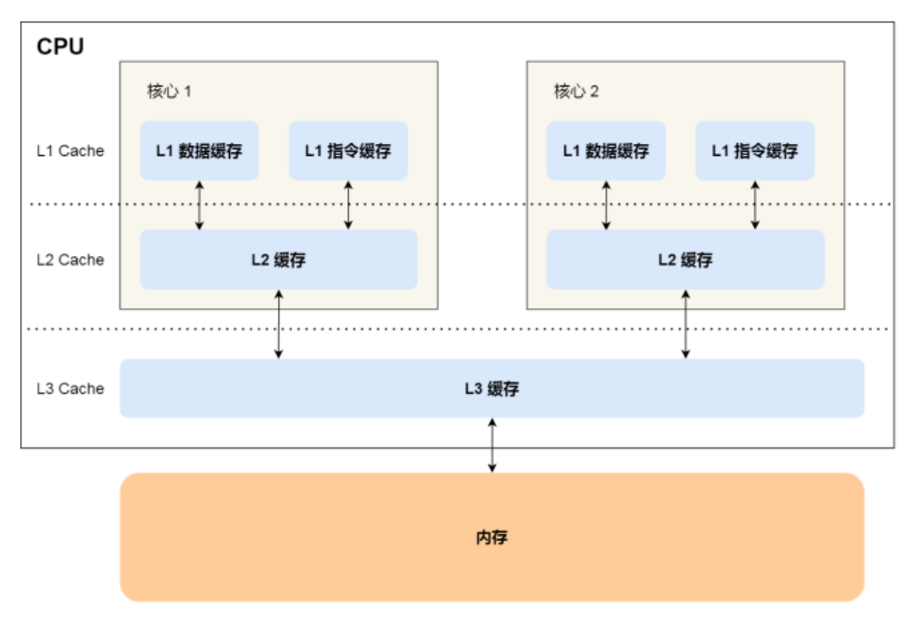
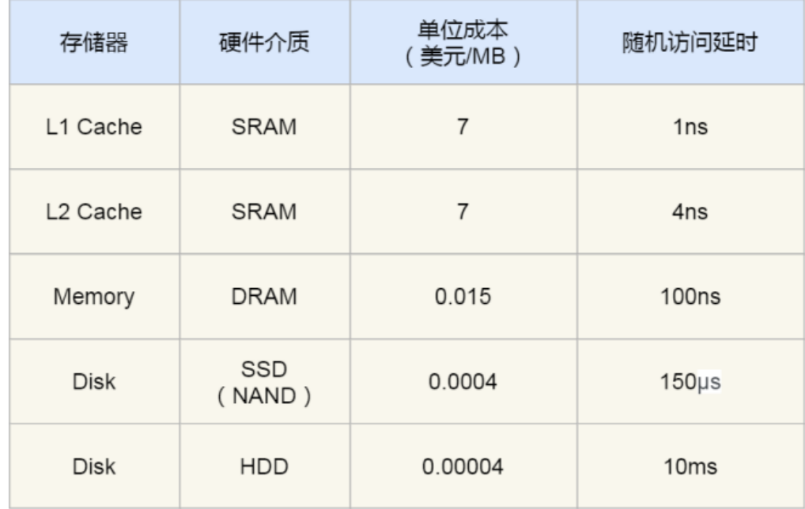
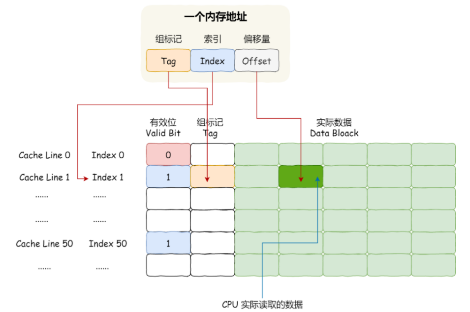
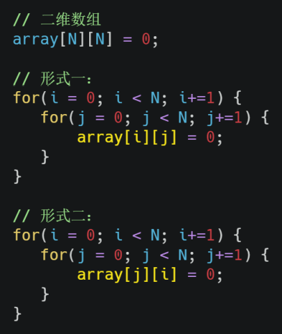
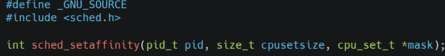

## 存储器

对于存储器而言，速度越快，能耗为高，价格越贵，所以容量越小

### 存储器介绍

存储器通常分为下图中的几个级别：寄存器，CPU Cache（L1,L2L,L3），内存，SSD/HDD硬盘


- **寄存器**是最靠近CPU控制单元和逻辑运算单元的存储器，因此他的速度是最快的，材料是最贵的，所以一个CPU中不能够有太多的寄存器，通常一个CPU中会有几十到几百个寄存器，每个寄存器能够存储一定字节（byte）的数据

  - 比如32位的寄存器通常能够存储4个字节的数据
  - 64位寄存器通常能够存储8个字节的数据

  寄存器的速度非常快，一般要求在半个CPU时钟周期内完成，比如2GHz的主频的CPU它的时钟周期是1/2GHz，也就是0.5ns

  CPU在处理一条指令时，除了要读写寄存器，还要对指令进行解码，运行等，所以如果寄存器的读写速度太慢的话，就会给用户一种电脑很卡的感觉

- **CPU Cache**用的是一种叫做SRAM的芯片（Static Random-Access Memory，静态随机存储器）

  在SRAM中，一个bit的数据通常需要6个晶体管，所以SRAM的存储密度不大，同样的物理空间下，SRAM能够存储的数据很有限，不过因为SRAM的电路比较简单，所以访问起来很快

  CPU Cache分为三级缓存，分别是L1 Cache，L2 Cache，L3 Cache，速度依次降低，容量依次增大

  

  - L1 Cache的速度也很快，和寄存器差不多，大约2-4个时钟周期，所以L1 Cache分为两个部分，数据缓存和指令缓存，即数据和指令在L1 Cache中是分开存储的，从上图中也可以看到L1 Cache和L2 Cache是每个CPU独有的

    ```shell
    # 在Linux系统中查看L1 Cache的数据缓存大小
    cat /sys/devices/system/cpu/cpu0/cache/index0/size
    # 查看L1 Cache的指令缓存的大小
    cat /sys/devices/system/cpu/cpu0/cache/index1/size
    ```

  - L2 Cache同样是每个CPU核心独有的，L2 Cache距离CPU更远了，因此访问时间就更长了，大约10-20个时钟周期，但是他的容量也更大了，通常是几百k到几兆不等

    ```shell
    # 在Linux系统中查看L2 Cache的缓存大小
    cat /sys/devices/system/cpu/cpu0/cache/index2/size
    ```

  - L3 Cache是多个CPU核心共用的，位置比L2 Cache距离CPU要远，因此访问速度慢，大约在20-60个时钟周期，容量变大了，在几兆到几十兆之间不等，具体需要根据CPU的型号来判断

    ```shell
    # 在Linux系统中查看L3 Cache的缓存大小
    cat /sys/devices/system/cpu/cpu0/cache/index3/size
    ```

  


- 内存，内存使用的DRAM（Dynamic Random Access Memory，动态随机存储器）芯片，相比于SRAM，DRAM的存储密度更高，他有更大的容量和更低的造价

  存储1bit的数据只需要一个晶体管和一个电容，但是因为数据会被存储到电容里面，电容会不断漏电，所以需要定时刷新电容，才能保证数据不会被丢失，这就是DRAM之所以被称为动态存储器的原因，只有不断刷新，数据才能够被存储起来 DRAM的数据访问电路和刷新电路都比SRAM复杂，所以访问的速度会更慢，内存速度大概在200~300个时钟周期之间

- SSD/HDD硬盘，SSD(Solid-state Disk，固态硬盘)结构和内存类似，但是断电之后，硬盘中的数据不会消失，而寄存器、高速缓存、内存中的数据都会消失，内存的读写速度大概要比SSD快10-1000倍

  当然还有一款传统的硬盘，也就是HDD(Hard Disk Driver)，它是通过物理读写的方式来访问数据的，因 此他的访问速度是非常慢的，他的速度比内存慢了10w倍左右 由于SSD的价格与HDD的价格慢慢接近了，因此SSD正在逐步的取代HDD


### 存储器的层次关系

CPU并不会直接和每一种存储器打交道，而是每一种存储器设备都只会和他相邻的存储器打交道，比如CPU Cache中的数据都是从内存中加载过来的，写回数据的时候也只会写回到内存，而不会写回到硬盘，CPU Cache读取数据的时候也不会直接从硬盘中读取，而是先从硬盘中读取出数据到内存，然后再在内存中将数据读取到CPU Cache中


实际上，CPU想要获取数据的时候，会先从寄存器中查找，如果寄存器中没有，那么回向L1缓存中查询，之后是L2 Cache，L3 Cache，如果都没有的话，才会向内存中查找，如果内存中还是没有，就只能去硬盘中查找，所以**存储层次也形成了缓存体系**





## CPU Cache的数据结构和读取过程

首先，由于CPU和内存之间的速率相差很多，所以为了弥补两者之间的差距，在两者之间就放上了一层缓存，叫做CPU Cache

我们知道，程序的执行都是在CPU中进行的，那么如果CPU进行运算时，直接从高速缓存中读写数据，而不是从内存中读取数据，那么运算速度自然就会很快

从前面我们也说到了，存储器中的某一层只会和他相邻的层进行数据交换，所以CPU Cache中的数据是从内存中读取来的，那么这个读取过程是怎样的呢？**事实上，CPU Cache从内存中读取数据是一块一块的读的，而不是一个字节一个字节的读，在CPU Cache中，这样一块一块的数据被称作Cache Line，而这一块块的数据在内存中叫做内存块**

```shell
# 在Linux中查看cache line的大小
cat /sys/devices/system/cpu/cpu0/cache/index0/coherency_line_size
64
# 一般情况下，cpu L1 Cache的cache line的大小位64个字节
```

比如有一个`arr[100]`长度为100的`int`类型数组，当载入`arr[0]`的时候，会同时把后面的数据也加载进去，从`arr[0]`到`arr[15]`，这16个数据，一共64个字节，所以说，当CPU再次访问`arr[1]...arr[15]`的时候，会直接从CPU Cache中找到，这也就会加速CPU的运算过程

前面我们也提到过，CPU读取数据的时候，会先从CPU Cache中查找，没有找到再去内存中找，如果内存中还没有就在去硬盘中找

 

综上，其实可以看出，CPU Cache是内存的一个缓存，就像内存是硬盘的一个缓存道理是一样的，如果缓存中有数据，我们就不需要再去更慢的下层查找了


> **<font color=red>那么问题来了，CPU是怎么知道数据是否在CPU Cache中的呢，如果在的话，又如何在Cache中取出数据呢</font>**

下面将以**直接映射Cache（Direct Mapped Cache）**这种方法说

前面说到了，CPU读取内存数据是一块块的读取的，在一块的数据在CPU Cache中叫做Cache Line，在内存中叫做内存块（block），**读取的时候我们要拿到内存块的物理地址**

对于直接映射Cache这种方法，**策略就是使用取模运算把内存块时钟映射在一个Cache Line上**，如下

```shell
# 比如目前内存被划分成了32个内存块，CPU Cache中共有8个Cache Line，假设CPU想要访问15号内存块，如果这个15号内存块已经被缓存在CPU Cache中的话， CPU应该去第7个Cache Line上找，因为15 % 8 = 7
```

但是，我们很容易就能够发现，这种方式其实会把多个内存块映射到一个Cache Line上，比如7，15，23，31号内存块都会被映射到7号Cache Line上，如下图


**那么我们是如何区分同一个Cache Line中不同的block呢，答案是使用<font color=red>组标记（tag）</font>，这个组标记会记录当前Cache Line中对应的是那一个内存块，**除此之外，Cache Line中还有两个信息，分别是

- 一个是 从内存中加载进来的**实际存放的数据**data
- 另一个是 **有效位**，如果Cache Line中的有效位是0的话，那么CPU会直接去内存中获取数据，而如果有效位是1的话，CPU就会直接获取Cache Line中的数据

我们知道，CPU在Cache Line中读取数据的时候不是读取整个的Cache Line，比方说前面的例子，一个Cache Line中存放的是`arr[0]到arr[15]`，CPU不可能一口气把这16个数据都读进去，而是一个个的读，所以我们把CPU所需要的一个数据片段叫做一个**字（word）**，那么怎么在**对应的**Cache Line找到对应的字呢？答案是需要一个**偏移量**

**综上，我们就能够发现，**

- **一个内存的访问地址包含了三个信息，分别是：索引，组标记，偏移量，通过这三个信息能够找到Cache Line中缓存的数据**
- **一个Cache Line的数据结构包含了四个信息，分别是：索引，组标记，有效位，真实数据**



如果Cache Line中包含了内存中的数据，那么过程如上图所示，功能分成四步：

- 根据内存中的索引地址，找到对应的Cache Line的地址
- 找到对应的Cache Line之后，再去判断一下有效位，如果是0的话，CPU直接去内存中读数据，如果是1的话，在进行下面的操作
- 对比内存地址和Cache Line中的组标记，确认Cache Line中的数据是不是我们要找的，如果不一样的话，CPU直接去内存中找，并重新加载数据，如果是的话，继续往下执行
- 根据内存地址中的偏移量，从Cache Line中的数据块中找到对应的字


> PS:除了直接映射cache之外，还有其他的映射方法，比如全相连Cache，组相连Cache等，这几种策略的数据结构都比较相似


## 如何写出让CPU跑的更快的代码

前面我们提到过，如果CPU访问数据的时候，是在CPU Cache中直接获取，而不是去内存中获取的话，CPU的运算效率会得到很大的提高，**因此如何写出让CPU跑的更快的代码可以转换成另一个问题：如果提高CPU Cache的缓存命中率**

我们知道CPU的L1 Cache分成了两个部分，数据缓存和指令缓存，因此我们也要从这两个角度分别来看

### 如何提高数据缓存的命中率



首先，看一下上图中，遍历一个二维数组的两种不同表现方式，这两种方式很明显是第一种方式的缓存命中率更高，因为在内存块中数据时连续排列的（在day01.md中说冯诺依曼结构中就已经说过了，内存是线性结构），所以如果CPU Cache中没有`arr[0][0]`的话，CPU回去内存中查找，找到之后不但会把`arr[0][0]`加入到缓存中，还会把后面的几个数字`arr[0][1],arr[0][2],...`都放到缓存中，能够加载多少需要看Cache Line的大小了，这样后面再进行遍历的时候可以直接在CPU Cache中找到

而对于形式二，使用`arr[j][i]`这种方式是跳跃性的，所以当N很大的时候，我们不能够保证`arr[j+1][i]`也在CPU Cache中，所以这种方式很明显缓存命中率低，因为他不能够充分地利用CPU Cache，从而代码性能不高


**所以，当遇到遍历数组这种情况的时候，按照内存布局顺序进行访问，可以有效地利用CPU Cache，这样会使我们的代码有很大的提升**


### 如何提升指令缓存的命中率


上图中，`arr`是一个由`0-100`之间的随机数组成的一个一维数组，对这个数组做两个操作，一是数组遍历，二是数组排序

> 问题来是，是先将比50小的数组元素置为0，再排序；还是先排序，再把比50小的数组元素置为0，哪种方法更快

```shell
# 在回答这个问题之前，我们首先了解一下CPU的分支预测器，对于if语句，意味着此时至少可以选择跳转到两段不同的指令执行，也就是if还是else指令，那么如果分支预测器可以预测出接下来是要执行if下的指令，还是else下的语句的话，就可以提前把这些指令放到指令缓存中，这样CPU就可以直接从Cache中读取到指令，于是执行速度就会很快
```

当数组中的元素是随机的时候，分支预测器就没有办法很好地去预测执行哪些指令，而当数组中的元素是顺序的时候，分支预测器会动态的根据历史命中数据对未来进行预测，这样效率就会很高

因此，先排序在遍历速度会更快，这是因为在排序之后，数字是从小到大的，那么前几次循环命中 if < 50 的次数比较多，于是分支预测里就会缓存 if 里的 array[i] = 0 指令到Cache中，后续CPU执行该 指令就只需要从Cache中读取即可 

如果你肯定代码中的 if 的表达式判断为 true 的概率比较高，我们可以使用显示分支预测工具，比如在 C/C++ 语言中编译器提供了 likely 和 unlikely 这两种宏，如果 if 条件为 true 的概率大，则可以用 likely 宏把 if 里的表达式包裹起来，反之用 unlikely 宏


**实际上，CPU自身的动态分支预测已经非常准了，所以只有当确信CPU预测的不准，且能够知道实际概率的情况下，才建议使用上面的两种宏**


### 提高多核CPU的缓存命中率

在单核CPU上面，虽然同一时刻只能够运行一个进程，但是操作系统会分给每个进程一个时间片，时间片用完之后就去调度下一个进程，于是各个进程就按照时间片交替地占用CPU，从宏观上来看是在同时运行

现代CPU都是多核的，进程可能在不同的核心之间来回切换，这对CPU Cache是不利的，虽然L3 Cache是允许多个核心共享数据，但是L1 Cache和L2 Cache都是每个核心独有的，**如果一个进程在不同核心之间来回切换，那么它的缓存命中率肯定会降低**，相反，如果进程只在一个核心上运行，那么其数据的L1 Cache和L2 Cache缓存命中率都会提高，缓存命中率高就意味着CPU可以少访问内存

当有多个同时执行计算密集型的进程的时候，为了防止进程在不同核心之间切换导致缓存命中率降低的问题，我们可以把进程绑定到一个CPU核心上，这样性能就能够得到非常可观的提升

在Linux中提供了`sched_setaffinity`一个方法，可以把进程绑定到某个特定的CPU核心上



