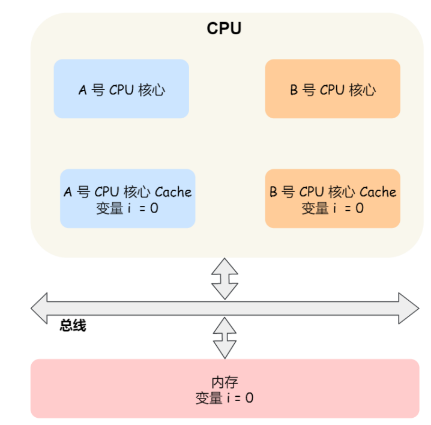

## CPU缓存一致性问题

根据摩尔定律，CPU的访问速度每18个月就会翻倍，也就是每年增长60%左右，内存的速度当然也会不断增长，但增长速度远远小于CPU，平均每年只会增长7%左右，于是，CPU与内存的访问性能的差距不断被拉大，所以为了平衡CPU和内存之间的速度差异，在CPU和内存中间又加上了一层cache，充当内存的缓存

在前面我们已经知道了，CPU Cache分成了三层，L1 Cache和L2 Cache是CPU独享的，而L3 Cache是可以被不同CPU核心共享的。同时我们知道CPU从内存中读取数据的基本单位是Cache Line，Cache Line的结构是由 `索引 + 组标记 + 有效位 + 实际数据`构成，如下图（下图中把前三个合并到了一起，用Tag表示，实际上组标记也是用tag来表示）

在`如何写出让CPU跑的更快的代码`这一章节的时候，我们说到，我们需要尽可能地让CPU在CPU Cache中读取数据，因为这样能够提高性能。事实上，当CPU处理完数据之后，会将数据写回到CPU Cache中，这个时候CPU Cache和内存中的数据是不一样的，因此我们需要采取措施来保证CPU Cache和内存中数据的一致性

保证CPU Cache和内存中的数据一致性有两种方法：

- 写直达（write through）
- 写回（write back）

下面我们来看一下这两种方法

### 内存和CPU Cache数据一致性问题

#### 写直达

写直达的意思就是当CPU把数据写回到CPU Cache中的时候，同时把内存中的数据也更新了，即**把数据同时写入内存和CPU Cache中**，这是保证内存和CPU Cache数据一致性的最简单的方式，流程如下：

在写直达的方法中，写入内存之前会先判断一下CPU Cache中是否有对应的数据，如果有的话，把CPU Cache中的数据也更新了，如果没有的话，数据直接写入到内存中

从上面的流程中可以发现，**不管CPU Cache中有没有数据，CPU都会把数据写入到内存中**，每次写操作都会写到内存中，这样写操作会浪费大量的时间，无疑CPU的性能会受到影响

#### 写回

即然写直达方法中每次写操作都会将数据写入到内存中，从而导致性能降低，那么我们就要想办法**减少数据写入到内存中的频率**，于是就有了一种新的方法，写回（write back）

从上图中可以发现，**在写回机制中，只有不在CPU Cache中的数据并且只有修改过的Cache Block被替换时，数据才会被写回到内存中**

下面来具体解释一下上图中的过程：

- 当发生写操作的时候，如果在CPU Cache中能够找到这个数据，那么只需要把这个数据更新到CPU Cache中，并把相应的Cache block标记为脏（dirty），这个脏标记表示着CPU Cache中的数据和内存中的数据是不一致的，这种情况下数据是不需要写回到内存中的
- 在发生写操作的时候，如果在CPU Cache中找不到这个数据，那么我们就需要将其写入到对应的Cache Block中（通过内存地址（索引 + 偏移量 + 组标记）来找到相应的Block），但是此时的Block上可能会有其他的数据，因此这里就需要进行判断了，如果对应的Block被标记为脏，这就意味着他上面有数据而且目前Cache中的数据和内存中的数据是不一致的，因此这个时候需要把这个数据写回到内存，然后再把当前想要写入Cache的数据写进来，同时把这个Block标记为脏；而如果对应Block未被标记为脏，那么即使他有数据，Cache和内存中也一样，也是没必要写回的，所以直接把当前想要写入Cache的数据写到这个Block上就可以了

> 上面说到了CPU Cache和内存之间数据一致性的问题，那么还有一个问题，我们知道现代计算机中CPU会有多个核心，而每个核心中的 L1和L2 Cache都是被核心独自占有的，所以我们**怎么样保证不同核心中缓存的一致性呢**？

### 不同核心之间的缓存一致性问题

#### 写传播和事务串行化

我们通过一个含有两个核心的CPU作为例子来看一下不同核心之间缓存一致性问题是怎么产生的

上图中的两个核心中分别运行着一个线程，都操作着共同的变量 i（初始值为0），这时如果A号核心执行了`i++`操作，考虑到性能，我们使用了前面的写回策略，因此A号核心并不会把`i=1`写回到内存中，而是放入自己的L1/L2 Cache中，**然后把L1/L2 Cache标记为脏（一定不要忘了）**，这时候数据其实是没有被写回到内存中的，因为写回策略只有在A号核心中的这个CPU Block要被替换时，数据才会写入到内存中 这时如果B号核心去内存中读取 i 变量的值，读到的将会是一个错误的值，因为刚才A号核心更新i值还没有写入到内存中，内存中的值还是0，这就是所谓的缓存一致性问题，A号核心核B号核心的缓存，在这个时候是不一致的，从而导致执行结果的错误，如下图：

那么要解决上述缓存一致性的问题，就需要一种机制来同步两个核心里面的缓存数据，要实现这种机制的话，要保证做到以下两点：

- 第一点：某个CPU核心里面的Cache数据更新时，必须要传播到其他核心的Cache中，这个称为**写传播**
- 第二点：某个CPU核心对数据的操作顺序，必须在其他核心看起来是一样的，这个称为**事务的串行化**

第一点的写传播很容易理解，当某个核心在Cache中更新了数据，就需要将更新同步到其他核心里的 Cache中，而对于第二点事物的串行化，我们来举一个例子 假设我们有一个含有4个核心的CPU，这四个核心都操作共同的变量i（初始值为0），A号核心先把i值变为100，而此时同一时间B号核心先把i值变为200，这两个修改都会传播到C，D核心中

那么问题就来了，C号核心先收到的是A号核心更新数据的事件，而D号核心先收到的是B号核心更新数据的事件，因此可以看到核心C中 i的变化是先100后200，而D号核心中i的变化是先200后100，虽然做到了写传播，但是两个核心中的数据还是没能保持一致那么问题就来了，C号核心先收到的是A号核心更新数据的事件，而D号核心先收到的是B号核心更新数据的事件，因此可以看到核心C中 i 的变化是先100后200，而D号核心中i的变化是先200后100，虽然做到了写传播，但是两个核心中的数据还是没能保持一致

**所以我们要保证C和D号核心都能够看到相同顺序的数据变化，比如变量都是先变成100再变成200这样，这样的过程就叫做事务串行化**

要实现事务的串行化需要做到以下两点：

- CPU中某个核心更改了Cache中的数据，需要通过总线广播到其他核心中
- 要引入锁的概念，如果两个CPU核心中有相同的数据Cache，那么对于这个Cache 数据的更新，只有拿到了锁才能够进行对应数据的更新

#### 总线嗅探

上面我们说到了要保证不同核心之间的缓存的数据的一致性，需要做到写传播和事务串行化这两点，那么实现这两点的方法是什么呢？

我们首先来看实现写传播的方法，写传播的原则就是当某个CPU核心更新了Cache中的数据时，要把该事件广播到其他核心中，最常见的实现方式是总线嗅探（Bus Snooping），还是以下图这个例子来说明总线嗅探

如果A号核心修改了自己L1 Cache中的 i 变量的数据之后，会通过总线把这个消息广播给其他核心，然后每个CPU核心会监听总线上的广播事件，并检查自己的Cache中是否相同的变量存在，如果B号核心的L1 Cache中也有 i 变量，那么B号核心也需要把 i 变量的值更新到自己的L1 Cache中

可以发现，**总线嗅探的方法很简单，CPU需要每时每刻监听总线上的一切活动，不管别的核心的Cache是否缓存了相同的数据，都需要发送出一个广播事件，这无疑会加重总线的负担**

可以看出，总线嗅探只是为了保证某个CPU的核心发生变化之后，能够被别的核心感知到，所以总线嗅探没有能够实现事务的串行化

**因此，就出现了一个基于总线嗅探的协议，名为MESI协议，实现了事务的串行化，也就是用状态机机制降低了总线的带宽压力，这个协议就是MESI协议，通过这个协议能够实现CPU不同核心之间的缓存一致性**

#### MESI协议

MESI其实是四个单词的开头，分别是`Modified(已修改)`，`Exclusive(独占)`，`Shared(共享)`，`Invalidated(已失效)`

这四个状态表示了Cache Line的四种不同状态：

- **已修改**就是我们前面提到的脏标记，代表该Cache 上的数据已经被修改过了，Cache和内存中的数据不一致了，但是还没有更新到内存中
- 而**失效**表示的是这个Cache 中的数据已经失效了，不能够读取这种状态下的数据
- **独占**和**共享**都表示Cache 中的数据是干净的（相对于脏标记），也就是说这个时候Cache 中的数据和内存中的数据是一致的
  - 独占状态表示数据目前只存储在一个核心的Cache 中，而其他CPU核心的Cache中没有这个数据，这时如果要向独占的Cache 写入数据，可以自由写入，而不需要通知其他核心，因为这个时候只有本核心中有这个数据，其他核心中不存在这个数据，所以也就不存在缓存一致性的问题了
  - 另外，在独占状态下的Cache Line，如果此时有其他核心读入了相同的数据到各自的Cache Line中，那么需要把独占状态修改成共享状态，同时，新放入的Cache Line也标记成共享状态
  - 共享状态代表着相同的数据在不同核心的Cache中都有，所以当我们想要修改某个核心中的Cache数据时，不能够直接修改，而是要在修改前，先广播给其他核心，让其他核心把它们对应的Cache Line标记成失效，然后再更新当前Cache中的数据

我们通过具体的例子来看看这四个状态的转换

1. 当A号核心从内存中读取变量i的值，数据被缓存在A号核心自己的Cache里面，此时其他CPU核心的Cache中没有缓存变量i，于是标记Cache Line状态为独占，此时，Cache与内存中的数据是一致的
2. 然后B号核心也从内存中读取了变量i的值，此时就会发送消息给其他核心，由于A号核心中已经缓存了该数据，所以会把数据返回给B号CPU核心，这个时候A和B核心缓存了相同的数据，Cache Line的状态就变成了共享，并且A,B的Cache与内存中的数据是一致的

3. 当A号核心要修改Cache中变量i的值，发现数据对应的Cache Line的状态是共享状态，则要向其他所有的核心发送一个广播请求，要求先把其他核心的Cache中对应的Cache Line标记为无效状态，然后A号CPU核心才更新Cache中的数据，同时标记Cache Line为已修改的状态，此时Cache中的数据就与内存不一致了
4. 如果A号核心继续修改CPU Cache中变量i的值，由于此时Cache Line是已修改的状态，因此不需要给其他CPU核心发送消息，直接更新数据即可
5. 如果A号核心的Cache里的i变量对应的Cache Line要被替换掉，发现Cache Line是已修改的状态，就会在替换前先把数据同步到内存中

**用一句话总结一下MESI协议：当Cache Line处于已修改或者独占状态时，核心修改其Cache中的数据不需要向其他核心发送广播，这从一定程度上减少了总线的压力，而且整个MSEI状态的变更则是根据来自本地的读写请求或者其他CPU核心通过总线传输来的读写请求，从而构成一个流动的状态机，因此能够保证事物的串行化**

