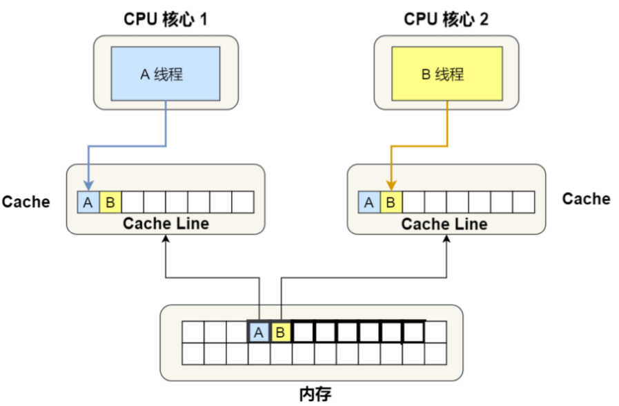
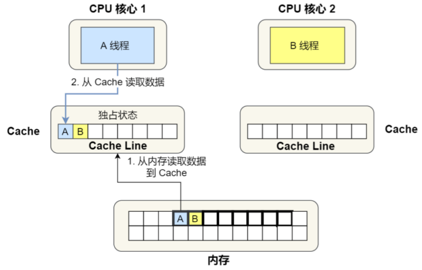
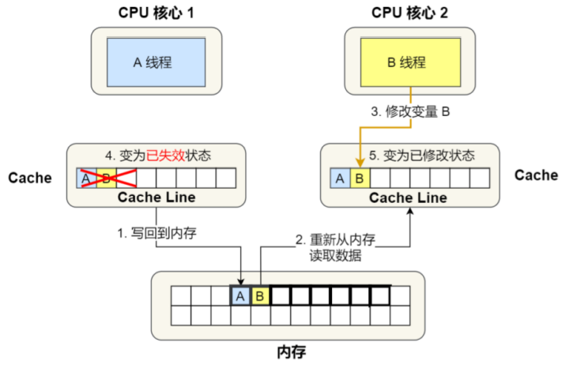
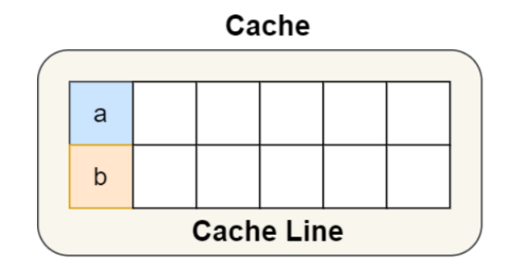
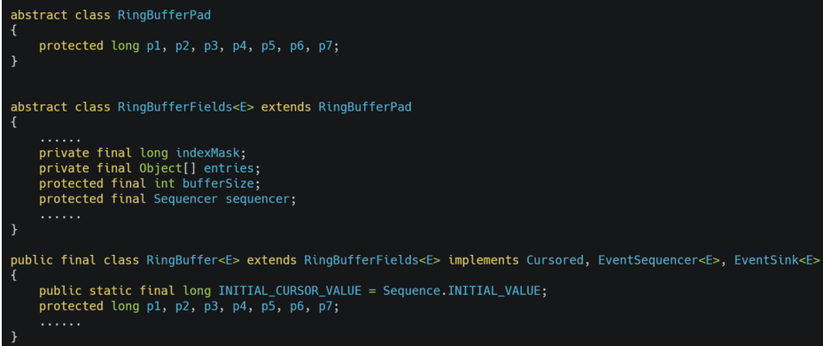
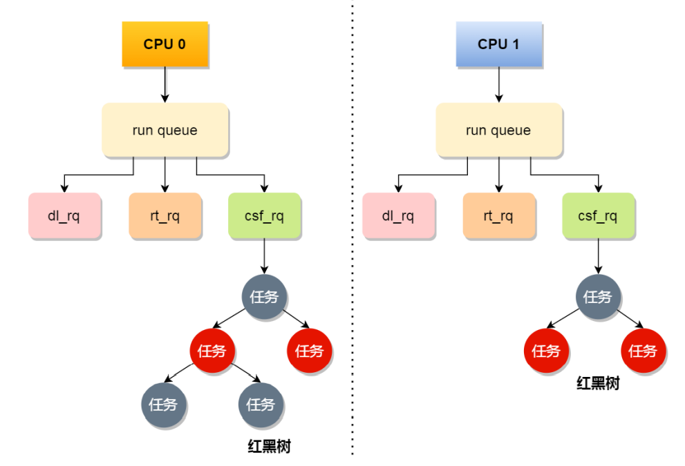

## CPU是如何执行任务的

 在前面我们说到过，如果想要写出让CPU执行更快的代码，需要提高CPU Cache的缓存命中率，即尽可能地让CPU在Cache中获取数据，而不用去内存中获取数据，而我们也知道，CPU从内存中读取数据到Cache的基本单位是block，在CPU Cache中叫做Cache Line，Cache Line的大小一般是64字节。对于数组的加载，CPU会一次性加载多个连续的数据到Cache中，因此我们应该尽量按照物理内存的地址分布的顺序去读取，这样访问数据的时候，Cache的命中率高，于是就能够减少 CPU从内存中读取数据的频率，从而提高程序的性能。

==但是当我们读取单个变量的时候，可能就会产生Cache伪共享的问题，Cache伪共享对性能的破坏很大，所以我们应该尽量避免他==


### 伪共享

那么什么是Cache伪共享呢？

**<font color=red>Cache伪共享（False Sharing）指的是多个线程同时读取同一个Cache Line中的不同变量时，导致Cache失效的情况</font>**

> 为什么多个线程同时读取同一个Cache Line中的不同变量时，Cache会失效呢？

我们来看一下下面这个场景：

现在有一块双核的CPU，这两个不同的核心上面分别运行着两个不同的线程，他们同时从内存中读取两个不同的数据，分别是long类型的数据A和数据B，假设数据A和数据B的物理地址是连续的，而且数据A是所在内存块(block)的起始位置，也就是说第一个核心读取数据A的时候会把这个内存块读取到自己的Cache Line中，第二个核心读取数据B的时候同样也会把这个内存块读取到自己的Cache Line中，如下



我们知道，我们会使用MESI协议来保证多个核心中的缓存一致性，我们假设有以下的流程：

- 最开始，变量A和变量B都没有在Cache中，假设1号核心绑定了线程A，2号核心绑定了线程B，线程A只会读写变量A，线程B只会读写变量B，如下图所示，当前两个CPU核心的Cache中都没有变量

  

- 假设1号核心率先读取了变量A，由于CPU从内存中读取数据的单位Cache Line，而变量A和变量B同属于一个Cache Line，所以他们两个都会被读取到1号核心的Cache中，同时这个Cache Line被标记为独占状态

  

- 紧接着，2号核心又要读取变量B，同样，变量A和变量B都会被读取到2号核心的同一个Cache Line中，因为1号核心中已经有了这个Cache Line，所以两个核心中的Cache Line都要被标记成共享状态

  

- 如果此时，线程A想要去修改变量A的值，发现变量A所在的Cache Line是共享状态，于是就会通过总线发送一个信号，将其他核心中的其他Cache Line标记为失效状态，然后再去修改变量A的值，同时修改Cache Line的状态为已修改

  

- 之后，如果线程B想要修改变量B的值，那么他首先会去检查自己Cache中Cache Line的状态，发现是失效状态的，另外由于核心1中有相同的Cache Line，而且是已修改状态，所以先要把核心1中的Cache Line写回内存，然后2号核心再从内存中读取这个Cache Line到自己的Cache中，然后再修改B的值，并标记所在的Cache Line为已修改状态

  

通过上面的过程，我们可以发现，如果线程A和线程B频繁地修改变量A和变量B的值，那么就会一直重复上面的步骤4和步骤5，也就是说Cache并没有其他作用，CPU还是频繁地从内存中读取数据，这样很显然对性能是非常不利的

```
虽然变量A和变量B之间没有任何的关系，但是因为同时归属于一个Cache Line，这个Cache Line被任意数据修改以后都会相互影响，从而不断重复出现步骤4和步骤5
```


所以，当多个线程同时读取同一个Cache Line中的不同变量时，会导致CPU Cache失效的现象叫做伪共享（False Sharing）


### 怎么解决伪共享呢

上面我们知道了伪共享的概念以及危害，那么怎么样能够避免伪共享呢？

==对于多个线程共享的热点数据（即经常被修改的数据）我们应该尽量避免他们出现在同一个Cache Line中，否则就会出现伪共享问题==

下面将会写出两个方法，分别是**字节对齐和字节填充**

#### 字节对齐

在Linux内核中，存在`__cacheline_aligned_in_smp`宏定义，用于解决伪共享的问题


从上图中可以看出

- 在多核系统中，`__cacheline_aligned_in_smp`宏的定义是``__cacheline_aligned`，也就是Cache Line的大小
- 在单核系统中，`__cacheline_aligned_in_smp`宏的定义为空

因此，**针对在同一个Cache Line中的共享的数据，如果在多核之间竞争的比较激烈，为了防止伪共享问题的出现，可以采用上面的宏定义使得变量在Cache Line中是对齐的，这种做法是用<font color=red>空间换时间</font>的一种做法，**解释如下：

```c
// 假设存在这样的一个结构体
struct test{
    int a;
    int b;
}
```

结构体中的成员变量在物理内存上是连续的，他们可能在同一个Cache Line中，如下图：


所以为了防止前面说的伪共享问题，我们可以使用上面介绍的宏定义，将b地址设置为Cache Line对其地址，如下：

```c
struct test {
    int a;
    int b __cacheline_aligned_in_smp;
}
```

这样两个变量就不会出现在同一个Cache Line中了，如下图




#### 字节填充

使用字节填充避免伪共享的方法，我们通过一个应用层案例来看，**有一个并发框架Disruptor使用 字节填充+继承 的方式，来避免伪共享的问题**

Disruptor中的RingBuffer类通常被多个线程使用，代码如下



我们能够发现在 RingBufferPad 类中有7个long类型的数据，他们虽然看起来毫无作用，但是他们对于性能的提升有着至关重要的作用

我们知道，CPU Cache从内存中读取数据的单位是Cache Line，一般64位CPU的CPU Line的大小是64 字节，一个long类型的数据是8字节，所以CPU一下子会加载8个long类型的数据。 

根据JVM对象继承关系中父类成员和子类成员，内存地址是连续排列布局的，因此**RingBufferPad中7个 long类型数据作为Cache Line的前置填充，而RingBuffer中的7个long类型的数据则作为Cache Line 后置填充**，这14个long变量没有任何实际用途，更不会对他们进行读写操作


另外，RingBufferFeilds中定义的这些变量都是由final修饰的，意味着第一次加载之后不会再修改，又由于前后各填充了7个long类型的变量，所以无论怎么加载Cache Line，这整个的Cache Line中都不会发生更新数据的操作，数据只是被频繁的读取访问，也是也就没有数据被换出的可能了，因此也就不会产生伪共享的问题


### CPU是怎么样选择线程的

在Linux内核中，线程和进程都是用`tark_struct`结构体表示的，区别在于线程的`tark_struct`结构体里面的部分资源是共享了进程已经创建的资源，比如内存地址空间、代码段等，所以线程又被称作轻量级的进程，**对于Linux内核中的调度器，其调度的基本单位都是`tark_struct`，我们把这个基本单位统称为任务**

在Linux中，我们根据任务的优先级和响应要求，主要把任务分成了两种：

- **实时任务，**对任务的响应时间要求很高，也就是要尽可能快的执行实时任务，优先级在`0~99`范围内的就算实时任务
- **普通任务，**对响应时间没有那么高的要求，优先级在`100~139`之间


上面我们也提到了，CPU在选择线程的时候需要用到调度器，那么在Linux中总共有3个调度器，3个调度类，5种不同的调度策略


根据任务优先级的不同，选择不同的调度器和调度策略，能够保证高优先级的任务先被执行

其中，`Deadline`和`RT`这两个调度器都是用来执行实时任务的，这两个调度类的调度策略合起来有三种：

- `SCHED_DEADLINE`，是按照deadline进行调度的，距离当前时间点最近的deadline的任务会被优先调度
- `SCHED_FIFO`，对于相同优先级的任务，是按照先来先服务的原则进行调度的，但是高优先级的任务仍然是能够抢占低优先级任务的资源
- `SCHED_RR`，对于相同优先级的任务，轮流着运行，每个任务都有相同的一个时间片，让时间执行完之后，该任务会被插入到运行队列的末尾等待再次被执行，以保证相同优先级任务之间的公平性，但是高优先级的任务仍然能够插队到低优先级的任务之前运行

另一个`CFS`调度器是用来调度普通任务的，分为两种调度策略：

- `SCHED_NORMAL`：普通任务使用的调度策略
- `SCHED_BATCH`：后台任务的调度策略，不和终端进行交互，因此在不影响其他需要交互的任务时，可以适当降低他的优先级


> CPU运行队列

我们知道，一个系统中运行着的任务一般会远大于核心的数量，因此这时候就需要对任务进行排队了

事实上，每个CPU都有着自己的运行队列`Run Queue,rq`用于描述在此CPU上运行的所有线程，其队列中包含三个不同的队列，如上图所示`dl_rq,rt_rq,cfs_rq`，其中`cfs_rq`是通过**红黑树**来描述的，按照`vruntime`来排序，每次选择最左侧的线程



这三个队列的调度也是有优先级的，`dl_rq > rt_rq > cfs_rq`，这也就意味着Linux选择下一次执行的线程的时候，会先选择`dl_rq`中的线程，然后`rt_rq`，最后才是`cfs_rq`，即实时任务总是会比普通任务先调度


事实上，我们平时碰到的任务基本上都是普通任务，那么对于普通任务，公平性就显得很重要了，CFS调度器的全称是Complete Fair Scheduling，完全公平调度，这个算法的理念是想分配给任务的CPU时间都是一样的，所以它为每个任务安排了一个虚拟运行时间`vruntime`，如果一个任务在运行，其运行的越久，该任务的`vruntime`自然就会越大，而没有被运行的`vruntime`就会不变

所以，**在CFS调度器选择线程的时候，会尽量选择`vruntime`小的线程**


可以发现，我们上面说的对普通任务的调度仅考虑`vruntime`的值，而没有考虑优先级，这显然是不符合实际情况的，因为即便是普通任务，也会有优先级，因此内核中还会有一个`nice`值，nice值越小，权重越大，优先级越高


当我们启动任务的时候，如果没有指定优先级，那么默认情况下都是普通任务，普通任务的调度类是Fair，调度器是CFS，CFS调度器的目的是实现任务运行的公平性，也就是保障每个任务运行的时间是差不多的，

如果想要某个任务有更多的运行时间，那么我们就需要调整nice值，从而让优先级高一些的任务能够获得更多的运行时间，nice值能够设置的范围是`-20~19`，值越低表明优先级越高，因此`-20`是最高优先级，而19是最低优先级

**事实上，在内核中，nice并不是表示优先级，而是优先级的修正数值，**他与优先级 (priority) 的关系是这样的` priority(new) = priority(old) + nice` ，内核中， priority 的范围是 0~139 ，值越低，优先级越高，其中前面的 0~99 是给实时任务的，而 nice 值是映射到 100~139，这个范围是提供给普通任务用的，因此 **nice 值调整的是普通任务的优先级，所以nice无论怎么调整，普通任务始终还是普通任务**。


同时，内核中还会维护一个nice值与权重的对应表，nice值越小，权重越大，通过上面的公式可以看出，当nice值越小，权重越大时，虚拟运行时间越小，而`vruntime`越小，这会使得CFS能够优先调度这个任务，从而使得该任务获得更多的运行时间

```shell
# 我们在启动任务的时候，可以指定nice的值，比如指定mysqld 的nice值为-3
# nice -n -3 /usr/sbin/mysqld

# 如果想修改已经运行中的任务的优先级，则可以使用 renice 来调整 nice 值
# renice -10 -p <PID>

# nice 调整的是普通任务的优先级，所以不管怎么缩小nice值，任务永远都是普通任务，如果某些任务要求实时性比较高，那么可以考虑改变任务的优先级和调度策略，使他变成实时任务，比如：
# chrt -f 1 -p 1996
# 修改调度策略为SCHED_FIFO，并且优先级为1
```


