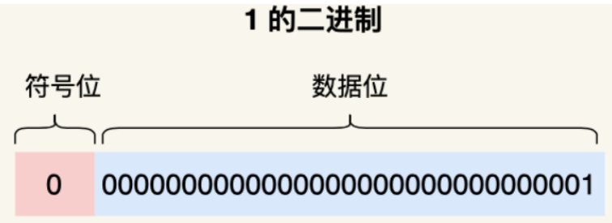
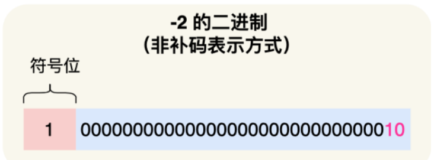
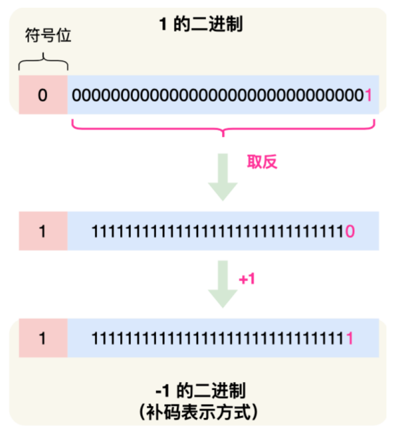
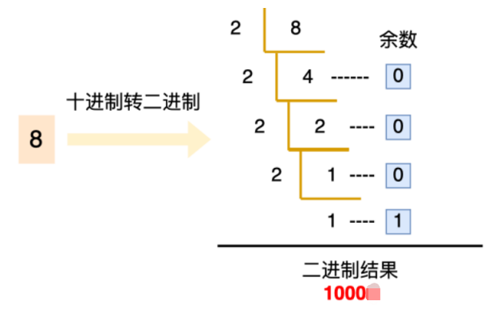
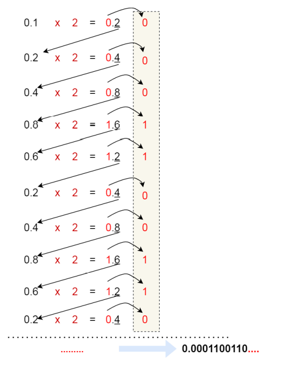
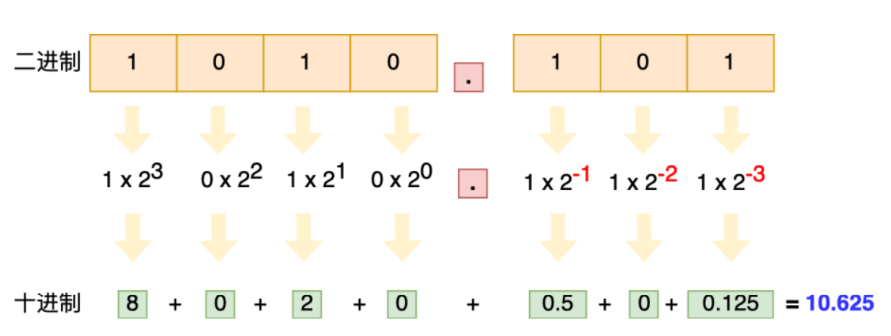
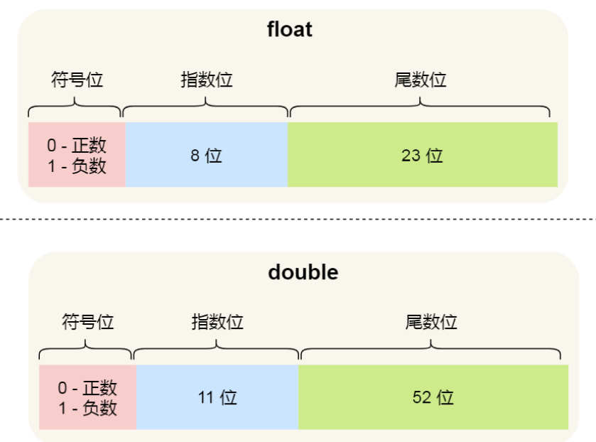
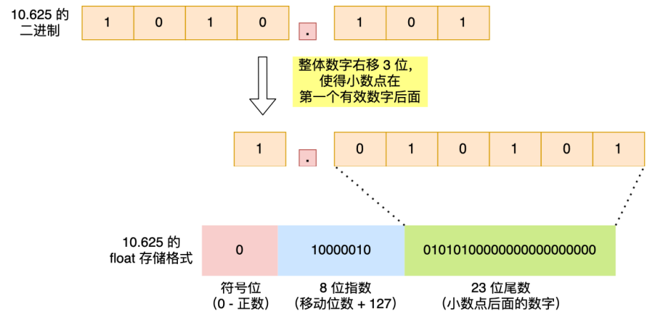
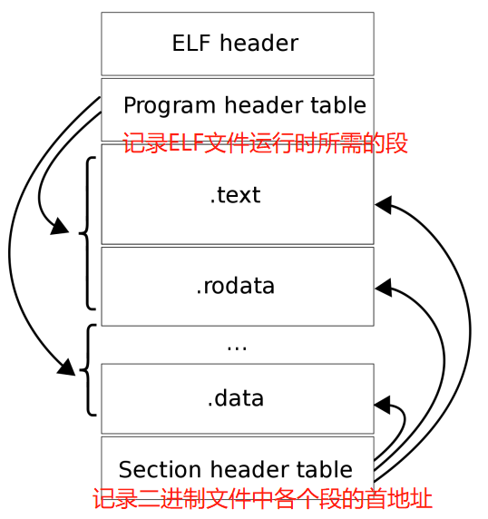

## 负数为什么要用补码来表示

首先先给出答案

如果负数不是使用补码的方式表示，那么在做基本的加减操作的时候，还需要多出一步来判断是否为负数，如果是负数，那么需要把加法变成减法，把减法变成加法，这样很明显是不好的，因为在计算机中加减操作是非常常见的，所以出于性能考虑，应该要减量简化这个过程，而使用补码表示负数的话，实际上的操作就和正数的加减操作相同了，不用再去添加判断转化了

解释一下为什么使用补码表示负数

我们知道，在计算机中十进制的数据是通过二进制来存储的，对于一个`int`类型的数据，它一共有4个字节，也就是32位，最高位表示是正数还是负数，0表示正数，1表示负数，剩下的31位表示二进制数据，那么对于`int`类型的正数1的二进制表示如下图：

如果我们不是用补码来表示负数，而是单纯的去修改最高位的符号位，如果这样的话`-2`的二进制应该就是

这样的话，我们知道`-2+1=-1`，但是在计算机中二进制计算出来真的是`-1`吗

很明显可以看到，如果对于`-2`不使用补码表示的话，`-2+1`的结果变成了`-3`，这显然是错误的，所以如果不使用补码表示负数的话，我们就要在计算之前判断一下，如果是负数的话，需要把减法转成加法，加法转成减法

而如果我们使用了补码之后，就不需要前面的这种判断-转化过程了，负数的加减计算和正数是相同的了，如下：

> 那么对于一个负数是怎么求出他的补码的呢？

对于一个负数，我们首先求出它正数的二进制，然后按位取反，最后在加1，就可以得到它的补码了，如下图：

## 十进制小数怎么转化成二进制

我们知道，对于一个十进制的整数，我们如果想要把他换成二进制，那么我们只需要对这个数不断**除2取余**，如下图

但是对于十进制的小数，转化成二进制却不是除2取余，而是**乘2取整**，如下图：

所以，对于一个十进制的小数，转化成二进制的过程如下图所示：

从上面的过程中，我们也可以看出一个问题，并不是所有的小数都能够通过不断地乘2变成1，比如十进制的0.1，过程如下：

**通过上图就能够发现，0.1的二进制表示是无限循环的，由于计算机资源是有限的，所以不可能完整地表示出0.1的二进制来，只能够通过有限位来表示它的一个近似值，也就是说在有限精度的情况下，只能够最大化地去接近0.1，这也就造成了精度缺失**

> 二进制小数转化成十进制

## 计算机中怎么储存二进制的小数

我们可以看到上面的小数二进制`1010.101`，小数点的位置是固定的，不能移动，因为小数点的位置一旦发生了变化就表示着数值发生了变化，但事实上，计算机中并不是通过定点数的形式来存储二进制的小数的，而是**通过浮点数的形式来存储二进制小数的**，顾名思义，浮点数就意味着小数点可以浮动，但并不是毫无规矩的动，和科学计数法一样，二进制的小数点移动也有一套规则：

- 首先基数必须是2，小数点移动之后必须保证左侧只有1位，而且必须是1，所以我们可以把`1010.101`表示成`1.010101 × 2^(-3)`，其中最关键的是`010101`和`-3`这两个部分，前者称为**尾数**，即小数点后面的数字，后者称为**指数**，即小数点在尾数中的位置

现代计算机使用的浮点数，一般是采用IEEE制定的国际标准，这种标准形式如下图：

这三个重要部分的作用分别是：

- 符号位：表示数字是正数还是负数，0表示正数，1表示负数
- 指数位：指定了小数点在数据中的位置，可以是正数也可以是负数，**指数位越大能够表达的数值范围也就越大**
- 尾数：小数点右侧的数字，**尾数越长能够表达的精度就越高**

用32位来表示的浮点数叫做单精度浮点数float，用64位来表示的浮点数叫做双精度浮点数double，他们的结构分别如下：

- 可以看到，double的尾数位是52位，float的尾数位是23位，再加上一个**隐含位1（因为我们没有把小数点前面的那个1算上）**共计53位和24位，所以他们的精度在十进制中分别是 log10(2^53) 约等于 15.95 和 log10(2^24) 约等于 7.22 位，因此double的有效数字是 15~16 位，float的有效数字是 7~8 位，这些有效位是包含整数部分和小数部分
- float的指数位比double的指数位少，所以double能够表示更大的数值范围

说了上面这么多，我们知道了计算机中是通过浮点数来存储二进制的小数的，**那么定点数是怎么样转化成浮点数的呢？**

- 首先，我们先算出十进制数`10.625`的二进制表示`1010.101`，这是一个定点数，我们可以把他转化成一个浮点数

- 整体数字向右移动3位，变成`1.010101`，右移3位表示+3，左移3位表示-3，float中的指数位就跟这里移动的位数有关系，把移动的位数加上偏移量（float中是127），相加后就是指数位的值了，比如上面的`10000010`十进制是130

- 因为尾数位不足23位，所以缺少的部分用0填充

  其实我们可以发现，在存储的时候，**移动后小数点左侧的有效位（1）消失了，他并没有存储到float 里**，这是因为IEEE标准规定，二进制浮点数的小数点左侧只能有1位，且只能是1，即然这一位永远是 1，那么就没必要存起来了，于是就让23位尾数只存储小数部分，电路在计算时会自动把这个1加上，这 样就可以节约1位的空间，尾数就能多存一位小数，相应的精度就更高一点了

> **再算指数的时候，为什么要加上偏移量呢？** 

因为小数点右移是正数，左移是负数，所以指数有可能是正数，也有可能是负数，即指数是有符号的整 数，而有符号整数的计算是要比无符号整数的计算麻烦的，所以为了减少不必要的麻烦，在实际存储指 数的时候，需要把指数转换成无符号整数，float的指数部分是8位，IEEE标准规定单精度浮点的指数取值范围是 `-126 ~ +127` ，于是为了把指数转换成无符号整数，就要加个偏移量，比如float的指数偏移量是127，这样指数就不会出现负数了

**我们前面说了如何把二进制的定点数转换成十进制，那么怎么把浮点数的二进制转化成十进制呢？**

## 为什么0.1+0.2不等于0.3

因为0.1和0.2的二进制表示都是无限循环小数，对于计算机而言，由于资源有限只能够在精度允许的情况下尽可能地接近0.1和0.2，但是归根到底他们还是一个近似值，所以说在进行浮点数计算的时候会造成精度损失，两个近似的二进制数相加的结果也肯定是一个近似值

## -------------分隔符------------

## Linux内核 V.S. Windows内核

### 内核的基本概念

我们知道，计算机系统是由很多的硬件设备组成，比如内存、CPU、硬盘、网卡等，如果计算机上的每个应用都要和硬件设备直接打交道的话，由于各个硬件设备的协议不同，所以直接打交道“太累了”，所以这时候就需要（操作系统）内核，**内核作为连接应用程序和硬件设备的桥梁，**可以使应用程序只需要关心和应用程序交互，而不需要关系硬件的细节

> **那么内核作为桥梁，它需要具备哪些功能呢？**

- 首先是**进程调度功能**：决定哪个进程/线程使用CPU
- 第二是**内存管理功能**：决定内存的分配与回收
- 第三是**硬件通信功能**：为进程与硬件设备之间提供通信能力
- 最后是**系统调用功能**：如果应用程序需要使用更高权限的服务，那么就需要系统调用

> **那么内核是怎么样进行工作的呢？**

内核具有很高的权限，它能够操作CPU，内存，硬盘等硬件设备，而应用程序具有的权限很少，所以大多数的操作系统把操作系统分成了两个区域：

- **内核空间：**这个内存空间只给内核程序使用
- **用户空间：**这个空间专门用来给应用程序使用

用户空间的代码只能够访问一个局部的内存空间，而内核空间的代码可以访问全部的内存空间，因此当程序进入用户空间运行时，我们常说程序是在**用户态**执行的，在内核空间执行的时候，我们说程序是在**内核态**执行的

应用程序如果需要从用户态进入内核态，那么就需要通过系统调用

当用户程序使用系统调用的时候，会产生一个中断，发生中断之后，CPU会中断当前正在执行的用户程序，转而跳转到中断处理程序，也就是开始执行内核程序，当中断处理程序执行完毕之后，会发送一个中断，把CPU执行权限交还给用户程序，回到用户态执行

### Linux内核

Linux内核的设计理念主要有以下四点

- **`MultiTask`多任务，**多个任务可以同时执行，单核CPU上叫做并发，多核CPU上叫做并行

- **`SMP`对称任务处理，**每个CPU的地位是相同的，共享同一块内存空间，也就是说每个程序都会被随机分配到任意一个CPU上执行

- **`ELF`可执行文件链接格式，**ELF是Linux中可执行文件的存储格式。ELF文件的形成过程：我们知道我们编写的代码首先会经过编译器生成汇编代码，接着通过汇编器变成目标代码（前面说的是机器码），也就是目标文件，最后通过链接器把多个目标文件以及调用的各种库函数连接起来，形成一个可执行文件，也就是ELF文件。ELF文件的执行过程：执行ELF文件时首先会使用装载器把ELF文件装载到内存中，然后CPU读取内存中的数据和指令，这样ELF文件就被执行起来了

  

- **`Monolithic Kernel`宏内核，**Linux的内核架构就是宏内核，这意味着**Linux的内核是一个完整的可执行程序，具有最高的权限**

  - **宏内核**的特征是系统内核的所有模块（比如进程调度、内存管理、文件系统、设备驱动等）都运行在内核态

  - **微内核**与宏内核相反，他只保留了最基本的功能，比如进程调度，而把一些应用放到了用户空间，比如文件系统和设备驱动等，这样做的好处是单个应用损坏之后不会导致整个的系统崩溃，不好的地方在于需要频繁地切换到内核态，比如驱动程序一般需要频繁地触发中断，调用系统中断函数，比如华为的鸿蒙OS

  - **混合内核**的架构像微内核，内核里面有一个最小版本的内核，其后其他模块都在这个的基础上进行搭建，实现的时候和宏内核有点像，也就是把内核做成一个完整的程序，大部分服务都在内核中，这就像是一个宏内核包着一个微内核

    

**Linux也实现了动态加载内核模块的功能**，例如大部分的设备驱动是以可加载模块的形式存在的， 与内核其他模块解耦，让驱动开发和驱动加载更为方便、灵活

### Windows内核

**当今Windows 7，Windows10使用的内核叫做`Windows NT`，NT的全称是`New Technology`**

Windows和Linux一样，都支持`MultiTask`和`SMP`，但是不同的是**Windows的内核设计是混合内核**，如下图：

从图中可以看到，Windows内核中有一个`Microkernel`微内核，这个是最小版本的内核，而整个内核的实现又是一个完整的程序，包含了很多模块，都在内核态

此外，Windows中的可执行文件和Linux中也不一样，Windows中的可执行文件格式是`PE`，即可移植执行文件，拓展名通常是`.exe   .dd   .sys`等，结构如下

