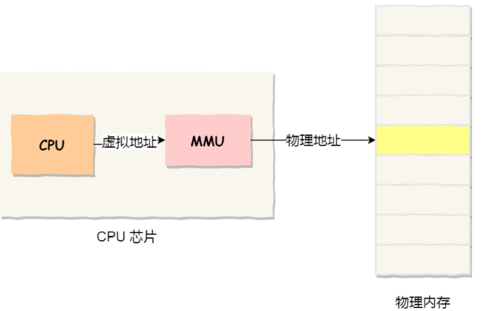
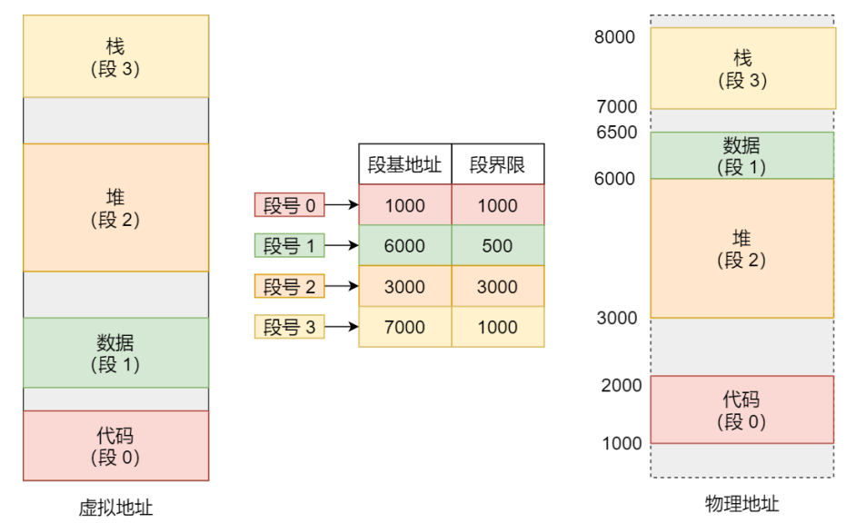
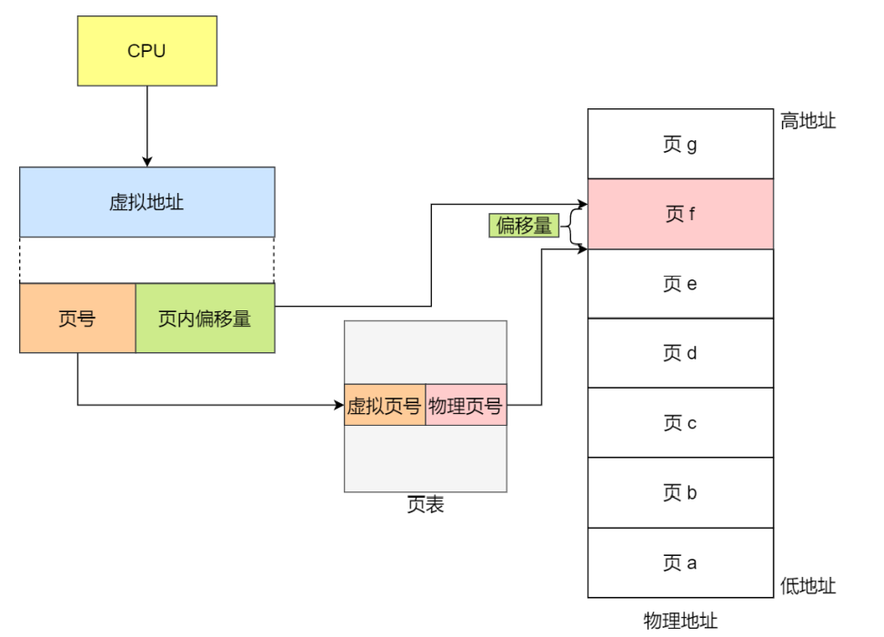
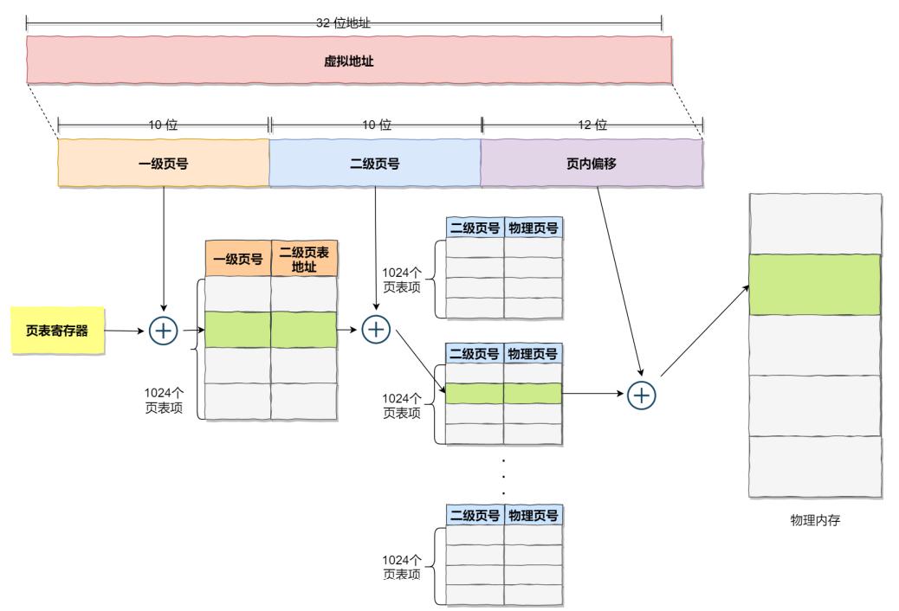
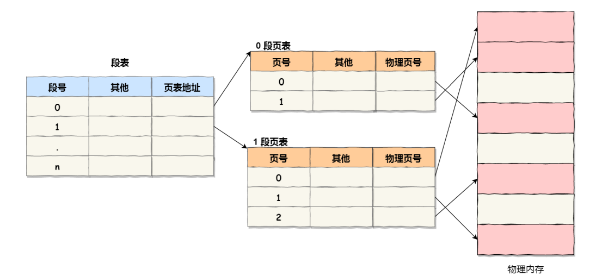
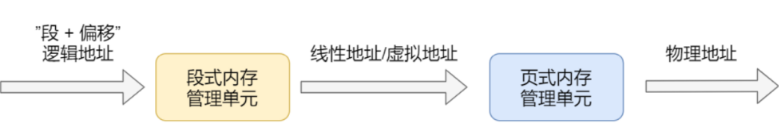
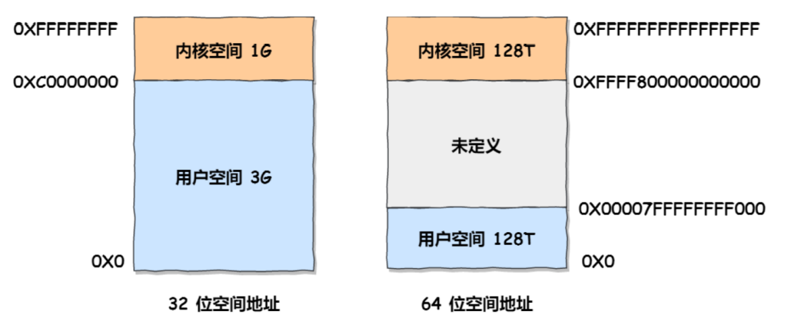
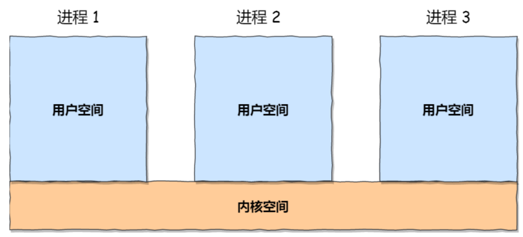

## 内存管理


在没有内存抽象的年代，程序直接访问和操作的都是物理内存，比如当执行以下命令的时候

```c
mov reg1 1000
```

这个指令会毫无想象力的从物理地址1000加载到reg1寄存器中，不难想象，这种**直接CPU操作物理内存地址的模式使得多进程变得不可能**，比如在单片机中（单片机中是没有操作系统的），必须执行完一条指令接着另一条指令，如果是多进程的话，由于直接操作物理地址，当一个进程给物理地址1000赋值之后，另一个进程同样也给这个物理地址赋值，那么第二个进程会覆盖第一个进程的值，这会造成两条进程的崩溃


> 那么操作系统是如何解决上述问题的呢？

上面不能够同时运行两个进程的关键就在于这两个进程都使用了相同的物理内存地址，这是我们需要避免的地方

**我们可以把进程使用的地址隔离起来，即让操作系统为每个进程分配一套虚拟内存，每个进程都有，而且每个进程都只需要操作好自己的虚拟地址就好，互不干涉，但是有一个前提是每个进程都不能够直接访问物理地址，至于虚拟地址是怎么映射到物理地址上的，这对进程来说是透明的，操作系统会提供一套机制（MMU）来完成这部分工作**


当进程当问虚拟地址的时候，操作系统会把这个虚拟地址转化成物理地址，这样不同的进程运行的时候，写入的是不同的物理地址，也就不会产生冲突了

- 虚拟内存地址：程序所使用的内存地址都是虚拟内存地址
- 物理内存地址：实际存储在硬件空间里面的地址都是物理内存地址

上面也说到了，操作系统会通过**内存管理单元（MMU）将虚拟地址映射成物理地址**，然后再通过物理地址来访问内存




> **<font color=red>操作系统是如何管理虚拟地址和物理地址之间的关系的呢？分段和分页</font>**


### 连续存储

 在现代的操作系统中，同一时间运行多个进程是再正常不过的了。为了解决直接操作内存带来的各种问题，引入的地址空间(Address Space),这允许每个进程拥有自己的地址。这还需要硬件上存在两个寄存器，**基址寄存器(base register)和界址寄存器(limit register),**第一个寄存器保存进程的开始地址，第二个寄存器保存上界，防止内存溢出。在内存抽象的情况下，当执行

```
mov reg1,20
```

这时，实际操作的物理地址并不是20，而是根据基址和偏移量算出实际的物理地址进程操作，此时操作的实际地址可能是:

```
mov reg1,16245
```

 在这种情况下，任何操作虚拟地址的操作都会被转换为操作物理地址。而**每一个进程所拥有的内存地址是完全不同的**，因此也使得多进程成为可能。

但是此时就出现了一个问题，那就是内存不可能同时容纳下所有并发的进程，如下图

```
假设有 1G 的物理内存，用户执行了多个程序，其中： 游戏占用了 512MB 内存 浏览器占用了 128MB 内存 音乐占用了 256 MB 内存。 这个时候，如果我们关闭了浏览器，则空闲内存还有 1024 - 512 - 256 = 256MB

如果这个时候有一个需要200MB内存的进程到来，虽然物理内存还剩下256MB，但是因为是内存不是连续的，所以仍然放不下这个200MB的程序
```


上面出现的这种问题就叫做内存碎片，更具体一点叫做外部碎片

- 内部碎片：已经被分配出去（能明确指出属于哪个进程）却不能被利用的内存空间；也就是占据这个存储块的进程并不使用这块空间
- 外部碎片：还没有被分配出去（不属于任何进程），但由于太小了无法分配给申请内存空间的新进程的内存空闲区域。


这时候，就有了一种新的技术，**交换（Swapping）**，交换的基本思想是，将闲置的进程交换出内存，暂存在硬盘中，待执行时再交换回内存，比如上图中，可以先把音乐换出内存，然后让新程序运行，再把音乐换入内存（前后在内存中的地址肯定不一样了）


### 分段机制

前面的连续存储是把整个程序给映射到一个物理地址上，我们知道程序是由若干个逻辑分段组成的，由代码分段、数据分段、栈段、堆段组成，不同的段是有不同属性的，所以就用`Segmentation`的形式把这些段分离出来，**段的长度不固定，决定于用户所编写的程序**


在分段机制下，虚拟地址是由两部分组成：**段选择因子**和**段内偏移量**

- **段选择因子就保存在段寄存器里面**，段选择因子里面最重要的是段号，**用作段表的索引**，段表里面保存的就是这个段的基地址、段的界限和特权等级等 
- 虚拟地址中的**段内偏移量应该介于0和段界限之间**，如果段内偏移量是合法的，就将段基地址加上段内偏移量得到实际物理地址

通过上面的描述我们知道了在分段机制下，虚拟地址是通过段表来和物理地址进行映射，分段机制会把程序分成四个段：代码段、数据段、栈段、堆段，每个段在段表中都有一个项，在这一项找到段的基地址，再加上偏移量，于是就能够找到某段在物理内存中的地址，如下图：



如果要访问段三中偏移量为500的虚拟地址，我们可以计算出物理地址为段三基地址7000 + 偏移量500 = 7500

从上面的过程中，不难看出在分段机制中，仍然存在内存碎片（外部碎片），而且在多进程环境下，不可避免会发生swap，虽然段比前面连续机制换出的数据少了，但是这里仍然是瓶颈，因为硬盘的速度太慢了，每一次的内存交换，我们都需要把一大段的内存数据交换到硬盘中去


### 分页机制

分页机制把虚拟地址和物理地址都给分成了一段段固定长度的大小，**这样的一个连续并且尺寸固定的内存空间我们称之为页`Page`，**在Linux中每个页的大小为4KB

**虚拟地址和物理地址之间的映射通过页表来完成，页表存储在CPU的内存管理单元MMU中，所以CPU可以直接通过MMU找出实际访问的物理内存地址**


**如果虚拟内存的页并不存在于物理内存中，那么将会产生一个缺页中断异常，CPU进入内核态处理这个异常，从磁盘中取得相应的页放入到物理内存中，如果此时物理内存已经满了，则还需要页面置换算法选择换出去的页面，然后更新进程页表，然后返回用户空间。**


在分页机制中，无论是虚拟内存还是物理内存都是以页为单位了，那么在这种机制下也就不会产生外部碎片了，因为每个进程所需要的页不一定非要连续

如果内存空间不够，操作系统会把其他正在运行的进程中最近未使用到的内存页面置换出去，也就是暂时写到硬盘上，这个过程叫做换出`Swap out`，一旦需要的时候在加载进来，称为换入`Swap in`，一次性换出或者换入几个页面相较于段，效率肯定会有所提高


更进一步，分页机制下，我们在加载程序的时候不需要把程序需要的全部页都加载进内存，我们完全可以在进行虚拟内存和物理内存的页之间映射之后，并不真的把页加载到物理内存中，而是只有在程序运行中，需要用到对应虚拟内存页里面的指令和数据时，再加载到物理内存里面去的


> 分页机制下，虚拟内存和物理内存是怎样映射的



在分页机制下，虚拟地址分成了两个部分：页号和页内偏移量，页号作为页表的索引，页表包含的物理页每页所在物理内存的基地址，这个基地址与页内偏移的组合就形成了物理内存的地址，如上图

分页机制下，对于一个虚拟地址转换成物理地址其实就分成了三个过程

- 将虚拟地址切分成页号和页内偏移量
- 根据页号，在页表中找到对应的物理页号
- 直接拿这个物理页号加上前面的页内偏移量，就得到了物理内存地址


上面是简单的分页机制，看起来没什么问题，但是在实际操作系统中肯定是不能够这样的，我们可以看一下场景：

```
对于一个32位的操作系统，我们知道虚拟内存是4G，也就是说每一个进程都会有一个4G的虚拟空间，也就是说每个进程都对应着一个页表，我们前面说到了在Linux中每个页面的能够表示的范围大小为4K，那么表示这个4G的虚拟内存，就需要2^20个页面，大约100万个，每个页表项需要4个字节来存储，那么对于每个进程它的页表就是4*2^20=4M，一个进程的页表大小就是4M，100个就是400M，这显然是很难接受的
```

所以，为了解决上面这个问题，就提出了**多级页表（Multi-Level Page Table）**

> 我们来看一下二级页表

如果我们把上面的页表在进行分页，形成二级页表，那么结果如下所示：



一级页表分为1024个二级页表，每个二级页表中包含了1024个页表项

我们知道，根据上面的定义，每个页表项的大小为4字节，那么对于这1024个一级页表，这就是4K的大小，而每个一级页表又对应着1024个二级的页表项，所以二级页表的大小为`1024*1024*4bit=4M`，这么一看，**二级页表（4M+4K）**比一级页表（4M）更大了，那么优化从何而来呢？

如果使用了二级分页，一级分页就可以覆盖整个4GB的虚拟地址空间，但是**如果某个一级页表的页表项没有被用到，也就不需要创建这个页表项对应的二级页表了，即可以在需要时才创建二级页表，**做一个 简单的计算，假设只有20%的一级页表被使用到了，那么页表占用的内存空间也就只有4KB + 20% * 4MB=0.804MB，这对比单级页表的 4MB 是不是一个巨大的节约？

那为什么不分级的页表就没有上面的效果呢？

我们从页表的性质来看，页表的作用就是将虚拟内存地址映射成物理内存地址，假设虚拟地址在页表中找不到对应的页表项，那么计算机系统就不能够正常工作了，**所以页表在创建时一定要覆盖全部的虚拟地址空间，不分级的页表就需要使用100多万个页表项来进行覆盖，而二级分页则只需要1024个页表项**（此时一级页表覆盖到了全部的虚拟空间地址，二级页表在需要的时候才会被创建）

我们把二级分页再推广到多级页表，就会发现页表占用的内存空间更少了，这一切都要归功于对**<font color=red>局部性原理</font>**的充分应用。 

**对于 64 位的系统，两级分页肯定不够了，就变成了四级目录，分别是：** 

- 全局页目录项 PGD（Page Global Directory）
- 上层页目录项 PUD（Page Upper Directory）
- 中间页目录项 PMD（Page Middle Directory） 
- 页表项 PTE（Page Table Entry）


我们从上面多级分页的过程中不难看出，在多级分页机制下，虽然解决了空间上存在的问题，但是从虚拟地址到物理地址的转换却多了几道工序，这显然降低了地址转化的速度，也就是带来了时间上的开销

**同样是因为程序是有局部性的，即在一段时间内，整个程序的执行权限仅限于程序中的某一部分，相应地，执行所访问的存储空间也局限于某个内存区域**


于是，我们可以把这几个最常访问的页表项放入到更快的存储结构中，于是计算机科学家们就在CPU芯片上加入了一个专门存放程序最常访问页表项的Cache，这个Cache就是TLB（Translation Lookaside Buffer），又叫做页表缓存、快表等

于是，有了快表之后，CPU寻址的时候会先去查找TLB快表，如果快表中没有再去查找常规的页表


如上图，在CPU的芯片里面封装了内存管理单元MMU（Memory Management Unit），**MMU的功能就是完成地址转化（页表在MMU中）并且能够和TLB进行访问与交互**

事实上，TLB的命中率挺高的，因为最常访问的几个页表项也就那几个


### 段页式存储管理

我们一定要有一个意识，那就是**分段和分页不是对立的，**他们可以组合起来在一个系统中使用，也就是**段页式存储管理**


他的实现方式是：

- 先把程序划分成几个有逻辑意义的段，也就是前面提到的分段机制
- 然后把每个段再分成多个页，也就是对应段划分出来的连续空间，在划分出固定大小的页

这样的话，**虚拟地址就应该分成了三个部分：段号 + 段内页号 + 页内偏移量**

用于段页式地址变化的数据结构是每一个程序一张段表，对于每个段有建立起了一张页表，段表中的地址是页表的起始地址，而页表中的地址则是表示某页的物理地址



段页式地址变换中要得到物理地址必须经过三次内存访问 

- 第一次访问段表，得到页表的起始地址 
- 第二次访问页表，得到物理页号 
- 第三次将物理页号和页内位移组合，得到物理地址 

可用软、硬件相结合的方法实现段页式地址变换，这样虽然增加了硬件成本和系统开销，但提高了内存的利用率。


## Linux内存管理

Linux系统主要使用分页机制来管理内存，但是由于Intel处理器的发展历史，Linux不可避免分段机制，于是Linux就通过把每段的地址都设置成从0地址开始的整个4GB虚拟地址（32位环境下），也就是每个段的起始地址都是一样的，这意味着，**Linux系统中的代码，包括操作系统本身的代码和应用程序代码，所面对的地址空间都是线性地址空间（虚拟地址），这种做法相当于屏蔽了处理器中逻辑地址的概念，段只被用来做访问控制和内存保护**




在Linux操作系统中，虚拟地址空间又被分成了用户空间和内核空间两个部分，不同位数的系统，地址的范围也不相同，目前最常见的是32位和64位



**虽然每个进程都有自己的虚拟地址空间，但是对于每个进程的内核空间，他们其实都是共享的相同的物理内存，这样，进程切换到内核态的时候，就可以很方便地访问内核空间内存**




> 下面是用户空间的具体分布


通过上面这张图可以看到，用户空间内存从低到高分别是6种不同的内存段 

- 程序文件段，包括二进制可执行代码 
- 已初始化数据段，包括静态常量 
- 未初始化数据段，包括未初始化的静态常量 
- 堆段，包括动态分配的内存，从低地址开始向上增长 
- 文件映射段，包括动态库、共享内存等，从低地址开始向上增长 
- 栈段，包括局部变量和函数调用的上下文等，栈的大小是固定的，一般是8MB，当然系统也提供了参数，以便我们自定义大小 

在这6个内存段中，堆和文件映射段的内存是动态分配的，比如说，使用C标准库的 `malloc() `或者 `mmap()` ，就可以分别在堆和文件映射段动态分配内存


