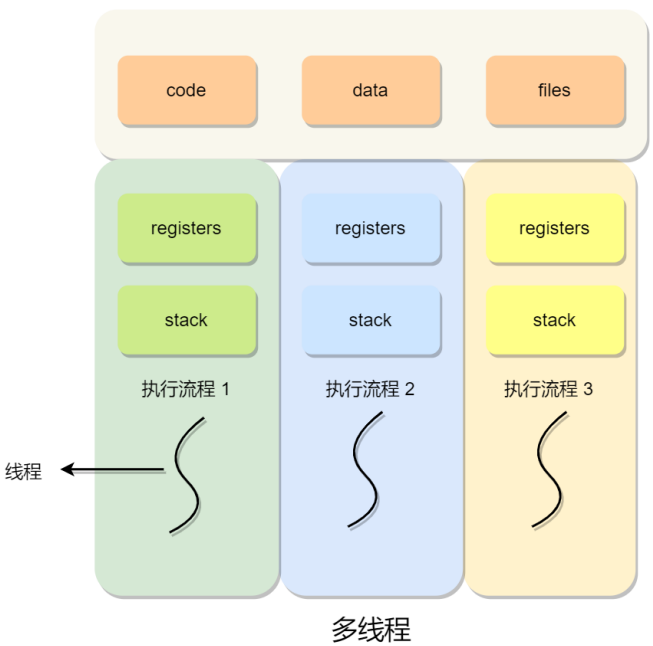
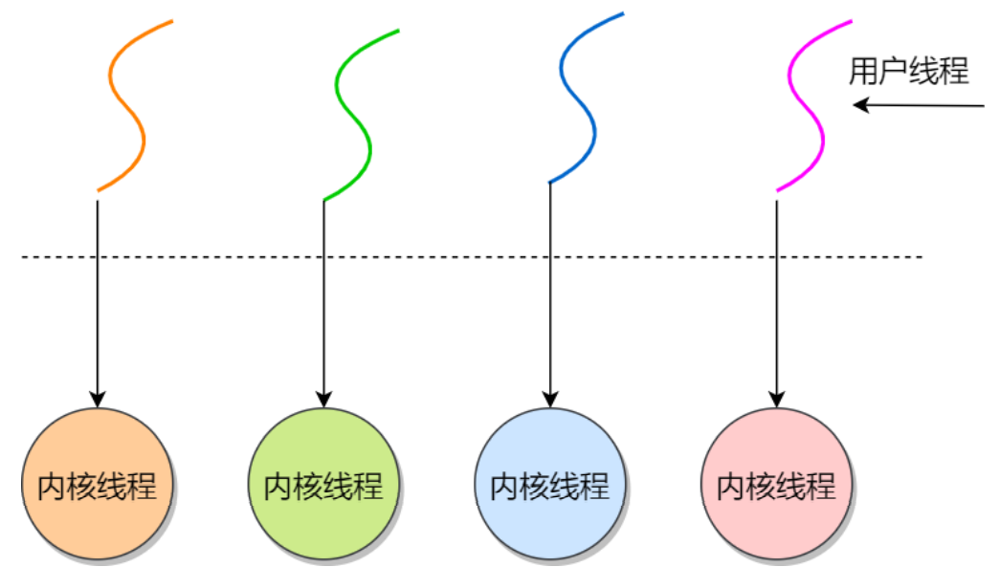
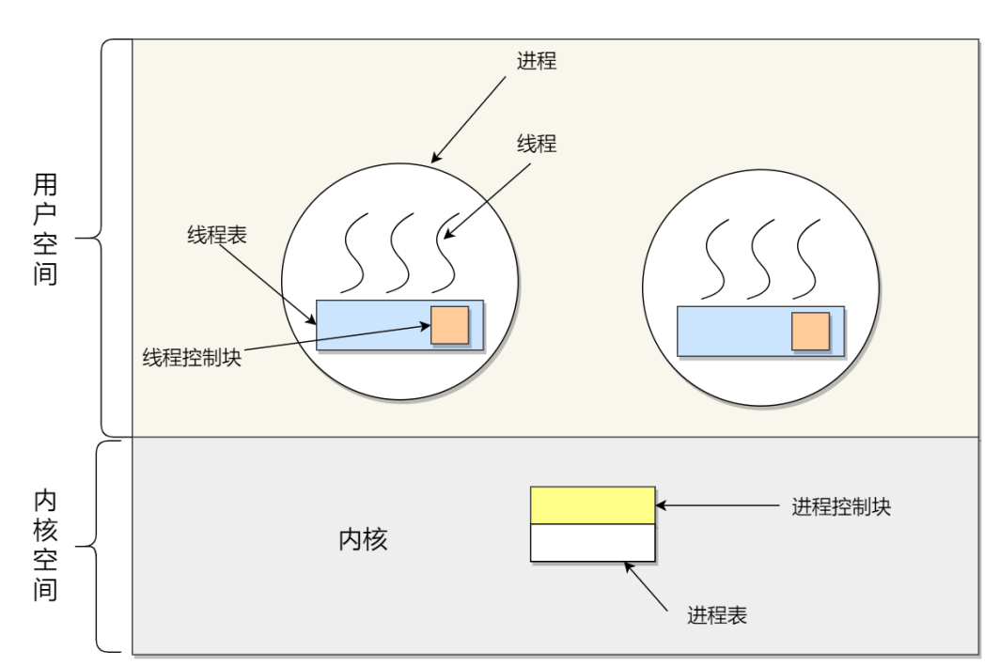
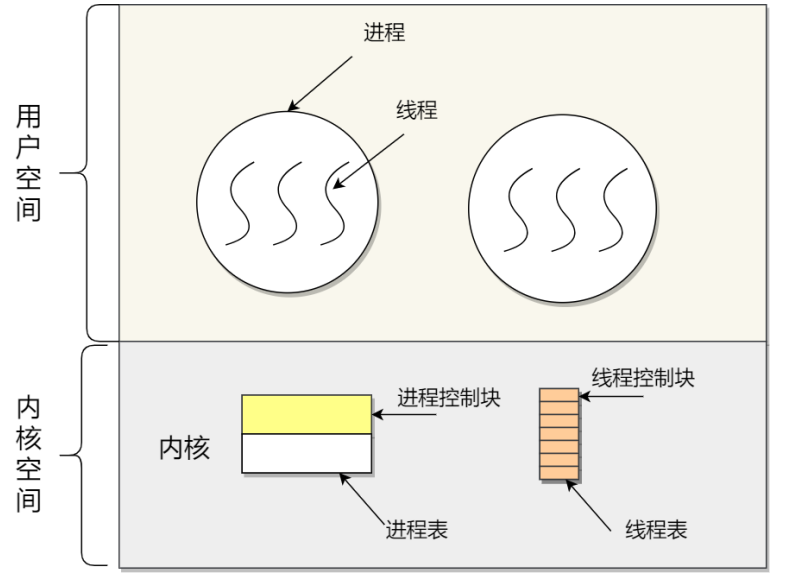
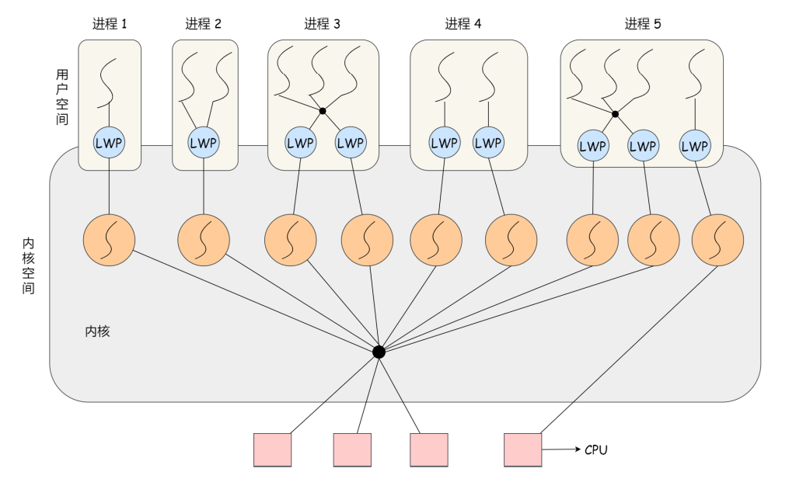

## 进程

### 进程的概念

我们编写的**代码只是存储在硬盘上的静态文件，**通过编译以后会形成可执行文件，当我们执行这个可执行文件的时候，会把这个可执行文件加载进内存，接着CPU会执行程序中的每一条指令，那么**这个运行过程中的程序叫做进程**

现在我们考虑有一个读取硬盘数据的程序被执行了，那么当运行到读取文件的指令的时候，就会从硬盘中读取文件，但是硬盘的读写是非常慢的，那么在这个时候，如果CPU等着硬盘数据的返回，很显然这种方式对CPU的利用率就很低了

所以，当程序从硬盘中读取数据的时候，CPU不需要阻塞等待硬盘数据的返回，而是转而取执行另外的进程，当硬盘中的数据被加载进内存之后，CPU会收到一个中断，于是CPU转而去处理这个中断程序，切换进程

对于一个支持多进程的系统，CPU会从一个进程快速切换至另一个进程，期间每个进程各运行几十或者几百毫秒

虽然单核的CPU在某个时刻只能够运行一个进程，但是可以在一段时间内（比如1秒）执行多个进程，这样就会产生并行的错觉，实际上**这是并发**，CPU可以从一个进程切换到另一个进程，在进程切换之前，必须记录下当前进程的运行状态信息，以备下次切换回来恢复运行

总的来说，**进程可以说是程序的一次动态执行，进程是动态的，程序是静态的，但是进程和程序之间却并不是一一对应的关系，**一个程序可以对应多个进程，即多个进程执行同一个程序，一个进程也可以对应多个程序

### 进程的状态

对于进程状态的讲解，我们直接看下图

其实，**进程的状态中`运行状态，就绪状态和阻塞状态`是三个最核心的状态，**那我们首先来看这三个状态：

- 运行状态：处于运行状态的进程占用着CPU
- 阻塞状态：正在运行的进程由于等待某一事件的发生而进入阻塞状态，比如事件I/O，处于阻塞状态的进程，除非他所等待的事件已经完成，否则即使给他CPU他也没办法运行
- 就绪状态：处于阻塞状态的进程等待的事件完成了，或者处于运行状态的进程被剥夺了CPU的使用，这个时候，只要给处于就绪状态的进程CPU，他就能够运行

我们知道进程会首先被装载进内存，然后被送入CPU执行，当处于内存中有大量处于阻塞状态的进程的时候，进程会占用着物理内存空间，因为物理内存空间是有限的，所以这显然不是我们想要的，所以我们会把一些处于阻塞状态的进程的页**换出**到硬盘上，等需要再次运行的时候，再把这个页换回来。

因此，我们就需要一种状态来描述**进程并没有占用实际的物理内存空间的情况，这个状态就是挂起状态**，从上图中也可以看出，挂起状态也分为了两种：

- 阻塞挂起状态：进程在外存（硬盘）等待某个事件的出现
- 就绪挂起状态：进程在外存（硬盘）等待系统的调用，只要进入内存，就会被加入到就绪队列中，因为处于就绪状态的进程属于“万事俱备，只差CPU”

我们可以使用`sleep()`让进程挂起，或者在Linux中使用`ctrl+z`挂起进程

### 进程的数据结构

在操作系统中，我们通过使用进程控制块（process control block，PCB）这个数据结构来描述进程

**PCB是进程的唯一标识，**一个进程存在必然会有一个PCB与之对应，如果进程消失了，那么他的这个PCB也会随之小时

> **那么PCB中有什么信息呢**

- **进程描述信息：**
  - 进程标识符（PID）：标识各个进程，每个进程都有唯一的一个进程标识符
  - 用户标识符：用来表示这个进程是属于哪个用户的
- **进程控制和管理信息：**
  - 进程的优先级
  - 进程的当前状态：如`new ready running waiting  blocked`等
- **资源分配清单：**
  - 有关内存地址或者虚拟内存地址空间的信息，所打开的文件列表和所使用的I/O设备信息
- **CPU相关信息：**
  - CPU中各个寄存器的值，当进程被切换时，CPU的状态信息会被保存在相应的PCB中，以便进程重新执行的时候，能够从断点处继续执行

> **PCB是如何组织的**

**PCB通常是通过链表的形式组织的**，把具有相同状态的PCB连在一起，组成队列，比如：

- 把所有就绪状态的进程连在一起，称为就绪队列
- 把所有因为等待某件事件而处于等待状态的进程连在一起就组成了各种阻塞队列
- 对于运行在单核CPU系统中则只有一个运行指针了，因为单核CPU在某个时间只能运行一个程序

除了链表的形式以外，**还可以通过索引的方式将PCB组织起来**，它的工作方式是将同一个状态的进程组织在同一个索引表中，索引表项指向相应的PCB，不同状态对应着不同的索引表

> 一般会选择链表，因为进程会面临频繁的创建、销毁等操作，使用链表更加灵活

### 进程的控制

前面我们了解了进程的状态变迁和数据结构（PCB），再来看看**进程的创建、终止、阻塞、唤醒等过程，这些过程也就是进程的控制**

#### 创建进程

创建进程的过程：

- 为新进程分配一个唯一的进程标识号，并申请一个空白的PCB，PCB是有限的，若申请失败则创建失败
- 为进程分配资源，此处如果资源不足的话，进程就会进入等待状态，等待资源（这个是不是阻塞状态？！）
- 初始化PCB，标记进程为就绪状态
- 如果进程的调度队列能够接受新进程，那么就会将进程插入到就绪队列中，等待被调度运行

操作系统是允许一个进程创建另一个进程的，子进程能够继承父进程所拥有的资源，如果销毁一个子进程，需要把子进程所继承的资源还给父进程，如果销毁一个父进程，也会同时销毁它所有的子进程

> 注意：在Linux中，如果销毁有子进程的父进程，会把子进程交给Linux的1号进程管理。

#### 终止进程

进程的终止有三种情况：进程正常运行完、进程出现异常，操作系统把这个进程销毁、外界干预（kill等操作）

终止进程的过程如下：

- 查找需要终止的进程的PCB
- 如果此时进程正处于运行状态，那么会首先终止其运行，然后将CPU让给其他进程使用
- 如果这个进程还有子进程，则还应该将其子进程终止
- 将该进程所拥有的全部资源都归还给父进程或者操作系统
- 将其PCB从队列中删除

#### 阻塞进程

当进程需要等待某一事件完成时，他可以调用阻塞语句把自己阻塞等待，而**一旦被阻塞等待时，它只能够被另一个进程唤醒**

进程阻塞的过程：

- 找到将要被阻塞进程标识号对应的PCB
- 如果该进程处于运行状态，则保护其现场（把当前CPU的状态信息保存在PCB中），然后将其状态转变成阻塞状态，停止运行
- 将该PCB插入到阻塞队列中去

#### 唤醒进程

**进程由运行转变为阻塞状态是由于进程需要等待某一事件的完成，所以处于阻塞状态的进程是不能够自己把自己唤醒的**

如果某进程正在等待I/O事件，需要有别的进程发消息给他，则只有当该进程所期待的事件出现时，才由发现者用唤醒语句唤醒它

唤醒进程的过程如下：

- 在该事件的阻塞队列中找到相应进程的PCB
- 将其从阻塞队列中移出，并将其状态标记位就绪状态

- 将该进程加入就绪队列中，等待调度程序的调度

**进程的阻塞和唤醒是一对功能相反的语句，如果某个进程调用了阻塞语句，则必有一个与之相反的唤醒语句**

### 进程的上下文切换

笼统地说，从一个进程切换到另一个进程就叫做进程的上下文切换

> 再详细说进程上下文切换之前，我们下来看一下CPU上下文切换

什么是CPU的上下文？我们知道任务是要交给CPU来运行的，所以当一个CPU拿到一个任务的时候，它需要知道任务从哪里开始加载，从哪里开始运行，所以**操作系统会事先帮CPU设置好CPU（指令）寄存器和程序计数器**

CPU寄存器是CPU内部一个容量小但是速度极快的内存，其中存放的是CPU执行的指令，程序计数器中存放的是CPU将要（下一条指令）执行的指令的地址

所以说，**CPU指令寄存器和程序计数器是CPU在运行任何任务之前必须依赖的环境，这些环境就叫做CPU的上下文**

既然知道了什么是CPU的上下文，那么理解CPU上下文切换也就不难了

所谓CPU上下文的切换就是**保存前一个任务的CPU上下文**（CPU寄存器和程序计数器），然后**加载新任务的上下文**到CPU寄存器和程序计数器中，这样CPU就能够通过程序计数器中指令的地址开始执行新任务了

系统内核存储保存下来的上下文信息，此时任务再次被分配给CPU运行时，CPU会重新加载这些上下文，这样就能够保证任务的原来状态不受影响，让任务看起来还是连续运行的

上面说到的任务，主要包含进程、线程和中断，所以根据人物的不同，又可以把CPU上下文切换划分成：进程上下文切换、线程上下文切换和中断上下文切换

> 明白了上面的CPU上下文切换，那么下面我们就来看一下进程上下文切换

因为进程是由内核管理和调度的，所以**进程的切换只能够发生在内核态**

所以，**进程上下文的切换不仅包含了虚拟内存、栈、全局变量等用户空间的资源，还包括了内核堆栈、寄存器等内核空间的资源**

从上图中我们可以看出，进程的上下文切换分成了两个部分：

- 保存前一个进程的上下文信息，这个信息会被保存到这个进程的PCB中，以便以后恢复运行
- 加载下一个进程的上下文信息，也就是说CPU会从进程的PCB中取出这个进程的上下文信息，恢复运行

> 需要注意的是，进程的上下文切换开销是很关键的，我们希望这个开销越小越好，这样便可以使得CPU能够把更多的时间放在进程的执行上，而不是耗费在进程的上下文切换这个过程中

**发生进程上下文切换的场景如下：**

- 时间片耗尽：为了保证所有进程可以得到公平调度，CPU 时间被划分为⼀段段的时间片，这些时间片再被轮流分配给各个进程。这样，当某个进程的时间片耗尽了，进程就从运行状态变为就绪状态，系统从就绪队列选择另外⼀个进程运行
- 更高优先级的进程到来：当有优先级更高的进程运行时，为了保证高优先级进程的运行，当前进程会被挂起，由高优先级进程来运行
- 发生硬件中断：发⽣硬件中断时，CPU 上的进程会被中断挂起，转而执行内核中的中断服务程序
- 进程通过睡眠函数`sleep`主动挂起，也会引起进程调度
- 进程在系统资源不足（比如内存不足）的时候，要等到系统资源满足的时候才能够运行，这个时候进程也会被挂起，并由系统调度其他进程运行

## 线程

### 什么是线程

**线程是进程当中的一条执行流程**

同一个进程内的多个线程之间可以共享代码段、数据段、打开的文件等资源，但是每个线程各自都有一套独立的寄存器和栈，这样可以确保线程的控制流是相对独立的

> **线程的优缺点**

线程的优点：

- 一个进程中可以同时存在多个线程

- 各个线程之间可以并发执行
- 各个线程之间可以共享地址空间和文件等资源

线程的缺点：

- 进程中的一个线程崩溃时，会导致其所属进程的所有线程崩溃

### 进程和线程的比较

线程和进程的比较如下：

- **线程是CPU调度的基本单位，而进程是系统进行资源分配的基本单位（最大区别）**
- 进程拥有一个完整的资源平台，而线程是共享其所在进程的地址空间、全局变量等资源，只独享必不可少的资源，比如栈和寄存器
- 线程同样具有阻塞、就绪、运行三种基本状态，同样具有不同状态之间的转换关系
- 线程能够减少并发执行的时间和空间开销

> 线程相较于进程能够减少开销体现在：

- 线程的创建时间比进程快，因为进程在创建过程中还需要资源管理信息，比如内存管理信息、文件管理信息，而线程在创建过程中，不会涉及这些资源管理信息，而是共享他们
- 线程的终止时间比进程少得多，因为线程需要释放的资源比进程少得多
- 同一个进程内的线程切换比进程切换快得多，因为同一个进程内的线程具有相同的地址空间（虚拟内存共享），这也就意味着所有的线程都具有同一个页表，那么在线程切换的时候，就不需要切换页表了，而进程的切换需要切换页表，这个页表切换过程的时间开销还是比较大的
- 同一个进程内的线程通信不需要通过内核，因为同一个进程内的线程共享文件资源和内存信息

### 线程的上下文切换

在前面我们知道了，线程是CPU进行调度的基本单位，所以，所谓的操作系统任务调度，实际上的调度对象其实是线程，而进程只是给线程提供了虚拟内存、全局变量等资源

对于进程和线程我们可以这么理解：

- 如果一个进程中只有一个线程，那么可以认为此时进程就等同于线程
- 如果一个进程中有多个线程，那么此时这多个线程共享这个进程的内存空间和全局变量等资源，这些资源在上下文切换时是不需要修改的

另外，线程也有自己的私有数据，比如寄存器和栈，这些在上下文切换的时候是需要保存的

线程的上下文切换还需要看线程是否属于同一个进程：

- 如果不属于同一个进程，那么线程切换的过程和进程上下文切换的过程是一样的
- 如果属于同一个进程，因为虚拟内存是共享的，所以在切换的时候，虚拟内存这些资源就保持不动，只需要切换线程的私有数据、寄存器等独占的数据

**所以，同一进程内的线程切换的开销要比进程切换小得多**

### 线程的实现

线程的实现主要有三种方式：

- **用户线程（User Thread）**：在用户空间实现的线程，不是由内核管理的线程，是由用户态的线程库来完成线程的管理
- **内核线程（Kernel Thread）**：在内核空间实现的线程，由内核管理
- **轻量级进程（LightWeight Process，LWP）**：内核支持的用户线程

用户线程和内核线程的对应关系（为什么要对应？）

- 多对一：多个用户线程对应一个内核线程

  

- 一对一：一个用户线程对应一个内核线程

  

- 多对多：多个用户线程对应多个内核线程

  

> **如何理解用户线程**

用户线程是基于用户态的线程管理库来实现的，那么线程控制块（Thread Control Block，TCB）也是在库里实现的，**对于操作系统而言是看不到这个TCB的，它只能够看到整个进程的PCB，如下图**，所以，**用户线程的管理和调度，操作系统都是不参与的，而是由用户空间下的线程库中的相关函数来完成调度和管理，包括线程的创建、终止、同步和调度等**

下图所示是用户线程的模型，看着**类似**于前面说到的多对一模型，即多个用户线程对应一个内核线程，这里变成了多个用户线程对应着一个内核态下的进程

用户线程的优点：

- 每个进程都需要有它线程控制块（TCB）的列表，用来跟踪记录它各个线程的状态信息，因为TCB是由用户空间的线程库函数来维护，**所以用户线程可用于不支持多线程的操作系统**

- 因为用户线程的调度是由线程库函数来完成，所以**用户线程的切换不需要有用户态和内核态的切换**，因此用户线程切换比较快

用户线程的缺点：

- 由于操作系统不参与用户线程的调度，所以**一旦某个线程发起了系统调用而阻塞，那么该进程中包含的其他线程都只能等待**，不能被执行了
- 当**一个用户线程开始执行了之**后，除非他自己主动让出CPU，否则**他所在进程中的其他线程都是没有办法执行的**，因为用户态的线程没有办法打断当前运行中的线程，因为他没有这个特权，只有操作系统才有，但是用户线程不是由操作系统管理的

- 因为进程是操作系统资源分配的基本单位，所以时间片会被分给进程，所以与其他进程相比，再多线程执行的时候，每个线程平均得到的时间片会比较少，所以**执行的周期会比较长**

> **如何理解内核线程**

内核线程是由内核空间实现的，所以内核线程的TCB自然就放在了内核空间中，它的管理和调度都是由操作系统内核来完成

内核线程的模型，**类似**于前面提到的一对一模型，一个用户线程对应一个内核线程，这里的意思应该是内核能够清楚地直到有多少个线程

内核线程的优点：

- 如果一个内核线程由于发起了系统调用而被阻塞，不会影响其他内核线程的执行

- 时间片的分配是直接给线程，所以多线程的进程获得更多的CPU运行时间

内核线程的缺点：

- 在支持内核线程的操作系统中，由内核来维护进程和线程的上下文信息，PCB和TCB

- 线程的创建、终止和切换都是通过系统调用的方式来实现的，因此对于系统来说，系统开销比较大

> **如何理解轻量级进程**

轻量级进程（LWP）是内核支持的轻量级线程，一个进程可以有一个或者多个LWP，每个LWP和内核线程是一一对应的，也就是说每个LWP都是由一个内核线程支持的

**LWP只能够由内核进行管理，并像普通进程那样被调度，Linux内核是支持LWP的典型例子**

> LWP和普通进程的区别

在大多数系统中，**LWP和普通进程的区别在于LWP只有一个最小的执行上下文和调度程序所需的统计信息，一般来说，一个进程代表一个程序的一个实例，而LWP代表程序的执行线程，因为一个执行线程不像进程那样需要那么多的状态信息，所以LWP也就不带有这样的信息**，如下图：

在LWP之上也是可以使用用户线程的，那么LWP和用户线程的对应关系也就有三种：

- **1 : 1 ，即⼀个 LWP 对应 ⼀个用户线程**

  - 优点：能够实现并行，当一个LWP阻塞时，不会对其他的LWP产生影响
  - 缺点：一个用户线程对应一个LWP，对应一个内核线程，创建线程的开销较大

- **N : 1 ，即⼀个 LWP 对应多个用户线程**

  线程管理是在用户空间完成的，此模式中用户的线程对操作系统不可见

  - 优点：用户线程要开几个都没有问题，而且上下文切换发送在用户空间，切换的效率比较高
  - 缺点：一个用户线程如果阻塞了，则整个进程都会被阻塞，另外在多核CPU中，无法充分利用CPU（因为只对应着一个内核线程）

- **M : N ，即多个 LMP 对应多个用户线程**

  把前面两个模型混在一起就形成了多对多模型，首先多个用户线程对应多个LWP，然后每个LWP对应一个内核线程

  优点：综合了前面两种模式的优点，大部分的线程上下文切换发生在用户空间（LWP上下文切换发生在内核空间），且多个线程又可以充分利用多核CPU的资源

除此之外，还有一种**组合模式**，上图中的进程5

此进程结合了`1:1`和`M:N`模型，开发人员可以根据不同的应用特点调节内核线程的数目来达到物理并行和逻辑并行的最佳方案

