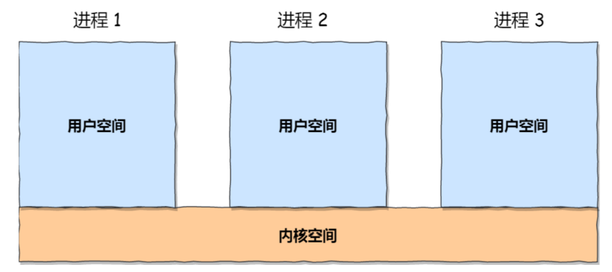
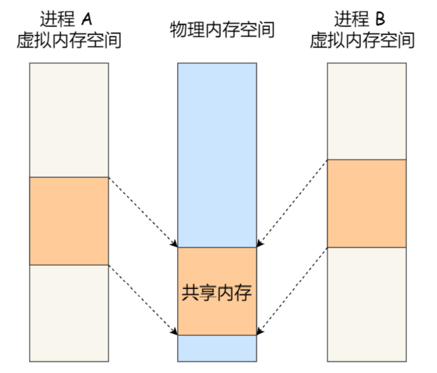

## 进程间的通信

大部分用户直接面对的程序都是运行在用户态，进程可以通过系统调用从用户态陷入内核态，从下图中我们可以看出，每个进程的用户空间地址是独立的，一般而言是不能够直接相互访问的，但是内核空间是每个进程共享的，所以**进程之间的通信一定经过内核**




### 管道

```bash
ps auxf | grep mysql
```

上面命令行中的`|`就是一个**匿名管道**，用完即毁，上面命令的含义是把前一个命令`ps auxf`的输出作为后一个命令`grep mysql`的输入，可以看出，**管道传输的数据是单向的，如果想要实现双向通信，那么就需要创建两个管道**

除了匿名管道之后，当然还有命名管道，**命名管道又称为`FIFO`**，因为管道中的数据是先进先出的传输方式，在使用命名管道之前，必须先使用`mkfifo`创建它，如下：


因为在Linux中一切皆文件，所以管道也是一种文件，不同的是，**命名管道会被存储到文件系统中，匿名管道会被内存中，**但是不管是匿名管道还是命名管道，他们写入的数据都是放到了内存中，也就是说命名管道这个管道会被存储到文件系统中，但是**数据不会被存储下来**


我们执行命令往管道中写入数据，会发现命令执行会被停住，这是因为管道中的内容没有被读取出去，只有当管道中的内容被读取出去了之后，命令才可以正常退出


另一个终端中的命令也退出了


从上面这个例子中我们可以看到**管道的缺点就是效率很低，不适合进程间频繁的进行通信，优点是管道很简单，同时我们也能够清楚的知道什么时候往管道里写入了数据，什么时候读取了数据**

除此之外，**区别于匿名管道，命名管道突破了只能够在有亲缘关系的进程之间通信的限制**


> **前面说到了怎么创建命名管道，那么Linux中是怎么创建匿名管道的呢？**

匿名管道的创建需要下面这个系统调用

```c
int pipe(fd[2])
```

上面的这个系统调用表示创建一个匿名管道，返回值是两个文件描述符，`fd[0]`表示管道的读取端的文件描述符，`fd[1]`表示管道的写入端的文件描述符，注意**匿名管道是一种特殊的文件，那只存在于内存中，用完即毁，而命名管道可以被存储到文件系统中**


其实，所谓的匿名管道本质上就是内存中的一串缓存，从管道的一端写入数据，另一端读出数据（很像队列啊），管道传输的数据是无格式的流而且大小受限，大小可以通过`ulimit -a`来查看（512bytes * 8 = 4kb）


上面介绍了命名管道和匿名管道的创建，我们知道了**管道的两个文件描述符是在一个进程中的**，并没有起到进程间通信的作用，那么进程是怎么通过管道实现进程之间通信的呢？

我们可以使用`fork`创建子进程，创建的子进程会复制父进程的文件描述符，如下图，这样就实现了两个进程都有相同的`fd[0]`和`fd[1]`，表示这能够使用同一个管道，这样这两个进程就可以通过这个相同的管道进行通信了


但是我们知道，管道只能够从一端写入，另一端读取，而上图所示的模式很容易造成混乱，因为父进程和子进程可能同时写入或者读取，所以为了避免上面的这种情况，通常的做法是：

- 父进程关闭`fd[0]`，只保留`fd[1]`，也就是说父进程写
- 子进程关闭`fd[1]`，只保留`fd[0]`，也就是说子进程读


从上面也可以看出，**如果想要实现双向通信，那么需要创建两个管道**


> 至此，我们了解了父子进程之间通过管道通信的模式，但是在**`shell`中，并不是这样的**

**比如在`shell`中执行`A|B`命令时，A进程和B进程都是`shell`创建出来的子进程，A和B之间不存在父子关系，他们两个的父进程都是`shell`**


可以看到，在shell中通过`|`匿名管道将多个命令连接起来，其实就是**创建了多个子进程**，所以我们在编写shell脚本的时候，能够用一个管道解决的问题就使用一个管道，因为这样可以减少创建子进程的系统开销


综上，**匿名管道的生命周期和进程的生命周期一致**，进程存在，管道就存在，进程销毁，管道也就不存在了


### 消息队列

前面说了管道的通信效率很低，所以管道不适合进程间频繁地交换数据

对于这个问题，消息队列能够解决，比如进程A想要给进程B发送消息，A进程只需要把想要发送的消息写入到对应的消息队列中即可返回，B进程需要的时候去消息队列中读取就好了，反过来也一样，所以消息队列也能够更好的实现双向通信

**消息队列是<font color=red>保存在内核中</font>的消息链表**，进程在发送数据的时候，会把数据分成一个个独立的数据单元，把就是**消息体**（数据块），消息体是**用户自定义的数据类型**，是由消息的接收方和消息的发送方共同协商出来的一个数据类型，所以每个消息体都是固定大小的存储块，不像管道那样，是一个无格式的字节流数据，如果进程从消息队列中读取了数据，那么就从内核中把这个消息体删除

**消息队列的生命周期随内核，如果没有释放消息队列或者没有关闭操作系统，那么消息队列会一直存在，**而匿名管道的生命周期是和进程一致

**使用消息队列这种模型，实际上就像是发邮件**，发邮件有**两个缺点：一个是通信不及时，第二是**附件**大小受到限制**，第一个缺点我们很容易理解，进程A把要发送的数据放到内核中的消息队列中了，进程B不一定立即读取，第二个缺点指的是消息体的大小和消息队列的大小有限制，在Linux内核中有两个宏定义`MSGMAX,MSGMNB`，这两个宏定义都以字节为单位，分别表示消息体和消息队列的最大长度

除此之外，我们还可以发现**消息队列的另一个缺点，那就是会频繁地发生用户态和内核态之间的数据拷贝**，因为消息队列是存在于内核中的，所以进程写入数据到消息队列中会发生用户态到内核态的切换，同理，读取数据会发生将数据从内核态拷贝到用户态的过程


### 共享内存

**共享内存能够避免消息队列中用户态和内核态之间的数据拷贝过程**，从内存管理角度，现代操作系统使用的都是虚拟内存技术，每个进程都有自己独立的虚拟内存空间，即使两个进程的虚拟内存地址相同，他们映射到实际的物理内存地址中是不同的，**共享内存的机制就是进程之间各拿出一块虚拟地址来，映射到相同的物理内存空间上，**这样A进程写入一个数据，另外一个进程就马上能够看到了，就不需要拷贝过程了，这样能够提高通信效率，如下图：





### 信号量

使用共享内存机制肯定会存在这样的一个问题：多个进程映射到同一块的物理内存上，那么必然就会存在**多个进程同时向同一物理地址写入数据，新写入的数据势必会覆盖之前写入的数据**，这样很显然就会造成数据混乱，所以为了避免多个进程竞争共享资源，就需要有一套保护机制，使得共享资源在某一时刻只能够由一个进程来访问，**信号量就实现了这个保护机制**

**<font color=red>信号量其实是一个整型的计数器，主要用于进程间的同步和互斥，而不是用于缓存进程间通信的数据</font>，所以信号量通常是和共享内存机制同时搭配出现的**

信号量表示资源的数量，主要有两个原子操作：

- P操作：这个操作会把信号量减一，相减后如果信号量 < 0 ，则表明资源已经被占用，进程需要阻塞等待，相减后如果信号量 >=0 ，则表明还有资源可以使用，进程可以正常继续访问 
- V 操作：这个操作会把信号量加一，相加后如果信号量 <=0 ，则表明当前有阻塞中的进程，于是会将该进程唤醒使其进入就绪状态，相加后如果信号量 > 0 ，则表明当前没有阻塞中的进程

**P操作是进入共享资源之前使用，表示想要获得锁，V操作是离开共享资源之后使用，表示释放资源，PV操作必须成对出现**

> **互斥信号量，将信号量的值设置为1**


- 进程A访问共享内存前，先执行了P操作，由于信号量的初始值为1，故在进程A执行P操作之后信号量变为0，表示共享资源可以使用，于是进程A就可以访问共享内存 
- 若此时，进程B也想要访问共享内存，执行了P操作，结果由于信号量变为了-1，这就意味着临界资源已经被占用，因此进程B被阻塞
- 直到A访问完共享内存之后，才会执行V操作，使信号量恢复成0，接着就会唤醒阻塞中的进程B， 使得进程B可以访问共享内存，最后完成共享内存的访问之后，执行V操作，使得信号量恢复到初始值1


> **同步信号量，将信号量设置成0**

在多进程里每个进程并不一定是顺序执行的，他们基本是以各自独立的、不可预知的速度向前推进，但有时候我们又希望多个进程能够紧密合作，以实现一个共同的任务 

例如，进程A是负责生产数据的，进程B是负责读取数据的，这两个进程是相互合作，相互依赖的，进程 A必须先产生了数据，进程B才能够读到这些数据，所以执行是有前后顺序的

想要进程按照顺序执行，这个时候就需要使用同步信号量了，将信号量的值设置初始化为0


- 如果进程B比进程A先执行了，那么执行到P操作时，由于信号量初始值为0，故信号量会变为-1， 表示进程A还没有生产数据，于是进程B就阻塞等待 
- 接着，当进程A生产完数据后，执行了V操作，就会使得信号量变为0，于是就会唤醒阻塞在P操作中的进程B 
- 最后，进程B被唤醒之后，意味着进程A已经生产了数据，于是进程B就可以正常的读取数据了，读取完了之后执行V操作，信号量变回1 

可以发现，信号量初始化为0，就代表着同步信号量，它可以保证进程A应该在进程B之前执行


### 信号

前面提到的四种通信方式都是在常规状态下的工作模式，对于**异常状态下的进程通信，就需要使用信号了**

**信号量和信号是两个完全不同的东西，类似于Java和JavaScript**

为了响应各种各样的事件，Linux提供了64中信号，可以通过`kill -l`命令来查看


运行在 shell 终端的进程，我们可以通过**键盘输入某些组合键**的时候给进程发送信号，比如： 

- ctrl + c 产生 SIGINT 信号，表示终止该进程 
- ctrl + z 产生 SIGTSTP ，表示停止该进程但还未结束 （挂起进程）

如果进程在后台运行，可以通过 **kill 命令**的方式给进程发送信号，但前提需要知道运行中的进程PID 号，例如： kill -9 1050 ，表示给 PID 为 1050 的进程发送 SIGKILL 信号，用来立即结束该进程

**综上，信号的来源有两个部分：硬件来源（CTRL + C）和软件来源（kill命令）**

**<font color=red>信号是进程间通信机制中唯一的异步通信机制</font>**，因为可以在任意时刻发送信号给进程，一旦有了信号产生，我们就有下面几种用户进程对信号的处理方式：

- 执行默认操作，比如终止进程，并将当前进程的状态保存下来，方便事后分析
- 自定义信号处理函数来捕捉信号
- 忽略信号

> 有两个信号是应用进程无法捕捉和忽略的，那就是 SIGKILL,SIGSTOP ，它们用于在任何时候中断或者结束某一进程


### Socket

我们前面提到的五种方式：管道、消息队列、共享内存、信号量、信号都是在本地进程之间通信的方式，如果不同主机之间的进程通信，就不能够使用上述方式了，就需要用到Socket编程了

**Socket编程总共有三种模型：基于TCP的网络通信模型、基于UDP的网络通信模型、本地网络通信模型**

socket不仅能够实现不同主机之间的进程通信，也能够实现本地进程间的通信

socket的系统调用

```c
int socket(int domain, int type, int protocal)
```

- `domain`用来指定协议族，比如`AF_INET`用于`IPv4`，`AF_INET6`用于`IPv6`，`AF_LOCAL/AF_UNIX`用于本地通信
- `type`用来指定通信特性，`SOCK_STREAM`表示使用字节流传输，`SOCK_DGRAM`表示通过数据报传输，`SOCK_RAW`表示的是使用原始套接字
- `protocal`用来指定协议，因为TCP是基于字节流传输的，UDP是基于数据报传输的，所以通过第二个参数基本上就能够确定这个是什么协议了，所以`protocal`通常就不用管了，写个0就行了

**Socket中传输数据的类型有两种套接字类型：字节流套接字和数据报套接字**

根据socket的类型不同，通信的方式也就不同 

- 实现 TCP 字节流通信： socket 类型是 AF_INET 和 SOCK_STREAM
- 实现 UDP 数据报通信：socket 类型是 AF_INET 和 SOCK_DGRAM
- 实现本地进程间的通信：本地字节流socket类型是 AF_LOCAL 和 SOCK_STREAM ，本地数据报socket 类型是 AF_LOCAL 和 SOCK_DGRAM ,另外，AF_UNIX 和 AF_LOCAL 是等价的，所以 AF_UNIX 也属于 本地 socket


**本地Socket和网络socket的最大区别在于：基于TCP/UDP的网络通信模型需要绑定IP地址和端口，而本地socket需要绑定一个本地文件，而且很明显，本地Socket的通信效率要比网络通信模型快得多**


### 线程间的通信

我们上面介绍了6种进程间通信的方法，那么线程之间的通信呢？

我们知道，对于同一个进程里面的线程，他是能够共享进程的资源的，包括全局变量，代码段，地址空间等，所以线程之间的通信很容易，通过共享变量就可以，所以**对于线程的关注重点不是他们之间的通信，而是对共享资源的竞争，信号量同样能够实现线程对资源的互斥和同步访问**

