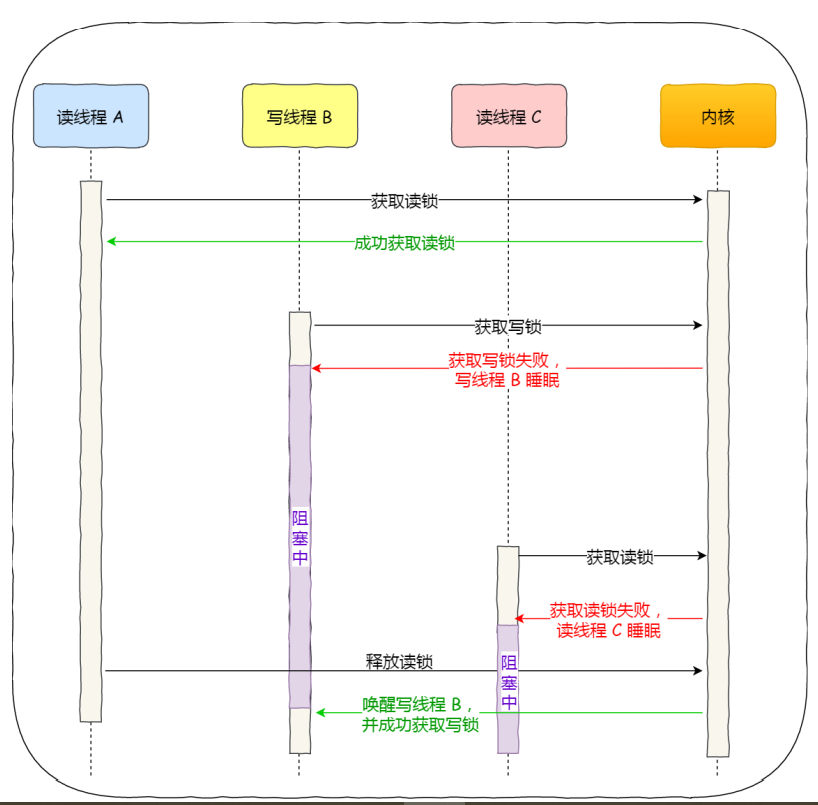
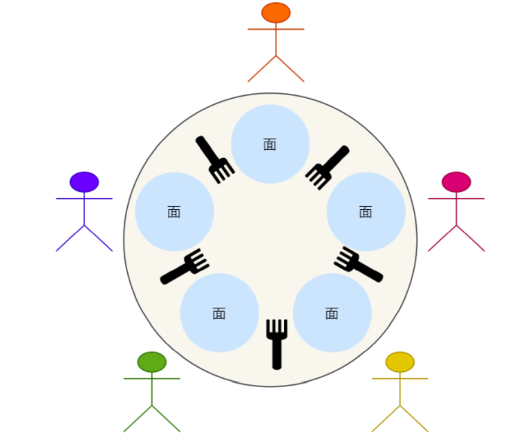
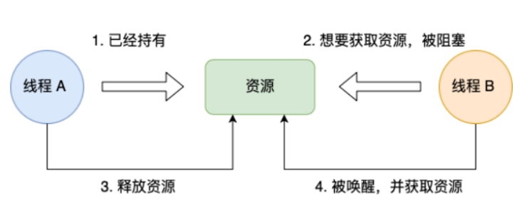

## 多线程的互斥与同步

### 互斥的概念


在多线程系统中，当多个线程互相竞争多个共享变量时，**可能会发生线程上下文的切换**，得到错误的执行结果，而且每次的结果还具有**不确定性**。由于多线程执行操作共享变量的这段代码可能导致竞争状态，因此我们把这段代码称为**临界区**，临界区是访问共享资源的代码片段，一定不能够被多个线程同时访问

我们希望**对临界区的访问是互斥的**，也就是说当一个线程在临界区中执行的时候，其他的线程都应该被阻止进入临界区，也就是说，**某一时刻只能够有一个线程在临界区中执行**


### 同步的概念

我们知道在多线程系统中，每个线程不是按照特定的顺序执行的，他们基本上是以不可预知的速度、各自独立的向前推进，但是有时候我们需要他们按照某一顺序、共同协作完成任务

```
例如：线程 1 是负责读入数据的，而线程 2 是负责处理数据的，这两个线程是相互合作、相互依赖的。
线程 2 在没有收到线程 1 的唤醒通知时，就会一直阻塞等待，当线程 1 读完数据需要把数据传给线程 2 时，线程 1 会唤醒线程 2，并把数据交给线程 2 处理。
```

所谓同步，就是**并发进程/线程在一些关键点上可能需要互相等待与互通消息，这种相互制约的等待与互通消息称为进程/线程的同步**


综上，可以看出互斥和同步是两个不同的概念

- 互斥指的是线程A和线程B不能够同时执行
- 同步指的是线程A必须要在线程B之前执行，线程C必须要等线程A和线程B执行完了之后才能够执行


### 互斥和同步的实现方式

互斥和同步的实现方式总共有两种

- 锁：加锁、解锁操作
- 信号量：P，V操作

**事实上，信号量的功能要比锁能加强大，锁和信号量都能够很方便的实现互斥，而信号量还能够很方便的实现同步**


#### 锁

我们前面说到了锁的基本类型就是自旋锁和互斥锁，基于这两个还可以有读锁、写锁，乐观锁、悲观锁等，下面我们就来看看这些锁的具体表现


对于锁，最基本的有两个：自旋锁和互斥锁，此外还有读写锁、乐观锁、悲观锁等，系统可以通过CPU提供的函数调用**CAS(Compare And Swap)和Test-And-Set指令**来实现自旋锁和互斥锁

```c
int TestAndSet(int *old_ptr, int new) {
    int old = *old_ptr;
    *old_ptr = new;
    return old;
}
// 函数目的：把old_ptr更新为一个新的值，返回旧的old_ptr的值
// TestAndSet是一个原子执行，要不执行，要么全执行
```


##### 自旋锁

> 首先是自旋锁，自旋锁又被称作忙等待锁，之所以称之为忙等待，是因为当自旋锁加锁失败之后，线程会忙等待，直到它能够获得锁

我们可以使用测试和置位指令来实现忙等待锁，如下：

```c
typedef struct lock_t{
    int flag;
}lock_t;

void init(lock_t *lock) {
    lock->flag = 0;
}

void lock(lock_t *lock) {
    while(TestAndSet(&lock->flag, 1) == 1) {
        // do nothing
    }
}

void unlock(lock_t *lock) {
    lock->flag = 0;
}
```

- 第一个场景：当有一个线程先要获得锁，首先它需要调用`lock`方法，因为此时没有其他线程在占用着锁，所以flag为0，本线程调用TestAndSet方法返回0，能够跳出while循环，并把flag置为1，表明他已经占用了锁，当该线程离开临界区之后，会调用unlock方法，将flag置为0
- 第二个场景：当某一个线程已经持有了锁（flag==1），本线程想要获得锁的时候，需要通过调用lock函数，结果就是本线程会被阻塞在while循环中，一直忙等，直到持有锁的那个线程释放了锁，将flag变成0，本线程才能够通过调用TestAndSet返回0，并将flag再次设置为1，从而获得锁进入临界区

通过上面的两个场景我们能够看到，当某一个线程获取不到锁的时候，就会一直while循环，不做任何事情，所以自旋锁被称作忙等待锁，这是一种**最简单的锁，一直自旋，利用CPU周期直到锁可用，利用自旋锁需要使用抢占式的调度器，否则自旋锁在单CPU上无法使用，因为自旋的线程会一直占用着CPU**


此外，**自旋锁还可以通过CPU提供的CAS（compare and swap）函数实现**，在用户态完成加锁和解锁操作，**不会主动产生线程上下文的切换**，一般加锁的过程有两个步骤：

- 第一步：检查锁的状态，如果是空闲的，那么执行第二步
- 第二步：将锁设置为当前线程所有

CAS函数就是把上面的两条指令合并成了一条硬件级指令，形成了原子指令，这样就能够保证两个步骤是不可分割的，要不都执行，要么都不执行

我们前面也提到了，当加锁失败了之后线程会一直忙等待，直到锁可用，**我们可以通过while实现忙等待，不过我们最好使用CPU提供的PAUSE指令实现忙等待，因为这样可以减少循环时减少的电量**


> 通过上面对自旋锁的描述，可以发现如果被锁住的代码的执行时间越长，自旋的时间就越长，所以使用自旋锁的时候应该考虑被锁住代码的执行时间


##### 互斥锁

互斥锁又叫做无忙等待锁，很显然，他就是当线程加锁失败的时候，不会进入忙等状态，而是将CPU让给其他线程，自己则进入等待队列（和阻塞队列一样）中，等待被唤醒和调度程序的调度

```c
typedef struct lock_t{
    int flag;
    queue_t *q;   // 等待队列
}lock_t;

void init(lock_t *lock) {
    lock->flag = 0;
}

void lock(lock_t *lock) {
    while(TestAndSet(&lock->flag, 1) == 1) {
        // do something
        // 1. 保存现在运行线程的TCB
        // 2. 将现在运行的TCB插入到等待队列中
        // 3. 将该线程设置为阻塞状态
        // 4. 调度程序
    }
}

void unlock(lock_t *lock) {
    if (lock->q != null) {
        // 1. 移出等待队列的队头元素
        // 2. 将该线程的TCB插入到就绪队列中
        // 3. 设置该线程为就绪状态
    }
    lock->flag = 0;
}
```

互斥锁是一种独占锁，当线程A加锁成功之后，此时的互斥锁已经被线程A独占了，只要线程A没有释放手里的锁，线程B就会加锁失败，从而让出CPU给其他线程，自己进入阻塞状态，如下图：


**对于互斥锁加锁失败而阻塞的现象，是由操作系统内核完成的**，当加锁失败之后，内核会将线程设置为睡眠状态，直到锁被释放之后，内核会在合适的时机唤醒线程，这个线程获得锁之后就能够继续运行了

从上面的过程中，我们就能够看出来互斥锁相较于自旋锁存在一部分的性能开销：主要在于加锁失败之后线程需要从用户态陷入内核态，被唤醒的时候有需要从内核态切换回用户态，这两个线程切换的过程就造成了性能开销，所以**当能够确定被锁住代码的执行时间比较短的时候就可以使用自旋锁，反之使用互斥锁。**


综上，自旋锁和互斥锁是两种最简单和基本的锁，他们的不同之处在就与当加锁失败之后的处理方式不同，自旋锁在加锁失败之后线程会一直自旋（忙等待），互斥锁在加锁失败之后线程会让出CPU，发生切换


##### 读写锁

读写锁从字面意思上我们就可以看出他是分成了两个锁：读锁和写锁，如果只读取共享资源那么加读锁就可以了，如果想要修改共享资源，那么就需要写锁，所以**读写锁的应用于能够明确区分读操作和写操作的场景**

读写锁的工作原理：

- 当写锁没有被线程持有时，多个线程能够并发的持有读锁，因为读锁是用于线程读取共享资源的场景，即使是多个线程共同读取也不会改变共享资源
- 当线程持有写锁的时候，其他线程获取读锁的操作会被阻塞，获取写锁的操作也会被阻塞

综上，我们能够发现写锁是独占锁，类似于自旋锁和互斥锁，而读锁是共享锁，多个线程能够同时持有，所以读写锁在读多写少的场景下能够有很好的效率

此外，**读写锁还分为读优先锁、写优先锁、读写公平锁三种**，具体的实现会在下面的“读者-写者问题”中展开

> 读优先锁

读优先锁期望的是读锁能够被更多的线程所持有，以提高读进程的并发性，他的工作方式是：当读线程A先持有了读锁，写线程B在获取写锁的时候会被阻塞，而如果之后又来了一个读线程C，那么它能够获取到读锁，直到所有的读锁都被释放了，写锁才能够被唤醒，运行


> 写优先锁

写优先锁期望的是优先服务写程序，其工作方式是当线程A先持有了读锁，写线程B在获取写线程的时候会被阻塞，并且在阻塞的过程中后来的读线程在获取读锁的时候也会被阻塞，这样只要线程A释放了读锁，那么线程B就能够获取到写锁，然后执行




> 读写公平锁

上面说了读优先锁和写优先锁，读优先锁能够提高读线程的并发量，但是也不是没有问题，我们试想一下，如果不断有读线程获取读锁，那么写线程将一直获取不到写锁，导致他被“饿死”；而对于写优先锁，虽然保证了写线程优先执行，但是如果写线程不断，那么读线程有可能会被“饿死”

所以，无论是读优先锁还是写优先锁，都有可能出现对方饿死的情况，所以还有一个读写公平锁

**读写公平锁就是不管是获取读锁还是写锁，都把获取锁的线程放到一个请求队列中，按照先入先出的顺序加锁，这样读锁既能够实现并发，也不会出现饿死写锁的情况**


##### 悲观锁

我们前面说的四种锁：自旋锁、互斥锁、读锁、写锁都属于悲观锁，**悲观锁认为多线程同时修改共享资源造成冲突的概率很大，所以在进入共享资源之前都需要先加锁**


##### 乐观锁

**乐观锁**认为多线程修改共享资源造成冲突的概率比较低，因此他**的工作方式是：先修改完共享资源，再验证这段时间有没有冲突，如果这段时间没有其他线程修改资源，那么操作完成，如果发现有其他线程修改了资源，那么就放弃本次操作**

可以发现，**乐观锁本质上全程都没有加锁**，所以他也叫做**无锁编程**，但是需要注意的是，我们只有当确定了冲突的概率很小的情况下才能够使用乐观锁，因为放弃修改之后的重试操作代价是比较大的

比如**乐观锁的一个经典例子就是在线文档**

如果在线文档使用的是悲观锁，那么某一时刻只能够有一个人来进行操作，这显然用户体验是不好的

所以在线文档为了支持多人同时操作，它使用了乐观锁，它允许多个用户同一时间对一个文档进行编辑，编辑完成之后采取验证修改的内容是否有冲突，那怎么样才算是有冲突呢？

> 比如用户A先在浏览器编辑文档，之后用户B在浏览器也打开了相同的文档进行编辑，但是用户B比用户A提前提交改动，这个动作用 户A是不知道的，当A提交修改后的内容时，用户A和用户B并行修改的地方就会出现冲突

那么冲突产生了之后，服务器是如何验证冲突的呢？

- 由于冲突发生的概率比较小，所以能够让用户先去编辑文档，但是浏览器在下载文档的时候会记录下服务器返回的文档版本号
- 当用户提交修改的时候，发给服务端的请求会带上原始文档的版本号，服务端收到之后会将它与当前版本号进行比较，如果版本号一致则修改成功，否则提交失败

实际上，平时使用到的Git和SVN也是使用了乐观锁的思想，先让用户编辑代码，然后提交的时候通过版本号判断是否发生了冲突，发生了冲突的地方就需要自己进行修改，再重新提交

乐观锁虽然去除了加锁和解锁操作，但是一旦发生冲突，重试的成本就非常高了，所以**只有在冲突概率非常低且加锁成本非常高的情况下，才考虑使用乐观锁**


#### 信号量

对于信号量，就是两个原语：

- P操作：对信号量减1，表示进入资源之前想获得锁，如果相减之后小于0，表示目前有线程在占用资源，本线程不能够进入临界区
- V操作，对信号量加1，表示释放临界区资源，如果相加之后**小于等于0**，可以去唤醒一个处于阻塞状态的线程

注意，PV原语必须要成对出现，**信号量是用来表示资源数量的**，对应的变量是一个`sem`变量

```c
// 操作系统是如何实现PV操作的

// 信号量数据结构
typedef struct sem_t {
    int sem;    // 资源数量
    queue_t *q; // 等待队列
} sem_t;

// 初始信号量
void init(sem_t *s, int sem) {
    s->sem = sem;
    queue_init(s->q);
}

// P操作
void P(sem_t *s) {
    s->sem--;
    if (s->sem < 0) {
        // 1. 保留线程的CPU现场
        // 2. 将该线程的TCB插入到等待队列中
        // 3. 将该线程设置为阻塞状态
        // 4. 执行调度程序
    }
}

// V操作
void V(sem_t *s) {
    s->sem++;
    if (s->sem <= 0) {
        // 1. 移出s等待队列首元素
        // 2. 将该线程的TCB加入到就绪队列中
        // 3. 将该元素设置为就绪状态
    }
}
```


### 经典同步问题

#### 生产者-消费者问题

该问题可以描述成：

- 生产者产生一个数据，放入缓冲区中
- 消费者从缓冲区中取出一个数据
- 任何时刻，只能够有一个生产者或者消费者访问缓冲区

通过上面的问题描述，我们能够发现，生产者和消费者在同一时刻只能够有一个访问缓冲区，所以他们是互斥的，而只有当生产者先产生了数据，消费者才能够获取到数据，所以从这个角度来看他们又是同步的

所以，对于生产者和消费者的实现，我们需要三个信号量，分别是：

- 互斥信号量`mutex`：用来互斥访问缓冲区，初始值为1
- 资源信号量`fullBuffers`：用于消费者询问缓冲区中是否有数据，初始值为0（表明缓冲区一开始没有数据）
- 资源信号量`emptyBuffers`：用于生产者询问缓冲区是否还有空余空间，初始值为n（也就是缓冲区大小设置为1）


```c
#define N 100   // 缓冲区大小
semaphore mutex 1;              //  互斥信号量，用来保证消费者和生产者之间的互斥访问
semaphore fullBuffers 0;        // 表示缓冲区中数据的个数
semaphore emptyBuffers N;       // 表示缓冲区中空余位置的个数

// 生产者函数
void producer() {
    while(TRUE) {
        P(emptyBuffers);   // 让缓冲区空槽位置减少一个
        P(mutex);          // 给缓冲区加锁
        // 将数据放入缓冲区中
        V(mutex);
        V(fullBuffers);   // 让缓冲区中的数据增加一个
    }
}

// 消费者线程函数
void consumer() {
    while(TRUE) {
        P(fullBuffers);   // 让缓冲区中的数据减少一个
        P(mutex);
        // 取出数据
        V（mutex);
        V(emptyBuffers);   // 让缓冲区的空槽数量增加一个
    }
}
```


#### 哲学家就餐问题



问题描述：

- 一张桌子上有5个哲学家，5个叉子
- 哲学家入座之后先思考，饿了就吃饭，吃饭的时候必须拿起左右两个叉子才可以吃
- 吃完之后放下叉子，继续思考


##### 方案一

```c
#define N 5         // 哲学家个数

semaphore fork[5];   // 叉子互斥信号量，其中fork[i] == 1表示每个叉子都是互斥访问的

void smart_person(int i) {   // i表示哲学家的编号
    while(TRUE) {
        thinking();   // 哲学家处于思考状态
        // 饿了，去拿自己左右的叉子
        P(fork[i]);
        P(fork[(i + 1) % N]);
        
        eat();
        
        V(fork[i]);
        V(fork[(i + 1) % N]);
    }
}
```

这种情况下，存在一个极端情况，那就是5个线程（哲学家）同时拿起了自己的左叉子，也就是都会被阻塞在拿右叉子这个过程中`P(fork[(i + 1) % N])`，会造成死锁，因此这种方案不行


##### 方案二

即然方案二在存在所有人都拿起左叉子的情况，所以我们可以给拿叉子这个过程加一个互斥信号量，来保证某个时刻只能够有一个人进程

```c
#define N 5         // 哲学家个数

semaphore fork[5];   // 叉子互斥信号量，其中fork[i] == 1表示每个叉子都是互斥访问的
semaphore mutex 1;   // 互斥信号量，保证某一时刻只能够有一个人拿起叉子

void smart_person(int i) {   // i表示哲学家的编号
    while(TRUE) {
        thinking();   // 哲学家处于思考状态
        
        P(mutex);   // 拿叉子之前先进入加锁
        // 饿了，去拿自己左右的叉子
        P(fork[i]);
        P(fork[(i + 1) % N]);
        
        eat();
        
        V(mutex);
        
        V(fork[i]);
        V(fork[(i + 1) % N]);
    }
}
```


可以看到，方案二虽然解决了方案一中死锁的问题，但是在方案二中某一时刻只能够有一个人吃饭，效率不高，所以我们接着看方案三


##### 方案三

```c
// 让奇数位的哲学家拿起左边的叉子，再拿右边的叉子，偶数位的哲学家先拿右边的叉子，再拿左边的叉子

#define N 5         // 哲学家个数

semaphore fork[5];   // 叉子互斥信号量，其中fork[i] == 1表示每个叉子都是互斥访问的

void smart_person(int i) {   // i表示哲学家的编号
    while(TRUE) {
        thinking();   // 哲学家处于思考状态
        // 饿了，去拿自己相应的叉子
        if (i % 2 == 0) {
            P(fork[(i + 1) % N]);
            P(fork[i]);
        } else {
            P(fork[i]);
            P(fork[(i + 1) % N]);
        }
        
        eat();
        
        V(fork[i]);
        V(fork[(i + 1) % N]);
        // V操作不用区分先后顺序，因为V操作不会造成死锁
    }
}
```


##### 方案四

方案三就能够实现某一时刻能够有两人同时进餐了，方案四使用锁的方式来实现相同的功能

```c
#define N 5

semaphora mutex 1;    // 保证某一时刻只能够有一个人拿起叉子

#define state[N];     // state数组用来保证每个哲学家目前的状态，状态有三种，如下定义
#define THINKING 0;
#define HUNGRY 1;
#define EATING 2;
 
semaphore s[N];       // 给每个哲学家一个信号量，初始值为0，同步信号量，只能一个个的来

#define left = (i + N - 1) % N
#define right = (i + 1) % N


void smart_person(int i) {
    while (TRUE) {
        thinking();         // 思考
        take_forks();       // 拿起叉子来
        eating();           // 吃
        put_forks();        // 放下叉子
    }
}

void take_fork(int i) {
    // 拿叉子，一拿就要拿起左右的来
    P(mutex);
    
    state[i] = HUNGRY;
    // 拿叉子
    test(i);
    V(mutex);
    
    P(s[i]);        // 表示这个哲学家已经拿过了，有可能拿起来了，有可能没有拿到被阻塞在这里了
}

void test(int i) {
    if (state[i] == HUNGRY && state[left] != EATING && state[right] != EATING) {
        state[i] = EATING;
        V(s[i]);          // 表示哲学家可以进餐了
    }
}

void put_forks(int i) {
    // 放下叉子
    P(mutex);
    
    state[i] = THINKING;
    test[left];    // 唤醒左边，看看他能不能拿起叉子来
    test[right];   // 唤醒右边，看看他能不能拿起叉子
    
    V(mutex);
}
```


**哲学家进餐问题对于多线程互斥访问共享资源的竞争问题（如I/O设备）一类的建模中很有作用**


#### 读者-写者问题

读者-写者问题描述

- 读-读允许：多个线程能够同时读
- 读-写互斥：没有读者的时候可以写，没有写者的时候可以读
- 写-写互斥：同一时刻只能够有一个写者可以写


##### 方案一：读者优先

````c
semaphora wMutex 1;         // 写互斥信号量
semaphora rCountMutex 1;    // 修改有多少个读者线程，需要互斥修改
int rCount = 0;             // 目前有多少个读者线程

void writer() {
    while(TRUE) {
        P(wMutex);
        
        write();
        
        V(wMutex);
    }
}


void reader() {
    while(TRUE) {
        P(rCountMutex);
        if (rcount == 0) {
            P(wMutex);   // 当读线程的个数为0的时候，看看是不是有写线程，如果P之后<0，则说明有写线程，如果这时候再有写线程进来，也会被阻塞，同时本线程也会被阻塞，直到这个写线程执行完了之后才能够继续往下走
        }
        rCount++;
        V(rCountMutex);
        
        read();
        
        P(rCountMutex);
        rCount--;
        if (rCount == 0) {   // 这时候没有读者线程了，可以释放写锁
            V(wMutex);
        }
        V(rCountMutex);
    }
}
````


##### 方案二：写者优先

```c
semaphore rCountMutex; // 控制rCount的互斥修改，初始值为1
semaphore rMutex; // 控制读者进入的互斥信号量，初始值为1

semaphore wCountMutex; // 控制wCount的互斥修改，初始值为1
semaphore wDataMutex; // 控制写者 写操作的互斥信号量，初始值为1

int rCount = 0; // 正在进行读操作的读者个数，初始值为0
int wCount = 0; // 正在进行写操作的写者个数，初始值为0

void wirter() {
    while(TRUE) {
        P(wCountMutex);
        if (wCount == 0) {
            P(rMutex); // 当写者个数为0的时候，看看是不是有读者，如果有的话，要阻塞后续的全部读者，同时在这个读者执行完之前，本线程也阻塞
        }
        wCount++;
        V(wCountMutex);
        
        P(wDataMutex);
        write();
        V(wDataMutex);
        
        P(WcountMutex);
        wCount--;
        if (wCount == 0) {
            V(rMutex);
        }
        V(WcountMutex);
    }
}

void reader() {
    while(TRUE) {
        P(rMutex);
        
        P(rCountMutex);
        if(rCount == 0) {
            P(wDataMutex);
        }
        rCount++;
        V(rCountMutex);
        V(rMutex);
        
        read();
        
        P(rCountMutex);
        rCount--;
        if (rCount == 0) {
            V(wDataMutex);
        }
        V(rCountMutex);
    }
}

```


##### 方案三：读写公平

公平策略的内容是：

- 读写的优先级一样
- 读者和写着互斥访问
- 只能有一个读者在临界区
- 可与有多个读者在临界区


```c
semaphore rCountMutex;      // 1
semaphore wDataMutex;  // 1
semaphora flag;         // 用于实现公平竞争,初始值也为1

int rCount = 0;

void writer() {
    while(TRUE) {
        P(flag);
        P(wDataMutex);
        
        write();
        
        V(wDataMutex);
        V(flag);
    }
}

void reader() {
    while(TRUE) {
        P(flag);
        P(rCountMutex);
        if (rCount == 0) {
            P(wDataMutex);
        }
        rCount++;
        V(rCountMutex);
        P(flag);
        
        read();
        
        P(rCountMutex);
        rCount--;
        if (rCount == 0) {
            V(wDataMutex);
        }
        V(rCountMutex);
    }
}
```


## 死锁

### 形成死锁的四个条件

前面说到了锁和信号量是实现多线程互斥和同步的主要手段，其中锁主要是用来实现互斥访问

**死锁指的是多个进程因为竞争共享资源而造成的一种僵局（相互等待），如没有外力作用这些进程都将无法进行下去**

死锁的产生必须要满足四个条件：

- 互斥条件
- 持有并等待条件
- 不可剥夺条件
- 环路等待条件


> 互斥条件，多个线程不能够同时持有同一资源



如果线程A已经持有了共享资源，如果线程B也想要持有共享资源，那么在线程A释放之前，线程B将进入阻塞状态


> 持有并等待条件，处于阻塞状态的线程并不会释放自己已经持有的资源

指的是当线程A已经拥有了资源1之后，还希望获取资源2，而资源2目前被线程C所持有，那么此时线程A就会进入阻塞状态，但是线程A并不会释放自己已经持有的资源1


>不可剥夺条件，当线程拥有了资源之后，在自己使用完之前是不允许别人剥夺的


线程B想要获得资源，只能够等待线程A使用完了之后自己主动释放，线程B才能够使用


> 环路等待条件，死锁发生的时候，两个线程获取资源的顺序形成了环形链


线程A已经持有了资源2，想获取资源1，线程B已经持有了资源1，想获取资源2


### 避免死锁的方法

前面我们说到了，产生死锁要同时满足四个条件：互斥条件、持有并等待条件、不可剥夺条件、环路等待条件，所以避免死锁可以破坏这四个条件中的任何一个

**目前常用的方法是顺序分配资源，来破坏环路等待条件**

```c
void *threadA_proc(void *data) {
	printf("thread A waiting get ResourceA \n");
	pthread_mutex_lock(&mutex_A);
	printf("thread A got ResourceA \n");
    
	sleep(1);
    
	printf("thread A waiting get ResourceB \n");
	pthread_mutex_lock(&mutex_B);
	printf("thread A got ResourceB \n");
    
	pthread_mutex_unlock(&mutex_B);
    
	pthread_mutex_unlock(&mutex_A);
	return (void *)0;
}


void *threadB_proc(void *data) {
	printf("thread B waiting get ResourceA \n");
	pthread_mutex_lock(&mutex_A);
	printf("thread B got ResourceA \n");
    
	sleep(1);
    
	printf("thread B waiting get ResourceB \n");
	pthread_mutex_lock(&mutex_B);
	printf("thread B got ResourceB \n");
    
	pthread_mutex_unlock(&mutex_B);
    
	pthread_mutex_unlock(&mutex_A);
	return (void *)0;
}

// 上面的两个函数，如果线程A和线程B获取资源的顺序不一致，就会产生死锁
// 比如线程B是先获得资源B，在获得资源A
// 那么就可能造成线程A先获得了资源A，在获得资源B的时候被阻塞，而线程B先获得了资源B，在获得资源A的时候被阻塞，从而形成死锁
```


此外，避免死锁还可以通过定时锁（为每个线程持有锁的时间设置一个阈值），死锁检测（通过算法机制检查系统中是否存在死锁）


