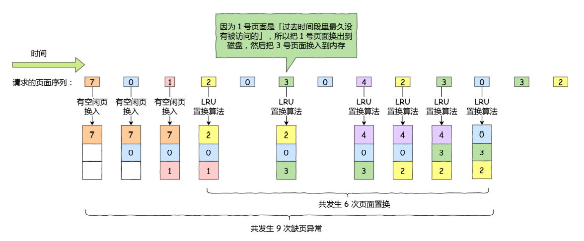
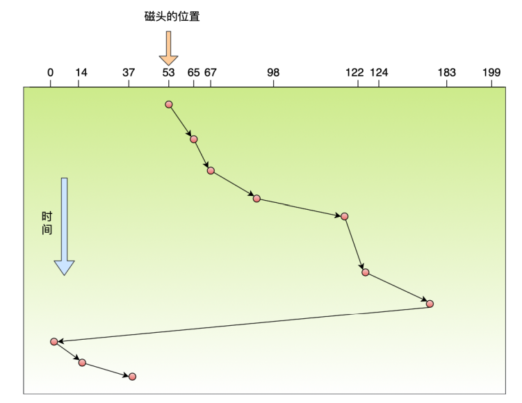

## 调度算法

### 进程调度算法

在学习进程调度算法之前，一定要树立两个意识：

- 进程的调度是由CPU完成的

- 进程调度算法改变的是进程等待的时间（进程在就绪队列中等待被调度的时间），而不会影响进程实际应用CPU的时间以及IO时间

> **进程的调度时机**

- 就绪状态 --> 运行状态：当进程被创建后，会从创建状态很快进入到就绪状态，操作系统会从就绪队列中选择一个进程运行
- 运行状态 --> 阻塞状态：当进程由于需要等待某件事情发生，而进入阻塞状态时，操作系统必须选择另一个进程运行
- 运行状态 --> 终止状态：当进程执行完毕之后，操作系统会调度另一个进程

> **调度原则**

- 较高的**CPU利用率**，调度程序应该确保CPU每个时刻都是繁忙的，比如当运行中的进程发生了IO事件的请求，那么此时进程在阻塞等待硬盘的数据返回，如果傻傻的等着，CPU这段时间就处于空闲状态，很显然这是不可取的，所以为了提高CPU的利用率，在这种发送IO事件致使CPU空闲的情况下，调度程序需要从就绪队列中选择一个进程来执行
- 较高的**系统吞吐量**，吞吐量表示的是CPU在单位时间内完成的进程数量，长作业的进程会占用较多的CPU资源，会降低系统吞吐量，短作业会提升系统吞吐量，因此调度程序需要综合考虑长作业和短作业的调度
- 较短的**周期时间**，进程从开始到结束的这段时间叫做周期时间，周期时间能够分成两个部分：进程等待被执行的时间以及进程在CPU上执行的时间，如果进程的等待时间远大于进程的执行时间，这样显然是很不合理的，所以调度程序要尽量避免这种情况，减少周期时间
- 较短的**等待时间**，这个等待时间不是进程处于阻塞状态的时间，而是进程处于就绪队列等待被调度的时间，如果这个时间太长了，会引起用户体验的下降
- 较短的**响应时间**，对于鼠标、键盘这种交互性较强的设备，我们当然希望它能够越快相应越好，否则就会影响用户体验了，所以对于交互性较强的应用，响应时间也是调度程序需要考虑的原则

#### 先来先服务算法FCFS

先来先服务算法是最简单的一个调度算法，**每次从就绪队列中选择最早进入就绪队列的进程执行，直到进行结束或者阻塞**才会继续从就绪队列中选出第一个进程继续执行

这似乎很公平，但是当一个长作业先进入就绪队列的时候，后面的短作业就会等待很长的时间，这对短作业是不公平的

**FCFS算法对长作业有利，适用于CPU繁忙的系统，不适合IO繁忙的系统**

#### 短作业优先SJF

SJF算法是从就绪队列中优先选出运行时间最短的进程，这有助于提高系统的吞吐量

很显然，SJF对短作业有利，但是有可能造成一个极端现象，如果短作业源源不断地来，会导致长作业一直得不到运行

#### 最高响应比调度算法HRRN

Highest Response Ratio Next，前面的FCFS和SJF都没能够很好的权衡长作业和短作业，所以HRRN的主要改进之处就是能够权衡长作业和短作业。

使用HRRN，每次在进行进程调度之前，都需要先算一个进程的响应比优先级，公式是

每次进行调度就会选出响应比优先级最高的进程，从上面的公式中可以发现：

- 要求服务的时间越短，响应比优先级越高，从这个角度来看，最高响应比调度算法考虑到了短作业
- 如果两个进程的要求服务时间相等，那么进程等待的时间越长，响应比优先级越高，从这个角度来看，最高响应比调度算法考虑到了长作业

#### 时间片轮转调度算法RR

最简单，最公平，最古老，使用最广泛的进程调度算法就是RR，操作系统为给个进程都分配一个时间片，即允许该进程在该时间段内运行

- 如果在一个时间片内进程没有能够执行完，那么此进程会把CPU释放出来，然后操作系统把CPU分配给另一个进程执行
- 如果在一个时间片内进程执行完或者进入阻塞状态，那么CPU会立刻发生切换

从上面这两点可以看出，时间片的长短在RR中有很重要的地位：

- 如果时间片的长度设置的太短了，那么会造成频繁的进程切换，导致CPU的利用率比较低。比如时间片的长度设置为10ms，进程切换的时间是5ms，那么CPU时间有1/3浪费在了进程切换上，这样CPU的利用率显然是比较低的
- **如果时间片的长度设置的太长了，那么会造成对短的交互请求的响应变差，极端情况下RR会退化成FCFS**，比如时间片长度设置成了500ms，如果有十个交互用户几乎同时按下回车键，将发生什么情况？假设所有其他进程都用足它们的时间片的话，最后一个不幸的进程不得不等待5秒钟才获得运行机会。多数用户无法忍受一条简短命令要5秒钟才能做出响应

#### 最高优先级调度算法HPF

前面的RR对所有的进程都采取一视同仁的措施，即把他们都看成是相同优先级的进程，每个进程的运行的时间都是一样的

但是对于多用户计算系统就有不同的看法了，他们希望调度是有优先级的，即希望调度程序能够从就绪队列中选择最高优先级的进程运行，这称为最高优先级调度算法（Highest Priority First，HPF）

优先级分为静态优先级和动态优先级

- 静态优先级指的是进程在创建过程中就已经指定了优先级，整个运行期间都不会改变
- 动态优先级指的是进程会动态地调整优先级，比如进程的等待时间增加，那么他的优先级也会增加，进程的运行时间增加，优先级会降低...

此外，最高优先级调度算法也有两种处理高优先级进程的方法：

- 抢占式调度：指的是当就绪队列中出现比当前运行进程优先级高的进程之后，高优先级的进程会立刻抢占CPU，当前运行的进程会被挂起
- 非抢占式调度：当前运行的进程执行完之后，会调度就绪队列中优先级最高的进程，即使这个高优先级的进程出现在当前进程的运行期间，也不会去抢占CPU

从上面的描述中可以看出，HPF算法可能会导致低优先级的进程一直运行不到

#### 多级队列反馈调度算法MFQ

**Multilevel Feedback Queue调度算法是时间片轮转调度算法和最高优先级调度算法的综合发展**

- 多级表示的是有多个队列，每个队列的优先级从高到低，优先级越高的队列时间片越短
- 反馈表示的是当有新的进程加入到高优先级的队列中时，CPU会立刻停止当前正在运行进程，转而去运行更高优先级的进程

**多级队列反馈算法的工作机制**

- 设置了多个队列，赋予每个队列不同的优先级，每个队列的优先级从高到低，优先级越高时间片越短
- 新的进程会被放在第一级队列的末尾，按照先来先服务排队等待被调度，如果第一级队列在规定的时间片内没有完成，那么第一级队列中的其他进程会被放入到第二级队列的末尾，依此类推
- 当较高优先级的队列为空时，才调度较低优先级的队列中的进程执行，如果进程运行时有新的进程进入较高优先级的队列，则停止当前运行的进程并将其移入到原队列末尾，接着让较高优先级的进程运行

从上面的工作机制中可以发现，对于短作业可能在第一级队列中很快被处理完，对于长作业，如果在第一级队列中运行不完，则会放入到第二级队列的末尾，虽然等待时间变成了，但是执行时间也变长了，所以多级反馈队列调度算法能够很好的协调长作业和短作业

> 注意：多级反馈队列里面的时间片指的是每个进程所持有的时间片，比如一级队列中有4个进程，时间片大小为1，表示的是这4个进程每个进程执行一个时间片，而不是四个进程共同执行1个时间片

### 内存页面置换算法

在学习内存页面置换算法之前，我们需要需要了解一下缺页中断，当CPU想要访问的页面不在内存中时，便会产生一个缺页中断，通知操作系统将缺页调入物理内存中

缺页中断和一般中断的区别：

- 缺页中断一般在**指令执行期间**产生和处理中断信号，而一般中断在一条**指令执行完成后**检查和处理中断信号
- 缺页中断返回到该指令的开始，重新执行该指令，而一般中断返回到该指令的下一条指令执行

如下图，是一条缺页指令的产生和处理过程：

当CPU执行`Load M`指令的时候，会去页表中找M对应的页表项，如果页表项是有效的，那么CPU可以直接访问物理内存，而图中页表项是无效状态，那么此时CPU就会产生一个缺页中断信号，操作系统收到中断信号之后，会调用缺页中断处理函数，去磁盘中寻找M对应的页，并把这个页换入到物理内存中，再换入之前，需要先检查物理内存中是否有空闲页，

- 如果没有空闲页，则需要使用页面置换算法来换出物理内存中的一个页面，将M对应的页面换入
- 如果有空闲页，则直接将M对应的页面换入即可

换入工作完成之后，将页表中的对应项修改为有效状态，然后CPU重新执行导致缺页中断的这条指令

> **下图是虚拟内存管理的整个流程**

可以看出，内存页面调度算法的使用时机是：产生了缺页中断需要从磁盘中换入新的页面到物理内存中，但是物理内存已满，此时需要使用内存置换算法从物理内存中选择被换出的页面，也就是说使用内存页面置换算法选择一个物理页换出到磁盘上，把需要访问的页面换入到物理页

#### 最佳页面置换算法

OPT的思想就是**选择未来最长时间不访问的页面换出**

该算法是一个理想算法，因为他需要算出每个逻辑页面下一次被访问的时间，然后选择出一个最久不会被访问到的页面换出，这显然是不能够计算出来的，因为指令的执行过程是动态的，我们没有办法预知页面在下一次被访问之前的等待时间

所以，最佳页面置换算法是一个理想的算法，**它的作用通常是用来衡量其他页面置换算法的效率，越接近OPT，页面置换算法的效率越高**

#### 先进先出页面置换算法

即然我们没有办法预知逻辑页面下一次的访问时间，我们可以**换出进入内存时间最久的页面，这就是先进先出页面置换算法的思想**

很显然，和最佳页面置换算法相比，先进先出页面置换算法10次缺页异常发生了7次置换，效率比较差

#### 最近最久未使用页面置换算法

LRU的思想是当发生缺页中断时，**选择最长时间没有被访问过的页面换出**，也就是说LRU认为很久没有使用的页面很可能在未来一段时间内也不会被使用，LRU的思想和OPT相反：LRU是通过页面的历史使用情况选择要被换出的页面，而OPT则是通过未来页面的使用情况选择要被换出的页面

LRU是可以实现的，但是代价很高，因为如果要实现LRU，需要在内存中维护一个所有页面的链表，最近最多使用的页面在链表头，最近最少使用的在链表尾。更加困难的是每次访问内存时都必须要更新整个链表，所以虽然LRU看上去不错，但是开销比较大，因此实际中很少使用

[实现LRU的代码](https://github.com/yangxcc/trouble_solver/blob/main/lru_and_lfu/LRUCache.java)

#### 时钟页面置换算法

时钟页面置换算法可以看成是LRU的一次改进，把LRU中的双向链表换成了环形链表，当发生缺页中断时：

- 如果当前指针指向的页面的访问位是0就淘汰该页面，并把新的页面插入到这个位置，然后把指针向前移动一位
- 如果当前指针指向的页面的访问位是1就清除访问位，然后指针向前移动，直到找到一个访问位为0的页面为止

可以看出时钟页面置换算法选择换出的页面也是最近未使用的页面

#### 最不常用页面置换算法

**最不常用页面置换算法指的是选择访问次数最少的页面换出，**他的实现方式是为每个页面设置一个访问计数器，每当这个页面被访问的时候，计数器就会加1，发生缺页中断时，淘汰访问次数最少的那个页面

这个算法看起来是比较好实现的，但在现实情况中，我们是需要考虑效率和硬件成本的，增加一个计数器会提高硬件成本，而找到计数器最小的页面需要遍历整个链表，效率也不好，而且还可能存在一个场景：

有一个页面最开始很频繁地被访问，导致计数器的值很大，但是现在却不访问了，而另一个页面之前未访问，现在却频繁访问，导致这个页面的计数器的值并不大，如果使用LFU，那么现在频繁访问的页面会被频繁换出换入，而之前频繁访问现在不访问的页面始终在内存中，这显然是低效的

### 磁盘调度算法

首先来看一下磁盘的结构，如下图所示：

中间圆的部分是磁盘的盘片，⼀般会有多个盘片，每个盘面都有自己的磁头。右边的图就是⼀个盘片的结构，盘片中的每⼀层分为多个磁道，**每个磁道分多个扇区，每个扇区是 512 字节**。那么，多个具有相同编号的磁道形成⼀个圆柱，称之为磁盘的柱面，如上图里中间的样子

**磁盘调度算法的目的很简单，就是为了提高磁盘的访问性能，一般是通过优化磁盘的请求访问顺序来做到的**

**寻道的时间是磁盘访问最耗时的部分**，如果请求顺序优化得当，必然可以节约一些不必要的寻道时间，从而提高磁盘的寻道时间

#### 先来先服务算法

假设有一组请求序列98，183，37，122，14，124，65，67，磁头位置在53，先来先服务顾名思义，就是先到的请求先服务，磁盘写入的顺序是从左到右，如下图：

如上图所示，先来先服务一共移动了640个磁道距离，这个算法简单粗暴，但是很明显效率比较低，如果大量的进程竞争使用磁盘，请求访问的磁道可能会很分散，这样FCFS算法的性能就会变得很差，因为寻道时间过长

#### 最短寻道时间优先算法

Shortest Seek First，SSF的思想是优先选择从**当前磁头位置**所需寻道时间最短的请求，假设有一组请求序列98，183，37，122，14，124，65，67，磁头位置在53，那么具体的请求顺序会是65，67，37，14，98，122，124，183，如下图：

磁头移动的总距离是236磁道，相比先来先服务性能提高不少

但是SSF有一个缺点：可能会产生饥饿现象，比如在124请求之后，到来的请求磁道位置都是在124和183之间的，那么就会导致183磁道访问不到，这里**饥饿现象产生的原因是磁头在一个小区域内来回移动**

#### 扫描算法

SCAN算法规定：**磁头在一个方向上移动，访问完这个方向上所有未完成的请求，直到磁头到达该方向上的最后的磁道，才调换方向**

这种算法也叫做电梯算法，还是以这个请求序列为例98，183，37，122，14，124，65，67，磁头的初始位置是53，假设扫描调度算法先朝磁道号减小的方向移动，那么具体的移动顺序变成了37，14， `0`(最左侧的位置) ，65，67，98，122，124，183

磁头先响应左边的请求，一直移动到最左侧（到0为止），才开始反向，响应右边的请求

扫描算法的**优点是性能较好，寻道时间短，不会产生饥饿现象**，但是存在一个缺点：**每个磁道的响应频率存在差异**，我们来看下面这个图（这个图中的绿色字体，说的是不用到最右边，这其实是LOOK算法）：

假设此时磁头正在往右移动，且刚处理过90号磁道，那么下次处理90号磁道的请求就需要等待磁头移动很长一段距离；而响应了184号磁道的请求之后，很快又可以再次响应184号磁道请求了，这就是每个磁道的响应频率存在差异

#### 循环扫描算法

为了解决每个磁道的访问频率存在差异，又出现了循环扫描算法C-SCAN，它的思想是**让磁头始终按照一个方向进行扫描，使得每个磁道的访问频率基本一致**

循环扫描规定只有磁头朝着某个特定方向移动时，才能够处理磁道的访问请求，而返回时直接快速移动至最靠边缘的磁道，也就是复位磁头，这个过程是很快的，而且在这个**复位过程中是不处理任何请求**的，该算法的特点就是**磁道只响应一个方向上的请求**

还是以这个请求序列为例98，183，37，122，14，124，65，67，磁头的初始位置是53，假设磁头一开始是往磁道号增加的方向移动，具体的请求顺序如下：65，67，98，122，124，183， `199`(最右磁道) ， `0`(最左磁道) ，14，37

磁头先响应了右边的请求，直到碰到了最右侧的磁道199，就立即回到磁盘的开始处（磁道0），但是这个返回途中是不响应任何请求的，直到到达了最左侧的磁道，才会依次响应右边的请求

C-SCAN相较于SCAN，每个磁道的访问频率基本一致，但是寻道时间会比SCAN长，也就是性能没有SCAN好

#### LOOK和C-LOOK算法

LOOK和C-LOOK分别是对SCAN和C-SCAN的改进，我们可以看到，**对于SCAN和C-SCAN都是磁头到最始端或者最末端才开始调转方向，**LOOK和C-LOOK的优化思路就是可以不用到最始端/最末端，而是**移动到最远的请求位置之后，立刻反向**，其余的都和SCAN和C-SCAN一样，LOOK在返回途中也能够响应请求，C-LOOK在返回途中不能够响应请求

