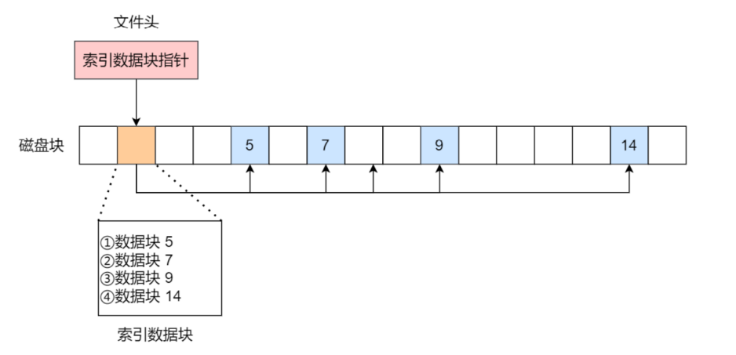

### 文件系统的基本组成

文件系统是操作系统中用于管理持久化数据的子系统，说简单一点，文件系统就是负责将用户的数据保存到本地磁盘上，即使计算机断电，数据也不会丢失

Linux中最经典的一句话就是“一切皆文件”，在Linux中不仅普通的文件和目录，就连管道、socket等也都是统一交给文件系统来管理的。

**Linux文件系统会为每个文件分配两个数据结构：索引节点（index node）和目录项（directory entry），他们的作用分别是用来记录文件的元信息和目录层次结构**

- 索引节点（inode）：用来记录文件的元信息，包括inode的编号，文件大小，访问权限、创建时间、修改时间、在磁盘中的位置等，**索引节点是文件的唯一标识**，他们之间一一对应，**索引节点同样也会被存储到硬盘中**，所以索引节点同样也占硬盘空间
- 目录项（dentry）：用来记录文件的名字、**索引节点指针**以及与其他目录项的层级关联关系，**多个目录项关联起来，形成目录结构**，目录项这个数据结构不仅能够表示目录，也是能够表示文件的，但是与索引节点不同的是，**目录项是由内核维护的一个数据结构，存储在内存中，而索引节点存储在硬盘上**

>需要注意的是，索引节点和目录项之间是一对多的关系，因为一个文件可能有多个名字，比如硬链接实现的就是多个目录项中的索引节点指向同一个文件（索引节点）


**==问题1：目录项和目录是同一个东西吗==**

不是，目录本身是一个文件，也是由索引节点来标识的，和普通文件不同的是，普通文件保存在硬盘中的是文件数据，而目录文件保存的是子目录或者文件，缓存在本地硬盘中。

而目录项是一个数据结构，缓存在内存中

如果频繁地从硬盘中查询目录，那么效率会很低，所以**内核会把已经读过的目录用目录项这个数据结构给保存到内存中**，下次再读取的时候直接从内存中获取了，能够大大提高文件系统的效率


**==问题2：文件系统读写的基本单位==**

我们知道<font color=red>磁盘读写的基本单位是扇区，一个扇区有512字节（0.5k）</font>，如果文件系统每次读写也是这么小的单位的话，读写效率会很低，所以**文件系统读写的基本单位叫做一个逻辑块（数据块），一个数据块由8个扇区组成，也就是4kb**，同时这4kb也是一个页面的大小（和前面虚拟地址空间的页对应起来啦，哈哈哈）


**磁盘在进行格式化的时候，会被分成三个存储区域，分别是超级块、索引节点区和数据块区**

- 超级块：用来存储文件系统的详细信息，比如块个数、块大小、空闲块等
- 索引节点区：用来存储索引节点
- 数据块区：用来存储文件或者目录数据

索引节点和超级块都是被存放在硬盘上的，为了加速文件的访问，通常会把索引节点加载到内存中，但是我们不可能把超级块和所有的索引节点都加载到内存中的，因为这样的话，内存肯定是不够用的，而且超级块和索引节点的加载时机也是不同的：

- 超级块：当文件系统被挂载时加载进内存
- 索引节点：当文件被访问时加载进内存


### 虚拟文件系统

**文件系统的种类众多，而操作系统希望用户提供一个统一的接口**，于是就在用户层和文件系统层之间引入了一个中间层，这个中间层就是虚拟文件系统（Virtual File System，VFS），VFS定义了一组所有文件系统都支持的数据结构和标准接口，因此程序员不需要了解文件系统的工作原理，只需要了解并使用VFS提供的统一接口就好了


Linux支持的文件系统也不少，根据存储位置，可以分成以下三类：

- 磁盘的文件系统：他是直接把数据存储到磁盘上的，比如`Ext 2/3/4`,XFS等都是这类文件系统
- 内存的文件系统：这类文件系统的数据不是存储到硬盘中，而是占用内存空间，我们经常用到的`/proc`和`/sys`文件系统都属于这一类，读写这类文件系统，其实就是读写内核数据
- 网络的文件系统，用来访问其他计算机主机数据的文件系统，比如NFS，SMB等

**<font color=red>文件系统需要先挂载到某个目录才可以正常使用，比如Linux的文件系统被挂载到根目录上</font>**


### 文件的使用

我们从用户的角度，是怎么样使用文件的呢？我们首先使用一个系统调用来打开文件


```c
fd = open(filename, path);    // 打开文件
...
write(fd);                    // 写入文件
...
close(fd);                    // 关闭文件
```

上面的代码是一个简单的过程

- 首先使用open系统调用打开一个文件，open的参数包括文件名和文件路径
- 使用 write 写数据，其中 write 使用 open 返回的文件描述符，并不使用文件名作为参数 
- 使用完文件之后，要用 close 系统调用关闭文件，避免资源的泄露

我们打开一个文件之后，操作系统会跟踪进程打开的所有文件，所谓跟踪，就是操作系统为进程维护一个文件打开表，文件表中的每一项代表文件描述符，所以说文件描述符时文件打开的标识，上面write的参数是文件描述符


操作系统在文件打开表中维护着打开文件的状态和信息（每个文件描述符里面保存着下述的这些信息）

- 文件指针：系统跟踪上次读写位置作为当前文件位置指针，这种指针对于打开文件的某个进程是唯一的
- 文件打开计数器：多个进程可能打开同一个文件，所以系统在删除打开条目之前，必须等待最后一个进程关闭文件， 该计数器跟踪打开和关闭的数量，当该计数为0时，系统关闭文件，删除该条目
- 文件磁盘位置：将文件的磁盘位置保存在内存中，下次访问时能够直接从内存中获取
- 访问权限：进程打开一个文件都需要有一个访问模式（创建、只读、只写、读写）该信息保存在进程的打开文件表中，以便操作系统能够允许或者拒绝之后的I/O请求


在用户的视角中，文件就是一个持久化的数据结构，但是操作系统并不关心用户想要写入的任何数据，操作系统关心的是怎么把写入的数据和数据块对应起来，因此，用户和操作系统对文件的操作存在差异，用户习惯以字节的方式读写文件，而操作系统则是以数据块的方式读写文件，那么屏蔽掉这种差异的工作就是由文件系统来完成了，我们分别来看一下读文件和写文件的过程：

- 当用户进程从文件读取1字节的数据时，文件系统首先会从磁盘中找到这1字节的数据对应的数据块，然后再返回数据块对应的用户进程所需的数据部分
- 当用户进程向文件写入1字节的数据时，文件系统需要找到写入数据的数据块的位置，然后修改数据块的对应部分，最后再把数据块写回到磁盘中

**所以说，文件系统的基本操作单位是数据块**


### 文件的存储（也叫文件的组织机制）

文件的存储从大方向上分成了两个部分：顺序存储和非顺序存储，非顺序存储又分成了链式存储方式和索引存储方式

#### 连续存储方式

文件的数据都存放在一段连续的磁盘空间上，这种模式下，文件的数据都是紧密连接的，因此文件的读写效率是比较高的，因为一次磁盘寻道就能够找到全部的数据


使用连续空间存储是有前提的，那就是要事先知道文件的大小，因为这样文件系统才能够在磁盘上找到相应大小的空间来存放文件数据

所以**文件头里面要包含起始块的地址和文件的长度**，有了这两个信息就可以很好的表示文件的存放方式是一块连续的存储空间

**连续存储方式的优点就是读写效率很高，但是却存在两个缺点：一是容易产生磁盘空间碎片，二是文件大小不易拓展，**如下图


当然上面的这两个缺点都可以通过文件移动的方式来解决，但是磁盘中挪动文件是非常耗时的操作。


#### 非连续空间存储方式

非连续空间存储方式分成了两种：一种是链表，一种是索引

我们首先来看链表，链表又分成了隐式链表和显式链表两种形式

- **隐式链表**的实现方式就是文件头中存放文件的起始块和末尾块，并且每个数据块中都要留出一部分的空间来存放指针，指针的只想就是下一个块的位置，这样每个数据块都能够通过从起始块开始找到了

  

  隐式链表的优点在于能够轻易地扩展文件的大小，而且不会产生磁盘空间碎片，但是缺点是没有办法直接访问数据块，每一个数据块的访问都要从起始块开始，而且每个数据块中都要留出一部分的空间来存放指针。此外，隐式链表方式的**稳定性较差**，如果系统在运行过程中由于软件/硬件的错误导致链表中的指针丢失或者损坏，会导致数据文件的丢失

- 显式链表的实现方式就是取出每个数据块中的指针，**将这些指针放到内存的一个表**中，该表在整个磁盘中就设置一张，每个表项存放链接指针，指向下一个数据块号，内存中存放的这个表称为文件分配表（File Allocation Table，FAT）

  

  由于查找记录的过程是在内存中进行的，所以速度比较快，也大大减少了访问磁盘的次数，但是由于这个表被放在了内存中，所以**显式链表存储中的FAT不适合大磁盘**


然后我们再来看一下索引方式

链表的方式解决了顺序存储方式中的两个缺点：容易产生磁盘空间碎片和文件大小不易扩展，但是链表方式不能够直接读写相应的数据块（FAT除外），因此又出现了索引存储的方式

**索引的实现就是为每个文件创建一个索引数据块，里面存放的是指向文件数据块的指针，那么文件头中只需要存放指向这个索引数据块的指针就可以了，通过文件头找到索引数据块，然后通过索引数据块找到相应的文件数据块**



创建文件时，将索引数据块中的所有指针都设置为空，当首次写入第i块的时候，首先在磁盘上找到一块空闲空间，然后将这个空闲块的地址写入到索引数据块的第i个条目中

索引存储方式的优点在于不会产生磁盘碎片、文件的创建、增大缩小都很方便，支持顺序和随机读写，由于索引数据也是存放在数据块中的，所以索引存储方式的缺点就在于他还有需要拿出额外的空间去存储索引数据块

如果文件很小，仍然需要一个索引数据块来存储每个文件数据块的索引

如果文件很大，一个索引数据块放不下，怎么办呢？这时候通过**组合的方式来存储大文件**

- **索引 + 链表的组合，**这个组合叫做链式索引块，他的实现方式是在索引数据块上留出一个存放下一个索引数据块的空间，于是当一个索引数据块中的内容使用完了之后，可以进入下一个索引数据块

  

  但是这种组合方式同样是不稳定的，当某个指针损坏了之后，后面的数据就没法访问了

- **索引 + 索引的组合，**这个组合叫做多级索引块，实现方式是通过一个索引块来存放多个索引数据块的地址

  


### UNIX文件系统


早期的UNIX文件系统综合连续存储和非连续存储的优点，它是根据文件大小，存放的方式会有变化

- 如果存放文件所需要的数据块小于10块，则采用直接查找的方式（顺序存储）
- 如果存放文件所需要的数据块大于10块，则采用一级间接索引的方式
- 如果前两种方式都不够存放大文件的话，则采用二级间接索引方式 
- 如果二级间接索引方式也不能够存储大文件的话，则采用三级间接索引方式

那么，文件头（inode）就需要13个指针 

- 10个指向数据块的指针 
- 第11个指向一级索引块的指针 
- 第12个指向二级索引块的指针 
- 第13个指向三级索引块的指针 

所以这种方式能够很灵活地应对大文件和小文件的存放 

- 对于小文件可以使用直接查找的方式来减少索引数据块的开销 
- 对于大文件则使用多级索引，因此大文件在访问数据块的时候需要经过大量查询 

这个方案就用在了 Linux Ext 2/3 文件系统里，虽然解决大文件的存储，但是对于大文件的访问，需要大量的查询，效率比较低。 为了解决这个问题，Ext 4 做了一定的改变。


### 空闲空间管理

前面我们说的文件系统是对已经占用数据块的组织和管理，那么接下来的问题就是，如果我想要保存一个数据块，我怎么快速地找到磁盘上空闲的数据块呢，主要有三种做法：空闲表法、空闲链表法以及位图法


#### 空闲表法

空闲表法就是为所有的空闲区间建立一张表，表内容包括空闲区的第一个块号和空闲块个数，注意，这个方式是来连续分配的，如下图：


当请求磁盘空间时，系统会依次扫描空闲表中的内容，直到找到一个合适的空闲区域为止，当用户撤销一个文件时，系统回收文件空间，这时也需要顺序扫描空闲表，寻找一个空闲表条目并将释放空间的第一个物理块号及它占用的块数填充到这个条目中

空闲表法只有当空闲块的个数较小的时候才有比较好的表现，当磁盘中存在大量小的空闲块时，会导致查询效率变得很低，另外这种分配技术适合建立连续文件


#### 空闲链表法

空闲链表法在每个空闲块里面有一个指针指向下一个空闲块，这样也能够很方便的找到空闲块并管理，如下图：


当创建文件需要一块或者几块空闲块的时候，依次从空闲链表的头部取下来即可，当回收空间时把这些空闲块依次连接到链头上

这种技术只需要在主存中保存一个指针就好，这个指针指向第一个空闲块，这种方式的特点就是比较简单，但是工作效率低，同时每个空闲块中还需要留出一部分来存放下一个空闲块的地址


**空闲表法和空闲链表法都不适合大型文件系统，因为这样会使得空闲表/空闲链表变得很大**


#### 位图法

位图是利用二进制的一位来表示磁盘中一个盘块的使用情况，磁盘上所有的盘块都有一个二进制位与之对应。 

- 当值为 0 时，表示对应的盘块空闲
- 当值为 1 时，表示对应的盘块已分配

它形式如下： 

```
1111110011111110001110110111111100111 ...
```

在 **Linux 文件系统就采用了位图的方式来管理空闲空间**，不仅用于数据空闲块的管理，还用于 inode 空闲块的管理，因为 inode 也是存储在磁盘的，自然也要有对其管理。 

创建一个位图表（bitMap），这个表的下标就表示物理块号，比如这个bitMap是 [1,0,0,1,1,1,0,0,0,0]，这就表示0号物理块不是空闲块，1号物理块是空闲块...


### 文件系统结构

在前面我们知道了Linux中使用位图法来管理空闲空间，用户在创建一个新文件的时候，会首先通过索引节点（inode）的位图找到空闲的索引节点，并进行分配，要存储数据时，通过这个索引节点找到空闲的数据块，并分配

数据块的位图是存放在磁盘中的，假设位图在某一个块中，因为每个块的大小为4K，所以一个块中的位图共能表示`4 * 2^10 * 8 =2^15`个空闲块，因为每个块的大小为4k，所以这些空闲块总共`2^15 * 4k=128M`

也就是说，如果按照上面的这种逻辑，一个索引节点的位图 + 若干个索引节点 加上 一个空闲块的位图 + 若干个空闲块能够表示的最大空间就是128M，这显然是不能够满足要求的，因为实际情况下，比128M大的文件太多了

**事实上，在Linux中，把上面的这128M的结构称为一个块组，那么通过多个块组就能够表示大文件了**


最前面的第一个块是引导块，在系统启动时用于启用引导，接着后面就是一个接一个的块组了，块组的内容如下： 

- 超级块：包含的是文件系统的重要信息，比如inode的总个数，块总个数，每个块组的inode个数， 每个块组的块个数等等 
- 块组描述符：包含文件系统中各个块组的状态，比如块组中空闲块和 inode 的数目等，**每个块组都包含了文件系统中「所有块组的组描述符信息」**
- 数据位图和inode位图：用于表示对应的数据块和inode块是否处于使用状态 
- inode列表：包含了块组中所有的inode，inode用于保存文件系统中与各个文件和目录相关的所有元数据 
- 数据块：包含文件的有用数据

从上面可以看出，每个块组中都有很多的重复信息，比如超级块和块组描述符，这两个都是全局变量，而且非常重要，这样做的原因是：

- 如果文件系统奔溃破坏了超级块或者块组描述符，有关文件系统结构和内容的全部信息都会丢失，如果有冗余的副本，该信息是可能恢复的
- 通过使文件和管理数据尽可能地接近，减少磁头寻道和旋转，这可以提高文件系统的性能

不过，Ext2 的后续版本采用了稀疏技术。该做法是，超级块和块组描述符表不再存储到文件系统的每个块组中，而是只写入到块组 0、块组 1 和其他 ID 可以表示为 3、 5、7 的幂的块组中


**==一个普通文件的存储过程==**

```
1. 检查索引节点的位图，找到一个为空的索引节点
2. 把对应的比特位从0设置成1
3. 把对应的文件属性写入到inode位图对应的索引节点中
4. 给这个索引节点对应的数据节点分配空间，写入数据
5. 把这个数据节点的地址也写入到索引节点中，并把对应的数据块位图中的对应位置设置为1
6. 将文件名字和inode号之间的映射关系写入到目录文件中
```


### 目录的存储

对于目录这种特殊文件，Linux中是如何存储的呢？

基于Linux中“一切皆文件”的设计思想，目录其实也是一个文件，甚至可以使用vim打开它，它里面也有 inode，inode里面也指向一些块

**和普通文件不同的是，普通文件的块存放的是文件数据，而目录的块中存放的是目录项，可以是文件也可以是目录**

在目录文件的块中，最简单的保存格式就是列表，就是一项一项地将目录下的文件信息（如文件名、文件inode、文件类型等）列在表里

列表中的每一项就代表该目录下的文件对应的文件名和inode，通过这个inode就能够找到真正的文件


如果一个目录下面的文件有很多，那么一个个的进行查找显然效率很低，所以保存目录的格式就变成了哈希表，对文件名进行哈希计算，把哈希值保存起来，如果我们要查找一个目录下面的文件名，只需要对这个文件名进行hash，如果hash值能够匹配上，就说明这个块中有对应的文件，但是这种保存格式就需要采取一定的预备措施来预防哈希冲突

目录查询是通过在磁盘上反复搜索完成的，需要不断地进行I/O操作，开销较大，所以为了减少I/O操 作，把当前使用的目录文件缓存到内存中，以后使用该文件时只要在内存中进行操作，从而降低了磁盘操作次数，提高了文件系统的访问速度。


### 软链接和硬链接

有时候，我们希望给文件起个别名，Linux中是通过软链接和硬链接的方式实现的，他们两个的区别是：

- 硬链接，指的是**多个目录项中的索引节点指向同一个文件**，也就是指向同一个inode，但是inode是不能够跨越不同的文件系统的，因为每个文件系统都有自己的inode数据结构和列表，所以**硬链接是不能够跨越文件系统的**，而且**由于多个目录项都指向同一个inode，那么只有删除了文件的所有硬链接以及源文件时系统才会彻底的删除该文件**

  

- 软链接相当于**重新创建了一个文件，这个文件有自己独立的inode，但是这个文件的内容是另一个文件的路径，所以使用软链接访问的时候相当于访问到了另一个文件**，所以**软链接是可以跨文件系统的**，甚至目标文件被删除了，链接文件还是存在的，只不过是找不到了而已

  


### ==文件I/O==

文件IO有很多种方式，主要有以下几种：

- 直接和非直接I/O

- 缓冲与非缓冲I/O 
- 阻塞与非阻塞I/O 
- 同步与异步I/O


#### 直接和非直接IO

**根据是否使用操作系统内核缓存，又可以分成直接IO和非直接IO**

- 直接IO，不会发生用户数据和内核缓存之间的数据拷贝，而是通过文件系统直接访问磁盘
- 非直接IO，读操作时先把内核缓存中的数据拷贝到应用程序中，写操作时，数据从用户程序拷贝到内核缓存，再由内核决定什么时候把数据写回到磁盘上

> 如果使用了非直接I/O写入数据，什么情况下会把内核中的数据写回到磁盘中 

- 在调用 write 之后，发现内核缓存的数据太多的时候，内核会把数据写到磁盘上 
- 用户主动调用 sync 时，内核缓存会刷到磁盘上 
- 当内存十分紧张，无法再分配页面时，也会把内核缓存的数据刷到磁盘上 
- 内核缓存的数据的缓存时间超过某个时间时，也会把数据刷到磁盘上


#### 缓冲与非缓冲I/O

文件操作的标准库可以实现数据缓存，那么**根据是否利用标准库缓存可以将文件IO分成缓冲IO和非缓冲IO**，所以缓冲IO又叫标准IO

- 缓冲IO：利用的是标准库中的缓冲来实现文件的加速访问，然后再通过系统调用访问文件
- 非缓冲IO：直接通过系统调用访问文件


> 参考链接 [缓存IO和非缓冲IO_renduy的专栏-CSDN博客](https://blog.csdn.net/renduy/article/details/70145027)，两者都使用了内核缓存
>
> 无缓存IO操作数据流向路径：**数据——内核缓存区——磁盘**
> 标准IO操作数据流向路径：**数据——流缓存区——内核缓存区——磁盘**


#### 阻塞和非阻塞I/O V.S. 同步和异步I/O

根据应用程序是否阻塞自身运行，分为阻塞I/O和非阻塞I/O

- 阻塞I/O是指应用程序执行I/O操作之后，如果没有获得响应，就会阻塞当前线程，自然就不能执行其他任务了，比如当用户执行read函数时，线程会被阻塞，一直等到数据准备好并且从内核缓冲区拷贝到应用程序缓冲区中，read才会返回

  > 注意，阻塞IO等待的是两个过程：一个是数据准备好，另一个是数据从内核缓冲区拷贝到应用程序缓冲区

  

- 非阻塞I/O是指应用程序执行I/O操作之后，不会阻塞当前的线程，可以继续执行其他的任务，随后再通过轮询或者事件通知的形式获取调用的结果

  - **非阻塞I/O**，非阻塞的read请求在数据未准备好的时候直接返回，可以继续往下执行，此时应用程序不断轮询内核，直到数据准备好，内核将数据拷贝到应用程序缓冲区， read 调用才可以获取到结果，过程如下图：

    

    在这种非阻塞IO模型中，用户线程需要不断地询问内核数据是否就绪，也就说**非阻塞IO不会交出CPU，而会一直占用CPU**

  - **非阻塞I/O的多路复用（NIO）**，我们现在常说的NIO指的是多路复用的非阻塞I/O模型，比如select，poll，epoll

    

    它是通过IO事件分发，当内核数据准备好时，再以事件通知应用程序进行操作，这种做法大大改善了应用程序对CPU的利用率，**在没有被通知的情况下，应用程序可以使用CPU去做其他事情**

    > 参考链接 [阻塞IO与非阻塞IO_万年精魄的博客-CSDN博客_非阻塞io](https://blog.csdn.net/qq_34638435/article/details/81878301)


- **异步I/O(AIO)，真正的异步I/O 数据准备好和数据从内核缓冲区拷贝到应用程序缓冲区这两个过程都是不用等待的**，这一种最理想的文件IO方式，也就是说当我们发起 `aio_read` 之后，就会立即返回，内核自动将数据从内核空间拷贝到应用程序空间，这个拷贝过程同样是异步的，内核自动完成的，和前面同步的操作不一样，应用程序并不需要主动发起拷贝动作，过程如下图：

  

  

综上，我们知道了文件IO有两个阶段，第一个阶段是将数据准备好，也就是找到相应位置的数据；第二个阶段就是把数据从内核缓冲区拷贝到应用程序缓冲区，阻塞I/O会阻塞在这两个阶段，而非阻塞IO和多路复用非阻塞IO都会阻塞在第二个阶段，所以，阻塞I/O和非阻塞I/O都属于同步IO方式，而异步IO上述的两个过程都是由内核自动完成，不需要等待


