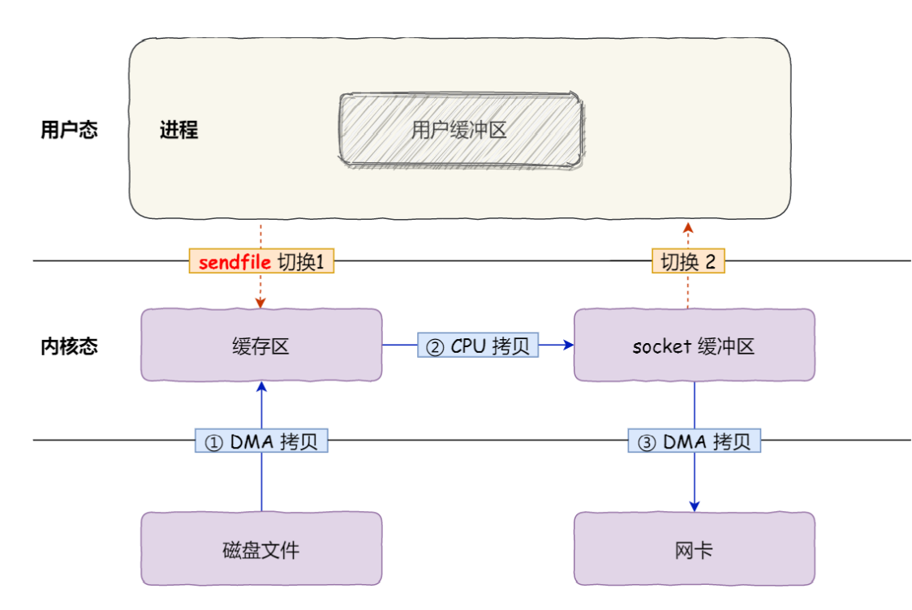
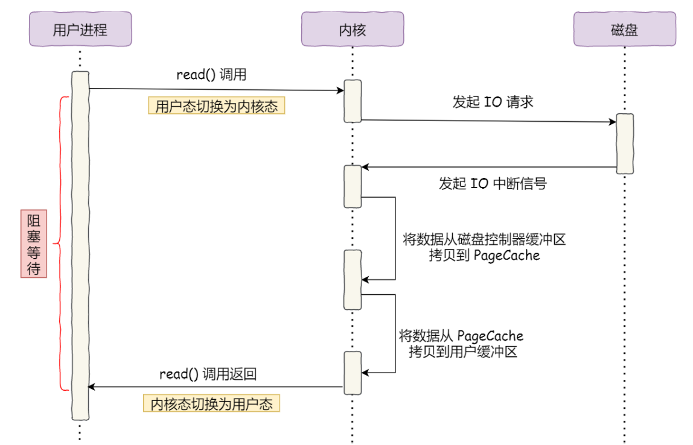
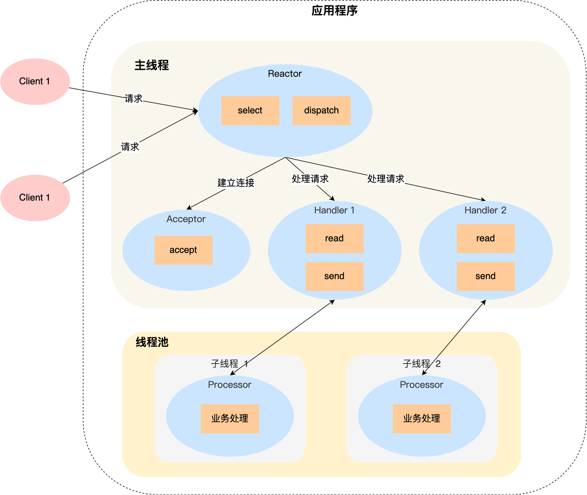
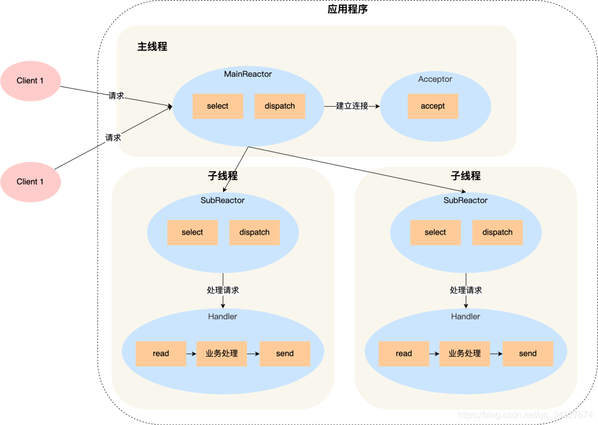

## 零拷贝

我们在前面复习了IO的控制方式，里面提到了DMA（直接内存访问），事实上，他是实现零拷贝的基础


### 为什么要有DMA技术

> 首先，我们先来说一下问什么要有DMA技术

如下图所示，这是没有DMA技术之前，I/O的过程：

- CPU发送对应的指令给磁盘控制器，然后返回
- 磁盘控制器收到指令之后就开始准备数据，将数据放到自己内部的数据缓冲区中，然后产生一个中断
- CPU接收中断之后，调用中断处理函数来处理中断请求，将磁盘控制器数据缓冲区中的数据拷贝到内核的读缓冲区中
- 然后CPU再把数据从内核的读缓冲区中拷贝到用户空间的缓冲区中

**可以看到，CPU参与了整个系统调用（read）搬运数据的过程，也就是这系统调用的过程中，CPU是没办法去做其他事情的**


如上所示的过程，在面临大文件、大数据的时候，都用CPU来搬运显然是效率很低的，所以计算机科学家们发明了DMA技术

DMA技术就是**在进行I/O设备和内存的数据传输的时候，数据搬运的工作全部交给DMA控制器来完成，而CPU不参与任何的数据搬运过程，这样CPU就可以在这段时间内去做其他的事情**


具体过程如上图所示：

- 用户进程调用read方法，向操作系统发起I/O请求，请求读取数据到自己的缓冲区中，进程进入阻塞状态
- CPU收到IO请求之后，将这个请求发送个DMA控制器，然后CPU继续执行其他任务
- DMA控制器将这个IO请求进一步发送给磁盘控制器
- 磁盘控制器收到这个IO请求之后，将数据从磁盘读取到磁盘控制器的缓冲区中，到磁盘控制器的数据缓冲区被读满之后，磁盘控制器向DMA发起中断信号，告诉DMA自己的数据缓冲区已经满了
- **这时候DMA将磁盘控制器数据缓冲区中的数据拷贝到操作系统内核的缓冲区中，此时不占用CPU，CPU可以执行其他任务**
- 当DMA读取了足够多的数据之后，会给CPU发送中断信号
- CPU接收到中断信号之后会将内核缓冲区中的数据拷贝到用户进程缓冲区中，系统调用返回

可以看到，使用DMA技术CPU不必参与整个数据传输的过程，CPU在数据搬运的过程中是可以去做其他事情的，但是CPU也会在开始和结束的时候执行，因为开始的时候CPU需要告诉DMA控制器读取多少数据，从哪里读取，结束的时候CPU需要将数据从内核缓冲区拷贝到用户进程中

之前DMA控制器只存在于主板中，但是现在每个IO设备中基本上都会有DMA控制器


### 传统传输文件的过程有多糟糕

如果服务器想要提供文件传输的功能，我们能够想到最简单的方式就是从服务器磁盘上把文件读取出来，然后通过网络协议栈把文件发送给客户端

传统I/O的工作方式是，数据读取和写入是从用户空间到内核空间来回复制，而内核空间的数据是通过操作系统层面的IO接口从磁盘中读取或者写入

传统方式中实现上述过程的两个方法是`read()`和`write()`，虽然系统调用很简单，但是这两个函数执行过程是动态的中发生了不少事情


如上图所示

- 首先由于发生了2次系统调用，所以会有4次的上下文切换，每次系统调用都会从用户态切换到内核态，等到任务完成之后，再从内核态切换回用户态，上下文切换的成本并不小，当并发量上升的时候，这种时间成本积累会更加明显

- 其次，会发生4次的数据拷贝，两次DMA数据拷贝，两次CPU数据拷贝
  - 第一次拷贝：把磁盘上的数据拷贝到内核缓冲区中，这个拷贝过程是由DMA来搬运完成的
  - 第二次拷贝：把内核缓冲区中的数据拷贝到用户的缓冲区中，于是应用程序就可以使用这部分的数据，这个拷贝过程是由CPU来搬运的
  - 第三次拷贝：把用户缓冲区中的数据拷贝到内核的socket缓冲区中，这个拷贝过程是由CPU来搬运的
  - 第四次拷贝：把socket缓冲区中的数据拷贝到网卡控制器的数据缓冲区中，这个过程是由DMA搬运的

因此，可以发送我们只传输一份数据，却发生了4次上下文切换和4次数据拷贝，多了很多不必要的开销，而这种开销在高并发场景下会更加明显，严重影响系统性能

所以，**要想提高文件传输的性能，就需要减少用户态和内核态上下文切换次数以及数据拷贝的次数**


### 如何提高文件传输性能


> 减少上下文切换次数

读取磁盘数据的时候，之所以要发生上下文切换，是因为用户空间的权限不够，不能够去访问磁盘和网卡，内核的权限最高，所以操作这些设备都需要经过内核，所以需要使用内核来完成某些操作的时候，就需要用到操作系统提供的系统调用函数

而一次系统调用必然会发生两次的上下文切换：首先从用户态切换到内核态，当内核执行完任务之后，再从内核态切换回用户态

因此，**减少上下文切换的次数的根本是减少系统调用的次数**


> 减少数据拷贝次数

在前面我们知道了，传统文件传输方式会发生4次数据拷贝过程，而且在这里面，从内核缓冲区拷贝到用户的缓冲区里，再从用户的缓冲区里拷贝到Socket的缓冲区里，这个过程是没必要的

因为文件传输的应用场景中，我们一般不会对文件进行“再加工”，因此数据其实可以不同搬运到用户空间中，所以可以**减少往用户缓冲区进行数据拷贝的这一过程**


### 如何实现零拷贝

实现零拷贝共有两种方式，`mmap() + write()`， `sendfile`


#### mmap() + write()

可以看出使用`mmap() + write()`的方式就是把`read`替换成了`mmap()`，`mmap`系统调用函数的作用就是把内核缓冲区的数据**映射**到用户空间，操作系统内核就不需要再进行任何的数据拷贝过程，如下图所示


实际上，**使用了`mmap()`之后，应用程序会和操作系统共享内核数据缓冲区**，这样就不用再把数据拷贝到用户空间了，能够节省一次数据拷贝的时间

这种方式不是最理想的零拷贝


#### sendfile

在Linux内核版本2.1中，提供了一个专门发送文件的系统调用函数`sendfile`

首先，这一个系统调用就可以替代前面说到的`read/mmap + write`两个系统调用，因此，他能够减少两次上下文切换

其次，它可以把内核缓冲区中的数据直接拷贝到socket缓冲区中，不用拷贝到用户态，因此它只需要3次数据拷贝



这仍然不是最理想的零拷贝


#### sendfile + SG-DMA技术


首先通过命令`ethtool -k eth0 | grep scatter-gather`查看网卡是否支持scatter-gather特性

如果支持的话，那么数据传输过程能够进一步优化


在网卡支持`scatter-gather`特性的情况下，sendfile系统调用的使用发生了一点变化，如上图所示

- 第一步，通过DMA将磁盘控制器数据缓冲区中的数据拷贝到操作系统内核的缓冲区中
- 第二步，缓冲区描述符和数据长度传到socket缓冲区中，这样网卡的SG-DMA控制器就可以直接将内核缓存中的数据拷贝到网卡控制器的数据缓冲区中，这样又可以减少一次数据拷贝过程

上述过程是目前最理想的**零拷贝，只需要发生2次上下文切换和2次数据拷贝过程，所以从总体来看，零拷贝技术至少要比传统文件传输方式的性能提高1倍以上**

也是我们常说的零拷贝技术，因为我们没有在内存层面去拷贝数据，而且全程没有通过CPU来搬运数据，所有的数据都是通过DMA来进行传输的


> <font color=blue>此外，Kafka就使用了零拷贝技术，大幅提升了I/O的吞吐率，此外，Nginx中也支持开启零拷贝</font>


### PageCache

上面解释了零拷贝为什么能够提高效率，但是有一个疑问，为什么第一次拷贝是把数据从磁盘控制器拷贝到内核缓冲区而不是直接拷贝到用户进程缓冲区呢？


第一，由于磁盘比内存的速度慢许多，所以我们应该想办法把读写磁盘替换成读写内存，比如把磁盘中的数据复制到内存中，就可以用读内存替换读磁盘。但是，内存空间远比磁盘要小，内存中注定只能复制一小部分磁盘中的数据。
**选择哪些数据复制到内存呢？**通常，刚被访问的数据在短时间内再次被访问的概率很高（这也叫“时间局部性”原理），**用 PageCache 缓存最近访问的数据，当空间不足时淘汰最久未被访问的缓存（即 LRU 算法）**。读磁盘时优先到 PageCache 中找一找，如果数据存在便直接返回，这便大大提升了读磁盘的性能。

第二，**PageCache开启了预读功能，**读取磁盘数据的时候，需要先找到数据所在的位置，对于机械磁盘来说就是先旋转磁头到数据所在的扇区，在开始顺序读取数据，其中，旋转磁头耗时很长，为了降低他的影响，PageCache开启了预读功能。

也就是说，虽然 read 方法只读取了 0-32KB 的字节，但内核会把其后的 32-64KB 也读取到 PageCache，后32KB 读取的成本很低。如果在 32-64KB 淘汰出 PageCache 前，进程读取到它了，收益就非常大。


所以，PageCache的优点主要有两个：

- 一个是缓存最近被访问的数据
- 第二个是预读功能


**但是在传输大文件（GB级别）的时候，PageCache就会不起作用，那样就相当于多做了一次DMA数据拷贝，造成性能的降低。**这是因为如果有<font color=red>很多（考虑高并发）</font>GB级别的文件要传输时，每当用户访问某个大文件的时候，内核就会把他们载入到PageCache中，于是PageCache空间很快就会被占满，另外，由于文件太大，可能某些部分再次访问的概率比较小，所以这就带来了两个问题：

- 首先，由于 PageCache 长期被大文件占据，热点小文件就无法充分使用 PageCache，它们读起来变慢了；
- 其次，PageCache 中的大文件没有享受到缓存的好处，但却耗费 CPU 多拷贝到 PageCache 一次。

**所以针对大文件，不应该使用PageCache，也就是说不应该使用零拷贝技术，否则在高并发的场景下会出现很严重的性能问题**


那么对于大文件的传输，我们应该使用什么方式呢？

我在前面复习文件IO的时候，复习到了文件IO的方式，这里**使用直接IO + 异步IO的方式来传输大文件**

我们再来看一下传统文件传输的方式，用户发起read系统调用之后，会一直处于阻塞状态



因为文件比较大，而且磁盘读写的速度比较慢，所以阻塞的时间会很长，为了解决阻塞这个问题，这里使用异步IO，它的工作方式如下：


它把读操作分成了两个部分：

- 前半部分，内核向磁盘发起IO请求，但是可以**不用等待数据就位就可以返回，**这时进程可以继续向下处理其他任务
- 后半部分，当内核将数据**拷贝进用户缓冲区（没有PageCache了）**后，进程将接收内核的通知，去处理这些数据

我们可以发现，异步IO的过程中没有涉及到PageCache，所以使用异步IO也就意味着要避免使用PacheCache，**不使用PacheCache的IO方式叫做直接IO**

> 通常来说，对于磁盘，异步IO只支持直接IO

综上，**<font color=red>使用异步IO+直接IO来传输大文件</font>**


事实上，使用直接IO的场景并不多，大致上分成两种

- 第一种就是我们上面说的高并发下传输大文件的时候，因为大文件难以命中PageCache缓存，又增加了一次DMA数据拷贝，同时还挤占了小文件使用PageCache时所需要的内存，因此这是用需要使用直接IO
- 第二种就是引用程序已经实现了磁盘文件的缓存，不需要PageCache再次缓存，引发额外的性能损耗，比如MYSQL数据库就使用直接IO


同样，使用直接IO是不再使用PageCache，直接IO存在下面的两个缺点：

- 没有办法享受PageCache的预读功能带来的性能提升
- 内核的IO调度算法会缓存尽可能多的IO请求在PageCache中，最后合并一个更大的IO请求再发给磁盘，这样做是为了减少磁盘的寻址操作


因此，**对于传输小文件使用零拷贝技术，对于传输大文件使用异步IO+直接IO的方式，而对于文件大小阈值的判断则需要灵活应用**

比如Nginx中的`directio`

```nginx
location /vedio {
    sendfile on;
    aio on;
    directio 1024m;
}
# 当文件大小大于1024M的时候，使用直接IO+异步IO，否则使用零拷贝sendfile
```


## 多路复用系统调用

最基础的TCP的Socket编程，他是阻塞IO模型，基本上只能够实现一对一通信，那为了服务更多的客户端，我们需要改进网络IO模型

比较传统的改进方式就是使用多进程/多线程模型，来为每一个连接的客户端分配一个进程/线程，然后后续读写都在对应的进程/线程中进行，这种方式处理100个客户端请求没问题，但是当客户端数量增大到10000个的时候（C10K问题），10000个进程/线程的调度、上下文切换以及他们占用的内存都会成为瓶颈

**为了解决上面的问题就出现了I/O多路复用：**可以在一个进程里面处理多个文件I/O，Linux下有三种提供I/O多路复用的API，分别是select，poll和epoll


select和poll本质上没有区别，他们内部都是使用**线性结构**来存储进程关注的socket集合

- select使用的是bitmap，来表示文件描述符集合
- poll使用的是链表

在使用的时候，首先需要把关注的Socket集合通过select/poll系统调用从用户态拷贝到内核态，然后由内核检测事件，当有网络事件产生时，内核需要遍历进程关注的Socket集合，找到对应的Socket，并将其设置为可读/可写，然后把整个Socket集合从内核态拷贝到用户态，用户态还要继续遍历整个Socket集合找到可读/可写的Socket，然后再对其进行处理

> 所以，select和poll的使用过程中会发生两次数据拷贝，两次集合遍历

很明显就能够发现，**select和poll的缺点在于当客户端越多，Socket集合也就会越大，Socket集合的拷贝和遍历会带来更大的开销，因此很难应对C10K问题**


epoll是解决C10K问题的利器，它通过两个方面解决了select和poll的缺陷

- epoll在内核中使用**红黑树**这个结构来保存进程关注的所有Socket，红黑树是一个高效的数据结构，增删查的时间复杂度一般是`O(log N)`，通过对这颗红黑树的管理，不需要像select/poll那样在每次操作时都传入整个集合，减少了内核和用户空间大量的数据拷贝和内存分配
- epoll使用事件驱动机制，在内核里维护了一个**链表**来记录就绪事件，只将有事件发生的Socket集合传递给应用程序，不需要像select/poll那样轮询扫描整个集合（包含有事件和无事件发生的socket），大大提高了检测效率


> 注意，我们在select，poll，epoll中提到的他们都使用相应的数据结构来跟踪自己进程所关注socket，这里的跟踪其实就是记录下socket的文件描述符，因为socket在Linux中也是一种文件


epoll的触发方式有两种：**边缘触发（ET）和水平触发（LT）**

- 边缘触发：当被监控的Socket文件描述符上有可读事件发生时，服务器端只会从epoll_wait中苏醒一次，即使进程没有调用read函数读取内核中的数据，也依然会苏醒一次，因此我们的程序要保证一次性将内核缓冲区中的数据读取完
- 水平触发：当被监控的Socket有可读事件发生时，服务器端会不断从epoll_wait中苏醒，直到内核缓冲区数据倍read函数读完才结束，目的是告诉我们有数据需要读取


如果文件描述符自上次状态检查以来有了新的I/O活动（比如新的输入），此时需要触发通知。上面的就绪条件对边缘触发基本也是有效的，应该说上面的条件在第一次满足时边缘触发和水平触发的就绪状态是相同的，但之后就会有所区别。

**边缘触发与水平触发最大的区别在于水平触发是只要上面的条件满足就会一直触发，而边缘触发是只有发生新的I/O活动时才会触发。**

举个读的例子：

- 本端调用epoll_wait()等待读就绪
- 套接字上有输入到来，epoll_wait返回，告知我们套接字已经处于就绪态了
- 再次调用epoll_wait()（注意这里没有读数据，直接再次调用epoll_wait）

如果我们采用的是水平触发，那么第二个epoll_wait()调用将告诉我们套接字处于就绪态，因为没有从缓冲区读取数据，接收缓冲区仍然存在数据，所以上面的条件仍然满足。而如果采用边缘触发，那么第二个epoll_wait()调用将阻塞，因为自从上一次调用epoll_wait()以来没有新的输入到来


select和poll只支持水平触发，而epoll支持水平触发和边缘触发，水平触发是默认的，但是边缘触发一般情况下效率更高


## 高性能网络模式Reactor和Proactor


首先，我们来说一下演变过程

我们知道，如果想让服务器服务多个客户端，那么最直接的方式就是为每个客户端创建一个线程（进程也可以，只是进程的开销更大），在处理完业务逻辑之后，随着连接的关闭相应的线程应该被销毁，但是这样频繁的连接创建和销毁不仅会带来性能开销，也会造成资源浪费，这种方式处理100个请求还行，但是对于C10K问题就明显不现实了

那么要怎么解决这个问题呢？

我们可以使用**资源复用**的方式，也就是不用再为每个连接创建线程了，而是创建一个线程池，将连接分配给线程，然后一个线程可以处理多个连接的业务，不过这样又引出了一个新的问题：线程怎么才能高效地处理多个连接的业务？

- 当一个连接对应一个线程的时候，线程一般采用`read --> 业务处理 --> send`的处理流程，如果当前连接没有数据可读，那么线程会阻塞在read操作上，socket的默认情况是阻塞IO，不过这种阻塞方式不会影响到其他连接
- 但是引入了线程池之后，一个线程对应着多个连接，线程在处理某个连接的read操作的时候，如果遇到没有数据可读，就会发生阻塞，那么线程就没办法继续处理其他连接了的业务了

改变线程池中存在的上述缺点，最简单的方式就是将socket改成非阻塞的，然后线程不断轮询调用read操作来判断该连接是否有数据可读，这种方式虽然能够解决阻塞的问题，但是过于粗暴，因为轮询是需要消耗CPU的，而且随着连接的增多，轮询的效率也会变低

**上面的方式的问题在于，线程不知道连接什么时候有数据可以读取，从而需要每次调用read去轮询**

那么有没有办法解决这个问题呢？答案是肯定的，**解决的方法就是I/O多路复用**

I/O多路复用技术会用一个系统调用函数来监听我们所关心的连接，也就是说一个监控线程里面监听很多的连接

我们前面说的**select，poll，epoll就是内核提供给用户态的多路复用API**


> select/poll/epoll是如何获取网络事件的呢

在获取事件时，先要把我们关心的连接（socket文件描述符）传给内核，然后由内核来检测是否有事件发生

- 如果没有事件发生，线程会阻塞在这个系统调用上，而不会像前面线程池那样不断地轮询调用read操作

- 如果有事件发生，内核会返回发生事件的连接，线程就会从阻塞状态返回，然后再从用户态中处理这些连接对应的业务


**Reactor模式实际上就是对I/O多路复用做了一层封装**，使开发人员不用去考虑网络API的细节，专注实现功能即可

事实上，**Reactor模式也叫做dispatcher模式：通过I/O多路复用监听事件，收到事件后，根据时间类型分配将连接分配给某个进程/线程**

从上面Reactor模式的定义中也可以看出，该模式主要分成了两个部分：

- **Reactor主要负责监听和分发事件**，**事件类型包括读写事件和连接事件**
- **处理资源池负责处理事件**，如read --> 业务处理 --> send

根据Reactor的个数，有以下几种方案：

- 单Reactor单进程/线程
- 单Reactor多进程/线程
- 多Reactor单进程/线程（和单Reactor单进程/线程相比，很复杂而且还没有性能优势，所以这种方案在实际中没有应用）
- 多Reactor多进程/线程

方案具体使用进程还是线程，要看使用的编程语言以及平台

- Java语言一般使用线程，因为Java虚拟机是一个进程，例如Netty
- C语言使用进程线程都可以，例如Nginx使用的是进程，memcache使用的是线程


### 单Reactor单进程/线程


- Reactor对象通过select（IO多路复用）监听事件，收到事件后通过dispatch方法进行分发，具体是分发给Acceptor还是Handler需要根据事件类型来判断
- 如果是建立连接的事件，那么就把这个事件分发给Acceptor，Acceptor对象会调用accept方法获取连接，并创建一个Handler对象来处理后续的响应事件
- 如果是读写类型的事件，则把该事件交由Handler对象来进行响应，Handler对象通过read --> 业务处理 --> send的流程来完成整个的业务流程

单Reactor单进程的方案实现起来比较简单，而且因为他全部的工作都是在一个进程内完成的，所以也不用考虑进程间通信的问题，也不用担心多进程之间的竞争

单Reactor单进程的方案的缺点在于只有一个进程，**无法充分利用多核CPU的优势**，另一个缺点是Handler对象在业务处理的时候，整个进程是无法处理其他连接事件的，所以如果正在处理的进程耗时较长，那么会**造成响应延迟**

> **综上，单Reactor单进程的方案适用于计算不密集而且业务处理非常快的场景，代表作redis**


### 单Reactor多进程/线程



- Reactor 对象通过 select （IO 多路复⽤接⼝） 监听事件，收到事件后通过 dispatch 进行分发，具体分发给 Acceptor 对象还是 Handler 对象，还要看收到的事件类型； 
- 如果是连接建立的事件，则交由 Acceptor 对象进行处理，Acceptor 对象会通过 accept ⽅法 获取连接，并创建⼀个 Handler 对象来处理后续的响应事件； 
- 如果不是连接建立事件， 则交由当前连接对应的 Handler 对象来进行响应；

上面的三个步骤和单Reactor单进程是一样的，但是下面的过程就不一样了

- Handler对象不再负责事件的业务处理了，只负责数据的接收和发送，Handler对象通过read读取到数据之后，会将数据发送给子线程里面的Processor对象进行业务处理
- Processor对象进行业务处理，完成之后，将结果发送会主线程中的Handler，接着Handler通过send方法将处理结果响应给客户端

单Reactor多线程能够充分利用多核资源，但是即然引入了多线程，那么势必会造成共享资源的争夺，因此在操作共享资源之前需要先加上互斥锁

> 事实上，单 Reactor 多进程相⽐单 Reactor 多线程实现起来很麻烦，主要因为要考虑子进程 <-> ⽗进程的 双向通信，并且⽗进程还得知道子进程要将数据发送给哪个客户端。 ⽽多线程间可以共享数据，虽然要额外考虑并发问题，但是这远比进程间通信的复杂度低得多，因此**实际应用中也看不到单 Reactor 多进程的模式。** 

**单Reactor存在一个缺点：一个Reactor对象承担所有事件的监听和响应，而且只在主线程中运行，在面对瞬间高并发的场景时，容易成为性能瓶颈的地方**


### 多Reactor多线程/进程



- 主线程中的MainReactor对象通过select**监控连接建立事件（前面两个模型还监听读写事件）**，收到事件后通过Acceptor对象中的accept获取连接，将新的连接分配给某个子线程
- 子线程中的SubReactor对象将MainReactor对象分配的连接加入select继续监听，并创建一个Handler用来处理连接的响应事件
- 如果有新的事件发生，SubReactor对象调用当前连接对应的Handler对象进行响应，Handler对象通过read-->业务处理-->send的流程来完成完整的业务处理


> 事实上，多Reactor多线程的方式比单Reactor多线程的方式更简单，原因如下：
>
> - 在多Reactor多线程方案中，主线程和子线程分工明确，主线程只负责监听连接建立事件，也就是主线程主负责新连接，而子线程负责后续的业务处理
> - 其次，多Reactor多线程方案中，子线程不用将处理结果返回给主线程，子线程可以在处理完之后直接通过send调用将处理结果响应给客户端

Netty和Memcache都使用了多Reactor多线程的方式，Nginx使用的是多Reactor多进程的方式


### Proactor

通过前面的描述，我们能够发现Reactor是非阻塞同步网络模式，而Proactor是异步网络模式

> 先通过一个例子来复习一下阻塞IO，非阻塞IO，同步IO和非同步IO
>
> 举个你去饭堂吃饭的例⼦，你好比应用程序，饭堂好比操作系统。 
>
> 阻塞 I/O 好比，你去饭堂吃饭，但是饭堂的菜还没做好，然后你就⼀直在那⾥等啊等，等了好⻓⼀段时间 终于等到饭堂阿姨把菜端了出来（数据准备的过程），但是你还得继续等阿姨把菜（内核空间）打到你的 饭盒里（⽤户空间），经历完这两个过程，你才可以离开。 
>
> 非阻塞 I/O 好⽐，你去了饭堂，问阿姨菜做好了没有，阿姨告诉你没，你就离开了，过⼏⼗分钟，你⼜来饭堂问阿姨，阿姨说做好了，于是阿姨帮你把菜打到你的饭盒⾥，这个过程你是得等待的。 
>
> 异步 I/O 好⽐，你让饭堂阿姨将菜做好并把菜打到饭盒⾥后，把饭盒送到你⾯前，整个过程你都不需要任何等待。

很明显，异步IO比同步IO的性能更好，因为异步IO不需要等待数据准备过程和数据拷贝过程


Proactor的工作流程

- Proactor Initiator负责创建Proactor和Handler对象，并将Proactor和Handler通过Asynchronous Operation Processor注册到内核
- Asynchronous Operation Processor完成注册请求并处理IO操作
- Asynchronous Operation Processor完成IO操作之后通知Proactor
- Proactor根据不同的事件类型回调Handler进行业务处理
- Handler完成业务处理


Reactor和Proactor的区别：

- **Reactor是非阻塞同步网络模式，感知的是就绪可读写事件**，在每次感知到有事件要发生时（比如可读就绪事件后），就需要应用程序主动调用read方法来完成数据的读取，也就是应用程序主动将socket缓冲区中的数据读取到应用进程内存中，这个过程是同步的，读取完数据之后应用程序才能处理数据
- **Proactor是异步IO网络模式，感知的是已完成的读写事件，**再发起异步读写请求时，需要传入数据缓冲区的地址（用来存放结果数据）等信息，这样系统内核可以帮助我们完成数据的读写工作，这里的读写工作都是由操作系统来完成，而不是像Reactor中那样由应用程序主动调用read/write，操作系统完成读写工作之后，就会通知应用进程直接去处理数据

因此，Reactor可以理解为来了事件操作系统通知应用进程，让应用进程来处理，而Proactor可以理解为来了事件之后操作系统处理，处理完之后在通知应用程序

> 这⾥的事件就是有新连接、有数据可读、有数据可写的这些 I/O 事件，这里的处理包含从驱动读取到内核以及从内核读取到用户空间


**Reactor和Proactor都是基于事件分发的网络编程模式，区别在于Reactor模式是基于待完成的IO事件，而Proactor是基于已完成的IO事件**


> 遗憾的是，Linux下的`aio`系列函数不完善，不是真正意义上的操作系统支持，而Windows中实现了一套完整的支持socket异步编程接口，这样接口就是IOCP

