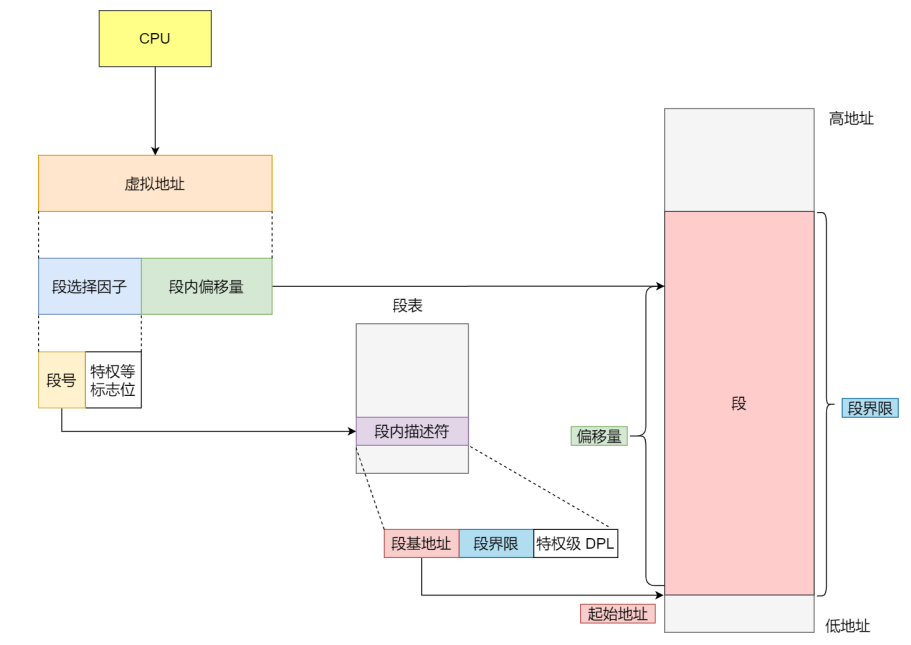
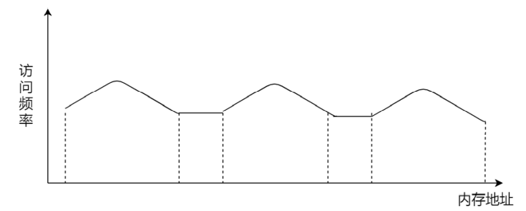
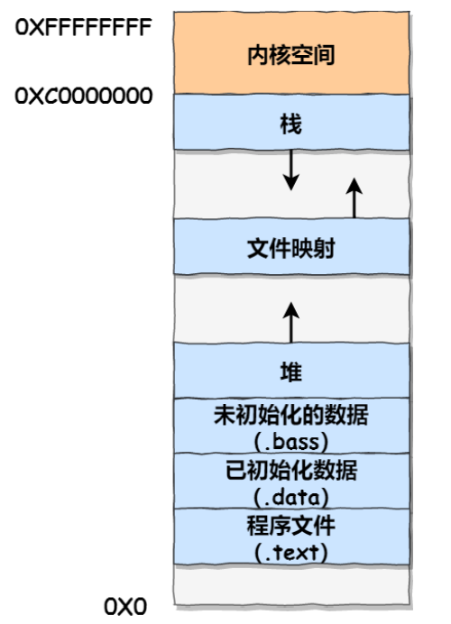
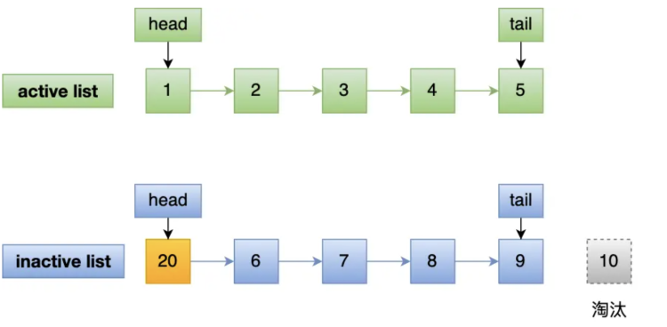

[toc]


## 内存管理

在没有内存抽象的年代，程序直接访问和操作的都是物理内存，比如当执行以下命令的时候

```c
mov reg1 1000
```

这个指令会毫无想象力的从物理地址1000加载到reg1寄存器中，不难想象，这种**直接CPU操作物理内存地址的模式使得多进程变得不可能**，比如在单片机中（单片机中是没有操作系统的，由CPU直接操作内存），必须执行完一条指令接着另一条指令，如果是多进程的话，由于直接操作物理地址，当一个进程给物理地址1000赋值之后，另一个进程同样也给这个物理地址赋值，那么第二个进程会覆盖第一个进程的值，这会造成两条进程的崩溃


> 那么操作系统是如何解决上述问题的呢？

上面不能够同时运行两个进程的关键就在于这两个进程都使用了相同的物理内存地址，这是我们需要避免的地方

**我们可以把进程使用的地址隔离起来，即让操作系统为每个进程分配一套虚拟内存，每个进程都有，而且每个进程都只需要操作好自己的虚拟地址就好，互不干涉，但是有一个前提是每个进程都不能够直接访问物理地址，至于虚拟地址是怎么映射到物理地址上的，这对进程来说是透明的，操作系统会提供一套机制（MMU）来完成这部分工作**


当进程当问虚拟地址的时候，操作系统会把这个虚拟地址转化成物理地址，这样不同的进程运行的时候，写入的是不同的物理地址，也就不会产生冲突了

- **虚拟内存地址：**程序所使用的内存地址都是虚拟内存地址
- **物理内存地址：**实际存储在硬件空间里面的地址都是物理内存地址

上面也说到了，操作系统会通过**内存管理单元（MMU）将虚拟地址映射成物理地址**，然后再通过物理地址来访问内存


> **<font color=red>操作系统是如何管理虚拟地址和物理地址之间的关系的呢？分段和分页</font>**


### 连续存储

 在现代的操作系统中，同一时间运行多个进程是再正常不过的了。为了解决直接操作内存带来的各种问题，引入的地址空间(Address Space),这允许每个进程拥有自己的地址。这还需要硬件上存在两个寄存器，**基址寄存器(base register)和界址寄存器(limit register)，**第一个寄存器保存进程的开始地址，第二个寄存器保存上界，防止内存溢出。在内存抽象的情况下，当执行

```
mov reg1,20
```

这时，实际操作的物理地址并不是20，而是根据基址和偏移量算出实际的物理地址进程操作，此时操作的实际地址可能是:

```
mov reg1,16245
```

 在这种情况下，任何操作虚拟地址的操作都会被转换为操作物理地址。而**每一个进程所拥有的内存地址是完全不同的**，因此也使得多进程成为可能。

但是此时就出现了一个问题，那就是内存不可能同时容纳下所有并发的进程，如下图

```
假设有 1G 的物理内存，用户执行了多个程序，其中： 游戏占用了 512MB 内存 浏览器占用了 128MB 内存 音乐占用了 256 MB 内存。 这个时候，如果我们关闭了浏览器，则空闲内存还有 1024 - 512 - 256 = 256MB

如果这个时候有一个需要200MB内存的进程到来，虽然物理内存还剩下256MB，但是因为是内存不是连续的，所以仍然放不下这个200MB的程序
```


上面出现的这种问题就叫做内存碎片，更具体一点叫做外部碎片

- 内部碎片：已经被分配出去（能明确指出属于哪个进程）却不能被利用的内存空间；也就是占据这个存储块的进程并不使用这块空间
- 外部碎片：还没有被分配出去（不属于任何进程），但由于太小了无法分配给申请内存空间的新进程的内存空闲区域。


这时候，就有了一种新的技术，**交换（Swapping）**，交换的基本思想是，将闲置的进程交换出内存，暂存在硬盘中，待执行时再交换回内存，比如上图中，可以先把音乐换出内存，然后让新程序运行，再把音乐换入内存（前后在内存中的地址肯定不一样了）


### 分段机制

前面的连续存储是把整个程序给映射到一个物理地址上，我们知道程序是由若干个逻辑分段组成的，由代码分段、数据分段、栈段、堆段组成，不同的段是有不同属性的，所以就用分段（`Segmentation`）的形式把这些段分离出来，**段的长度不固定，决定于用户所编写的程序**




在分段机制下，虚拟地址是由两部分组成：**段选择因子**和**段内偏移量**

- **段选择因子就保存在段寄存器里面**，段选择因子里面最重要的是段号，**用作段表的索引**，段表里面保存的就是这个段的基地址、段的界限和特权等级等 
- 虚拟地址中的**段内偏移量应该介于0和段界限之间**，如果段内偏移量是合法的，就将段基地址加上段内偏移量得到实际物理地址

通过上面的描述我们知道了**在分段机制下，虚拟地址是通过段表来和物理地址进行映射**，分段机制会把程序分成四个段：代码段、数据段、栈段、堆段，每个段在段表中都有一个项，在这一项找到段的基地址，再加上偏移量，于是就能够找到某段在物理内存中的地址，如下图：


如果要访问段三中偏移量为500的虚拟地址，我们可以计算出物理地址为段三基地址7000 + 偏移量500 = 7500

从上面的过程中，不难看出在分段机制中，仍然存在内存碎片（外部碎片），而且在多进程环境下，不可避免会发生swap，虽然段比前面连续机制换出的数据少了，但是这里仍然是瓶颈，因为硬盘的速度太慢了，每一次的内存交换，我们都需要把一大段的内存数据交换到硬盘中去

内存分段管理可以做到段根据实际需求分配内存，所以有多少需求就分配多大的段，所以**不会出现内部碎片**。但是由于每个段的长度不固定，所以多个段未必能恰好使用所有的内存空间，会产生多个不连续的小物理内存，导致新的程序无法被装载，所以**会出现外部碎片的问题**。

外部碎片问题就是通过内存交换这种方法来解决，因此在Linux系统中我们常看到的Swap空间就是内存交换空间，这块空间是从硬盘划分出来的，用于内存与硬盘的空间交换。

为什么分段机制下内存交换效率较低呢？因为硬盘的访问速度要比内存慢太多了，每一次内存交换，我们都需要把一大段连续的内存数据写到硬盘上，所以如果在内存交换的时候，交换的是一个占用很大内存空间的程序，会显得整个机器非常卡顿。


因此，分段机制的好处就是能产生连续的内存空间，坏处是存在 外部内存碎片 和 内存交换效率低 的问题，为了解决这两个问题就出现了内存分页。


### 分页机制

分页机制把**虚拟地址和物理地址都给分成了一段段固定长度的大小**，这样的一个连续并且尺寸固定的内存空间我们称之为**页`Page`**，在Linux中每个页的大小为4KB

**虚拟地址和物理地址之间的映射通过页表来完成，页表存储在CPU的内存管理单元MMU中，所以CPU可以直接通过MMU找出实际访问的物理内存地址**


**如果虚拟内存的页并不存在于物理内存中，那么将会产生一个缺页中断异常，CPU进入内核态处理这个异常，从磁盘中取得相应的页放入到物理内存中，如果此时物理内存已经满了，则还需要页面置换算法选择换出去的页面，然后更新进程页表，然后返回用户空间。**


**在分页机制中，无论是虚拟内存还是物理内存都是以页为单位了，那么在这种机制下也就不会产生外部碎片了，因为每个进程所需要的页不一定非要连续，但是可能出现内部碎片，因为分页机制内存分配的基本单位是页，即使程序不足一页大小，也得分配一个页，所以页内会存在内存浪费的现象。**

如果内存空间不够，操作系统会把其他正在运行的进程中最近未使用到的内存页面置换出去，也就是暂时写到硬盘上，这个过程叫做换出`Swap out`，一旦需要的时候在加载进来，称为换入`Swap in`，**一次性换出或者换入几个页面相较于段，效率肯定会有所提高**


更进一步，分页机制下，我们在加载程序的时候不需要把程序需要的全部页都加载进内存，我们完全可以在进行虚拟内存和物理内存的页之间映射之后，并不真的把页加载到物理内存中，而是只有在程序运行中，需要用到对应虚拟内存页里面的指令和数据时，再加载到物理内存里面去的


> 分页机制下，虚拟内存和物理内存是怎样映射的


在分页机制下，虚拟地址分成了两个部分：页号和页内偏移量，页号作为页表的索引，页表包含的物理页每页所在物理内存的基地址，这个基地址与页内偏移的组合就形成了物理内存的地址，如上图

分页机制下，对于一个虚拟地址转换成物理地址其实就分成了三个过程

- 将虚拟地址切分成页号和页内偏移量
- 根据页号，在页表中找到对应的物理页号
- 直接拿这个物理页号加上前面的页内偏移量，就得到了物理内存地址


上面是简单的分页机制，看起来没什么问题，但是在实际操作系统中肯定是不能够这样的，我们可以看一下场景：

```
对于一个32位的操作系统，我们知道虚拟内存是4G，也就是说每一个进程都会有一个4G的虚拟空间，也就是说每个进程都对应着一个页表，我们前面说到了在Linux中每个页面的能够表示的范围大小为4K，那么表示这个4G的虚拟内存，就需要2^20个页面，大约100万个，每个页表项需要4个字节来存储，那么对于每个进程它的页表就是4*2^20=4M，一个进程的页表大小就是4M，100个就是400M，这显然是很难接受的

之所以每个页表项都需要四字节，是因为在32位的操作系统中地址最大是2^32，这恰好是4字节能够表示的最大范围，所以使用4字节来表示每个页表项
```

所以，为了解决上面这个问题，就提出了**多级页表（Multi-Level Page Table）**

> 我们来看一下二级页表

如果我们把上面的页表在进行分页，形成二级页表，那么结果如下所示：


一级页表分为1024个二级页表，每个二级页表中包含了1024个页表项

我们知道，根据上面的定义，每个页表项的大小为4字节，那么对于这1024个一级页表，这就是4K的大小，而每个一级页表又对应着1024个二级的页表项，所以二级页表的大小为`1024*1024*4bit=4M`，这么一看，**二级页表（4M+4K）**比一级页表（4M）更大了，那么优化从何而来呢？

如果使用了二级分页，一级分页就可以覆盖整个4GB的虚拟地址空间，但是**如果某个一级页表的页表项没有被用到，也就不需要创建这个页表项对应的二级页表了，即可以在需要时才创建二级页表，**做一个 简单的计算，假设只有20%的一级页表被使用到了，那么页表占用的内存空间也就只有4KB + 20% * 4MB=0.804MB，这对比单级页表的 4MB 是不是一个巨大的节约？

那为什么不分级的页表就没有上面的效果呢？

我们从页表的性质来看，页表的作用就是将虚拟内存地址映射成物理内存地址，假设虚拟地址在页表中找不到对应的页表项，那么计算机系统就不能够正常工作了，**所以页表在创建时一定要覆盖全部的虚拟地址空间，不分级的页表就需要使用100多万个页表项来进行覆盖，而二级分页则只需要1024个页表项**（此时一级页表覆盖到了全部的虚拟空间地址，二级页表在需要的时候才会被创建）

我们把二级分页再推广到多级页表，就会发现页表占用的内存空间更少了，这一切都要归功于对**<font color=red>局部性原理</font>**的充分应用。 

**对于 64 位的系统，两级分页肯定不够了，就变成了四级目录，分别是：** 

- 全局页目录项 PGD（Page Global Directory）
- 上层页目录项 PUD（Page Upper Directory）
- 中间页目录项 PMD（Page Middle Directory） 
- 页表项 PTE（Page Table Entry）


我们从上面多级分页的过程中不难看出，在多级分页机制下，虽然解决了空间上存在的问题，但是从虚拟地址到物理地址的转换却多了几道工序，这显然降低了地址转化的速度，也就是带来了时间上的开销

**同样是因为程序是有局部性的，即在一段时间内，整个程序的执行权限仅限于程序中的某一部分，相应地，执行所访问的存储空间也局限于某个内存区域**



于是，我们可以把这几个最常访问的页表项放入到更快的存储结构中，于是计算机科学家们就在CPU芯片上加入了一个专门存放程序最常访问页表项的Cache，这个Cache就是TLB（Translation Lookaside Buffer），又叫做页表缓存、快表等

于是，有了快表之后，CPU寻址的时候会先去查找TLB快表，如果快表中没有再去查找常规的页表


如上图，在CPU的芯片里面封装了内存管理单元MMU（Memory Management Unit），**MMU的功能就是完成地址转化（页表在MMU中）并且能够和TLB进行访问与交互**，有了TLB后，在CPU寻址时，会先查TLB，如果没有查到，才会继续查常规的页表

事实上，TLB的命中率挺高的，因为最常访问的几个页表项也就那几个


### 段页式存储管理

我们一定要有一个意识，那就是**分段和分页不是对立的，**他们可以组合起来在一个系统中使用，也就是**段页式存储管理**


他的实现方式是：

- 先把程序划分成几个有逻辑意义的段，也就是前面提到的分段机制
- 然后把每个段再分成多个页，也就是对应段划分出来的连续空间，在划分出固定大小的页

这样的话，**虚拟地址就应该分成了三个部分：段号 + 段内页号 + 页内偏移量**

用于段页式地址变化的数据结构是每一个程序一张段表，对于每个段有建立起了一张页表，段表中的地址是页表的起始地址，而页表中的地址则是表示某页的物理地址


段页式地址变换中要得到物理地址必须经过三次内存访问 

- 第一次访问段表，得到页表的起始地址 
- 第二次访问页表，得到物理页号 
- 第三次将物理页号和页内位移组合，得到物理地址 

可用软、硬件相结合的方法实现段页式地址变换，这样虽然增加了硬件成本和系统开销，但提高了内存的利用率。


## Linux内存管理

Linux系统主要使用分页机制来管理内存，但是由于Intel处理器的发展历史，Linux不可避免分段机制，于是Linux就通过把每段的地址都设置成从0地址开始的整个4GB虚拟地址（32位环境下），也就是每个段的起始地址都是一样的，这意味着，**Linux系统中的代码，包括操作系统本身的代码和应用程序代码，所面对的地址空间都是线性地址空间（虚拟地址），这种做法相当于屏蔽了处理器中逻辑地址的概念，段只被用来做访问控制和内存保护**


在Linux操作系统中，虚拟地址空间又被分成了用户空间和内核空间两个部分，不同位数的系统，地址的范围也不相同，目前最常见的是32位和64位


**虽然每个进程都有自己的虚拟地址空间，但是对于每个进程的内核空间，他们其实都是共享的相同的物理内存，这样，进程切换到内核态的时候，就可以很方便地访问内核空间内存**


> 下面是用户空间的具体分布



通过上面这张图可以看到，用户空间内存从低到高分别是6种不同的内存段 

- 程序文件段，包括二进制可执行代码 
- 已初始化数据段，包括静态常量 
- 未初始化数据段，包括未初始化的静态常量 
- 堆段，包括动态分配的内存，从低地址开始向上增长 
- 文件映射段，包括动态库、共享内存等，从低地址开始向上增长 
- 栈段，包括局部变量和函数调用的上下文等，栈的大小是固定的，一般是8MB，当然系统也提供了参数，以便我们自定义大小 

在这6个内存段中，堆和文件映射段的内存是动态分配的，比如说，使用C标准库的 `malloc() `或者 `mmap()` ，就可以分别在堆和文件映射段动态分配内存


## 内存满了，会发生什么？

### 内存的分配过程是什么样的

应用程序通过malloc函数申请内存时，实际上申请的是虚拟内存，此时并不会分配物理内存

> malloc()并不是系统调用，而是C库里面的函数，用于动态分配内存，malloc在分配内存时，并不是老老实实的按照用户预期申请的字节数来分配内存空间的大小，而是会预分配更大的空间作为内存池

当应用程序读写到了这块虚拟内存，CPU就会去访问这个虚拟内存，这时会发现这个虚拟内存没有映射到物理内存，CPU就会产生缺页中断，进程从用户态切换到内核态，并将缺页中断交给内核的缺页中断函数（Page Fault Handler）处理。缺页中断处理函数会看是否有空闲的物理内存：

- 如果有，就直接分配物理内存，并建立虚拟内存和物理内存之间的映射关系

- 如果没有，那么内核就会开始进行回收内存的工作，回收的方式主要有两种：直接内存回收和后台内存回收

  > 页面置换算法是选择出需要置换出去的页面，而后台回收和直接回收是选出需要被置换出去的页面后，真正要去置换时的操作方法
  
  - **后台内存回收**（kswapd）：在物理内存紧张的时候，会唤醒kswapd内核线程来回收内存，这个回收过程是**异步**的，不会阻塞进程的执行。
  - **直接内存回收**（direct reclaim）：如果后台异步回收跟不上进程内存申请的速度，就会开始直接回收，这个回收过程是**同步**的，会阻塞进程的执行

如果直接内存回收之后，空闲的物理内存仍然无法满足此次物理内存的申请，那么内核就会触发**OOM（Out of Memory）**机制

*OOM Killer机制会根据算法选择一个占用物理内存较高的进程，然后将其杀死，以便释放内存资源，如果物理内存依然不足，OOM Killer会继续杀死占用物理内存较高的进程，直到释放足够多的内存位置*

申请物理内存的过程如下图：


### 有哪些内存可以被回收

系统内存紧张的时候，就会进行回收内存的工作，主要有两类内存可以被回收，而且他们的回收方式也不相同

- 文件页（File-backed Page）：内核缓存的磁盘数据（Buffer）和内核缓存的文件数据（Cache）都叫做文件页，大部分文件页都可以直接释放内存，以后有需要的时候，再从磁盘中重新读取就可以了，而那些被应用程序修改过的，并且暂时还没写入磁盘的数据（也就是脏页），就得先写入磁盘，然后才能进行内存的释放，所以**回收干净页的方式是直接释放内存，回收脏页的方式是先写回磁盘后再释放内存**
- 匿名页（Anonymous Page）：这部分内存没有实际载体，不像文件缓存有硬盘文件这样的一个载体，比如堆、栈数据等，这部分内存很可能会被再次访问，所以不能直接释放内存，他们回收的方式是通过Linux的Swap机制，Swap会把不常访问的内存先写到磁盘中，然后释放这些内存，给其他更需要的进程使用，再次访问这些内存的时候，重新从磁盘读入内存就可以了


文件页和匿名页的回收都是基于LRU算法，也就是优先回收不常访问的内存，LRU算法实际上维护着active和inactive两个双向链表，其中：

- **active_list** 活跃内存页链表，这里存放的是最近被访问过（活跃）的内存页；
- **inactive_list** 不活跃内存页链表，这里存放的是很少被访问（非活跃）的内存页；

越接近链表尾部，就表示内存页越不常访问，这样，再回收内存时，系统就可以根据活跃程度，优先回收不活跃的内存，活跃和不活跃的内存页，按照类型的不同，又分成了文件页和匿名页，可以从`/proc/meminfo`中查看他们的大小


### 回收内存带来的性能影响

回收内存的操作基本上都会发生磁盘IO的，如果回收内存的操作很频繁，意味着磁盘IO次数会很多，这个过程势必会影响系统的性能，下面针对回收内存导致的性能影响，说一下常见的解决方案：

- **（1）调整文件页和匿名页的回收倾向，尽量倾向于回收文件页，**从文件页和匿名页的回收操作来看，文件页的回收操作对系统的影响相比匿名页的回收操作会少一点，因为文件页对于干净页回收是不会发生磁盘IO的，而匿名页的Swap换入换出两个操作都会发生磁盘IO
  Linux中提供了一个`/proc/sys/vm/swappiness`选项，用来调整文件页和匿名页的回收倾向，`swappiness`的取值范围是`[0,100]`，值越大，越积极使用Swap，也就是越倾向于回收匿名页，数值越小，越倾向于回收文件页。一般建议 `swappiness` 设置为 0（默认值是 60），这样在回收内存的时候，会更倾向于文件页的回收，但是并不代表不会回收匿名页。
  
- **（2）尽早触发kswapd内核线程异步回收内存，**内存中定义了三个内存阈值（watermark，也称为水位），用来衡量当前剩余内存（pages_free）是否充裕或者紧张，分别是：

  - 页最小阈值（pages_min）
  - 页低阈值（pages_low）
  - 页高阈值（pages_high）

  上面的三个阈值会划分成四种内存使用的情况


kswapd会定期扫描内存的使用情况，根据剩余内存（pages_free)的情况来进行内存回收的工作

- 图中绿色部分：如果剩余内存（pages_free）大于 页高阈值（pages_high），说明剩余内存是充足的；

- 图中蓝色部分：如果剩余内存（pages_free）在页高阈值（pages_high）和页低阈值（pages_low）之间，说明内存有一定压力，但还可以满足应用程序申请内存的请求；
- 图中橙色部分：如果剩余内存（pages_free）在页低阈值（pages_low）和页最小阈值（pages_min）之间，说明内存压力比较大，剩余内存不多了。**这时 kswapd0 会执行内存回收，直到剩余内存大于高阈值（pages_high）为止**。虽然会触发内存回收，但是不会阻塞应用程序，因为两者关系是异步的。
- 图中红色部分：如果剩余内存（pages_free）小于页最小阈值（pages_min），说明用户可用内存都耗尽了，此时就会**触发直接内存回收**，这时应用程序就会被阻塞，因为两者关系是同步的。

页低阈值和页高阈值是根据页最小阈值计算出来的，而页最小阈值（pages_min）是由内核参数`min_free_kbytes`来设置的

```
pages_min = min_free_kbytes
pages_low = pages_min*5/4
pages_high = pages_min*3/2
```

- **（3）使用NUMA架构下的内存回收策略
  **CPU主要有两种架构，SMP和NUMA，SMP指的是一种多个CPU处理器共享资源的电脑硬件架构，也就是说每个CPU地位平等，他们共享相同的物理资源，包括总线、内存、IO等，每个CPU访问内存的时间都是相同的，因此这种系统也被称为一致性存储访问结构（UMA，Uniform Memory Access）
  随着CPU核数的增加，多个CPU都通过一个总线访问内存，这样总线的带宽压力会越来越大，同时每个CPU的可用带宽会减少，这也是SMP架构的问题

  

  非一致性存储访问结构（NUMA）就是为了解决SMP中的问题，NUMA中将CPU进行分组，每一组CPU用Node来表示，每个Node中包含一个或多个CPU，每个Node有自己独立的资源，包括内存、IO等，每个Node之间通过互联模块总线进行通信，这意味着每个Node中的CPU可以访问到整个系统中的所有内存，但是访问远端Node的内存比访问本地内存要耗时很多
  ***那么NUMA架构和内存回收有什么关联呢？***在NUMA架构下，如果某个Node的内存空间不足，可以从其他Node中寻找空闲空间，也可以从本地内存中回收内存
  具体选哪种模式，可以通过 `/proc/sys/vm/zone_reclaim_mode` 来控制。它支持以下几个选项：

  - - 0 （默认值）：在回收本地内存之前，在其他 Node 寻找空闲内存；
    - 1：只回收本地内存；
    - 2：只回收本地内存，在本地回收内存时，可以将文件页中的脏页写回硬盘，以回收内存。
    - 4：只回收本地内存，在本地回收内存时，可以用 swap 方式回收内存。

  在使用 NUMA 架构的服务器，如果系统出现还有一半内存的时候，却发现系统频繁触发「直接内存回收」，导致了影响了系统性能，那么大概率是因为 `zone_reclaim_mode` 没有设置为 0 ，导致当本地内存不足的时候，只选择回收本地内存的方式，而不去使用其他 Node 的空闲内存。

  虽然说访问远端 Node 的内存比访问本地内存要耗时很多，但是相比内存回收的危害而言，访问远端 Node 的内存带来的性能影响还是比较小的。因此，zone_reclaim_mode 一般建议设置为 0


### 如何保证一个进程不被OOM kill掉

在系统空闲内存不足的情况下，如果有一个进程申请了很大的内存，如果直接内存回收都无法回收出都无法回收出足够大的空闲内存，那么就会触发OOM机制，内核就会根据算法选择进程杀掉

Linux是根据什么标准来选择将被杀掉的进程呢？其选择逻辑在内核中的`oom_badness()`函数中，它会把系统中可以被杀掉的进程遍历一遍，并对每个进程打分，其中得分最高的进程将会被杀掉

`oom_badness()`函数的计算逻辑如下：

```cpp
// points 代表打分的结果
// process_pages 代表进程已经使用的物理内存页面数
// oom_score_adj 代表 OOM 校准值
// totalpages 代表系统总的可用页面数
points = process_pages + oom_score_adj*totalpages/1000 // points 代表打分的结果
// process_pages 代表进程已经使用的物理内存页面数
// oom_score_adj 代表 OOM 校准值
// totalpages 代表系统总的可用页面数
points = process_pages + oom_score_adj*totalpages/1000
```

可以看到进程得分受到两个方面的影响：

- 进程已经使用的物理内存页面数
- 每个进程的校准值`oom_score_adj`，它是可以通过` /proc/[pid]/oom_score_adj` 来配置的。我们可以在设置 -1000 到 1000 之间的任意一个数值，调整进程被 OOM Kill 的几率

每个进程的`oom_score_adj`默认值是0，所以默认情况下，最终得分只跟进程占用的物理内存有关，占用的物理内存越多越容易被杀掉

- 如果你不想某个进程被首先杀掉，那你可以调整该进程的 `oom_score_adj`，从而改变这个进程的得分结果，降低该进程被 OOM 杀死的概率。
- 如果你想某个进程无论如何都不能被杀掉，那你可以将 `oom_score_adj `配置为 -1000。


建议是将一些重要的系统服务的`oom_score_adj`设置为-1000，比如sshd，因为系统服务一旦被杀掉，我们就很难再登录进系统了

对于业务进程的`oom_score_adj`不建议设置成-1000，因为一旦业务进程发生内存泄漏，而他又不能被杀掉，这就会导致随着它的内存消耗变大，OOM Killer会被不断唤醒，将其他进程一个个的杀掉。


## 在4GB物理内存的机器上申请8G内存会怎么样？

32位的操作系统和64位的操作系统虚拟内存的大小是不相同的，在Linux中，虚拟地址空间会被划分为用户空间和内核空间两部分，如下所示：


可以看到，32位的操作系统中内核空间占1G，用户空间占3G，64位的操作系统中内核空间占128T，用户空间占128T

所以，如果是在32位的操作系统上申请8G内存，那么在申请虚拟内存阶段就会出错，在64位的操作系统上，因为进程申请内存（malloc）申请的是虚拟内存，只要是不读写虚拟内存，那么就不会申请物理内存，而且用户空间最大是128T，所以在申请虚拟内存阶段不会出错。

**根据上面的描述，是不是也说明在64位的系统中进程如果使用malloc申请128T的虚拟内存空间也是没问题的？**

首先，64位的操作系统中是不可能申请到128T的虚拟内存空间的，因为程序运行的本身也是需要申请虚拟空间的，所以我们只能申请接近128T的内存空间的。

然后，能不能申请到接近128T的虚拟内存需要看物理内存的大小了，因为即使malloc申请的是虚拟内存，不去使用就不会映射到物理内存，但是申请虚拟内存的过程中，还是使用到了物理内存，比如说内核保存虚拟内存的数据结构等，所以如果主机的物理内存比较小，那么大概率会发生OOM

第三，上面说的是没有开启Swap机制的情况下，如果开启了Swap机制，那么申请接近128T的虚拟内存空间是没问题的


### Swap机制

这种将内存数据换出到磁盘，将磁盘中的恢复数据换入到内存的过程，就是由swap机制来完成的。


使用swap机制的优点是应用程序实际上可以使用的内存空间是要远远超过系统的物理内存的，但是它的缺点是由于需要频繁的读写磁盘，会降低操作系统的运行效率

Linux 中的 Swap 机制会在内存不足和内存闲置的场景下触发：

- **内存不足**：当系统需要的内存超过了可用的物理内存时，内核会将内存中不常使用的内存页交换到磁盘上为当前进程让出内存，保证正在执行的进程的可用性，这个内存回收的过程是强制的直接内存回收（Direct Page Reclaim）。直接内存回收是同步的过程，会阻塞当前申请内存的进程。
- **内存闲置**：应用程序在启动阶段使用的大量内存在启动后往往都不会使用，通过后台运行的守护进程（kSwapd），我们可以将这部分只使用一次的内存交换到磁盘上为其他内存的申请预留空间。kSwapd 是 Linux 负责页面置换（Page replacement）的守护进程，它也是负责交换闲置内存的主要进程，它会在[空闲内存低于一定水位(opens new window)](https://xiaolincoding.com/os/3_memory/mem_reclaim.html#尽早触发-kSwapd-内核线程异步回收内存)时，回收内存页中的空闲内存保证系统中的其他进程可以尽快获得申请的内存。kSwapd 是后台进程，所以回收内存的过程是异步的，不会阻塞当前申请内存的进程。

Swap换入换出的是什么类型的内存？

- 内核缓存的文件数据因为都有对应的磁盘文件，所以在回收数据的时候，直接写回到对应的文件中即可
- 但是向进程中的堆、栈数据等，他们是没有实际载体的，因此这部分内存被称为匿名页，而且这部分内存还要再次被访问，所以不能直接释放内存，于是就需要有一个能够保存匿名页的磁盘载体，这个载体叫做**Swap分区**


### 总结

- 在 32 位操作系统，因为进程理论上最大能申请 3 GB 大小的虚拟内存，所以直接申请 8G 内存，会申请失败。

- 在 64位 位操作系统，因为进程理论上最大能申请 128 TB 大小的虚拟内存，即使物理内存只有 4GB，申请 8G 内存也是没问题，因为申请的内存是虚拟内存。如果这块虚拟内存被访问了，要看系统有没有 Swap 分区：

  - 如果没有 Swap 分区，因为物理空间不够，进程会被操作系统杀掉，原因是 OOM（内存溢出）；
  - 如果有 Swap 分区，即使物理内存只有 4GB，程序也能正常使用 8GB 的内存，进程可以正常运行；

  


## 如何避免预读失效和缓存污染的问题

这两个问题其实都是传统LRU中存在的问题

Redis 的缓存淘汰算法则是通过**实现 LFU 算法**来避免「缓存污染」而导致缓存命中率下降的问题（Redis 没有预读机制）。

MySQL 和 Linux 操作系统是通过**改进 LRU 算法**来避免「预读失效和缓存污染」而导致缓存命中率下降的问题。


### Linux操作系统和MySQL的缓存

在应用程序读取文件数据的时候，Linux操作系统是会对读取的文件数据进行缓存的，会缓存在文件系统的Page Cache中，Page Cache 属于内存空间里的数据，由于内存访问比磁盘访问快很多，在下一次访问相同的数据就不需要通过磁盘 I/O 了，命中缓存就直接返回数据即可。

因此，Page Cache 起到了加速访问数据的作用

MySQL的数据是存放在磁盘中的，为了提升MySQL的读写性能，InnoDB存储引擎设计了一个缓冲池（Buffer Pool），Buffer Pool属于内存空间里面的数据


有了缓冲池后：

- 当读取数据时，如果数据存在于Buffer Pool中，客户端就会直接读取Buffer Pool中的数据，否则再去磁盘中读取
- 当更新数据时，首先是会修改Buffer Pool中数据所在的页，然后将其页设置为脏页，最后由后台线程将脏页写入到磁盘中的


### 传统LRU是如何管理内存的

Linux的Page Cache和MySQL中的Buffer Pool的大小都是有限的，并不能无限地缓存数据，对于一些频繁访问的数据我们希望它们能够一直留在内存中，而对于一些很少访问的数据希望能够在某些时机将其淘汰掉，从而保证内存不会因为满了而无法缓存一些新的数据，以及能够保证经常访问的数据还会被保留在内存中。

LRU就是用来实现上述目标的常见方法

LRU算法一般使用链表来实现的，链表头部的数据是最近使用的，而链表末尾的数据是最久没被使用的。那么，当空间不够了，就淘汰最久没被使用的节点，也就是链表末尾的数据，从而腾出内存空间。

但是传统LRU中会存在预读失效和缓存污染的问题


无论是使用什么样的方式，什么样的管理策略，目的都是**提高缓存命中率。**


### 预读机制

#### 什么是预读机制

Linux操作系统为基于Page Cache的读缓存机制提供了预读机制，一个例子是：

- 应用程序只想读取磁盘上文件A的offset为0-3KB范围内的数据，由于磁盘的读写单位为block（4KB），于是操作系统的一次读取至少会读取4KB的内容，这恰好可以在一个page内装下
- 但是操作系统基于局部性原理（靠近当前被访问数据的数据，接下来大概率会被访问到），会选择将磁盘块offset [4KB,8KB)、[8KB,12KB) 以及 [12KB,16KB) 都加载进内存中，于是在内存中额外申请了三个page


上图中，应用程序利用系统调用read读取了4KB的数据，实际上内核使用了预读机制完成了16KB数据的读取，也就是通过一次磁盘读取将多个Page放入到Page Cache中

这样，下次读取4KB数据后面的数据时，就不用从磁盘中读取了，直接在Page Cache中即可命中缓存，因此预读机制带来的好处就是减少了磁盘IO的次数，提高了系统磁盘的IO吞吐量

MySQL InnoDB存储引擎的Pool Buffer也是类似的原理，MySQL从磁盘加载页时，会把相邻的页也加载到内存中，目的是为了减少磁盘IO


#### 预读失效会带来什么问题

如果这些被提前加载进来的页没有被访问到，那么就相当于预读的工作白做了，这个就是预读失效。

如果使用传统的LRU算法，就会把预读页放到LRU链表头部，而当内存空间不够的时候，还需要把末尾的页淘汰掉。如果这些预读页一直不会被访问到，那么就会出现一个很奇怪的问题，**不会被访问的预读页占用了链表的前排位置，而末尾淘汰的页，可能是热点数据，这样就大大降低了缓存的命中率**


#### 如何避免预读失效造成的影响

大多数情况下，局部性原理还是生效的，因此我们不能够因为预读可能失效，就将预读机制去掉。

而避免预读失效造成的影响，最好就是让预读页停留在内存中的时间尽可能的短，让真正被访问的页移动到链表的头部位置，这样才能够保证真正访问的页在内存中的时间尽可能地长

因此，Linux和MySQL通过改进传统的LRU来解决预读失效带来的影响：

- Linux操作系统实现了两个链表：活跃链表（active_list）和非活跃链表（inactive_list）
- MySQL的InnoDB存储引擎是在LRU链表上划分了两个区域：young和old

**这两种方式，核心思想是一致的，都是把数据分成热数据和冷数据，然后分别进行LRU**


##### Linux是如何避免预读失效造成的影响

Linux 操作系统实现两个了 LRU 链表：**活跃 LRU 链表（active_list）和非活跃 LRU 链表（inactive_list）**。

- **active list** 活跃内存页链表，这里存放的是最近被访问过（活跃）的内存页；
- **inactive list** 不活跃内存页链表，这里存放的是很少被访问（非活跃）的内存页；

有了这两个LRU链表后，预读页就只需要加入到inactive_list的头部，当页真正被访问到的时候，再将其插入到active_list的头部，如果预读的页一直没有被访问，就会从inactive_list中移除，这样就不会影响active_list中的热点数据了

举个例子，假设active_list和inactive_list的长度都是5，目前内存中有10个页，如下：


现在有个编号为20的页被预读了，那么他将被被插入到inactive_list这个链表中，而inactive_list末尾的10会被淘汰掉，这样的话，即使20这个页一直没有被访问到，那么它也没有占用热点数据所在的位置（active_list），而且还会比active_list中的数据先被淘汰出去。



如果20这个页被预读之后马上就被访问了，那么他会插入到active_list的头部，而active_list末尾的5这个页会被**降级**到inactive_list中，这个过程不会有页被淘汰。


##### MySQL是如何避免预读失效带来的影响的

MySQL的InnoDB引擎将传统LRU的链表划分了两个区域：young区域和old区域

young区域在LRU链表的前半部分，old区域则是在后面，这两个区域各有自己的头和尾。


young区域和old区域并不是1:1的关系，而是63:37的关系（默认情况，看情况了，这不是2/3：1/3）

**划分为这两个区域之后，预读的页就只需要加入到old区域的头部，当页真正被访问的时候，才会将页插入到young区域的头部，如果预读的页一直没有被访问到，就会从old区域移除，这样就不会影响young区域中的热点数据了**

举个例子，假设有一个长度为10的LRU链表，其中young区域占比70%


现在有一个20的页被预读了，这个页只会被插入到old区域的头部，old区域的尾部页被淘汰掉

如果20号页被预读后，就立刻访问了，那么他会被加入到young区域的头部，young区域尾部的7会被挤到old区域，作为old区域的头部，这个过程不会有页被淘汰


### 缓存污染

#### 什么是缓存污染

虽然Linux和MySQL通过改进传统的LRU算法解决了预读失效带来的问题，但是还是存在「**只要数据页被访问一次**，那么他就会被加载到活跃链表的头部/young区域的头部」这样的问题

当我们批量读取数据的时候，由于数据被访问了一次，这些大量数据都会被加入到活跃LRU链表中，然后之前缓存在活跃链表中的数据会被淘汰掉，如果刚被加载进来的大量数据很长一段时间内都不会被访问到，那么这就导致了整个活跃的LRU链表/young区域都被污染了，这就是**缓存污染**问题。


#### 缓存污染会带来什么问题

缓存污染带来的影响是很致命的，等到这些热数据再次被访问到的时候，发现他们已经不在活跃链表/young区域中了，那么又会发生大量的磁盘IO，导致系统性能急剧下降

以MySQL为例，当某一个SQL语句扫描了大量的数据时，在Buffer Pool空间比较有限的情况下，可能将Buffer Pool中的热点数据全部替换出去，这就导致了大量的热点数据被淘汰，等到这些热数据又再次被访问的时候，由于缓存未命中，会产生大量的磁盘IO，导致MySQL性能下降。比如在一个数据量很大的表中执行了以下sql语句：

```sql
select * from t_user where name like "%xiaolin%";select * from t_user where name like "%xiaolin%";
```

虽然最终的查询结构可能就几条，但是由于会导致索引失效，所以这里是**全表扫描**。

- 从磁盘读到的页加入到 LRU 链表的 old 区域头部；
- 当从页里读取行记录时，也就是**页被访问的时候，就要将该页放到 young 区域头部**；
- 接下来拿行记录的 name 字段和字符串 xiaolin 进行模糊匹配，如果符合条件，就加入到结果集里；
- 如此往复，直到扫描完表中的所有记录。

经过上述过程，虽然最后的结果集中数据量不多，但是由于在执行过程中会访问大量的数据页，所以这些数据页会被加载到young区域的链表中，导致之前缓存过的热点数据全部淘汰，而如果在这个过程中被加载进来的数据页后续没有再被访问了，这就造成了young区域链表的污染。

举个例子，假设需要批量扫描：21，22，23，24，25 这五个页，这些页都会被逐一访问（读取页里的记录）。


在批量访问这些页的时候，会被逐一插入到 young 区域头部。


如果 6 和 7 号页是热点数据，那么在被淘汰后，后续有 SQL 再次读取 6 和 7 号页时，由于缓存未命中，就要从磁盘中读取了，降低了 MySQL 的性能，这就是缓存污染带来的影响


#### 如何避免缓存污染带来的影响

之所以会造成缓存污染，根源在于只要数据页被访问一次，他就会被加入到活跃链表/young区域中，加入到活跃链表/young区域的门槛太低了。所以我们只需要提高数据页加入到活跃链表/young区域的门槛，就能够保证活跃链表/young区域中的热点数据不会被轻易淘汰掉。

- Linux操作系统：在内存页被第二次访问的时候，才将页从inactive_list中升级到active_list中
- MySQL InnoDB引擎：在内存页被第二次访问的时候，并不会马上将页从old区域移动到young区域，而是还要进行停留在old区域的时间判断：

- - 如果第二次访问时间和第一次访问时间的间隔在1秒内（默认值），那么该页就不会从old区域升级到young区域
  - 如果第二次访问时间和第一次访问时间的间隔超过1秒，那么该页就会从old区域升级到young区域

在批量读取数据时候，**如果这些大量数据只会被访问一次，那么它们就不会进入到活跃 LRU 链表（或者 young 区域）**，也就不会把热点数据淘汰，只会待在非活跃 LRU 链表（或者 old 区域）中，后续很快也会被淘汰。


