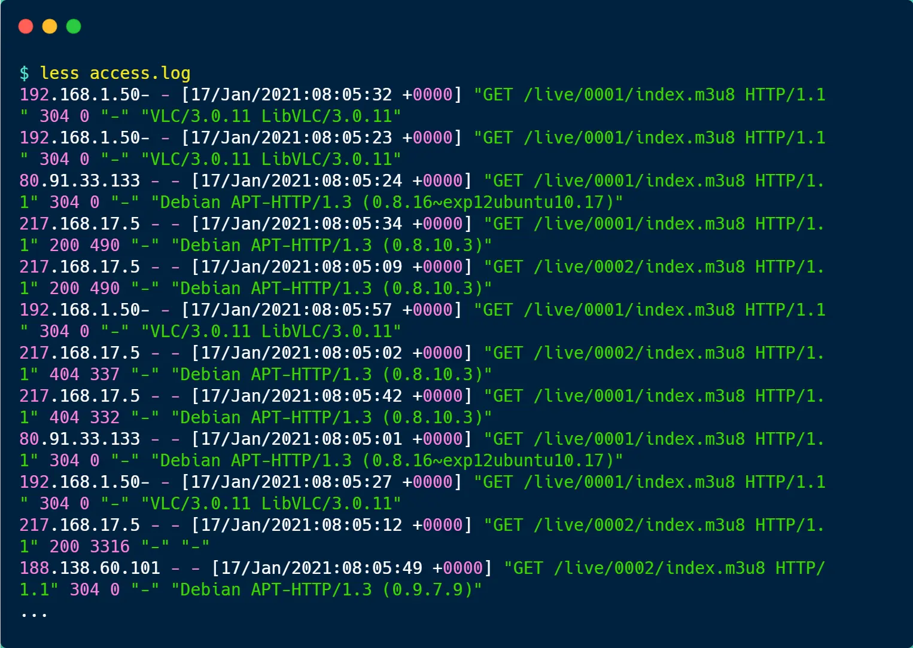

当我们要分析日志的时候，先用`ls -lh`命令查看日志文件的大小，如果日志非常大，最好不要在线上环境做

如果日志文件数据量太大，你直接一个 `cat` 命令一执行，是会影响线上环境，加重服务器的负载，严重的话，可能导致服务器无响应。因为日志文件数据量有多少，它就读多少，所以慎用cat

当发现日志很大的时候，我们可以使用 `scp` 命令将文件传输到闲置的服务器再分析，`scp` 命令使用方式如下：

```shell
scp access.log root@192.168.1.1 /home/log/
```


access.log的格式如下所示：



可以发现，nginx 的 access.log 日志每一行是一次用户访问的记录，从左到右分别包含如下信息：

- 客户端的 IP 地址；
- 访问时间；
- HTTP 请求的方法、路径、协议版本、协议版本、返回的状态码；
- User Agent，一般是客户端使用的操作系统以及版本、浏览器及版本等；

如果想看日志文件的最新部分，可以通过`tail`命令，比如想看倒数5行的数据，可以通过以下命令：

```shell
tail -n 5 access.log
```

如果想要实时看日志打印的内容，可以使用`tail -f`，这样看文件的时候就会是阻塞状态，有新日志输出的时候就会实时显示出来。


### PV分析

PV的全称是Page View，用户访问一个页面就是一次PV，比如大多数博客平台，点击一次页面，阅读量就加 1，所以说 PV 的数量并不代表真实的用户数量，只是个**点击量**。

对于 `Nginx` 的 `acess.log` 日志文件来说，分析 PV 还是比较容易的，既然日志里的内容是访问记录，那有多少条日志记录就有多少 PV。

所以可以通过下面的命令来得到文件有多少行

```shell
wc -l access.log
```


### PV分组

`Nginx`的`access.log`日志文件有访问时间的信息，因此我们可以根据访问时间进行分组，比如按天分组，查看每天的总PV

要按时间分组，首先我们先将访问时间过滤出来，这里可以使用`awk`命令来处理，`awk`是一个文本处理利器

`awk`命令默认是以空格为分隔符的，由于访问时间在日志里的第4列，因此可以使用`awk '{print $4}' access.log`命令把访问时间的信息过滤出来，结果如下：


上面的信息还包含了时分秒，如果只想显示年月日的信息，可以使用`awk`的`substr`函数，从第二个字符串开始，截取11个字符


接着，我们可以使用`sort`对日期进行排序，然后使用`uniq -c`进行统计，于是按天分组的PV就出来了。

```shell
awk '{print substr{$4, 2, 11}}' access.log | sort | uniq -c
```


注意，使用`uniq -c`命令前，先要进行`sort`排序，因为`uniq`去重的原理是比较相邻的行，然后除去第二行和该行的后续副本，因此在使用`uniq`命令之前，先使用`sort`命令让所有重复的行相邻


### UV分析

UV的全称是`Uniq Vistor`，它代表访问人数，比如公众号的阅读量就是以UV统计的，一个用户不管点击多少次，最终只算1次的阅读量

access.log 日志里虽然没有用户的身份信息，但是我们可以用「客户端 IP 地址」来**近似统计** UV。

```shell
awk '{print $1}' access.log | sort | uniq | wc -l 
```

- `awk '{print $1}' access.log`，取日志的第 1 列内容，客户端的 IP 地址正是第 1 列；
- `sort`，对信息排序；
- `uniq`，去除重复的记录；
- `wc -l`，查看记录条数


### UV分组

假设我们按天来分组分析每天的UV数量，这种就比较复杂，我们需要把「日期 + IP地址」过滤出来，并去重

```shell
awk '{print substr($4, 2, 11) " " $1}' access.log | sort | uniq
```

接下来，还需要拼接下面的命令，才能够得到每天的UV数量

```shell
awk '{uv[$1]++; next}' END{for (ip in uv) print ip, uv[ip]}
```


`awk`本身是「逐行」进行处理的，当执行完一行后，我们可以用 `next` 关键字来告诉 `awk` 跳转到下一行，把下一行作为输入。

对每一行输入，`awk` 会根据第 1 列的字符串（也就是日期）进行累加，这样相同日期的` ip` 地址，就会累加起来，作为当天的 `uv `数量。

之后的 `END` 关键字代表一个触发器，就是当前面的输入全部完成后，才会执行 `END {}` 中的语句，`END` 的语句是通过` foreach` 遍历` uv `中所有的 `key`，打印出按天分组的` uv `数量


### 终端分析

`nginx` 的 `access.log` 日志最末尾关于` User Agent` 的信息，主要是客户端访问服务器使用的工具，可能是手机、浏览器等。

因此，我们可以利用这一信息来分析有哪些终端访问了服务器。

`User Agent` 的信息在日志里的第 12 列，因此我们先使用 `awk` 过滤出第 12 列的内容后，进行 `sort` 排序，再用 `uniq -c` 去重并统计，最后再使用 `sort -rn`（*r 表示逆向排序， n 表示按数值排序*） 对统计的结果排序

```shell
awk '{print $12}' access.log | sort | uniq -c | sort -rn
```


### 分析TOP3的请求

`access.log` 日志中，第 7 列是客户端请求的路径，先使用 `awk` 过滤出第 7 列的内容后，进行 `sort` 排序，再用 `uniq -c` 去重并统计，然后再使用 `sort -rn` 对统计的结果排序，最后使用 `head -n 3` 分析 `TOP3` 的请求

```shell
awk '{print $7}' access.log | sort | uniq -c | sort -rn | head -n 3
```


