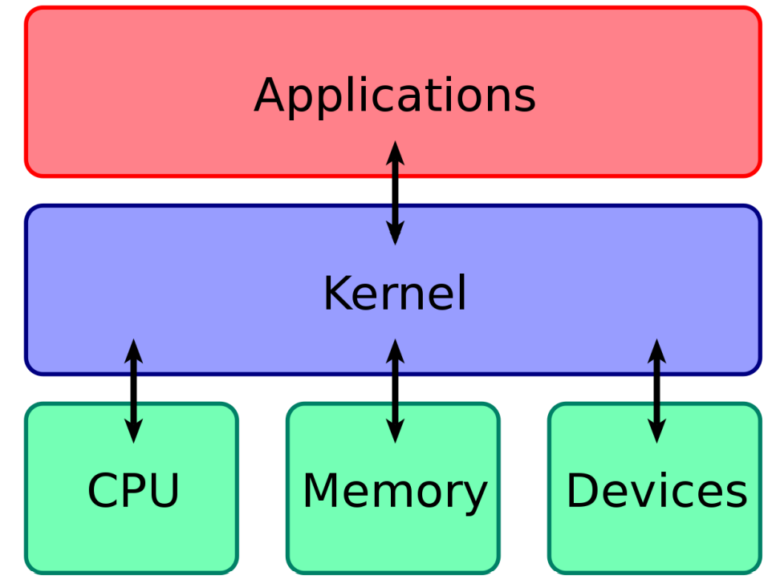
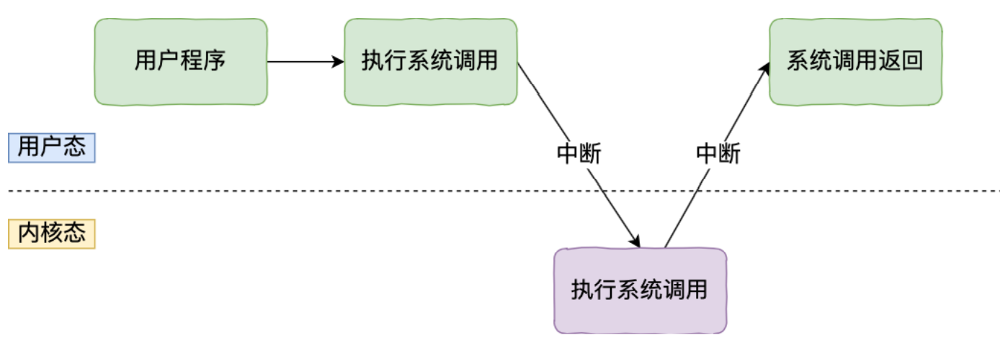
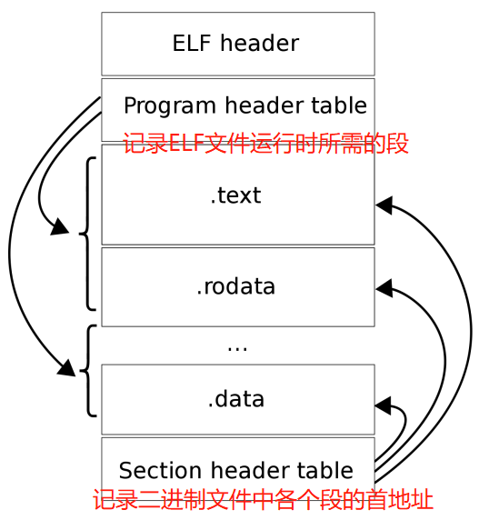
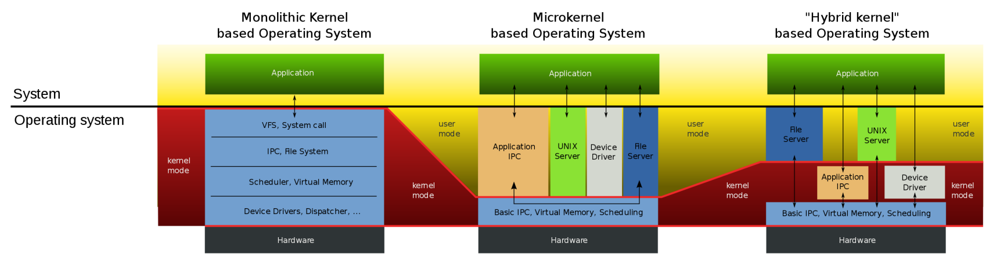
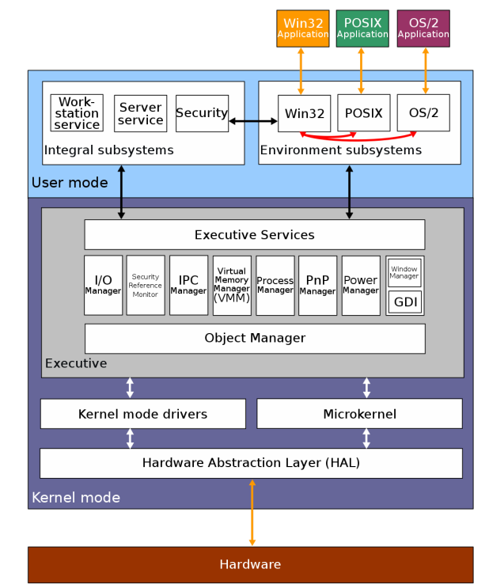
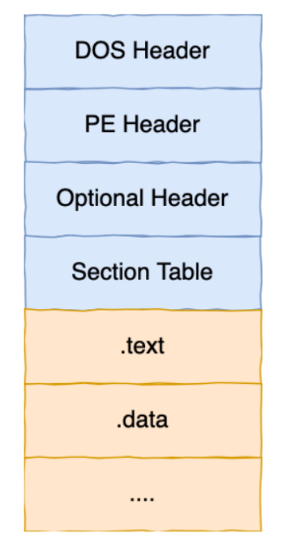

[toc]

## Linux内核 V.S. Windows内核

### 内核的基本概念

我们知道，计算机系统是由很多的硬件设备组成，比如内存、CPU、硬盘、网卡等，如果计算机上的每个应用都要和硬件设备直接打交道的话，由于各个硬件设备的协议不同，所以直接打交道“太累了”，所以这时候就需要（操作系统）内核，**内核作为连接应用程序和硬件设备的桥梁，**可以使应用程序只需要关心和应用程序交互，而不需要关系硬件的细节

> **那么内核作为桥梁，它需要具备哪些功能呢？**

- 首先是**进程调度功能**：决定哪个进程/线程使用CPU
- 第二是**内存管理功能**：决定内存的分配与回收
- 第三是**硬件通信功能**：为进程与硬件设备之间提供通信能力
- 最后是**系统调用功能**：如果应用程序需要使用更高权限的服务，那么就需要系统调用

> **那么内核是怎么样进行工作的呢？**

内核具有很高的权限，它能够操作CPU，内存，硬盘等硬件设备，而应用程序具有的权限很少，所以大多数的操作系统把内存分成了两个区域：

- **内核空间：**这个内存空间只给内核程序使用
- **用户空间：**这个空间专门用来给应用程序使用

用户空间的代码只能够访问一个局部的内存空间，而内核空间的代码可以访问全部的内存空间，因此当程序进入用户空间运行时，我们常说程序是在**用户态**执行的，在内核空间执行的时候，我们说程序是在**内核态**执行的

应用程序如果需要从用户态进入内核态，那么就需要通过系统调用

当用户程序使用系统调用的时候，会产生一个中断，发生中断之后，CPU会中断当前正在执行的用户程序，转而跳转到中断处理程序，也就是开始执行内核程序，当中断处理程序执行完毕之后，会发送一个中断，把CPU执行权限交还给用户程序，回到用户态执行

### Linux内核的设计

Linux内核的设计理念主要有以下四点

- **`MultiTask`多任务，**多个任务可以同时执行，单核CPU上叫做并发，多核CPU上叫做并行

- **`SMP`对称多处理，**每个CPU的地位是相同的，对资源的使用权限是相同的，共享同一块内存空间，也就是说每个程序都会被随机分配到任意一个CPU上执行，UMA，一致性内存访问

- **`ELF`可执行文件链接格式，**ELF是Linux中可执行文件的存储格式。ELF文件的形成过程：我们知道我们编写的代码首先会经过编译器生成汇编代码，接着通过汇编器变成目标代码（前面说的是机器码），也就是目标文件，最后通过链接器把多个目标文件以及调用的各种库函数连接起来，形成一个可执行文件，也就是ELF文件。ELF文件的执行过程：执行ELF文件时首先会使用装载器把ELF文件装载到内存中，然后CPU读取内存中的数据和指令，这样ELF文件就被执行起来了

  

- **`Monolithic Kernel`宏内核，**Linux的内核架构就是宏内核，这意味着**Linux的内核是一个完整的可执行程序，具有最高的权限**

  - **宏内核**的特征是系统内核的所有模块（比如进程调度、内存管理、文件系统、设备驱动等）都运行在内核态

  - **微内核**与宏内核相反，他只保留了最基本的功能，比如进程调度，而把一些应用放到了用户空间，比如文件系统和设备驱动等，这样做的好处是单个应用损坏之后不会导致整个的系统崩溃，不好的地方在于需要频繁地切换到内核态，比如驱动程序一般需要频繁地触发中断，调用系统中断函数，比如华为的鸿蒙OS

  - **混合内核**的架构像微内核，内核里面有一个最小版本的内核，其后其他模块都在这个的基础上进行搭建，实现的时候和宏内核有点像，也就是把内核做成一个完整的程序，大部分服务都在内核中，这就像是一个宏内核包着一个微内核

    

**Linux也实现了动态加载内核模块的功能**，例如大部分的设备驱动是以可加载模块的形式存在的， 与内核其他模块解耦，让驱动开发和驱动加载更为方便、灵活

### Windows内核

**当今Windows 7，Windows10使用的内核叫做`Windows NT`，NT的全称是`New Technology`**

Windows和Linux一样，都支持`MultiTask`和`SMP`，但是不同的是**Windows的内核设计是混合内核**，如下图：

从图中可以看到，Windows内核中有一个`Microkernel`微内核，这个是最小版本的内核，而整个内核的实现又是一个完整的程序，包含了很多模块，都在内核态

此外，Windows中的可执行文件和Linux中也不一样，Windows中的可执行文件格式是`PE`，即可移植执行文件，拓展名通常是`.exe   .dd   .sys`等，结构如下

## Linux计算机从按下电源键到出现桌面的过程是什么样的

- 第一步，加载BIOS

  当打开计算机电源后，计算机会首先加载BIOS信息，这是因为BIOS中包含了CPU的相关信息、设备启动顺序信息、硬盘信息、内存信息、时钟信息等，加载完BIOS之后，计算机就知道应该去读取哪个硬件设备了，在BIOS将系统的控制权交给硬盘第一个扇区后，就开始由Linux来控制系统了。

  > BIOS，全称是Basic Input/Output System，是位于计算机主板上的一个特殊存储芯片中的一个固化软件，提供了计算机启动和硬件初始化的基本功能

- 第二步，读取MBR

  硬盘上的第0磁道第一个扇区被称作MBR，也就是Master Boot Record，即主引导记录，它的大小是512字节，可里面却存放了预启动信息、分区表信息。MBR可分为两部分，第一部分为引导区（PRE-BOOT），占了446个字节，第二部分为分区表（PARTITION PABLE），共有66个字节，记录硬盘的分区信息，预引导区的作用之一是找到标记为活动（ACTIVE）的分区，并将活动分区的引导区读入内存

  系统找到BIOS所指定的硬盘的MBR后，就会将其复制到0x7c00地址所在的物理内存中，其实被复制到物理内存的内存就是Boot Loader，具体到机器上就是LILO或者GRUB

  > LILO（Linux Loader）和GRUB（GRand Unified Bootloader）都是引导加载程序（bootloader），用于加载Linux操作系统。
  >
  > LILO是一种旧的引导加载程序，它提供了从计算机硬盘引导操作系统的功能。它位于硬盘的主引导记录（MBR）中，负责读取内核镜像并将控制权交给内核。LILO的配置文件是`/etc/lilo.conf`，其中定义了启动选项和内核位置等信息。
  >
  > GRUB是一种更为先进和功能强大的引导加载程序，广泛用于现代Linux系统。与LILO不同，GRUB具有模块化的设计和更灵活的配置选项。它支持多种文件系统、多重操作系统的引导和多种引导选项。GRUB的配置文件是`/boot/grub/grub.cfg`，用户可以编辑该文件以自定义引导菜单。
  >
  > GRUB还提供了一个命令行界面，允许用户在启动时进行交互。从GRUB命令行界面，用户可以直接加载内核、设置引导选项、修复引导问题等。
  >
  > 总的来说，LILO和GRUB都是用于加载Linux操作系统的引导加载程序，但GRUB更为常见和强大，被广泛使用。

- 第三步，读取Boot Loader

  Boot Loader就是在操作系统内核运行之前运行的一段小程序，通过这段小程序，我们可以初始化硬件设备、建立内存空间的映射图，从而将系统的软硬件环境带到一个合适的状态，以便为最终调用操作系统内核做好一切准备，通常，Boot Loader是严重地依赖于硬件实现的，不同体系结构的系统存在着不同的Boot Loader，Boot Loader有若干种，其中Grub、Lilo和spfdisk是常见的Loader，以Grub为例，系统读取内存中的Grub配置信息（一般为menu.lst或grub.lst），并依照此配置信息来启动不同的操作系统

- 第四步，加载内核

  根据grub设定的内核映像所在路径，系统读取内存映像，并进行解压缩操作，此时，屏幕一般会输出“Uncompressing Linux”的提示，当解压缩内核完成后，屏幕输出“Ok，booting the kernel”，系统将解压后的内核放置在内存之中，并调用`start_kernel()`函数来启动一系列的初始化函数并初始化各种设备，完成Linux核心环境的建立。至此，Linux内核已经建立起来了，基于Linux的程序应该可以正常运行了

  > `start_kernel()`中执行的操作包括：在屏幕上打印出当前的内核版本信息，对每个可用CPU上的`runqueue`进行初始化，然后初始化0号进程为系统idle进程，即系统空闲时占据CPU的进程，还有创建一号进程、初始系统的定时器机制等

- 第五步，用户层`init`依据`inittab`文件来设定运行等级

  内核被加载后，第一个运行的程序便是`/sbin/init`，该文件会读取`/etc/inittab`文件，并依据此文件来进行初始化工作

- 第六步，`init`进程执行`rc.sysint`

  在设置了运行等级后，Linux系统执行的第一个用户层文件就是`/etc/rc.d/rc.sysinit`脚本程序，这个脚本程序做的工作非常多，包括设定PATH、设定网络配置、启动swap分区等，`init`进程的最终完成状态是能够使得一般的用户程序可以正常地被执行，从而真正完成可供应用程序运行的系统环境

- 第七步，启动内核模块

  具体是依据`/etc/modules.conf`文件或`/etc/modules.d`目录下的文件来装载内核模块。

- 第八步，执行不同运行级别的脚本程序

  根据运行级别的不同，系统会运行`rc0.d`到`rc6.d`中的相应的脚本程序，来完成相应的初始化工作和启动相应的服务

- 第九步，执行`/etc/rc.d/rc.local`

  `rc.local`就是在一切初始化工作后，Linux留给用户进行个性化的地方。你可以把你想设置和启动的东西放到这里。

- 第十步，执行`/bin/login`程序，进入登陆状态

