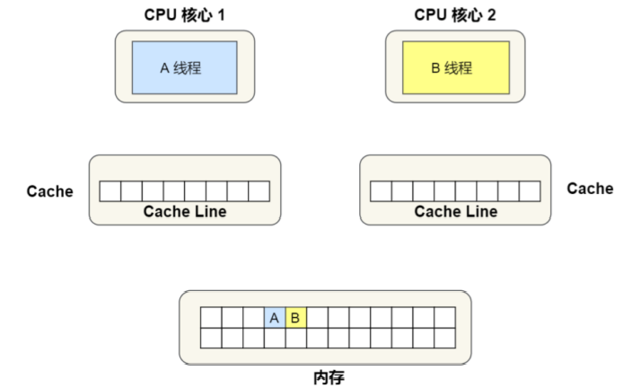

[toc]


## CPU是如何执行程序的

### 图灵机

图灵机的基本思想是用机器来模拟人们用纸笔进行数学运算的过程，而且还定义了计算机有哪些部分组成，程序又是如何执行的

图灵机的基本组成如下：

- 有一条「纸带」，纸带由一个个连续的格子组成，每个格子可以写入字符，纸带就好比内存，而纸带上的格子的字符就好比内存中的数据或程序；
- 有一个「读写头」，读写头可以读取纸带上任意格子的字符，也可以把字符写入到纸带的格子；
- 读写头上有一些部件，比如存储单元、控制单元以及运算单元： 1、存储单元用于存放数据； 2、控制单元用于识别字符是数据还是指令，以及控制程序的流程等； 3、运算单元用于执行运算指令；

### 冯诺依曼模型

1945年冯诺依曼和其他计算机科学家提出了计算机具体实现的报告，其遵循了图灵机的设计，而且还提出了用电子元件构造计算机，并约定了用二进制进行计算和存储

冯诺依曼结构将计算机分成了五个部分，分别是中央处理器（CPU），内存，总线，输入输出设备


- **内存：**程序和数据都存储在内存中，而且存储的区域是线性的，在计算机数据存储中，存储数据的基本单位是字节（byte），1字节等于8位（bit），内存的地址从0开始，然后自增排序，最后一个地址是`总字节数-1`，这种结构类似于程序中的数据，所以内存中读取任何一个数据的速度都是相同的

- **中央处理器：**也就是常说的CPU，目前常见的有32位和64位的CPU，**这里的32位和64位指的是CPU的位宽，代表的是CPU一次可以计算的数据量**

  - 32位表示一次能够计算一个32位的数据，处理4个字节
  - 64位表示一次能够计算一个64位的数据，处理8个字节

  假设有一个8位CPU，那么他能够计算的范围就是`0~255`，他就不能计算出`100*100`，所以CPU的位宽越大，能够计算的数值也就越大，比如说32位计算机上能够计算出的最大整数是`2^32 - 1`

  CPU内部还有一些组件，主要包括寄存器、控制单元和逻辑运算单元，控制单元的作用是控制CPU工作，逻辑运算单元的作用是负责计算，而寄存器可以分为多种类，每种寄存器的作用也是不相同的，但是概括地说寄存器的作用就是存储计算时的数据（包括指令），寄存器分为以下几种：

  - **通用寄存器：**用来存放需要进行计算的数据，比如加和操作中的两个操作数
  - **程序计数器：**用来存储下一条指令的内存地址，也就是指令的内存地址
  - **指令寄存器：**用来存储程序计数器中地址指向的指令，也就是指令本身，指令执行完之前都会被存放在这里

  > 寄存器是用来存储程序运行时的数据的，内存也是，为什么有了内存还要有寄存器呢？因为内存距离CPU的距离较远，而寄存器就在CPU里面，挨着控制单元和逻辑运算单元，所以寄存器的效率会更高

- **总线，**总线用于CPU和内存以及其他设备之间的通信，主要包括三类：

  - 地址总线：用于指定CPU将要操作的内存地址
  - 数据总线：用于读写内存的数据
  - 控制总线：用于发送和接收数据，比如中断、设备复位等信号，CPU收到中断信号之后肯定要去处理，这时也用到了控制总线

  CPU读写内存数据的时候用到了上述三种总线：使用地址总线找到数据在内存中的位置，然后通过控制总线控制是读或写命令，最后使用数据总线将数据从内存读写进CPU寄存器中

- **输入输出设备：**输入设备向计算机输入数据，计算机经过计算之后，把数据输出给输出设备，期间，如果输入设备是键盘，那么按下键时要通过控制总线和CPU进行交互


### 线路位宽和CPU位宽

上面介绍了冯诺依曼结构中的五种组成设备的作用以及大致组成，那么数据到底是怎样在线路中传输的呢？答案是用过高低电压，高电压表示1，低电压表示0，所以`高低高`这样的信号可以使用`101`来表示，那么这个信号就可以表示十进制的5，如果只有一条线路，那么在同一时刻只能发送一个bit的数据，也就是只能发送一个0或者一个1，很显然，如果想要发送一个`101`，那么就需要经过三次传输，这样的操作效率很低，上面这种方式叫做**串行**，也就是说只能一个比特一个比特的顺序发送，当然如果想要一次性发送多个bite，可以通过增加线路的方式来实现**并行传输**

**为了避免低效的串行方式，线路位宽最好是能够一次性访问全部的内存地址，**CPU想要操作内存地址的话就需要地址总线，对于4G的内存空间，就需要32根地址总线和32根数据总线，因为`2^32=4G`，通过32根地址总线能够一次性访问到全部的内存地址，而且32根数据总线能够一次传输32bit的数据，所以**线路位宽指的是地址总线&数据总线的条数，线路位宽表示了一次性能够传输多少的数据**

**对于CPU位宽，其大小最好是大于等于线路位宽，**比如用32位的CPU去控制40位宽的地址总线和数据总线的话，32位的CPU一次性处理不了40bit的数据，而且也访问不到`2^32`之外的内存地址，所以需要进行一些特殊操作，总之，如果CPU位宽小于线路位宽，工作起来就会非常复杂而且麻烦

```
如果使用32位的CPU来计算两个64位数字的加和，CPU是一次性解决不了的，具体的操作过程是：这两个64位的数字会首先被分成2个低位的32位数据和两个高位的32位数字，先算两个低位数字的加和和进位，再算两个高位数字并加上进位
而如果是一个64位的CPU的话，可以一次性计算出两个64位数字的加和
```

但是上面并不能够说明64位的系统比32位的系统好，因为只有当计算超过了32位的数字的时候64位系统才能够体现出优势，而目前应用中的数据能够超过32位的也不多

**另外，32位CPU能够控制的内存是4G($2^{32}$)，所以即使给32位的系统装上8G的内存条也不管用，而64位CPU能够管理$2的64次方$的内存空间    **


### 指令执行的基本过程

程序实际上是由一条条的指令组成的，所以程序运行的过程就是把每一条命令一步步的执行起来，负责执行指令的就是CPU了


- 第一步，CPU需要读取**程序计数器**中的数据，因为*程序计数器中存储的是指令在内存中的地址*，所以当CPU读取到这个地址之后，会**调用控制单元操作地址总线**指定需要访问的内存空间，接着通知内存设备准备数据，数据准备好了之后通过**数据总线**将数据加载到指令寄存器中
- 第二步，CPU解析**指令寄存器**中的指令类型，确定指令的类型和参数，如果是计算类型，那么就将这条指令交给**逻辑运算单元**来进行处理，如果是存储指令，那么就将指令交给**控制单元**来进行处理
- 第三步，当指令执行完成之后，**程序计数器**进行自增操作，因为要去执行下一条指令了，这个自增的大小是要根据CPU的位宽来决定的，比如32位的CPU，自增的大小就是4字节，因为32位CPU的指令就是4字节，需要4字节的内存地址存放

**综上，一个程序执行的时候CPU会根据程序计数器里的内存地址，从内存里面把需要执行的指令读取到指令寄存器里面执行，然后根据指令长度自增，开始顺序读取下一条指令**

~~CPU从程序计数器中读取指令内存地址，到指令执行 结束，再到下一条指令执行，这个程序会不断循环，直到所有的指令执行完毕，程序执行结束，这个不断循环的过程称为**CPU周期**~~

> CPU周期是CPU执行指令的基本单位，一个指令的执行需要一个或多个CPU周期，CPU周期应该指的是指令的某一部分执行的事件，比如Fetch过程的时间需要一个CPU周期


### a=1+2的执行过程

首先需要明确的是CPU是不认识`a=1+2`这个字符串的，这个字符串只是为了方便程序员的理解，所以为了让这个字符串跑起来，我们需要对整个程序进行**编译**，经过编译之后的代码叫做汇编代码，机器仍然是不认识汇编代码的，所以还需要对汇编代码进行翻译，翻译成**机器码，**机器码是由0和1组成的机器语言，这一条条的机器码实际上就是一条条的指令，这才是CPU真正认识的东西

下面我们来看一下`a=1+2`的执行过程，首先CPU在进行编译的过程中，发现1和2是数据，所以就会把它们放到一个特定的区域叫做**数据段（内存专门用来存储数据的一段区域），数据的大小是根据程序中指定的类型决定的，int是4个字节，char是1个字节**如下图


从图中也可以看到，指令和数据是分开存放的，存放指令的区域叫做**正文段**

编译器会把`a=1+2`翻译成4条指令（**<font color=red>为了好理解，图中把本来应该是二进制串的指令换成了汇编代码</font>**），分别放入到正文段中，因为是32位的系统，所以每个指令有4个字节，分别是

- 将数据2装入寄存器R0中（这个R0,R1,R2寄存器应该是通用寄存器）
- 将数据1装入寄存器R1中
- 将R0寄存器中的内存和R1寄存器中的内容相加，结果放入寄存器R2中
- 将R2寄存器中的内容放入到数据段中，位置是`0X108`，这个地址也就是变量a的地址

编译完成之后，程序计数器中的值会被设置为`0x200`，然后依次执行这四条指令


### 指令

上面我们说到了，一段程序首先经过编译，成为汇编代码，然后在经过翻译，编程机器码，而这个机器码是CPU能够认识的指令，也就是他是一串的二进制数字，每条指令都有对应的机器码，CPU通过机器码来知道指令的内容

**不同的CPU对应着不同的指令集，也就是对应着不同的汇编代码和机器码**，下面选用的是最简单的MIPS指令集，其中的每个指令都是32位，高6位代表操作码，表示这这是一个什么样的指令，剩下的26位不同指令类型所表示的内容也不相同，主要有R,I,J三种类型


- R指令：用在计算和逻辑操作，里面包含了读取和写入数据的三个寄存器地址（`rs,rt,rd`），如果表示的是逻辑唯一操作，后面还有位移量，最后的功能码则是前面操作码不够时，用来拓展对应的操作码表示响应的指令的
- I指令：用在数据传输、条件分支等，这个类型的指令，就没有了位移量和功能码，也没有了第三个寄存器，而是把这三个部分合并成了一个地址或者一个常数
- J指令：用在跳转，除了操作码，后26位都表示的是一个跳转后的地址

我们看一下`add R0 R1 R2`这条指令的机器码，如下图


- MIPS中制定了add的操作码和功能码，因此这两个都是固定的
- `rs,rt,rd`分别表示三个寄存器的位置
- 因为这是一个计算操作，没有发生位移，所以位移量都是00000

把上面的这些数据组合起来就是这条汇编语言的机器码，用16进制表示就是`0x00011020`

编译器在编译程序的时候会构造指令，这个过程叫做程序的编码，CPU执行程序的时候会解析指令，这个过程叫做指令的解码


现代大多数的操作系统会通过上面这种流水线的方式进行工作，即把一个大任务拆分成多个小任务，于是一条指令就分成了4个阶段，称为4级流水线，具体每个阶段所做的过程如下：

- CPU通过程序计数器、控制总线、数据总线等将指令加载到指令寄存器中，这个过程叫做`Fetch`
- CPU对指令进行解析，看看它有哪些参数、是什么类型的，这个过程叫做`Decode`
- CPU执行这个指令，这个过程叫做`Execute`
- CPU将执行后的结果存回寄存器或者将其存入内存中，这个过程叫做`Store`

上面的四个阶段我们叫做一个**指令周期（`Instrution Cycle`）**，CPU的工作就是一个周期接着一个周期，周而复始！

上面的不同节点，也是由计算机中不同的组件来完成的，如下图


- 取指令阶段：我们将指令存放在存储器中，实际上我们通过程序计数器和指令寄存器取出指令的过程是由**控制单元（控制器）**来完成的
- 指令译码阶段：这个阶段也是通过**控制器**来完成的，控制器将指令解析成不同的操作信号以及地址和操作数
- 指令执行的过程中无论是算术运算还是逻辑运算，包括条件分析判断、跳转等都是由算术逻辑单元也就是**运算器**来完成的，但是如果是一个无条件地址跳转，则是直接在控制器里面完成的，不需要使用运算器


### 指令的类型

指令分成了5个类型

- **数据传输类型的指令，**比如`store/load`是寄存器和内存之间数据传输的指令，`mov`是将一个内存地址的数据移动到另一个内存地址中
- **运算类型的指令，**比如加减乘除，位运算，比较大小等，但是他们最多只能处理两个寄存器中的数据
- **跳转类型的指令，**通过修改程序计数器中的值来达到跳转的目的，比如`if-else,switch-case`等
- **信号类型的指令，**比如中断的指令`trap`
- **闲置类型的指令，**比如`nop`指令，可以让CPU空转一个周期


### 指令的执行速度

CPU硬件中都有`GHZ`这个参数，`1GHZ`就表示**时钟频率**是`1GHZ`，即1s会产生1G的脉冲信号，每发生一次脉冲信号，就会产生一次高低电平的转化，**每一次脉冲信号高低电平的转换就是一个时钟周期，时钟周期=1/时钟频率**，对于CPU来说，在一个时钟周期内，仅能够完成一个最基本的操作，也就是说一个指令并不一定会在一个时钟周期内完成，所以<font color=red>时钟周期是计算机中最基本、最小的时间单位</font>

**对于CPU来说，时钟频率越大，时钟周期越短，工作速度就越快**


> **那么如何让程序执行的更快的**

程序执行过程中，如果CPU执行的时间越短，我们就说程序执行的时间越快，对于CPU的执行时间，可以拆解成

$CPU的执行时间=CPU时钟周期数 × 时钟周期时间$

对于时钟周期的时间，我们可以通过升级硬件，从而提高时钟频率来达到降低时钟周期时间的目的，但是这并不是软件工程师应该考虑的问题，我们应该考虑怎么把已有硬件的性能应用到极致，而且提高CPU的时钟频率（主频）目前也很难做到了，我电脑是2.5GHZ

而对于CPU时钟周期数我们又可以拆解成

$CPU时钟周期数=每条指令的平均时钟周期数×指令的条数$

所以说CPU的执行时间又可以被表示成以下三个的结合

$CPU的执行时间=每条指令的平均时钟周期数×指令的条数 × 时钟周期时间$

想要程序跑得快，优化这三者即可

- 指令数，这个主要是由编译器决定的，因为不同的编译器对同一段代码的编译结果，翻译出来的机器码都是不一样的，所以这个层面基本都是靠优化编译器

- 每条指令的平均时钟周期数（Cycles Per Instrction,CPI），现代大多数CPU都是通过流水线技术，这一技术也让CPI有所下降

- 时钟周期时间，降低他就意味着要调高CPU主频（时钟频率），但是调高主频会增加CPU的散热负担（比如超频技术），容易导致CPU过热而奔溃

  > 时钟频率指的是CPU时钟振荡的速度，通常以赫兹（Hz）为单位，表示每秒钟的振荡次数。例如，如果CPU的时钟频率为1 GHz（1,000,000,000 Hz），则每个CPU周期的持续时间为1纳秒（1/1,000,000,000 秒）
  >
  > window电脑任务管理器---> 性能 2.50GHZ


### 今天学习的上述知识中，有两个常见问题

#### 64位的CPU计算性能一定比32位的CPU好吗，64位的优势在什么地方

- 首先64位CPU的计算性能并不一定比32位的好，当数据没有超过`2^32`次方的时候，64位CPU和32位CPU的计算性能相差不大，但是当数据超过了`2^32`次方，64位的计算性能就要优于32位CPU了，因为32位CPU不能一次性计算出这个数了，需要分步计算，但是实际上，应用程序中的数据一般来说不会那么大
- 除了上面的这个优势，64位CPU的优势还在于它有更大的寻址空间，32位CPU的寻址空间只有`2^32=4G`，因此即使给32位的计算机加上一个8G的内存条也是没有作用的，而64位CPU的寻址空间能够到达`2^64`次方，远超过32位的寻址空间（寻址空间大就意味着能够使用更多的内存）


#### 32位软件和64位软件的区别是什么？32位的操作系统能不能在64位的电脑上运行，相反，64位的操作系统你能不能在32位上运行

<font color=red>首先32位和64位软件的区别就在于他们的指令一个是32位，一个是64位</font>

我们知道**操作系统也是一个软件**，所以只要提供一套兼容机制，32位的操作系统想要在64位操作系统上运行是可行的，但是64位的OS不能够在32位OS上运行，因为32位的操作系统没有办法存储64位操作系统的指令（操作系统其实也是一种程序，我们可以看到操作系统也分成了64位，32位，其代表的意义就是操作系统中的指令是多少位，比如64位的操作系统，指令也是64位，因此不能够装在32位的机器上）

**硬件的32位和64位表示的是CPU的位宽，软件的32位和64位表示的是指令的长度**


#### 指令周期、时钟周期、CPU周期、

- 指令周期：一条指令从取出到执行完毕的时间，具体地，包含了四个阶段：`Fetch, decode, execute, store`

- CPU周期：在计算机中，为了便于管理，常把一条指令的执行过程划分为若干个阶段，`Fetch, decode, execute, store`，每一个阶段完成一项工作，完成每一项工作叫做一个基本操作，每一个基本操作又是由若干个CPU最基本的动作组成，完成一个基本动作所需要的时间叫做一个机器周期，又叫做CPU周期

  > 通常用内存中读取一个指令的最短时间来规定CPU周期

- 时钟周期：定义为时钟频率的倒数，是计算机中最基本的、最小的时间单位，在一个时钟周期内，CPU仅完成一个最基本的动作。

所以，一个指令周期，包含多个 CPU 周期，而一个 CPU 周期包含多个时钟周期。


## 存储器

对于存储器而言，速度越快，能耗为高，价格越贵，所以容量越小

### 存储器介绍

存储器通常分为下图中的几个级别：寄存器，CPU Cache（L1,L2L,L3），内存，SSD/HDD硬盘


- **寄存器**是最靠近CPU控制单元和逻辑运算单元的存储器，因此他的速度是最快的，材料是最贵的，所以一个CPU中不能够有太多的寄存器，通常一个CPU中会有几十到几百个寄存器，每个寄存器能够存储一定字节（byte）的数据

  - 比如32位CPU中大多数的寄存器通常能够存储4个字节的数据
  - 64位CPU中大多数的寄存器通常能够存储8个字节的数据

  寄存器的速度非常快，一般要求在半个CPU时钟周期内完成，比如2GHz的主频的CPU它的时钟周期是1/2GHz，也就是0.5ns

  CPU在处理一条指令时，除了要读写寄存器，还要对指令进行解码，运行等，所以如果寄存器的读写速度太慢的话，就会给用户一种电脑很卡的感觉

- **CPU Cache**用的是一种叫做SRAM的芯片（Static Random-Access Memory，静态随机存储器）

  之所以叫做静态存储器，是因为只要有电，数据就可以保持存在，而一旦断电，数据就会丢失

  在SRAM中，一个bit的数据通常需要6个晶体管，所以SRAM的存储密度不大，同样的物理空间下，SRAM能够存储的数据很有限，不过因为SRAM的电路比较简单，所以访问起来很快

  CPU Cache分为三级缓存，分别是L1 Cache，L2 Cache，L3 Cache，速度依次降低，容量依次增大

  

  - L1 Cache的速度也很快，和寄存器差不多，大约2-4个时钟周期，所以L1 Cache分为两个部分，数据缓存和指令缓存，即数据和指令在L1 Cache中是分开存储的，从上图中也可以看到L1 Cache和L2 Cache是每个CPU独有的

    ```shell
    # 在Linux系统中查看L1 Cache的数据缓存大小
    cat /sys/devices/system/cpu/cpu0/cache/index0/size
    # 查看L1 Cache的指令缓存的大小
    cat /sys/devices/system/cpu/cpu0/cache/index1/size
    ```

  - L2 Cache同样是每个CPU核心独有的，L2 Cache距离CPU更远了，因此访问时间就更长了，大约10-20个时钟周期，但是他的容量也更大了，通常是几百k到几兆不等

    ```shell
    # 在Linux系统中查看L2 Cache的缓存大小
    cat /sys/devices/system/cpu/cpu0/cache/index2/size
    ```

  - L3 Cache是多个CPU核心共用的，位置比L2 Cache距离CPU要远，因此访问速度慢，大约在20-60个时钟周期，容量变大了，在几兆到几十兆之间不等，具体需要根据CPU的型号来判断

    ```shell
    # 在Linux系统中查看L3 Cache的缓存大小
    cat /sys/devices/system/cpu/cpu0/cache/index3/size
    ```

  


- 内存，内存使用的DRAM（Dynamic Random Access Memory，动态随机存储器）芯片，相比于SRAM，DRAM的存储密度更高，他有更大的容量和更低的造价，之所以称为动态存储器，是因为只有不断刷新，数据才能被储存起来

  存储1bit的数据只需要一个晶体管和一个电容，但是因为数据会被存储到电容里面，电容会不断漏电，所以需要定时刷新电容，才能保证数据不会被丢失，这就是DRAM之所以被称为动态存储器的原因，只有不断刷新，数据才能够被存储起来 DRAM的数据访问电路和刷新电路都比SRAM复杂，所以访问的速度会更慢，内存速度大概在200~300个时钟周期之间

  > 内存之所以快体现在制作材料、内部电路结构上，同样也体现在其结构中，内存是线性结构

- SSD/HDD硬盘，SSD(Solid-state Disk，固态硬盘)结构和内存类似，但是断电之后，硬盘中的数据不会消失，而寄存器、高速缓存、内存中的数据都会消失，内存的读写速度大概要比SSD快10-1000倍

  当然还有一款传统的硬盘，也就是HDD(Hard Disk Driver)，它是通过物理读写的方式来访问数据的，因 此他的访问速度是非常慢的，他的速度比内存慢了10w倍左右 由于SSD的价格与HDD的价格慢慢接近了，因此SSD正在逐步的取代HDD


### 存储器的层次关系

**CPU并不会直接和每一种存储器打交道，而是每一种存储器设备都只会和他相邻的存储器打交道**，比如CPU Cache中的数据都是从内存中加载过来的，写回数据的时候也只会写回到内存，而不会写回到硬盘，CPU Cache读取数据的时候也不会直接从硬盘中读取，而是先从硬盘中读取出数据到内存，然后再在内存中将数据读取到CPU Cache中


实际上，CPU想要获取数据的时候，会先从寄存器中查找，如果寄存器中没有，那么回向L1缓存中查询，之后是L2 Cache，L3 Cache，如果都没有的话，才会向内存中查找，如果内存中还是没有，就只能去硬盘中查找，所以**存储层次也形成了缓存体系**


### CPU Cache的数据结构和读取过程

首先，由于CPU和内存之间的速率相差很多，所以为了弥补两者之间的差距，在两者之间就放上了一层缓存，叫做CPU Cache

我们知道，程序的执行都是在CPU中进行的，那么如果CPU进行运算时，直接从高速缓存中读写数据，而不是从内存中读取数据，那么运算速度自然就会很快

从前面我们也说到了，存储器中的某一层只会和他相邻的层进行数据交换，所以CPU Cache中的数据是从内存中读取来的，那么这个读取过程是怎样的呢？**事实上，CPU Cache从内存中读取数据是一块一块的读的，而不是一个字节一个字节的读，在CPU Cache中，这样一块一块的数据被称作Cache Line，而这一块块的数据在内存中叫做内存块**

```shell
# 在Linux中查看cache line的大小
cat /sys/devices/system/cpu/cpu0/cache/index0/coherency_line_size
64
# 一般情况下，cpu L1 Cache的cache line的大小位64个字节
```

比如有一个`arr[100]`长度为100的`int`类型数组，当载入`arr[0]`的时候，会同时把后面的数据也加载进去，从`arr[0]`到`arr[15]`，这16个数据，一共64个字节，所以说，当CPU再次访问`arr[1]...arr[15]`的时候，会直接从CPU Cache中找到，这也就会加速CPU的运算过程

前面我们也提到过，CPU读取数据的时候，会先从CPU Cache中查找，没有找到再去内存中找，如果内存中还没有就在去硬盘中找

 

综上，其实可以看出，CPU Cache是内存的一个缓存，就像内存是硬盘的一个缓存道理是一样的，如果缓存中有数据，我们就不需要再去更慢的下层查找了


> **<font color=red>那么问题来了，CPU是怎么知道数据是否在CPU Cache中的呢，如果在的话，又如何在Cache中取出数据呢</font>**

以最简单、基础的**直接映射Cache（Direct Mapped Cache）**方法开始说起，

前面说到了，CPU读取内存数据是一块块的读取的，在一块的数据在CPU Cache中叫做Cache Line，在内存中叫做内存块（block），**读取的时候我们要拿到内存块的物理地址**

对于直接映射Cache这种方法，**策略就是使用取模运算把内存块始终映射在一个Cache Line上**，如下

```shell
# 比如目前内存被划分成了32个内存块，CPU Cache中共有8个Cache Line，假设CPU想要访问15号内存块，如果这个15号内存块已经被缓存在CPU Cache中的话， CPU应该去第7个Cache Line上找，因为15 % 8 = 7
```

但是，我们很容易就能够发现，这种方式其实会把多个内存块映射到一个Cache Line上，比如7，15，23，31号内存块都会被映射到7号Cache Line上，如下图


**那么我们是如何区分同一个Cache Line中不同的block呢，答案是使用<font color=red>组标记（tag）</font>，这个组标记会记录当前Cache Line中对应的是那一个内存块，**除此之外，Cache Line中还有两个信息，分别是

- 一个是 从内存中加载进来的**实际存放的数据**data
- 另一个是 **有效位**，如果Cache Line中的有效位是0的话，那么CPU会直接去内存中获取数据，而如果有效位是1的话，CPU就会直接获取Cache Line中的数据

我们知道，CPU在Cache Line中读取数据的时候不是读取整个的Cache Line，比方说前面的例子，一个Cache Line中存放的是`arr[0]到arr[15]`，CPU不可能一口气把这16个数据都读进去，而是一个个的读，所以我们把CPU所需要的一个数据片段叫做一个**字（word）**，那么怎么在**对应的**Cache Line找到对应的字呢？答案是需要一个**偏移量**

**综上，我们就能够发现，**

- **一个内存的访问地址包含了三个信息，分别是：索引，组标记，偏移量，通过这三个信息能够找到Cache Line中缓存的数据**
- **一个Cache Line的数据结构包含了四个信息，分别是：索引，组标记，有效位，真实数据**


如果Cache Line中包含了内存中的数据，那么过程如上图所示，功能分成四步：

- 根据内存地址中的索引信息，找到对应的Cache Line的地址
- 找到对应的Cache Line之后，再去判断一下有效位，如果是0的话，CPU直接去内存中读数据，如果是1的话，在进行下面的操作
- 对比内存地址中的组标记和Cache Line中的组标记，确认Cache Line中的数据是不是我们要找的，如果不一样的话，CPU直接去内存中找，并重新加载数据，如果是的话，继续往下执行
- 根据内存地址中的偏移量，从Cache Line中的数据块中找到对应的字


> PS:除了直接映射cache之外，还有其他的映射方法，比如全相连Cache，组相连Cache等，这几种策略的数据结构都比较相似


### 如何写出让CPU跑的更快的代码

前面我们提到过，如果CPU访问数据的时候，是在CPU Cache中直接获取，而不是去内存中获取的话，CPU的运算效率会得到很大的提高，**因此如何写出让CPU跑的更快的代码可以转换成另一个问题：如果提高CPU Cache的缓存命中率**

*我们知道CPU的L1 Cache分成了两个部分，数据缓存和指令缓存，因此我们也要从这两个角度分别来看*

#### 如何提高数据缓存的命中率


首先，看一下上图中，遍历一个二维数组的两种不同表现方式，这两种方式很明显是第一种方式的缓存命中率更高，因为在内存块中数据时连续排列的（在day01.md中说冯诺依曼结构中就已经说过了，内存是线性结构），所以如果CPU Cache中没有`arr[0][0]`的话，CPU回去内存中查找，找到之后不但会把`arr[0][0]`加入到缓存中，还会把后面的几个数字`arr[0][1],arr[0][2],...`都放到缓存中，能够加载多少需要看Cache Line的大小了，这样后面再进行遍历的时候可以直接在CPU Cache中找到

而对于形式二，使用`arr[j][i]`这种方式是跳跃性的，所以当N很大的时候，我们不能够保证`arr[j+1][i]`也在CPU Cache中，所以这种方式很明显缓存命中率低，因为他不能够充分地利用CPU Cache，从而代码性能不高


**所以，当遇到遍历数组这种情况的时候，按照内存布局顺序进行访问，可以有效地利用CPU Cache，这样会使我们的代码有很大的提升**


#### 如何提升指令缓存的命中率


上图中，`arr`是一个由`0-100`之间的随机数组成的一个一维数组，对这个数组做两个操作，一是数组遍历，二是数组排序

> 问题来是，是先将比50小的数组元素置为0，再排序；还是先排序，再把比50小的数组元素置为0，哪种方法更快

```shell
# 在回答这个问题之前，我们首先了解一下CPU的分支预测器，对于if语句，意味着此时至少可以选择跳转到两段不同的指令执行，也就是if还是else指令，那么如果分支预测器可以预测出接下来是要执行if下的指令，还是else下的语句的话，就可以提前把这些指令放到指令缓存中，这样CPU就可以直接从Cache中读取到指令，于是执行速度就会很快
```

当数组中的元素是随机的时候，分支预测器就没有办法很好地去预测执行哪些指令，而当数组中的元素是顺序的时候，分支预测器会动态的根据历史命中数据对未来进行预测，这样效率就会很高

因此，先排序在遍历速度会更快，这是因为在排序之后，数字是从小到大的，那么前几次循环命中 if < 50 的次数比较多，于是分支预测里就会缓存 if 里的 array[i] = 0 指令到Cache中，后续CPU执行该 指令就只需要从Cache中读取即可 

如果你肯定代码中的 if 的表达式判断为 true 的概率比较高，我们可以使用显示分支预测工具，比如在 C/C++ 语言中编译器提供了 likely 和 unlikely 这两种宏，如果 if 条件为 true 的概率大，则可以用 likely 宏把 if 里的表达式包裹起来，反之用 unlikely 宏


**实际上，CPU自身的动态分支预测已经非常准了，所以只有当确信CPU预测的不准，且能够知道实际概率的情况下，才建议使用上面的两种宏**


#### 提高多核CPU的缓存命中率

在单核CPU上面，虽然同一时刻只能够运行一个进程，但是操作系统会分给每个进程一个时间片，时间片用完之后就去调度下一个进程，于是各个进程就按照时间片交替地占用CPU，从宏观上来看是在同时运行

现代CPU都是多核的，进程可能在不同的核心之间来回切换，这对CPU Cache是不利的，虽然L3 Cache是允许多个核心共享数据，但是L1 Cache和L2 Cache都是每个核心独有的，**如果一个进程在不同核心之间来回切换，那么它的缓存命中率肯定会降低**，相反，如果进程只在一个核心上运行，那么其数据的L1 Cache和L2 Cache缓存命中率都会提高，缓存命中率高就意味着CPU可以少访问内存

当有多个同时执行计算密集型的进程的时候，为了防止进程在不同核心之间切换导致缓存命中率降低的问题，我们可以把进程绑定到一个CPU核心上，这样性能就能够得到非常可观的提升

在Linux中提供了`sched_setaffinity`一个方法，可以把进程绑定到某个特定的CPU核心上


## CPU缓存一致性问题

根据摩尔定律，CPU的访问速度每18个月就会翻倍，也就是每年增长60%左右，内存的速度当然也会不断增长，但增长速度远远小于CPU，平均每年只会增长7%左右，于是，CPU与内存的访问性能的差距不断被拉大，所以为了平衡CPU和内存之间的速度差异，在CPU和内存中间又加上了一层cache，充当内存的缓存

在前面我们已经知道了，CPU Cache分成了三层，L1 Cache和L2 Cache是CPU独享的，而L3 Cache是可以被不同CPU核心共享的。同时我们知道CPU从内存中读取数据的基本单位是Cache Line，Cache Line的结构是由 `索引 + 组标记 + 有效位 + 实际数据`构成，如下图（下图中把前三个合并到了一起，用Tag表示，实际上组标记也是用tag来表示）


在`如何写出让CPU跑的更快的代码`这一章节的时候，我们说到，我们需要尽可能地让CPU在CPU Cache中读取数据，因为这样能够提高性能。事实上，当CPU处理完数据之后，会将数据写回到CPU Cache中，这个时候CPU Cache和内存中的数据是不一样的，因此我们需要采取措施来保证CPU Cache和内存中数据的一致性

保证CPU Cache和内存中的数据一致性有两种方法：

- 写直达（write through）
- 写回（write back）

下面我们来看一下这两种方法

### 内存和CPU Cache数据一致性问题


#### 写直达

写直达的意思就是当CPU把数据写回到CPU Cache中的时候，同时把内存中的数据也更新了，即**把数据同时写入内存和CPU Cache中**，这是保证内存和CPU Cache数据一致性的最简单的方式，流程如下：


在写直达的方法中，写入内存之前会先判断一下CPU Cache中是否有对应的数据，如果有的话，把CPU Cache中的数据也更新了，如果没有的话，数据直接写入到内存中

从上面的流程中可以发现，**不管CPU Cache中有没有数据，CPU都会把数据写入到内存中**，每次写操作都会写到内存中，这样写操作会浪费大量的时间，无疑CPU的性能会受到影响


#### 写回

即然写直达方法中每次写操作都会将数据写入到内存中，从而导致性能降低，那么我们就要想办法**减少数据写入到内存中的频率**，于是就有了一种新的方法，写回（write back）


从上图中可以发现，**在写回机制中，只有不在CPU Cache中的数据并且只有修改过的Cache Block被替换时，数据才会被写回到内存中**

下面来具体解释一下上图中的过程：

- 当发生写操作的时候，如果在CPU Cache中能够找到这个数据，那么只需要把这个数据更新到CPU Cache中，并把相应的Cache block标记为脏（dirty），这个脏标记表示着CPU Cache中的数据和内存中的数据是不一致的，这种情况下数据是不需要写回到内存中的
- 在发生写操作的时候，如果在CPU Cache中找不到这个数据，那么我们就需要将其写入到对应的Cache Block中（通过内存地址（索引 + 偏移量 + 组标记）来找到相应的Block），但是此时的Block上可能会有其他的数据，因此这里就需要进行判断了
  - 如果对应的Block被标记为脏，这就意味着他上面有数据而且目前Cache中的数据和内存中的数据是不一致的，因此这个时候需要把这个数据写回到内存，然后再把当前想要写入的数据，先从内存读入到Cache Block中，然后再把数据写入到Cache Block，最后把这个Block标记为脏；
  - 而如果对应Block未被标记为脏，那么即使他有数据，Cache和内存中也一样，也是没必要写回的，所以直接把当前想要写入Cache的数据写到这个Block上就可以了


一定要注意，脏标记对应的是Cache Block，通常是64byte，即使我们想要往一个脏块上写入的数据是4byte，也是以block为单位进行替换的


> 上面说到了CPU Cache和内存之间数据一致性的问题，那么还有一个问题，我们知道现代计算机中CPU会有多个核心，而每个核心中的 L1和L2 Cache都是被核心独自占有的，所以我们**<font color=red>怎么样保证不同核心中缓存的一致性呢</font>**？


### 不同核心之间的缓存一致性问题

#### 写传播和事务串行化

我们通过一个含有两个核心的CPU作为例子来看一下不同核心之间缓存一致性问题是怎么产生的


上图中的两个核心中分别运行着一个线程，都操作着共同的变量 i（初始值为0），这时如果A号核心执行了`i++`操作，考虑到性能，我们使用了前面的写回策略，因此A号核心并不会把`i=1`写回到内存中，而是放入自己的L1/L2 Cache中，**然后把L1/L2 Cache标记为脏（一定不要忘了）**，这时候数据其实是没有被写回到内存中的，因为写回策略只有在A号核心中的这个CPU Block要被替换时，数据才会写入到内存中 这时如果B号核心去内存中读取 i 变量的值，读到的将会是一个错误的值，因为刚才A号核心更新i值还没有写入到内存中，内存中的值还是0，这就是所谓的缓存一致性问题，A号核心核B号核心的缓存，在这个时候是不一致的，从而导致执行结果的错误，如下图：


那么要解决上述缓存一致性的问题，就需要一种机制来同步两个核心里面的缓存数据，要实现这种机制的话，要保证做到以下两点：

- 第一点：某个CPU核心里面的Cache数据更新时，必须要传播到其他核心的Cache中，这个称为**写传播**
- 第二点：某个CPU核心对数据的操作顺序，必须在其他核心看起来是一样的，这个称为**事务的串行化**

第一点的写传播很容易理解，当某个核心在Cache中更新了数据，就需要将更新同步到其他核心里的 Cache中，而对于第二点事物的串行化，我们来举一个例子 假设我们有一个含有4个核心的CPU，这四个核心都操作共同的变量i（初始值为0），A号核心先把i值变为100，而此时同一时间B号核心先把i值变为200，这两个修改都会传播到C，D核心中


那么问题就来了，C号核心先收到的是A号核心更新数据的事件，而D号核心先收到的是B号核心更新数据的事件，因此可以看到核心C中 i的变化是先100后200，而D号核心中i的变化是先200后100，虽然做到了写传播，但是两个核心中的数据还是没能保持一致那么问题就来了，C号核心先收到的是A号核心更新数据的事件，而D号核心先收到的是B号核心更新数据的事件，因此可以看到核心C中 i 的变化是先100后200，而D号核心中i的变化是先200后100，虽然做到了写传播，但是两个核心中的数据还是没能保持一致

**所以我们要保证C和D号核心都能够看到相同顺序的数据变化，比如变量都是先变成100再变成200这样，这样的过程就叫做事务串行化**

要实现事务的串行化需要做到以下两点：

- CPU中某个核心更改了Cache中的数据，需要通过总线广播到其他核心中
- 要引入锁的概念，如果两个CPU核心中有相同的数据Cache，那么对于这个Cache 数据的更新，只有拿到了锁才能够进行对应数据的更新


#### 总线嗅探

上面我们说到了要保证不同核心之间的缓存的数据的一致性，需要做到写传播和事务串行化这两点，那么实现这两点的方法是什么呢？

我们首先来看实现写传播的方法，写传播的原则就是当某个CPU核心更新了Cache中的数据时，要把该事件广播到其他核心中，最常见的实现方式是总线嗅探（Bus Snooping），还是以下图这个例子来说明总线嗅探


如果A号核心修改了自己L1 Cache中的 i 变量的数据之后，会通过总线把这个消息广播给其他核心，然后每个CPU核心会监听总线上的广播事件，并检查自己的Cache中是否相同的变量存在，如果B号核心的L1 Cache中也有 i 变量，那么B号核心也需要把 i 变量的值更新到自己的L1 Cache中

可以发现，**总线嗅探的方法很简单，CPU需要每时每刻监听总线上的一切活动，不管别的核心的Cache是否缓存了相同的数据，都需要发送出一个广播事件，这无疑会加重总线的负担**

可以看出，总线嗅探只是为了保证某个CPU的核心发生变化之后，能够被别的核心感知到，所以总线嗅探没有能够实现事务的串行化


**因此，就出现了一个基于总线嗅探的协议，名为MESI协议，实现了事务的串行化，也就是用状态机机制降低了总线的带宽压力，这个协议就是MESI协议，通过这个协议能够实现CPU不同核心之间的缓存一致性**


#### MESI协议

MESI其实是四个单词的开头，分别是`Modified(已修改)`，`Exclusive(独占)`，`Shared(共享)`，`Invalidated(已失效)`

这四个状态表示了Cache Line的四种不同状态：

- **已修改**就是我们前面提到的脏标记，代表该Cache 上的数据已经被修改过了，Cache和内存中的数据不一致了，但是还没有更新到内存中
- 而**失效**表示的是这个Cache 中的数据已经失效了，不能够读取这种状态下的数据
- **独占**和**共享**都表示Cache 中的数据是干净的（相对于脏标记），也就是说这个时候Cache 中的数据和内存中的数据是一致的
  - 独占状态表示数据目前只存储在一个核心的Cache 中，而其他CPU核心的Cache中没有这个数据，这时如果要向独占的Cache 写入数据，可以自由写入，而不需要通知其他核心，因为这个时候只有本核心中有这个数据，其他核心中不存在这个数据，所以也就不存在缓存一致性的问题了
  - 另外，在独占状态下的Cache Line，如果此时有其他核心读入了相同的数据到各自的Cache Line中，那么需要把独占状态修改成共享状态，同时，新放入的Cache Line也标记成共享状态
  - 共享状态代表着相同的数据在不同核心的Cache中都有，所以当我们想要修改某个核心中的Cache数据时，不能够直接修改，而是要在修改前，先广播给其他核心，让其他核心把它们对应的Cache Line标记成失效，然后再更新当前Cache中的数据


我们通过具体的例子来看看这四个状态的转换

1. 当A号核心从内存中读取变量i的值，数据被缓存在A号核心自己的Cache里面，此时其他CPU核心的Cache中没有缓存变量i，于是标记Cache Line状态为独占，此时，Cache与内存中的数据是一致的
2. 然后B号核心也从内存中读取了变量i的值，此时就会发送消息给其他核心，由于A号核心中已经缓存了该数据，所以会把数据返回给B号CPU核心，这个时候A和B核心缓存了相同的数据，Cache Line的状态就变成了共享，并且A,B的Cache与内存中的数据是一致的

3. 当A号核心要修改Cache中变量i的值，发现数据对应的Cache Line的状态是共享状态，则要向其他所有的核心发送一个广播请求，要求先把其他核心的Cache中对应的Cache Line标记为无效状态，然后A号CPU核心才更新Cache中的数据，同时标记Cache Line为已修改的状态，此时Cache中的数据就与内存不一致了
4. 如果A号核心继续修改CPU Cache中变量i的值，由于此时Cache Line是已修改的状态，因此不需要给其他CPU核心发送消息，直接更新数据即可
5. 如果A号核心的Cache里的i变量对应的Cache Line要被替换掉，发现Cache Line是已修改的状态，就会在替换前先把数据同步到内存中


**用一句话总结一下MESI协议：当Cache Line处于已修改或者独占状态时，核心修改其Cache中的数据不需要向其他核心发送广播，这从一定程度上减少了总线的压力，而且整个MSEI状态的变更则是根据来自本地的读写请求或者其他CPU核心通过总线传输来的读写请求，从而构成一个流动的状态机，因此能够保证事物的串行化**


## 伪共享

 在前面我们说到过，如果想要写出让CPU执行更快的代码，需要提高CPU Cache的缓存命中率，即尽可能地让CPU在Cache中获取数据，而不用去内存中获取数据，而我们也知道，CPU从内存中读取数据到Cache的基本单位是block，在CPU Cache中叫做Cache Line，Cache Line的大小一般是64字节。对于数组的加载，CPU会一次性加载多个连续的数据到Cache中，因此我们应该尽量按照物理内存的地址分布的顺序去读取，这样访问数据的时候，Cache的命中率高，于是就能够减少 CPU从内存中读取数据的频率，从而提高程序的性能。

==但是当我们读取单个变量的时候，可能就会产生Cache伪共享的问题，Cache伪共享对性能的破坏很大，所以我们应该尽量避免他==

那么什么是Cache伪共享呢？

**<font color=red>Cache伪共享（False Sharing）指的是多个线程同时读取同一个Cache Line中的不同变量时，导致Cache失效的情况</font>**

> 为什么多个线程同时读取同一个Cache Line中的不同变量时，Cache会失效呢？

我们来看一下下面这个场景：

现在有一块双核的CPU，这两个不同的核心上面分别运行着两个不同的线程，他们同时从内存中读取两个不同的数据，分别是long类型的数据A和数据B，假设数据A和数据B的物理地址是连续的，而且数据A是所在内存块(block)的起始位置，也就是说第一个核心读取数据A的时候会把这个内存块读取到自己的Cache Line中，第二个核心读取数据B的时候同样也会把这个内存块读取到自己的Cache Line中，如下


我们知道，我们会使用MESI协议来保证多个核心中的缓存一致性，我们假设有以下的流程：

- 最开始，变量A和变量B都没有在Cache中，假设1号核心绑定了线程A，2号核心绑定了线程B，线程A只会读写变量A，线程B只会读写变量B，如下图所示，当前两个CPU核心的Cache中都没有变量

  

- 假设1号核心率先读取了变量A，由于CPU从内存中读取数据的单位Cache Line，而变量A和变量B同属于一个Cache Line，所以他们两个都会被读取到1号核心的Cache中，同时这个Cache Line被标记为独占状态

  

- 紧接着，2号核心又要读取变量B，同样，变量A和变量B都会被读取到2号核心的同一个Cache Line中，因为1号核心中已经有了这个Cache Line，所以两个核心中的Cache Line都要被标记成共享状态

  

- 如果此时，线程A想要去修改变量A的值，发现变量A所在的Cache Line是共享状态，于是就会通过总线发送一个信号，将其他核心中的其他Cache Line标记为失效状态，然后再去修改变量A的值，同时修改Cache Line的状态为已修改

  

- 之后，如果线程B想要修改变量B的值，那么他首先会去检查自己Cache中Cache Line的状态，发现是失效状态的，另外由于核心1中有相同的Cache Line，而且是已修改状态，所以先要把核心1中的Cache Line写回内存，然后2号核心再从内存中读取这个Cache Line到自己的Cache中，然后再修改B的值，并标记所在的Cache Line为已修改状态

  

通过上面的过程，我们可以发现，如果线程A和线程B频繁地修改变量A和变量B的值，那么就会一直重复上面的步骤4和步骤5，也就是说Cache并没有其他作用，CPU还是频繁地从内存中读取数据，这样很显然对性能是非常不利的

```
虽然变量A和变量B之间没有任何的关系，但是因为同时归属于一个Cache Line，这个Cache Line被任意数据修改以后都会相互影响，从而不断重复出现步骤4和步骤5
```


所以，当多个线程同时读取同一个Cache Line中的不同变量时，会导致CPU Cache失效的现象叫做伪共享（False Sharing）


### 怎么解决伪共享呢

上面我们知道了伪共享的概念以及危害，那么怎么样能够避免伪共享呢？

==对于多个线程共享的热点数据（即经常被修改的数据）我们应该尽量避免他们出现在同一个Cache Line中，否则就会出现伪共享问题==

下面将会写出两个方法，分别是**字节对齐和字节填充**

#### 字节对齐

在Linux内核中，存在`__cacheline_aligned_in_smp`宏定义，用于解决伪共享的问题


从上图中可以看出

- 在多核系统中，`__cacheline_aligned_in_smp`宏的定义是``__cacheline_aligned`，也就是Cache Line的大小
- 在单核系统中，`__cacheline_aligned_in_smp`宏的定义为空

因此，**针对在同一个Cache Line中的共享的数据，如果在多核之间竞争的比较激烈，为了防止伪共享问题的出现，可以采用上面的宏定义使得变量在Cache Line中是对齐的，这种做法是用<font color=red>空间换时间</font>的一种做法，**解释如下：

```c
// 假设存在这样的一个结构体
struct test{
    int a;
    int b;
}
```

结构体中的成员变量在物理内存上是连续的，他们可能在同一个Cache Line中，如下图：


所以为了防止前面说的伪共享问题，我们可以使用上面介绍的宏定义，将b地址设置为Cache Line对其地址，如下：

```c
struct test {
    int a;
    int b __cacheline_aligned_in_smp;
}
```

这样两个变量就不会出现在同一个Cache Line中了，如下图


#### 字节填充

使用字节填充避免伪共享的方法，我们通过一个应用层案例来看，**有一个并发框架Disruptor使用 字节填充+继承 的方式，来避免伪共享的问题**

Disruptor中的RingBuffer类通常被多个线程使用，代码如下


我们能够发现在 RingBufferPad 类中有7个long类型的数据，他们虽然看起来毫无作用，但是他们对于性能的提升有着至关重要的作用

我们知道，CPU Cache从内存中读取数据的单位是Cache Line，一般64位CPU的CPU Line的大小是64 字节，一个long类型的数据是8字节，所以CPU一下子会加载8个long类型的数据。 

根据JVM对象继承关系中父类成员和子类成员，内存地址是连续排列布局的，因此**RingBufferPad中7个 long类型数据作为Cache Line的前置填充，而RingBuffer中的7个long类型的数据则作为Cache Line 后置填充**，这14个long变量没有任何实际用途，更不会对他们进行读写操作


另外，RingBufferFeilds中定义的这些变量都是由final修饰的，意味着第一次加载之后不会再修改，又由于前后各填充了7个long类型的变量，所以无论怎么加载Cache Line，这整个的Cache Line中都不会发生更新数据的操作，数据只是被频繁的读取访问，也是也就没有数据被换出的可能了，因此也就不会产生伪共享的问题


## CPU是怎么样选择线程的

在Linux内核中，线程和进程都是用`tark_struct`结构体表示的，区别在于线程的`tark_struct`结构体里面的部分资源是共享了进程已经创建的资源，比如内存地址空间、代码段等，所以线程又被称作轻量级的进程，**对于Linux内核中的调度器，其调度的基本单位都是`task_struct`，我们把这个基本单位统称为任务**

在Linux中，我们根据任务的优先级和响应要求，主要把任务分成了两种：

- **实时任务，**对任务的响应时间要求很高，也就是要尽可能快的执行实时任务，优先级在`0~99`范围内的就算实时任务
- **普通任务，**对响应时间没有那么高的要求，优先级在`100~139`之间


上面我们也提到了，CPU在选择线程的时候需要用到调度器，那么在Linux中总共有3个调度器，3个调度类，5种不同的调度策略


根据任务优先级的不同，选择不同的调度器和调度策略，能够保证高优先级的任务先被执行

其中，`Deadline`和`RT`这两个调度器都是用来执行实时任务的，这两个调度类的调度策略合起来有三种：

- `SCHED_DEADLINE`，是按照deadline进行调度的，距离当前时间点最近的deadline的任务会被优先调度
- `SCHED_FIFO`，对于相同优先级的任务，是按照先来先服务的原则进行调度的，但是高优先级的任务仍然是能够抢占低优先级任务的资源
- `SCHED_RR`，对于相同优先级的任务，轮流着运行，每个任务都有相同的一个时间片，让时间执行完之后，该任务会被插入到运行队列的末尾等待再次被执行，以保证相同优先级任务之间的公平性，但是高优先级的任务仍然能够插队到低优先级的任务之前运行

另一个`CFS`调度器是用来调度普通任务的，分为两种调度策略：

- `SCHED_NORMAL`：普通任务使用的调度策略
- `SCHED_BATCH`：后台任务的调度策略，不和终端进行交互，因此在不影响其他需要交互的任务时，可以适当降低他的优先级


> CPU运行队列

我们知道，一个系统中运行着的任务一般会远大于核心的数量，因此这时候就需要对任务进行排队了

事实上，每个CPU都有着自己的运行队列`Run Queue,rq`用于描述在此CPU上运行的所有线程，其队列中包含三个不同的队列，如上图所示`dl_rq,rt_rq,cfs_rq`，其中`cfs_rq`是通过**红黑树**来描述的，按照`vruntime`来排序，每次选择最左侧的线程


这三个队列的调度也是有优先级的，`dl_rq > rt_rq > cfs_rq`，这也就意味着Linux选择下一次执行的线程的时候，会先选择`dl_rq`中的线程，然后`rt_rq`，最后才是`cfs_rq`，即实时任务总是会比普通任务先调度


事实上，我们平时碰到的任务基本上都是普通任务，那么对于普通任务，公平性就显得很重要了，CFS调度器的全称是Complete Fair Scheduling，完全公平调度，这个算法的理念是想分配给任务的CPU时间都是一样的，所以它为每个任务安排了一个虚拟运行时间`vruntime`，如果一个任务在运行，其运行的越久，该任务的`vruntime`自然就会越大，而没有被运行的`vruntime`就会不变

所以，**在CFS调度器选择线程的时候，会尽量选择`vruntime`小的线程**


可以发现，我们上面说的对普通任务的调度仅考虑`vruntime`的值，而没有考虑优先级，这显然是不符合实际情况的，因为即便是普通任务，也会有优先级，因此内核中还会有一个`nice`值，nice值越小，权重越大，优先级越高


当我们启动任务的时候，如果没有指定优先级，那么默认情况下都是普通任务，普通任务的调度类是Fair，调度器是CFS，CFS调度器的目的是实现任务运行的公平性，也就是保障每个任务运行的时间是差不多的，

如果想要某个任务有更多的运行时间，那么我们就需要调整nice值，从而让优先级高一些的任务能够获得更多的运行时间，nice值能够设置的范围是`-20~19`，值越低表明优先级越高，因此`-20`是最高优先级，而19是最低优先级

**事实上，在内核中，nice并不是表示优先级，而是优先级的修正数值，**他与优先级 (priority) 的关系是这样的` priority(new) = priority(old) + nice` ，内核中， priority 的范围是 0~139 ，值越低，优先级越高，其中前面的 0~99 是给实时任务的，而 nice 值是映射到 100~139，这个范围是提供给普通任务用的，因此 **nice 值调整的是普通任务的优先级，所以nice无论怎么调整，普通任务始终还是普通任务**。


同时，内核中还会维护一个nice值与权重的对应表，nice值越小，权重越大，通过上面的公式可以看出，当nice值越小，权重越大时，虚拟运行时间越小，而`vruntime`越小，这会使得CFS能够优先调度这个任务，从而使得该任务获得更多的运行时间

```shell
# 我们在启动任务的时候，可以指定nice的值，比如指定mysqld 的nice值为-3
# nice -n -3 /usr/sbin/mysqld

# 如果想修改已经运行中的任务的优先级，则可以使用 renice 来调整 nice 值
# renice -10 -p <PID>

# nice 调整的是普通任务的优先级，所以不管怎么缩小nice值，任务永远都是普通任务，如果某些任务要求实时性比较高，那么可以考虑改变任务的优先级和调度策略，使他变成实时任务，比如：
# chrt -f 1 -p 1996
# 修改调度策略为SCHED_FIFO，并且优先级为1
```


## 软中断

### 中断

首先，我们需要先明确一下中断的概念

**中断是操作系统用来响应硬件设备请求的一种机制，操作系统收到硬件设备的中断请求之后，会打断正在执行的进程，然后调用内核中的中断处理程序来响应请求**

```shell
# 例子
# 比方说小林打了一个外卖，付完钱之后虽然能够在平台上看到配送时间以及路程，但是小林也不可能一直盯着手机看，这个过程中它会去做别的事情，等到外卖到了快递小哥会打电话（中断请求），这时候小林会放下手头上的工作去拿外卖
```

从上面的例子中可以看出，**中断是一种异步的事件处理机制，**可以提高系统的并发处理能力

操作系统**收到中断请求之后，会打断其他正在执行的进程**，所以中断处理程序应该尽可能快的执行完，这样能够减少对其他进程的影响

```shell
# 例子2
# 小林晚上点了两份外卖，其中有一份外卖先到了，外卖员给小林打电话，但是说了很长时间，在此期间，第二份外卖也到了，这时第二个外卖员给小林打电话打不通（中断丢失）
```

从上面的例子中可以看出，**中断处理程序在响应中断的时候可能会临时关闭中断**，这意味着如果当前中断处理程序没有执行完的话，其他的中断请求也没有办法响应，导致中断丢失，因此**中断处理程序应该尽可能快的执行完**


### 软中断

前面我们说到了，中断处理程序要尽可能地短而且快，尽可能地减少对正常进程的干扰，而且中断处理程序可能会临时关闭中断，如果中断处理程序执行时间过长，那么可能造成中断丢失，那么**Linux为了解决中断处理程序执行时间过程和中断丢失这两个问题，将中断过程分成了上下两个部分：**

> **<font color=red>首先通过网卡接收网络包为例，来说明中断过程的两个部分</font>**
>
> 网卡收到网络包之后，首先会通过硬件中断通知内核有数据包到了，于是内核就会调用中断处理程序来响应该事件，这个事件的处理也分为上下两个部分：
>
> 上半部分要做到快速处理，所以只要把网卡中的数据读取到内存中，然后再更新一下硬件寄存器的状态，比如把状态更新为表示数据已经读取到内存中的状态；接着内核会触发一个软中断，把一些处理起来比较耗时的事情交给软中断处理程序来执行，这也就是软中断的下半部，其主要是从内存中找到网络数据，再按照网络协议栈，对网络包逐层解析和处理，然后最后把数据发送给应用程序

通过上面的例子，我们可以看出，中断过程的两个部分可以分为：

- 上半部分直接处理硬件请求，也就是**硬中断**，主要负责耗时短的工作，特点是快速执行
- 下半部分由内核触发，也就是**软中断**，主要负责上半部分未完成的工作，通常是耗时比较长的事情，特点是延迟执行

硬中断和软中断还有一个重要的区别：硬中断会打断CPU正在执行的任务，然后立即执行中断处理程序，而**软中断则是以内核线程的方式执行，**每个CPU上都对应了一个软中断内核线程，名字通常是`ksoftirqd/cpu编号`

**注意：软中断不仅仅是指中断处理程序的下半部分，一些内核自定义的事件也属于软中断，比如内核调度，RCU锁等**


在Linux系统中我们可以通过`cat /proc/softirqs`来查看系统中的软中断，`cat /proc/interrupts`查看系统中的硬中断


上图中有两个地方需要我们注意：

- 第一列表示的是软中断的类型，共10种，分别对应着不同的工作类型，比如`NET_TX`表示网络发送中断，`NET_RX`表示网络接收中断，`TIMER`表示定时中断，`RCU`表示RCU锁中断，`SCHED`表示内核调度中断

  我们前面说到软中断是以内核线程的方式执行的，所以我们可以使用`ps`命令查看得到，如下图

  

  ```
  上面这张图是小林的，他电脑上有4个CPU核心，每个CPU核心上有一个软中断线程，所以上图中有4个
  名字在中括号里面的都可以看作是内核线程
  ```

  

- 第二点需要注意的是，图中列出的都是累计值，没有什么太大的参考价值，我们可以使用`watch -d cat /proc/softirqs`来查看软中断的变化速率，如下图：

  

  一般对于网络I/O比较高的web服务器，`NET_RX`的变化速率会比较快，如果发现`NET_RX`的变化速率过快，接下来就可以使用`sar -n DEV`查看网卡的网络包接受速率，然后分析是哪个网卡有大量的网络包进来

  

  接着，再通过 `tcpdump` 抓包，分析这些包的来源，如果是非法的地址，可以考虑加防火墙，如果是正常 流量，则要考虑硬件升级等


## 负数为什么要用补码来表示

<font color=red>首先先给出答案</font>

如果负数不是使用补码的方式表示，那么在做基本的加减操作的时候，还需要多出一步来判断是否为负数，如果是负数，那么需要把加法变成减法，把减法变成加法，这样很明显是不好的，因为在计算机中加减操作是非常常见的，所以出于性能考虑，应该要减量简化这个过程，而使用补码表示负数的话，实际上的操作就和正数的加减操作相同了，不用再去添加判断转化了

> 补码，正数的二进制表示+1


<font color=red>解释一下为什么使用补码表示负数</font>

我们知道，在计算机中十进制的数据是通过二进制来存储的，对于一个`int`类型的数据，它一共有4个字节，也就是32位，最高位表示是正数还是负数，0表示正数，1表示负数，剩下的31位表示二进制数据，那么对于`int`类型的正数1的二进制表示如下图：


如果我们不是用补码来表示负数，而是单纯的去修改最高位的符号位，如果这样的话`-2`的二进制应该就是


这样的话，我们知道`-2+1=-1`，但是在计算机中二进制计算出来真的是`-1`吗


很明显可以看到，如果对于`-2`不使用补码表示的话，`-2+1`的结果变成了`-3`，这显然是错误的，所以如果不使用补码表示负数的话，我们就要在计算之前判断一下，如果是负数的话，需要把减法转成加法，加法转成减法

而如果我们使用了补码之后，就不需要前面的这种判断-转化过程了，负数的加减计算和正数是相同的了，如下：


> 那么对于一个负数是怎么求出他的补码的呢？

对于一个负数，我们首先求出它**正数的二进制，然后按位取反，最后在加1**，就可以得到它的补码了，如下图：


## 十进制小数怎么转化成二进制

我们知道，对于一个十进制的整数，我们如果想要把他换成二进制，那么我们只需要对这个数不断**除2取余**，如下图


但是对于十进制的小数，转化成二进制却不是除2取余，而是**乘2取整**，如下图：


所以，对于一个十进制的小数，转化成二进制的过程如下图所示：


从上面的过程中，我们也可以看出一个问题，并不是所有的小数都能够通过不断地乘2变成1，比如十进制的0.1，过程如下：


**通过上图就能够发现，0.1的二进制表示是无限循环的，由于计算机资源是有限的，所以不可能完整地表示出0.1的二进制来，只能够通过有限位来表示它的一个近似值，也就是说在有限精度的情况下，只能够最大化地去接近0.1，这也就造成了<font color=red>精度缺失</font>**


> 二进制小数转化成十进制


## 计算机中怎么储存二进制的小数

我们可以看到上面的小数二进制`1010.101`，小数点的位置是固定的，不能移动，因为小数点的位置一旦发生了变化就表示着数值发生了变化，但事实上，计算机中并不是通过定点数的形式来存储二进制的小数的，而是**通过浮点数的形式来存储二进制小数的**，顾名思义，浮点数就意味着小数点可以浮动，但并不是毫无规矩的动，和科学计数法一样，二进制的小数点移动也有一套规则：

- 首先基数必须是2，小数点移动之后必须保证左侧只有1位，而且必须是1，所以我们可以把`1010.101`表示成`1.010101 × 2^(-3)`，其中最关键的是`010101`和`-3`这两个部分，前者称为**尾数**，即小数点后面的数字，后者称为**指数**，即小数点在尾数中的位置

现代计算机使用的浮点数，一般是采用IEEE制定的国际标准，这种标准形式如下图：


这三个重要部分的作用分别是：

- 符号位：表示数字是正数还是负数，0表示正数，1表示负数
- 指数位：指定了小数点在数据中的位置，可以是正数也可以是负数，**指数位越大能够表达的数值范围也就越大**
- 尾数：小数点右侧的数字，**尾数越长能够表达的精度就越高**

用32位来表示的浮点数叫做单精度浮点数float，用64位来表示的浮点数叫做双精度浮点数double，他们的结构分别如下：


- 可以看到，double的尾数位是52位，float的尾数位是23位，再加上一个**隐含位1（因为我们没有把小数点前面的那个1算上）**共计53位和24位，所以他们的精度在十进制中分别是 log10(2^53) 约等于 15.95 和 log10(2^24) 约等于 7.22 位，因此double的有效数字是 15~16 位，float的有效数字是 7~8 位，这些有效位是包含整数部分和小数部分
- float的指数位比double的指数位少，所以double能够表示更大的数值范围


说了上面这么多，我们知道了计算机中是通过浮点数来存储二进制的小数的，**那么定点数是怎么样转化成浮点数的呢？**


- 首先，我们先算出十进制数`10.625`的二进制表示`1010.101`，这是一个定点数，我们可以把他转化成一个浮点数

- 整体数字向右移动3位，变成`1.010101`，右移3位表示+3，左移3位表示-3，float中的指数位就跟这里移动的位数有关系，把移动的位数加上偏移量（float中是127），相加后就是指数位的值了，比如上面的`10000010`十进制是130

- 因为尾数位不足23位，所以缺少的部分用0填充

  其实我们可以发现，在存储的时候，**移动后小数点左侧的有效位（1）消失了，他并没有存储到float 里**，这是因为IEEE标准规定，二进制浮点数的小数点左侧只能有1位，且只能是1，即然这一位永远是 1，那么就没必要存起来了，于是就让23位尾数只存储小数部分，电路在计算时会自动把这个1加上，这 样就可以节约1位的空间，尾数就能多存一位小数，相应的精度就更高一点了

> **再算指数的时候，为什么要加上偏移量呢？** 

因为小数点右移是正数，左移是负数，所以指数有可能是正数，也有可能是负数，即指数是有符号的整数，而有符号整数的计算是要比无符号整数的计算麻烦的，所以为了减少不必要的麻烦，在实际存储指 数的时候，需要把指数转换成无符号整数，float的指数部分是8位，IEEE标准规定单精度浮点的指数取值范围是 `-126 ~ +127` ，于是为了把指数转换成无符号整数，就要加个偏移量，比如float的指数偏移量是127，这样指数就不会出现负数了


**我们前面说了如何把二进制的定点数转换成十进制，那么怎么把浮点数的二进制转化成十进制呢？**


## 为什么0.1+0.2不等于0.3

因为0.1和0.2的二进制表示都是无限循环小数，对于计算机而言，由于资源有限只能够在精度允许的情况下尽可能地接近0.1和0.2，但是归根到底他们还是一个近似值，所以说在进行浮点数计算的时候会造成精度损失，两个近似的二进制数相加的结果也肯定是一个近似值


