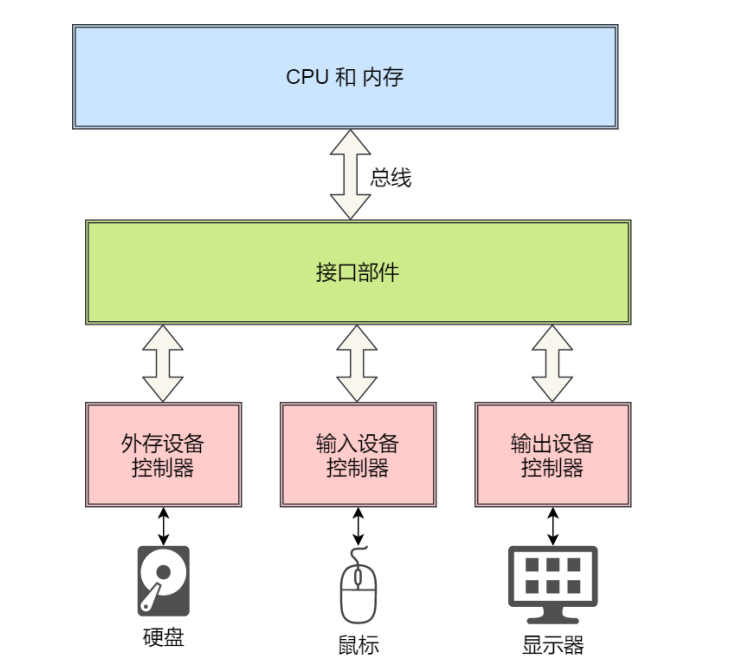
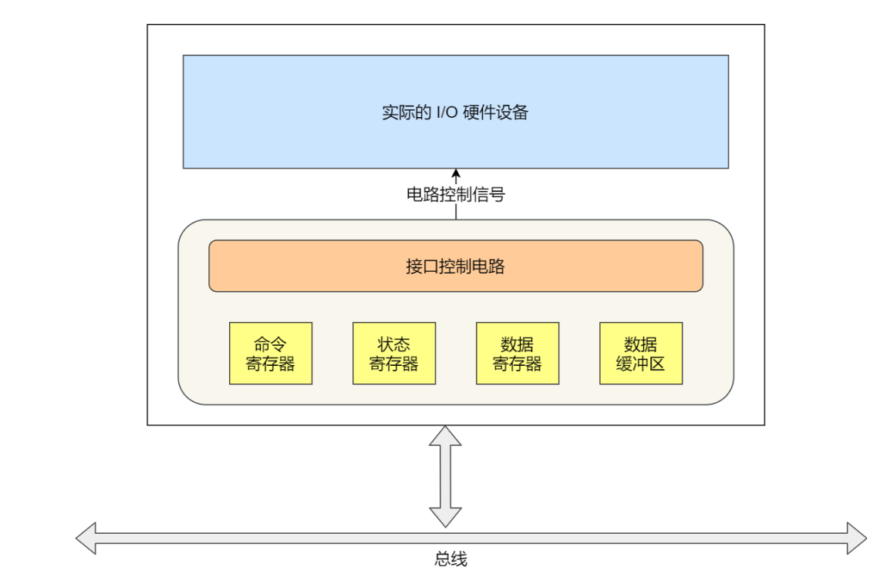
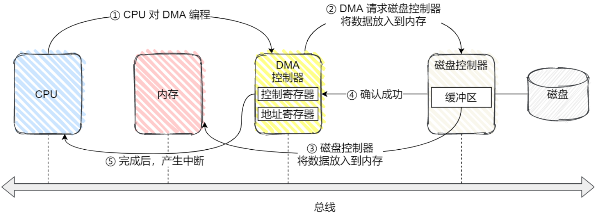
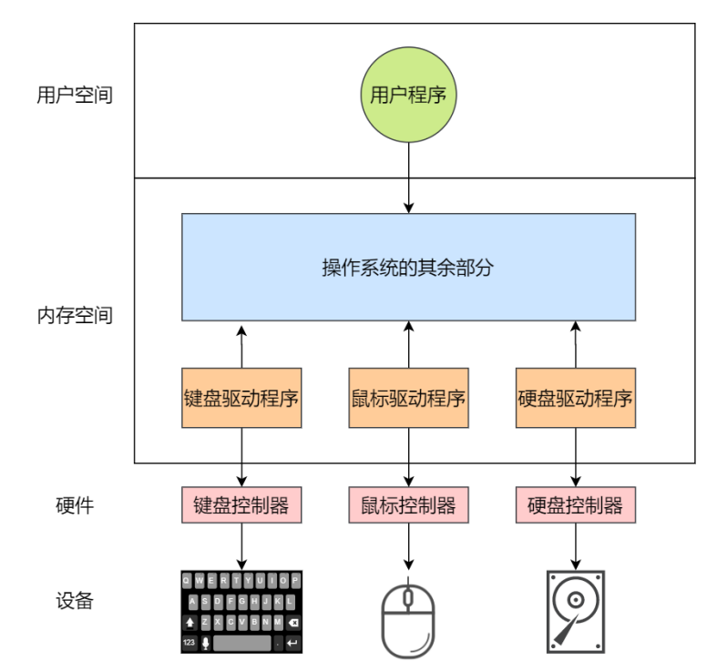
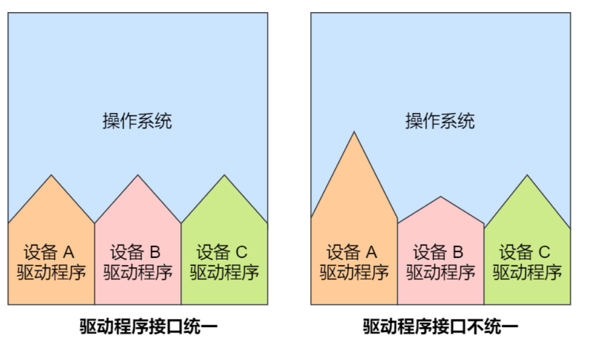
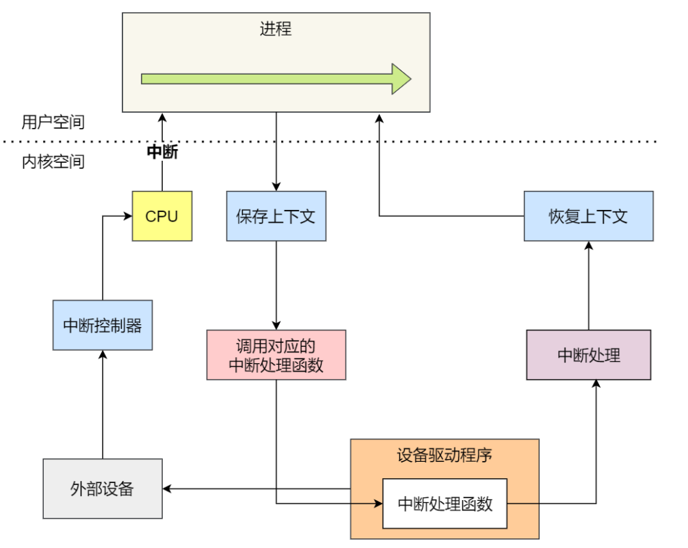
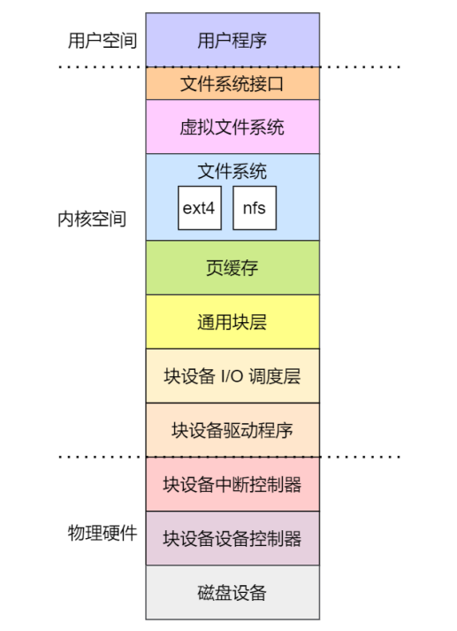
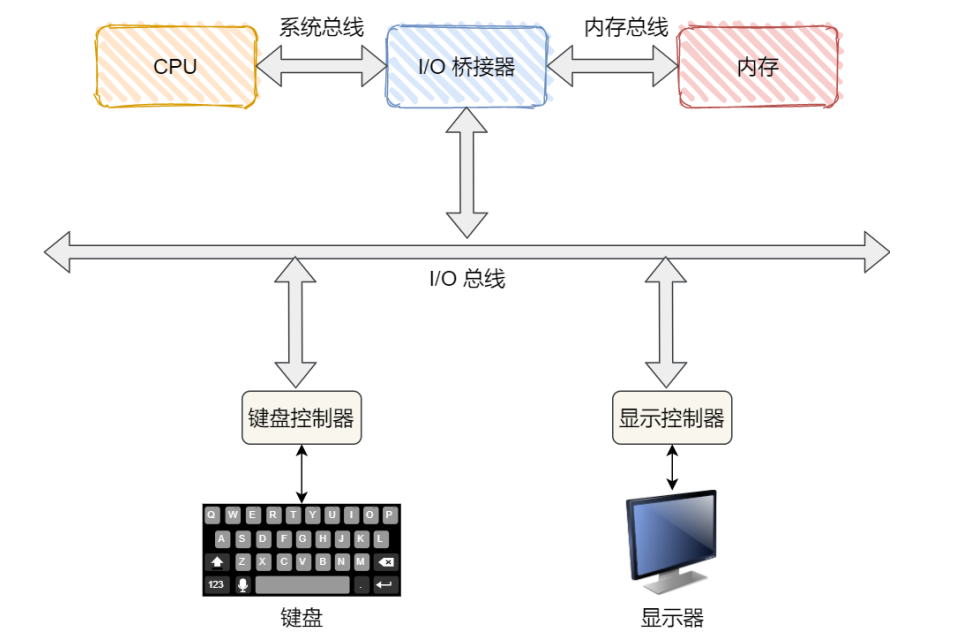

### 设备控制器

我们的计算机包含了许多的输入输出设备，比如鼠标、键盘、网卡、显示器、磁盘等，每个设备的用法和功能不同，操作系统是如何统一管理这样设备的呢？为了屏蔽各种输入输出设备之间的差异，每种设备中都有一个组件，叫做**设备控制器（Device Control）**，比如硬盘有硬盘控制器，显示器有视频控制器，**设备控制器是属于硬件层面的东西，不属于操作系统**

因为这些设备控制器都很清楚每个设备的功能，所以CPU是通过和设备控制器”打交道“来控制输入输出设备的

设备控制器里面有芯片，能够用来自己既定的执行逻辑，设备控制器中还有寄存器，用来和CPU进行通信

- 通过写入这些寄存器，CPU（操作系统）能够控制设备的启动、关闭，也可以命令设备接收、发送数据，或者执行某些其他的操作
- 通过读取这些寄存器，CPU（操作系统）能够了解设备的运行状态，是否已经准备好接受下一个指令

如下图所示，是设备控制器的结构

寄存器主要是分成了三个部分：

- **数据寄存器（Data Register）**，CPU向I/O设备写入需要传输的数据时，比如要打印的内容是`HELLO`，CPU就要先发送一个H给对应的I/O设备
- **指令寄存器（Command Register）**，CPU发送一个命令，告诉I/O设备，要进行输入/输出操作，于是I/O设备就回去执行命令寄存器内的指令，当指令执行完毕之后，会把状态寄存器中的状态标记为已完成
- **状态寄存器（Status Register）**，目的是告诉CPU当前的工作是否已经完成，如果处于正在运行状态，CPU这时候再有命令发送过来，都是没有用的，直到前面的工作已经完成，状态寄存器中的状态已经标记为已完成，CPU才能够发送下一个字符和指令

**CPU通过控制设备控制器中寄存器的状态来控制设备操作，这要比CPU直接控制设备简单和方便的多**

输入和输出设备能够分成两大类，分别是**块设备（Block Device）**和**字符设备（Character Device）**

- 块设备：把数据存储在固定大小的块内，每个块也有自己的地址，硬盘、USB都属于典型的块设备
- 字符设备：以字符为单位接收或者发送一个字符流，字符设备是不可寻址的，也没有任何的寻道操作，鼠标属于典型的字符设备

块设备传输的数据量通常特别大，于是在块设备的内存还有一个**可读写数据缓冲区**

- CPU写入数据到控制器的缓冲区中，只有当缓冲区中的数据屯够了一部分之后，才会发给设备
- CPU从控制器的缓冲区中读取数据的时候，也需要缓冲区屯够了一部分，在返回给内存

**给块设备设立一个缓冲区的原因是为了减少对设备的频繁操作**

CPU是通过什么样的方式来和设备控制器中的寄存器和数据缓冲区进行通信的呢？

- **端口I/O，**每个寄存器都被分配一个IO端口，可以通过特殊的汇编指令来操作这些寄存器
- **内存映射I/O，**将所有寄存器映射到内存空间中，这样就能够像读写内存那样读写数据缓冲区

### I/O控制方式

通过前面我们知道了，每个设备都有一个设备控制器，设备控制器其实就相当于一个小CPU，它能够执行一些操作，但问题是，当CPU给设备发送了一个指令让设备去读取数据，当数据读取完了之后应该怎么通知CPU呢？

我们根据之前复习过的知识就能够向当有两种方式：轮询和中断

- **轮询，**CPU不断去检查设备控制器中状态寄存器的状态，直到状态寄存器的状态被标记为已完成，很明显，这种方式会一直占用CPU的时间，在设备读取数据的过程中，CPU除了轮询，做不了其他的事情，利用率比较低
- **中断，**这种方式是当设备准备好数据之后，会发送一个中断信号来通知操作系统，CPU接收到中断信号之后，会知道数据已经准备好了，然后立刻停下目前正在运行的进程，去调用中断处理程序，除此之外，为了减少处理中断对正常进程的影响，中断还分成了硬中断和软中断，软中断是内核线程，”在背后“处理一些比较耗时的操作

很明显，使用中断比轮询的方式好，但是中断对于频繁读写数据的磁盘是不友好的，这位这样CPU会被频繁打断，进程上下文切换会浪费大量的时间，对于这一类设备的问题的解决方式是使用**DMA（Directly Memory Access，直接内存访问）**功能，它可以使设备在CPU不参与的情况下，能够自行完成把IO设备的数据拷贝到内存中，**想要实现DMA功能，需要DMA控制器的硬件支持**

如上图所示，是DMA的工作方式

- CPU首先对DMA控制器发送指令，告诉他需要多少数据，读取之后的数据存放到内存的什么位置
- 接下来，DMA控制器会向磁盘控制器发送指令，告诉磁盘先把数据放到自己的数据缓冲区中，然后再把缓冲区中的数据拷贝到内存中
- 当磁盘控制器把数据全部传输给内存之后，磁盘控制器会在总线上发送一个信号告诉DMA控制器任务已经完成了
- DMA控制器收到成功信号之后会产生一个中断，通知CPU他想要读取的数据已经全部拷贝到内存中了，此时CPU处理该中断，内存中有了现成的数据可以使用了

可以看到，CPU当要读取磁盘中的数据的时候，只需要在开始向DMA控制器发送一个信号，然后就可以去处理其他事情了，DMA控制器通过中断的方式，告诉CPU数据已经准备好了，可以从内存中直接使用了。仅仅在开始和结束的时候需要CPU的干预。

### 设备驱动程序

虽然设备控制器屏蔽了设备之间的众多差异，但是不同设备之间的控制器的寄存器、缓冲区的使用方式也是各不相同，所有**为了屏蔽设备控制器之间的差异，又出现了设备驱动程序**

从上图中可以看出，与设备控制器不同的是，**设备驱动程序属于操作系统**，是软件，操作系统的内核代码可以向调用本地代码一样使用设备驱动程序的接口，而设备驱动程序是面向设备控制器的代码，他发出操纵设备控制的指令后，才可以操作设备控制器

不同的设备控制器虽然功能不相同，但是**设备驱动程序会提供一个统一的接口给操作系统**，这样不同的设备驱动程序就可以以相同的方式接入操作系统，如下图

前面提到了不少关于系统中断的事情，我们知道，设备完成事情后会发送中断来通知CPU，CPU会立刻停止当前正在执行的进程，转而去处理中断，那么中断处理函数就在设备驱动程序中，它会及时响应控制器发来的中断请求，并根据这个中断的类型调用相应的中断处理函数进行处理。

**通常，设备驱动程序初始化时，要先注册一个该设备中的中断处理函数**

中断处理程序的处理流程

- 在IO时，设备控制器如果已经准备好了数据，就会通过指令寄存器向CPU发送中断请求
- CPU接收到中断请求之后，会先记录下当前进程的上下文（保护被中断进程的上下文现场）
- 然后处理中断请求，通过转入相应的设备中断处理函数来处理中断请求
- 进行中断处理
- 回复被中断进程的上下文

### 通用块层

对于块设备，为了减少不同块设备的差异带来的影响，Linux通过一个统一的通用块层来管理不同的块设备

**通用块层处于文件系统和设备驱动程序之间的一个抽象层**，他主要有两个功能：

- 向上为文件系统和应用程序提供访问块设备的标准接口，向下把各种不同的块设备抽象为一个统一的块设备，并在内核层面，提供一个框架来管理这些设备的驱动程序
- 通用块层的另一个作用就是能够对来自文件系统和应用程序的请求排队，接着会进行I/O调度，提高磁盘读写的效率

**I/O调度的5种方式**

- **没有调度算法，**他不对文件系统和应用程序的I/O请求做任何处理，这种算法通常用在虚拟机中，意思就是I/O调度由物理机系统完成

- **先入先出调度算法，**最简单的调度算法，先进入调度队列的I/O请求先发生
- **完全公平调度算法，**这时大多数系统中的I/O调度器默认的算法，他为每个进程维护了一个I/O队列，并按照时间片来均匀分布每个进程的I/O请求
- **优先级调度算法，**顾名思义，优先级高的I/O请求先发生，它适用于运行大量进程的系统，比如桌面环境、多媒体应用等
- **最终期限调度算法，**分别为读、写请求创建了不同的I/O队列，这样可以提高机械磁盘的吞吐量，并确保快要到达最终期限的请求能够优先处理，这种算法常用于I/O压力比较大的系统，比如数据库

### 存储系统I/O软件分层

综合前面的知识，我们能够知道Linux存储系统分成了三个层次，分别是：文件系统层，通用块层，设备层

这三个层次的作用分别是：

- 文件系统层：包括虚拟文件系统和其他文件系统的实现，向上为应用程序统一提供了标准的文件访问接口，向下会通过通用块层来存储和管理磁盘数据
- 通用块层：向上为文件系统和应用程序提供统一的磁盘访问接口，向下把不同块设备抽象为同一个块设备，同时包含IO调度器，先对IO请求进行排队，然后再通过调度器选择一个IO请求发送给下一层的设备
- 设备层：包括硬件设备、设备控制器和驱动程序（属于操作系统），负责最终物理设备的IO操作

有了文件系统的接口之后，不仅可以通过文件系统的命令行来访问设备，而且应用程序可以通过调用`read`,`write`等函数，就像读写文件那样操作设备，所以说在Linux中，设备也是一种特殊的文件

> 但是，除了读写操作，还需要有检查特定于设备的功能和属性。于是，需要 `ioctl` 接口，它表示输入输出控制接口，是用于配置和修改特定设备属性的通用接口

除此之外，存储系统的IO是整个系统最慢的一个环节，所以Linux提供了不少缓存机制来提高IO的效率

- 为了提高对文件访问的效率，会使用**页缓存、索引节点缓存、目录项缓存**等多种缓存机制，目的就是为了减少对块设备的直接调用
- 为了提高对块设备的访问效率，会使用数据控制器中加入**数据缓冲区**，来缓存块设备的数据

### ==键盘敲入字母的期间发生了什么？==

CPU直接和系统总线通信，然后系统总线再接入一个I/O桥接器，这个I/O桥接器另一边接入了内存总线，使得CPU和内存通信，再另一边，又接入了一个IO总线，用来连接IO设备，比如键盘、显示器等，具体如下图

当键盘敲入字母时，会发生如下过程：

- 当用户输入了键盘字符，**键盘控制器**就会产生扫描码数据，并将其缓冲到数据寄存器中，然后键盘控制器向CPU发送中断请求
- CPU接收到中断请求之后，会**保存当前正在运行进程的现场**（CPU上下文），然后再去**调用键盘的中断处理程序**
- 键盘中断处理函数的功能从控制器的数据寄存器的缓冲区中读出扫描码数据，再根据这个扫描码找到用户在键盘上输入的字符，**如果输入的字符是显示字符，那就会把扫描码翻译成对应字符的ASCII码**，比如用户在键盘上输入的是A，是显示字符，那么就会把扫描码翻译成A字符的ASCII码
- 得到显示字符的ASCII码之后，就会把显示字符的ASCII码放入到**读缓冲区队列**，接下来就是要把显示字符显示到屏幕上，显示设备的驱动程序会定时从读缓冲区队列中读取输入放入到写缓冲区队列中，最后把写缓冲区队列中的数据一个一个写入到显示设备控制器的数据寄存器的缓冲区中，最后将这些数据显示到屏幕上
- **显示出结果之后，恢复被中断进程的上下文**

> 首先是设备控制器产生一个扫描码数据，并将其缓冲到设备控制器中的数据寄存器/数据缓冲区中（这里应该需要看看是块设备还是字符设备），接着设备控制器通过I/O总线向CPU发起中断请求、
>
> 第二，CPU先保护当前正在运行进程的线程，然后去键盘驱动程序中调用中断处理程序
>
> 第三，中断处理程序的作用就是在数据寄存器中读出数据，比如键盘中，还要看看数据是不是显示字符，如果是的话，还要翻译成ASCII码
>
> 第四，将第三步中读出的数据放入到内存的读缓冲区中，输出设备会定时读取读缓冲区中的数据，把数据放入到自己控制器数据寄存器的写缓冲区队列中，然后把写缓冲区中的数据一个一个的显示到屏幕上
>
> 第五，显示完成之后，恢复被中断进程的上下文

