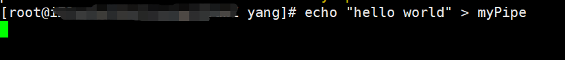
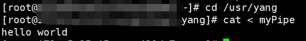
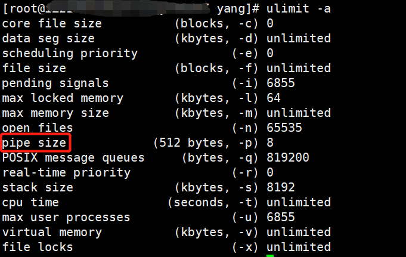
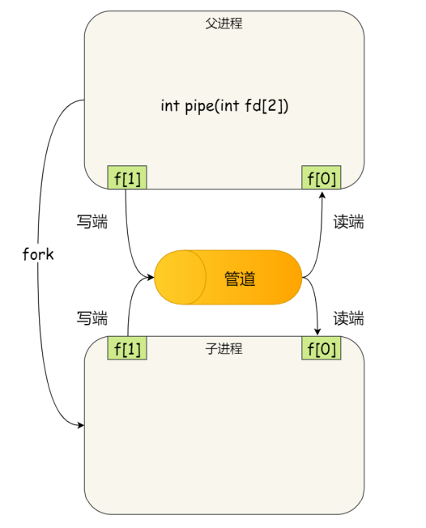
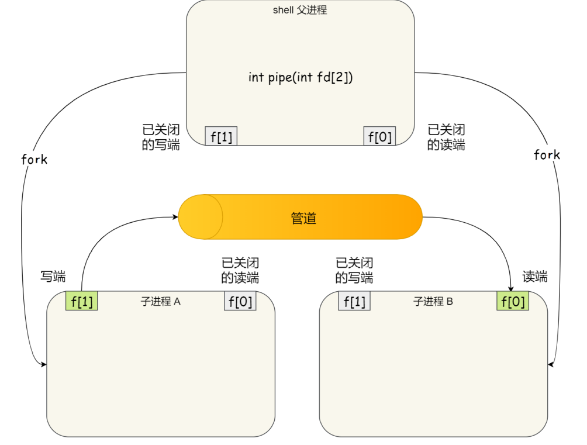
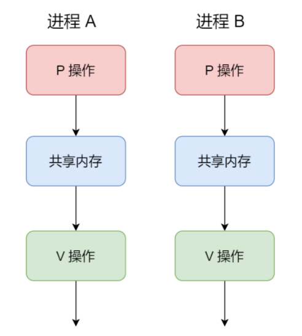
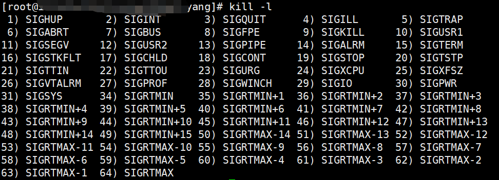

[toc]


## 进程

### 进程的概念

我们编写的**代码只是存储在硬盘上的静态文件，**通过编译以后会形成可执行文件，当我们执行这个可执行文件的时候，会把这个可执行文件加载进内存，接着CPU会执行程序中的每一条指令，那么**这个运行过程中的程序叫做进程**

现在我们考虑有一个读取硬盘数据的程序被执行了，那么当运行到读取文件的指令的时候，就会从硬盘中读取文件，但是硬盘的读写是非常慢的，那么在这个时候，如果CPU等着硬盘数据的返回，很显然这种方式对CPU的利用率就很低了

所以，当程序从硬盘中读取数据的时候，CPU不需要阻塞等待硬盘数据的返回，而是转而去执行另外的进程，当硬盘中的数据被加载进内存之后，CPU会收到一个中断，于是CPU转而去处理这个中断程序，切换进程


对于一个支持多进程的系统，CPU会从一个进程快速切换至另一个进程，期间每个进程各运行几十或者几百毫秒

虽然单核的CPU在某个时刻只能够运行一个进程，但是可以在一段时间内（比如1秒）执行多个进程，这样就会产生并行的错觉，实际上**这是并发**，CPU可以从一个进程切换到另一个进程，在进程切换之前，必须记录下当前进程的运行状态信息，以备下次切换回来恢复运行


总的来说，**进程可以说是程序的一次动态执行，进程是动态的，程序是静态的，但是进程和程序之间却并不是一一对应的关系，**一个程序可以对应多个进程，即多个进程执行同一个程序，一个进程也可以对应多个程序


### 进程的状态

对于进程状态的讲解，我们直接看下图


其实，**进程的状态中`运行状态，就绪状态和阻塞状态`是三个最核心的状态，**那我们首先来看这三个状态：

- 运行状态：处于运行状态的进程占用着CPU
- 阻塞状态：正在运行的进程由于等待某一事件的发生而进入阻塞状态，比如事件I/O，处于阻塞状态的进程，除非他所等待的事件已经完成，否则即使给他CPU他也没办法运行
- 就绪状态：处于阻塞状态的进程等待的事件完成了，或者处于运行状态的进程被剥夺了CPU的使用，这个时候，只要给处于就绪状态的进程CPU，他就能够运行

我们知道进程会首先被装载进内存，然后被送入CPU执行，当处于内存中有大量处于阻塞状态的进程的时候，进程会占用着物理内存空间，因为物理内存空间是有限的，所以这显然不是我们想要的，所以我们会把一些处于阻塞状态的进程的页**换出**到硬盘上，等需要再次运行的时候，再把这个页换回来。

因此，我们就需要一种状态来描述**进程并没有占用实际的物理内存空间的情况，这个状态就是挂起状态**，从上图中也可以看出，挂起状态也分为了两种：

- 阻塞挂起状态：进程在外存（硬盘）等待某个事件的出现
- 就绪挂起状态：进程在外存（硬盘）等待系统的调用，只要进入内存，就会被加入到就绪队列中，因为处于就绪状态的进程属于“万事俱备，只差CPU”

我们可以使用`sleep()`让进程挂起，或者在Linux中使用`ctrl+z`挂起进程


### 进程的数据结构

在操作系统中，我们通过使用进程控制块（process control block，PCB）这个数据结构来描述进程

**PCB是进程的唯一标识，**一个进程存在必然会有一个PCB与之对应，如果进程消失了，那么他的这个PCB也会随之小时

> **<font color=red>那么PCB中有什么信息呢</font>**

- **进程描述信息：**
  - 进程标识符（PID）：标识各个进程，每个进程都有唯一的一个进程标识符
  - 用户标识符：用来表示这个进程是属于哪个用户的
- **进程控制和管理信息：**
  - 进程的优先级
  - 进程的当前状态：如`new ready running waiting  blocked`等
- **资源分配清单：**
  - 有关内存地址或者虚拟内存地址空间的信息，所打开的文件列表和所使用的I/O设备信息
- **CPU相关信息：**
  - CPU中各个寄存器的值，当进程被切换时，CPU的状态信息会被保存在相应的PCB中，以便进程重新执行的时候，能够从断点处继续执行


> **<font color=red>PCB是如何组织的</font>**

**PCB通常是通过链表的形式组织的**，把具有相同状态的PCB连在一起，组成队列，比如：

- 把所有就绪状态的进程连在一起，称为就绪队列
- 把所有因为等待某件事件而处于等待状态的进程连在一起就组成了各种阻塞队列
- 对于运行在单核CPU系统中则只有一个运行指针了，因为单核CPU在某个时间只能运行一个程序


除了链表的形式以外，**还可以通过索引的方式将PCB组织起来**，它的工作方式是将同一个状态的进程组织在同一个索引表中，索引表项指向相应的PCB，不同状态对应着不同的索引表

> 一般会选择链表，因为进程会面临频繁的创建、销毁等操作，使用链表更加灵活


### 进程的控制

前面我们了解了进程的状态变迁和数据结构（PCB），再来看看**进程的创建、终止、阻塞、唤醒等过程，这些过程也就是进程的控制**

#### 创建进程

创建进程的过程：

- 为新进程分配一个唯一的进程标识号，并申请一个空白的PCB，PCB是有限的，若申请失败则创建失败
- 为进程分配资源，此处如果资源不足的话，进程就会进入等待状态，等待资源（这个是不是阻塞状态？！）
- 初始化PCB，标记进程为就绪状态
- 如果进程的调度队列能够接受新进程，那么就会将进程插入到就绪队列中，等待被调度运行

操作系统是允许一个进程创建另一个进程的，子进程能够继承父进程所拥有的资源，如果销毁一个子进程，需要把子进程所继承的资源还给父进程，如果销毁一个父进程，也会同时销毁它所有的子进程

> 注意：在Linux中，如果销毁有子进程的父进程，会把子进程交给Linux的1号进程管理。


#### 终止进程

进程的终止有三种情况：进程正常运行完、进程出现异常，操作系统把这个进程销毁、外界干预（kill等操作）

终止进程的过程如下：

- 查找需要终止的进程的PCB
- 如果此时进程正处于运行状态，那么会首先终止其运行，然后将CPU让给其他进程使用
- 如果这个进程还有子进程，则还应该将其子进程终止
- 将该进程所拥有的全部资源都归还给父进程或者操作系统
- 将其PCB从队列中删除


#### 阻塞进程

当进程需要等待某一事件完成时，他可以调用阻塞语句把自己阻塞等待，而**一旦被阻塞等待时，它只能够被另一个进程唤醒**

进程阻塞的过程：

- 找到将要被阻塞进程标识号对应的PCB
- 如果该进程处于运行状态，则保护其现场（把当前CPU的状态信息保存在PCB中），然后将其状态转变成阻塞状态，停止运行
- 将该PCB插入到阻塞队列中去


#### 唤醒进程

**进程由运行转变为阻塞状态是由于进程需要等待某一事件的完成，所以处于阻塞状态的进程是不能够自己把自己唤醒的**

如果某进程正在等待I/O事件，需要有别的进程发消息给他，则只有当该进程所期待的事件出现时，才由发现者用唤醒语句唤醒它

唤醒进程的过程如下：

- 在该事件的阻塞队列中找到相应进程的PCB
- 将其从阻塞队列中移出，并将其状态标记位就绪状态

- 将该进程加入就绪队列中，等待调度程序的调度


**进程的阻塞和唤醒是一对功能相反的语句，如果某个进程调用了阻塞语句，则必有一个与之相反的唤醒语句**


### 进程的上下文切换

笼统地说，从一个进程切换到另一个进程就叫做进程的上下文切换

> 再详细说进程上下文切换之前，我们下来看一下CPU上下文切换

什么是CPU的上下文？我们知道任务是要交给CPU来运行的，所以当一个CPU拿到一个任务的时候，它需要知道任务从哪里开始加载，从哪里开始运行，所以**操作系统会事先帮CPU设置好CPU（指令）寄存器和程序计数器**

CPU寄存器是CPU内部一个容量小但是速度极快的内存，其中存放的是CPU执行的指令，程序计数器中存放的是CPU将要（下一条指令）执行的指令的地址

所以说，**CPU指令寄存器和程序计数器是CPU在运行任何任务之前必须依赖的环境，这些环境就叫做CPU的上下文**

既然知道了什么是CPU的上下文，那么理解CPU上下文切换也就不难了

所谓CPU上下文的切换就是**保存前一个任务的CPU上下文**（CPU寄存器和程序计数器），然后**加载新任务的上下文**到CPU寄存器和程序计数器中，这样CPU就能够通过程序计数器中指令的地址开始执行新任务了

系统内核存储保存下来的上下文信息，此时任务再次被分配给CPU运行时，CPU会重新加载这些上下文，这样就能够保证任务的原来状态不受影响，让任务看起来还是连续运行的

上面说到的任务，主要包含进程、线程和中断，所以根据任务的不同，又可以把CPU上下文切换划分成：进程上下文切换、线程上下文切换和中断上下文切换


> 明白了上面的CPU上下文切换，那么下面我们就来看一下进程上下文切换

因为进程是由内核管理和调度的，所以**进程的切换只能够发生在内核态**

所以，**进程上下文的切换不仅包含了虚拟内存、栈、全局变量等用户空间的资源，还包括了内核堆栈、寄存器等内核空间的资源**


从上图中我们可以看出，进程的上下文切换分成了两个部分：

- 保存前一个进程的上下文信息，这个信息会被保存到这个进程的PCB中，以便以后恢复运行
- 加载下一个进程的上下文信息，也就是说CPU会从进程的PCB中取出这个进程的上下文信息，恢复运行

> 需要注意的是，进程的上下文切换开销是很关键的，我们希望这个开销越小越好，这样便可以使得CPU能够把更多的时间放在进程的执行上，而不是耗费在进程的上下文切换这个过程中


**<font color=green>发生进程上下文切换的场景如下：</font>**

- 时间片耗尽：为了保证所有进程可以得到公平调度，CPU 时间被划分为⼀段段的时间片，这些时间片再被轮流分配给各个进程。这样，当某个进程的时间片耗尽了，进程就从运行状态变为就绪状态，系统从就绪队列选择另外⼀个进程运行
- 更高优先级的进程到来：当有优先级更高的进程运行时，为了保证高优先级进程的运行，当前进程会被挂起，由高优先级进程来运行
- 发生硬件中断：发⽣硬件中断时，CPU 上的进程会被中断挂起，转而执行内核中的中断服务程序
- 进程通过睡眠函数`sleep`主动挂起，也会引起进程调度
- 进程在系统资源不足（比如内存不足）的时候，要等到系统资源满足的时候才能够运行，这个时候进程也会被挂起，并由系统调度其他进程运行


## 线程

### 什么是线程

举例说明，假设我们需要编写一个视频播放器软件，该软件具有三个核心功能：

- 从视频文件中读取数据
- 将数据解压出来
- 把解压缩后的视频数据播放出来

如果是单进程的实现方式，那么我们会这么实现：


对于单进程的实现方式，存在下面这些问题：

- 播放出来的画面和声音会不连贯，因为当 CPU 能力不够强的时候，Read 的时候可能进程就等在这了，这样就会导致等半天才进行数据解压和播放；
- 各个函数之间不是并发执行，影响资源的使用效率；

如果改成如下所示的多进程方式，可能存在这样的问题:


对于多进程的这种方式，依然会存在问题：

- 进程之间如何通信，共享数据？
- 维护进程的系统开销较大，如创建进程时，分配资源、建立 PCB；终止进程时，回收资源、撤销 PCB；进程切换时，保存当前进程的状态信息；

所以，为了解决这个问题，计算机科学家发明了一种新的实体，这种实体互相之间可以并发执行，而且共享相同的地址空间。这种新的实体就是**线程（Thread）**，同一个进程内的多个线程之间可以共享代码段、数据段、打开的文件等资源，但是每个线程各自都有一套独立的寄存器和栈，这样可以确保线程的控制流是相对独立的

**线程是进程当中的一条执行流程**

同一个进程内的多个线程之间可以共享代码段、数据段、打开的文件等资源，但是每个线程各自都有一套独立的寄存器和栈，这样可以确保线程的控制流是相对独立的


> **线程的优缺点**

线程的优点：

- 一个进程中可以同时存在多个线程

- 各个线程之间可以并发执行
- 各个线程之间可以共享地址空间和文件等资源

线程的缺点：

- 进程中的一个线程崩溃时，会导致其所属进程的所有线程崩溃

  > 举个例子，对于游戏的用户设计就不能使用多线程了，不能因为一个用户掉线了，所有的用户都受到影响


### 进程和线程的比较

线程和进程的比较如下：

- **线程是CPU调度的基本单位，而进程是系统进行资源分配的基本单位（最大区别）**
- 进程拥有一个完整的资源平台，而线程是共享其所在进程的地址空间、全局变量等资源，只独享必不可少的资源，比如栈和寄存器
- 线程同样具有阻塞、就绪、运行三种基本状态，同样具有不同状态之间的转换关系
- 线程能够减少并发执行的时间和空间开销


> 线程相较于进程能够减少开销体现在：

- 线程的创建时间比进程快，因为进程在创建过程中还需要资源管理信息，比如内存管理信息、文件管理信息，而线程在创建过程中，不会涉及这些资源管理信息，而是共享他们
- 线程的终止时间比进程少得多，因为线程需要释放的资源比进程少得多
- 同一个进程内的线程切换比进程切换快得多，因为同一个进程内的线程具有相同的地址空间（虚拟内存共享），这也就意味着所有的线程都具有同一个页表，那么在线程切换的时候，就不需要切换页表了，而进程的切换需要切换页表，这个页表切换过程的时间开销还是比较大的
- 同一个进程内的线程通信不需要通过内核，因为同一个进程内的线程共享文件资源和内存信息


### 线程的上下文切换

在前面我们知道了，线程是CPU进行调度的基本单位，所以，所谓的操作系统任务调度，实际上的调度对象其实是线程，而进程只是给线程提供了虚拟内存、全局变量等资源

对于进程和线程我们可以这么理解：

- 如果一个进程中只有一个线程，那么可以认为此时进程就等同于线程
- 如果一个进程中有多个线程，那么此时这多个线程共享这个进程的内存空间和全局变量等资源，这些资源在上下文切换时是不需要修改的

另外，线程也有自己的私有数据，比如寄存器和栈，这些在上下文切换的时候是需要保存的

线程的上下文切换还需要看线程是否属于同一个进程：

- 如果不属于同一个进程，那么线程切换的过程和进程上下文切换的过程是一样的
- 如果属于同一个进程，因为虚拟内存是共享的，所以在切换的时候，虚拟内存这些资源就保持不动，只需要切换线程的私有数据、寄存器等独占的数据

**所以，同一进程内的线程切换的开销要比进程切换小得多**


### 线程的实现

线程的实现主要有三种方式：

- **用户线程（User Thread）**：在用户空间实现的线程，不是由内核管理的线程，是由用户态的线程库来完成线程的管理
- **内核线程（Kernel Thread）**：在内核空间实现的线程，由内核管理
- **轻量级进程（LightWeight Process，LWP）**：内核支持的用户线程


用户线程和内核线程的对应关系<font color=red>（为什么要对应？）</font>

- 多对一：多个用户线程对应一个内核线程

  

- 一对一：一个用户线程对应一个内核线程

  

- 多对多：多个用户线程对应多个内核线程

  


> **如何理解用户线程**

用户线程是基于用户态的线程管理库来实现的，那么线程控制块（Thread Control Block，TCB）也是在库里实现的，**对于操作系统而言是看不到这个TCB的，它只能够看到整个进程的PCB，如下图**，所以，**<font color=red>用户线程的管理和调度，操作系统都是不参与的，而是由用户空间下的线程库中的相关函数来完成调度和管理，包括线程的创建、终止、同步和调度等</font>**

> 用户级线程和协程的区别是什么？
>
> 进程、线程、协程的相关内容见：
>
> https://juejin.cn/post/6975852498393235487
>
> https://www.cnblogs.com/Survivalist/p/11527949.html

下图所示是用户线程的模型，看着**类似**于前面说到的多对一模型，即多个用户线程对应一个内核线程，这里变成了多个用户线程对应着一个内核态下的进程


用户线程的优点：

- 每个进程都需要有它线程控制块（TCB）的列表，用来跟踪记录它各个线程的状态信息，因为TCB是由用户空间的线程库函数来维护，**所以用户线程可用于不支持多线程的操作系统**

- 因为用户线程的调度是由线程库函数来完成，所以**用户线程的切换不需要有用户态和内核态的切换**，因此用户线程切换比较快

用户线程的缺点：

- 由于操作系统不参与用户线程的调度，所以**一旦某个线程发起了系统调用而阻塞，那么该进程中包含的其他线程都只能等待**，不能被执行了
- 当**一个用户线程开始执行了之**后，除非他自己主动让出CPU，否则**他所在进程中的其他线程都是没有办法执行的**，因为用户态的线程没有办法打断当前运行中的线程，因为他没有这个特权，只有操作系统才有，但是用户线程不是由操作系统管理的

- 因为进程是操作系统资源分配的基本单位，所以时间片会被分给进程，所以与其他进程相比，再多线程执行的时候，每个线程平均得到的时间片会比较少，所以**执行的周期会比较长**


> **如何理解内核线程**

内核线程是由内核空间实现的，所以内核线程的TCB自然就放在了内核空间中，它的管理和调度都是由操作系统内核来完成

内核线程的模型，**类似**于前面提到的一对一模型，一个用户线程对应一个内核线程，这里的意思应该是内核能够清楚地直到有多少个线程


内核线程的优点：

- 如果一个内核线程由于发起了系统调用而被阻塞，不会影响其他内核线程的执行

- 时间片的分配是直接给线程，所以多线程的进程获得更多的CPU运行时间

内核线程的缺点：

- 在支持内核线程的操作系统中，由内核来维护进程和线程的上下文信息，PCB和TCB

- 线程的创建、终止和切换都是通过系统调用的方式来实现的，因此对于系统来说，系统开销比较大


> **如何理解轻量级进程**

轻量级进程（LWP）是内核支持的轻量级线程，一个进程可以有一个或者多个LWP，每个LWP和内核线程是一一对应的，也就是说每个LWP都是由一个内核线程支持的


**LWP只能够由内核进行管理，并像<font color=red>普通进程</font>那样被调度，Linux内核是支持LWP的典型例子**

> LWP和普通进程的区别

在大多数系统中，**LWP和普通进程的区别在于LWP只有一个最小的执行上下文和调度程序所需的统计信息，<font color=blue>一般来说，一个进程代表一个程序的一个实例，而LWP代表程序的执行线程，</font>因为一个执行线程不像进程那样需要那么多的状态信息，所以LWP也就不带有这样的信息**，如下图：


在LWP之上也是可以使用用户线程的，那么LWP和用户线程的对应关系也就有三种：

- **1 : 1 ，即⼀个 LWP 对应 ⼀个用户线程**

  - 优点：能够实现并行，当一个LWP阻塞时，不会对其他的LWP产生影响
  - 缺点：一个用户线程对应一个LWP，对应一个内核线程，创建线程的开销较大

- **N : 1 ，即⼀个 LWP 对应多个用户线程**

  线程管理是在用户空间完成的，此模式中用户的线程对操作系统不可见

  - 优点：用户线程要开几个都没有问题，而且上下文切换发送在用户空间，切换的效率比较高
  - 缺点：一个用户线程如果阻塞了，则整个进程都会被阻塞，另外在多核CPU中，无法充分利用CPU（因为只对应着一个内核线程）

- **M : N ，即多个 LMP 对应多个用户线程**

  把前面两个模型混在一起就形成了多对多模型，首先多个用户线程对应多个LWP，然后每个LWP对应一个内核线程

  优点：综合了前面两种模式的优点，大部分的线程上下文切换发生在用户空间（LWP上下文切换发生在内核空间），且多个线程又可以充分利用多核CPU的资源

除此之外，还有一种**组合模式**，上图中的进程5

此进程结合了`1:1`和`M:N`模型，开发人员可以根据不同的应用特点调节内核线程的数目来达到物理并行和逻辑并行的最佳方案


## 进程间的通信

大部分用户直接面对的程序都是运行在用户态，进程可以通过系统调用从用户态陷入内核态，从下图中我们可以看出，每个进程的用户空间地址是独立的，一般而言是不能够直接相互访问的，但是内核空间是每个进程共享的，所以**进程之间的通信一定经过内核**


### 管道

```bash
ps auxf | grep mysql
```

上面命令行中的`|`就是一个**匿名管道**，用完即毁，上面命令的含义是把前一个命令`ps auxf`的输出作为后一个命令`grep mysql`的输入，可以看出，**管道传输的数据是单向的，如果想要实现双向通信，那么就需要创建两个管道**

除了匿名管道之后，当然还有命名管道，**命名管道又称为`FIFO`**，因为管道中的数据是先进先出的传输方式，在使用命名管道之前，必须先使用`mkfifo`创建它，如下：


因为在Linux中一切皆文件，所以管道也是一种文件，不同的是，**命名管道会被存储到文件系统中，匿名管道会被内存中，**但是不管是匿名管道还是命名管道，他们写入的数据都是放到了内存中，也就是说命名管道这个管道会被存储到文件系统中，但是**数据不会被存储下来**



我们执行命令往管道中写入数据，会发现命令执行会被停住，这是因为管道中的内容没有被读取出去，只有当管道中的内容被读取出去了之后，命令才可以正常退出



另一个终端中的命令也退出了


从上面这个例子中我们可以看到**管道的缺点就是效率很低，不适合进程间频繁的进行通信，优点是管道很简单，同时我们也能够清楚的知道什么时候往管道里写入了数据，什么时候读取了数据**

除此之外，**区别于匿名管道，命名管道突破了只能够在有亲缘关系的进程之间通信的限制**


> **前面说到了怎么创建命名管道，那么Linux中是怎么创建匿名管道的呢？**

匿名管道的创建需要下面这个系统调用

```c
int pipe(fd[2])
```

上面的这个系统调用表示创建一个匿名管道，返回值是两个文件描述符，`fd[0]`表示管道的读取端的文件描述符，`fd[1]`表示管道的写入端的文件描述符，注意**匿名管道是一种特殊的文件，那只存在于内存中，用完即毁，而命名管道可以被存储到文件系统中**


其实，所谓的匿名管道本质上就是内存中的一串缓存，从管道的一端写入数据，另一端读出数据（很像队列啊），管道传输的数据是无格式的流而且大小受限，大小可以通过`ulimit -a`来查看（512bytes * 8 = 4kb）




上面介绍了命名管道和匿名管道的创建，我们知道了**管道的两个文件描述符是在一个进程中的**，并没有起到进程间通信的作用，那么进程是怎么通过管道实现进程之间通信的呢？

我们可以使用`fork`创建子进程，创建的子进程会复制父进程的文件描述符，如下图，这样就实现了两个进程都有相同的`fd[0]`和`fd[1]`，表示这能够使用同一个管道，这样这两个进程就可以通过这个相同的管道进行通信了



但是我们知道，管道只能够从一端写入，另一端读取，而上图所示的模式很容易造成混乱，因为父进程和子进程可能同时写入或者读取，所以为了避免上面的这种情况，通常的做法是：

- 父进程关闭`fd[0]`，只保留`fd[1]`，也就是说父进程写
- 子进程关闭`fd[1]`，只保留`fd[0]`，也就是说子进程读


从上面也可以看出，**如果想要实现双向通信，那么需要创建两个管道**


> 至此，我们了解了父子进程之间通过管道通信的模式，但是在**`shell`中，并不是这样的**

**比如在`shell`中执行`A|B`命令时，A进程和B进程都是`shell`创建出来的子进程，A和B之间不存在父子关系，他们两个的父进程都是`shell`**



可以看到，在shell中通过`|`匿名管道将多个命令连接起来，其实就是**创建了多个子进程**，所以我们在编写shell脚本的时候，能够用一个管道解决的问题就使用一个管道，因为这样可以减少创建子进程的系统开销


综上，**匿名管道的生命周期和进程的生命周期一致**，进程存在，管道就存在，进程销毁，管道也就不存在了


### 消息队列

前面说了管道的通信效率很低，所以管道不适合进程间频繁地交换数据

对于这个问题，消息队列能够解决，比如进程A想要给进程B发送消息，A进程只需要把想要发送的消息写入到对应的消息队列中即可返回，B进程需要的时候去消息队列中读取就好了，反过来也一样，所以消息队列也能够更好的实现双向通信

**消息队列是<font color=red>保存在内核中</font>的消息链表**，进程在发送数据的时候，会把数据分成一个个独立的数据单元，把就是**消息体**（数据块），消息体是**用户自定义的数据类型**，是由消息的接收方和消息的发送方共同协商出来的一个数据类型，所以每个消息体都是固定大小的存储块，不像管道那样，是一个无格式的字节流数据，如果进程从消息队列中读取了数据，那么就从内核中把这个消息体删除

**消息队列的生命周期随内核，如果没有释放消息队列或者没有关闭操作系统，那么消息队列会一直存在，**而匿名管道的生命周期是和进程一致

**使用消息队列这种模型，实际上就像是发邮件**，发邮件有**两个缺点：一个是通信不及时，第二是**附件**大小受到限制**，第一个缺点我们很容易理解，进程A把要发送的数据放到内核中的消息队列中了，进程B不一定立即读取，第二个缺点指的是消息体的大小和消息队列的大小有限制，在Linux内核中有两个宏定义`MSGMAX,MSGMNB`，这两个宏定义都以字节为单位，分别表示消息体和消息队列的最大长度

除此之外，我们还可以发现**消息队列的另一个缺点，<font color=red>那就是会频繁地发生用户态和内核态之间的数据拷贝</font>**，因为消息队列是存在于内核中的，所以进程写入数据到消息队列中会发生用户态到内核态的切换，同理，读取数据会发生将数据从内核态拷贝到用户态的过程


### 共享内存

**共享内存能够避免消息队列中用户态和内核态之间的数据拷贝过程**，从内存管理角度，现代操作系统使用的都是虚拟内存技术，每个进程都有自己独立的虚拟内存空间，即使两个进程的虚拟内存地址相同，他们映射到实际的物理内存地址中是不同的，**共享内存的机制就是进程之间各拿出一块虚拟地址来，映射到相同的物理内存空间上，**这样A进程写入一个数据，另外一个进程就马上能够看到了，就不需要拷贝过程了，这样能够提高通信效率，如下图：


### 信号量

使用共享内存机制肯定会存在这样的一个问题：多个进程映射到同一块的物理内存上，那么必然就会存在**多个进程同时向同一物理地址写入数据，新写入的数据势必会覆盖之前写入的数据**，这样很显然就会造成数据混乱，所以为了避免多个进程竞争共享资源，就需要有一套保护机制，使得共享资源在某一时刻只能够由一个进程来访问，**信号量就实现了这个保护机制**

**<font color=red>信号量其实是一个整型的计数器，主要用于进程间的同步和互斥，而不是用于缓存进程间通信的数据</font>，所以信号量通常是和共享内存机制同时搭配出现的**

信号量表示资源的数量，主要有两个原子操作：

- P操作：这个操作会把信号量减一，相减后如果信号量 < 0 ，则表明资源已经被占用，进程需要阻塞等待，相减后如果信号量 >=0 ，则表明还有资源可以使用，进程可以正常继续访问 
- V 操作：这个操作会把信号量加一，相加后如果信号量 <=0 ，则表明当前有阻塞中的进程，于是会将该进程唤醒使其进入就绪状态，相加后如果信号量 > 0 ，则表明当前没有阻塞中的进程

**P操作是进入共享资源之前使用，表示想要获得锁，V操作是离开共享资源之后使用，表示释放资源，PV操作必须成对出现**

> **互斥信号量，将信号量的值设置为1**



- 进程A访问共享内存前，先执行了P操作，由于信号量的初始值为1，故在进程A执行P操作之后信号量变为0，表示共享资源可以使用，于是进程A就可以访问共享内存 
- 若此时，进程B也想要访问共享内存，执行了P操作，结果由于信号量变为了-1，这就意味着临界资源已经被占用，因此进程B被阻塞
- 直到A访问完共享内存之后，才会执行V操作，使信号量恢复成0，接着就会唤醒阻塞中的进程B， 使得进程B可以访问共享内存，最后完成共享内存的访问之后，执行V操作，使得信号量恢复到初始值1


> **同步信号量，将信号量设置成0**

在多进程里每个进程并不一定是顺序执行的，他们基本是以各自独立的、不可预知的速度向前推进，但有时候我们又希望多个进程能够紧密合作，以实现一个共同的任务 

例如，进程A是负责生产数据的，进程B是负责读取数据的，这两个进程是相互合作，相互依赖的，进程 A必须先产生了数据，进程B才能够读到这些数据，所以执行是有前后顺序的

想要进程按照顺序执行，这个时候就需要使用同步信号量了，将信号量的值设置初始化为0


- 如果进程B比进程A先执行了，那么执行到P操作时，由于信号量初始值为0，故信号量会变为-1， 表示进程A还没有生产数据，于是进程B就阻塞等待 
- 接着，当进程A生产完数据后，执行了V操作，就会使得信号量变为0，于是就会唤醒阻塞在P操作中的进程B 
- 最后，进程B被唤醒之后，意味着进程A已经生产了数据，于是进程B就可以正常的读取数据了，读取完了之后执行V操作，信号量变回1 

可以发现，信号量初始化为0，就代表着同步信号量，它可以保证进程A应该在进程B之前执行


### 信号

前面提到的四种通信方式都是在常规状态下的工作模式，对于**异常状态下的进程通信，就需要使用信号了**

**信号量和信号是两个完全不同的东西，类似于Java和JavaScript**

为了响应各种各样的事件，Linux提供了64中信号，可以通过`kill -l`命令来查看



运行在 shell 终端的进程，我们可以通过**键盘输入某些组合键**的时候给进程发送信号，比如： 

- ctrl + c 产生 SIGINT 信号，表示终止该进程 
- ctrl + z 产生 SIGSTOP ，表示停止该进程但还未结束 （挂起进程）

如果进程在后台运行，可以通过 **kill 命令**的方式给进程发送信号，但前提需要知道运行中的进程PID 号，例如： kill -9 1050 ，表示给 PID 为 1050 的进程发送 SIGKILL 信号，用来立即结束该进程

**综上，信号的来源有两个部分：硬件来源（CTRL + C）和软件来源（kill命令）**

**<font color=red>信号是进程间通信机制中唯一的异步通信机制</font>**，因为可以在任意时刻发送信号给进程，一旦有了信号产生，我们就有下面几种用户进程对信号的处理方式：

- 执行默认操作，比如终止进程，并将当前进程的状态保存下来，方便事后分析
- 自定义信号处理函数来捕捉信号
- 忽略信号

> 有两个信号是应用进程无法捕捉和忽略的，那就是 SIGKILL,SIGSTOP ，它们用于在任何时候中断或者结束某一进程


### Socket

我们前面提到的五种方式：管道、消息队列、共享内存、信号量、信号都是在本地进程之间通信的方式，如果不同主机之间的进程通信，就不能够使用上述方式了，就需要用到Socket编程了

**Socket编程总共有三种模型：基于TCP的网络通信模型、基于UDP的网络通信模型、本地网络通信模型**

socket不仅能够实现不同主机之间的进程通信，也能够实现本地进程间的通信

socket的系统调用

```c
int socket(int domain, int type, int protocal)
```

- `domain`用来指定协议族，比如`AF_INET`用于`IPv4`，`AF_INET6`用于`IPv6`，`AF_LOCAL/AF_UNIX`用于本地通信
- `type`用来指定通信特性，`SOCK_STREAM`表示使用字节流传输，`SOCK_DGRAM`表示通过数据报传输，`SOCK_RAW`表示的是使用原始套接字
- `protocal`用来指定协议，因为TCP是基于字节流传输的，UDP是基于数据报传输的，所以通过第二个参数基本上就能够确定这个是什么协议了，所以`protocal`通常就不用管了，写个0就行了

**Socket中传输数据的类型有两种套接字类型：字节流套接字和数据报套接字**

根据socket的类型不同，通信的方式也就不同 

- 实现 TCP 字节流通信： socket 类型是 AF_INET 和 SOCK_STREAM
- 实现 UDP 数据报通信：socket 类型是 AF_INET 和 SOCK_DGRAM
- 实现本地进程间的通信：本地字节流socket类型是 AF_LOCAL 和 SOCK_STREAM ，本地数据报socket 类型是 AF_LOCAL 和 SOCK_DGRAM ,另外，AF_UNIX 和 AF_LOCAL 是等价的，所以 AF_UNIX 也属于 本地 socket


**本地Socket和网络socket的最大区别在于：基于TCP/UDP的网络通信模型需要绑定IP地址和端口，而本地socket需要绑定一个本地文件，而且很明显，本地Socket的通信效率要比网络通信模型快得多**


### 线程间的通信

我们上面介绍了6种进程间通信的方法，那么线程之间的通信呢？

我们知道，对于同一个进程里面的线程，他是能够共享进程的资源的，包括全局变量，代码段，地址空间等，所以线程之间的通信很容易，通过共享变量就可以，所以**对于线程的关注重点不是他们之间的通信，而是对共享资源的竞争，信号量同样能够实现线程对资源的互斥和同步访问**


## 线程的互斥与同步

### 互斥的概念

在多线程系统中，当多个线程互相竞争多个共享变量时，**可能会发生线程上下文的切换**，得到错误的执行结果，而且每次的结果还具有**不确定性**。由于多线程执行操作共享变量的这段代码可能导致竞争状态，因此我们把这段代码称为**临界区**，临界区是访问共享资源的代码片段，一定不能够被多个线程同时访问

我们希望**对临界区的访问是互斥的**，也就是说当一个线程在临界区中执行的时候，其他的线程都应该被阻止进入临界区，也就是说，**某一时刻只能够有一个线程在临界区中执行**


### 同步的概念

我们知道在多线程系统中，每个线程不是按照特定的顺序执行的，他们基本上是以不可预知的速度、各自独立的向前推进，但是有时候我们需要他们按照某一顺序、共同协作完成任务

```
例如：线程 1 是负责读入数据的，而线程 2 是负责处理数据的，这两个线程是相互合作、相互依赖的。
线程 2 在没有收到线程 1 的唤醒通知时，就会一直阻塞等待，当线程 1 读完数据需要把数据传给线程 2 时，线程 1 会唤醒线程 2，并把数据交给线程 2 处理。
```

所谓同步，就是**并发进程/线程在一些关键点上可能需要互相等待与互通消息，这种相互制约的等待与互通消息称为进程/线程的同步**


综上，可以看出互斥和同步是两个不同的概念

- 互斥指的是线程A和线程B不能够同时执行
- 同步指的是线程A必须要在线程B之前执行，线程C必须要等线程A和线程B执行完了之后才能够执行


### 互斥和同步的实现方式

互斥和同步的实现方式总共有两种

- 锁：加锁、解锁操作
- 信号量：P，V操作

**事实上，信号量的功能要比锁能加强大，锁和信号量都能够很方便的实现互斥，而信号量还能够很方便的实现同步**


#### 锁

我们前面说到了锁的基本类型就是自旋锁和互斥锁，基于这两个还可以有读锁、写锁，乐观锁、悲观锁等，下面我们就来看看这些锁的具体表现

对于锁，最基本的有两个：自旋锁和互斥锁，此外还有读写锁、乐观锁、悲观锁等，系统可以通过CPU提供的函数调用**CAS(Compare And Swap)和Test-And-Set指令**来实现自旋锁和互斥锁

```c
int TestAndSet(int *old_ptr, int new) {
    int old = *old_ptr;
    *old_ptr = new;
    return old;
}
// 函数目的：把old_ptr更新为一个新的值，返回旧的old_ptr的值
// TestAndSet是一个原子执行，要不执行，要么全执行
```


##### 自旋锁

> 首先是自旋锁，自旋锁又被称作忙等待锁，之所以称之为忙等待，是因为当自旋锁加锁失败之后，线程会忙等待，直到它能够获得锁

我们可以使用测试和置位指令来实现忙等待锁，如下：

```c
typedef struct lock_t{
    int flag;
}lock_t;

void init(lock_t *lock) {
    lock->flag = 0;
}

void lock(lock_t *lock) {
    while(TestAndSet(&lock->flag, 1) == 1) {
        // do nothing
    }
}

void unlock(lock_t *lock) {
    lock->flag = 0;
}
```

- 第一个场景：当有一个线程先要获得锁，首先它需要调用`lock`方法，因为此时没有其他线程在占用着锁，所以flag为0，本线程调用TestAndSet方法返回0，能够跳出while循环，并把flag置为1，表明他已经占用了锁，当该线程离开临界区之后，会调用unlock方法，将flag置为0
- 第二个场景：当某一个线程已经持有了锁（flag==1），本线程想要获得锁的时候，需要通过调用lock函数，结果就是本线程会被阻塞在while循环中，一直忙等，直到持有锁的那个线程释放了锁，将flag变成0，本线程才能够通过调用TestAndSet返回0，并将flag再次设置为1，从而获得锁进入临界区

通过上面的两个场景我们能够看到，当某一个线程获取不到锁的时候，就会一直while循环，不做任何事情，所以自旋锁被称作忙等待锁，这是一种**最简单的锁，一直自旋，利用CPU周期直到锁可用，利用自旋锁需要使用抢占式的调度器，否则自旋锁在单CPU上无法使用，因为自旋的线程会一直占用着CPU**


此外，**自旋锁还可以通过CPU提供的CAS（compare and swap）函数实现**，在用户态完成加锁和解锁操作，**不会主动产生线程上下文的切换**，一般加锁的过程有两个步骤：

- 第一步：检查锁的状态，如果是空闲的，那么执行第二步
- 第二步：将锁设置为当前线程所有

CAS函数就是把上面的两条指令合并成了一条硬件级指令，形成了原子指令，这样就能够保证两个步骤是不可分割的，要不都执行，要么都不执行

我们前面也提到了，当加锁失败了之后线程会一直忙等待，直到锁可用，**我们可以通过while实现忙等待，不过我们最好使用CPU提供的PAUSE指令实现忙等待，因为这样可以减少循环时减少的电量**


> 通过上面对自旋锁的描述，可以发现如果被锁住的代码的执行时间越长，自旋的时间就越长，所以使用自旋锁的时候应该考虑被锁住代码的执行时间


##### 互斥锁

互斥锁又叫做无忙等待锁，很显然，他就是当线程加锁失败的时候，不会进入忙等状态，而是将CPU让给其他线程，自己则进入等待队列（和阻塞队列一样）中，等待被唤醒和调度程序的调度

```c
typedef struct lock_t{
    int flag;
    queue_t *q;   // 等待队列
}lock_t;

void init(lock_t *lock) {
    lock->flag = 0;
}

void lock(lock_t *lock) {
    while(TestAndSet(&lock->flag, 1) == 1) {
        // do something
        // 1. 保存现在运行线程的TCB
        // 2. 将现在运行的TCB插入到等待队列中
        // 3. 将该线程设置为阻塞状态
        // 4. 调度程序
    }
}

void unlock(lock_t *lock) {
    if (lock->q != null) {
        // 1. 移出等待队列的队头元素
        // 2. 将该线程的TCB插入到就绪队列中
        // 3. 设置该线程为就绪状态
    }
    lock->flag = 0;
}
```

互斥锁是一种独占锁，当线程A加锁成功之后，此时的互斥锁已经被线程A独占了，只要线程A没有释放手里的锁，线程B就会加锁失败，从而让出CPU给其他线程，自己进入阻塞状态，如下图：


**对于互斥锁加锁失败而阻塞的现象，是由操作系统内核完成的**，当加锁失败之后，内核会将线程设置为睡眠状态，直到锁被释放之后，内核会在合适的时机唤醒线程，这个线程获得锁之后就能够继续运行了

从上面的过程中，我们就能够看出来互斥锁相较于自旋锁存在一部分的性能开销：主要在于加锁失败之后线程需要从用户态陷入内核态，被唤醒的时候有需要从内核态切换回用户态，这两个线程切换的过程就造成了性能开销，所以**当能够确定被锁住代码的执行时间比较短的时候就可以使用自旋锁，反之使用互斥锁。**


综上，自旋锁和互斥锁是两种最简单和基本的锁，他们的不同之处在就与当加锁失败之后的处理方式不同，自旋锁在加锁失败之后线程会一直自旋（忙等待），互斥锁在加锁失败之后线程会让出CPU，发生切换


##### 读写锁

读写锁从字面意思上我们就可以看出他是分成了两个锁：读锁和写锁，如果只读取共享资源那么加读锁就可以了，如果想要修改共享资源，那么就需要写锁，所以**读写锁的应用于能够明确区分读操作和写操作的场景**

读写锁的工作原理：

- 当写锁没有被线程持有时，多个线程能够并发的持有读锁，因为读锁是用于线程读取共享资源的场景，即使是多个线程共同读取也不会改变共享资源
- 当线程持有写锁的时候，其他线程获取读锁的操作会被阻塞，获取写锁的操作也会被阻塞

综上，我们能够发现写锁是独占锁，类似于自旋锁和互斥锁，而读锁是共享锁，多个线程能够同时持有，所以读写锁在读多写少的场景下能够有很好的效率

此外，**读写锁还分为读优先锁、写优先锁、读写公平锁三种**，具体的实现会在下面的“读者-写者问题”中展开

> 读优先锁

读优先锁期望的是读锁能够被更多的线程所持有，以提高读进程的并发性，他的工作方式是：当读线程A先持有了读锁，写线程B在获取写锁的时候会被阻塞，而如果之后又来了一个读线程C，那么它能够获取到读锁，直到所有的读锁都被释放了，写锁才能够被唤醒，运行


> 写优先锁

写优先锁期望的是优先服务写程序，其工作方式是当线程A先持有了读锁，写线程B在获取写线程的时候会被阻塞，并且在阻塞的过程中后来的读线程在获取读锁的时候也会被阻塞，这样只要线程A释放了读锁，那么线程B就能够获取到写锁，然后执行


> 读写公平锁

上面说了读优先锁和写优先锁，读优先锁能够提高读线程的并发量，但是也不是没有问题，我们试想一下，如果不断有读线程获取读锁，那么写线程将一直获取不到写锁，导致他被“饿死”；而对于写优先锁，虽然保证了写线程优先执行，但是如果写线程不断，那么读线程有可能会被“饿死”

所以，无论是读优先锁还是写优先锁，都有可能出现对方饿死的情况，所以还有一个读写公平锁

**读写公平锁就是不管是获取读锁还是写锁，都把获取锁的线程放到一个请求队列中，按照先入先出的顺序加锁，这样读锁既能够实现并发，也不会出现饿死写锁的情况**


##### 悲观锁

我们前面说的四种锁：自旋锁、互斥锁、读锁、写锁都属于悲观锁，**悲观锁认为多线程同时修改共享资源造成冲突的概率很大，所以在进入共享资源之前都需要先加锁**

> 我们知道CAS是乐观锁，但是为什么基于CAS的自旋锁是悲观锁呢？
>
> 这是因为自旋锁是在CAS的基础上加上了while循环或者睡眠CPU的操作而产生自旋的效果，加锁失败就会忙等待直到拿到锁，也就是说，自旋锁是要拿到锁之后才能够进行操作的，而乐观锁是先修改数据再看是否发生了冲突，所以虽然自旋锁是基于CAS的，但它仍然是悲观锁


##### 乐观锁

**乐观锁**认为多线程修改共享资源造成冲突的概率比较低，因此他**的工作方式是：先修改完共享资源，再验证这段时间有没有冲突，如果这段时间没有其他线程修改资源，那么操作完成，如果发现有其他线程修改了资源，那么就放弃本次操作**

可以发现，**乐观锁本质上全程都没有加锁**，所以他也叫做**无锁编程**，但是需要注意的是，我们只有当确定了冲突的概率很小的情况下才能够使用乐观锁，因为放弃修改之后的重试操作代价是比较大的

比如**乐观锁的一个经典例子就是在线文档**

如果在线文档使用的是悲观锁，那么某一时刻只能够有一个人来进行操作，这显然用户体验是不好的

所以在线文档为了支持多人同时操作，它使用了乐观锁，它允许多个用户同一时间对一个文档进行编辑，编辑完成之后采取验证修改的内容是否有冲突，那怎么样才算是有冲突呢？

> 比如用户A先在浏览器编辑文档，之后用户B在浏览器也打开了相同的文档进行编辑，但是用户B比用户A提前提交改动，这个动作用 户A是不知道的，当A提交修改后的内容时，用户A和用户B并行修改的地方就会出现冲突

那么冲突产生了之后，服务器是如何验证冲突的呢？

- 由于冲突发生的概率比较小，所以能够让用户先去编辑文档，但是浏览器在下载文档的时候会记录下服务器返回的文档版本号
- 当用户提交修改的时候，发给服务端的请求会带上原始文档的版本号，服务端收到之后会将它与当前版本号进行比较，如果版本号一致则修改成功，否则提交失败

实际上，平时使用到的Git和SVN也是使用了乐观锁的思想，先让用户编辑代码，然后提交的时候通过版本号判断是否发生了冲突，发生了冲突的地方就需要自己进行修改，再重新提交

乐观锁虽然去除了加锁和解锁操作，但是一旦发生冲突，重试的成本就非常高了，所以**只有在冲突概率非常低且加锁成本非常高的情况下，才考虑使用乐观锁**


#### 信号量

对于信号量，就是两个原语：

- P操作：对信号量减1，表示进入资源之前想获得锁，如果相减之后小于0，表示目前有线程在占用资源，本线程不能够进入临界区
- V操作，对信号量加1，表示释放临界区资源，如果相加之后**小于等于0**，可以去唤醒一个处于阻塞状态的线程

注意，PV原语必须要成对出现，**信号量是用来表示资源数量的**，对应的变量是一个`sem`变量

```c
// 操作系统是如何实现PV操作的

// 信号量数据结构
typedef struct sem_t {
    int sem;    // 资源数量
    queue_t *q; // 等待队列
} sem_t;

// 初始信号量
void init(sem_t *s, int sem) {
    s->sem = sem;
    queue_init(s->q);
}

// P操作
void P(sem_t *s) {
    s->sem--;
    if (s->sem < 0) {
        // 1. 保留线程的CPU现场
        // 2. 将该线程的TCB插入到等待队列中
        // 3. 将该线程设置为阻塞状态
        // 4. 执行调度程序
    }
}

// V操作
void V(sem_t *s) {
    s->sem++;
    if (s->sem <= 0) {
        // 1. 移出s等待队列首元素
        // 2. 将该线程的TCB加入到就绪队列中
        // 3. 将该元素设置为就绪状态
    }
}
```


### 经典同步问题

#### 生产者-消费者问题

该问题可以描述成：

- 生产者产生一个数据，放入缓冲区中
- 消费者从缓冲区中取出一个数据
- 任何时刻，只能够有一个生产者或者消费者访问缓冲区

通过上面的问题描述，我们能够发现，生产者和消费者在同一时刻只能够有一个访问缓冲区，所以他们是互斥的，而只有当生产者先产生了数据，消费者才能够获取到数据，所以从这个角度来看他们又是同步的

所以，对于生产者和消费者的实现，我们需要三个信号量，分别是：

- 互斥信号量`mutex`：用来互斥访问缓冲区，初始值为1
- 资源信号量`fullBuffers`：用于消费者询问缓冲区中是否有数据，初始值为0（表明缓冲区一开始没有数据）
- 资源信号量`emptyBuffers`：用于生产者询问缓冲区是否还有空余空间，初始值为n（也就是缓冲区大小设置为1）


```c
#define N 100   // 缓冲区大小
semaphore mutex 1;              //  互斥信号量，用来保证消费者和生产者之间的互斥访问
semaphore fullBuffers 0;        // 表示缓冲区中数据的个数
semaphore emptyBuffers N;       // 表示缓冲区中空余位置的个数

// 生产者函数
void producer() {
    while(TRUE) {
        P(emptyBuffers);   // 让缓冲区空槽位置减少一个
        P(mutex);          // 给缓冲区加锁
        // 将数据放入缓冲区中
        V(mutex);
        V(fullBuffers);   // 让缓冲区中的数据增加一个
    }
}

// 消费者线程函数
void consumer() {
    while(TRUE) {
        P(fullBuffers);   // 让缓冲区中的数据减少一个
        P(mutex);
        // 取出数据
        V（mutex);
        V(emptyBuffers);   // 让缓冲区的空槽数量增加一个
    }
}
```


#### 哲学家就餐问题


问题描述：

- 一张桌子上有5个哲学家，5个叉子
- 哲学家入座之后先思考，饿了就吃饭，吃饭的时候必须拿起左右两个叉子才可以吃
- 吃完之后放下叉子，继续思考


##### 方案一

```c
#define N 5         // 哲学家个数

semaphore fork[5];   // 叉子互斥信号量，其中fork[i] == 1表示每个叉子都是互斥访问的

void smart_person(int i) {   // i表示哲学家的编号
    while(TRUE) {
        thinking();   // 哲学家处于思考状态
        // 饿了，去拿自己左右的叉子
        P(fork[i]);
        P(fork[(i + 1) % N]);
        
        eat();
        
        V(fork[i]);
        V(fork[(i + 1) % N]);
    }
}
```

这种情况下，存在一个极端情况，那就是5个线程（哲学家）同时拿起了自己的左叉子，也就是都会被阻塞在拿右叉子这个过程中`P(fork[(i + 1) % N])`，会造成死锁，因此这种方案不行


##### 方案二

即然方案二在存在所有人都拿起左叉子的情况，所以我们可以给拿叉子这个过程加一个互斥信号量，来保证某个时刻只能够有一个人进程

```c
#define N 5         // 哲学家个数

semaphore fork[5];   // 叉子互斥信号量，其中fork[i] == 1表示每个叉子都是互斥访问的
semaphore mutex 1;   // 互斥信号量，保证某一时刻只能够有一个人拿起叉子

void smart_person(int i) {   // i表示哲学家的编号
    while(TRUE) {
        thinking();   // 哲学家处于思考状态
        
        P(mutex);   // 拿叉子之前先进入加锁
        // 饿了，去拿自己左右的叉子
        P(fork[i]);
        P(fork[(i + 1) % N]);
        
        eat();
        
        V(mutex);
        
        V(fork[i]);
        V(fork[(i + 1) % N]);
    }
}
```


可以看到，方案二虽然解决了方案一中死锁的问题，但是在方案二中某一时刻只能够有一个人吃饭，效率不高，所以我们接着看方案三


##### 方案三

```c
// 让奇数位的哲学家拿起左边的叉子，再拿右边的叉子，偶数位的哲学家先拿右边的叉子，再拿左边的叉子

#define N 5         // 哲学家个数

semaphore fork[5];   // 叉子互斥信号量，其中fork[i] == 1表示每个叉子都是互斥访问的

void smart_person(int i) {   // i表示哲学家的编号
    while(TRUE) {
        thinking();   // 哲学家处于思考状态
        // 饿了，去拿自己相应的叉子
        if (i % 2 == 0) {
            P(fork[(i + 1) % N]);
            P(fork[i]);
        } else {
            P(fork[i]);
            P(fork[(i + 1) % N]);
        }
        
        eat();
        
        V(fork[i]);
        V(fork[(i + 1) % N]);
        // V操作不用区分先后顺序，因为V操作不会造成死锁
    }
}
```


##### 方案四

方案三就能够实现某一时刻能够有两人同时进餐了，方案四使用锁的方式来实现相同的功能

```c
#define N 5

semaphora mutex 1;    // 保证某一时刻只能够有一个人拿起叉子

#define state[N];     // state数组用来保证每个哲学家目前的状态，状态有三种，如下定义
#define THINKING 0;
#define HUNGRY 1;
#define EATING 2;
 
semaphore s[N];       // 给每个哲学家一个信号量，初始值为0，同步信号量，只能一个个的来

#define left = (i + N - 1) % N
#define right = (i + 1) % N


void smart_person(int i) {
    while (TRUE) {
        thinking();         // 思考
        take_forks();       // 拿起叉子来
        eating();           // 吃
        put_forks();        // 放下叉子
    }
}

void take_fork(int i) {
    // 拿叉子，一拿就要拿起左右的来
    P(mutex);
    
    state[i] = HUNGRY;
    // 拿叉子
    test(i);
    V(mutex);
    
    P(s[i]);        // 表示这个哲学家已经拿过了，有可能拿起来了，有可能没有拿到被阻塞在这里了
}

void test(int i) {
    if (state[i] == HUNGRY && state[left] != EATING && state[right] != EATING) {
        state[i] = EATING;
        V(s[i]);          // 表示哲学家可以进餐了
    }
}

void put_forks(int i) {
    // 放下叉子
    P(mutex);
    
    state[i] = THINKING;
    test[left];    // 唤醒左边，看看他能不能拿起叉子来
    test[right];   // 唤醒右边，看看他能不能拿起叉子
    
    V(mutex);
}
```


**哲学家进餐问题对于多线程互斥访问共享资源的竞争问题（如I/O设备）一类的建模中很有作用**


#### 读者-写者问题

读者-写者问题描述

- 读-读允许：多个线程能够同时读
- 读-写互斥：没有读者的时候可以写，没有写者的时候可以读
- 写-写互斥：同一时刻只能够有一个写者可以写


##### 方案一：读者优先

````c
semaphora wMutex 1;         // 写互斥信号量
semaphora rCountMutex 1;    // 修改有多少个读者线程，需要互斥修改
int rCount = 0;             // 目前有多少个读者线程

void writer() {
    while(TRUE) {
        P(wMutex);
        
        write();
        
        V(wMutex);
    }
}


void reader() {
    while(TRUE) {
        P(rCountMutex);
        if (rcount == 0) {
            P(wMutex);   // 当读线程的个数为0的时候，看看是不是有写线程，如果P之后<0，则说明有写线程，如果这时候再有写线程进来，也会被阻塞，同时本线程也会被阻塞，直到这个写线程执行完了之后才能够继续往下走
        }
        rCount++;
        V(rCountMutex);
        
        read();
        
        P(rCountMutex);
        rCount--;
        if (rCount == 0) {   // 这时候没有读者线程了，可以释放写锁
            V(wMutex);
        }
        V(rCountMutex);
    }
}
````


##### 方案二：写者优先

```c
semaphore rCountMutex; // 控制rCount的互斥修改，初始值为1
semaphore rMutex; // 控制读者进入的互斥信号量，初始值为1

semaphore wCountMutex; // 控制wCount的互斥修改，初始值为1
semaphore wDataMutex; // 控制写者 写操作的互斥信号量，初始值为1

int rCount = 0; // 正在进行读操作的读者个数，初始值为0
int wCount = 0; // 正在进行写操作的写者个数，初始值为0

void wirter() {
    while(TRUE) {
        P(wCountMutex);
        if (wCount == 0) {
            P(rMutex); // 当写者个数为0的时候，看看是不是有读者，如果有的话，要阻塞后续的全部读者，同时在这个读者执行完之前，本线程也阻塞
        }
        wCount++;
        V(wCountMutex);
        
        P(wDataMutex);
        write();
        V(wDataMutex);
        
        P(WcountMutex);
        wCount--;
        if (wCount == 0) {
            V(rMutex);
        }
        V(WcountMutex);
    }
}

void reader() {
    while(TRUE) {
        P(rMutex);
        
        P(rCountMutex);
        if(rCount == 0) {
            P(wDataMutex);
        }
        rCount++;
        V(rCountMutex);
        V(rMutex);
        
        read();
        
        P(rCountMutex);
        rCount--;
        if (rCount == 0) {
            V(wDataMutex);
        }
        V(rCountMutex);
    }
}

```


##### 方案三：读写公平

公平策略的内容是：

- 读写的优先级一样
- 读者和写着互斥访问
- 只能有一个读者在临界区
- 可与有多个读者在临界区


```c
semaphore rCountMutex;      // 1
semaphore wDataMutex;  // 1
semaphora flag;         // 用于实现公平竞争,初始值也为1

int rCount = 0;

void writer() {
    while(TRUE) {
        P(flag);
        P(wDataMutex);
        
        write();
        
        V(wDataMutex);
        V(flag);
    }
}

void reader() {
    while(TRUE) {
        P(flag);
        P(rCountMutex);
        if (rCount == 0) {
            P(wDataMutex);
        }
        rCount++;
        V(rCountMutex);
        P(flag);
        
        read();
        
        P(rCountMutex);
        rCount--;
        if (rCount == 0) {
            V(wDataMutex);
        }
        V(rCountMutex);
    }
}
```


## 死锁

### 形成死锁的四个条件

前面说到了锁和信号量是实现多线程互斥和同步的主要手段，其中锁主要是用来实现互斥访问

**死锁指的是多个进程因为竞争共享资源而造成的一种僵局（相互等待），如没有外力作用这些进程都将无法进行下去**

死锁的产生必须要满足四个条件：

- 互斥条件
- 持有并等待条件
- 不可剥夺条件
- 环路等待条件


> 互斥条件，多个线程不能够同时持有同一资源


如果线程A已经持有了共享资源，如果线程B也想要持有共享资源，那么在线程A释放之前，线程B将进入阻塞状态


> 持有并等待条件，处于阻塞状态的线程并不会释放自己已经持有的资源

指的是当线程A已经拥有了资源1之后，还希望获取资源2，而资源2目前被线程C所持有，那么此时线程A就会进入阻塞状态，但是线程A并不会释放自己已经持有的资源1


>不可剥夺条件，当线程拥有了资源之后，在自己使用完之前是不允许别人剥夺的


线程B想要获得资源，只能够等待线程A使用完了之后自己主动释放，线程B才能够使用


> 环路等待条件，死锁发生的时候，两个线程获取资源的顺序形成了环形链


线程A已经持有了资源2，想获取资源1，线程B已经持有了资源1，想获取资源2


### 避免死锁的方法

前面我们说到了，产生死锁要同时满足四个条件：互斥条件、持有并等待条件、不可剥夺条件、环路等待条件，所以避免死锁可以破坏这四个条件中的任何一个

**目前常用的方法是顺序分配资源，来破坏环路等待条件**

```c
void *threadA_proc(void *data) {
	printf("thread A waiting get ResourceA \n");
	pthread_mutex_lock(&mutex_A);
	printf("thread A got ResourceA \n");
    
	sleep(1);
    
	printf("thread A waiting get ResourceB \n");
	pthread_mutex_lock(&mutex_B);
	printf("thread A got ResourceB \n");
    
	pthread_mutex_unlock(&mutex_B);
    
	pthread_mutex_unlock(&mutex_A);
	return (void *)0;
}


void *threadB_proc(void *data) {
	printf("thread B waiting get ResourceA \n");
	pthread_mutex_lock(&mutex_A);
	printf("thread B got ResourceA \n");
    
	sleep(1);
    
	printf("thread B waiting get ResourceB \n");
	pthread_mutex_lock(&mutex_B);
	printf("thread B got ResourceB \n");
    
	pthread_mutex_unlock(&mutex_B);
    
	pthread_mutex_unlock(&mutex_A);
	return (void *)0;
}

// 上面的两个函数，如果线程A和线程B获取资源的顺序不一致，就会产生死锁
// 比如线程B是先获得资源B，在获得资源A
// 那么就可能造成线程A先获得了资源A，在获得资源B的时候被阻塞，而线程B先获得了资源B，在获得资源A的时候被阻塞，从而形成死锁
```


此外，避免死锁还可以通过定时锁（为每个线程持有锁的时间设置一个阈值），死锁检测（通过算法机制检查系统中是否存在死锁）


## 一个进程中最多能够创建多少个线程

这个问题与两个东西有关系：

- **进程的虚拟内存空间上限：**因为创建一个线程，**操作系统需要为其分配一个栈空间**，线程数量越多，需要的栈空间就越大，那么虚拟内存就会占用的越多
- **系统参数限制：**虽然Linux中并没有一个内核参数规定了一个进程最多能够创建多少个线程，但是有系统级别的参数来控制整个系统中线程的最大个数

我们知道，操作系统虚拟内存空间的大小与它是32位还是64位的系统有关系，在32位系统中，用户空间的大小为3G，64位的系统中用户空间的大小为128T，我们可以通过`ulimit -a`来查看创建一个线程系统给他分配的栈空间的大小为多少？如下图所示，是8192KB（8M），因此对于一个32位的操作系统来说，最多能创建3G/8M，大约300多个的线程。


> 绿框是管道的默认大小，使用管道传输的数据不能超过这个大小的限制

64 位系统意味着用户空间的虚拟内存最大值是 128T，这个数值是很大的，如果按创建一个线程需占用 10M 栈空间的情况来算，那么理论上可以创建 128T/10M 个线程，也就是 1000多万个线程，有点魔幻！

所以按 64 位系统的虚拟内存大小，理论上可以创建无数个线程。事实上肯定创建不了这么多的线程，因为除了虚拟内存的限制，还有系统的限制和服务器性能的限制，比如：

- ***/proc/sys/kernel/threads-max***，表示系统支持的最大线程数，默认值是 14553；
- ***/proc/sys/kernel/pid_max***，表示系统全局的 PID 号数值的限制，每一个进程或线程都有 ID，ID 的值超过这个数，进程或线程就会创建失败，默认值是 32768；
- ***/proc/sys/vm/max_map_count***，表示限制一个进程可以拥有的VMA(虚拟内存区域)的数量，具体什么意思我也没搞清楚，反正如果它的值很小，也会导致创建线程失败，默认值是 65530


## 线程崩溃一定会导致进程崩溃吗

一般来说，线程如果是因为非法访问内存引起的崩溃，那么进程肯定也会崩溃，这是因为在进程中各个线程的地址空间是共享的，既然是共享的，那么某个线程对地址的非法访问就会导致内存的不确定性，进而可能会影响到其他线程，这种操作是危险的，操作系统认为这样的错误可能会造成严重的后果，因此会停掉进程。

但是也有特例，线程崩溃是不一定导致进程崩溃，比如在JVM中，一个线程如果发生了`StackOverFlowError`或者是`NullPointerException`的错误，并不会导致JVM进程关闭。这其实是因为JVM进程自定义了信号处理逻辑。

那么我们来说一下，线程奔溃后，进程又是如何崩溃的呢？这背后其实依赖于**信号**机制。

实际上 kill 执行的是系统调用，将控制权转移给了内核（操作系统），由内核来给指定的进程发送信号，操作系统根据情况执行相应的信号处理程序（函数），一般执行完信号处理逻辑后进程会退出。

如果进程没有注册自己的信号处理函数，那么操作系统会执行默认的信号处理程序（一般最后让进程退出），但是如果注册了，则会执行自己的信号处理函数，这样的话将相当于给了进程一个“垂死挣扎”的机会，它收到kill信号之后，可以调用exit()来退出，但也可以使用sigsetjmp，siglongjmp这两个函数来恢复进程的执行。

**所以这里就涉及到了一个经典问题：如何让正在运行的Java进程优雅停机**。


## Java进程优雅启停

> [Java 技术栈中间件优雅停机方案设计与实现全景图 - 掘金 (juejin.cn)](https://juejin.cn/post/7118210417804967943)

### 为什么需要优雅启停

之所以需要**Java进程的优雅启停**，是因为在 Java 程序的运行过程中，程序的运行速度一般会随着程序的运行慢慢的提高，所以从线上表现上来看 Java 程序在运行一段时间后往往会比程序刚启动的时候会快很多。这是因为 Java 程序在运行过程中，JVM 会不断收集到程序运行时的动态数据，这样可以将高频执行代码通过即时编译成机器码，随后程序运行就直接执行机器码，运行速度完全不输 C 或者 C++ 程序。

同时在程序执行过程中，用到的类会被加载到 JVM 中缓存，这样当程序再次使用到的时候不会触发临时加载，影响程序执行性能。我们可以将以上几点当做 JVM 带给我们的性能红利，**而当应用程序重新启动之后，这些性能红利也就消失了**，如果我们让新启动的程序继续承担之前的流量规模，那么就会导致程序在刚启动的时候在没有这些性能红利的加持下直接进入高负荷的运转状态，这就可能导致线上请求大面积超时，对业务造成影响。

所以说优雅地启动一个程序是非常重要的，优雅启动的核心思想就是让程序在刚启动的时候不要承担太大的流量，让程序在低负荷的状态下运行一段时间，使其提升到最佳的运行状态时，在逐步的让程序承担更大的流量处理。

而优雅关闭需要考虑的问题和处理的场景要比优雅启动要复杂的多，因为一个正常在线上运行的服务程序正在承担着生产的流量，同时也正在进行业务流程的处理。要对这样的一个服务程序进行优雅关闭保证业务无损还是非常有挑战的，一个好的关闭流程，可以确保我们业务实现平滑的上下线，避免上线之后增加很多不必要的额外运维工作

### 优雅启动的方案

#### 启动预热

启动预热就是让刚刚上线的应用程序不要一下就承担之前的全部流量，而是在一个时间窗口内慢慢的将流量打到刚上线的应用程序上，目的是让 JVM 先缓慢的收集程序运行时的一些动态数据，将高频代码即时编译为机器码。

这个技术方案在众多 RPC 框架的实现中我们都可以看到，服务调用方会从注册中心拿到所有服务提供方的地址，然后从这些地址中通过特定的负载均衡算法从中选取一个服务提供方的发送请求。

为了能够使刚刚上线的服务提供方有时间去预热，所以我们就要从源头上控制服务调用方发送的流量，服务调用方在发起 RPC 调用时应该尽量少的去负载均衡到刚刚启动的服务提供方实例。

**那么服务调用方如何才能判断哪些是刚刚启动的服务提供方实例呢？**

服务提供方在启动成功后会向注册中心注册自己的服务信息，我们可以将服务提供方的真实启动时间包含在服务信息中一起向注册中心注册，这样注册中心就会通知服务调用方有新的服务提供方实例上线并告知其启动时间。

服务调用方可以根据这个启动时间，慢慢的将负载权重增加到这个刚启动的服务提供方实例上。这样就可以解决服务提供方冷启动的问题，调用方通过在一个时间窗口内将请求慢慢的打到提供方实例上，这样就可以让刚刚启动的提供方实例有时间去预热，达到平滑上线的效果。


#### 延迟暴露

*启动预热更多的是从服务调用方的角度通过降低刚刚启动的服务提供方实例的负载均衡权重来实现优雅启动。*

*而延迟暴露则是从服务提供方的角度，延迟暴露服务时间，利用延迟的这段时间，服务提供方可以预先加载依赖的一些资源，*比如：缓存数据，spring 容器中的 bean 。等到这些资源全部加载完毕就位之后，我们在将服务提供方实例暴露出去。这样可以有效降低启动前期请求处理出错的概率。


### 优雅关闭的方案

优雅关闭的第一步肯定是**切流**，也就是将当前服务提供方实例上承担的现有流量切走，在这部分的流量全部切走之后，我们还需要**尽量的保证业务无损**，因为流量全部切走后，可能此时将要关闭的服务程序中还有正在处理的部分业务请求，那么我们就必须得等到这些业务处理请求全部处理完毕，并将业务结果响应给客户端后，在对服务进行关闭。

#### 切流

在 RPC 的场景中，服务调用方通过服务发现的方式从注册中心中动态感知服务提供者的上下线变化。在服务提供方关闭之前，首先就要自己从注册中心中取消注册，随后注册中心会通知服务调用方，有服务提供者实例下线，请将其从本地缓存列表中剔除。这样就可以使得服务调用方之后的 RPC 调用不在请求到下线的服务提供方实例上。

但是这里会有一个问题，就是通常我们的注册中心都是 AP 类型的，它只会保证最终一致性，并不会保证实时一致性，基于这个原因，服务调用方感知到服务提供者下线的事件可能是延后的，那么在这个延迟时间内，服务调用方极有可能会向正在下线的服务发起 RPC 请求。

因为服务提供方已经开始进入关闭流程，那么很多对象在这时可能已经被销毁了，这时如果在收到请求过来，肯定是无法处理的，甚至可能还会抛出一个莫名其妙的异常出来，对业务造成一定的影响。

那么既然这个问题是由于注册中心可能存在的延迟通知引起的，那么我们就很自然的想到了让准备下线的服务提供方主动去通知它的服务调用方。

这种服务提供方**主动通知**在加上注册中心**被动通知**的两个方案结合在一起应该就能确保万无一失了吧。

事实上，在大部分场景下这个方案是可行的，但是还有一种极端的情况需要应对，就是当服务提供方通知调用方自己下线的网络请求在到达服务调用方之前的很极限的一个时间内，服务调用者向正在下线的服务提供方发起了 RPC 请求，这种极端的情况，就需要服务提供方和调用方一起配合来应对了。

首先服务提供方在准备关闭的时候，就把自己设置为正在关闭状态，在这个状态下不会接受任何请求，如果这时遇到了上边这种极端情况下的请求，那么就抛出一个 CloseException （这个异常是提供方和调用方提前约定好的），调用方收到这个 CloseException ，则将该服务提供方的节点剔除，并从剩余节点中通过负载均衡选取一个节点进行重试，通过让这个请求快速失败从而保证业务无损。

这三种方案结合在一起，笔者认为就是一个比较完美的切流方案了。


#### 尽量保证业务无损

当把流量全部切走后，可能此时将要关闭的服务程序中还有正在处理的部分业务请求，那么我们就必须得等到这些业务处理请求全部处理完毕，并将业务结果响应给客户端后，在对服务进行关闭。

当然为了保证关闭流程的可控，**我们需要引入关闭超时时间限制，当剩下的业务请求处理超时，那么就强制关闭。**

为了保证关闭流程的可控，我们只能做到尽可能的保证业务无损而不是百分之百保证。所以在程序上线之后，我们应该对业务异常数据进行监控并及时修复


### 内核的信号机制

上面我们说的是应用程序关闭时我们需要做的一些事情，那么我们是如何知道应用程序需要关闭呢？换句话说，**我们在应用程序里怎么才能感知到程序进程的关闭事件从而触发上述两项优雅关闭的操作执行呢**？

在`进程间的通信`中提到了信号，信号机制引入的目的就在于：

- 让应用进程知道当前已经发生了某个特定的事件（比如进程的关闭事件）。
- 强制进程执行我们事先设定好的信号处理函数（比如封装优雅关闭逻辑）

信号可以在任意时刻发送给进程，进程接收到信号后，一般是有三种处理方式：

- `内核定义的默认操作：` 系统内核对每种信号都规定了默认操作，比如上面列表 Action 列中的 Term ，就是终止进程的意思。前边介绍的 SIGINT 信号和 SIGTERM 信号的默认操作就是 Term 。Core 的意思是 Core Dump ，即终止进程后会通过 Core Dump 将当前进程的运行状态保存在文件里面，方便我们事后进行分析问题在哪里。前边介绍的 SIGQUIT 信号默认操作就是 Core 。

- `捕获信号：`应用程序可以利用内核提供的系统调用来捕获信号，并将优雅关闭的步骤封装在对应信号的处理函数中。当向进程发送关闭信号 SIGTERM  的时候，在进程内我们可以通过捕获 SIGTERM 信号，随即就会执行我们自定义的信号处理函数。我们从而可以在信号处理函数中执行进程优雅关闭的逻辑。

- `忽略信号：`当我们不希望处理某些信号的时候，就可以忽略该信号，不做任何处理，**但是前边介绍的 SIGKILL（kill -9） 信号和 SIGSTOP（kill -19） 是无法被捕获和忽略的，内核会直接执行这两个信号定义的默认操作直接关闭进程。**

内核中提供了`sigaction`系统调用，来供我们捕获信号以及与相应的信号处理函数绑定起来

因此，我们要想实现 Java 进程的优雅关闭功能，只需要在进程启动的时候将优雅关闭的操作封装在一个 Thread 中，随后将这个 Thread 注册到 JVM 的 `ShutdownHook` 中就好了，当 JVM 进程接收到 kill -15 信号时，就会执行我们注册的 `ShutdownHook` 关闭钩子，进而执行我们定义的优雅关闭步骤。

```java
Runtime.getRuntime().addShutdownHook(new Thread(){
    @Override
    public void run() {
        .....执行优雅关闭步骤.....
    }
});
```


### 导致JVM退出的几种情况

1. JVM 进程中最后一个非守护线程退出。

2. 在程序代码中主动调用 java.lang.System#exit(int status) 方法，会导致 JVM 进程的退出并触发 ShutdownHook 的调用。参数 int status 如果是非零值，则表示本次关闭是在一个非正常情况下的关闭行为。比如：进程发生 OOM 异常或者其他运行时异常。

   ```java
    public static void main(String[] args) {
           try {
   
              ......进程启动main函数.......
   
           } catch (RuntimeException e) {
               logger.error(e.getMessage(), e);
               // JVM 进程主动关闭触发调用 shutdownHook
               System.exit(1);
           }
   }
   ```

3. **由于 SIGKILL 信号和 SIGSTOP 信号不能够被进程捕获和忽略**，这两个信号会直接粗暴地关闭 JVM 进程，所以一般我们会发送 SIGTERM（kill -15） 信号，JVM 进程通过捕获 SIGTERM 信号，从而可以执行我们定义的 ShutdownHook 完成优雅关闭的操作。
4. Native Method 执行过程中发生错误，比如试图访问一个不存在的内存，这样也会导致 JVM 强制关闭，ShutdownHook 也不会运行。


