# Docker基础

## Docker概述

Docker的主要目标是通过对应用组件的封装（Packaging）、分发（Distribution）、部署（Deployment）、运行（Runtime）等生命周期的管理，达到应用组件级别的“一次封装，到处运行”。这里的应用组件可以是一个Web应用，也可以是一套数据库服务，甚至是一个操作系统或者编译器。

### Docker为什么会出现

传统的互联网作业中开发和运维是分隔开来的，总是会有“我的电脑上能够运行，到了其他的环境上就不行了”的现象，假设用户基于LAMP(Linux+Apache+MySQL+PHP)组合来运维一个网站。按照传统的做法，首先，需要安装Apache、MySQL和PHP以及他们各自运行所依赖的环境；之后分别对他们进行配置（包括创建合适的用户、配置参数等），经过大量的操作之后，还需要进行功能性测试，看是否正常工作，如果不正常工作，则意味着更多的时间代价和不可控的风险。更加糟糕的是如果服务器迁移（阿里云到腾讯云），往往需要重新部署和调试，这极大地降低了工作效率。


因为存在上面的这些问题，所以Docker出现了，Docker提供了一种更为聪明的方式，通过容器来打包应用，意味着迁移只需要在新的服务器上启动需要的容器即可。这无疑将节约大量的宝贵时间，并降低部署过程中出现问题的风险。

Docker提供了更加便捷的运维，容器化之后，我们的开发和测试环境都是高度一致的。


### Docker的历史

Docker是基于Go语言实现的开源项目

官方文档 https://docs.docker.com/

项目地址 


### Docker能干嘛

Docker在开发和运维（DevOps）过程中，有以下优势：

- 更快速的交付和部署，使用Docker开发人员可以使用镜像来快速的构建一套标准的开发环境，开发完成之后，运维人员可以使用相同的环境来部署代码，而且能够方便的实现服务升级等。
- 更高效的资源利用，Docker容器是内核级的虚拟化，可以实现更高的性能，对资源的额外需求很少
- 更轻松的迁移和扩展，Docker容易几乎可以在任意平台上运行，只需要在Docker Hub上下载好镜像，然后运行即可。
- 更简单的更新管理，使用Dockerfile，只需要进行小小的配置修改，就可以替代以往大量的配置工作，并且所有的修改都以增量的方式进行分发和更新，从而实现自动化并且高效的容器管理。

#### 虚拟机和Docker的区别


- Docker容器很快，启动和停止可以在秒级实现，这比传统的虚拟机快得多
- Docker容器对系统资源需求少的多，一台主机可以同时运行数千个Docker容器
- Docker通过类似Git的操作来方便用户获取、分发、更新、应用镜像，指令简明，学习成本低
- Docker通过Dockerfile配置文件来支持灵活的自动化创建和部署机制，提高了工作效率

#### **虚拟机和Docker虚拟化的区别**

==虚拟化的核心在于对资源进行抽象==，目标往往是为了在同一个主机上运行多个系统和应用，从而提高系统资源的利用率，同时带来降低成本、方便管理、容灾容错等好处。

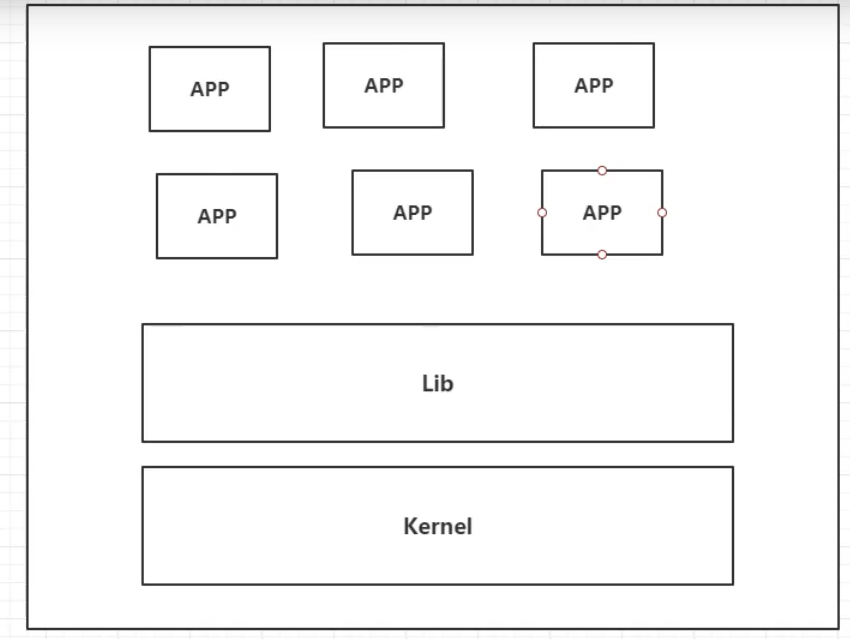

传统的虚拟化需要虚拟出一套的硬件，运行一个完整的操作系统，然后在这个系统上安装和运行软件，即传统方式是在硬件层面实现虚拟化，需要有额外的虚拟机管理应用和虚拟机操作系统层。

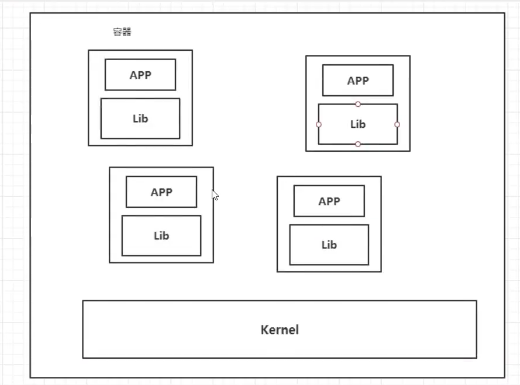

容器内的应用直接运行在宿主机的内核上，容器没有自己的内核，而且每个容器之间是隔离的，因此如果一个应用宕了，不会影响到其他的应用。Docker容器是在操作系统层面是实现虚拟化，直接复用本地主机的操作系统，因此更加轻量级。

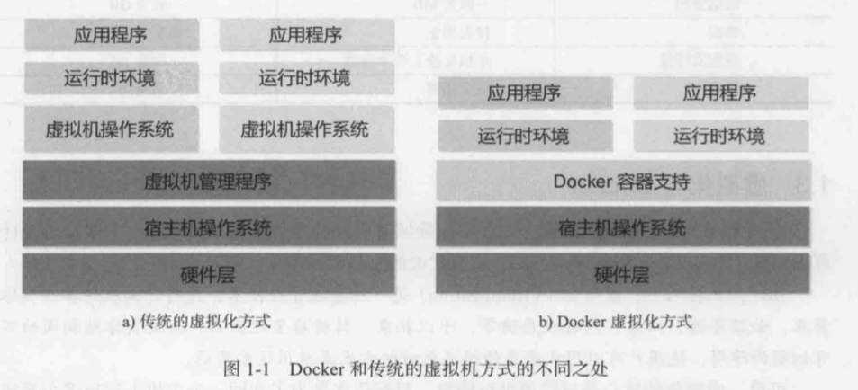


### Docker三大核心概念

**镜像（Image）：**镜像可以被理解为是一个面向docker引擎的只读模板，通过镜像可以创建多个容器

**容器（Container）：**服务/项目的运行是在容器中进行的，容器可以启动、停止、删除，容器可以被看成是一个简易版的Linux系统，而且容器是隔离的。镜像本身是只读的，容器从镜像中启动时，Docker会在镜像的最上层创建一个可写层，镜像本身将保持不变。

**仓库（Repository）：**Docker集中存放镜像文件的场所

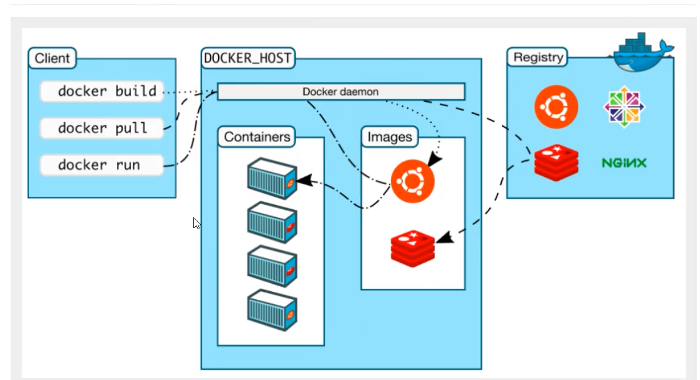


## Docker 安装

Docker需要安装在Centos 7及以上版本

### 安装步骤

```shell
# 1、卸载旧的环境
yum remove docker \
                  docker-client \
                  docker-client-latest \
                  docker-common \
                  docker-latest \
                  docker-latest-logrotate \
                  docker-logrotate \
                  docker-engine
# 2、下载需要的包
yum install -y yum-utils

# 3、 设置镜像仓库
yum-config-manager \
    --add-repo \
    https://download.docker.com/linux/centos/docker-ce.repo # 这里更改为阿里云的镜像地址更快

# 在安装docker之前建议先更新一下yum的软件包索引
yum makecache fast

# 4、安装docker
yum install docker-ce docker-ce-cli containerd.io   # 这里就是默认安装最新版的
# docker-ce是社区版，ee是企业版（收费）

# 5、启动docker
systemctl start docker

# 6、设置docker开机启动
systemctl enable docker 
```


### run流程

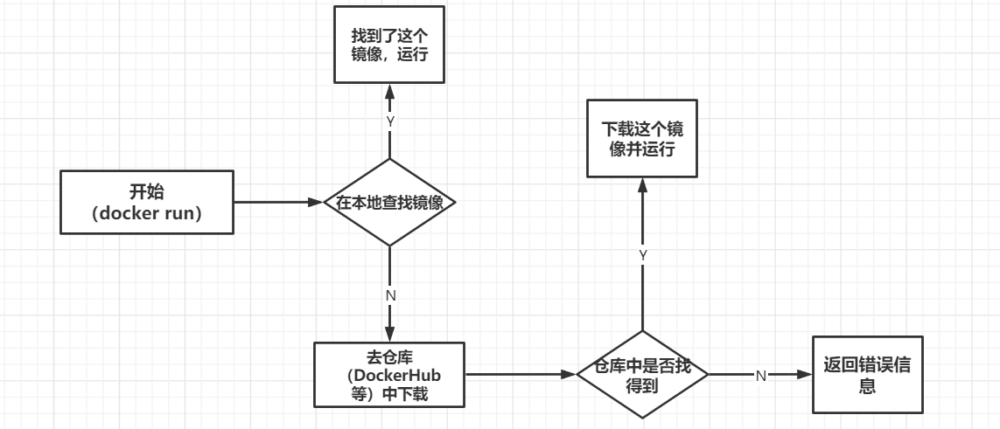


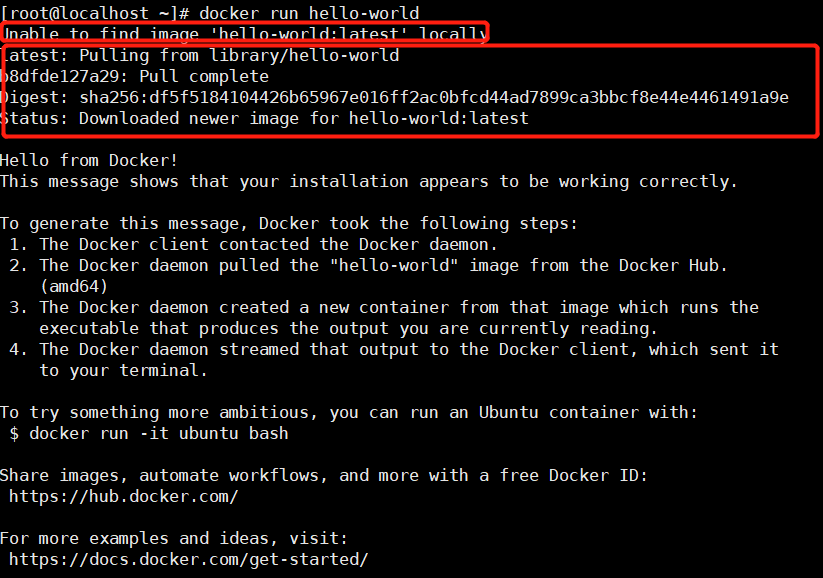


### Docker底层原理

**Docker是怎么工作的？**

Docker是Client-Server结构，docker-client就是Docker提供命令行界面工具，在上面发送命令和docker-server进行交互，docker-server中是通过守护进程（daemon）将这些请求翻译成系统调用完成容器管理操作。

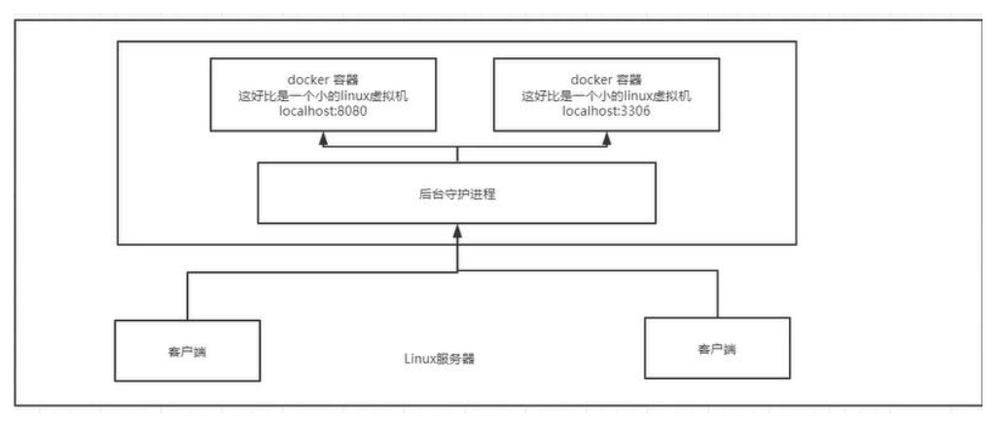


## 常用命令

```shell
docker version      # 显示docker的版本信息
docker info         # 显示docker的系统信息，包括镜像和容器的个数
```

### 镜像的基本命令

```shell
docker images   # 显示本机上有哪些镜像
docker images -q  # 仅显示镜像的编号id
docker search 镜像名   # 搜索镜像
docker pull 镜像名[:tag]     # 下载镜像，不指定tag，则使用latest

[root@localhost ~]# docker pull mysql
Using default tag: latest    # 不指定tag版本号，默认使用最新版latest
latest: Pulling from library/mysql
b4d181a07f80: Pull complete     # 分层下载，联合文件系统
a462b60610f5: Pull complete 
578fafb77ab8: Pull complete 
524046006037: Pull complete 
d0cbe54c8855: Pull complete 
aa18e05cc46d: Pull complete 
32ca814c833f: Pull complete 
9ecc8abdb7f5: Pull complete 
ad042b682e0f: Pull complete 
71d327c6bb78: Pull complete 
165d1d10a3fa: Pull complete 
2f40c47d0626: Pull complete 
Digest: sha256:52b8406e4c32b8cf0557f1b74517e14c5393aff5cf0384eff62d9e81f4985d4b
Status: Downloaded newer image for mysql:latest
docker.io/library/mysql:latest    # 镜像所在的真实地址
# docker pull mysql  等价于    docker pull docker.io/library/mysql:latest

docker rmi 镜像id/镜像名称:tag           # 删除镜像
docker rmi -f 镜像id 镜像id ...         # 删除多个镜像

[root@localhost ~]# docker rmi -f $(docker images -aq)
Untagged: mysql:5.7   # 强制删除全部镜像
Untagged: mysql@sha256:1a2f9cd257e75cc80e9118b303d1648366bc2049101449bf2c8d82b022ea86b7
Deleted: sha256:09361feeb4753ac9da80ead4d46e2b21247712c13c9ee3f1e5d55630c64c544f
Deleted: sha256:e454d1e47d2f346e0b2365c612cb6f12476ac4a3568ad5f62d96aa15bccf3e19
Deleted: sha256:e0457c6e331916c8ac6838ef4b22a6f62b21698facf4e143aa4b3863f08cf7d2
Deleted: sha256:ed73046ee2cd915c08ed37a545e1b89da70dc9bafeacfbd9fddff8f967373941
Deleted: sha256:419d7a76abf4ca51b81821da16a6c8ca6b59d02a0f95598a2605a1ed77c012eb
Deleted: sha256:9aecb80117a5517daf84c1743af298351a08e48fa04b8e99dcb63c817326a748
Deleted: sha256:d8773288899b1230986eba7486009df11d5dd6c628b1d4fd0443e873c6b00f70

```


### 容器的基本命令

**运行容器**

```shell
# 启动容器有两种方式，一种是基于镜像新建一个容器并启动，另一种是将在终止状态容器重启，这两种方式用到的命令都是
docker run   # 等价于docker create + docker start，使用docker create新建的容器处于停止状态

# docker run常用参数
--name="Name"  # 用来指定容器名字，区分容器
-d             # 通过后台方式运行
-it            # 使用交互方式运行，进入容器查看内容
-p             # 指定容器端口
   -p ip:主机端口:容器端口
   -p 主机端口:容器端口    
   -p ip地址::容器端口         # 将容器端口映射到主机地址的任意端口上
-P             # 随机指定端口   

[root@localhost ~]# docker images
REPOSITORY   TAG       IMAGE ID       CREATED        SIZE
centos       latest    300e315adb2f   7 months ago   209MB
[root@localhost ~]# docker run -it centos /bin/bash
[root@0390ec5b6a27 /]# ls
bin  dev  etc  home  lib  lib64  lost+found  media  mnt  opt  proc  root  run  sbin  srv  sys  tmp  usr  var
[root@0390ec5b6a27 /]# exit
exit
[root@localhost ~]# cd /
[root@localhost /]# ls
bin  boot  dev  etc  home  lib  lib64  media  mnt  opt  proc  root  run  sbin  srv  sys  tmp  usr  var
```

**列出所有正在运行的容器**

```shell
docker ps  
# 常用参数
docker ps -a   # 列出所有容器
docker ps -a -n=1 # 显示最新创建的一个容器
docker ps -aq     # 仅显示所有容器的编号id

[root@localhost /]# docker ps    # 显示当前正在运行的
CONTAINER ID   IMAGE     COMMAND   CREATED   STATUS    PORTS     NAMES
[root@localhost /]# docker ps -a   # 显示全部的容器
CONTAINER ID   IMAGE          COMMAND       CREATED         STATUS                          PORTS     NAMES
0390ec5b6a27   centos         "/bin/bash"   2 minutes ago   Exited (0) About a minute ago             exciting_austin
2a5e3a80b853   d1165f221234   "/hello"      39 hours ago    Exited (0) 39 hours ago                   sweet_cartwright
[root@localhost /]# docker ps -a -n=1
CONTAINER ID   IMAGE     COMMAND       CREATED         STATUS                     PORTS     NAMES
0390ec5b6a27   centos    "/bin/bash"   4 minutes ago   Exited (0) 4 minutes ago             exciting_austin
```

**退出容器**

```shell
exit  # 直接停止，退出容器
ctrl + P + Q  # 不停止 退出容器
```

**删除容器**

```shell
docker rm 容器id   # 删除指定的容器
docker rm -f $(docker ps -aq)  # 强制删除所有的容器
# 如果直接是docker rm ... 那么不能够删除正在运行的容器
```

**启动和停止容器**

```shell
docker start 容器id
docker stop 容器id
docker restart 容器id
docker kill 容器id
```

### 其他命令

**后台运行docker容器**

```shell
[root@localhost /]# docker run -d centos /bin/bash
e5f170bfdedd1e06a9e034f1dc2a73942057f26c67a5de768989055b63207f89
[root@localhost /]# docker ps 
CONTAINER ID   IMAGE     COMMAND   CREATED   STATUS    PORTS     NAMES

# 可以看出，通过后台启动容器之后，容器自己又关闭了，这是因为docker容器使用后台运行就必须要有一个前台进程，docker发现没有应用就会自动停止
# docker run -d centos /bin/sh -c "while true; do echo kuangshen; sleep 1; done"这样在启动的时候给她添加一段脚本，容器就运行了        （shell脚本的写法？？？）
```


**查看日志**

```shell
[root@localhost /]# docker logs --help

Usage:  docker logs [OPTIONS] CONTAINER

Fetch the logs of a container

Options:
      --details        Show extra details provided to logs
  -f, --follow         Follow log output
      --since string   Show logs since timestamp (e.g. 2013-01-02T13:23:37Z) or relative (e.g. 42m for 42 minutes)
  -n, --tail string    Number of lines to show from the end of the logs (default "all")
  -t, --timestamps     Show timestamps
      --until string   Show logs before a timestamp (e.g. 2013-01-02T13:23:37Z) or relative (e.g. 42m for 42 minutes)

[root@localhost /]# docker logs -tf --tail 5 10997f851a11
```

**查看容器中的进程信息**

```shell
[root@localhost /]# docker run -it centos /bin/bash
[root@4534a59a330f /]# [root@localhost /]# 
[root@localhost /]# docker ps
CONTAINER ID   IMAGE     COMMAND       CREATED          STATUS          PORTS     NAMES
4534a59a330f   centos    "/bin/bash"   19 seconds ago   Up 18 seconds             sleepy_chatterjee
[root@localhost /]# docker top 4534a59a330f
UID                 PID                 PPID                C                   STIME               TTY                 TIME                CMD
root                4548                4527                0                   11:12               pts/0               00:00:00            /bin/bash
```

<font color='red'>**查看镜像原数据**</font>

```shell
docker inspect 容器id
[root@localhost /]# docker inspect 4534a59a330f
[
    {
        "Id": "4534a59a330f5ac5a509cb873ecca719b12ec88886ed56f1f082dbf2a616563c",
        "Created": "2021-07-18T03:12:09.020702806Z",
        "Path": "/bin/bash",
        "Args": [],
        "State": {
            "Status": "running",
            "Running": true,
            "Paused": false,
            "Restarting": false,
            "OOMKilled": false,
            "Dead": false,
            "Pid": 4548,
            "ExitCode": 0,
            "Error": "",
            "StartedAt": "2021-07-18T03:12:09.975444298Z",
            "FinishedAt": "0001-01-01T00:00:00Z"
        },
        "Image": "sha256:300e315adb2f96afe5f0b2780b87f28ae95231fe3bdd1e16b9ba606307728f55",
        "ResolvConfPath": "/var/lib/docker/containers/4534a59a330f5ac5a509cb873ecca719b12ec88886ed56f1f082dbf2a616563c/resolv.conf",
        "HostnamePath": "/var/lib/docker/containers/4534a59a330f5ac5a509cb873ecca719b12ec88886ed56f1f082dbf2a616563c/hostname",
        "HostsPath": "/var/lib/docker/containers/4534a59a330f5ac5a509cb873ecca719b12ec88886ed56f1f082dbf2a616563c/hosts",
        "LogPath": "/var/lib/docker/containers/4534a59a330f5ac5a509cb873ecca719b12ec88886ed56f1f082dbf2a616563c/4534a59a330f5ac5a509cb873ecca719b12ec88886ed56f1f082dbf2a616563c-json.log",
        "Name": "/sleepy_chatterjee",
        "RestartCount": 0,
        "Driver": "overlay2",
    ...
```

**<font color ='red'>进入当前正在运行的容器</font>**

```shell
# 方式一（常用）
docker exec -it 容器id /bin/bash
# 方式二
docker attach 容器id
# 两者的区别：docker exec进入容器后开启一个新的终端，可以在里面进行操作，而docker attach进入的是容器正在执行的终端，不会启动新的进程，当多个窗口同时attach到同一个容器时，所有窗口都会同步显示，当某个窗口因为命令阻塞时，其他窗口也无法执行操作了。
```

**从容器内拷贝文件到主机**

```shell
docker cp 容器id:文件所在路径 主机地址

[root@localhost /]# docker attach 4534a59a330f
[root@4534a59a330f /]# cd /home
[root@4534a59a330f home]# ls
[root@4534a59a330f home]# touch test_cp.java
[root@4534a59a330f home]# ls
test_cp.java
[root@4534a59a330f home]# exit
exit
[root@localhost /]# docker cp 4534a59a330f:/home/test_cp.java /home
[root@localhost /]# cd /home
[root@localhost home]# ls
test_cp.java  xuyang
```

从容器外（主机上）拷贝到容器内一般用挂载，容器内和容器外的文件同步后面会使用数据卷来完成。


### 命令小结

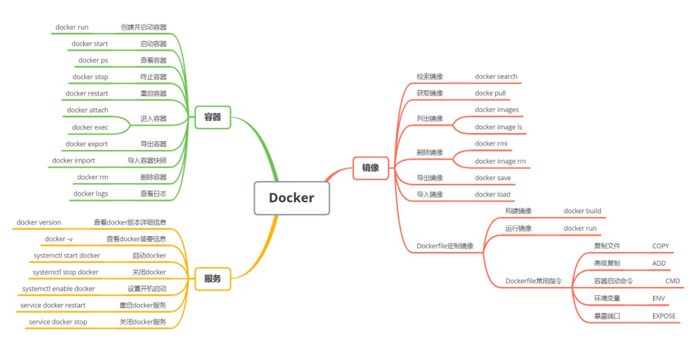


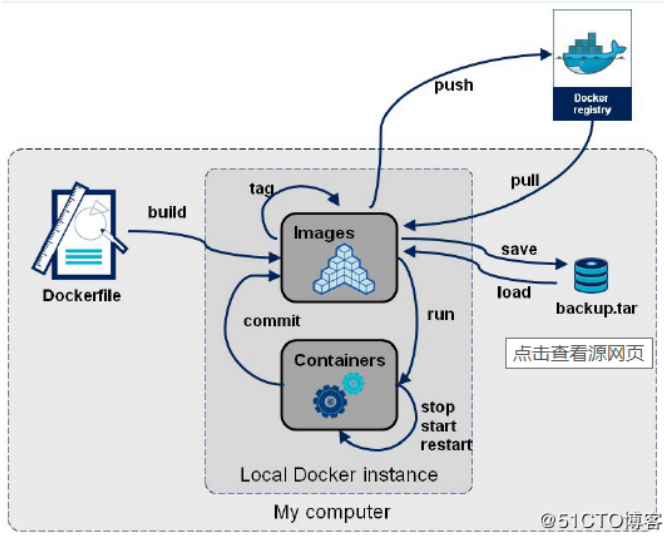


## 练习

### 部署Nginx

```shell
# 步骤1   查找镜像，dockerhub或者docker search nginx
# 步骤2   下载镜像, docker pull nginx:1.20/docker pull nginx（下载最新）
# 步骤3   启动镜像，创建容器  docker run -d --name nginx01 -p 3344:80 nginx:1.20
# 步骤4   测试安装， curl http://localhost:3344

[root@localhost home]# docker pull nginx:1.20
1.20: Pulling from library/nginx
b4d181a07f80: Pull complete 
e929f62bc938: Pull complete 
ca8370516c99: Pull complete 
6af693de7b22: Pull complete 
c8fe6ce83489: Pull complete 
7aa1fe8b4a84: Pull complete 
Digest: sha256:e5ee2e096c5fb15fc3e495d9096c1b1ce452d7dabb0e41e31820d8a631e96122
Status: Downloaded newer image for nginx:1.20
docker.io/library/nginx:1.20

[root@localhost home]# docker run -d --name nginx01 -p 3344:80 nginx:1.20
9f9672e58e0cc89b943de056e0ac53a2dd616d40bccb686442750e6469a0ef92

[root@localhost home]# curl http://localhost:3344
<!DOCTYPE html>
<html>
<head>
<title>Welcome to nginx!</title>
<style>
    body {
        width: 35em;
        margin: 0 auto;
        font-family: Tahoma, Verdana, Arial, sans-serif;
    }
</style>
</head>
<body>
<h1>Welcome to nginx!</h1>
<p>If you see this page, the nginx web server is successfully installed and
working. Further configuration is required.</p>

<p>For online documentation and support please refer to
<a href="http://nginx.org/">nginx.org</a>.<br/>
Commercial support is available at
<a href="http://nginx.com/">nginx.com</a>.</p>

<p><em>Thank you for using nginx.</em></p>
</body>
</html>
```

上面在创建容器时有参数`-p 3344:80`这里是通过外网的3344来映射容器内nginx服务的80端口

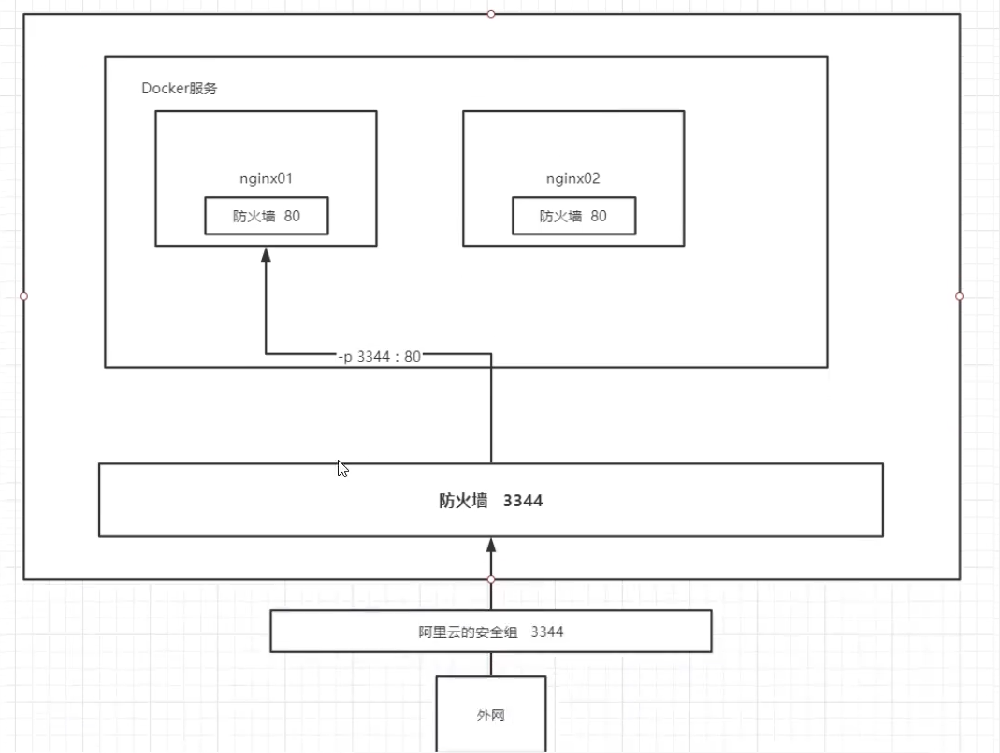


### 部署Tomcat

直接通过`docker run -d --name tomcat01 -p 3355:8080 tomcat`启动了这个容器，但是使用`http://192.168.145.132:3355/`访问却说是404错误，这表明已经配置成功，但是`webapps`路径下没有东西，解决方法如下：

```shell

[root@localhost home]# docker exec -it 6ac5f07964b1 /bin/bash
root@6ac5f07964b1:/usr/local/tomcat# ls
BUILDING.txt	 LICENSE  README.md	 RUNNING.txt  conf  logs	    temp     webapps.dist
CONTRIBUTING.md  NOTICE   RELEASE-NOTES  bin	      lib   native-jni-lib  webapps  work
root@6ac5f07964b1:/usr/local/tomcat# cd webapps
root@6ac5f07964b1:/usr/local/tomcat/webapps# ls
root@6ac5f07964b1:/usr/local/tomcat/webapps# cd ..
root@6ac5f07964b1:/usr/local/tomcat# cd webapps.dist/
root@6ac5f07964b1:/usr/local/tomcat/webapps.dist# ls
ROOT  docs  examples  host-manager  manager
root@6ac5f07964b1:/usr/local/tomcat# cp -r  webapps.dist/* webapps
```

#### 提交镜像

```shell
docker commit 容器

# 将操作过的容器通过commit提交为一个镜像！我们以后就使用我们修改过的镜像即可，这就是我们自己的一个修改的镜像。
docker commit -m="描述信息" -a="作者" 容器id 目标镜像名:[TAG]
docker commit -a="kuangshen" -m="add webapps app" 容器id tomcat02:1.0
```


## 镜像原理

镜像是一种轻量级、可执行的独立软件包，用来打包软件运行环境和基于运行环境开发的软件，它包含运行某个软件所需的所有内容，包括代码、库、环境变量、配置文件等运行时所需环境。

得到镜像的三种方式

- 从远程仓库下载`docker pull`
- 拷贝别人的
- 自己使用dockerfile制作一个镜像

### 联合文件系统 

UnionFS(联合文件系统): Union文件系统(UnionFS)是一种分层、轻量级并且高性能的文件系统，它支持对文件系统的修改作为一次提交来一层层的叠加，同时可以将不同目录挂载到同一个虚拟文件系统下(unite several directories into a single virtual filesystem)。Union文件系统是Docker镜像的基础。镜像可以通过分层来进行继承, 基于基础镜像(没有父镜像)， 可以制作各种具体的应用镜像。
特性: 一次同时加载多个文件系统，但从外面看起来，只能看到一个文件系统，联合加载会把各层文件系统叠加起来，这样最终的文件系统会包含所有底层的文件和目录。

### Docker镜像加载原理

docker的镜像实际上由一层一层的文件系统组成，这种层级的文件系统UnionFS。

**bootfs(boot file system)**主要包含bootloader和kernel，bootloader主要是引导加载kernel，Linux刚启动时会加载bootfs文件系统，在Docker镜像的最底层是bootfs。这一层与我们典型的Linux/Unix系统是一样的, 包含boot加载器和内核。当boot加载完成之后整个内核就都在内存中了，此时内存的使用权已由bootfs转交给内核，此时系统也会卸载bootfs。

rootfs(root file system), 在bootfs之上。包含的就是典型Linux系统中的/dev, /proc, /bin, /etc等标准目录和文件。rootfs就是各种不同的操作系统发行版，比如Ubuntu，Centos等等。

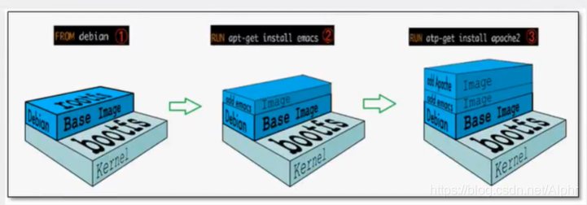

- bootfs(boot file system) 主要包含bootloader和kernel, bootloader 主要是引导加载kernel,当我们加载镜像的时候，会通过bootloader加载kernal，Docker镜像最底层是bootfs，当boot加载完成后整个kernal内核都在内存中了，bootfs也就可以卸载，值得注意的是，bootfs是被所有镜像共用的，许多镜像images都是在base image(rootfs)基础上叠加的

- rootfs (root file system)，在bootfs之 上.包含的就是典型Linux系统中的/dev, /proc, /bin, /etc等标准目录和文件。rootfs就是各种不同的操作系统发行版，比如Ubuntu, Centos等等 。

所有的docker镜像都起始于一个基础镜像，当进行修改或者增加新的内容时，就会在当前镜像层之上创建新的镜像层。

举一个简单的例子，假如基于 Ubuntu Linux16.04创建一个新的镜像，这就是新镜像的第一层；如果在 该镜像中添加 Python包， 就会在基础镜像层之上创建第二个镜像层；如果继续添加一个安全补丁，就会创健第三个镜像层该像当 前已经包含3个镜像层，如下图所示（这只是一个用于演示的很简单的例子）。

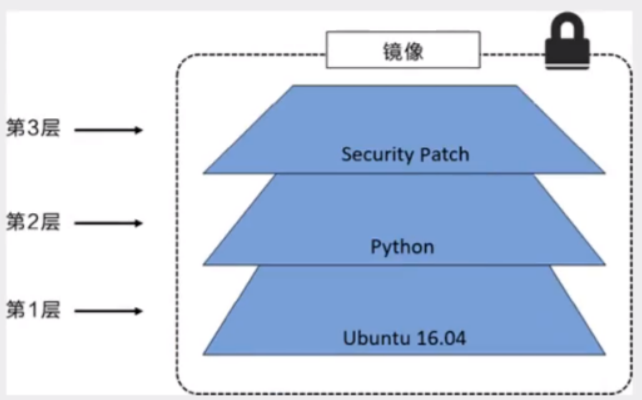

**在添加额外的镜像层的同时，镜像始终保持是当前所有镜像的组合，**理解这一点非常重要。下图中举了 一个简单的例子，每个镜像层包含3个文件，而镜像包含了来自两个镜像层的6个文件

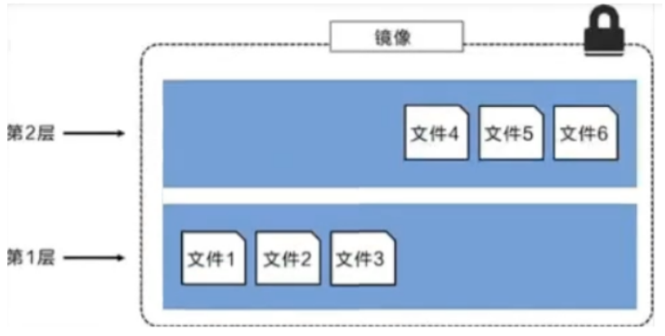

上图中的镜像层跟之前图中的略有区別，主要目的是便于展示文件 下图中展示了一个稍微复杂的三层镜像，在外部看来整个镜像只有6个文件，这是因为最上层中的文件7 是文件5的一个更新版

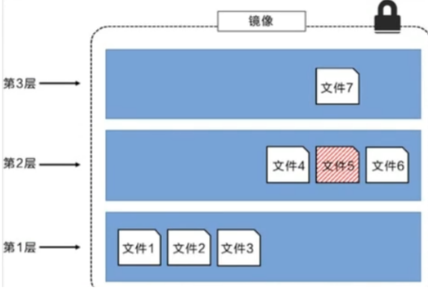

文种情況下，上层镜像层中的文件覆盖了底层镜像层中的文件。这样就使得文件的更新版本作为一个新 镜像层添加到镜像当中。 Docker通过存储引擎（新版本采用快照机制）的方式来实现镜像层堆栈，并保证多镜像层对外展示为统 一的文件系统。

<font color='red'>Docker镜像是只读的，当容器启动时，一个新的可写层加载到镜像的顶部，这一层就是我们常说的容器层，容器之下的都叫镜像层</font>


## 数据管理

当我们使用docker容器时，会产生一系列的数据文件，这些数据文件在我们关闭或者删除容器时会消失，如果这是一个mysql数据库的容器，删除之后里面的数据也会消失，这显然是很难接受的，因此用到了数据卷

特点：

1：数据卷可以在容器之间共享或重用数据

2：数据卷中的更改可以直接生效

3：数据卷中的更改不会包含在镜像的更新中

4：数据卷的生命周期一直持续到没有容器使用它为止

**数据卷的功能是实现容器的持久化和同步操作！在容器间进行数据共享！**


### 数据卷

#### 方式1：直接使用命令行挂载

**在容器内创建一个数据卷**

在使用docker run命令时，使用`-v`参数

```shell
-v, --volume list             Bind mount a volume

docker run -it -v 主机目录:容器内目录 -p 主机端口:容器内端口
```

挂载成功之后 修改容器内的内容无须进入容器内，只用在容器外进行修改即可。

即使删除了容器，挂载到本地的数据卷仍然不会消失，这就实现了数据的持久化。


**实战：mysql同步数据（指定路径挂载）**

```shell
# 拉取镜像之后运行   -e 环境配置
docker run -d -p 3310:3306 -v /home/mysql/conf:/etc/mysql/conf.d -v /home/mysql/data:/var/lib/mysql -e MYSQL_ROOT_PASSWORD=123456 --name mysql01 mysql:5.7

# 通过docker inspect mysql01进入容器可以看到
"Mounts": [
            {
                "Type": "bind",
                "Source": "/home/mysql/conf",
                "Destination": "/etc/mysql/conf.d",
                "Mode": "",
                "RW": true,
                "Propagation": "rprivate"
            },
            {
                "Type": "bind",
                "Source": "/home/mysql/data",
                "Destination": "/var/lib/mysql",
                "Mode": "",
                "RW": true,
                "Propagation": "rprivate"
            }
        ],
```

在navicat中建立连接之后创建一个数据库，在服务器本地可以查询到

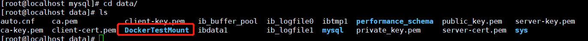


**具名挂载与匿名挂载（都不是指定路径挂载！）**

```shell
# 匿名挂载  
-v 容器内路径
[root@localhost _data]# docker run -d -P -v /etc/nginx --name nginx03 nginx:1.20
05d9ed767dac3feae71e11488282defd804dde7c1060c1792e4290ae96ee8ea6

# docker volume ls 列出全部的数据卷
[root@localhost _data]# docker volume ls
DRIVER    VOLUME NAME
local     2bb2312a9bb01d5f756fdc13dc07a0758c77ca764cb707c07d719979bbe634e7
local     a2b55a06dec4411c69ad023dbf0c849cb5a694b99f6ddc3b5a8267be0358ec5f
# 匿名挂载后产生的数据卷名称是随机生成的

# 通过docker volume inspect 数据卷名称  来查看这个数据卷的详细信息，包括所在位置等
[root@localhost _data]# docker volume inspect 2bb2312a9bb01d5f756fdc13dc07a0758c77ca764cb707c07d719979bbe634e7
[
    {
        "CreatedAt": "2021-07-20T14:06:54+08:00",
        "Driver": "local",
        "Labels": null,
        "Mountpoint": "/var/lib/docker/volumes/2bb2312a9bb01d5f756fdc13dc07a0758c77ca764cb707c07d719979bbe634e7/_data",
        "Name": "2bb2312a9bb01d5f756fdc13dc07a0758c77ca764cb707c07d719979bbe634e7",
        "Options": null,
        "Scope": "local"
    }
]
[root@localhost _data]# cd /var/lib/docker/volumes/2bb2312a9bb01d5f756fdc13dc07a0758c77ca764cb707c07d719979bbe634e7/_data
[root@localhost _data]# ls
conf.d  fastcgi_params  mime.types  modules  nginx.conf  scgi_params  uwsgi_params


# 具名挂载
-v 数据卷名称:容器内路径
[root@localhost _data]# docker run -d -P -v nginx-volume-jvming:/etc/nginx --name nginx04 nginx:1.20
b82fc3b6a1b55b2913c8c83efbbc681583a5a7210dc89971b8647a5b74afdaea
[root@localhost _data]# docker volume ls
# 如果指定了目录，docker volume ls 是查看不到的。
DRIVER    VOLUME NAME
local     2bb2312a9bb01d5f756fdc13dc07a0758c77ca764cb707c07d719979bbe634e7
local     a2b55a06dec4411c69ad023dbf0c849cb5a694b99f6ddc3b5a8267be0358ec5f
local     nginx-volume-jvming
[root@localhost _data]# docker volume inspect nginx-volume-jvming
[
    {
        "CreatedAt": "2021-07-20T14:11:31+08:00",
        "Driver": "local",
        "Labels": null,
        "Mountpoint": "/var/lib/docker/volumes/nginx-volume-jvming/_data",
        "Name": "nginx-volume-jvming",
        "Options": null,
        "Scope": "local"
    }
]
[root@localhost _data]# cd /var/lib/docker/volumes/nginx-volume-jvming/_data
[root@localhost _data]# ls
conf.d  fastcgi_params  mime.types  modules  nginx.conf  scgi_params  uwsgi_params
```

**扩展**

```shell
# 通过 -v 容器内路径： ro rw 改变读写权限
ro #readonly 只读
rw #readwrite 可读可写
docker run -d -P --name nginx05 -v juming:/etc/nginx:ro nginx
docker run -d -P --name nginx05 -v juming:/etc/nginx:rw nginx
# ro 只要看到ro就说明这个路径只能通过宿主机来操作，容器内部是无法操作！
```


#### 方式2：**使用Dockerfile进行挂载**

```shell
[root@localhost volume-test]# docker build -f dockerfile1 -t xuyang-centos:1.0 .  # 后面一定要有点！！
# 可以看出这是分层构建！！
Sending build context to Docker daemon  2.048kB
Step 1/4 : FROM centos
 ---> 300e315adb2f
Step 2/4 : VOLUME ["/home/volume-test","/volume01"]
 ---> Running in d1a7040ce782
Removing intermediate container d1a7040ce782
 ---> a049915b10d2
Step 3/4 : CMD echo "------end-----------"
 ---> Running in 0dc65309a18e
Removing intermediate container 0dc65309a18e
 ---> ad009cf9d583
Step 4/4 : CMD /bin/bash
 ---> Running in 3586f8715db5
Removing intermediate container 3586f8715db5
 ---> 4742ed7657e4
Successfully built 4742ed7657e4
Successfully tagged xuyang-centos:1.0
[root@localhost volume-test]# docker images
REPOSITORY      TAG       IMAGE ID       CREATED         SIZE
xuyang-centos   1.0       4742ed7657e4   8 seconds ago   209MB
mysql           5.7       9f1d21c1025a   9 hours ago     448MB
nginx           latest    4cdc5dd7eaad   13 days ago     133MB
tomcat          latest    36ef696ea43d   2 weeks ago     667MB
nginx           1.20      7ca45f2d188b   3 weeks ago     133MB
centos          latest    300e315adb2f   7 months ago    209MB

# 需要注意的是，在使用dockerfile构建镜像的过程中，VOLUME会用来指定挂在路径，这里的挂载只能是匿名挂载！！
```


### 数据卷容器（容器互联）

如果用户需要在**容器之间共享**一些持续更新的**数据**，最简单的方式是使用数据卷容器，数据卷容器其实就是一个普通的容器，专门用它提供数据卷供其他容器挂载使用。

#### [方式一 `--link`](#--link)


#### 方式二 `--volumes-from`（常用）

```shell
docker run -it --name mysql02 --volumes-from mysql01 mysql:5.7
# 通过上述命令使mysql02容器和mysql01连接，其实本质上是一种拷贝复制的关系，mysql02拷贝了mysql01中的东西，包括数据卷以及挂载路径等，比如在mysql01中设置了挂载路径，-v /home/mysql/conf:/etc/mysql/conf.d，那么mysql02中也会有这个路径。
# 此外，使用--volumes-from连接两容器之后的结果是双向联通，即无论是在那一个容器内进行操作，另一个容器也会进行相同的操作，相当于备份，这种操作同样也会体现在挂载的宿主机路径上
```

### 总结

数据卷的挂载总共有两种方法

- 直接使用命令行进行挂载`docker run -v ...`
- 使用Dockerfile，在构建镜像的时候进行挂载，这里只能是匿名挂载

容器之间进行数据共享需要使用数据卷容器，数据卷是容器与宿主机之间进行数据共享


## Dockerfile

### 基础

dockerfile中`#`表示注释

```shell
# DockerFile常用指令
FROM                   # 基础镜像，一切从这里开始构建
MAINTAINER             # 镜像是谁写的， 姓名+邮箱
RUN                    # 镜像构建的时候需要运行的命令
ADD 				   # 步骤，tomcat镜像，这个tomcat压缩包！添加内容 添加同目录
WORKDIR				   # 镜像的工作目录
VOLUME 				   # 挂载的目录
EXPOSE 				   # 保留端口配置
CMD 				   # 指定这个容器启动的时候要运行的命令，只有最后一个会生效，可被替代。
ENTRYPOINT 			   # 指定这个容器启动的时候要运行的命令，可以追加命令
ONBUILD 			   # 当构建一个被继承 DockerFile 这个时候就会运行ONBUILD的指令，触发指令。
COPY 				   # 类似ADD，将我们文件拷贝到镜像中
ENV 				   # 构建的时候设置环境变量!
```

自己构建centos

```shell
FROM centos

MAINTAINER xuyang<123@test.com>

ENV MYPATH /usr/local
WORKDIR $MYPATH

RUN yum -y install vim              # 在其中添加vim指令和网络工具包
RUN yum -y install net-tools        # 能够使用ifconfig了

EXPOSE 80

CMD echo $MYPATH
CMD echo "----end----" 

CMD /bin/bash
```

**通过`docker history 镜像id/镜像名称:tag`可以查看镜像的构建过程**

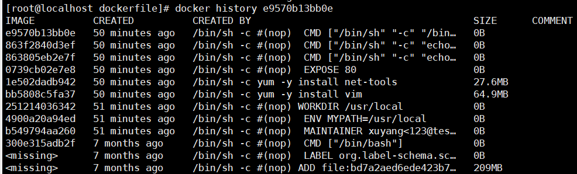

一般而言，Dockerfile分为四个部分：基础镜像信息、维护者信息、镜像操作指令和容器启动时执行指令。


**`CMD`和`ENTRYPOINT`的区别**

```shell
CMD # 指定这个容器启动的时候要运行的命令，只有最后一个会生效，可被替代。
ENTRYPOINT # 指定这个容器启动的时候要运行的命令，可以追加命令
```

- **测试`CMD`**

```shell
# 编写dockerfile文件
$ vim dockerfile-test-cmd
FROM centos
CMD ["ls","-a"]
# 构建镜像
$ docker build -f dockerfile-test-cmd -t cmd-test:0.1 .
# 运行镜像
$ docker run cmd-test:0.1   # 运行了命令 ls -a
.
..
.dockerenv
bin
dev
etc
home
lib
lib64
lost+found ...
# 想追加一个命令 -l 成为ls -al
$ docker run cmd-test:0.1 -l
docker: Error response from daemon: OCI runtime create failed:
container_linux.go:349: starting container process caused "exec: \"-l\":
executable file not found in $PATH": unknown.
ERRO[0000] error waiting for container: context canceled
# cmd的情况下 -l 替换了CMD["ls","-l"]。 -l 不是命令所以报错
```

- **测试`ENTRYPOINT`**

```shell
# 编写dockerfile文件
$ vim dockerfile-test-entrypoint
FROM centos
ENTRYPOINT ["ls","-a"]
$ docker run entrypoint-test:0.1     # 直接就运行了 ls -a 列出了文件目录
.
..
.dockerenv
bin
dev
etc
home
lib
lib64
lost+found ...
# 我们的命令，是直接拼接在我们得ENTRYPOINT命令后面的，变成了 ls -al
$ docker run entrypoint-test:0.1 -l
total 56
drwxr-xr-x 1 root root 4096 May 16 06:32 .
drwxr-xr-x 1 root root 4096 May 16 06:32 ..
-rwxr-xr-x 1 root root 0 May 16 06:32 .dockerenv
lrwxrwxrwx 1 root root 7 May 11 2019 bin -> usr/bin
drwxr-xr-x 5 root root 340 May 16 06:32 dev
drwxr-xr-x 1 root root 4096 May 16 06:32 etc
drwxr-xr-x 2 root root 4096 May 11 2019 home
lrwxrwxrwx 1 root root 7 May 11 2019 lib -> usr/lib
lrwxrwxrwx 1 root root 9 May 11 2019 lib64 -> usr/lib64 ....
```


### 实战：构建tomcat镜像

1、准备镜像文件，将tomcat和jdk上传至宿主机的某个目录中，这里我是通过xftp上传到了`/home/tomcat-diy/`路径下

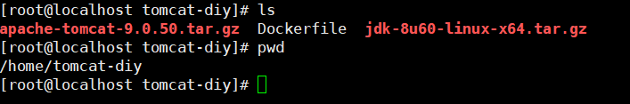


2、编写`Dockerfile`文件，注意这里的命名建议是`Dockerfile`，而不是其他的名字，因为如果使用`Dockerfile`名字，则在构建镜像时直接使用`docker build -t diy-tomcat:0.1`，不需要再使用`-f`来指定文件了

```shell
# dockerfile的内容

FROM centos

MAINTAINER xuyang<123@test.com>

# 解压文件到容器的/usr/local目录下
# 需要注意ADD可以直接完成解压工作，但是解压到的是生成的容器的路径，而不是宿主机的/usr/local路径
ADD apache-tomcat-9.0.50.tar.gz /usr/local
ADD jdk-8u60-linux-x64.tar.gz /usr/local  

RUN yum -y install vim

# 设置工作路径
ENV MYPATH /usr/local
WORKDIR $MYPATH

# 设置tomcat和jdk的环境变量。      :是分隔符
ENV JAVA_HOME /usr/local/jdk1.8.0_60
ENV CATALINA_HOME /usr/local/apache-tomcat-9.0.50
ENV PATH $PATH:$JAVA_HOME/bin:$CATALINA_HOME/lib

EXPOSE 80     # 暴露80端口

# 设置启动时默认的命令
CMD /usr/local/apache-tomcat-9.0.50/bin/startup.sh && tail -F /usr/local/apachetomcat-9.0.50/logs/catalina
```


3、构建镜像，使用`docker build -t diy-tomcat:0.1`即可

4、run 镜像

```shell
docker run -d -p 9000:8080 -v /usr/local/xuyang/tomcat/test:/usr/local/apache-tomcat-9.0.50/webapps/test -v /usr/local/xuyang/tomcat/logs:/usr/local/apache-tomcat-9.0.50/logs --name diytomcat diy-tomcat:0.1
```

5、测试访问

因为在本地做了卷挂载，所以只需要在宿主机的目录下`/usr/local/xuyang/tomcat/test`添加`web.xml`和`index.html`即可

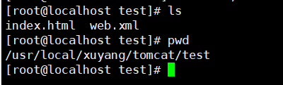


### 镜像上传

镜像的上传是上传到`dockerHub`或者阿里云的镜像仓库上，通过`docker push`命令


## Docker网络


### Docker0

安装Docker时，它会自动创建三个网络，bridge（创建容器默认连接到此网络）、 none 、host

| 网络模式  | 简介                                                         |
| --------- | ------------------------------------------------------------ |
| Bridge    | 此模式会为每一个容器分配、设置ip等，并将容器连接到docker0虚拟网桥，通过docker0网桥以及iptables nat表与宿主机通信 |
| Host      | 容器将不会虚拟出自己的网卡、配置自己的IP，而是使用宿主机的ip和端口等 |
| None      | 该模式关闭了容器的网络功能                                   |
| Container | 新创建的容器不会创建自己的网卡，配置自己的ip，而是和一个指定的容器共享ip，端口范围等 |

当安装docker时，会自动创建如下三个网络：
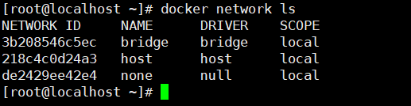

Docker内置这三个网络，运行容器时，可以使用–network标志来指定容器应连接到哪些网络。

bridge网络代表docker0所有Docker安装中存在的网络。除非你使用该docker run --network=选项指定，否则Docker守护程序默认将容器连接到此网络。

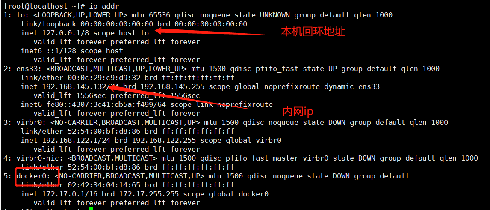


```shell
[root@localhost ~]# docker run -d -p 8080:8080 --name tomcat01 tomcat
8d61aed117e44c01d3d7209a14d3fa04b2d8e0ed6a4e3e86a7c0a8abc18974da
[root@localhost ~]# ip addr
1: lo: <LOOPBACK,UP,LOWER_UP> mtu 65536 qdisc noqueue state UNKNOWN group default qlen 1000
    link/loopback 00:00:00:00:00:00 brd 00:00:00:00:00:00
    inet 127.0.0.1/8 scope host lo
       valid_lft forever preferred_lft forever
    inet6 ::1/128 scope host 
       valid_lft forever preferred_lft forever
2: ens33: <BROADCAST,MULTICAST,UP,LOWER_UP> mtu 1500 qdisc pfifo_fast state UP group default qlen 1000
    link/ether 00:0c:29:c9:d9:32 brd ff:ff:ff:ff:ff:ff
    inet 192.168.145.132/24 brd 192.168.145.255 scope global noprefixroute dynamic ens33
       valid_lft 1307sec preferred_lft 1307sec
    inet6 fe80::4307:3c41:db5a:f499/64 scope link noprefixroute 
       valid_lft forever preferred_lft forever
3: virbr0: <NO-CARRIER,BROADCAST,MULTICAST,UP> mtu 1500 qdisc noqueue state DOWN group default qlen 1000
    link/ether 52:54:00:bf:d8:86 brd ff:ff:ff:ff:ff:ff
    inet 192.168.122.1/24 brd 192.168.122.255 scope global virbr0
       valid_lft forever preferred_lft forever
4: virbr0-nic: <BROADCAST,MULTICAST> mtu 1500 qdisc pfifo_fast master virbr0 state DOWN group default qlen 1000
    link/ether 52:54:00:bf:d8:86 brd ff:ff:ff:ff:ff:ff
5: docker0: <BROADCAST,MULTICAST,UP,LOWER_UP> mtu 1500 qdisc noqueue state UP group default 
    link/ether 02:42:34:04:14:65 brd ff:ff:ff:ff:ff:ff
    inet 172.17.0.1/16 brd 172.17.255.255 scope global docker0
       valid_lft forever preferred_lft forever
    inet6 fe80::42:34ff:fe04:1465/64 scope link 
       valid_lft forever preferred_lft forever
7: veth11385d1@if6: <BROADCAST,MULTICAST,UP,LOWER_UP> mtu 1500 qdisc noqueue master docker0 state UP group default 
    link/ether fe:6b:d7:bf:2e:83 brd ff:ff:ff:ff:ff:ff link-netnsid 0
    inet6 fe80::fc6b:d7ff:febf:2e83/64 scope link 
       valid_lft forever preferred_lft forever
```

当启动了一个tomcat容器之后，可以发现Docker给容器分配了一个`7: veth11385d1@if6`地址，linux可以ping同容器内部，使用`docker exec`进入容器后，容器也能够ping同外部，如果再启动一个容器，可以发现又会增加一对网卡。

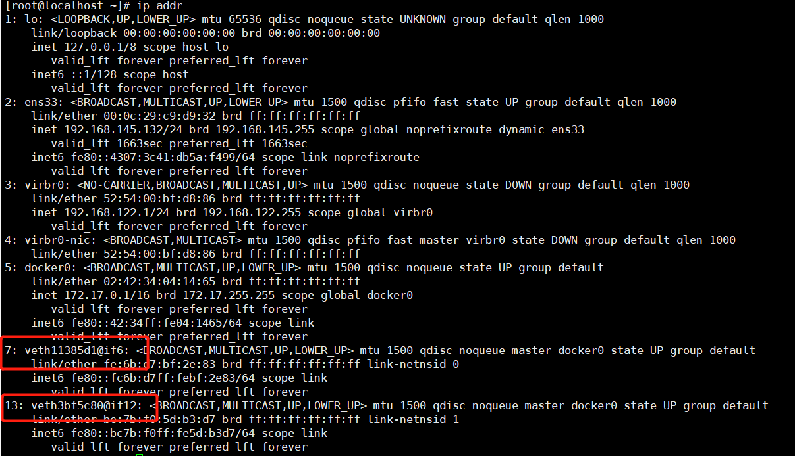

我们发现这个容器得到的网卡，都是一对一对的
veth-pair 就是一对的虚拟设备接口，他们都是成对出现的，一段连着协议，一段彼此相连
正因为有这个特性，veth-pair 充当一个桥梁，连接各种虚拟网络设备的
OpenStack，Docker容器之间的连接，OVS的连接，都是使用 veth-pair 技术

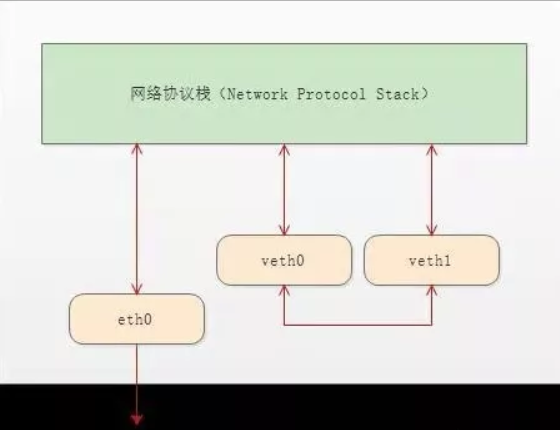

结论：通过默认方式（bridge）运行的容器共用一个路由器docker0，docker会给容器分配一个默认的可用ip

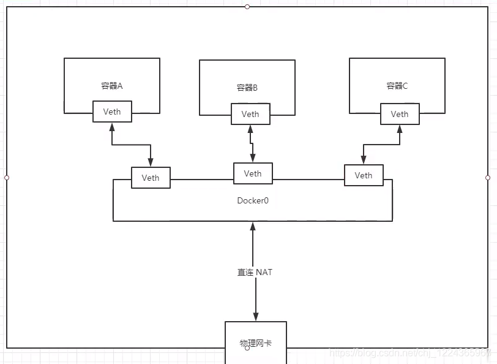

- Docker使用的是Linux的桥接，宿主机中是一个Dokcer容器的网桥docker0。
- Docker中的所有的网络接口都是虚拟的，虚拟的转发效率高。（比如内网传递文件）
- 只要容器删除，对应网桥一对就没了。 

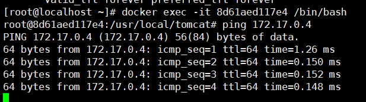

可以看到进入某个容器之后来ping另一个容器的ip地址是可行的，但是我们如果更换了ip地址之后，显然这种ping法是不可行的，我们是否可以使用容器名字来ping呢？  <font color='red'>`--link`</font>

#### --link

```shell
[root@localhost ~]# docker exec -it tomcat01 ping tomcat02
ping: tomcat02: Name or service not known
# 根据结果来看根据容器名字不能够ping通

[root@localhost ~]# docker run -it -P --name tomcat03 --link tomcat02 tomcat
# 使用--link连接两个容器之后，在使用名字ping发现可以ping通

[root@localhost ~]# docker exec -it tomcat03 ping tomcat02
PING tomcat02 (172.17.0.4) 56(84) bytes of data.
64 bytes from tomcat02 (172.17.0.4): icmp_seq=1 ttl=64 time=0.205 ms
64 bytes from tomcat02 (172.17.0.4): icmp_seq=2 ttl=64 time=0.153 ms
64 bytes from tomcat02 (172.17.0.4): icmp_seq=3 ttl=64 time=0.154 ms
64 bytes from tomcat02 (172.17.0.4): icmp_seq=4 ttl=64 time=0.150 ms
64 bytes from tomcat02 (172.17.0.4): icmp_seq=5 ttl=64 time=0.150 ms
```

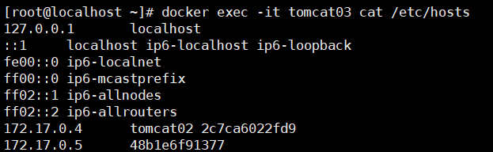

可以发现，使用`--link`就是修改tomcat03的hosts文件，在hosts配置中添加映射，但是现在已经不推荐使用这种方式来进行容器链接了（因为使用`--link`联通容器不是双向的，命令`docker run -it --name tomcat03 --link tomcat02 tomcat`会在tomcat03的hosts文件中添加映射，但是不会在tomcat02中添加tomcat03的映射），那么为了解决docker0不能够使用容器名来连接访问又出现了自定义网络。


### 自定义网络

创建自定义网络

```shell
# docker network create --help
[root@localhost ~]# docker network create --subnet 182.153.0.0/16 --gateway 182.153.0.1 -d bridge mynet02
033121fb8e850df3df64459e15ef65ddbb509411410dcb12afb1e78713644d7c
# 网关地址是0.1，不是0.0
[root@localhost ~]# docker network ls
NETWORK ID     NAME      DRIVER    SCOPE
3b208546c5ec   bridge    bridge    local
218c4c0d24a3   host      host      local
5d6344a4111d   mynet     bridge    local
033121fb8e85   mynet02   bridge    local
de2429ee42e4   none      null      local
[root@localhost ~]# docker inspect mynet02
[
    {
        "Name": "mynet02",
        "Id": "033121fb8e850df3df64459e15ef65ddbb509411410dcb12afb1e78713644d7c",
        "Created": "2021-07-25T13:41:49.211121481+08:00",
        "Scope": "local",
        "Driver": "bridge",
        "EnableIPv6": false,
        "IPAM": {
            "Driver": "default",
            "Options": {},
            "Config": [
                {
                    "Subnet": "182.153.0.0/16",
                    "Gateway": "182.153.0.1"
                }
            ]
        },
        "Internal": false,
        "Attachable": false,
        "Ingress": false,
        "ConfigFrom": {
            "Network": ""
        },
        "ConfigOnly": false,
        "Containers": {},
        "Options": {},
        "Labels": {}
    }
]

# 启动容器时指定网络
[root@localhost ~]# docker run -d -P --name tomcat-net-01 --net mynet02 tomcat
f318e63f119b7e0102149984d0b511db4bc392e78113f68bd9d6bf68789ca840
[root@localhost ~]# docker run -d -P --name tomcat-net-02 --net mynet02 tomcat
fa5f8238489d616ffbb75e96359eef58326a6320640df32f64f8be03ff7b1d1b
```

然后通过`docker inspect mynet02`命令查看mynet02的详细情况，发现：

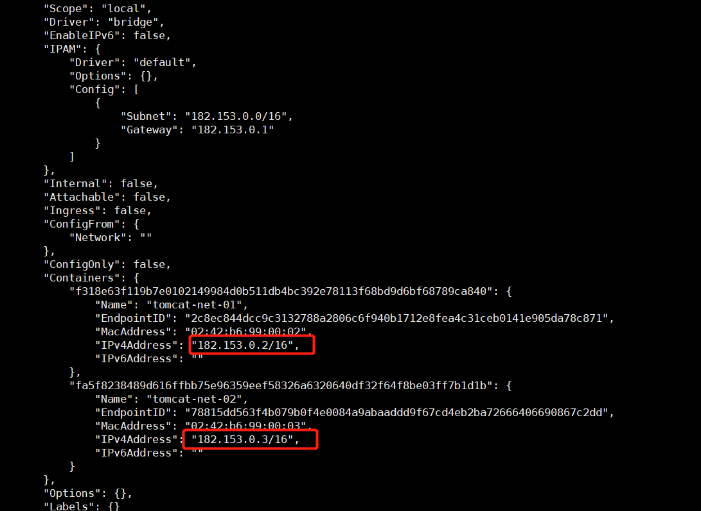

刚启动的两个容器均被加入到自定义的这个网络中了。此时直接使用名字便可以ping通

```shell
[root@localhost ~]# docker exec tomcat-net-01 ping tomcat-net-02
PING tomcat-net-02 (182.153.0.3) 56(84) bytes of data.
64 bytes from tomcat-net-02.mynet02 (182.153.0.3): icmp_seq=1 ttl=64 time=0.581 ms
64 bytes from tomcat-net-02.mynet02 (182.153.0.3): icmp_seq=2 ttl=64 time=0.153 ms
64 bytes from tomcat-net-02.mynet02 (182.153.0.3): icmp_seq=3 ttl=64 time=0.161 ms
64 bytes from tomcat-net-02.mynet02 (182.153.0.3): icmp_seq=4 ttl=64 time=0.148 ms

# 双向联通，优于--link
[root@localhost ~]# docker exec tomcat-net-02 ping tomcat-net-01
PING tomcat-net-01 (182.153.0.2) 56(84) bytes of data.
64 bytes from tomcat-net-01.mynet02 (182.153.0.2): icmp_seq=1 ttl=64 time=0.060 ms
64 bytes from tomcat-net-01.mynet02 (182.153.0.2): icmp_seq=2 ttl=64 time=0.156 ms
64 bytes from tomcat-net-01.mynet02 (182.153.0.2): icmp_seq=3 ttl=64 time=0.155 ms
```

**自定义网络的好处**：假设有两个集群，分别是redis集群和mysql集群，那么使用自定义网络能够让不同的集群使用不同的网络，保证集群是安全和健康的。

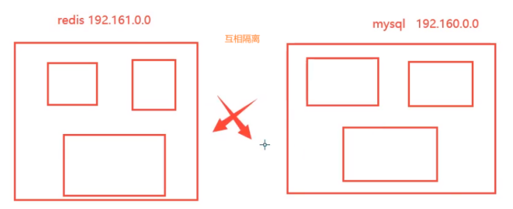


### 网络联通

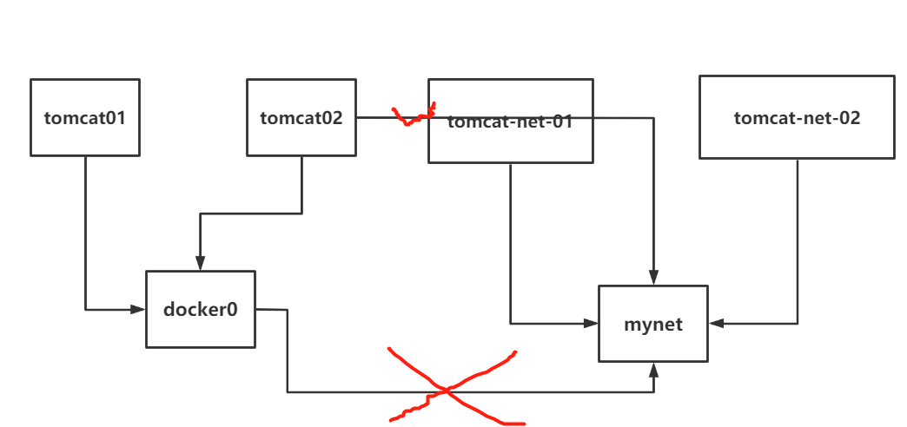

在两个不同网络下的容器怎么相互访问，很明显，如果直接通过容器名根本不可能ping通，因为两个容器可能根本不在同一个网段下。

而且网卡之间是不能够连通的，即docker0和自定义的网络不能够连通，所以需要使用`docker network connect`来连接容器和网卡

```shell
[root@localhost ~]# docker network --help

Usage:  docker network COMMAND

Manage networks

Commands:
  connect     Connect a container to a network
  create      Create a network
  disconnect  Disconnect a container from a network
  inspect     Display detailed information on one or more networks
  ls          List networks
  prune       Remove all unused networks
  rm          Remove one or more networks
  
[root@localhost ~]# docker network connect --help

Usage:  docker network connect [OPTIONS] NETWORK CONTAINER

Connect a container to a network

Options:
      --alias strings           Add network-scoped alias for the container
      --driver-opt strings      driver options for the network
      --ip string               IPv4 address (e.g., 172.30.100.104)
      --ip6 string              IPv6 address (e.g., 2001:db8::33)
      --link list               Add link to another container
      --link-local-ip strings   Add a link-local address for the container
```

使用`connect`连接容器和网络

```shell
[root@localhost ~]# docker run -d -P --name tomcat01 tomcat
5316ba2707f6d33f4f75d83fd6801fd7ca662a51bb5e436c96992a26a536488d
[root@localhost ~]# docker run -d -P --name tomcat02 tomcat
7cb8a016db3963bfc1336d29e2d698b0eda2d60c66b371897e38610b9d9e8411
[root@localhost ~]# docker ps
CONTAINER ID   IMAGE     COMMAND             CREATED          STATUS          PORTS                                         NAMES
7cb8a016db39   tomcat    "catalina.sh run"   7 seconds ago    Up 3 seconds    0.0.0.0:49159->8080/tcp, :::49159->8080/tcp   tomcat02
5316ba2707f6   tomcat    "catalina.sh run"   20 seconds ago   Up 13 seconds   0.0.0.0:49158->8080/tcp, :::49158->8080/tcp   tomcat01
fa5f8238489d   tomcat    "catalina.sh run"   30 minutes ago   Up 30 minutes   0.0.0.0:49157->8080/tcp, :::49157->8080/tcp   tomcat-net-02
f318e63f119b   tomcat    "catalina.sh run"   30 minutes ago   Up 30 minutes   0.0.0.0:49156->8080/tcp, :::49156->8080/tcp   tomcat-net-01
[root@localhost ~]# docker network connect mynet02 tomcat01
[root@localhost ~]# docker inspect mynet02
```

查看mynet02，看到tomcat01容器被加入到了mynet02网络下，因此，tomcat01能够和tomcat-net-01以及tomcat-net-02相互ping通

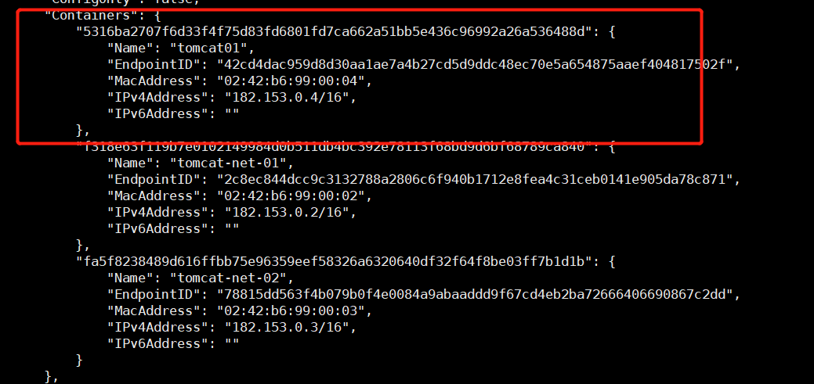

```shell
[root@localhost ~]# docker exec tomcat01 ping tomcat-net-01
PING tomcat-net-01 (182.153.0.2) 56(84) bytes of data.
64 bytes from tomcat-net-01.mynet02 (182.153.0.2): icmp_seq=1 ttl=64 time=0.117 ms
64 bytes from tomcat-net-01.mynet02 (182.153.0.2): icmp_seq=2 ttl=64 time=0.158 ms
64 bytes from tomcat-net-01.mynet02 (182.153.0.2): icmp_seq=3 ttl=64 time=0.152 ms
^C
[root@localhost ~]# docker exec tomcat01 ping tomcat-net-02
PING tomcat-net-02 (182.153.0.3) 56(84) bytes of data.
64 bytes from tomcat-net-02.mynet02 (182.153.0.3): icmp_seq=1 ttl=64 time=0.069 ms
64 bytes from tomcat-net-02.mynet02 (182.153.0.3): icmp_seq=2 ttl=64 time=0.155 ms
64 bytes from tomcat-net-02.mynet02 (182.153.0.3): icmp_seq=3 ttl=64 time=0.151 ms
^C
[root@localhost ~]# docker exec tomcat-net-02 ping tomcat01
PING tomcat01 (182.153.0.4) 56(84) bytes of data.
64 bytes from tomcat01.mynet02 (182.153.0.4): icmp_seq=1 ttl=64 time=0.053 ms
64 bytes from tomcat01.mynet02 (182.153.0.4): icmp_seq=2 ttl=64 time=0.157 ms
^C
[root@localhost ~]# docker exec tomcat02 ping tomcat-net-02
ping: tomcat-net-02: Name or service not known
```


## Redis集群部署

```bash
# 三主三从
# 1、先构建一个redis的网络
[root@localhost ~]# docker network create redis --subnet 172.168.0.0/16
b45e087e6dbe5d31a2766a590700ce37196797a0adf64355fdf94ce0600cbfa0

# 2、编写一个脚本用来构建6个redis服务器的配置
#!/bin/bash
for port in $(seq 1 6) 
do
mkdir -p redis/node-${port}/conf
touch redis/node-${port}/conf/redis.conf
cat << EOF >> redis/node-${port}/conf/redis.conf  # 注意：EOF这里不要有缩进
port 6379
bind 0.0.0.0
cluster-enabled yes
cluster-config-file nodes.conf
cluster-node-timeout 5000
cluster-announce-ip 172.38.0.1${port}
cluster-announce-port 6379
cluster-announce-bus-port 16379
appendonly yes
EOF
done


# 3、通过脚本启动redis服务器，不需要一个个的启动
#!/bin/bash
for port in $(seq 1 6)
do
docker run -d -p 637${port}:6379 -p 1637${port}:16379 --name redis-${port} -v /usr/local/xuyang/redis-cluster-docker/redis/node-${port}/conf/redis.conf:/etc/redis-cluster/redis.conf --net redis redis /etc/redis-cluster/redis.conf
done
# 在这里挂载的时候要写绝对路径 
```

通过脚本启动成功之后会有如下图所示的结果

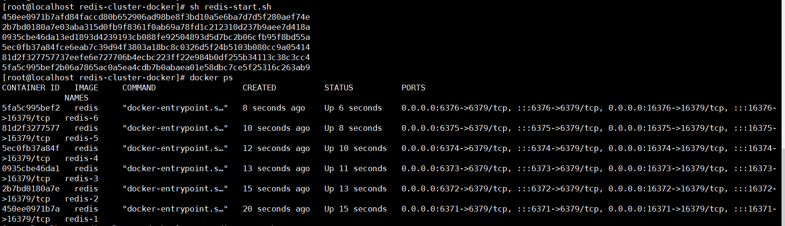


```bash
# 4、通过docker exec -it xx /bin/bash进入某个容器中，使用redis-cli启动集群
[root@localhost redis-cluster-docker]# docker exec -it redis-1 /bin/bash

# 通过docker inspect reids-1进入redis1中查看ip地址，其实在启动redis服务器的时候可以指定ip地址，在指定的net网络下指定，不要和指定的net冲突

# 4、通过redis-cli --create创建集群
root@7f0a6a6449d3:/data# redis-cli --cluster create 172.168.0.2:6379 172.168.0.3:6379 172.168.0.4:6379 172.168.0.5:6379 172.168.0.6:6379 172.168.0.7:6379 --cluster-replicas 1
```


## 服务打包成Docker镜像

```shell
# 1、构建一个能够运行的springboot项目
# 2、mvn package 打包项目
# 3、编写Dockerfile
FROM java:8

COPY *.jar /app.jar

CMD ["--server.port = 8080"]

EXPOSE 8080

ENTRYPOINT ["java","-jar","app.jar"]
# 4、构建镜像  docker build -t springboot01:0.1 .
# 5、发布运行，以后交付给别人的就是springboot01:0.1这个镜像了
# 运行镜像只需要使用 docker run -it -p 8081:8080 --name springboot-web-docker springboot01:0.1
```

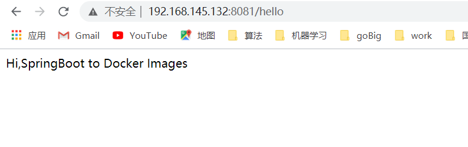

# Docker 进阶


## Docker 应用栈的搭建

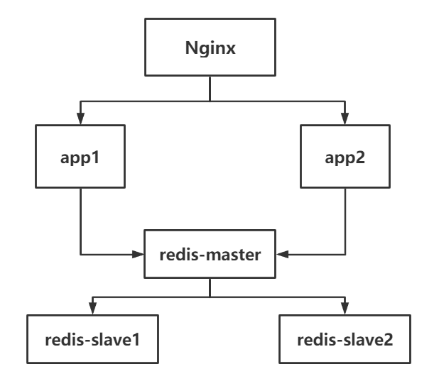

- 首先使用`docker pull`命令将`nginx,redis`镜像下载到本地

- 在这里我将使用`springboot`快速地搭建一个访问`redis`数据库的一个应用程序

  - 第一点，在项目的`pom.xml`中引入相应的文件

    ```xml
            <!-- https://mvnrepository.com/artifact/com.alibaba/fastjson -->
            <dependency>
                <groupId>com.alibaba</groupId>
                <artifactId>fastjson</artifactId>
                <version>1.2.76</version>
            </dependency>
    
            <dependency>
                <groupId>org.springframework.boot</groupId>
                <artifactId>spring-boot-starter-data-redis</artifactId>
            </dependency>
    ```

    

  - 第二点，在配置文件中编写相应的数据库连接

    ```properties
    spring.redis.database=0
    spring.redis.host=172.17.0.3   # 这里其实是redis镜像run起来之后，容器的ip地址
    spring.redis.port=6379
    spring.redis.jedis.pool.max-active=100
    spring.redis.jedis.pool.max-wait=10000
    spring.redis.jedis.pool.max-idle=10
    spring.redis.timeout=5000
    ```

    注意：`spring.redis.host=172.17.0.3` 这么写其实非常不好，因为如果服务器重启或者宕机之后，重启`redis`容器的话这个容器的ip地址可能发生变化，这也就导致了不能够连接上redis，因此，可以使用名字来进行连接，后面介绍

    

  - 第三点，在springboot程序中整合redis

    ```java
    @Configuration
    @ConditionalOnClass(RedisOperations.class)
    @EnableConfigurationProperties(RedisProperties.class)
    public class RedisConfig {
        @Bean
        @ConditionalOnMissingBean(name = "redisTemplate")
        public RedisTemplate<Object, Object> redisTemplate(
                RedisConnectionFactory redisConnectionFactory) {
            RedisTemplate<Object, Object> template = new RedisTemplate<>();
            //使用fastjson序列化
            FastJsonRedisSerializer fastJsonRedisSerializer = new FastJsonRedisSerializer(Object.class);
            // value值的序列化采用fastJsonRedisSerializer
            template.setValueSerializer(fastJsonRedisSerializer);
            template.setHashValueSerializer(fastJsonRedisSerializer);
            // key的序列化采用StringRedisSerializer
            template.setKeySerializer(new StringRedisSerializer());
            template.setHashKeySerializer(new StringRedisSerializer());
            template.setConnectionFactory(redisConnectionFactory);
            return template;
        }
    
        @Bean
        @ConditionalOnMissingBean(StringRedisTemplate.class)
        public StringRedisTemplate stringRedisTemplate(
                RedisConnectionFactory redisConnectionFactory) {
            StringRedisTemplate template = new StringRedisTemplate();
            template.setConnectionFactory(redisConnectionFactory);
            return template;
        }
    }
    ```

    

  - 第四点，编写`controller`类，配置访问路径

    ```java
    @RestController
    @RequestMapping("/helloworld")
    public class Hello {
        @Autowired
        private RedisUtil redisUtil;
    
        @GetMapping("redis")
        public Object getRedis(){
            redisUtil.set("r","hello-docker,springboot,redis");
            return redisUtil.get("r");
        }
    }
    ```


- 当构建起这个程序之后，使用`Maven`工具将项目打包，同时编写Dockerfile文件

  ```bash
  FROM java:8
  
  MAINTAINER yangx
  
  ADD *.jar app.jar    # 将dockerfile所在路径下的jar包拷贝到镜像中
  
  CMD ["--server.port=8080"]
  
  EXPOSE 8080
  
  ENTRYPOINT ["java","-jar","app.jar"]   # 当启动容器的时候，执行命令java -jar app.jar
  ```

- 将`springboot`程序打包出来的`jar`包和Dockerfile文件都上传到Linux服务器中，我这里创建了`/project/source`这个路径，在该路径下执行docker命令，`docker build -t springboot-redis-docker:1.0 .`执行完这个命令之后就会生成一个镜像文件，名字为`springboot-redis-docker`，版本号是1.0，可以通过`docker images`查看

- 然后分别启动redis，springboot，nginx，因为这里涉及到了redis的主机和从机，同时springboot会访问redis数据库，因此，redis-master要最先打开，redis-slave其次，springboot次之，最终开启nginx并进行负载均衡配置

- 使用`docker run`命令按顺序开启上述容器

  ```bash
  docker run -it --name redis-master-6379 -p 6379:6379 -v /project/redis/master/conf:/etc/redis   -v /project/redis/master/conf:/data redis /bin/bash
  
  docker run -it --name redis-slave-6380 -p 6380:6379 -v /project/redis/slave-6380/conf:/etc/redis   -v /project/redis/slave-6380/conf:/data redis /bin/bash
  
  docker run -it --name redis-slave-6381 -p 6381:6379 -v /project/redis/slave-6381/conf:/etc/redis   -v /project/redis/slave-6381/conf:/data redis /bin/bash
  
  docker run -d --name app1 -p 8081:8080 springboot-redis-docker:1.0 
  docker run -d --name app2 -p 8082:8080 springboot-redis-docker:1.0
  
  # 在运行nginx容器之前，我首先开启了一个nginx容器，目的是复制出它里面的配置文件、日志文件等
  docker cp ddc48ecf7875:/etc/nginx /project/nginx/conf # 将nginx容器的配置文件复制到宿主机的路径下
  docker cp ddc48ecf7875:/var/log/nginx /project/nginx/log # 将nginx容器中的日志文件复制到宿主机路径下
  
  # 修改nginx.conf
  user  nginx;
  worker_processes  auto;
  
  error_log  /var/log/nginx/error.log notice;
  pid        /var/run/nginx.pid;
  
  
  events {
      worker_connections  1024;
  }
  
  
  http {
      include       /etc/nginx/mime.types;
      default_type  application/octet-stream;
  
      upstream myapp-server {
  	server 192.168.145.133:8081;   # 负载均衡的配置，但是这里不知道怎么再在端口号后面加上/helloworld/redis
  	server 192.168.145.133:8082;
      }
  
      server {
  
  	location ~ /helloworld/redis/ {
  	   proxy_pass http://myapp-server;
  	}	
  
      }
      log_format  main  '$remote_addr - $remote_user [$time_local] "$request" '
                        '$status $body_bytes_sent "$http_referer" '
                        '"$http_user_agent" "$http_x_forwarded_for"';
  
      access_log  /var/log/nginx/access.log  main;
  
      sendfile        on;
      #tcp_nopush     on;
  
      keepalive_timeout  65;
  
      #gzip  on;
  
      include /etc/nginx/conf.d/*.conf;
  }
  
  docker run -d --name nginx-proxy -p 81:80 -v /project/nginx/conf:/etc/nginx -v /project/nginx/log: /var/log/nginx nginx  # nginx一定要以-d后台的方式打开，否则容器启动不起来
  ```

  

- 经过上述过程之后，在服务器中访问`192.168.145.133:81`就能够看到404的界面，这不是别的问题，就是因为在负载均衡那里无法不全整个地址，目前还没有找到办法！

在整个过程中，遇到错误时，可以使用`docker logs 容器id`查看错误原因


