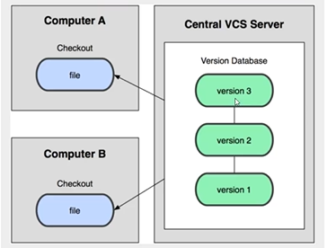
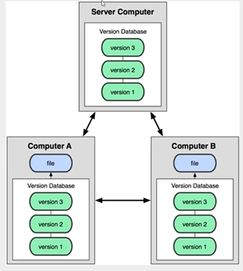
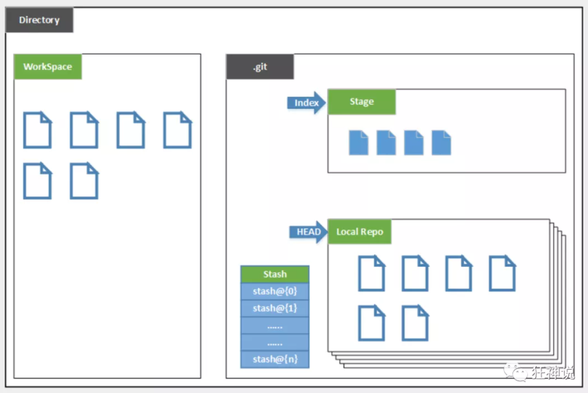
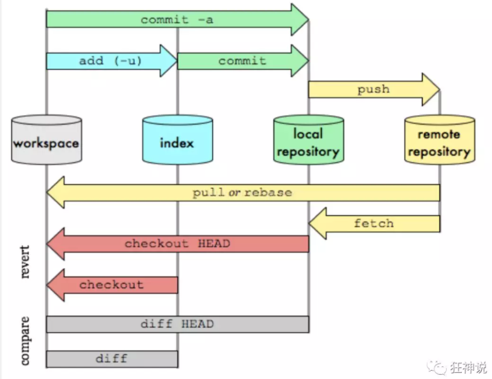
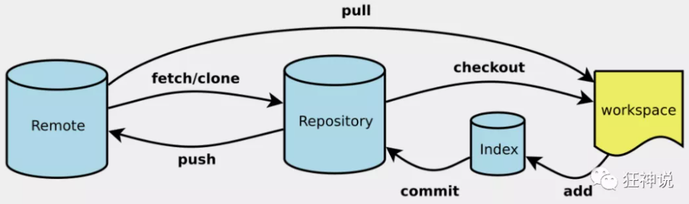
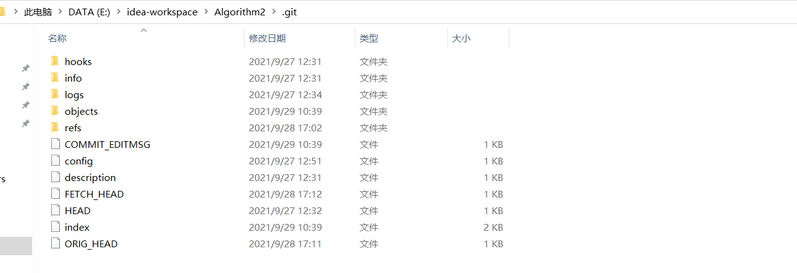
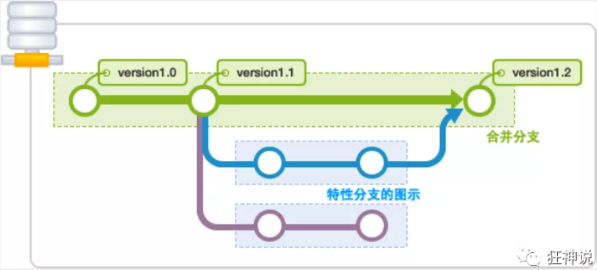

> **<font color='green' size='4pt'>Git和SVN的区别</font>**

SVN是集中式版本控制系统，版本库是集中放在中央服务器上的，而在工作的时候，用的都是自己的电脑，所以首先要从中央服务器得到最新的版本，然后工作，工作完成之后，需要把自己做完的活推送到中央服务器，集中式版本控制系统必须联网才能工作，对网络带宽的要求较高，一旦服务器发生损坏，有可能导致代码都没了



Git是分布式版本控制系统，没有中央服务器，每个人的电脑就是一个完整的版本库，工作的时候不需要联网，因为版本都在自己的电脑上，协同你的方法就是这样：比如在自己电脑上改了文件A，其他人电脑上也改了文件A，这时，你们两个只需要把各自的修改推送给对方就可以互相看到对方的修改了，Git可以直接看到更新了哪些代码和文件！



### Git的基本理论

Git本地有三个工作区域：工作目录（Working Directory）、暂存区（Stage/Index）、资源库（Repository或Git Directory）。如果再加上远程的git仓库（Remote Directory）就变成了四个工作区域了，文件在这四个区域中的转换关系如下


- Workspace：工作区，就是平时存放代码的地方，比如`E:\idea-workspace\Algorithm2\...`
- `Index/Stage`：暂存区，用于临时存放你的改动，事实上她只是一个文件，保存即将提交到文件列表信息
- Repository：仓库区（或者本地仓库），就是安全存放数据的位置，这里面有你提交到所有版本的数据，其中HEAD指向的是最新放入仓库的版本
- Remote：远程仓库，托管代码的服务器，可以简单的认为是你项目组中的一台电脑用于远程数据交换

本地的三个工作区域确切地说应该是git仓库中HEAD指向的版本



- Directory：使用Git管理的一个目录，也就是一个仓库，包含我们的工作空间和Git的管理空间。
- WorkSpace：需要通过Git进行版本控制的目录和文件，这些目录和文件组成了工作空间。
- .git：存放Git管理信息的目录，初始化仓库的时候自动创建（隐藏目录）
- Index/Stage：暂存区，或者叫待提交更新区，在提交进入repo之前，我们可以把所有的更新放在暂存区。
- Local Repo：本地仓库，一个存放在本地的版本库；HEAD会只是当前的开发分支（branch）。
- Stash：隐藏，是一个工作状态保存栈，用于保存/恢复WorkSpace中的临时状态。


### Git工作流程

1. 在工作目录中添加、修改文件
2. 将需要进行版本管理的文件放入暂存区域
3. 将暂存区域中的文件提交到git仓库

因此，git管理的文件有三种状态：已修改（modified）、已暂存（staged）、已提交（committed）




### Git项目搭建

> **<font color='green' size='4pt'>创建工作目录与常用指令</font>**

工作目录一般是希望Git帮助你管理的文件夹，可以是项目的路径，也可以是一个空目录，建议不要有中文




> **<font color='green' size='4pt'>本地仓库搭建</font>**

创建本地仓库的方法有两种，一种是创建全新的仓库，另一种就是克隆远程仓库

1. **创建全新的仓库**，需要用Git管理的项目的根目录执行

   ```shell
   # 在当前目录下新建一个Git代码库
   git init
   # 执行这个命令之后，仅仅在项目的目录中多出了一个.git文件，关于版本的所有信息都在这个目录中了
   ```

   

2. 克隆远程仓库，将远程服务器上的仓库完全镜像到本地一份

   ```shell
   # 克隆一个项目和它的整个代码历史
   git clone [url]
   ```

   当克隆下这个项目之后，直接把它的.git目录给复制到自己的项目路径下，应该就能够直接上传到GitHub或者gitee上了


### Git文件操作

> **<font color='green' size='4pt'>文件的四种状态</font>**

版本控制就是对文件的版本控制，要对文件进行修改、提交等操作，首先要知道文件当前在什么状态，不然可能会提交了现在还不想提交的文件，或者要提交的文件没有提交上

- `Untracked`：未跟踪，此文件在文件夹中，并没有加入到git库，不参与版本控制，通过`git add`命令变成`Staged`状态
- `Unmodify`：文件已入库，未修改，即版本库中的文件快照内容和文件夹中完全一致，这种类型的文件有两种去处，如果他被修改，则会变成`Modified`，如果使用`git rm`移除版本库，则成为`Untracked`状态
- `Modified`：文件已修改，仅仅是修改，并没有进行其他的操作，这个文件也有两种去处，通过`git add`可以进入`Staged`状态，使用`git checkout`则丢弃修改过，返回到`unmodify`状态，这个`git checkout`即从库中取出文件，覆盖当前修改
- `Staged`：暂存状态，执行`git commit`则将修改同步到库中，这时库中的文件和本地文件又变为一致，文件为`Unmodify`状态，执行`git reset HEAD filename`取消暂存，文件状态为`Modified`


> **<font color='green' size='4pt'>查看文件状态</font>**

```shell
#查看指定文件状态
git status [filename]

#查看所有文件状态
git status

# git add .                  添加所有文件到暂存区
# git commit -m "消息内容"    提交暂存区中的内容到本地仓库 -m 提交信息
```


> **<font color='green' size='4pt'>忽略文件</font>**

有些时候，我们不想把某些文件纳入到版本控制中，比如数据库文件，临时文件，设计文件等，在主目录下建立`.gitignore`文件，此文件有如下规则：

- `#`表示注释，忽略文件中的空行或者以`#`开始的行会被忽略
- 可以使用`Linux`通配符，例如：`*`代表任意多的字符，问号`?`代表一个字符，方括号`[abc]`代表可选字符范围，大括号`{string1,string2,...}`代表可选字符串等
- 如果名称前面有一个`！`则表示这是一个例外规则，将不会被忽略
- 如果名称的最前面是一个路径分隔符（/），表示要忽略的文件在此目录下，而子目录中的文件不忽略。
- 如果名称的最后面是一个路径分隔符（/），表示要忽略的是此目录下该名称的子目录，而非文件（默认文件或目录都忽略）

```shell
#为注释
*.txt        #忽略所有 .txt结尾的文件,这样的话上传就不会被选中！
!lib.txt     #但lib.txt除外
/temp        #仅忽略项目根目录下的TODO文件,不包括其它目录temp
build/       #忽略build/目录下的所有文件
doc/*.txt    #会忽略 doc/notes.txt 但不包括 doc/server/arch.txt
```


### Git分支



> **<font color='green' size='4pt'>Git分支中的常用命令</font>**

```shell
# 列出所有的本地分支
git branch

# 列出所有的远程分支
git branch -r

# 新建一个本地分支，但仍然停留在当前分支
git branch [branch-name]

# 新建一个分支，并切换到该分支
git checkout -b [branch]

# 合并指定分支到当前分支
git merge [branch]

# 删除分支
git branch -d [branch-name]

# 删除远程分支
git push origin --delete [branch-name]
git branch -dr [remote/branch]
```

如果同一个文件在合并分支时都被修改了则会引起冲突：解决的方法是我们可以修改冲突文件后重新提交，选择要保留它的代码还是你的代码

**master主分支应该是十分稳定的，用来发布新版本的，一般情况下是不允许在上面进行工作的，工作一般情况下是建在新建的dev分支上，工作完成之后，比如要发布，或者说dev分支代码稳定后可以合并到主分支master上面来**


