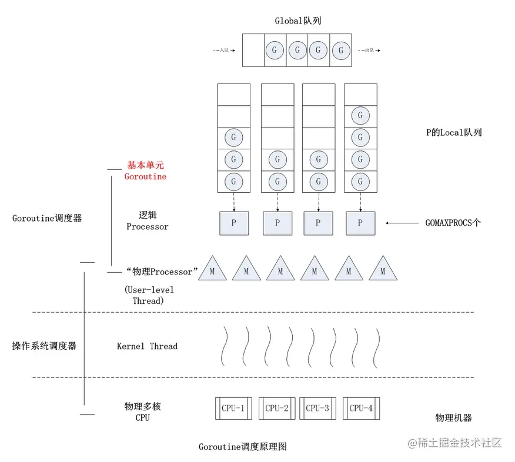
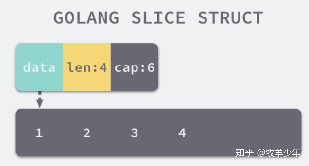

## 重点理解

### 垃圾回收

Golang中的垃圾处理机制可以概括为：**三色标记法 + 写屏障机制**，其实Go中的GC过程从大类上属于标记-清除法，即先根据一些算法，比如可达性算法来标记出不可达的对象，随后清除对象。

而三色标记算法是对标记过程的改进，其原理如下：

- 初始状态下所有对象都被标记成白色

- 从根节点开始遍历所有对象，把能够直接访问到的对象标记成灰色

  > 根节点指的是全局变量和一些栈上的变量

- 然后再去遍历灰色的对象，把灰色对象的引用也变成灰色，然后将遍历过的灰色对象变成黑色

- 循环上面的步骤，直到没有灰色的对象

- 到此，如果没有屏障机制保护的话，我们就可以执行清楚操作了，将所有的白色对象都清除掉

**那么，如果没有屏障机制，会出现什么问题呢？**

如果已经遍历完的黑色对象上多出来了一个引用，该引用指向的是一个白色对象，这个白色对象不会被再被标记成灰色/黑色，因为引用他的黑色对象已经遍历过了，所以在清除阶段，即使存在引用，这个对象还是会被GC掉，这种问题又被叫做**引用对象丢失**。


其实，解决这种问题最直接的办法就是STW，直接禁止掉其他用户程序对对象引用关系的干扰，然后STW过程有明显的资源浪费，而且会造成程序卡顿严重。所以得想办法来尽可能地缩短STW地时间，这个办法就是屏障机制。

屏障机制基于两个前提条件：

- 黑色对象的引用不能是白色的，这一条叫做**强三色不变性**
- 黑色对象的引用可以是白色的，但是还有其他的路径能从灰色的对象到达这个白色对象，这一条叫做**弱三色不变性**

意思是，**写屏障只要任意满足强三色不变性和弱三色不变性中的任意一条就能够避免引用对象对象的问题**

有一种写屏障机制，叫做**插入写屏障**，它的原理就是满足强三色不变性，当黑色对象新增了白色对象的引用时，将对应的白色节点改为灰色，但是这样也存在一个问题，如果在标记过程中，这个引用被清楚了，那么这个灰色对象还是会变成黑色，即本次GC不会将这个对象清除掉，得等到下一次的GC才行。

还有一种写屏障机制，叫做**删除写屏障，**它的原理是满足弱三色不变性，核心是当白色对象的一个引用被删除的时候，删除写屏障机制悲观的认为它一定会被一个黑色对象新增引用，因此将这个白色对象设置成灰色

还有一种是混合写屏障机制，他的流程是：

- 将所有的对象都标记成黑色
- 在GC期间，任何在栈上创建的对象都是黑色
- 被删除的对象标记为灰色，被添加的对象标记位灰色

> 参考：[golang gc垃圾回收 - 掘金 (juejin.cn)](https://juejin.cn/post/7076263133190291463#heading-11)


### CSP模型和GPM调度

CSP模型是“**以通信的方式来共享内存**”，全称是Communicating Sequential Process，不同于传统的多线程通过共享内存来通信，用于描述两个独立的并发实体通过共享的通讯channel（管道）进行通信的并发模型

Golang中借用了CSP模型中的一些概念为之实现并发提供了理论支持，事实上，Go语言并没有完全实现CSP模型中的所有理论，仅仅是借用了process和channel这两个概念，process在go语言上的表现就是goroutine，即实际并发执行的实体，每个实体之间是通过channel通讯来实现数据共享的。

**那么CSP模型的好处是什么呢？**对一个共享内存的对象，如果每个都要去修改的话，就必须得记得加锁和解锁，甚至更复杂的操作，而channel则是生产者和消费者，不需要关注锁和共享内存的复杂性，把共享内存看成一份输入和输出的数据

> Goroutine 和 channel 是 Go 语言并发编程的 两大基石。Goroutine 用于执行并发任务，channel 用于 goroutine 之间的同步、通信。

**Go的并发哲学就是不要通过共享内存来实现通信，而是要通过通信来实现共享内存**

**GPM模型其实是Golang内置的调度器，用来调度goroutine**，其中的G指的就是Goroutine，P指的是Processor，处理器（Go中定义的一个概念）包含运行Go代码的必要资源，用来调度G和M之间的关联关系，默认为核心数，M指的是Machine，数量对应真正的CPU数

Goroutine的调度策略：

- **队列轮转：**P会周期性的将G调度到M中执行，执行一段时间后，保存上下文，将G放到队列尾部，然后从队列中再取出一个G进行调度。除此之外，P还会周期性的查看全局队列中是否有G等待调度到M中执行
- **系统调用：**当G0即将进入系统调用的时候，M0将释放P，从而空闲的M1能够获取到P，继续执行P队列中剩下的G，当G0系统调用结束之后，如果有空闲的P，则获取一个P，继续执行G0，如果没有，则将G0放入到全局队列中，等待被其他的P调度，然后M0将进入缓存池睡眠。



> [Go语言的CSP模型 - 知乎 (zhihu.com)](https://zhuanlan.zhihu.com/p/313763247)


### Chan原理

- **结构体**

  ```go
  type hchan struct {
  	qcount   int            // 队列中总元素的个数
  	dataqsiz int            // 环形队列大小。即可以存放元素的最大个数
  	buf      unsafe.Pointer // 环形队列指针
  	elemsize uint16         // 每个元素的大小
  	closed   uint32         //表示关闭状态
  	elemtype *_type         //元素类型
  
  	sendx uint // 发送索引，元素写入时存放到队列中位置
  	recvx uint // 接收索引，元素从队列的该位置读出
  
  	recvq waitq // 等待读消息的goroutine队列
  	sendq wait1 // 等待写消息的goroutine队列
  
  	lock mutex // 互斥锁，chan不允许并发读写
  }
  ```

- **读写流程**

  1. **向channel中写数据**

     - 若等待队列recvq不为空，则说明缓冲区中无数据或者无缓冲区，则直接将recvq中的G唤醒，然后将数据写入其中，结束发送过程
     - 若缓冲区中有空余位置，则将数据写入缓冲区，结束发送过程
     - 若缓冲区中没有空余位置，则将发送数据写入G，将当前G加入sendq，进入睡眠，等待被读goroutine唤醒

  2. **从channel中读数据**

     - 若等待队列sendq不为空，且没有缓冲区，则直接从sendq中取出G，把G中的数据读出，最后把G唤醒，结束读取过程
     - 如果等待发送的队列sendq不为空，说明缓冲区已满，从缓冲区首部读出数据，然后把G中的数据写入缓冲区尾部，唤醒G，结束读取过程
     - 若缓冲区中有数据，则直接从缓冲区中读取数据，结束读取过程
     - 将当前goroutine加入recvq，进入睡眠，等待被 写goroutine唤醒

  3. **关闭channel**

     关闭 channel 时会将 recvq 中的 G 全部唤醒，本该写入 G 的数据位置为 nil。将 sendq 中的 G 全部唤醒，但是这些 G 会 panic。

     panic 出现的场景还有：

     - 关闭值为 nil 的 channel
     - 关闭已经关闭的 channel
     - 向已经关闭的 channel 中写数据

- **channel发送和接收是否同步？**
  1. 无缓冲区的channel发送和接收需要同步，当channel无缓冲时，发送阻塞直到数据被接收，接受阻塞直到读到数据。
  2. 有缓冲区的channel发送和接受不需要同步，channel有缓冲时，当缓冲满时发送阻塞，当缓冲空时接受阻塞

4. **Context本质上是一种协程调度的方式，**主要用于父子任务之间的同步取消信号，上有任务仅仅是使用context通知下游任务不再需要，但不会直接干预或中断下游任务的执行，由下游任务自行决定后续的处理操作，也就是说context的取消操作是无侵入的，context是线程安全的，因为context本身是不可变的，因此可以放心的在多个协程之间传递使用，用于传递信息。

   ```go
   // context中定义了四个接口
   type Context interface {
       Deadline() (deadline time.Time, ok bool)
       Done() <-chan struct{}
       Err() error
       Value(key interface{}) interface{} 
   }
   ```

   - `Deadline()`：返回值`deadline`是截止时间，如果已经到了截止时间，Context会自动发起取消请求，返回值ok表示的是是否设置了截止时间
   - `Done()`：返回一个只读的channel，类型为`struct{}`，如果这个chan可以读取，说明已经发出了取消信号，可以做清理操作，然后退出协程，释放资源。
   - `Err()`：返回上下文被取消的原因
   - `Value()`：获取`context`上被绑定的值，是一个键值对，通过`key`来获取对应的值

   

### 内存逃逸

这里的逃逸指的是变量内存**是否给分配到了堆上**，因为如果变量都分配到堆上，堆不像栈可以自动清理，他会引起Go频繁地进行垃圾回收，而垃圾回收会占用比较大的系统开销

逃逸分析就是程序运行时内存的分配位置（栈或堆），是由编译器来确定的，堆适合不可预知大小的内存分配，但是为此付出的代价是分配速度较慢，而且会形成内存碎片。

> Go逃逸分析最基本的原则是：如果一个函数返回对一个变量的引用，那么它就会发生逃逸。
>
> 任何时候，一个值被分享到函数栈帧范围之外，它都会在堆上被重新分配。

通过逃逸分析，可以尽量把那些不需要分配到堆上的变量直接分配到栈上，栈上的变量少了，会减轻分配堆内存的开销，同时也会减少gc的压力，提高程序的运行速度

逃逸的常见情况：

- 指针类型的逃逸，比如`[] *string`，即使切片的底层存储数组仍可能位于堆栈上，数据的引用也会转移到堆中。

- 动态调度，因为golang中调用接口类型的方法是具体的实现只有在运行时才可以确定

  > **一切在编译时不能够确定的对象，都会在堆上分配内存**

- 栈空间不足也会导致逃逸

>[Golang内存逃逸是什么？怎么避免内存逃逸？ - 腾讯云开发者社区-腾讯云 (tencent.com)](https://cloud.tencent.com/developer/article/1732263)


### 竞态

竞态其实就是多个协程竞争同一块内存空间的状态，解决这个问题可以使用加锁的方式，让内存空间在某一时刻只能够由一个协程来访问

```go
sync.Mutex
sync.RWMutex
```


## 重要知识点

1. go中有哪些方法能够安全读写共享内存？

   - 通过使用Mutex锁
   - goroutine可以通过channel来实现通信，从而实现安全读写（CSP模型）

   

2. go中new和make的区别？

   - new可分配任意类型的数据，根据传入的类型申请一块内存，返回指向这块内存的指针，即 *Type，同时new函数会把分配的内存置为零，也就是类型的零值
   - make只能够用来分配及初始化类型为slice、map、chan的数据，返回的是引用，即Type，因为make支持的三种类型本身就是引用类型，所以没必要返回指针了，而且make分配空间之后，会进行初始化

   

3. go对空的slice和nil的slice处理是一样的吗？（nil slice和empty slice的区别）

   ```go
   // empty slice
   slice := make([]int, 0)
   slice := []int{}
   // nil slice
   var slice []int // 只声明，没有分配内存
   ```

   

4. 协程和进程、线程的区别

   - 进程是系统资源分配的基本单位，每个进程都有自己独立的内存空间，不同进程间通过管道、消息队列、共享内存、信号量、信号、socket等方式进行进行通信，进程上下文切换的系统开销比较大，但相对比较安全稳定
   - 线程是CPU调度的基本单位，同一个进程中的线程能够共享使用进程中的堆、栈、全局变量等资源，同时每个线程都有自己特有的寄存器、栈等资源，线程之间的通信主要是通过共享内存的方式，因为独有的信息较少，所以上下文切换带来的系统开销也是比较少的，但是进程中的一个线程崩溃会影响到其他线程
   - 协程是运行在用户态的轻量级线程，其调度完全由用户来控制，上下文切换的系统开销更小，因为写成根本无需内核操作，对于内核来说是透明的。

   > 线程是被分割的CPU资源，协程是组织好的代码流程

   

5. channel为什么可以做到线程安全

   channel可以理解为一个先进先出的队列，通过管道进行通信，**发送一个数据到channel和从channel中接收一个数据都是原子性的，**不是通过共享内存来通信，而是通过通信实现的共享内存，前者对应的是传统的加锁方式，后者对应的是channel，设计channel的主要目的就是在多任务间传递数据，本身就是安全的。

   

6. GC的触发条件

   - 主动触发，通过调用`runtime.GC`来触发`GC`，本次调用会阻塞式地等待本次GC运行完毕

   - 被动触发分成了两种模式：

     - 使用系统监控，当超过两分钟没有产生任何GC时，强制触发GC
     - 使用步调算法，其核心思想是控制内存增长的比例，每次内存分配时检查当前内存分配量是否已经到达阈值：默认是100%，即当内存扩大超过一倍的时候启用GC

     

7. 怎么查看goroutine的数量，如何限制goroutine的数量？

   - `runtime.NumGoroutine()`返回的是当前的运行时go协程数

   - 可以通过一个带缓冲的channel来限制goroutine的数量，比如想让系统中的goroutine有10个，那么就把buffer的大小设置成9，因为还有一个goroutine

     > [GO 限制goroutine数量 - 简书 (jianshu.com)](https://www.jianshu.com/p/89bfde4c3116)

     

8. go的struct能不能比较？

   相同类型的struct可以比较，不同类型的struct不可以比较，编译都不过，类型不匹配

   

9. go的主协程是如何等待其他协程都完成了之后再操作？

   使用`sync.WaitGroup`，WaitGroup内部实现了一个计数器，用来记录未完成的操作个数，Add()用来添加计数，`Done()`用来在操作结束时调用，使计数-1，`wait()`用来等待所有的操作结束，即计数变为0，该函数会在计算不为0时等待，在计数为0时立即返回。

   

10. go的slice如何扩容？

    在使用append向slice追加元素时，若slice空间不足则会发生扩容，扩容会重新分配一块更大的内存，将原slice拷贝到新的slice，然后返回新的slice，扩容后再将数据追加进去

    具体的扩容规则是

    - 当capacity的长度小于1024的时候，会扩大为`2*len`
    - 当capacity的长度大于1024的时候，会扩大为`1.25*len`

    

11. go中的map如何实现顺序读取？

    可以先把map中的key，通过sort包排序

    

12. 值接收者和指针接收者的区别

    实现了接收者是值类型的方法，相当于自动实现了接收者是指针类型的方法；而实现了接收者是指针类型的方法，不会自动生成对应接收者是值类型的方法。

    对于值接收者，如果调用者也是值对象，那么会将调用者的值拷贝一份，并执行方法，方法的调用不会影响到调用者的值，如果调用者是指针对象，那么会将引用对象拷贝一份，然后执行方法

    对于指针接收者，如果调用者是值对象，那么会使用值的引用来调用方法，对于指针接收者而言，无论是值对象还是指针对象，本质上都是通过引用来调用方法，因此会影响对象的属性

    所以，我们通常使用指针作为方法接收者的理由有二：

    - 使用指针作为方法接收者，当调用指针方法的时候能够修改调用者指向的值
    - 可以避免在每次调用方法的时候复制该值，在值的类型为大型结构体时，这样做会更加高效

    > [golang的值接收者和指针接收者的区别_惜暮的博客-CSDN博客_指针接收者和值接收者区别](https://blog.csdn.net/u010853261/article/details/100941972)

    

13. 在go函数中为什么会发生内存泄漏

    goroutine需要维护执行用户代码的上下文信息，在运行过程中需要消耗一定的内存来保存这类信息，如果一个程序持续不断的产生新的goroutine，且不结束已经创建的goroutine并复用这部分内存，就会造成内存泄漏的现象

    

14. goroutine发生了内存泄漏应该如何检测

    可以通过go自带的工具pprof或者使用Gops去检测诊断当前在系统上运行的Go进程所占用的资源

    

15. go中的两个nil可能不相等吗？

    接口类型的内部实现包含2个字段，类型`T`和值`V`，当前仅当`T == nil && V is unset`的时候一个接口等于nil

    当一个非接口类型的值和接口类型的值比较的时候，非接口类型的值会尝试转换接口值，然后再比较

    ```go
    var p interface{}
    var i *int = nil
    fmt.Println(p == i) // false
    ```

    `i`转换成接口类型的值，其中的`T == int`，并不为nil，所以两个nil并不相等

    > [golang 两个nil不一定相等_牛气的潘小花的博客-CSDN博客](https://blog.csdn.net/qq_32625545/article/details/122048373)

    

16. 两个interface的比较

    - 判断类型是否一样 `reflect.TypeOf(a).Kind() == reflect.TypeOf(b).Kind()`
    - 判断两个interface是否相等 `reflect.DeepEquals(a, b interface{})`
    - 将一个interface{}赋值给另一个interface{} `reflect.ValueOf(a).Elem.Set(reflect.ValueOf(b))`

    

17. go语言函数传参是值类型还是引用类型？

    **在go语言中只存在值传递**，要么是值的副本，要么是指针的副本，无论是值类型的变量，还是引用类型的变量亦或是指针类型的变量作为参数传递都会发生值拷贝，开辟新的内存空间

    这里需要注意slice、map、channel这三种引用类型的变量，以slice为例，slice本质上指的就是这个结构（data+len+cap，不包括底层的数组）。在参数传递过程中，这个结构拷贝了一份，data指向的还是原来的底层数组。当我们对slice中的元素进行修改时，还是会通过拷贝之后的data，直接对底层数组进行修改。

    

    ```go
    func main() {
    	slice := []int{0,1,2,3}
    	fmt.Printf("[main slice] %p\n", &slice)
    	get(slice)
    	fmt.Printf("[new slice] %v\n",slice)
    }
    
    func get(s []int)  {
    	fmt.Printf("[get slice] %p\n", &s)
    	s = append(s, 9999)
    }
    
    // output
    [main slice] 0xc0000a6020
    [get slice] 0xc0000a6040
    [new slice] [0 1 2 3]
    ```

    > [Go语言引用传递与值传递 - 知乎 (zhihu.com)](https://zhuanlan.zhihu.com/p/162820450)

    其实上面的这个例子是golang中的append陷阱，因为golang中只存在值传递，所以当slice被传递到get函数中时会拷贝一份slice的结构体`data+len+cap`，所以在函数内外取地址的结果是不同的（虽然两个结构体data指针指向的都是同一块内存，但是结构体本上的地址是不同的）。前面说了，两个结构体指向的是同一块内存，理论上从函数内部修改，对于外部也是可见的？非也！

    - 首先对于在函数内部append造成slice扩容的情况，当slice扩容，底层会开辟出一块新的更大的内存，将旧数据拷贝到新的内存中，所以函数内外两个结构体的data指针指向的都不是同一块内存了，更别说会两者相同了
    - 第二，如果没有造成扩容，两者指向的还是同一块内存，但是两个结构体中的`len`属性是不一样的，因此最后外面的slice同样是读出不来函数内部的修改

    

18. `%v, %+v, %#v`的区别

    - `%v`只输出所有的值
    - `%+v`先输出字段名字，再输出该字段的值
    - `%#v`先输出结构体名字值，再输出结构体（字段名字 + 字段的值）

    ```go
    type student struct {
    	id   int32
    	name string
    }
     
    func main() {
    	a := &student{id: 1, name: "微客鸟窝"}
    
    	fmt.Printf("a=%v	\n", a) // a=&{1 微客鸟窝}	
    	fmt.Printf("a=%+v	\n", a) // a=&{id:1 name:微客鸟窝}	
    	fmt.Printf("a=%#v	\n", a) // a=&main.student{id:1, name:"微客鸟窝"}
    }
    ```

    

19. 什么是rune类型

    go语言中的字符有两种

    - `uint8`类型或者叫做`byte`型，代表了ASCII码的一个字符
    - `rune`类型，代表一个UTF-8字符，当需要处理中文、日文或其他复合字符时，则需要用到`rune`类型，`rune`类型等价于int32类型


20. 空struct

    空struct实例不占用任何内存空间，所以空struct广泛作为各种场景下的占位符使用

    - 比如map作为set使用时

      ```go
      set := map[int]struct{}
      ```

    - 不发送数据的信道

      使用channel不需要发送任何的数据，只用来通知子协程执行任务，或只用来控制协程并发度

      ```go
      func worker(ch chan) {
      	<-ch
      	fmt.Println("do something")
      	close(ch)
      }
      
      func main() {
      	ch := make(chan struct{})
      	go worker(ch)
      	ch <- struct{}{}
      }
      ```

    - 结构体只包含方法，不包含任何的字段

      ```go
      type Door struct{}
      
      func (d Door) Open() {
      	fmt.Println("Open the door")
      }
      
      func (d Door) Close() {
      	fmt.Println("Close the door")
      }
      ```

      


参考文档

[面试必备(背)--Go语言八股文系列！ - 掘金 (juejin.cn)](https://juejin.cn/post/7029704699435548679#heading-6)