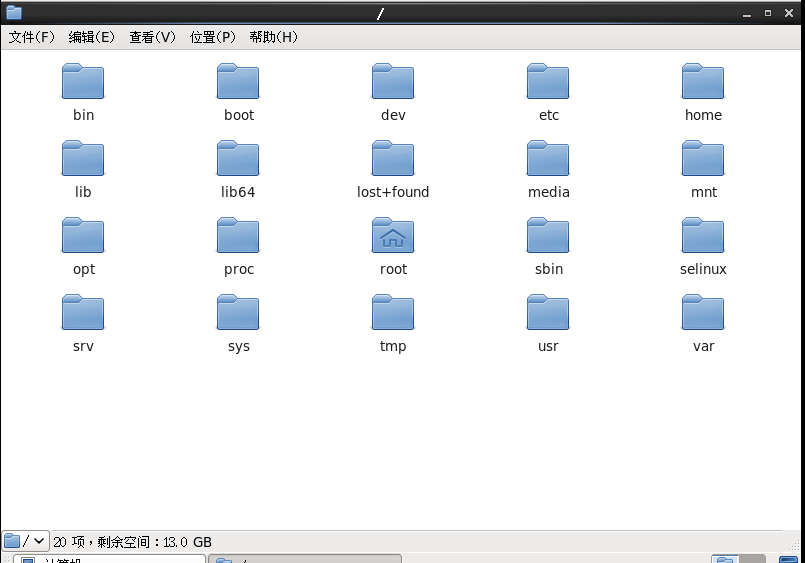
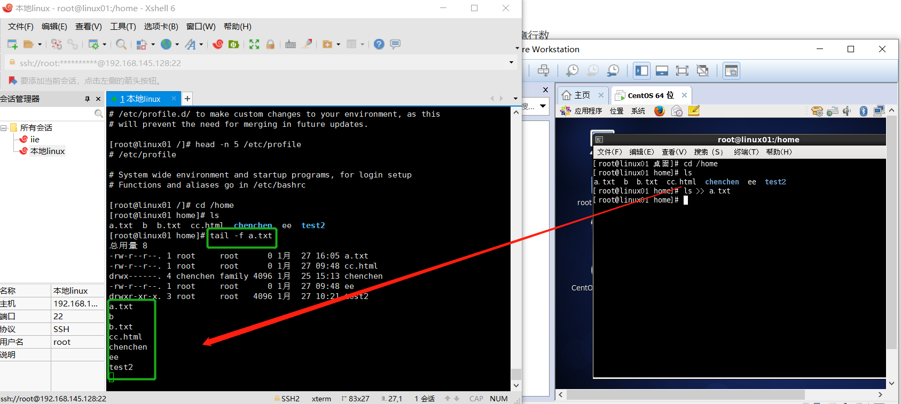
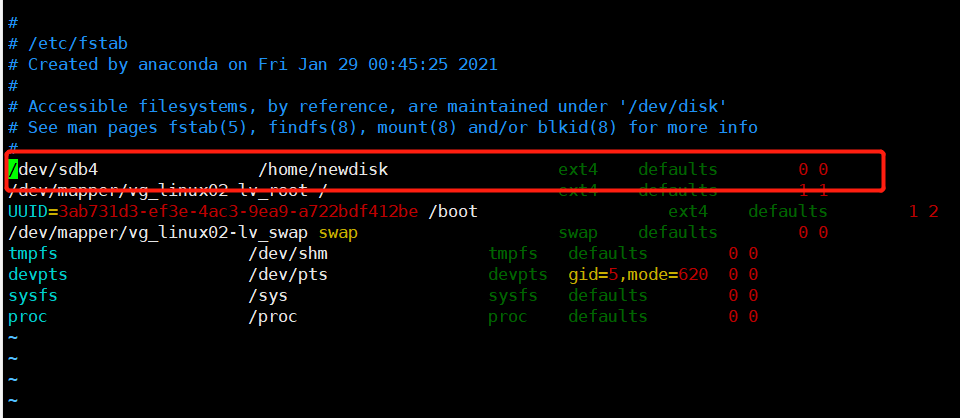
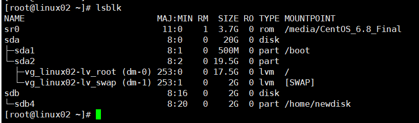
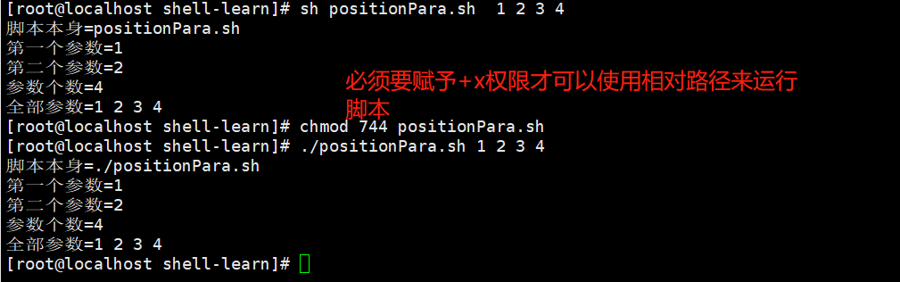

[toc]

### `Linux`文件目录

==在`linux`的世界里，一切皆为文件==

`linux`的文件系统是采用**级层式的树状**目录结构，在此结构中的**最上层目录是根目录**`“/”`，然后在此目录下再创建其他的目录

比如在`CentOS`的根目录下，如下图所示的文件夹



- `/bin,Binary`的缩写，该目录中存放的是一些指令
- `/sbin,s`是`super user`的意思，这里存放的是系统管理员使用的系统管理程序
- `/dev`管理设备，把硬件映射成文件来管理
- `/etc`存放配置文件,所有的系统管理所需要的配置文件和子目录` my.conf `
- `/home`存放普通用户的主目录，在`Linux`中每个用户都有一个自己的目录，一般该目录名是以用户的账号命名的
- `/root` 该目录为系统管理员，也称作超级权限者的用户主目录
- `/lib`该目录下存放的是系统开机所需要最基本的动态连接共享库，其作用类似于`Windows`里的`DLL`文件。几乎所有的应用程序都需要用到这些共享库
- `/lost + found`这个目录一般情况下是空的，当系统非法关机后，这里就存放了一些文件
- `/usr`这个目录很重要，用户的很多应用程序和文件都放在这个目录下
- `/boot`存放的是启动`Linux`时使用的一些核心文件，包括一些连接文件以及镜像文件
- `proc`这个目录是一个虚拟的目录，它是系统内存的映射，访问这个目录来获取系统信息
- `/srv,service`缩写，该目录存放一些服务启动之后需要提取的数据。
- `/sys`,这是`linux2.6`内核的一个很大的变化。该目录下安装了2.6内核中新出现的一个文件系统 
- `/tmp`存放临时文件
- `/medie,linux`系统会自动识别一些设备，例如U盘、光驱等等，当识别后，`linux` 会把识别的设备挂载到这个目录下
- `/mnt`，系统提供该目录是为了让用户临时挂载别的文件系统，可以将外部的存储挂载在`/mnt`上，然后进入该目录就可以查看里面的内容了（比如共享文件夹就在这个里面）
- `/opt`这是给主机额外安装软件所摆放的目录，如果安装`Oracle`数据库就可以放到该目录下，默认为空
- `/usr/local`这是另一个给主机额外安装软件所安装的目录。一般是通过编译源码方式安装的程序
- `/var`这个目录下存放的是不断扩充着的东西，习惯将被修改的目录放在这个目录下，包括各种日志文件
- `/selinux(security-enhanced linux)` 是一种安全子系统,它能控制程序只能访问特定文件


`Linux`系统中有且只有一个根目录，且`Linux`系统是以文件的的形式来管理我们的设备，因此，在`linux`系统中一切皆为文件，而且每个文件夹下的内容都是预先规定好了的，不要瞎放


### `Linux`实操

- 无论是使用`XShell`还是`Xftp`来连接`linux`服务器，都需要先开启`linux`服务器的`sshd`服务，端口号为22

- 所有的`linux`系统都会内置`vi`文本编辑器，`vim`具有程序编辑能力，可以看作是`vi`的增强版本

- ==**`vi`和`vim`常见的三种模式**==

  - **正常模式：**以`vim`打开一个档案就直接进入一般模式了（也叫正常模式），在这个模式下可以使用`上下左右`按键来移动光标，也可以使用删除字符和删除整行来处理档案内容，也可以使用复制粘贴来处理文件数据
  - **插入模式：**按下`i,I,o,O,a,A,r,R`等任何一个字母后才会进入编辑模式
  - **命令行模式：**在这个模式下，可以提供相关的指令，完成读取、存盘、替换、离开`vim`、显示行号等动作

  

`:wq`表示保存并退出

`:q`表示退出

`:q!`表示强制退出

- 拷贝当前行 `yy` , 拷贝当前行向下的5行 `5yy`（包括当前行），并粘贴`p`     [正常模式下]
-  删除当前行 `dd` , 删除当前行向下的5行 `5dd `     [正常模式下]
-  在文件中查找某个单词 [命令行下 `/关键字` ， 回车 查找 , 输入 `n` 就是查找下一个 ] 
-  设置文件的行号，取消文件的行号.[命令行下` :set nu` 和 `:set nonu`] 
-  编辑 `/etc/profile` 文件，使用快捷键到底文档的最末行[`G`]和最首行[`gg`]      [正常模式下]
- 在一个文件中输入 `"hello"` ,然后又撤销这个动作 `u`    [在命令行模式下输入`u`]
- 编辑 `/etc/profile` 文件，并将光标移动到 20行 **（这个咋没成功）**
  - 显示行号 ----- `:set nu`
  - 输入20
  - `shift+g`


- **==开机&重启==**

  - `shutdown -h now`     立即关机
  - `shutdown -h 1`   1分钟后关机
  - `shutdown -r now`   立即重启
  - `halt`      关机，作用和`shutdown -h now` 一样
  - `reboot`  重新启动计算机
  - **`sync`     把内存的数据同步到磁盘中**

  **注意：无论是进行重启还是进行关机，都需要先运行`sync`命令，先把数据从内存保存到磁盘中**

- **用户的登录和注销**

  1. 登录时尽量避免使用`root`账号登录，因为他是系统管理员，具有最高的权限，避免操作失误。可以利用普通用户登录，登陆再用`su-用户名`命令切换成系统管理员身份
  2. 在提示符下输入`logout`注销用户

  注意：使用`logout`在图形运行级别无效，在其他三个运行级别下有效
  
  
#### 用户管理

- **==用户管理==**

  `Linux`系统是一个多用户多任务的操作系统，任何一个要使用系统资源的用户，都必须首先向系统管理员(`root`)申请一个账号，然后以这个账号的身份进入系统

  - **添加用户**   `useradd  用户名`

    - 当创建用户成功后，会自动的创建和用户同名的家目录 
    - 也可以通过 `useradd -d 指定目录 新的用户名`，给新创建的用户指定家目录

    

  - **指定用户密码**  `passwd 用户名`（只有`root`用户才能够给别的用户指定密码）

    

    

  - **删除用户**   `userdel  用户名`

    -  `userdel  用户名`  删除用户，但是保留家目录
    -  `userdel -r 用户名` 删除用户，不保留家目录

    在实际情况下，一般删除用户时，不删除掉家目录

  - **查询用户信息**  `id  用户名`

    

  - **切换用户**，`su - 用户名`

    - 从权限高的用户切换到权限低的用户，不需要输入密码，反之需要。
    - 当需要返回到原来用户时，使用`exit`指令

    

  - **用户组**，类似于角色，系统可以对有共性的多个用户进行统一的管理

    - 新增组  `groupadd  组名`
    - 删除组  `groupdel 组名`
    - 增加用户时直接添上组     `useradd -g 组名 用户名`
    - 修改用户的组     `usermod  -g 组名 用户名`

    

    

  - **用户和组的相关文件**

    - `/etc/passwd` 文件   用户`（user）`的配置文件，记录用户的各种信息
  
      
  
      每行的含义：用户名:加密口令:用户标识号(id):组标识号:注释性描述:主目录:登录Shell 
  
    - `/etc/shadow` 文件   口令（密码）的配置文件 
  
      
  
      每行的含义：登录名:加密口令:最后一次修改时间:最小时间间隔:最大时间间隔:警告时间:不活动时间:失效时间:标志 
  
      其中的加密口令（即密码）被加密过了
  
    - /etc/group 文件 组(group)的配置文件，记录Linux包含的组的信息 
  
      
  
      每行含义：组名:口令:组标识号:组内用户列表
#### 实用指令

运行级别


- 0 ：关机 

- **1 ：单用户【找回丢失密码】** 

- 2：多用户状态没有网络服务 

- 3：多用户状态有网络服务 

- 4：系统未使用保留给用户 

- 5：图形界面 

- 6：系统重启 

常用运行级别是3和5 ，要修改默认的运行级别可改文件 `/etc/inittab`的`id:5:initdefault`这一行中的数字 


命令：`init  [0123456]`


**找回丢失的`root`密码**

1. 在开启服务器时在引导界面按`enter`进入如下界面

   

2. 在上面的页面按下`e`，同时在下一个页面中将光标移动到第二个位置，并再次按下`e`

   

3. 在进入的下一个页面中，输入`空格 1`，按下`enter`键，进入单用户模式（因为进入单用户不需要用密码）

   

4. 通过上面的步骤进入下面的界面

   

5. 按下`d`，以`root`用户身份登陆进去

   

6. 输入`passwd root`修改`root`用户的密码


**帮助指令**

- `man`，获得帮助信息

   基本语法     `man [命令或配置文件]`

- `help`，获得`shell`内置命令的帮助信息

   基本语法     `help [命令]`


##### 文件目录类

- `pwd`   显示当前工作目录的绝对路径

- `ls`     

  - `-a`   显示当前目录所有的文件和目录，包括隐藏的。
  - `-l`   以列表的形式展示信息

- `cd`     是`change directory`的缩写，作用是切换到指定目录

  - 相对路径和绝对路径的区别
    - 绝对路径：从根目录开始定位
    - 相对路径：从当前路径开始定位到需要的路径中
  - `cd ~`和`cd`都表示返回到家目录
  - `cd ..` 表示返回到当前路径的上一级路径

  `linux`中的文件目录结构为

  

- `mkdir`   创建目录（`make directory`）

  - `-p`   创建多级目录

  

  

  如果创建多级目录，必须带上参数`-p`

- `rmdir`     删除目录（`remove directory`）

  

  需要注意的是，`rmdir`只能够删除空白目录，只要是目录下面有其他的东西，就不能够删除了；想要删除非空白目录，需要使用下面的命令`rm -rf /home/cat`

  


- `touch`   创建一个**空文件**，也可以一次性创建多个空文件

  

- `cp`  指令拷贝文件到指定目录

  - 当指定目录中存在与拷贝文件同名的文件时，会提醒是否覆盖，使用`\cp`会强制覆盖
  - `-r`可以递归复制整个文件夹

  

- `rm`  删除文件或者目录

  - `-r`   递归删除整个文件夹
  - `-f`    强制删除不提示

  

  当不使用`-f`时，删除文件夹或者目录时会有是否删除的提醒

  当只使用`-r`递归删除时，会先进入这个文件夹，然后依次询问是否删除，如果不删除其中的文件，那么不能够删除目录

  

- `mv`  移动文件与目录/重命名

  - `mv oldNameFile newNameFile` (功能描述：重命名) 
  - `mv /temp/movefile /targetFolder `(功能描述：移动文件)

  

  ==我觉得重命名的本质还是移动文件，因为如果是`mv dd.p ff.txt`这种就相当于在同一个路径下将`dd.p`移动到`ff.txt`，要么同意路径下没有`ff.txt`重命名，要么就覆盖==

- `cat`  以只读的方法打开文件

  - `-n` 显示行号
  - cat 只能浏览文件，而不能修改文件，为了浏览方便，一般会带上管道命令 `| more`

  

  `more`其实就是分页符

- `more`指令是一个基于VI编辑器的文本过滤器，**它以全屏幕的方式按页显示文本文件的内容**。 more指令中内置了若干快捷键，

  | 操作     | 功能说明                         |
  | -------- | -------------------------------- |
  | 空格键   | 向下翻一页                       |
  | Enter    | 向下翻一行                       |
  | q        | 立刻离开more，不再显示该文件内容 |
  | CTRL + F | 向下滚动一屏                     |
  | CTRL + B | 向后滚动一屏                     |
  | =        | 输出当前行号                     |
  | :f       | 输出文件名和当前行的行号         |

  

- `less` 指令用来分屏查看文件内容，它的功能与`more`指令类似，但是比`more`指令更加强大，支持各种显示终端。`less`指令在显示文件内容时，并不是一次将整个文件加载之后才显示，而是根据显示需要加载内容，**对于显示大型文件具有较高的效率。**

  | 操作       | 功能说明                                           |
  | ---------- | -------------------------------------------------- |
  | 空格键     | 向下翻一页                                         |
  | [pagedown] | 向下翻一页                                         |
  | [pageup]   | 向上翻一页                                         |
  | /字串      | 向下搜寻『字串』的功能；n：向下查找；N：向上查找； |
  | ？字串     | 向上搜寻『字串』的功能；n：向下查找；N：向上查找； |
  | q          | 离开less                                           |


- `>`  输出重定向， `>>` 追加

  1. `ls -l >文件` 功能描述：列表的内容写入文件`a.txt`中（覆盖写）
  2. ` ls -l >>文件 `     功能描述：列表的内容追加到文件`a.txt`的末尾 
  3. `cat 文件1 > 文件2`    功能描述：将文件1的内容覆盖到文件2） 
  4. echo "内容">> 文件   功能描述：将`echo`后面的内容追加到文件中

  注意：上面四个指令中的`>`和`>>`都能够使用，只是一个是覆盖写，一个是追加写

  

  

- `echo`  输出内容到控制台

  

  当命令为`echo "xxxx"`会在命令行输出`xxxx`表示的内容

- `head`  用于显示文件的开头部分内容，**默认情况下head指令显示文件的前10行内容**

  - `head 文件` 功能描述：查看文件头10行内容
  - `head -n 5 文件` 功能描述：查看文件头5行内容，5可以是任意行数

  

- `tail` 用于显示文件的结尾部分，默认情况下tail指令显示文件的后10行内容

  - `tail 文件` 功能描述：查看文件头10行内容
  - `tail -n 5 文件` 功能描述：查看文件头5行内容，5可以是任意行数
  - **` tail -f 文件 `功能描述：实时追踪该文档的所有更新**

  

  当右侧追加了一段内容到`a.txt`中，左侧的绿色框中的内容会自动生成出来，也就是能够实时看到`a.txt`中的变化

- `ln`  软链接也称为符号链接，**类似于`Windows`中的快捷方式**，主要存放了链接其他文件的路径

  `ln -s [原文件或目录] [软链接名]`      功能描述：给原文件创建一个软链接
  
  


- `history` 查看已经执行过历史命令,也可以执行历史指令

  

##### 时间日期类

- `date`  显示当前日期

  - `date`       显示当前时间 
  - `date +%Y`     显示当前年份
  - `date +%m`     显示当前月份
  - `date +%d`     显示当前是哪一天
  - `date "+%Y-%m-%d %H:%M:%S"`       年月日时分秒

  注意无论是显示年月日还是时分秒，前面都要有`+`

  - `date`设置日期

    `date  -s "字符串时间"`

  

- `cal`  查看日历
  
  


##### 搜索查找类

- `find`   从指定目录下递归地遍历其各个子目录，将满足条件的文件或者目录显示在终端

  基本语法：`find 搜索范围 选项`

  | 选项            | 功能                             |
  | --------------- | -------------------------------- |
  | -name<查询方式> | 按照指定的文件名查找模式查找文件 |
  | -user<用户名>   | 查找属于指定用户名所有文件       |
  | -size<文件大小> | 按照指定的文件大小查找文件       |

  

  

  

使用文件名字查找的时候还可以使用通配符，比如`find / -name *.txt`就是查找根目录下后缀名为`.txt`的文件

- `locate`  快速定位文件路径

  `locate`指令利用事先建立的系统中所有文件名称以及路径的`locate`数据库实现快速定位给定的文件。`Locate`指令无需遍历整个文件系统，查询速度较快。为了保证查询结果的准确度，管理员必须定期更新`locate`数据库

  **由于`locate`是基于数据库进行查询，所以第一次运行前，必须使用`updatedb`指令创建`locate`数据库**

  

  上图实例中可以看出，当新创建一个文件时，如果没有更新`locate`数据库，那么将不会被查询到，一旦再次更新数据库，那么就能够访问到了

- `grep`指令 和 管道符号 `|``

- ``grep`过滤查找
  
    - 基本语法   `grep [选项] 查找内容 源文件`
    
    - 常用选项
    
      | 选项 | 功能             |
      | ---- | ---------------- |
      | -n   | 显示匹配行及行号 |
      | -i   | 忽略字母大小写   |
    
  - `|`  **管道符号**，表示将前一个命令的处理结果输出传递给后面的命令处理
  
  


##### 压缩和解压缩类

- `gzip/gunzip`   压缩文件/解压缩文件

  - `gzip` 用于压缩文件，只能将文件压缩为`*.gz`文件
  - `gunzip` 用于解压文件，只能解压`*.gz`的文件（不确定）

  

- `zip`和`unzip`

  `zip` 用于压缩文件， `unzip` 用于解压文件，这个组合在项目打包发布中很有用的 

  - `zip [选项] XXX.zip`    压缩文件和目录的命令   常用选项 -r：递归压缩，即压缩目录

    

    将`/home`目录下的文件压缩到`myHome.zip`中，`myHome.zip`就在当前路径下

  - ` unzip [选项] XXX.zip`  解压缩文件     常用选项 -d<目录> ：指定解压后文件的存放目录

    

    将`myHome.zip`解压缩到`/opt/temp`路径下，如果`/opt`下没有`temp`这个文件夹将会自动创建

- `tar`  打包指令，最后打包的文件是`.tar.gz`的文件

  `tar [选项] XXX.tar.gz 打包的内容`      打包目录，压缩后的文件格式`.tar.gz`

  | 选项 | 功能               |
  | ---- | ------------------ |
  | -c   | 产生.tar打包文件   |
  | -v   | 显示详细信息       |
  | -f   | 指定压缩后的文件名 |
  | -z   | 打包同时压缩       |
  | -x   | 解压.tar文件       |

  使用`tar`的选项时，多数情况下都是**”组合拳“**

  


​         值得注意的是，当解压到某个文件夹下时，如果不存在这个文件夹将会报错

​         从上面的执行也可以看出压缩用`-zcvf`，解压用`-zxvf`


#### 组管理和权限管理

##### 组管理

在`Linux`中每个用户必须属于一个组，不能独立于组外，在`Linux`中每个文件都有所有者，所在组，其他组的概念。


- 文件/目录的所有者一般就是文件/目录的创建者，一般谁创建所有者就是谁

  - 查看文件的所有者   `ls -ahl`   其实也可以通过`ls -l`来看
  - 修改文件所有者    `chown  用户名  文件名`

  


- 文件/目录的所在组，当某个用户创建了一个文件后，默认这个文件所在的组就是用户所在的组

  - 查看文件所在组   `ls -ahl`
  - 修改文件所在组   `chgrp 组名 文件名`

  


- 其他组，除了文件所有者以及所在组的其他用户外，系统的其他用户都是文件的其他组


##### 权限管理


**0-9位说明** 

- 第0位确定文件类型(d, - , l , c , b) 【红方块】
  - `d` 表示目录
  - `-` 表示普通文件
  - `l` 表示软链接
  - `c` 表示字符设备（如键盘、鼠标等）
  - `b` 表示快文件（如硬盘等）
- 第1-3位确定所有者（该文件的所有者）拥有该文件的权限。---User【黄方块】
- 第4-6位确定所属组（同用户组的）拥有该文件的权限，---Group  【绿方块】
- 第7-9位确定其他用户拥有该文件的权限 ---Other   【蓝方块】

10个字符确定了不同用户能够对文件干什么？比如`-rwxrw-r-- 1 root root Feb 2 09:23 abc`

第一个字符表示文件类型，其余字符每3个一组（`rwx`），r可读，w可写，x可执行

第一组`rwx`：文件拥有者的权限是可读、可写、可执行

第二组`rw-`：与文件拥有者同一组的用户拥有的文件的权限是可读、可写

第三组`r--`：其他组的用户对文件的权限仅为可读


**`rwx`作用到文件**

- [ r ]代表可读(read): 可以读取,查看
- [ w ]代表可写(write): 可以修改,但是不代表可以删除该文件,**删除一个文件的前提条件是对该文件所在的目录有写权限**，才能删除该文件. 
- [ x ]代表可执行(execute):可以被执行

**`rwx`作用到目录**

- [ r ]代表可读(read): 可以读取，ls查看目录内容 
- [ w ]代表可写(write): 可以修改,目录内创建+删除+重命名目录 
- [ x ]代表可执行(execute):可以通过`cd`进入该目录

**第10位：** `1`对于文件来说表示硬连接数；对于目录来说表示子目录数 【红圆圈】

**第11，12位：** 分别表示文件/目录所属的用户以及用户组 【蓝圆圈】

**第13位：**表示文件的大小，如果是目录的话，这个数字是固定的4096，从这里也可以看出在`linux`中一切皆为文件，目录也是一种特殊的文件   【黄圆圈】

**第14位：**文件修改的最后时间   【绿圆圈】

**第15位：**文件名/目录名


**需要注意的是**

- 文件的大小那里始终会比字符数大1，因为在文件的末尾有一个不可见的字符（我猜测是文件结束符）


- 对于目录来说，第10位表示该目录下的子目录数

  

  可是在这里看到的是`/home`目录下只有3个，因为还有**两个是隐藏目录**，如下：

  

  其中`.`表示当前目录，这就是为什么`cd .`还是在本目录下

  `..`表示父目录，这就是为什么`cd ..` 是转向了父目录

- 权限可以用数字表示，`r=4,w=2,x=1`


###### 修改权限

通过`chmod`修改文件/目录的权限

**第一种方式：**`+ 、-、= 变更权限 `

u:所有者 g:所有组 o:其他人 a:所有人(u、g、o的总和) 

- `chmod u=rwx,g=rx,o=x 文件目录名`  
- `chmod o+w 文件目录名`     给文件添加`w`权限
- `chmod a-x 文件目录名 `     删除文件`x`权限


**第二种方式：**通过数字变更权限 `r=4 w=2 x=1 rwx=4+2+1=7 `

`chmod u=rwx,g=rx,o=x 文件目录名` 相当于 `chmod 751 文件目录名`


###### 修改文件所有者

- `chown newowner file` 改变文件的所有者
- `chown newowner:newgroup file` 改变用户的所有者和所有组 
- **`-R` 如果是目录 则使其下所有子文件或目录递归生效**


###### 修改文件所在组

`chgrp newgroup file` 改变文件的所在组


###### 权限管理的综合性练习

问题：有两个组`police` 和 `bandit`，4个用户，分别是` jack`, `jerry`属于警察，` xh, xq`属于土匪 

- 创建组 

  ```shell
  groupadd polic
  groupadd bandit
  ```

- 创建用户 

  

- `jack` 创建一个文件，自己可以读写，本组人可以读，其它组没人任何权限

  

- `jack` 修改该文件，让其它组人可以读, 本组人可以读写 

  

- `xh` 投靠警察，看看是否可以读写.

  

  


#### 定时任务调度

任务调度是指系统同在某个时间执行的特定的命令或程序。

任务调度分类包括

1. 系统工作：有些重要的工作必须周而复始地执行。如病毒扫描等 
2. 个别用户工作：个别用户可能希望执行某些程序，比如对`mysql`数据库的备份

基本语法 `crontab  选项`

| 选项 | 作用                            |
| ---- | ------------------------------- |
| -e   | 编辑`crontab`定时任务           |
| -I   | 查询`crontab`任务               |
| -r   | 删除当前用户所有的`crontab`任务 |

**快速入门** 

- 设置任务调度文件：`/etc/crontab`
-  设置个人任务调度。执行`crontab –e`命令。 接着输入任务到调度文件 如：`*/1 * * * * ls –l /etc/ > /tmp/to.txt` 意思说每小时的每分钟执行`ls –l /etc/ > /tmp/to.txt`命令 

**参数细节说明** 

- 5个占位符的说明 

| 项目      | 含义                 | 范围                    |
| --------- | -------------------- | ----------------------- |
| 第一个"*" | 一小时当中的第几分钟 | 0-59                    |
| 第一个"*" | 一天当中的第几个小时 | 0-23                    |
| 第三个“*” | 一个月当中的第几天   | 0-31                    |
| 第四个"*" | 一年当中的第几个月   | 1-12                    |
| 第五个"*" | 一周当中的星期几     | 0-7（0和7都代表星期日） |

- 特殊符号的说明

| 特殊符号 | 含义                                                         |
| -------- | ------------------------------------------------------------ |
| *        | 代表任何时间。比如第一个“*”就代表一小时中每分钟都执行一次的意思。 |
| ,        | 代表不连续的时间。比如“0 8,12,16 * * * 命令”，就代表在每天的8点0分，12点0分，16点0分都执行一次命令 |
| -        | 代表连续的时间范围。比如“0 5 * * 1-6命令”，代表在周一到周 六的凌晨5点0分执行命令 |
| */n      | 代表每隔多久执行一次。比如“*/10 * * * * 命令”，代表每隔10分钟就执行一遍命令 |


**应用实例** 

案例1：每隔1分钟，就将当前的日期信息，追加到 `/tmp/mydate` 文件中 

`crontab -e`之后的页面中输入内容 `*/1 * * * * date >> /tmp/mydate`


案例2：每隔1分钟， 将当前日期和日历都追加到` /home/mycal` 文件中 

- 先编写一个`shell`文件

案例3: 每天凌晨`2:00` 将`mysql`数据库 `testdb `，备份到文件中。


#### 磁盘分区与挂载

##### 分区的方式

1. `mbr`分区
   - 最多支持4个主分区
   - 系统只能安装在主分区
   - 拓展分区要占一个主分区
   - `MBR`最大只支持`2TB`，但拥有最好的兼容性
2. `gtp`分区
   - 支持无限多的主分区（但是操作系统中可能有限制，比如`windows`系统最多有128个主分区，就是`C,D,E,F`盘）
   - 最大支持18`EB`的容量`（1EB=1024PB=1024TB）`
   - `WINDOWS 7 64位`以后支持`gtp`分区


`Windows`下的磁盘分区格式


本机的磁盘格式


##### `Linux`分区原理介绍

- 对于`linux`来说，无论有几个分区，分给那个目录使用，他归根结底就只有一个根目录，一个独立且唯一的文件结构，`linux`中的每个文件分区都是用来组成整个文件系统的一部分

- `linux`采用了一种“载入”的处理方法，他的整个文件系统中包含了一整套的文件和目录，且将一个目录和一个分区联系起来，这时要载入的一个分区将使它的存储空间在一个目录下获得

- 将分区挂载的指定的文件目录中

  


##### 硬盘说明

- `Linux`硬盘分为`SCSI`硬盘和`IDE`硬盘，目前基本上是`SCSI`硬盘
- 对于`IDE`硬盘，驱动器标识符为`hdx~`，其中，`hd`表示分区所在设备的类型，这里就是指的是`IDE`硬盘了。`x`代表盘号，（`a`是基本盘，`b`是基本从属盘，`c`为辅助主盘，`d`为辅助从属盘），`~`代表分区，前四个分区用数字1到4表示，它们是主分区或扩展分区，从5开始就是逻辑分区。例，`hda3`表示为第一个`IDE`硬盘上的第三个主分区或扩展分区，`hdb2`表示为 第二个`IDE`硬盘上的第二个主分区或扩展分区。
- 对于`SCSI`硬盘则标识`sdx~`，`SCSI`硬盘是用`“sd”`来表示分区所在设备的类型的，其余则和`IDE`硬盘的表示方法一样。


##### 挂载的经典案例

**如何增加一块硬盘?** 

1. **虚拟机添加硬盘** 

   在【虚拟机】菜单中，选择【设置】，然后设备列表里添加硬盘， 然后一路【下一步】，中间**只有选择磁盘大小的地方需要修改**， 直到完成。==然后重启系统（才能识别）==！

   

2. **分区** 

   分区命令 `fdisk /dev/sdb` 开始对`/sdb`分区 

   - `m` 显示命令列表 

   - `p` 显示磁盘分区 同 `fdisk –l` 

   - ` n` 新增分区 

   - `d` 删除分区 

   - `w` 写入并退出 
   
     **说明：** 开始分区后输入`n`，新增分区，然后选择`p` ，分区类型为主分区。两次回车默认剩余全部空间。最后输入w写入分区并退出，若不保存退出输入q
   
     
   
     经过上面的分区之后，效果如下
   
     
   
     但是可以发现，和其他分区不同的是此时还没有`UUID`，并且没有挂载到目录上

​        

3. **格式化** ，虚拟机增加硬盘

   分区命令：`mkfs -t ext4 /dev/sdb4` 其中`ext4`是分区类型

   

4. **挂载** ，将一个分区和一个目录联系起来

   命令：

   - `mount 设备名称 挂载目录` ，例如`mount /dev/sdb4 /home/newdisk` 

   - `umount 设备名称 或者 挂载目录` ，例如： `umount /dev/sdb1` 或者 `umount /newdisk`

   

   需要注意的是，**通过命令行进行的挂载在系统重启之后会失效**，因此步骤5是进行永久挂载

5. **设置可以自动挂载** 

   **永久挂载: 通过修改`/etc/fstab`实现挂载 添加完成后 执行`mount –a` 即刻生效**

   

   


##### 磁盘情况查询

- 查询系统整体磁盘使用情况    `df -h`

  

- 查询指定目录的磁盘使用情况，`du -h /目录`

  查询指定目录的磁盘占用情况，默认为当前目录 

  - -s 指定目录占用大小汇总 
  - -h 带计量单位 
  - -a 含文件 
  - --max-depth=1 子目录深度 
  - -c 列出明细的同时，增加汇总值

  

- 磁盘情况，工作实用指令

  - 统计/home文件夹下文件的个数
  - 统计/home文件夹下目录的个数 
  - 统计/home文件夹下文件的个数，包括子文件夹里的 
  - 统计文件夹下目录的个数，包括子文件夹里的

  

  - 以树状查看文件目录结构   `tree`     ==`yum install tree`失败了？==

    


#### 网络配置

`VMware`为我们提供了三种网络工作方式，分别是桥接模式，`NAT`（网络地址转换模式），`Host-Only`（仅主机模式）


- `VMnet0`表示的是用于桥接模式下的虚拟交换机
- `VMnet1`表示的是用于仅主机模式下的虚拟交换机
- `VMnet8`表示的是用于`NAT`模式下的虚拟交换机

同时，在主机上对应的有`VMware Network Adapter VMnet1`和`VMware Network Adapter VMnet8`两块虚拟网卡，它们分别作用于仅主机模式与`NAT`模式下。在“网络连接”中我们可以看到这两块虚拟网卡，如果将这两块卸载了，可以在`vmware`的“编辑”下的“虚拟网络编辑器”中点击“还原默认设置”，可重新将虚拟网卡还原。


1. 桥接模式`Bridged`，就是将主机网卡与虚拟机虚拟的网卡通过虚拟网桥进行通信，在桥接的作用下，类似于把物理主机虚拟为一个交换机，所有桥接设置的虚拟机连接到这个交换机的一个接口上，物理主机也同样插在这个交换机当中，所以所有桥接下的网卡与网卡都是交换模式的，相互可以访问而不干扰。在桥接模式下，虚拟机`ip`地址需要与主机在同一个网段，如果需要联网，则网关与`DNS`需要与主机网卡一致。其网络结构如下图所示：

   

   

   上图中所示的场景中，张三和李四都在学校的网络环境中，张三和李四的本机都是`windows`操作系统，且在同一网段下，因此可以相互通信，这时张三的电脑上又安装了`Linux`操作系统，此时，采用的是桥接模式，因此，`Linux`操作系统要和本机的`windows`操作系统要在同一网段，因此，李四也可以和张三的`linux`操作系统相互通信。

   从上面的描述中可以看出桥接模式的优点之一就是通信很方便，但是缺点也很明显，就是`ip`地址很容易不够用，如果很多人都将`linux`配置成桥接模式，那么很可能会出现**`ip`地址冲突(不够用)的情况**，因为他们必须在同一网段下，也就是要为`192.168.0.xx`，而`xx`最多有255个，其中还有2个`192.168.0.1`表示网关，`192.168.0.255`表示广播

2. `NAT`模式，如果网络`ip`资源紧缺，但是你又希望你的虚拟机能够联网，这时候`NAT`模式是最好的选择。`NAT`模式借助虚拟`NAT`设备和虚拟`DHCP`服务器，使得虚拟机可以联网。其网络结构如下图所示：

   

   在NAT模式中，主机网卡直接与虚拟NAT设备相连，然后虚拟NAT设备与虚拟`DHCP`服务器一起连接在虚拟交换机`VMnet8`上，这样就实现了虚拟机联网。那么我们会觉得很奇怪，为什么需要虚拟网卡`VMware Network Adapter VMnet8`呢？原来我们的`VMware Network Adapter VMnet8`虚拟网卡主要是为了实现主机与虚拟机之间的通信。

   

   上图中，在`NAT`模式下，王五的本地机器（母机）会出现两个`ip`地址，因此，`linux`系统不会占用`192.168.0`这个网段的`ip`地址了，因为`linux`系统不在`192.168.0`这个网段中，因此李四等外部机器无法访问到它，但是他可以通过本地机器`192.168.0.10`代理去访问外网

3. 仅主机模式`HOST-ONLY`，Host-Only模式其实就是NAT模式去除了虚拟NAT设备，然后使用`VMware Network Adapter VMnet1`虚拟网卡连接`VMnet1`虚拟交换机来与虚拟机通信的，Host-Only模式将虚拟机与外网隔开，使得虚拟机成为一个独立的系统，**只与主机相互通讯**

   


##### 查看`ip`地址和网关

- 修改`ip`地址

  


- 查看网关设置

  

  

##### `Linux`网络环境配置

第一种方法（登陆后，通过界面的来设置自动获取`ip`）


`linux`启动后会自动获取`IP`,缺点是每次自动获取的`ip`地址可能不一样。因此，这种性质不适合做服务器。


第二种方法（静态`ip`）

直接修改配置文件来指定`IP`,并可以连接到外网(程序员推荐)，编辑 `vi /etc/sysconfig/network-scripts/ifcfg-eth0`

通过输入命令`vi /etc/sysconfig/network-scripts/ifcfg-eth0`来编辑`ifcfg-eth0`这个文件，最开始的内容为


`ifcfg-eth0`文件说明

`DEVICE=eth0` #接口名（设备,网卡） 

`HWADDR=00:0C:2x:6x:0x:xx` #MAC地址 

`TYPE=Ethernet` #网络类型（通常是`Ethemet`） 

`UUID=926a57ba-92c6-4231-bacb-f27e5e6a9f44` #随机id 

`ONBOOT=yes`#系统启动的时候网络接口是否有效（yes/no）   

`BOOTPROTO=static` # `IP`的配置方法`[none|static|bootp|dhcp]`（引导时不使用协议|静态分配`IP`|`BOOTP`协议|`DHCP`协议）

 `IPADDR=192.168.184.130`   #`IP`地址 

`GATEWAY=192.168.184.2`     #网关 

`DNS1=192.168.184.2 `         #域名解析器 


==重启网络服务或者重启系统生效 `service network restart` 、`reboot`==


#### 进程管理

##### 基本介绍

- 在`Linux`中，每个执行的程序（代码）都称为一个进程，每一个进程都分配一个`ID`号

- 每一个进程都会对应一个父进程，而这个父进程可以复制多个子进程，例如`www`服务器
- 每种进程都可能以两种方式存在：前台和后台，所谓前台进程就是用户可以在目前的屏幕上进行操作。后台进程则是实际在操作但是目前屏幕上无法看到的进程，进程通常是以后台的形式运行的。
- 一般系统的服务都是以后台进程的方式存在，而且都会常驻在系统中。直到关机才才结束


##### 显示系统正在执行的进程

`ps`命令是用来查看目前系统中，有哪些正在执行，以及它们执行的状况。 可以不加任何参数.

`ps -a` 显示当前终端所有的进程信息

`ps -u` 以用户形式显示进程信息

`ps -x` 显示后台进程运行的参数

**`ps -aux`执行效果展示**


- `USER`：用户名称
- ` PID`：进程号 
- `%CPU`：进程占用CPU的百分比 
- `%MEM`：进程占用物理内存的百分比 
- `VSZ`：进程占用的虚拟内存大小（单位：KB） 
- `RSS`：进程占用的物理内存大小（单位：KB） 
- `TTY`：终端名称,缩写 . 
- `STAT`：进程状态，其中S-睡眠，s-表示该进程是会话的先导进程，N-表示进程拥有比普通优先级更低的优先级，R-正在运行，D-短期等待，Z-僵死进程，T-被跟踪或者被停止等等 
- `START`：进程的启动时间 
- `TIME`：CPU时间，即进程使用CPU的总时间 
- `COMMAND`：启动进程所用的命令和参数，如果过长会被截断显示

**`ps -ef`效果展示**

`-e`  显示全部进程    `-f` 全格式


- `UID`：用户ID 
- `PID`：进程ID 
- `PPID`：父进程ID 
- `C`：CPU用于计算执行优先级的因子。数值越大，表明进程是CPU密集型运算， 执行优先级会降低；数值越小，表明进程是I/O密集型运算，执行优先级会提高 
- `STIME`：进程启动的时间 
- `TTY`：完整的终端名称 
- `TIME`：CPU时间 
- `CMD`：启动进程所用的命令和参数

##### 杀死进程

当一个进程执行到一半需要停止或者是已经消耗了很大的系统资源时，此时可以考虑停止该进程，使用`kill`命令来杀死进程

**基本语法**

`kill [选项] 进程号`     功能描述：**通过进程号杀死进程**

`killall 进程名称`         功能描述：**通过进程名称杀死进程**，也支持通配符，这在系统因负载过大而变得很慢时很有用

常用选项`-9`，表示强迫进程停止

**示例1：**`kill 进程号`  剔除非法用户


**示例2：**`killall 进程名称`，直接将打开的多个`gedit`都关闭了


示例3：`kill -9 进程号`


`/bin/bash`就是这个终端界面。可是看到当执行`kill 5503`这个命令的时候，终端不会被杀死，因此需要加上选项`-9`强制杀死


##### 查看进程树

基本语法： `pstree [选项]` ,可以更加直观的来看进程信息 

常用选项： `-p` :显示进程的`PID` 

​                   `-u` :显示进程的所属用户 


##### 服务管理！

服务`(service)`的本质就是进程，但是是运行在后台的，通常会监听某个端口，等待其他程序的请求，比如`(mysql,sshd,防火墙等)`，因此又称为守护进程

###### service管理指令：

`service 服务名 [start | stop | restart | reload | status]`

 ==在`CentOS7.0`后 不再使用`service` ,而是 `systemctl`==	


**通过上面的命令进行了防火墙的停止与重启之后，立即生效，但是这种方式只是临时生效，当重启系统后，还是回归以前对服务的设置。如果设置某个服务自启动或者关闭永久生效，要使用`chkconfig`指令**


###### 服务的运行级别

查看或者修改默认级别： `vi /etc/inittab` 

Linux系统有7种运行级别`(runlevel)`：常用的是级别3和5 

- 运行级别0：系统停机状态，系统默认运行级别不能设为0，否则不能正常启动 
- 运行级别1：**单用户工作状态，root权限，用于系统维护，禁止远程登陆** 
- 运行级别2：多用户状态(没有NFS)，不支持网络 
- 运行级别3：完全的多用户状态(有NFS)，登陆后进入控制台命令行模式 
- 运行级别4：系统未使用，保留 
- 运行级别5：`X11`控制台，登陆后进入图形GUI模式 
- 运行级别6：系统正常关闭并重启，默认运行级别不能设为6，否则不能正常启动


**如果不小心将运行级别设置成了0或者6，那么需要进入单用户级别`1`来进行修改**


###### `chkconfig`指令 

**通过`chkconfig` 命令可以给每个服务的各个运行级别设置自启动/关闭** 

基本语法

- 查看服务 `chkconfig --list|grep xxx` 
- `chkconfig 服务名 --list` 
- `chkconfig --level 5 服务名 on/off`

示例1：查看系统中所有服务的各个运行级别的运行状态


示例2：查看`sshd`服务的运行状态


示例3：将`sshd`服务在运行级别5下设置为不自动启动，看看有什么效果？


当关闭了在运行级别5`(GUI)`下远程登陆的自启动，那么当本地的`centOS`开机并联网之后必须手动开启这个服务，才能够使用`xshell/xftp`连接到服务器


示例4：在运行级别5下关闭防火墙


**`chkconfig`重新设置服务后自启动或关闭，需要重启机器`reboot`才能生效.**


##### 动态监控进程

`top`与`ps`命令很相似。它们都用来显示正在执行的进程。`Top`与`ps`最大的不同之处，在于**`top`在执行一段时间可以更新正在运行的进程。**

基本语法：  `top [选项]`

| 选项     | 功能                                       |
| -------- | ------------------------------------------ |
| -d  秒数 | 指定top命令每隔几秒更新。默认是3秒         |
| -i       | 使top不显示任何闲置或者僵死进程            |
| -p       | 通过指定监控进程ID来仅仅监控某个进程的状态 |

**在动态监控的过程中还能够进行交互操作**

| 操作 | 功能                          |
| ---- | ----------------------------- |
| P    | 以CPU使用率排序，默认就是此项 |
| M    | 以内存使用率排序              |
| N    | 以`PID`排序                   |
| q    | 退出top                       |


输入`top`命令后，返回的结果如下：


第一行，从左至右依次表示：当前时间，运行时间，当前登录系统的用户数，负载均衡（当三个数的平均超过0.7时，系统可能会变慢）

第二行表示任务数，共有232人任务，其中1个正在运行，231个处于休眠状态，0个停止，0个僵尸进程

第三行表示CPU的状态，0.1%用于用户开销，0.1%用于系统开销，剩余99.8%

第三行表示内存开销，总共2038376k，已使用892800k，未使用1145576k

第四行表示虚拟内存的使用，总共2097148k，因为真实的内存还够用，所以虚拟内存还没使用上


示例1：监视特定的用户

- 输入`top`命令，按回车键，查看执行的进程
- 然后输入`u`回车，再输入用户名，即可


**示例2：**终止指定的进程

- 输入`top`命令，按回车键，查看执行的进程

- 然后输入“k”回车，再输入要结束的进程ID号

  


示例3：指定系统更新的时间（每10秒更新一次，默认是3秒）

```shell
top -d 10
```


##### 监控网络状态

使用`netstat`查看系统网络情况 

基本语法 `netstat [选项]`

选项说明     ` -an`     按一定顺序排列输出 

​                     `-p`      显示哪个进程在调用

**示例1：**查看系统中所有的网络服务


**示例2：**查看`sshd`的服务信息


#### `RPM`包的管理

`RPM`是一种用于互联网下载包的打包以及安装工具，它包含在某些`Linux`发行版中，他生成具有`.RPM`扩展名的文件，`RPM`是`RedHat Package Manager`（`RedHat`软件包管理工具）的缩写，**类似`windows的setup.exe`**，这一文件格式名称虽然打上了`RedHat`的标志，但理念是通用的。 `Linux`的分发版本都有采用（`suse,redhat, centos `等等），可以算是公认的行业标准了

- **`RPM`包查询指令**   `rpm -qa`，分页展示`rpm -qa | more` ,  查询某个`rpm`包名   `rpm -qa | grep xx`


`rpm`包名详解  `firefox-45.0.1-1.el6.centos.x86_64.rpm` 

名称：`firefox`

版本号：`45.0.1-1` 

适用操作系统：`el6.centos.x86_64` 表示`centos6.x`的`64`位系统 ，如果是`i686、i386`表示32位系统，`noarch`表示通用。

- **查看`RPM`包是否安装**  `rpm -q xx`

  

- **查看软件包的安装信息  `rpm -qi xx`**

  

- **查询`rpm`包中的文件安装到哪里去了？  `rpm -ql xx`**

  

- **查询文件所属的软件`(RPM)`包     `rpm -qf 文件的全路径`**

  

  意思就是`/etc/passwd`这个文件在`setup-2.8...`这个`rpm`包中

- **卸载`rpm`包：** 

  - 基本语法 `rpm -e RPM包的名称` 

  - 示例 1：删除`firefox`软件包 

    

    - 细节讨论 1： 如果其它软件包依赖于您要卸载的软件包，卸载时则会产生错误信息。 

      如：`rpm -e foo`         `removing these packages would break dependencies:foo is needed by bar-1.0-1`
    
    - 如果我们就是要删除 `foo`这个`rpm` 包，可以增加参数 `--nodeps` ,就可以强制删除，但是一般不推荐这样做，因为依赖于该软件包的程序可能无法运行 如：​`rpm -e --nodeps foo` 
  
- 安装`rpm`包

  - 基本语法 `rpm -ivh RPM包全路径名称` 

  - 参数说明 `i=install` 安装 `v=verbose` 提示 `h=hash `进度条 

  - 示例1：安装`firefox`

    - 进入`firefox`的`rpm`包所在路径（`/medie`这个路径需要挂载上外部的`Centos`的`iso`文件）

      


#### `Yum`

`Yum`是一个`Shell`前端软件包管理器。基于`RPM`包管理，能够从指定的服务器自动下载`RPM`包并且安装，可以自动处理依赖性关系，并 且一次安装所有依赖的软件包

- `yum`的基本指令 

  - 查询`yum`服务器是否有需要安装的软件 `yum list|grep xx软件列表` 

    

  - 安装指定的`yum`包 `yum install xxx 下载安装`

注意：`CentOS 6`已经随着2020年11月的结束进入了`EOL（Reaches End of Life）`。所以在2020年12月2日，`CentOS`官方停止了对`CentOS 6`的所有更新，并且下架了包括官方所有的`CentOS6`源，目前阿里、163、清华等`CentOS6`源已无法使用。[解决方法](https://blog.csdn.net/qq_32482645/article/details/111288186) 


#### 搭建`JAVAEE`开发环境

##### 安装`jdk`

1. 先将`jdk`的安装包通过`xftp`传输到`/opt`路径下

2. 使用`tar -zxvf xx`命令解压

3. 目前只有进入到`bin`路径下，`java,javac`才能够生效，因此需要配置环境变量

4. 通过命令打开`/etc/profile`文件，进行编辑，在文件末尾添加上下列语句

   ```shell
   JAVA_HOME=/opt/jdk1.7.0_79
   PATH=/opt/jdk1.7.0_79/bin:$PATH
   export JAVA_HOME PATH
   ```

5. 当修改完`PATH`之后，后面必须加上`$PATH`，这个的意思是`PATH`之前的路径，一定不能丢失

6. **完成上述的步骤之后，一定要注销用户，环境变量才能够生效**


##### 安装`tomcat`

1. 先将`tomcat`的安装包通过`xftp`传输到`/opt`路径下

2. 使用`tar -zxvf xx`命令解压

3. 进入到`bin`目录中，通过命令`./startup.sh`启动`tomcat`服务

   

4. 通过上面的步骤，在`Linux`内部能够访问到`tomcat`

   

5. 配置开放端口8080，是外网也能够访问到`tomcat`

   

   **修改后的文件内容**

   

   **默认情况下，`tomcat`不是开机自启动**


##### 安装`mysql`


##### 安装`eclipse`


### shell脚本

shell脚本通过向Linux内核发送请求来操作硬件完成操作


#### 脚本的格式要求

1. 脚本要以`#!/bin/bash`开头
2. 脚本需要有可执行权限


#### 脚本常用的执行方式

- 方式1：输入脚本的相对路径或者绝对路径

  - 首先要给脚本一个x权限
  - 执行脚本

  


- 方式2：（sh + 脚本），这种方式不用赋予脚本 +x 权限，直接执行即可

  


#### shell中的变量

shell中的变量分为系统变量和用户自定义变量

系统变量包括`$USER   $PWD   $SHELL  $HOME`等

通过`set`命令显示shell中的全部变量

**shell变量的定义**

- 定义普通的变量    `变量=值`，等号两侧没有空格
- 声明静态变量 `readonly 变量=值`
- 撤销变量 `unset 变量`，静态变量不能够撤销

```bash
# 示例
#!/bin/bash

A=10
echo "A=$A"
unset A
echo "A=$A"

echo "=============="
readonly B=20
echo "B=$B"
unset B
echo "B=$B"
```

执行结果如下：


**shell变量定义的规则**

1. 变量名称一般是大写字母
2. 变量的名称可以由字母、数字、下划线组成，但是数组不能开头
3. 等号两侧不能够有空格


**将命令的返回值赋给变量**

```bash
# 方式 1 ：反引号
A=`ls -l`

# 方式 2 ：$()
A=$(ls -l /usr/local/bin)

# 文件中这么写就行，变量可以被覆盖
```


**设置环境变量**

1. 在`/etc/profile`文件中定义环境变量，在下面加上`export`，比如

   ```bash
   TOMCAT_HOME="/opt/tomcat"
   export "TOMCAT_HOME"
   ```

2. `source /etc/profile`，更新一个这个文件

3. 在其他的shell脚本中就可以直接通过`$TOMCAT_HOME`使用了


**位置参数变量**

当我们执行一个脚本时，如果想要获取到命令行的参数信息，就可以使用位置参数变量

- `$n`，n为数字，`$0`代表命令本身，  `$1 - $9`代表第一到第九个参数，十及其以上的参数需要使用大括号包围起来`${12}`
- `$*`，这个变量代表命令行中的所有参数，并把这些参数看做是一个整体
- `$@`，这个变量也代表了命令行中的所有参数，但是把这些参数区分对待
- `$#`，这个变量代表了命令行中所有参数的个数




**预定义变量**

shell设计者事先已经定义好的变量，可以直接在shell脚本中直接使用

- `$$` 表示当前进程号（PID）
- `$!` 表示后台运行的最后一个进程的进程号
- `$?` 表示最后一次执行的命令的返回状态，如果这个变量为0，证明上一个命令正确执行，如果这个变量非0（具体哪个数由命令自己决定），则证明上一个命令执行不正确了


**运算符**

基本语法

1. `$((运算式))`或者`$[运算式]`
2. `expr m + n`，这里需要注意运算符的两侧要有空格，注意和定义变量区分
3. `expr \*  /   %`，上述三个运算符分别表示 乘，除，取余

```bash
#!/bin/bash

# 第一种方式计算
A=$(((2 + 3 ) * 4))
echo "A=$A"

# 第二种方式计算
B=$[(2 + 3) * 4]
echo "B=$B"

# 第三种方式
TEMP=`expr 2 + 3`
C=`expr $TEMP \* 4 `
echo "C=$C"
```


**条件判断**

```bash
[ condition ]   # condition的两侧必须要有空格
```


- `=`字符串比较

两个整数比较

- `-eq`等于
- `-lt`小于
- `-le`小于等于
- `-gt`大于
- `-ge`大于等于
- `-ne`不等于

按照文件权限来判断

- `-r` 有读的权限
- `-w` 有写的权限
- `-x` 有执行的权限

按照文件类型进行判断

- `-f` 文件存在且是一个常规文件
- `-e` 文件存在
- `-d` 文件存在并是一个目录


**流程控制**

```bash
# 基本流程
if [ condition ]
then 
	...
fi	

# 基本流程2
if [ condition ]
then 
	...
elif [ condition ]
then 	
	...
fi	
```


```bash
# 示例
#!/bin/bash
if [ "ok123"="ok123" ]
then 
	echo "两个字符串相等"
fi

if [ $1 -le $2 ]
then 
	echo "第一个参数小"
elif [ $1 -gt $2 ] 
then
	echo "第二个参数小"
fi

if [ -d /usr/local/bin ]
then
	echo "存在这个目录"
fi
```


**case语句**

```bash
# 基本语法
case $变量名 in
	"值1")
	程序...
	;;
	
	"值2")
    程序...
    ;;
    
    ...
    
    *)
    如果变量的值都不是以上值，则执行此程序
    ;;
esac    
```


```bash
# 示例
#!/bin/bash

case $1 in 
	"1")
	echo "星期1"
	;;

	"2")
 	echo "星期2"
	;;

	*)
	echo "其他"
	;;
esac
```


**循环**

```bash
# 基本语法 1
for 变量 in 值1 值2 值3...
	do
		...
done	

# 基本语法 2
for ((初始值；循环控制条件；变量变化))
	do
		...
done	

# 基本语法3
while [ condition ]
	do
		...
done		
```


```bash
# 示例
#!/bin/bash

for i in $*
	do 
		echo "the num is $i"
done

for i in $@
	do
		echo "the num is $i"
done

SUM=0
for ((i=1;i<=100;i++))
	do SUM=$[$SUM + $i]   # 一定要注意在shell脚本中的运算写法！！！
done
echo "SUM=$SUM"
```


**read读取控制台输入**

```bash
# 基本语法
read [选项] [变量名]
 -p 读取指定值时的提示符
 -t 指定读取值时等待的时间（秒），如果没有在指定的时间内输入就不再等待了
```

```bash
#!/bin/bash

read -p "请输入一个值：" num
echo "num=$num"

[root@localhost shell-learn]# sh read-test.sh 
请输入一个值：1
num=1
```


**函数**

shell编程中有系统函数，也可以自定义函数

**系统函数**

```bash
# basename   返回完整路径的最后 / 的部分，常用于获取文件名
[root@localhost shell-learn]# basename --help
Usage: basename NAME [SUFFIX]
  or:  basename OPTION... NAME...
Print NAME with any leading directory components removed.
If specified, also remove a trailing SUFFIX.

Mandatory arguments to long options are mandatory for short options too.
  -a, --multiple       support multiple arguments and treat each as a NAME
  -s, --suffix=SUFFIX  remove a trailing SUFFIX
  -z, --zero           separate output with NUL rather than newline
      --help     display this help and exit
      --version  output version information and exit

Examples:
  basename /usr/bin/sort          -> "sort"
  basename include/stdio.h .h     -> "stdio"
  basename -s .h include/stdio.h  -> "stdio"
  basename -a any/str1 any/str2   -> "str1" followed by "str2"
  
# dirname     返回完整路径的最后 / 的前面的部分，常用于返回路径部分
[root@localhost shell-learn]# dirname --help
Usage: dirname [OPTION] NAME...
Output each NAME with its last non-slash component and trailing slashes
removed; if NAME contains no /'s, output '.' (meaning the current directory).

  -z, --zero     separate output with NUL rather than newline
      --help     display this help and exit
      --version  output version information and exit

Examples:
  dirname /usr/bin/          -> "/usr"
  dirname dir1/str dir2/str  -> "dir1" followed by "dir2"
  dirname stdio.h            -> "."
```


**自定义函数**

```bash
# 基本语法
function funcname() {
	...
}

# 调用
funcname [变量][变量]
```

```bash
#!/bin/bash

function getsum(){     # 固定写法，没有形参、实参这种说法
	SUM=$[$n1+$n2]
	echo "SUM=$SUM"
}

read -p "请输入n1" n1

read -p "请输入n2" n2

getsum $n1 $n2     # 调用的时候指定参数
```


**shell综合示例**

需求分析

1. 每天凌晨2：10分备份数据库atguigu到/data/backup/db下
2. 备份开始和备份结束要有相应信息
3. 备份后的文件要求以备份时间为文件名，并打包成.tar.gz的形式，比如
4. 在备份的同时检查是否有10天前备份的数据库文件，如果有就将其删除

```bash
#!/bin/bash

# 完成数据库的定时备份
# 备份的路径
BACKUP=/data/backup/db
DATETIME=$(date +%Y_%m_%d%H%M%S)

echo "=====备份开始====="
echo "=====备份的路径$BACKUP/$DATETIME.tar.gz"

# 主机
HOST=localhost
# 用户名
USER=root
# 密码
PASSWORD=12345
# 数据库
DATABASE=atguiguDB

# 如果备份的路径存在，那么就使用它，如果不存在，那么就不使用
[ ! -d $BACKUP/$DATETIME ] && mkdir -p $BACKUP/$DATETIME

# 开始备份
mysqldump -u $USER -p $PASSWORD --host=$HOST $DATABASE | gzip > $BACKUP/$DATETIME/$DATETIME.sql.gz

# 进入到备份的路径
cd $BACKUP
# 进行打包备份
tar -zxcf $DATETIME.tar.gz" $DATETIME/$DATETIME.sql.gz  # 将$DATETIME/$DATETIME.sql.gz打包成前面那个

# 删除$DATETIME/$DATETIME.sql.gz这个临时路径
rm -rf $DATETIME

# 删除十天前的文件
find $BACKUP -mtime +10 -name "*.tar.gz" -exec rm -rf {} \; # 在$BACKUP这个路径下按照时间来查找后缀名为.tar.gz的文件，然后执行删除操作

```


以上就是能够满足要求的脚本，但是还差最后一个需求，就是每天凌晨2:10进行备份

```bash
# 通过crontab -e来设置定时任务，将脚本加入到crontab中
[root@localhost bin]# crontab -e
no crontab for root - using an empty one
crontab: installing new crontab
# 在进入的页面中写上下面的代码
10 2 * * * /home/shell-learn/backup_db.sh

# 以上就完成了全部工作！
```


