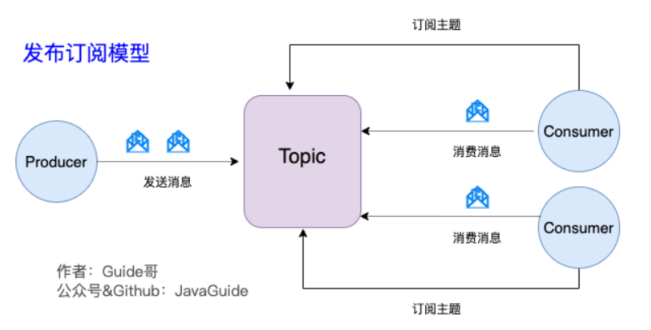
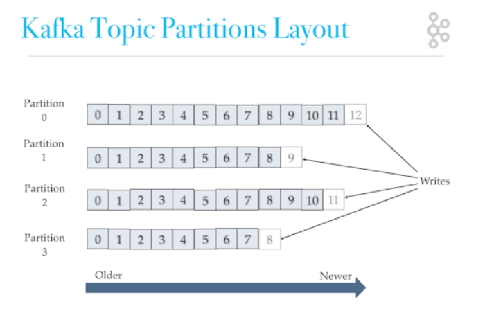

### Kafka是什么？

Apache公司开源的，使用Scala和Java语言开发的

Kafka是一个分布式流式处理平台，流平台主要有三个关键功能：

- **消息队列：**发布和订阅消息流

- **容错的持久方式存储记录消息流：**Kafka会把消息持久化到磁盘中，有效避免了消息丢失的风险

- **流式处理平台：**在消息发布的时候进行处理，Kafka提供了一个完整的流式处理类库

  > 所谓流式数据，指的是无边界数据集的抽象表示，无边界意味着无限和持续增长，无边界数据集之所以是无限的，是因为随着时间的推移，新的记录会不断加进来
  >
  > 流式处理指的是持续的从一个无边界的数据集中读取数据，然后对他们进行处理并生成结果。


### Kafka的主要应用场景

Kafka主要有两大应用场景

- **消息队列：**建立实时流数据管道，以可靠地在系统或应用程序之间传递消息
- **数据处理：**构建实时的流数据处理程序来转换或处理数据流


### 和其他消息队列相比，Kafka的优势

实际上，Kafka最开始的并不是作为消息队列，而是用于处理海量的日志数据，因此，早期的Kafka在消息队列领域存在一些问题，比如消息丢失、不保证消息可靠性等，但随着后续的发展，这些短板都被修复，所以，之前的说法：**Kafka作为消息队列不可靠已经过时了**

那么，Kafka相较于RocketMQ和RabbitMQ存在哪些优势呢？我个人认为主要体现在以下两点：

- **极致的性能：**基于Scala和Java语言开发，设计中大量使用了批量处理和异步的思想，最高可每秒处理千万级别的消息
- **生态系统兼容性无可匹敌：**Kafka与周边系统的兼容性是最好的，尤其是在大数据和流计算领域


### Kafka的消息模型

正如我们在前面文件中提到的，最早期的队列模型是点对点的，即一条消息只能被一个消费者使用，未被消费的消息在队列中保留直到被消费或超时。这样队列模型存在的问题是：无法实现一个消息想要被多个消费者使用

> 可能会说：要是给每个消费者提供一个消息队列呢？首先这样的做法是会造成严重的资源浪费，第二这种方式与消息队列的初衷相悖

因此，为了解决点对点队列模型中存在的问题，出现了发布-订阅模型，**Kafka的消息模型就是发布-订阅模型**，发布-订阅模型使用主题（Topic）作为消息载体，类似于广播模式，在该模型中，如果只有一个订阅者，那么他就和点对点模型基本一致了，**所以发布-订阅模型在功能层面上是可以兼容点对点队列模型的。**



**Kafka中是没有队列这个概念的，与之对应的是Partition**


### Producer、Consumer、Broker、Topic、Partition


1. **Producer（生产者）：**产生消息的一方
2. **Consumer（消费者）：**消费消息的一方
3. **Broker（代理）：**可以看作是一个独立的Kafka实例，多个Kafka Broker组成一个Kafka Cluster

每个broker中包含了Topic和Partition这两个重要的概念

4. **Topic（主题）：**Producer将消息发送到特定的主题，Consumer通过订阅特定的Topic来消费消息

5. **Partition（分区）：**Partition属于Topic的一部分，一个Topic可以有多个Partition，并且同一个Topic下的Partition可以分布在不同的Broker上，这也就表明了一个Topic可以横跨多个Broker

   > 分区的目的：对于集群来说，有利于实现负载均衡，对于消费者来说，可以提高并发度，提高效率

此外，Kafka中还有其他的名词，**Consumer Group（消费组）**，一个消费组中包含一个或多个消费者，使用多分区+多消费的方式可以极大提高数据下游的处理速度，同一消费组中的消费者不会重复消费消息，同样的，不同消费组中的消费者不会互相影响；

**Record**是实际写入Kafka中并可以被读取的消息记录，每个Record中包含了key、value和timestamp

> [kafka key的作用一探究竟，详解Kafka生产者和消费者的工作原理！ - 腾讯云开发者社区-腾讯云 (tencent.com)](https://cloud.tencent.com/developer/article/1815648)


### Kafka的多副本机制

Kafka为Partition（分区）引入了多副本（Replica）机制，Partition的多个副本中会有一个leader，其他的副本均称为follower，Producer发送的消息会被发送到leader中，然后follower从leader中拉取消息进行同步。

> Producer和Consumer均只和leader副本交互，follower本质上是对leader副本的拷贝，这样能够保证消息存储的安全性，当leader副本发生故障时会从follower中选出一个新的leader，但是follower中如果有和leader同步程度达不到要求的参加不了leader的选举


**Kafka多分区和多副本机制的好处：**

1. Kafka通过给特定Topic指定多个Partition，而各个Partition可以分布在不同的Broker上，这样便能提供比较好的并发能力
2. Partition可以指定对应的Replica数，这也极大地提高了消息存储的安全性，提高了容灾能力，不过也相应的增加了所需要的存储空间


### Zookeeper在Kafka中的作用

Zookeeper主要为Kafka提供元数据的管理的功能，具体如下：

1. **Broker注册：**在Zookeeper上会有一个专门用来**进行Broker服务器列表记录**的节点，每个Broker在启动时，都会到Zookeeper上进行注册，即到`brokers/ids`下创建属于自己的节点，每个Broker就会将自己的IP地址和端口等信息记录到该节点中去
2. **Topic注册：**在Kafka中，同一个Topic的消息会被分成多个分区并将其分布在多个Broker上，这些分区信息及与Broker的对应关系也都是由Zookeeper在维护，
3. **负载均衡：**对于同一个Topic的不同Partition，Kafka会尽力将这些Partition分布到不同的Broker服务器上，当生产者产生消息后也会尽可能投递到不同Broker的Partition中，当Consumer消费时，Zookeeper可以根据当前的Partition数量以及Consumer数量来实现动态负载均衡
4. ...


### Kafka如何保证消息的消费顺序

Kafka中Partition是真正保存消息的地方，我们发送的消息都被放在了这里，而我们得Partition又存在于Topic这个概念中，我们可以给特定Topic指定多个Partition，每次添加消息到Partition中都会采用尾插法的方式，因此，**Kafka只能够保证Partition中的消息是有序的**

> 消息在被追加到Partition的时候会分配一个偏移量（offset），Kafka通过偏移量来保证消息在分区内的顺序性
>
> offset保证的是分区的有序性，而不是队列的有序性，即局部有序性



因此，有一种很简单的保证消息消费顺序的方法就是：**一个Topic只对应一个Partition**，这样可以解决问题，但破坏了Kafka的初衷

Kafka在发送一条消息时，可以指定Topic、Partition、key、data4个参数，如果在发送消息的时候指定了Partition的话，所有的消息都会被发送到指定的Partition中，并且，同一个key的消息可以保证只发送到同一个Partition中，这个我们可以采用表/对象的id作为key


### Kafka如何保证消息不丢失

1. **生产者丢失消息的情况**

   发送消息之后，消息可能会因为网络问题并没有发送过去

   所以，我们不能默认在调用send之后消息就发送成功了，为了确定是否发送成功，我们需要判断一下消息的发送结果，但需要注意的是Producer调用的send方法是异步操作。

   ```java
   // 通过get方法获取调用结果，但这样也会让他变成同步操作，不推荐！！！
   SendResult<String, Object> sendResult = kafkaTemplate.send(topic, o).get();
   if (sendResult.getRecordMetadata() != null) {
     logger.info("生产者成功发送消息到" + sendResult.getProducerRecord().topic() + "-> " + sendRe
                 sult.getProducerRecord().value().toString());
   }
   ```

   可以通过为其增加回调函数的方式

   ```java
   ListenableFuture<SendResult<String, Object>> future = kafkaTemplate.send(topic, o);
   
   future.addCallback(result -> logger.info("生产者成功发送消息到topic:{} partition:{}的消息", result.getRecordMetadata().topic(), result.getRecordMetadata().partition()),
                   ex -> logger.error("生产者发送消失败，原因：{}", ex.getMessage()));
   // 如果消息发送失败，我们检查失败的原因即可
   ```

   **另外这里推荐为 Producer 的`retries `（重试次数）设置一个比较合理的值，一般是 3 ，但是为了保证消息不丢失的话一般会设置比较大一点。设置完成之后，当出现网络问题之后能够自动重试消息发送，避免消息丢失。另外，建议还要设置重试间隔，因为间隔太小的话重试的效果就不明显了，网络波动一次你3次一下子就重试完了**

   

2. **消费者丢失消息的情况**

   我们前面说了，当消息被追加到Partition的时候会分配一个特定的偏移量（offset），**offset表示Consumer当前消费到的Partition（分区）的所在的位置，**Kafka通过偏移量可以保证消息在分区中的顺序

   当消费者拉取到了分区的某个消息之后，消费者会自动提交offset，自动提交的话会有一个问题，试想一下，当消费者刚拿到这个消息准备进行真正消费的时候，突然挂掉，消息实际上没有被消费，但是offset却被自动提交了

   解决这个问题的方法相当粗暴，那就是**关闭自动提交offset，每次在真正消费完消息之后再自己手动提交offset**，这种方法同样会带来问题，当消费者处理完消息之后，提交offset之前挂掉了，会导致消息被重复消费

   

3. **Kafka弄丢了消息**

   我们知道Kafka为Partition引入了多副本（Replica）机制，如果leader副本所在的broker挂掉，需要在其他的follower副本中重新选出一个leader，**但是如果leader的数据还有一些没有被follower副本同步的话，就会造成消息丢失。**

   解决方法

   **设置`acks=all`**，`acks`是Kafka生产者很重要的一个参数，acks的默认值即为1，代表我们的消息被leader副本接收之后就算成功发送，当我们配置`acks=all`，acks是Kafka生产者很重要的一个参数，`acks`的默认值即为1，代表我们的消息被leader副本接收之后就算被成功发送，当我们配置`acks=all`表示只有所有[ISR(In-Sync Replicas), ISR+OSR=AR](https://blog.csdn.net/daima_caigou/article/details/109390705)列表的副本全部收到消息时，生产者才会接收到来自服务器的响应，这种模式是最高级别的，也是最安全的，可以保证不止一个Broker接收到了消息，该模式的延迟会很高

   **设置`replication.factor >= 3`**，为了保证leader副本能有follower副本能同步消息，我们一般会为Topic设置`replication.factor >= 3`，这样就保证了每个分区至少有三个副本，虽然造成了数据冗余，但是带来了数据的安全性。

   **设置`min.insync.replicas > 1`，**一般情况下我们还需要设置`min.insync.replicas > 1`，这样配置代表消息至少要被写入到2个副本才算发送成功，`min.insync.replicas`的默认值是1，在实际生产中应该尽量避免默认值1

   但是为了保证整个Kafka服务的高可用性，需要确保`replication.factor > min.insync.replicas`，因为如果两者相等，有一个副本挂掉，整个分区就无法正常工作了，这明显违反高可用性，所以一般的配置是`replication.factor=min.insync.replicas+1`

   **设置`unclean.leader.election.enable=false`，**这样设置了之后，当leader副本挂掉，重新选择的时候就不会在那些和leader同步程度不够的副本中选出leader，这样降低了消息丢失的可能性

   

### Kafka如何保证消息不被重复消费

**Kafka出现消息重复消费的原因**

- 消费者对于已经消费了的消息并没有成功提交offset（根本原因）
- Kafka侧由于服务端处理业务时间长或者网络链接等等原因让Kafka认为服务假死，出发了分区balance

**解决方案**

- 消费消息 服务做幂等校验，比如Redis的set、MySQL的主键等天然的幂等功能，这种方法最有效。

  > [kafka消费消息时的幂等性_kafka消费幂等性_MiMsmile的博客-CSDN博客](https://blog.csdn.net/u011439839/article/details/90115573)

- 将`enable.auto.commit`参数设置为false，关闭自动提交，开发者在代码中手动提交offset，那么这里就有了一个问题：什么时候提交offset合适？

  - 处理完消息再提交：依旧有消息重复消费的风险，和自动提交一样
  - 拉取到消息即提交：会有消息丢失的风险，允许消息延时的场景，一般会采用这种方法，然后通过定时任务在业务不繁忙的时候（比如凌晨）做数据兜底


### Kafka为什么这么快

1. Partition**顺序读写**，能够充分利用磁盘的特性（寻道距离短），这是基础。

   > 顺序IO在大多数的存储介质上都比较快

2. 使用**`mmap`系统调用**，实现用户空间和内核缓冲区之间的映射，将Producer生成的数据持久化到Broker中，实现快速写入

3. 使用**Page cache（页缓存）**内核缓冲区，因为磁盘和内存的访问速度相差很多，所以在用户缓冲区和磁盘之间加上了一层内核缓冲区—Page cache，Page cache通常具有预读功能，即一次性能够加载多页数据到内核缓冲区中

   > 预读功能也是对局部性原理的充分应用，刚被访问的数据再次被访问的概率比较到，时间局部性原理

4. **零拷贝**技术的应用，使用sendfile来代替传统的read、write系统调用，从4次上下文切换减少到了2次上下文切换，此外，传统文件传输中还需要经历4次内存拷贝，其中包含两次CPU拷贝和两次DMA拷贝，使用零拷贝技术之后，能够减少一次CPU拷贝，而对于最理想的零拷贝只需要经过两次DMA拷贝，期间无需CPU的参与，但是这种方式需要硬件支持scatter-gather特性

5. **批量处理**，Broker能够合并小的请求，然后以流的方式进行交互，而对于Partition，Broker会尽力地将这些Partition均匀的交给消费组中的Consumer进行处理

6. **Pull模式**，通过Pull模式拉取消息进行消费，与消费者的处理能力相符

> Kafka的瓶颈通常是网络，而不是磁盘，即使它会将消息持久化到磁盘中

> 参考：[聊聊 Kafka： Kafka 为啥这么快？_kafka 为什么快_老周聊架构的博客-CSDN博客](https://blog.csdn.net/riemann_/article/details/119515188#:~:text=Kafka 利用了一种分段式的、只追加,(Append-Only) 的日志，基本上把自身的读写操作限制为顺序 I%2FO，也就使得它在各种存储介质上能有很快的速度。)


### Producer如何优化写速度

- 增加线程。
- 提高 batch.size。
- 增加更多 producer 实例。
- 增加 partition 数。
- 设置 acks=-1 时，如果延迟增大，可以增大 num.replica.fetchers（follower 同步数据的线程数）来调解。
- 跨数据中心的传输：增加 socket 缓冲区设置以及 OS tcp 缓冲区设置。
  

### Producer写入消息时的路由策略

首先，Producer采用push的方式将消息写入到Broker中，每条消息都会被append到partition中，顺序读写

至于会发送到哪一个Partition中，其路由机制为：

- 指定了Partition，则直接发送到该Partition中

- 未指定Partition，但指定了key，通过对key的value进行hash选出一个partition

  > 比如指定订单id为key，那么同一笔订单关联的所有数据可以发送到一个partition中，确保顺序性

- Partition和key均未指定，使用轮询选出一个Partition


### Kafka ACK机制

- `ACK=0`：生产者将数据发送出去之后就不管了，不用等待任何返回，这种策略下数据传输效率最高，但也是最不可靠的
- `ACK=1`：一个折衷的方案，也是Kafka的默认策略，生产者发送消息后，需要等到leader副本成功接收消息之后才算是发送成功。但这种情况下如果follower尚未同步数据而leader宕机则会导致数据丢失
- `ACK=-1`：生产者需要等待所有ISR列表中的follower都确认接受之后才算是成功发送一条消息，当 ISR 中所有 Replica 都向 Leader 发送 ACK 时，Leader 才 commit，这时候 Producer 才能认为一个请求中的消息都 commit 了。可靠性最高

> 值得注意的是，ACK=-1也不不能保证消息一定不丢失，如果partition只有一个副本，即只有一个leader，没有follower，那么即使它已经完成接收消息，但是接收消息后宕机了，一样会导致数据丢失


### Producer Delivery Guarantee（保证交付）机制

生产侧有三种策略来保证Delivery Guarantee

- At Most Once：消息可能会丢失，但决不会重复发送

- At Least Once：消息绝不会丢失，但可能会重复发送

- Exactly Once：每条消息肯定会被传输一次，且仅传输一次

  > 这一个通过上面两种机制，加上一定的规则来实现？？


### Consumer Delivery Guarantee 机制

消费侧同样有三种策略来保证Delivery Guarantee

- **收到消息后先提交后处理**

  一旦读取到数据就commit，如果consumer在commit后来不及处理数据就挂掉了，下次重新开始时就无法读到刚刚已经提交但没处理的数据了（丢失，对应At Most Once）

- **收到消息后先处理后提交**

  这种情况下处理完数据没来得及提交，会导致重复消费（At least once）


### Broker删除消息的策略

无论消息是否被消费，Kafka都会保留所有的消息，有两种策略可以删除旧数据：

- 基于时间：`log.retention.hours`
- 基于大小：`log.retention.bytes`

> Kafka读取特定消息的时间复杂度是$O(1)$


### Kafka创建Topic、删除Topic的流程

Topic会被存储到Zookeeper中，因此**创建主题的过程也就是让Zookeeper中写入数据的过程**

// 其余的还没看...


### Kafka的消费模式

Kafka采用拉取模式（PULL），**由消费者自己记录消费状态，每个消费者互相独立地读取每个分区的消息**，消费者拉取的最大上限通过最高水位（watermark）控制

> 生产者最新写入的数据如果还没有达到备份数量，则对消费者是不可见的

这种由消费者控制偏移量的优点是：消费者可以按照任意的顺序消费消息，比如消费者可以重置到旧的偏移量，重新处理之前已经消费过的消息，或者直接跳到最近位置，从当前时刻开始消费

> 在一些消息系统中，消息代理会在消息被消费之后立即删除消息。如果有不同类型的消费者订阅同一个主题，消息代理可能需要冗余地存储同一消息；或者等所有消费者都消费完才删除，这就需要消息代理跟踪每个消费者的消费状态，这种设计很大程度上限制了消息系统的整体吞吐量和处理延迟。Kafka 的做法是**生产者发布的所有消息会一致保存在 Kafka 集群中**，不管消息有没有被消费。用户可以通过设置保留时间来清理过期的数据，比如，设置保留策略为两天。那么，在消息发布之后，它可以被不同的消费者消费，在两天之后，过期的消息就会自动清理掉。


### Consumer的两套API

Kafka提供了两套Consumer API，分别是`The high-level Consumer API`和`The SimpleConsumer API`，其中high-level提供了一个消费数据的高层抽象，offset、partition、broker等对于用户来说都是透明的，而simple版本的API需要开发人员更多的关注细节，提供了更高的自由度

- high-level Consumer API提供了Consumer Group的语义，**一个消息只能被Group内的一个Consumer所消费**，且Consumer消费消息时不关注offset，最后一个**offset由Zookeeper保存**，同时high-level api还支持多线程消费，但需要注意：

  - 如果消费线程大于partition的数量，则有些线程将收不到消息
  - 如果消费线程小于partition的数量，则有些线程将收到多个partition的消息
  - 如果一个线程消费多个partition，则无法保证接收消息的顺序，只能保证partition内部有序

- simpleConsumer api为开发人员提供了更高的自由度，对partition有了更高的控制权，如多次消费一个消息，只消费partition中的部分消息等

  但是使用此API时，partition、broker、offset、leader等不再透明，需要业务去处理

  - 必须在应用程序中跟踪offset，从而确定下一条应该消费哪些消息
  - 应用程序需要通过程序获知每个partition的leader，同时还需要处理leader的变更


### Kafka消费组与partition的关系

在 Apache Kafka 中，消费组是一组具有相同消费逻辑的消费者实例的集合，它们协作地消费一个或多个主题的消息。而分区是主题（Topic）在 Kafka 集群中的物理分割，用于实现消息的并行处理和水平扩展。

对应关系如下：

1. 一个主题可以被分为多个分区。每个分区都是有序的，每条消息在一个分区中都有唯一的偏移量（Offset）。
2. 消费组可以订阅一个或多个主题，并且每个主题的每个分区只能被消费组中的一个消费者实例所消费。这意味着在一个消费组中，每个分区都只能由一个消费者实例来消费。
3. 如果一个主题有多个分区，而消费组中的消费者实例数量少于分区数量，则有些消费者实例可能会消费多个分区（一个消费者实例可以消费多个分区，但一个分区只能被一个消费者实例消费）。
4. 如果消费组中的消费者实例数量多于分区数量，则一些消费者实例将处于空闲状态，没有分区可以分配给它们进行消费。

这种分区和消费组的对应关系使得 Kafka 能够实现消息的并行消费和水平扩展。通过增加分区数和消费者实例数量，可以提高消费能力和吞吐量。另外，Kafka 还提供了动态重新平衡（Dynamic Rebalancing）机制，可以在消费者实例加入或退出消费组时自动重新分配分区，保持分区与消费者实例的对应关系。


### Kafka中的负载均衡策略

Kafka的负载均衡主要体现在partition分配，生产者往哪个partition上发送消息以及消费者消费哪个partition上的消息

- **分区分配**，kafka主题通常会被分成多个分区，这些分区通常分布在不同的broker上，这里的负载均衡指的是将分区分配到各个代理以确保各个代理的负载均衡，而具体的分区分配过程通常是由kafka集群中的控制器（Controller）负责的

- **生产者负载均衡**，对于生产者，负载均衡通常涉及将消息均匀地发送到不同的分区，以确保各个分区的负载均衡，提升整个kafka集群的性能，具体来说，如果生产者发送消息的时候没有指定key，那么就会使用轮询的方式来选择一个存活的partition，如果指定了key，那么就会发送到计算出来的partition上，无论该partition存活与否，都会发到这个partition上

- **消费者负载均衡**，kafka消费者通常是以消费者组（consumer group）的形式工作，每个消费者群组中包含一个或多个消费者，因此，对于消费者的负载均衡通常指的是怎样将一个消费者组中的消费者负载均衡，比如一共有1000w条消息，消费者组会使用负载均衡策略让该组中的消费者都消费25w条消息

  对于消费者负载均衡，具体的负载均衡策略有：

  - 轮询（Round Robin），这是最简单的分区分配策略，每个消费者依次分配一个分区，然后循环回来，这意味着每个消费者都会均匀地处理分区，但是如果有消费者处理速度较慢，可能会导致分区处理不均匀。
  - 范围分配（Range），这种策略是kafka的默认策略，将分区划分为范围，然后将每个范围分配给一个消费者，例如，一个范围可以包括一组连续的分区，然后将这些范围分配给不同的消费者，这可以确保每个消费者都有一定数量的连续分区来处理
  - 粘性分配（Sticky），这种策略试图保持先前的分区分配状态，以减少重新分配的开销**，它通常用于保持消费者与特定分区的关联性，**以避免数据局部性的丧失，粘性分配可以减少分区重新分配的频率
  - 一致性哈希（Consistent Hashing），使用哈希函数将分区映射到一组消费者，并确保在消费者加入或退出时最小化分区的重新分配，这种策略对于保持分区分配的稳定性和降低分区分配时的开销非常有效

  > 要使用特定策略，您需要配置消费者组的 `partition.assignment.strategy` 参数


### Kafka中的Controller选举机制

在kafka集群启动时，会自动选举一台broker作为controller来管理整个集群，选举的过程是集群中每个broker都会尝试在zookeeper上创建一个/controller临时节点，但是**zookeeper会保证有且仅有一个broker能够创建成功**，这个broker就会成为集群的总控制器controller。

当这个controller所在的broker宕机后，此时zookeeper上的/controller临时节点会消失，集群里其他broker会一直监听这个临时节点，发现临时节点消失了，就会再次竞争创建/controller节点，zookeeper又会保证只有一个节点能够创建成功。

> Controller节点的作用
>
> 1. 负责监控整个Kafka集群的状态，比如broker的上线、下线，分区的重新分配等
> 2. 当有新的主题被创建或有新的broker加入集群时，Controller负责根据分区的副本策略，为每个分区分配Leader副本和Follower副本
> 3. 负责监控和管理分区副本的状态，它会检测副本的健康状况，在副本出现故障或者不可用时，执行副本的重新分配和恢复操作
> 4. 负责管理主题的配置信息，包括分区数、副本数、保留策略等，当配置发生变化时，Controller会将配置更新通知给集群中的其他broker


### Kafka Partition Leader副本的选举策略

在 Kafka 中，每个分区都有一个 Leader 副本（Leader Replica），它负责处理读取和写入请求。当 Leader 副本出现故障或不可用时，Kafka 会执行副本选举策略来选择一个新的副本作为新的 Leader。也是controller来完成partition leader的选择，leader的作用是和消费者与生产者进行交互，follower仅仅是对leader做数据冗余

Kafka副本选举策略遵循以下原则：

1. ISR（In-Sync Replica）中的副本：Kafka 维护一个 ISR 列表，其中包含了与 Leader 副本保持同步的副本。当 Leader 副本不可用时，首先会从 ISR 列表中选择一个副本作为新的 Leader。这是因为 ISR 中的副本已经和 Leader 副本保持了一定程度的数据同步，能够更快地恢复数据的一致性。
2. 优先选择在 ISR 中最新的副本：如果 ISR 中有多个副本可选，Kafka 会选择在 ISR 中最新（最接近 Leader）的副本作为新的 Leader。这可以确保新的 Leader 具有最新的数据，并且减少了数据的复制和同步成本。
3. 副本的状态：Kafka 还会考虑副本的状态信息，例如副本是否处于同步状态、是否有数据可用等。通常情况下，优先选择处于同步状态且有可用数据的副本作为新的 Leader。
4. 随机选择：如果以上条件无法满足或没有 ISR 中的副本可选，Kafka 将从剩余的副本中随机选择一个作为新的 Leader。这种情况下，副本可能需要进行较长时间的数据同步和复制。


### 消费组中Leader的选举策略

在 Kafka 中，消费组（Consumer Group）内部的 Leader 选举策略是由协调器（Coordinator）负责执行的。

> 一个消费组对应一个组协调器，而一个组协调器可能对应了多个消费组，比如对于一个比较小的Kafka集群，可能只有一个组协调器来管理所有的消费组。而在大规模的集群中，会有多个组协调器以提高处理能力和负载均衡。
>
> 其实，每个消费者内部还有一个协调器，称作消费者协调器，功能上类似于消费者做操作的代理类（其实不是代理类）

消费组中的 Leader 选举策略主要涉及以下几个方面：

1. 加入消费组时的 Leader 选举：当消费者实例加入消费组时，协调器会执行 Leader 选举过程来选择一个消费者实例作为消费组的 Leader。一般情况下，协调器会优先选择之前已经存在的消费者实例作为 Leader，这有助于保持稳定的消费组结构和分区分配。如果之前的 Leader 已经不可用，则会执行新的 Leader 选举。
2. Leader 失效时的 Leader 选举：当消费组中的 Leader 消费者实例失效或退出时，协调器会触发新的 Leader 选举过程。这时，协调器会根据一定的策略从剩余的活跃消费者实例中选择一个作为新的 Leader。一种常见的策略是选择消费组中的下一个消费者实例作为新的 Leader，即按照消费者实例加入的顺序进行轮询。

> 最开始时，一般是选择最先进入消费组的消费者作为leader，leader负责分配消费方案，指定某个消费者应该消费哪些topic的哪些partition

需要注意的是，消费组中的 Leader 选举过程是在协调器层面上进行的，而不是在分区（Partition）的级别上。消费者组内的消费者实例是协作消费的，它们并不直接参与分区的 Leader 选举和切换。与消费组的 Leader 选举是独立的概念。

总之，消费组中的 Leader 选举策略由协调器执行，它在消费者实例加入、失效或退出时触发选举过程，以选择一个消费者实例作为消费组的 Leader。这样可以保证消费组的正常运行和负载均衡，并在 Leader 失效时能够及时选举出新的 Leader，确保消费的连续性和可靠性。


**消费者leader的作用**

- **进行分区分配，**决定哪个消费者处理哪些分区，以确保负载均衡和高效的消息处理
- **<font color=red>提交消费位移，</font>**leader负责跟踪每个消费者的位移（offset），以确保下一次的消费能够从正确的地方开始
- **处理消费者加入和离开，**leader处理新消费者加入消费组和旧消费者离开的情况，它确保加入的消费者获得分区分配，并更新消费者列表
- **监控和协调，**监听消费组内每个消费者的健康状态，如果某个消费者故障或者离开了消费者组，leader可以及时察觉并触发分区重新分配


### 消费组中的Rebalance机制

在 Kafka 中，消费组（Consumer Group）中的 Rebalance 机制是为了实现消费者实例之间的负载均衡和故障容错而设计的。当消费者实例加入或离开消费组，或者有新的主题被订阅时，会触发 Rebalance 过程。同样，**消费者组的再平衡也是由组协调器（Coordinator）负责执行的。**

> 触发Rebalance的常见情况：
>
> 1. 消费者所在的机器重启或者宕机了
> 2. 动态给topic增加了分区
> 3. 消费者组订阅了更多的主题

Rebalance 过程的主要步骤如下：

1. 检测变化：当消费者实例加入或离开消费组，或者有新的主题被订阅时，协调器（Coordinator）会检测到消费者组的变化。

2. 分区分配：协调器根据预定义的分区分配策略，重新分配主题的分区给消费者实例。分区的分配考虑消费者实例的数量、能力和当前的负载情况，旨在实现负载均衡。

3. 消费者停止消费：在 Rebalance 过程中，消费者实例被通知停止消费，并将当前正在处理的分区提交偏移量。这确保了在 Rebalance 过程中不会出现重复消费或消息丢失的情况。

4. 分区分配通知：协调器将新的分区分配结果通知给消费者实例。消费者实例收到分配通知后，会重新分配负责的分区并开始消费。

通过 Rebalance 过程，Kafka 实现了消费者实例之间的负载均衡。每个消费者实例都被分配一部分主题的分区，使得消息的消费能够并行进行，提高整体的消费能力。当有新的消费者加入或离开消费组时，或者有主题的分区发生变化时，Rebalance 机制能够自动触发，并重新分配分区，确保消费者组的稳定运行。

需要注意的是，**Rebalance 过程会导致消费者实例在一段时间内停止消费，因此在设计消费者应用程序时，需要考虑到 Rebalance 的影响，确保消费者实例能够正确处理和提交偏移量，以避免重复消费或消息丢失的问题。**


### Rebalance分区分配策略（其实就是消费者组的负载均衡）

分区的所有权从一个消费者转移到另一个消费者，这样的行为叫做再均衡

在 Kafka 中，当消费者加入或离开消费组、主题的分区数发生变化时，会触发 Rebalance 过程，重新分配分区给消费者。Rebalance 过程中采用的分区分配策略可以通过配置 `partition.assignment.strategy` 来指定，默认的分配策略是 `Range`。

以下是两种常见的 Rebalance 分区分配策略：

1. Range 分配策略（Range Assignment Strategy）：
   - Range 分配策略将主题的分区按照分区编号范围划分给消费者。例如，有一个主题有 10 个分区，消费者实例 A、B、C 加入消费组。Range 分配策略可以将分区 0-2 分配给消费者 A，分区 3-5 分配给消费者 B，分区 6-9 分配给消费者 C。
   - 这种策略适用于分区的负载均衡，每个消费者负责一定范围的分区。

2. Round Robin 分配策略（RoundRobin Assignment Strategy）：
   - Round Robin 分配策略将主题的分区依次轮流分配给消费者。例如，有一个主题有 10 个分区，消费者实例 A、B、C 加入消费组。Round Robin 分配策略可以将分区 0 分配给消费者 A，分区 1 分配给消费者 B，分区 2 分配给消费者 C，然后再次轮回，将分区 3 分配给消费者 A，分区 4 分配给消费者 B，以此类推。
   - 这种策略适用于简单的分区分配，按照消费者实例的顺序依次分配分区。

除了以上两种常见的分配策略，Kafka 还提供了自定义的分配策略接口，可以根据特定需求实现自定义的分配逻辑。通过实现自定义的分配策略，可以根据消费者实例的特性、负载情况等因素来进行灵活的分区分配。


