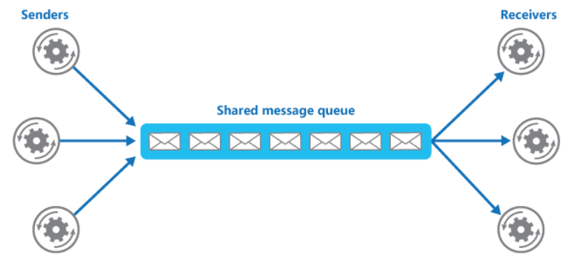
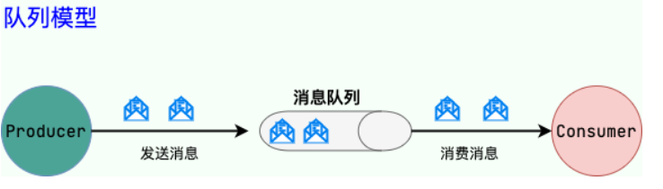

### 什么是消息队列

我们可以把消息队列看作是一个存放消息的容器，当我们需要使用消息的时候，直接从容器中取出来即可，由于Queue是一种先进先出的数据结构，所以消费消息时也是按照顺序来消费的。

参与消息传递的双方成为生产者和消费者，生产者负责发送消息，消费者负责处理消息

> 在操作系统中，消息队列作为进程之间通信的一种方式，和这里提到的消息队列是有一些区别的，这里的消息队列更多的是作为一种中间件，实现各个服务以及系统内部各个组件/模块之间的通信。

### 消息队列的作用

1. **通过异步处理提高系统性能（减少响应所需时间）**

   生产者将消息放入消息队列之后，立刻返回，随后消费者在处理这条消息。**在使用消息队列进行异步处理之后，通常需要对业务流程进行修改。**

   > 比如用户提交订单之后，订单数据写入消息队列，但不能马上给用户返回成功，需要等到消息队列的订单消费者进程真正处理完该订单之后，甚至出库后，再通过短信或邮件的形式来通知用户订单成功，以免交易纠纷。

2. **削峰/限流**

   **先将短时间高并发产生的事务消息存储在消息队列中，然后后端服务再慢慢根据自己的能力去消费这些信息，这样就能避免直接把后端服务打挂**

   > 在电子商务一些秒杀、促销活动中，合理使用消息队列可以有效抵御促销活动刚开始大量订单涌入对系统的冲击。

3. **降低系统耦合度**

   

   从上图中可以看出，**消息队列可以使用发布-订阅模式工作，生产者发布消息，一个或多个消费者订阅消息，生产者和消费者之间没有直接耦合**，对于生产者而言，它只需要把消息发送到消息队列即可，对于消费者来说，他无需关注消息的来源，只需要对消息进行处理，对于新增业务，如果对消息感兴趣，即可订阅该消息，对原有系统和业务没有任何影响，从而实现网站业务的可扩展性设计。

### 使用消息队列带来的问题

1. **系统可用性降低：**在加入mq之前，无需考虑消息丢失或者mq挂掉等问题
2. **系统复杂度升高：**加入mq之后，还得考虑消息是否被重复消费，处理消息丢失等情况、保证消息传递的顺序性等问题。
3. **一致性问题：**如果消息没有被消费者正确消费，就会导致数据不一致的问题

### JMS和AMQP

JMS的全称是Java Message Service，是Java的消息服务，**JMS API是一个消息服务的标准或规范，**允许应用程序组件基于Java EE平台创建、发送、接收和读取消息，它使分布式通信耦合度更低，消息服务更加可靠以及异步性。

JMS定义了五种不同的消息正文格式以及调用的消息类型，允许你发送并接受一些不同形式的数据

- StreamMessage：Java原始值的数据流
- MapMessage：map类型的消息
- TextMessage：字符串类型的消息
- ObjectMessage：序列化Java对象的消息
- BytesMessage：字节格式的消息

**JMS两种消息模型**

1. **点到点模型（P2P）**

   **使用队列作为消息载体，一条消息只能被一个消费者使用，未被消费的消息在队列中保留直到被消费或超时**

   > 比如：我们生产者发送 100 条消息的话，两个消费者来消费一般情况下两个消费者会按照消息发送的顺序各自消费一半（也就是你一个我一个的消费）

   

2. **发布-订阅模型（Pub-Sub）**

   **使用主题（Topic）作为消息载体，类似于广播模式**，生产者发布一条消息，该消息通过主题传递给所有的订阅者（消费者），在一条消息广播之后才订阅的用户是收不到这条消息的

AMQP全称是Advanced Message Queuing Protocol，**高级消息队列协议**，一个提供统一消息服务的应用层标准（二进制应用层协议），兼容JMS，RabbitMQ就是基于此协议实现的。

**JMS V.S. AMQP**

| 对比方向       | JMS            | AMQP                                                         |
| -------------- | -------------- | ------------------------------------------------------------ |
| 定义           | API            | 协议                                                         |
| 跨语言         | 否（Java）     | 是                                                           |
| 跨平台         | 否（JVM）      | 是                                                           |
| 支持消息类模型 | 上面提到的两种 | 五种：：①direct exchange；②fanout exchange；③topic change；④headers exchange；⑤system exchange。本质来讲，后四种和 JMS 的 pub/sub 模型没有太大差别，仅是在路由机制上做了更详细的划分 |
| 支持的消息类型 | 上面提到的五种 | byte[]（二进制）                                             |

**总结一下，两者的区别：**

1. AMQP是一个应用层的协议，JMS是一套API规范，在Java体系中，多个客户端可以通过JMS进行交互，不需要修改代码，但是对跨平台的支持较差，而AMQP天然具有跨平台、跨语言特性
2. JMS支持TextMessage、ObjectMessage等复杂的消息类型，而AMQP只支持byte[]消息类型（对于复杂的消息类型可以序列化后在发送）
3. AMQP可以通过Exchange提供的路由算法支持多种路由方式来传递消息到消息队列，而JMS仅支持队列和主题/订阅方式两种

