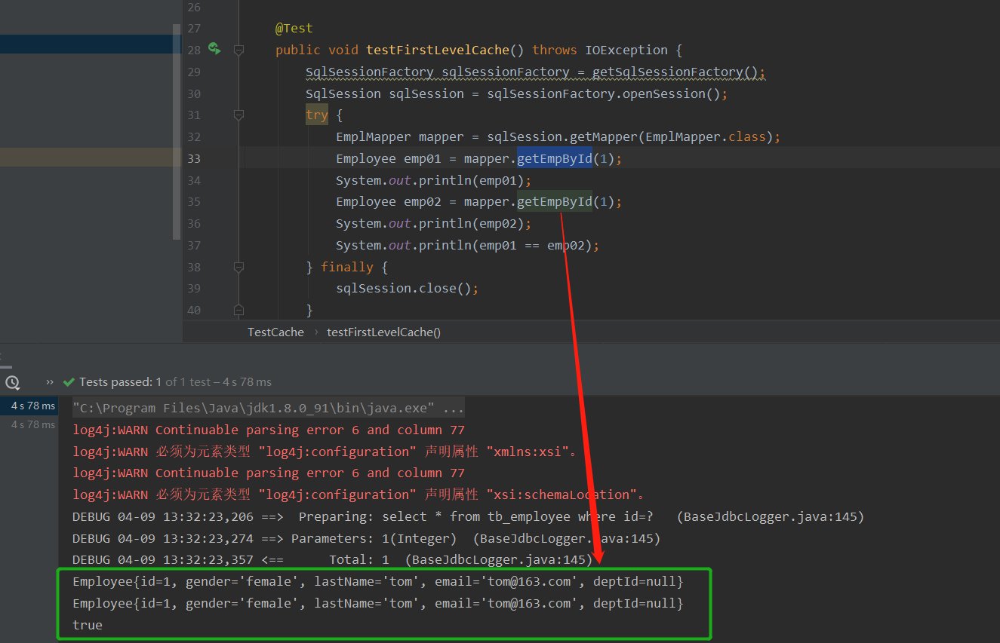
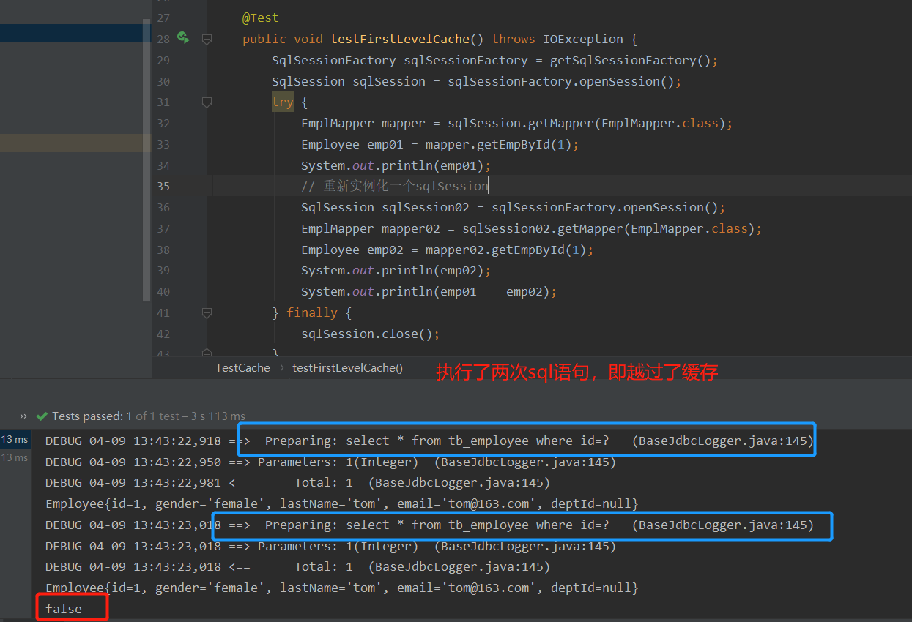
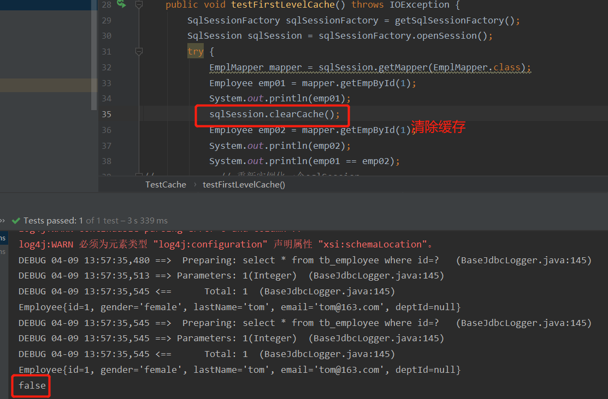

### `MyBatis`简介

最开始对数据库进行操作是使用`JDBC`等一系列的操作

`JDBC --> Dbutils(QueryRunner) --> JdbcTemplate`，从`jdbc`逐步演化到了`JdbcTemplate`这种工具，流程如下


上面的这些方式功能单一，`sql`语句写在`java`代码中，这是一种硬编码高耦合的方式**，维护不易且实际开发需求中`sql`是有变化**，频繁修改的情况多见


因此，后续又发展出了`Hibernate`这种**全自动全映射`ORM`框架**，旨在消除`sql`


这种框架就是将 从编写`sql`到封装结果 这些过程都“黑箱操作”，程序员只需要编写对应的`JavaBean`，便能够映射出数据库中的数据，而无需处理`sql`语句等中间过程（避免了所有的 `JDBC` 代码和手动设置参数以及获取结果集），虽然简化了编码，但是也存在一些问题即`sql`语句失去了灵活性，而且一些性能优化也做不了了。而如果需要定制化`sql`语句，就需要在学习`HQL`，这样便加大了学习难度。


因此，便出现了`MyBatis`，一种**半自动的轻量级框架**，`MyBatis`相对于`Hibernate`这种全自动框架的优化之处就在于将编写`sql`剥离出来，通过对应的配置文件来实现定制化`sql`。


`MyBatis`可以使用简单的`XML`或注解用于配置和原始映射，将接口和`Java`的`POJO（Plain Old Java Objects`，普通的`Java`对象`）`映射成数据库中的记录。


### `MyBatis --- HelloWorld`（参照官方文档）

- 创建一张测试表 
- 创建对应的`JavaBean`
-  创建`mybatis`配置文件，`sql`映射文件 
- 测试


#### 老做法 

**从`MyBatis`配置文件中创建`sqlSessionFactory`**

**`MyBatis`全局配置文件  ---  `mybatis-config.xml`**

```xml
<?xml version="1.0" encoding="UTF-8" ?>
<!DOCTYPE configuration
        PUBLIC "-//mybatis.org//DTD Config 3.0//EN"
        "http://mybatis.org/dtd/mybatis-3-config.dtd">
<configuration>
    <environments default="development">
        <environment id="development">
            <transactionManager type="JDBC"/>
            <dataSource type="POOLED">
                <property name="driver" value="com.mysql.cj.jdbc.Driver"/>
                <property name="url" value="jdbc:mysql://localhost:3306/mybatis?serverTimezone=UTC"/>
                <property name="username" value="root"/>
                <property name="password" value="kyrie123"/>
            </dataSource>
        </environment>
    </environments>
    <mappers>
        <mapper resource="EmployeeMapper.xml"/>
    </mappers>
</configuration>
```

**测试类**

```java
   public void test() throws IOException {
        /**
         * 1.根据 mybatis-config.xml文件创建sqlSessionFactory
         * 2.sql映射文件：配置了每一个sql，以及sql的封装规则等
         * 3.将sql配置文件注册到mybatis的全局配置文件中
         * 4.写代码：
         *    4.1)  根据全局配置文件得到sqlSessionFactory
         *    4.2)  使用sqlSessionFactory这个工厂对象的到sqlSession对象，使用sqlSession来完成增删改查操作
         *          一个sqlSession就表示和数据库一次会话，用完后要及时关闭
         *    4.3)  使用sql的唯一标识来告诉MyBatis要执行哪一个sql，为了避免冲突使用namespace+id。sql都保存在了sql的映射文件中
         * */
        String resource = "mybatis-config.xml";
        InputStream inputStream = Resources.getResourceAsStream(resource);
        SqlSessionFactory sqlSessionFactory = new SqlSessionFactoryBuilder().build(inputStream);

        // 2.获取sqlSession实例，能直接执行已经映射了的sql语句
        SqlSession sqlSession = sqlSessionFactory.openSession();
        try {
            /**
             * selectOne方法参数
             * 第一个参数：sql语句的唯一标识
             * 第二个参数：sql语句所需要的参数
             * */
            Employee employee = sqlSession.selectOne("com.atguigu.EmployeeMapper.selectEmp",1);
            System.out.println(employee);
        } finally {
            sqlSession.close();
        }
    }
```

**`sql`映射类  ---  `EmployeeMapper`**

```xml
<?xml version="1.0" encoding="UTF-8" ?>
<!DOCTYPE mapper
        PUBLIC "-//mybatis.org//DTD Mapper 3.0//EN"
        "http://mybatis.org/dtd/mybatis-3-mapper.dtd">
<mapper namespace="com.atguigu.EmployeeMapper">
    <select id="selectEmp" resultType="com.atguigu.bean.Employee">
    select * from tb_employee where id = #{id}
 </select>
</mapper>

        <!--
          namespace  名称空间
          id         唯一标识
          resultType 返回值类型
          #{id}      从传递过来的参数中取出id
          -->
```


上面的实现是比较原始的一种`MyBatis`实现，现在多采用**接口式编程**

#### 接口式编程 

这种编程方法需要改动的地方有

- ```xml
  <?xml version="1.0" encoding="UTF-8" ?>
  <!DOCTYPE mapper
          PUBLIC "-//mybatis.org//DTD Mapper 3.0//EN"
          "http://mybatis.org/dtd/mybatis-3-mapper.dtd">
  <mapper namespace="com.atguigu.mapper.EmpMapper">
      <select id="getEmployeeById" resultType="com.atguigu.bean.Employee">
      select * from tb_employee where id = #{id}
   </select>
  </mapper>
  ```

  `namespace`名称空间要改成`mapper`接口的路径，`id`改成接口中对应的方法名，因为`MyBatis`提供了一个功能：**接口和配置文件动态绑定，同时将接口中的方法和`<select>`标签绑定**

- ```java
  public interface EmpMapper {
      public Employee getEmployeeById(Integer id);
  }
  ```

- ```java
  public void test01() throws IOException {
      String resource = "mybatis-config.xml";
      InputStream inputStream = Resources.getResourceAsStream(resource);
      SqlSessionFactory sqlSessionFactory = new SqlSessionFactoryBuilder().build(inputStream);
  
      SqlSession sqlSession = sqlSessionFactory.openSession();
  
      try {
          // 获取接口的实现类对象
          EmpMapper mapper = sqlSession.getMapper(EmpMapper.class);
          Employee employeeById = mapper.getEmployeeById(1);
          System.out.println(employeeById);
          System.out.println(mapper.getClass());  // class com.sun.proxy.$Proxy6  代理对象
      } finally {
          sqlSession.close();
      }
  }
  ```

  由上面`mapper`的类型为`Proxy`可以得知，**当绑定成功之后，`MyBatis`会为接口自动地创建一个代理对象，由这个代理对象实现增删改查操作。**


#### 总结

1. 原生的接口式编程  `Dao  =====>   DaoImpl`

   ``MyBatis`中的接口式编程  `Mapper  ====>  xxMapper.xml`

2. `SqlSession`代表和数据库的一次会话，在使用完后必须关闭

3. `SqlSession` 的实例和`Connection`的实例是一样的，都不是线程安全的，因此是不能被共享的，每次使用都要获取新的对象，这也说明`SqlSession`每次使用完成后需要正确关闭，这个关闭操作是必须的

4. `Mapper`接口没有实现类，但是`MyBatis`会为这个接口创建一个代理类，由这个代理类去完成增删改查操作

5. `SqlSession`可以直接调用方法的唯一标识`(id)`进行数据库操作【老做法】，但是我们一般还是推荐使用`SqlSession`获取到`Dao`接口的代理类，执行代理对象的方法，可以更安全的进行类型检查操作【接口式编程】

6. `MyBatis`使用过程中有两个重要的配置文件：

   - `MyBatis`的全局配置文件`mybatis-config.xml`（也可以用配置类代替），包含数据库连接池信息，事务管理器信息等...
   - `sql`映射文件：保存每一个`sql`语句的映射信息


### `MyBatis`全局配置文件


### `MyBatis`映射文件

映射文件指导着`MyBatis`如何进行数据库的增删改查，有着非常重要的意思

- `cache`   命名空间的二级缓存配置 
- `cache-ref`    其他命名空间缓存配置的引用
- `resultMap`    自定义结果集映射
- `parameterMap`  已废弃！老式风格的参数映射
- `sql`       抽取可重用语句块。 
- `insert` 映射插入语句 
- `update` 映射更新语句 
- `delete` 映射删除语句 
- `select` 映射查询语句


==在增删改中一定要注意**提交事务**，否则写入不到数据库中==


在`insert`中需要注意自增主键和非自增主键的问题

- 自增主键，例如在`mysql`数据库中可以直接设置，或者是在创建表时定义好

  ```xml
      <insert id="addEmp" parameterType="entity.Employee"
              useGeneratedKeys="true" keyProperty="id">
  		insert into tb_employee(last_name,email,gender)
  		values(#{lastName},#{email},#{gender})
  	</insert>
  ```

- 非自增主键，获取非自增主键的值：`Oracle`不支持自增；`Oracle`是使用序列来模拟自增；
  		每次插入的数据的主键是从序列中拿到的值；如何获取到这个值；-->


```mysql
<insert id="addEmp" databaseId="oracle">
<-- 
    keyProperty:查出的主键值封装给javaBean的哪个属性
	order="BEFORE":当前sql在插入sql之前运行
	AFTER：当前sql在插入sql之后运行
    resultType:查出的数据的返回值类型
	BEFORE运行顺序：
		先运行selectKey查询id的sql；查出id值封装给javaBean的id属性
		在运行插入的sql；就可以取出id属性对应的值
	AFTER运行顺序：
		先运行插入的sql（从序列中取出新值作为id）；
		再运行selectKey查询id的sql；
-->
	<selectKey keyProperty="id" order="BEFORE" resultType="Integer">
		<!-- 编写查询主键的sql语句 -->
		<!-- BEFORE-->
		select EMPLOYEES_SEQ.nextval from dual 
		<!-- AFTER：
		 select EMPLOYEES_SEQ.currval from dual -->
	</selectKey>
	
	<!-- 插入时的主键是从序列中拿到的 -->
	<!-- BEFORE:-->
	insert into employees(EMPLOYEE_ID,LAST_NAME,EMAIL) 
	values(#{id},#{lastName},#{email<!-- ,jdbcType=NULL -->}) 
	<!-- AFTER：
	insert into employees(EMPLOYEE_ID,LAST_NAME,EMAIL) 
	values(employees_seq.nextval,#{lastName},#{email}) -->
</insert>
```


#### 参数处理

##### 单个参数

对于单个参数，`MyBatis`不会做特殊处理，`#{参数名/任意名}`：取出参数值

##### 多个参数

对于多个参数，`MyBatis`会做特殊处理，多个参数会被封装成一个`map`，

`key：param1...paramN`或者参数的索引也可以
`value：`传入的参数值

`#{}`就是从`map`中获取指定的`key`的值；

	异常：
	org.apache.ibatis.binding.BindingException: 
	Parameter 'id' not found. 
	Available parameters are [1, 0, param1, param2]
	操作：
		方法：public Employee getEmpByIdAndLastName(Integer id,String lastName);
		取值：#{id},#{lastName}

【命名参数】：明确指定封装参数时`map`的`key；@Param("id1")`，多个参数会被封装成 一个map，这个`id1`就是作为`id`的`key`

`public Employee getEmpByIdAndLastName(@Param("id")Integer id,String lastName);`
		`key`：使用`@Param`注解指定的值
		`value`：参数值
	`#{指定的key}`取出对应的参数值

##### `POJO`
如果多个参数正好是我们业务逻辑的数据模型，我们就可以直接传入`pojo`
	`#{属性名}`：取出传入的`pojo`的属性值	

##### `Map`
如果多个参数不是业务模型中的数据，没有对应的`pojo`，不经常使用，为了方便，我们也可以传入`map`
	`#{key}`：取出map中对应的值

##### `TO`
如果多个参数不是业务模型中的数据，但是经常要使用，推荐来编写一个`TO（Transfer Object）`**数据传输对象**

```java
Page{
	int index;
	int size;
}
```


========================思考================================	
`public Employee getEmp(@Param("id")Integer id,String lastName);`
	取值：`id  ==>  #{id/param1}   lastName  ==>  #{param2}`

`public Employee getEmp(Integer id,@Param("e")Employee emp);`
	取值：`id  ==>  #{param1}    lastName  ===>  #{param2.lastName/e.lastName}`

**特别注意：**如果是Collection（List、Set）类型或者是数组，也会特殊处理。**也是把传入的list或者数组封装在map中。**
`key：Collection（collection）`,如果是`List`还可以使用这个key`(list)`，数组`(array)`
`public Employee getEmpById(List<Integer> ids);`
	取值：取出第一个id的值：  ` #{list[0]}`
	

#### 参数封装成`map`的过程（源码分析`MyBatis`的参数解析过程）

当参数较多时会封装成`map`，为了使参数不混乱，可以使用`@Param`来指定封装时的`key`，使用`#{key}`便能够取出值，比如在方法中的参数为`(@Param("id")Integer id,@Param("lastName")String lastName);`

```java
    public Object getNamedParams(Object[] args) {
        // names 是在构造器中已经确定好了，比如在这里names:{0=id,1=lastName}
        /**
         * 构造器中 names 的构造流程
         * 1、获取每个标了param注解的参数的@Param的值：比如id，lastName；赋值给name;
         * 2、每次解析一个参数，放入map中保存信息，map的key是参数索引，value是name
         *    name 的值： 
         *     （1） 如果有param注解，那么就是注解的值
         *     （2） 没有注解
         *          (i)  全局配置：useActualParamName（jdk1.8）：name=参数名
         *          (ii) name=map.size()；相当于当前元素的索引
         *
         * 通过上面的步骤，就能够得到names:{0=id,1=lastName}
         * 比如说还有一个参数没有param注解，那么names就变成了{0=id,1=lastName,2=2}
         */
        int paramCount = this.names.size();
        if (args != null && paramCount != 0) { 
            // 如果只有一个元素并且这个元素没有param注解，直接就返回args[0]，即单个参数直接返回
            if (!this.hasParamAnnotation && paramCount == 1) { 
                return args[(Integer)this.names.firstKey()];
            } else {  // 多个元素或者有Param标注
                Map<String, Object> param = new ParamMap();
                int i = 0;

                // 遍历 names：{0=id,1=lastName}，args:{1,"tom"}
                for(Iterator i$ = this.names.entrySet().iterator(); i$.hasNext(); ++i) { 
                    Entry<Integer, String> entry = (Entry)i$.next();
                    // names集合的value作为key; names集合的key又作为args取值的参考
                    param.put(entry.getValue(), args[(Integer)entry.getKey()]);
                    // 额外的将每一个参数也保存到map中，使用新的key：param1...paramN
                    // 效果：有Param注解可以#{指定的key}，或者#{parami}
                    String genericParamName = "param" + String.valueOf(i + 1);
                    if (!this.names.containsValue(genericParamName)) {
                        param.put(genericParamName, args[(Integer)entry.getKey()]);
                    }
                }

                return param;
            }
        } else { // 参数为null，直接返回null
            return null;
        }
    }
```


#### `#` 与 `$ ` 的区别(参数值的获取)

`#{}`：可以获取`map`中的值或者`pojo`对象属性的值；
`${}`：可以获取`map`中的值或者`pojo`对象属性的值；

`#{}`:是以预编译的形式，将参数设置到`sql`语句中；类似于`PreparedStatement`；能够防止`sql`注入
`${}`:取出的值直接拼装在`sql`语句中；会有安全问题；

具体地，比如这个`sql`语句，`select * from tbl_employee where id=${id} and last_name=#{lastName}`，经过执行后返回的是

`select * from tbl_employee where id=2 and last_name=?`，很显然，使用`${}`的地方被具体值给替代了，而使用`#{}`的地方是一个占位符。

大多情况下，我们去参数的值都应该去使用`#{}`

原生`jdbc`不支持占位符的地方我们就可以使用`${}`进行取值，比如分表、排序、按照年份拆表等，比如

```sql
select * from ${year}_salary where xxx;
select * from tbl_employee order by ${f_name} ${order}
```


**`#{}`:更丰富的用法**（规定参数的一些规则）
`javaType、 jdbcType、 mode（存储过程）、 numericScale、resultMap、 typeHandler、 jdbcTypeName、 expression（未来准备支持的功能）`

以`jdbcType`为例，`jdbcType`通常需要在某种特定的条件下被设置：

在我们数据为`null`的时候，有些数据库可能不能识别`mybatis`对`null`的默认处理。比如`Oracle`（报错）；原因是`jdbcType OTHER：`无效的类型；因为`mybatis`对所有的`null`都映射的是原生`Jdbc`的`OTHER`类型，`oracle`不能正确处理;由于全局配置中：`jdbcTypeForNull=OTHER，oracle`不支持；那么有两种办法解决

```xml
	1、#{email,jdbcType=OTHER};  <!--对于单个属性-->
	2、jdbcTypeForNull=NULL    <!--对于多个属性-->
		<setting name="jdbcTypeForNull" value="NULL"/>
```


### select关联查询

#### 级联属性封装结果

场景1：员工属性中有部门信息，每个员工对应一个部门，查询出员工信息以及相应的部门信息

`resultMap`有两种写法

```xml
<resultMap id="myEmp" type="entity.Employee">
    <id column="emp_id" property="id"></id>
    <result column="emp_gender" property="gender"/>
    <result column="emp_lastName" property="lastName"/>
    <result column="emp_email" property="email"/>
    <result column="emp_dept_id" property="dept.id"/>
    <result column="dept_name" property="dept.name"/>
</resultMap>

<resultMap id="myEmp2" type="entity.Employee">
    <id column="emp_id" property="id"></id>
    <result column="emp_gender" property="gender"/>
    <result column="emp_lastName" property="lastName"/>
    <result column="emp_email" property="email"/>
    <!-- <association> 可以指定联合的JavaBean对象
    property 指定哪个属性是联合对象
    javaType 指定这个属性的对象类型，不能省略
    -->
    <association property="dept" javaType="entity.Dept">
        <id column="emp_dept_id" property="id"></id>
        <result column="dept_name" property="name"></result>
    </association>
</resultMap>
<select id="getEmpAndDept" resultMap="myEmp2">
    SELECT dept.name dept_name, emp.id emp_id, emp.gender emp_gender,
    emp.last_name emp_lastName, emp.email emp_email, emp.dept_id emp_dept_id
    FROM tb_dept dept, tb_employee emp 
    WHERE dept.id = emp.dept_id AND emp.id=#{id}
</select>
```


#### `association`分布查询

```xml
<resultMap id="myEmp3" type="entity.Employee">
    <id column="emp_id" property="id"></id>
    <result column="emp_gender" property="gender"/>
    <result column="emp_lastName" property="lastName"/>
    <result column="emp_email" property="email"/>

    <!--property指的是JavaBean中的哪个属性是级联属性
        column指的是将数据库表中的哪一列传给这个select方法
     -->
    <association property="dept"
                 select="mapper.DeptMapper.getDeptById"
                 column="dept_id">
    </association>
</resultMap>
<select id="getEmpByIdStep" resultMap="myEmp3">
   select id, gender, last_name lastName, email, dept_id from tb_employee where id=#{id}
</select>
```

按照员工的部门id来查找部门信息，首先执行的是`getEmpByIdStep`这个方法，查询员工信息，将查询出来的`dept_id`这个属性在传递给`getDeptById`这个方法。

#### 延迟加载

```xml
<settings>
    <!--显示的指定每个我们需要更改的配置的值，即使他是默认的。防止版本更新带来的问题  -->
    <setting name="lazyLoadingEnabled" value="true"/>
    <setting name="aggressiveLazyLoading" value="false"/>
</settings>
```

在全局配置文件`mybatis-config`中加入上面的一段代码即可，需要注意的是，`mybatis-config.xml`配置文件配置时，要注意节点顺序，否则配置文件中会报错，如下

```txt
元素类型为 "configuration" 的内容必须匹配 "(properties?,settings?,typeAliases?,typeHandlers?,objectFactory?,objectWrapperFactory?,plugins?,environments?,databaseIdProvider?,mappers?)"。
```

配置文件中上述标签的书序即为提示信息的顺序

#### 集合类型封装规则

上面所讲的`association`是对对象属性进行封装的标签，而`collection`是对集合类型的属性进行封装，比如场景：一个员工只能有一个部门，但是一个部门下可以有多个员工，因此，部门的`JavaBean`可以写成:

```java
public class Dept {
    private Integer id;
    private String name;
    private List<Employee> emps;
```

因为在`Dept`这个`JavaBean`中，属性`emps`是列表类型，因此使用`collection`进行封装

```xml
<resultMap id="dept01" type="entity.Dept">
    <id column="did" property="id"></id>
    <result column="dname" property="name"></result>
    <collection property="emps" ofType="entity.Employee">
        <id column="eid" property="id"></id>
        <result column="egender" property="gender"></result>
        <result column="lastName" property="lastName"></result>
        <result column="email" property="email"></result>
    </collection>
</resultMap>
<select id="getEmpByDeptId" resultMap="dept01">
    SELECT d.id did, d.name dname, e.id eid, e.gender egender, e.last_name lastName, e.email email
    FROM tb_dept d
    LEFT JOIN tb_employee e
    ON d.id=e.dept_id
    WHERE d.id=#{id}
</select>
```

### 动态`SQL`

`MyBatis`中有四个关键词，分别是`if,choose(when,otherwise),trim(where,set),foreach`

#### `if`的用法

场景1：当需要查找某个员工时，可以根据`id`，也可以根据`lastName`，或者`email`等，或者是这些条件中的多个。

```xml
    select * from tb_employee where
    <if test="id != null">
        id=#{id}
    </if>
    <if test="lastName != null and !&quot;&quot;">
        and lastName=#{lastName} 
    </if>
    <if test="email != null and !&quot;&quot;">
        and email=#{email} 
    </if>
    <if test="gender.equals('male') or gender.equals('female')">
        and gender=#{gender}
    </if>
</select>
```

但是上面的代码有一个缺点，当没有获得到`id`的时候，`sql`语句依然会进行拼接，变成下面的样子

`select * from tb_employee where and xx`

显然，这种`sql`语句是不符合规则的，因此解决方法有以下两种：

- `select * from tb_employee where 1=1 and xx`，在`where`后面加上`1=1`这种一定成立的条件

- 将`where`换成`<where>`标签，将`if`语句块放到`<where>`里面

  ```xml
  select * from tb_employee
  <where>
      <if test="id != null">
          id=#{id} and
      </if>
      <if test="lastName != null and !&quot;&quot;">
          lastName=#{lastName} and
      </if>
      <if test="email != null and !&quot;&quot;">
          email=#{email} and
      </if>
      <if test="gender.equals('male') or gender.equals('female')">
          gender=#{gender}
      </if>
  </where>
  ```

  但是这种方式，如果没有输入`gender`这个条件，那么也会报错，因为拼接的`sql`语句变成了

  `select * from tb_employee where id=? ... and `

  但是如果将`and`放到前面

  ```xml
  select * from tb_employee
  <where>
      <if test="id != null">
          id=#{id}
      </if>
      <if test="lastName != null and !&quot;&quot;">
          and lastName=#{lastName} 
      </if>
      <if test="email != null and !&quot;&quot;">
          and email=#{email}
      </if>
      <if test="gender.equals('male') or gender.equals('female')">
          and gender=#{gender}
      </if>
  </where>
  ```

  即使没有传入`id`属性而传入了其他属性，`where`标签也能够将`and`去除


#### `trim`的用法

```xml
select * from tb_employee where
<trim suffixOverrides="and">
    <if test="id != null">
        id=#{id} and
    </if>
    <if test="lastName != null and !&quot;&quot;">
        lastName=#{lastName} and
    </if>
    <if test="email != null and !&quot;&quot;">
        email=#{email} and
    </if>
    <if test="gender.equals('male') or gender.equals('female')">
        gender=#{gender}
    </if>
</trim>
```

`<trim>`标签中一共有4个属性，`suffix,prefix,suffixOverrides,prefixOverrides`分别表示

- `suffix`：后缀，给拼接后的`sql`语句（整个字符串）添加一个后缀
- `suffixOverrides`：后缀覆盖，去掉拼接后的`sql`语句（整个字符串）后面多余的字符
- `prefix`：前缀，给拼接后的`sql`语句（整个字符串）添加一个前缀
- `prefixOverrides`：前缀覆盖，去掉拼接后的`sql`语句（整个字符串）前面多余的字符


#### `choose`用法

```xml
    select * from tb_employee
    <where>
        <choose>
            <when test="id != null">
                id=#{id}
            </when>
            <when test="lastName != null">
                lastName=#{lastName}
            </when>
            <otherwise>
                1=1
            </otherwise>
        </choose>
    </where>
</select>
```

相当于`java`中的`switch... case`


#### `for each`用法

```xml
<select id="getEmpsByConditionForEach" resultType="entity.Employee">
    select * from tb_employee where id in
    <!--
        collection可以是：array，list，map,set，或者是在接口方法中参数前加上@Param()，给list/set等起个名字
        item:将当前遍历出的元素赋值给指定的变量
        seprator：每个元素之间的分隔符
        open：遍历出所有结果拼接一个开始的字符
        close：遍历出所有结果拼接一个结束的字符
        有了open和close赋值后的sql语句就是where id in()，有括号了
        index：索引，遍历list的时候是index的索引，item就是当前值
                    遍历map的时候index表示的就是map的key，item就是map的值
      -->
    <foreach collection="list" item="id" separator="," open="(" close=")">
        #{id}
    </foreach>
</select>
```

##### `for each`批量添加两种方式

- 方法一

  ```xml
  <!-- 接口中的方法为 public void addEmps(@Param("emps") List<Employee> emps); -->
      <insert id="addEmps">
          INSERT INTO tb_employee(gender,last_name,email,dept_id) VALUES
          <foreach collection="emps" item="emp" separator=",">
              (#{emp.gender},#{emp.lastName},#{emp.email},#{emp.dept.id})
          </foreach>
      </insert>
  ```

- 方法二

  ```xml
  <!--先设置mysql连接的属性，allowMultiQueries=true，需要注意的是，不同属性之间的分隔符为&amp;-->
  property name="url" value="jdbc:mysql://localhost:3306/mybatis?allowMultiQueries=true&amp;serverTimezone=UTC"/>
  
      <insert id="addEmps">
          <foreach collection="emps" item="emp" separator=";">
              <!--分号分隔，多个sql同时执行-->
              INSERT INTO tb_employee(gender,last_name,email,dept_id) VALUES
              (#{emp.gender},#{emp.lastName},#{emp.email},#{emp.dept.id})
          </foreach>
      </insert>
  ```

  

#### 内置参数

`MyBatis`默认两个内置参数

- `_parameter`：代表整个参数
  - 单个参数：`_parameter`就是这个参数
  - 多个参数：参数会被封装成一个`map`，`_parameter`就是这个`map`
- `databaseId`：如果配置了`databaseIdProvider`这个标签，`_databaseId`就是代表当前数据库的别名


#### `bind`绑定

可以将`OGNL`表达式的值绑定到一个变量中，方便后来引用这个变量的值。

```xml
    <select id="getEmpTestBind" resultType="entity.Employee">
    <bind name="_lastName" value="'%' + lastName + '%'"/>
        select * from tb_employee where last_name like #{_lastName}
    </select>
```

​	不用使用`${}`取值便可以完成`sql`中字符串的拼接


#### `sql`标签

抽取可重用的`sql`片段

```xml
<insert id="addEmps">
    <foreach collection="emps" item="emp" separator=";">
        INSERT INTO tb_employee(
        <include refid="publicPart">
        </include>
        ) VALUES
        (#{emp.gender},#{emp.lastName},#{emp.email},#{emp.dept.id})
    </foreach>
</insert>

<sql id="publicPart">
    gender,last_name,email,dept_id
</sql>
```

1. `sql`抽取，将经常需要查询的列名或者插入要用的列名抽取出来方便引用

2. 使用`include`标签来引用已经抽取出来的`sql`语句

3. `include`还可以自定义一些`property`，`sql`标签内部就能使用自定义的属性 

   取值的正确方法是`${property}`，而不是`#{}`

   ```xml
   <insert id="addEmps">
       <foreach collection="emps" item="emp" separator=";">
           INSERT INTO tb_employee(
           <include refid="publicPart">
               <property name="newColumn" value="xuyang"/>
           </include>
           ) VALUES
           (#{emp.gender},#{emp.lastName},#{emp.email},#{emp.dept.id})
       </foreach>
   </insert>
   
   <sql id="publicPart">
       gender,last_name,email,dept_id,${newColumn}
   </sql>
   ```


### `MyBatis`缓存

`MyBatis` 包含了一个非常强大的查询缓存特性,它可以非常方便地配置和定制。缓存可以极大的提升查询效率。 

`MyBatis`系统中默认定义了两级缓存： 一级缓存和二级缓存。 

1. 默认情况下，只有一级缓存（`SqlSession`级别的缓存， 也称为本地缓存）开启。 
2. 二级缓存需要手动开启和配置，他是基于`namespace`级别的缓存。 
3. 为了提高扩展性。`MyBatis`定义了缓存接口`Cache`。我们可以通过实现`Cache`接口来自定义二级缓存

#### 一级缓存

一级缓存`(local cache)`, 即本地缓存, 作用域默认为`sqlSession`。当 `Session flush` 或 `close `后, 该 `Session` 中的所有 `Cache `将被清空。 本地缓存不能被关闭, 但可以调用 `clearCache()` 来清空本地缓存, 或者改变缓存的作用域. 在`mybatis3.1`之后, 可以在 `mybatis.xml` 中配置配置本地缓存的作用域. 



可以看出，与数据库的**同一次会话期间**查询到的数据会放在本地缓存中，以后如果需要获取相同的数据直接从缓存中拿，没必要再去查询数据库。==（一级缓存是`sqlSession`级别，一直开启的）==

**一级缓存失效的四种情况**

一级缓存失效的具体含义是没有使用到当前一级缓存中的内容，效果就是还需要向数据库发出查询。

1. **`sqlSession`不同**

   

2. **`sqlSession`相同，查询条件不同**

   

   这种情况不难理解，当方法第一次执行之后，缓存中存放的是`id=1`的对象，而第二次执行所需要的是`id=2`的对象，但是缓存中没有，所以需要再次执行一遍方法（又执行了一遍`sql`）

3. **`sqlSession`相同，两次查询之间执行了增删改操作**

   

   这种情况也不难理解，因为如果在两次查询之间又执行了增删改操作，其结果可能是**改变了第一次查询出来并且存储到缓存的对象。**

4. `sqlSession`相同，手动清除了一级缓存

   


#### 二级缓存

二级缓存是全局作用域缓存（`namespace`级别），默认不开启，需要手动配置

 ==**二级缓存在` SqlSession` 关闭或提交之后才会生效**==

 **使用步骤** 

1. 全局配置文件中开启二级缓存 

   ```xml
   <setting name="cacheEnabled" value="true"/>
   ```

2. 需要使用二级缓存的映射文件处使用`cache`配置缓存 

   ```xml
       <cache eviction="FIFO" flushInterval="600000" readOnly="false" size="1024"></cache>
   <!--
      eviction=“FIFO”：缓存回收策略：
       • LRU – 最近最少使用的：移除最长时间不被使用的对象。
       • FIFO – 先进先出：按对象进入缓存的顺序来移除它们。
       • SOFT – 软引用：移除基于垃圾回收器状态和软引用规则的对象。
       • WEAK – 弱引用：更积极地移除基于垃圾收集器状态和弱引用规则的对象。
       • 默认的是 LRU。
      flushInterval：刷新间隔，单位毫秒
       • 默认情况是不设置，也就是没有刷新间隔，缓存仅仅调用语句时刷新
      size：引用数目，正整数
       • 代表缓存最多可以存储多少个对象，太大容易导致内存溢出
      readOnly：只读，true/false
       • true:mybatis认为所有从缓存中获取数据的操作都是只读操作，不会改变数据
          true：只读缓存；会给所有调用者返回缓存对象的相同实例。因此这些对象
          不能被修改。这提供了很重要的性能优势。速度快，但是不安全
       • false：读写缓存；会返回缓存对象的拷贝（通过序列化和反序列化）。这会慢一些，
          但是安全，因此默认是 false。
      type：指定自定义的缓存的全类名，实现Cache接口即可
    -->
   ```

3. 注意：`POJO`需要实现`Serializable`接口

   ```java
   public class Employee implements Serializable {
       private Integer id;
       private String gender;
       private String lastName;
       private String email;
       private Dept dept;
   ```


```java
public void testSecondLevelCache() throws IOException {
    SqlSessionFactory sqlSessionFactory = getSqlSessionFactory();
    SqlSession sqlSession01 = sqlSessionFactory.openSession();
    SqlSession sqlSession02 = sqlSessionFactory.openSession();
    try {
        EmplMapper mapper01 = sqlSession01.getMapper(EmplMapper.class);
        Employee emp01 = mapper01.getEmpById(1);
        System.out.println(emp01);
        sqlSession01.close();   // 这里必须要先关闭这个sqlSession，因为mybatis是默认先将查询结果加到一级缓存中的，只有当一级缓存被关闭或者清理之后，才会加到二级缓存中

        EmplMapper mapper02 = sqlSession02.getMapper(EmplMapper.class);
        Employee emp02 = mapper02.getEmpById(1);
        System.out.println(emp02);
        System.out.println(emp01 == emp02);

    } finally {
        sqlSession02.close();
    }
}
```


#### 和缓存有关的设置

- `cacheEnabled=false`关闭缓存（二级缓存关闭，一级缓存还能够使用），在`mybatis`中的`setting`中配置
- 每个`select`标签都默认是`useCache="true"`表示能够使用二级缓存，如果是`useCache="false"`则表示不使用二级缓存，使用一级缓存
- 每个增删改查标签的`flushCache="true"`一级缓存和二级缓存都将会被清除掉，增删改查执行完毕后都将会清除缓存
- `sqlSession.clearCache()`只是清楚当前`session`的一级缓存，不会影响二级缓存
- `localCacheScope`：本地缓存作用域（一级缓存`session`），当前会话的所有数据保存在会话缓存中，可以取值`session`和`statement`


### `MBG`逆向工程

`MyBatis Generator` 是一个专门为`MyBatis`框架使用者定制的代码生成器，可以**快速的根据表生成对应的映射文件，接口，以及`bean`类。**支持基本的增删改查，以及`QBC`风格的条件查询。但是表连接、 存储过程等这些复杂`sql`的定义需要我们手工编写。


#### `MBG`使用步骤

1. 编写`MBG`配置文件（项目跟路径下）

   ```xml
   <?xml version="1.0" encoding="UTF-8"?>
   <!DOCTYPE generatorConfiguration
     PUBLIC "-//mybatis.org//DTD MyBatis Generator Configuration 1.0//EN"
     "http://mybatis.org/dtd/mybatis-generator-config_1_0.dtd">
   <generatorConfiguration>
      <!-- 
         targetRuntime="MyBatis3Simple":生成简单版的CRUD
         MyBatis3:豪华版
       -->
     <context id="DB2Tables" targetRuntime="MyBatis3">
      <!-- jdbcConnection：指定如何连接到目标数据库 -->
       <jdbcConnection driverClass="com.mysql.jdbc.Driver"
           connectionURL="jdbc:mysql://localhost:3306/mybatis?allowMultiQueries=true&amp;serverTimezone=UTC"
           userId="root"
           password="kyrie123">
       </jdbcConnection>
   
      <!--  -->
       <javaTypeResolver >
         <property name="forceBigDecimals" value="false" />
       </javaTypeResolver>
   
      <!-- 
      javaModelGenerator：指定javaBean的生成策略 
      targetPackage="test.model"：目标包名
      targetProject="\MBGTestProject\src"：目标工程
      -->
       <javaModelGenerator targetPackage="com.atguigu.mybatis.bean" 
             targetProject=".\src">
         <property name="enableSubPackages" value="true" />
         <property name="trimStrings" value="true" />
       </javaModelGenerator>
   
      <!-- sqlMapGenerator：sql映射生成策略： -->
       <sqlMapGenerator targetPackage="com.atguigu.mybatis.dao"  
          targetProject=".\conf">
         <property name="enableSubPackages" value="true" />
       </sqlMapGenerator>
   
      <!-- javaClientGenerator:指定mapper接口所在的位置 -->
       <javaClientGenerator type="XMLMAPPER" targetPackage="com.atguigu.mybatis.dao"  
          targetProject=".\src">
         <property name="enableSubPackages" value="true" />
       </javaClientGenerator>
   
      <!-- 指定要逆向分析哪些表：根据表要创建javaBean
           domainObjectName 指示生成的JavaBean的类名
       -->
       <table tableName="tbl_dept" domainObjectName="Department"></table>
       <table tableName="tbl_employee" domainObjectName="Employee"></table>
     </context>
   </generatorConfiguration>
   ```

2. 运行代码生成器生成的代码

   ```java
   @Test
   public void testMbg() throws Exception {
       List<String> warnings = new ArrayList<String>();
       boolean overwrite = true;
       File configFile = new File("mbg.xml");
       ConfigurationParser cp = new ConfigurationParser(warnings);
       Configuration config = cp.parseConfiguration(configFile);
       DefaultShellCallback callback = new DefaultShellCallback(overwrite);
       MyBatisGenerator myBatisGenerator = new MyBatisGenerator(config,
               callback, warnings);
       myBatisGenerator.generate(null);
   }
   ```


可以看到，`pojo`、`mapper`、接口均自动生成了，而且由于`targetRuntime="MyBatis3"`，所以生成的接口中的方法比较多，不只是简单的`CRUD`

**注意**` Context`标签 

- `targetRuntime=“MyBatis3“`可以生成带条件的增删改查
-  `targetRuntime=“MyBatis3Simple“`可以生成基本的增删改查 如果再次生成，建议将之前生成的数据删除，避免`xml`向后追加内容出现的问题。


#### `QBC`风格带条件的查询


### `MyBatis`工作原理

```java
public SqlSessionFactory getSqlSessionFactory() throws IOException {
    String resource = "mybatis-config.xml";
    InputStream inputStream = Resources.getResourceAsStream(resource);
    SqlSessionFactory build = new SqlSessionFactoryBuilder().build(inputStream);
    return build;
}

@Test
public void test01() throws IOException {
    String resource = "mybatis-config.xml";
    InputStream inputStream = Resources.getResourceAsStream(resource);
    SqlSessionFactory sqlSessionFactory = new SqlSessionFactoryBuilder().build(inputStream);
    // 获取sqlSession
    SqlSession sqlSession = sqlSessionFactory.openSession();
    try{
        // Employee employee = sqlSession.selectOne("entity.Employee.selectEmpl",1);
        EmplMapper emplMapper = sqlSession.getMapper(EmplMapper.class);
        Employee employee = emplMapper.getEmployeeById(8);
        System.out.println(employee);
    } finally {
        sqlSession.close();
    }
}
```

从上面的代码可以看出，`MyBatis`工作时的步骤如下：

1. 获取`SqlSessionFactory`对象
2. 获取`SqlSession`对象
3. 获取接口的代理对象（`MapperProxy`）
4. 执行增删改查方法

#### 1、根据配置文件创建`SqlSessionFactory`对象


1. `new SqlSessionFactoryBuilder().build(inputStream);`创建`SqlSessionFactoryBuilder`对象，并调用`build`方法

2. `bulid`方法中有`XMLConfigBuilder parser = new XMLConfigBuilder(inputStream, environment, properties);`，根据`mybatis-config.xml`配置文件创建该配置文件的解析器

3. 通过`parser.parser()`方法来获得一个`Configuration`对象，**`mybatis-config.xml`文件中的每一个标签的详细信息都保存在这个`Configuration`对象中**

4. 在步骤3中，处理`mappers`标签时，即处理`mapper`配置文件

   ```xml
   <mappers>
       <mapper resource="EmpMapperPlus.xml"/>
       <mapper resource="DeptMapper.xml"/>
       <mapper resource="EmplMapper.xml"/>
       <mapper resource="DynamicSQLMapper.xml"/>
   </mappers>
   ```

   - `this.mapperElement(root.evalNode("mappers"));`处理`mappers`标签，进入`mapperElement()`方法

   - 通过调用`mapperParser.parse();`来处理`mappers`标签，进入`parse()`方法

   - 通过`this.configurationElement(this.parser.evalNode("/mapper"));`来处理`mapper`标签，即处理`mapper`标签中所指向的`xml`文件

   - 在`configurationElement`方法中，有如下语句

     ```java
     this.buildStatementFromContext(context.evalNodes("select|insert|update|delete"));
     ```

     用来处理`xml`文件中的增删改查标签，进入`buildStatementFromContext`方法

   - 在`buildStatementFromContext`方法中，有`statementParser.parseStatementNode();`来解析增删改查标签中的全部属性，方法的最后是

     ```java
     this.builderAssistant.addMappedStatement(id, sqlSource, statementType, sqlCommandType, fetchSize, timeout, parameterMap, parameterTypeClass, resultMap, resultTypeClass, resultSetTypeEnum, flushCache, useCache, resultOrdered, (KeyGenerator)keyGenerator, keyProperty, keyColumn, databaseId, langDriver, resultSets);
     ```

     进入`addMappedStatement`方法

   - 通过`public MappedStatement addMappedStatement(...)`这个方法返回一个**`MappedStatement`对象，这个对象中封装了一个增删改查标签的详细信息**

     

5. 返回包含了全局信息的`Configuration`

6. 最后返回一个`DefaultSqlSessionFactory`类型的`SqlSessionFactory`对象

   ```java
   public SqlSessionFactory build(Configuration config) {
       return new DefaultSqlSessionFactory(config);
   }
   ```


#### 2、获取`SqlSession`对象


返回`SqlSession`的实现类`DefaultSqlSession`对象。他里面包含了`Executor`和`Configuration`；**`Executor`会在这一步被创建**


#### 3、获取接口的代理对象


#### 4、运行增删改查操作


总结一下，查询方法的流程如下


在执行方法前得到的对象是`MapperProxy`代理对象，使用这个代理对象来进行增删改查操作，最开始会先调用`MapperProxy`类中的`invoke()`方法，`invoke()`方法的返回是`return mapperMethod.execute(this.sqlSession, args);`，进入`execute()`方法中，在该方法中会判断增删改查的类型，这里以`select`为例

- 在`execute()`方法中会根据返回的类型（`many、map、cursor、else`）来选择不同的方法，这里以`selectOne()`为例，在执行`selectOne()`方法之前，会使用`convertArgsToSqlCommandParam`方法先对参数进行处理封装成`map`

- 进入`selectOne()`方法后发现，里面调用的是一个`selectList()`方法，进入该方法

- `selectList()`执行所需要的参数包含`MappedStatement`，在获取到该方法后，会执行`query()`方法，进入`query()`方法

- 该方法首先获取到了`BoundSql`，并创建了缓存的`key`，这个`key`非常长，根据`BoundSql、MappedStatement`等合并而成，然后执行另一个`query()`方法

- 在这个`query`方法中会首先判断缓存中有无查询的数据，如果没有会再调用`this.queryFromDatabase(ms, parameter, rowBounds, resultHandler, key, boundSql);`，这个方法首先执行`doQuery()`，然后再把结果放入缓存

- 在`doQuery()`方法中会创建`StatementHandler`

  ```java
  public StatementHandler newStatementHandler(Executor executor, MappedStatement mappedStatement, Object parameterObject, RowBounds rowBounds, ResultHandler resultHandler, BoundSql boundSql) {
      StatementHandler statementHandler = new RoutingStatementHandler(executor, mappedStatement, parameterObject, rowBounds, resultHandler, boundSql);
      StatementHandler statementHandler = (StatementHandler)this.interceptorChain.pluginAll(statementHandler);
      return statementHandler;
  }
  ```
  
- 获取到`prepareStatement`

- 随后使用`statementHandler`执行`query()`方法，进入该方法

- 会通过`excute()`方法执行，从这里也可以看出，`MyBatis`查询底层仍然使用的是`JDBC`原生的`Statement`

  ```java
  statement.execute(sql);
  ```

  应该是在执行的这里又生成了`parameterHandler`

  然后返回结果

  ```java
  return this.resultSetHandler.handleResultSets(statement);
  ```

  可以看出，在返回结果的这段代码里，又获得了`resultSetHandler`

  


#### 工作原理总结

1. `Configuration`中包含了所有的全局属性，其中有两个重要的属性，`mappedStatement`和`mapperRegister`

   

   


2. `MyBatis`底层使用的仍然是`jdbc`原生的`statement`

3. ```
        *  第1步、 获取sqlSessionFactory对象:
      	 * 	解析文件的每一个信息保存在Configuration中，返回包含Configuration的DefaultSqlSession；
      	 * 	注意：【MappedStatement】：代表一个增删改查的详细信息
   ```

4. ```
        *   第2步、获取sqlSession对象
        *   返回一个DefaultSQlSession对象，包含Executor和Configuration;
        *	 这一步会创建Executor对象；
   ```

5. ```
        *   第3步、获取接口的代理对象（MapperProxy）
        *   getMapper，使用MapperProxyFactory创建一个MapperProxy的代理对象
   ```

6. ```
        * 第四步、执行增删改查操作
   ```

7. 根据配置文件（全局【`mybatis-config.xml`】，`sql`映射【`mapper`文件】）初始化出`Configuration`对象

8. 创建一个`DefaultSqlSession`对象，他里面包含`Configuration`以及`Executor`（根据全局配置文件中的`defaultExecutorType`创建出对应的`Executor`）

9. `DefaultSqlSession.getMapper（）`：拿到`Mapper`接口对应的`MapperProxy`；`MapperProxy`里面有`DefaultSqlSession`

10. 四大对象每个创建的时候不是直接返回的，而是都会执行一个方法`interceptorChain.pluginAll(parameterHandler);`

11. 执行增删改查方法：

    1. 调用`DefaultSqlSession`的增删改查（本质上是`Executor`）；
    2. **会创建一个`StatementHandler`对象。（同时也会创建出`ParameterHandler`和`ResultSetHandler`）**
    3. 调用`StatementHandler`预编译参数以及设置参数值;使用`ParameterHandler`来给`sql`设置参数
    4. 调用`StatementHandler`的增删改查方法；
    5. `ResultSetHandler`封装结果
    
12. [四大对象](https://blog.csdn.net/qq_41211642/article/details/104450330?utm_medium=distribute.pc_relevant.none-task-blog-2%7Edefault%7EBlogCommendFromBaidu%7Edefault-6.control&dist_request_id=1332030.117.16190014104478993&depth_1-utm_source=distribute.pc_relevant.none-task-blog-2%7Edefault%7EBlogCommendFromBaidu%7Edefault-6.control)

    - StatementHandler：处理sql语句预编译，设置参数等相关工作
    - ParameterHandler：设置预编译参数用的
    - ResultHandler：处理结果集
    - Executor：它是一个执行器，真正进行`java`与数据库交互的对象


### `MyBatis`插件

四大对象每个创建的时候不是直接返回的，而是都会执行一个方法`interceptorChain.pluginAll(parameterHandler);`

```java
public Object pluginAll(Object target) {
    Interceptor interceptor;
    for(Iterator i$ = this.interceptors.iterator(); i$.hasNext(); target = interceptor.plugin(target)) {
        interceptor = (Interceptor)i$.next();
    }

    return target;
}
```

获取到所有的`interceptor`拦截器，调用`target = interceptor.plugin(target)`这个方法，返回`target`包装后的对象

插件机制：我们可以使用插件为目标对象创建一个代理对象（这里体现了`AOP`面向切面），即我们的插件可以为四大对象创建出代理对象，代理对象就可以拦截到四大对象的每一次执行。

#### 插件编写步骤

1. 编写`Interceptor`的实现类

   ```java
   /**
    * 使用这个注解来完成插件签名
    *   告诉MyBatis当前插件用来拦截哪个对象的哪个方法
    * */
   @Intercepts(
           {@Signature(type = StatementHandler.class, method = "parameterize", args = java.sql.Statement.class)}
   )
   public class MyFirstPlugin implements Interceptor {
       /**
        * 拦截方法
        * 拦截目标对象的目标方法的执行
        * */
       @Override
       public Object intercept(Invocation invocation) throws Throwable {
           System.out.println("拦截。。。"+ invocation.getMethod());
           Object proceed = invocation.proceed(); // 放行目标对象的目标方法，不放行的话，目标方法执行不了
           return proceed;
       }
   
       /**
        * 包装目标对象
        * 为目标对象创建一个代理对象
        * */
       @Override
       public Object plugin(Object o) {
           // 我们可以借助Plugin的wrap方法来使用当前Interceptor包装我们的目标对象
           System.out.println("创建代理对象,包装的对象是" + o);
           Object wrap = Plugin.wrap(o, this);
           return wrap;
       }
   
       /**
        * 将插件注册时的property属性设置进来
        * */
       @Override
       public void setProperties(Properties properties) {
           System.out.println(properties);
       }
   }
   ```

2. 使用`@Intercepts`注解完成插件签名

   ```java
   @Intercepts(
           {@Signature(type = StatementHandler.class, method = "parameterize", args = java.sql.Statement.class)}
   )
   ```

3. 将写好的插件注册到全局配置文件中

   ```xml
       <plugins>
           <plugin interceptor="mapper.MyFirstPlugin">
               <property name="plugin01test" value="xuyang"/>
           </plugin>
       </plugins>
   ```


#### 多个插件共同运行


可以看出当有多个插件共同运行时，`MyBatis`对于生成的代理对象会进行**层层包装**，即`MyFirstPlugin`插件包装后的代理对象会被`MySecondPlugin`插件继续包装生成一个新的代理对象。

**创建动态代理的时候，是按照插件配置顺序创建层层代理对象。执行目标方法的之后，按照逆向顺序执行**


#### 开发插件

通过上面的学习可以知道，只有当运行了

```java
Object proceed = invocation.proceed(); // 放行目标对象的目标方法，不放行的话，目标方法执行不了
```

放行了目标方法之后才能够正常的进行增删改查，因此可以在放行前后进行定制化操作。

```java
@Override
public Object intercept(Invocation invocation) throws Throwable {
    // TODO Auto-generated method stub
    System.out.println("MySecondPlugin...intercept:"+invocation.getMethod());
    //动态的改变一下sql运行的参数：以前1号员工，实际从数据库查询3号员工
    Object target = invocation.getTarget();
    System.out.println("当前拦截到的对象："+target);
    //拿到：StatementHandler==>ParameterHandler===>parameterObject
    //拿到target的元数据
    MetaObject metaObject = SystemMetaObject.forObject(target);
    Object value = metaObject.getValue("parameterHandler.parameterObject");
    System.out.println("sql语句用的参数是："+value);
    //修改完sql语句要用的参数
    metaObject.setValue("parameterHandler.parameterObject", 11);
    //执行目标方法
    Object proceed = invocation.proceed();
    //返回执行后的返回值
    return proceed;
}
```


#### `PageHelper`

```java
 @Test
 public void testPageHelper() throws IOException {
     SqlSessionFactory sqlSessionFactory = getSqlSessionFactory();
     SqlSession sqlSession = sqlSessionFactory.openSession();
     try {
         EmplMapper mapper = sqlSession.getMapper(EmplMapper.class);
         Page<Object> page = PageHelper.startPage(1, 3);
         List<Employee> emps = mapper.getAllEmps();
         //传入要连续显示多少页
         PageInfo<Employee> info = new PageInfo<>(emps, 2);
         // 将上面取得的第1页的数据封装成PageInfo，并连续显示两页
         System.out.println("*******page*******");
         for (Employee emp : emps) {
             System.out.println(emp);
         }
         System.out.println("当前页码："+page.getPageNum());
         System.out.println("总记录数："+page.getTotal());
         System.out.println("每页的记录数："+page.getPageSize());
         System.out.println("总页码："+page.getPages());
         System.out.println("*************");
         System.out.println("***************pageInfo************");
         System.out.println("当前页码："+info.getPageNum());
         System.out.println("总记录数："+info.getTotal());
         System.out.println("每页的记录数："+info.getPageSize());
         System.out.println("总页码："+info.getPages());
         System.out.println("是否第一页："+info.isIsFirstPage());
         System.out.println("连续显示的页码：");   // 连续显示的页码的效果？？？？？
         int[] nums = info.getNavigatepageNums();
         for (int i = 0; i < nums.length; i++) {
             System.out.println(nums[i]);
         }

     } finally {
         sqlSession.close();
     }
 }
```

#### 批量操作

批量操作使用`BATCH`这个执行器

```java
    @Test
    public void testBatch() throws IOException {
        SqlSessionFactory sqlSessionFactory = getSqlSessionFactory();
        //SqlSession sqlSession = sqlSessionFactory.openSession(ExecutorType.BATCH);   //15540
        SqlSession sqlSession = sqlSessionFactory.openSession();    // 24436
        long start = System.currentTimeMillis();
        try {
            EmplMapper mapper = sqlSession.getMapper(EmplMapper.class);
            for (int i = 0; i < 10000; i++) {
                Employee employee = new Employee("male","tomcat","tomcat@email");
                mapper.addEmp(employee);
            }
            sqlSession.commit();
            long end = System.currentTimeMillis();
            System.out.println(end-start);

        } finally {
            sqlSession.close();
        }
    }
```

==使用`Batch`执行器进行批量操作时，执行预编译`sql`1次，设置参数10000次，执行1次==

==不适用批量执行器时，预编译`sql`、设置参数、执行`sql`均10000次==

因此，使用批量执行器的效率要高

#### 存储过程


#### `MyBatis`处理枚举类型

可以先创建一个枚举类型

```java
public enum EmpStatus01 {
    LOGIN,LOGOUT,REMOVE;
}
```

同时在`Employee`的`JavaBean`中加上`Status`这个属性，然后通过`sql`命令`ALTER TABLE tb_employee ADD COLUMN status VARCHAR(11)`修改表结构，增加`status`这一列

```java
	// 枚举类型的使用
	public void testEnumUse(){
		EmpStatus login = EmpStatus.LOGIN;
		System.out.println("枚举的索引："+login.ordinal());
		System.out.println("枚举的名字："+login.name());
		
		System.out.println("枚举的状态码："+login.getCode());
		System.out.println("枚举的提示消息："+login.getMsg());
	}
```

**默认`mybatis`在处理枚举对象的时候保存的是枚举的名字，使用的是`EnumTypeHandler`**

**如果想要修改保存进去的是枚举对象的索引，可以在全局配置文件中配置更换`	TypeHandler`为`EnumOrdinalTypeHandler`，**如下：

```xml
    <typeHandlers>
        <!--handler用于指定使用什么处理器，javaType用于指定这个处理器用于哪个枚举类型，如果不指定javaType这个属性，那么表示对于项目中的全部枚举类型，都是用EnumOrdinalTypeHandler这个处理器来处理枚举类型-->
        <typeHandler handler="org.apache.ibatis.type.EnumOrdinalTypeHandler" javaType="entity.EmpStatus01"/>
    </typeHandlers>
```

##### 自定义处理枚举类型

为了使用方便，一般会为枚举值创建一个**状态码**，前端得到状态码去做其他操作，而不是使用索引之类的，这样太丑陋了。

```java
package entity;


/**
 * 希望数据库保存的是100,200这些状态码，而不是默认0,1或者枚举的名
 *
 */
public enum EmpStatus {
   LOGIN(100,"用户登录"),LOGOUT(200,"用户登出"),REMOVE(300,"用户不存在");
   
   
   private Integer code;
   private String msg;
   private EmpStatus(Integer code,String msg){
      this.code = code;
      this.msg = msg;
   }
   public Integer getCode() {
      return code;
   }
   
   public void setCode(Integer code) {
      this.code = code;
   }
   public String getMsg() {
      return msg;
   }
   public void setMsg(String msg) {
      this.msg = msg;
   }
   
   //按照状态码返回枚举对象
   public static EmpStatus getEmpStatusByCode(Integer code){
      switch (code) {
         case 100:
            return LOGIN;
         case 200:
            return LOGOUT; 
         case 300:
            return REMOVE;
         default:
            return LOGOUT;
      }
   }
}
```

创建好了枚举对象之后，我们需要自定义一个枚举对象的处理器，如下

```java
package typehandler;

public class MyEnumUseTypeHandler implements TypeHandler<EmpStatus> {

    /**
     * 定义当前数据如何保存到数据库中
     * */
    @Override
    public void setParameter(PreparedStatement preparedStatement, int i, EmpStatus empStatus, JdbcType jdbcType) throws SQLException {
        preparedStatement.setString(i,empStatus.getCode().toString());
    }

    /**
     * 需要根据从数据库中拿到的枚举的状态码返回一个枚举对象
     * s指的是列名
     */
    @Override
    public EmpStatus getResult(ResultSet resultSet, String s) throws SQLException {
        int code = resultSet.getInt(s);
        System.out.println("数据库中的状态码是"+code);
        EmpStatus empStatus = EmpStatus.getEmpStatusByCode(code);
        return empStatus;
    }

    /**
     * i指的是列的索引
     * */
    @Override
    public EmpStatus getResult(ResultSet resultSet, int i) throws SQLException {
        int code = resultSet.getInt(i);
        System.out.println("数据库中的状态码是"+code);
        EmpStatus empStatus = EmpStatus.getEmpStatusByCode(code);
        return empStatus;
    }

    @Override
    public EmpStatus getResult(CallableStatement callableStatement, int i) throws SQLException {
        int code = callableStatement.getInt(i);
        System.out.println("数据库中的状态码是"+code);
        EmpStatus empStatus = EmpStatus.getEmpStatusByCode(code);
        return empStatus;
    }
}
```

自定义好枚举处理器处理之后，需要在全局配置文件中配置好这个处理器

```xml
<typeHandlers>
    <!--1、配置我们自定义的TypeHandler  -->
    <typeHandler handler="typehandler.MyEnumUseTypeHandler" javaType="entity.EmpStatus"/>

    <typeHandler handler="org.apache.ibatis.type.EnumOrdinalTypeHandler" javaType="entity.EmpStatus01"/>
</typeHandlers>
```

除了上面的这种在全局配置文件中配置自定义处理器以外，还可以正对某个特定方法来进行配置，比如

在处理某个字段的时候告诉`MyBatis`用什么类型处理器

- 保存

  ```xml
     <insert id="addEmp" parameterType="entity.Employee"
             useGeneratedKeys="true" keyProperty="id">
     insert into tb_employee(last_name,email,gender,status)
     values(#{lastName},#{email},#{gender},#{status,typeHandler=typehandler.MyEnumUseTypeHandler})
  </insert>
  ```

- 查询

  ```xml
  <resultMap type="com.atguigu.mybatis.bean.Employee" id="MyEmp">
  	<id column="id" property="id"/>
      <result column="empStatus" property="empStatus" typeHandler="typehandler.MyEnumUseTypeHandler"/>
  </resultMap>
  ```

**注意：如果在参数位置修改`TypeHandler`，应该保证保存数据和查询数据用的`TypeHandler`是一样的**


