[toc]


## 事务

### 什么是事务

事务是逻辑上的一组操作，要么都执行，要么都不执行

事务最经典的案例就是转账了，小红给小明转1000块钱，那么小红户头上就要减少1000，小明户头上就要增加1000，万一在两个操作中间银行系统发生奔溃，小红的户头上少了1000块，但是小明户头上并没有增加1000块，这显然是不行的。

所以事务就是要保证这两个操作要么都成功，要么都失败


### 事务的特性

- 原子性（Atomicity）：事务是最小的执行单位，不允许分割，事物的原子性确保动作要么全部完成，要么全部不起作用

  > 通过undo log来保证

- 一致性（consistency）：执行事务前后，数据满足完整性约束，数据库保持一致状态，例如在转账场景下，不论转账成功与否，总钱数不能变化

  > 通过原子性+隔离性+持久性来保证

- 隔离性（isolation）：并发执行数据库时，一个用户的事务不被其他事务所干扰，各并发事务之间数据库是独立的

  > 通过MVCC来保证

- 持久性（durability）：一个事务被提交之后，他对数据库中数据的改变是持久的，即使数据库发生故障也不应该对其有影响

  > 通过redo log来保证


### 并发事务带来的问题

在典型的应用程序中，多个事务并发执行，经常会操作相同的数据来完成各自的任务（多个用户对统一数据进行操作），并发虽然是必须的，但是可能造成以下问题：

- **脏读（Dirty Read），**当一个事务正在访问数据并且对数据做了修改，但是这个修改还没有被提交到数据库中，这时另一个事务读取并使用了该数据，因为这个数据是还没有提交的数据，那么另一个事务读到的这个数据是“脏数据”，依据脏数据所做的操作可能是不正确的。**读取到未提交的数据。**
- **丢失修改（Lost to Modify），**指一个事务读取一个数据的时候，另一个事务也读取了这个数据，第一个事务修改了这个数据之后，第二个事务也修改了这个数据，这样第一个事务的修改结果就丢失了，这被称作丢失修改。比如事务1读取了表中的某个数据A=20，事务2也读取了A=20，事务1修改A=A-1，事务2也修改A=A-1，最终结果A=19，事务1的修改被丢失
- **不可重复读（Unrepeatableread），**指在一个事务内多次读取同一个数据，读到的结果是不同的。比如在这个事务还没有结束之前，另一个事务也访问了该数据，并且修改了这个数据的值，那么，在第一个事务中的两次读数据之间，由于第二个事务的修改导致第一个事务两次读取的数据可能不太一样。这就发生了在一个事务内两次读到的数据是不一样的情况，因此称为不可重复读。**一个事务内前后两次读取到的数据结构不一致**
- **幻读（Phantom read），**幻读和不可重复读类似。它发生在一个事务T1读取了几行数据，接着另一个并发事务T2插入了一些数据时，在随后的查询中，第一个事务就会发现多了一些原来不存在的记录，就好像发生了幻觉一样。**一个事务内前后两次查询到的记录数不一致**


> **<font color=red>那么不可重复读和幻读的区别在哪里？</font>**

**不可重复读的重点在于修改记录，幻读的重点在于新增或者删除记录**

- 事务1中的A先生读取自己的工资1000的操作还没有完成，事务2就修改了A先生的工资为2000，导致A先生再次读取自己工资的时候变成2000了，这就是不可重复读（同样的条件，前后两次读取出来的数据结果不一样了）
- 事务1查询工资大于3000的有4人，在这个查询事务结束之前，事务2又往工资表中插入了一个工资为4000的记录，那么事务1再次读取的时候，工资大于3000的就有5人了，这就是幻读（同样的条件，前后两次查询出来的记录数不一样了）


### 事务隔离级别

SQL标准定义了四个隔离级别：

- **READ-UNCOMMITED读取未提交：**最低的隔离级别，允许读取尚未提交的数据变更，会导致脏读、不可重复读以及幻读
- **READ-COMMITED读取已提交：**允许读取并发事务已经提交的数据，可以阻止脏读，但是幻读和不可重复读仍有可能发生
- **REPEATABLE-READ可重复读：**对于同一字段的多次读取结果都是一致的，除非数据是被本身事务所修改的，可以阻止脏读和不可重复读，但是幻读仍有可能发生
- **SERIALIZABLE可串行化：**最高的隔离级别，完全服从ACID的隔离级别，所有事务依次逐个执行，这样事务之间就完全不可能产生干扰，也就是说，该级别可以防止脏读，不可重复读以及幻读

| 隔离级别         | 脏读 | 不可重复读 | 幻影读 |
| ---------------- | ---- | ---------- | ------ |
| READ-UNCOMMITTED | √    | √          | √      |
| READ-COMMITTED   | ×    | √          | √      |
| REPEATABLE-READ  | ×    | ×          | √      |
| SERIALIZABLE     | ×    | ×          | ×      |


**MySQL InnoDB存储引擎的默认支持的隔离级别是REPEATED-READ**，我们可以通过`SELECT tx_isolation`来查看，在MySQL8.0中该命令改为了`SELECT transaction_isolation`

```mysql
mysql> SELECT @@tx_isolation;
+-----------------+
| @@tx_isolation  |
+-----------------+
| REPEATABLE-READ |
+-----------------+
1 row in set, 1 warning (0.00 sec)
```

> **MySQL InnoDB存储引擎的REPEATED-READ（可重复读）并不保证避免幻读，需要应用使用加锁读来保证，而这个加锁读使用到的机制就是`Next-Key Locks`**
>
> 可重复读的隔离级别可以很大程度上避免幻读现象（并不是完全解决了）：
>
> - 针对快照读（普通的select语句），是通过MVCC方式解决了幻读，因为在可重复读级别下，事务执行过程中看到的数据，一直跟这个事务启动时看到的数据是一致的，即使中途有其他事务插入了一条数据，是查询不出来这条数据的，所以也就很好的避免了幻读问题
> - 针对当前读（select...for update），是通过next-key lock方式解决了幻读，因为当执行`select ... for update`语句的时候，会加上`next-key lock`，如果有其他事务在`next-key lock`范围内想要插入一条数据，那么这个事务会被阻塞住，直到当前读结束。


因为<font color=red>隔离级别越低，事务请求的锁越少，</font>所以大部分数据库系统的隔离级别都是 **READ-COMMITTED(读取提交内容)** ，但是你要知道的是 InnoDB 存储引擎默认使用 **REPEATABLE-READ（可重读）** 并不会有任何性能损失。

> MyISAM没有隔离级别这个说法，因为它不支持事务

**InnoDB存储引擎在分布式事务的情况下一般会用到SERIALIZABLE（串行化）隔离级别**

> 分布式事务指的是允许多个独立的事务资源（transactional resources）参与到一个全局的事务中，事务资源通常是关系型数据库系统，但也可以是其他类型的资源，全局事务要求在其中的所有参与的事务要么都提交，要么都回滚，这对于事务原有的ACID又有了提高，另外在使用分布式事务的时候，InnoDB存储引擎的事务隔离级别必须设置为SERIALIZABLE


### 实际情况演示

MySQL命令行的默认配置中事务都是自动提交的，即执行SQL语句后就会马上执行commit操作。

如果要显示地开启一个事务需要使用命令`START TRANSACTION`

我们可以通过下面的命令来设置隔离级别。

```sql
SET [SESSION|GLOBAL] TRANSACTION ISOLATION LEVEL [READ UNCOMMITTED|READ COMMITTED|REPEATABLE READ |SERIALIZABLE]
```

我们再来看一下我们在下面实际操作中使用到的一些并发控制语句:

- `START TARNSACTION` |`BEGIN`：显式地开启一个事务。
- `COMMIT`：提交事务，使得对数据库做的所有修改成为永久性。
- `ROLLBACK`：回滚会结束用户的事务，并撤销正在进行的所有未提交的修改。


**脏读**

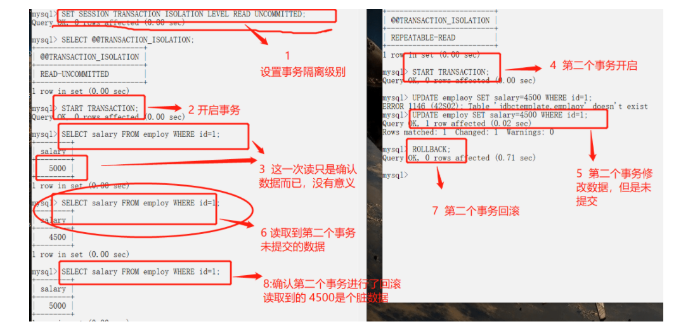

**读已提交（避免脏读）**

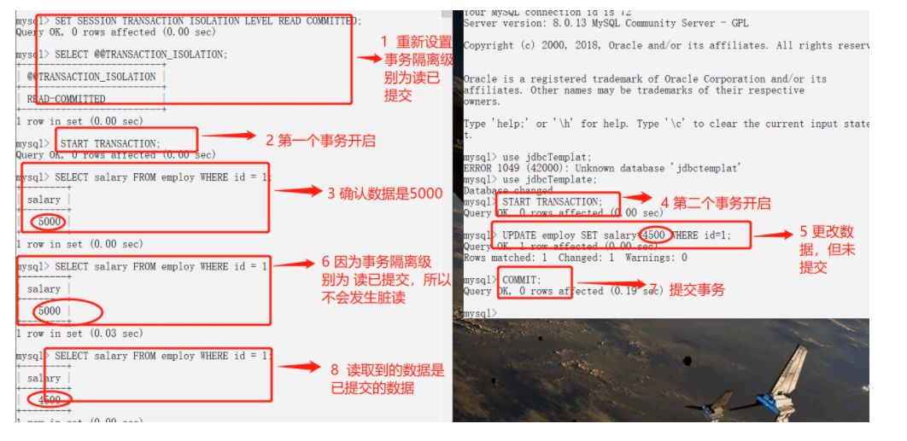

但是能够发现一个问题，在左边这个事物的执行过程中，虽然避免了脏读，但是却出现了不可重复读，因为一个事务内前后读取同一条记录的结果却不一样。


**可重复读**

> 可见性算法，右边的事务对于左边是不可见的

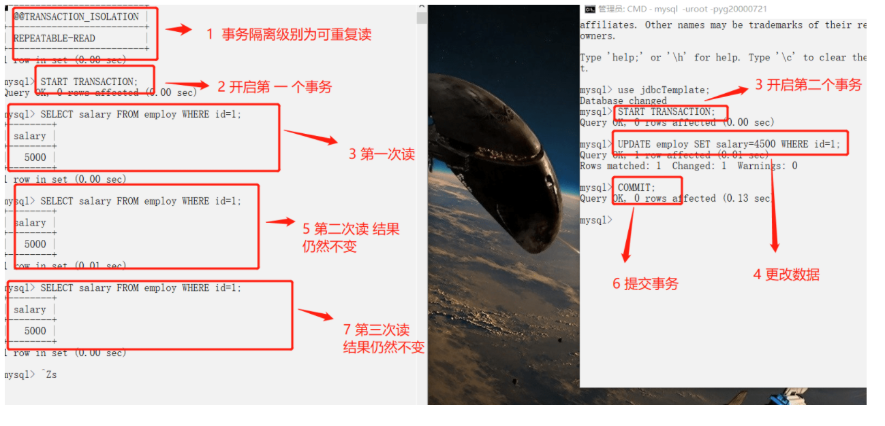


**幻读**

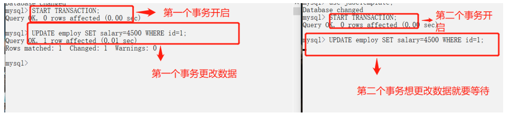


>[MySQL设置事务自动提交（开启和关闭） (biancheng.net)](http://c.biancheng.net/view/7291.html)


## MVCC

全称Multi-Version Concurrency Control，即多版本并发控制，主要是为了提高数据库的并发性能。**MVCC是“维持一个数据的多个版本，使读写操作没有冲突”的一个抽象概念**

> 数据库的并发场景

- 读-读：不存在任何问题，也不需要并发控制
- 读-写：有线程安全问题，可能会造成事务隔离性问题，可能会遇到脏读、不可重复读、幻读
- 写-写：有线程安全问题，可能会存在更新丢失问题

**<font color=red>MVCC就是用来解决读-写冲突的无锁并发控制，</font>就是为事务分配单项增长的时间戳/版本号，为每个数据修改保存一个版本，版本与事务时间戳相关联**

快照读操作只读取事务开始前的数据库快照

**说到MVCC，就是在InnoDB引擎中，因为MyISAM不支持事务**


### 一致性非锁定读（快照读）

> 对于一致性非锁定读的实现，通常的做法是加一个版本号或者时间戳字段，在更新数据的同时版本号+1或者更新时间戳，查询时，将当前的版本号与对应记录的版本号进行比对，如果记录的版本号小于可见版本，则表示该记录可见

在InnoDB存储引擎中，MVCC就是对一致性非锁定读的实现，如果读取的行正在执行DELETE或者UPDATE操作，这时读取操作不会去等待行上锁的释放，相反地，InnoDB存储引擎会读取行的一个快照数据，**对于这种读取历史数据的方式，我们叫他快照读**

在READ COMMITTD和REPEATABLE READ两个隔离级别下，如果是执行普通的select语句（不包括`select ... lock in share mode`，`select ... for update`）则会使用MVCC，并且在REPEATABLE READ隔离级别下使用MVCC实现了可重复读和**防止部分幻读**


### 锁定读（当前读）

如果执行的是下列语句，就是锁定读（Locking Reads）

- `select ... lock in share mode`
- `select ... for update`
- `insert`、`update`、`delete` 操作

在锁定读下，读取的是数据的最新版本，这种读也被称为当前读，锁定读会对读取到的记录加锁

- `select ... lock in share mode`：对记录加 `S` 锁，其它事务也可以加`S`锁，如果加 `x` 锁则会被阻塞
- `select ... for update`、`insert`、`update`、`delete`：对记录加 `X` 锁，且其它事务不能加任何锁

> S锁指的是共享锁，X锁指的是排他锁

在一致性非锁定读下，即使读取的记录已经被其他事务加上了X锁，这条记录也是可以被读取的，即读取的是快照数据，上面说了，在REPEATABLE READ隔离级别下使用MVCC能够**防止部分幻读**，这里的部分指的是在一致性非锁定读情况下，只能读取到第一次查询之前所插入的数据（根据Read View判断可见性，Read View在第一次查询时生成）但是，如果是**锁定读，每次读取的都是最新数据**，这时两次查询中间有其他事务插入数据就会产生幻读。所以InnoDB在实现Repeatable Read时，如果执行的是锁定读，则会对读取的记录使用`Next-Key Lock`，来防止其他事务在间隙间插入数据

> 总结以下就是，InnoDB在实现Repeatable read的时候，如果执行的是一致性非锁定读（MVCC），那么就能够避免幻读，而如果执行的是锁定读的时候，需要配合Next-Key Lock来解决幻读


### InnoDB对MVCC的实现

**MVCC的实现依赖于：隐藏字段、Read View、undo log，**在内部实现中，InnoDB通过数据行的`DB_TRX_ID`和`READ View`来判断数据的可见性，如果不可见，则通过数据行的`DB_ROLL_PTR`找到undo log中的历史版本，每个事务读取到的数据版本可能都是不一样的，在同一个事务中，用户只能看见该事务创建Read View之前已经提交的修改和该事务本身做的修改


#### 隐藏字段

InnoDB存储引擎为每行数据添加了三个隐藏字段

- `DB_TRX_ID(6字节)`：表示最后一次插入或者更新该行的事务id，此外，delete操作在内部被视为更新，只不过会在记录头`Record header`中的`delete_flag`字段将其标记为已删除
- `DB_ROLL_PTR(7字节)`：回滚指针，指向该行的undo log，如果该行未被更新，则为空
- `DB_ROW_ID(6字节)`：如果没有设置主键，且表中没有唯一非空索引的时候，InnoDB会使用该id来生成聚簇索引


#### Read View

**Read View主要是用来做可见性判断，里面保存了“当前对本事务不可见的其他活跃事务”**

主要有以下字段

- `m_low_limit_id`：目前出现过的最大的事务ID+1，即下一个将被分配的事务ID，大于等于这个ID的数据版本均不可见
- `m_up_limit_id`：活跃事务列表`m_ids`中最小的事务ID，小于这个ID的数据版本均可见，如果`m_ids`为空，则`m_up_limit_id`等于`m_low_limit_id`
- `m_ids`：Read View创建时其他未提交的活跃**事务ID集合**，创建Read View时，将当前未提交事务ID记录下来，后续即使他们修改了记录行的值，对于当前事务也是不可见的，`m_ids`不包括当前事务自己和已经提交的事务（正在内存中）

- `m_creator_trx_id`：创建该Read View的事务ID

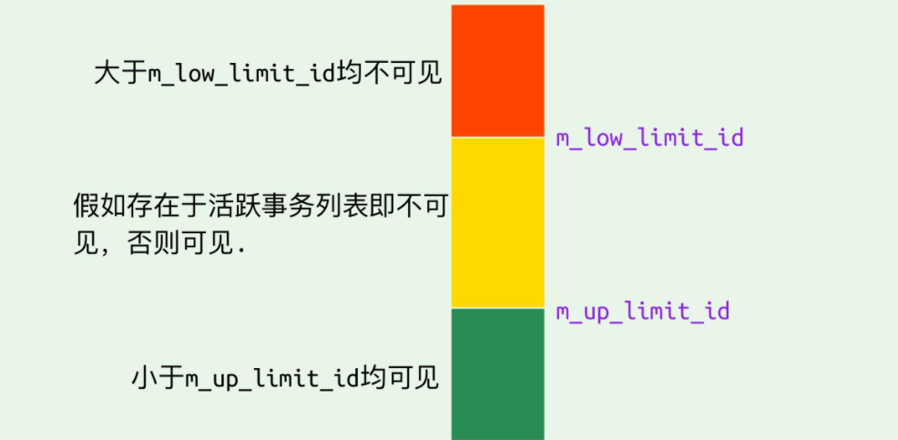


**<font size=4pt>Read View数据可见性算法</font>**

在InnoDB存储引擎中，创建一个新事务后，执行每个select语句前，都会创建一个快照（Read View），快照中保存了当前数据库中正处于活跃（没有commit）的事务的ID号，其实简单地说保存的是系统中当前不应该被本事务看到的其他事务ID列表（即m_ids）。当用户要在这个事务中读取某个记录行的时候，InnoDB会将该记录行的`DB_TRX_ID`和 `Read View` 中的一些变量及当前事务 ID 进行比较，判断是否满足可见性条件


1. 如果记录的`DB_trx_ID < m_up_limit_id`的话，表明最新修改该行的事务在当前事务创建快照前就已经被提交了，所以该记录行的值对事务是可见的，或者是当数据的事务ID等于creator_trx_id ，那么说明这个数据就是当前事务自己生成的，自己生成的数据自己当然能看见，所以这种情况下此数据也是可以显示的。

2. 如果记录的`DB_trx_ID > m_low_limit_id`的话，表明最新修改该行的事务在当前事务创建快照之后才修改该行，所以该记录行的值对当前事务不可见。跳到步骤5

3. 如果`m_ids`为空，则表明在当前事务创建快照之前，修改该行的所有事务都已经提交了，所以该记录行的值对当前事务是可见的

4. 如果 m_up_limit_id <= DB_TRX_ID < m_low_limit_id，表明最新修改该行的事务（DB_TRX_ID）在当前事务创建快照的时候可能处于“活动状态”或者“已提交状态”；所以就要对活跃事务列表 m_ids 进行查找（源码中是用的二分查找，因为是有序的）

   - 如果在活跃事务列表`m_ids`中能找到DB_TRX_ID，则表明：

     - 在当前事务创建快照之前，该记录行的数据已经被事务ID为DB_TRX_ID的事务修改了，但是没有提交
     - 在当前事务创建快照之后，该记录行的数据被事务ID为DB_TRX_ID的事务修改

     这种情况下也需要跳到步骤5

   - 如果在活跃事务列表`m_ids`中找不到DB_TRX_ID，则表明事务id为DB_TRX_ID的事务修改了该记录行的数据，在当前事务创建快照之前就已经提交了，所以记录行对当前事务可见

5. 在该记录行的DB_ROLL_PTR指针所指向的undo log取出快照记录，用快照记录的DB_TRX_ID跳到步骤1中重新开始判断，直到找到满足的快照版本或者返回空


#### undo log

undo log主要有两个作用

- 当事务回滚时用于将数据恢复到修改之前的样子
- 另一个作用就是MVCC，当读取记录的时候，若该记录被其他事务占用或者对当前事务不可见时，则通过undo log读取之前的版本数据，以此来实现非锁定读

每次对数据库记录进行改动，都会记录一条undo日志，**每条undo日志也都有一个roll_pointer属性（INSERT操作对应的undo日志没有该属性，因为该记录并没有更早的版本）**，可以将这些undo日志都连起来，串成一个链表，所以现在的情况就像下图一样：

**在InnoDB存储引擎中，undo log分成了两种：insert undo log和update undo log**

- insert undo log，指在insert操作过程中产生的undo log，因为insert操作的记录只对本事务可见，对其他事务不可见，故该undo log可以在事务提交之后直接删除，不需要进行purge操作

  > insert时的数据初始状态，如下图所示，可以看到DB_ROLL_PTR属性为空，因为insert的undo日志中没有该属性

  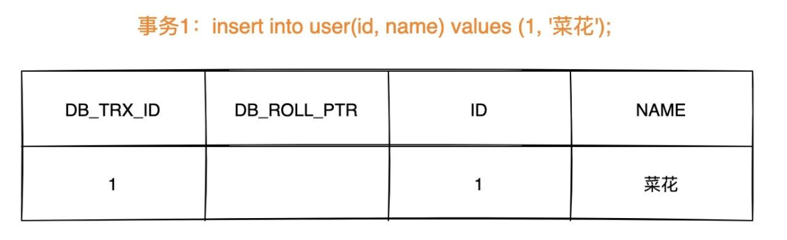

  

- update undo log，指在update或delete操作中产生的undo log，该undo log可能要提供MVCC机制，因此不能在事务提交之后就删除，提交时放入undo log链表中，等待purge线程进行最后的删除

  > 数据第一次被修改时

  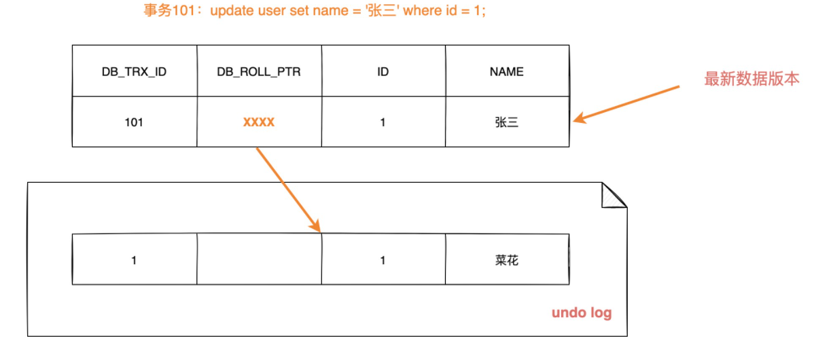

  > 数据第二次被修改时

  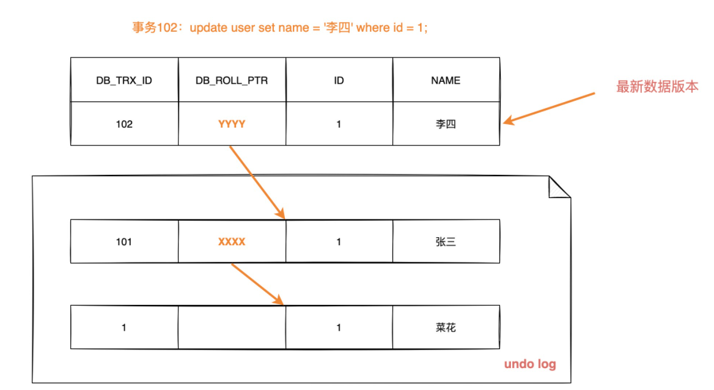

  不同的事务或者相同的事务可能会对同一条记录进行修改，会使该记录行的undo log成为一条链表，链首就是最新的记录，链尾就是最早的旧纪录


### MVCC和事务隔离级别

只有在RC和RR隔离级别下，InnoDB存储引擎才会使用MVCC（一致性非锁定读，快照读），但是他们生成Read View的时机是不同的

- 在RC隔离级别下，每次select查询之前都能够生成一个Read View（m_ids列表）
- 在RR隔离级别下，只在事务开始后第一次select数据前生成一个Read View（m_ids）列表

我们知道在RR隔离级别下，解决了不可重复读的问题，那么MVCC具体是怎么解决这个问题的呢？

> 举个例子

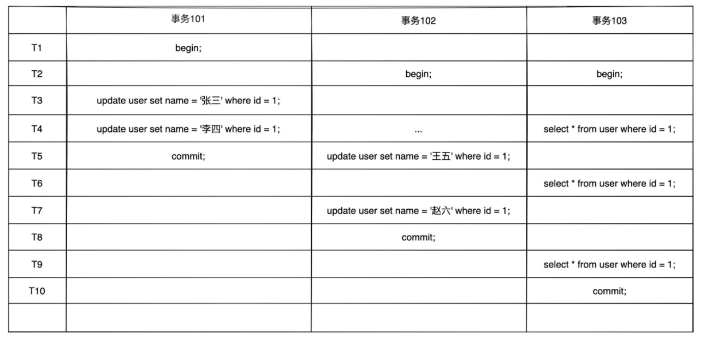

#### 在RC下Read View的生成情况

> 假设时间线来到T4，那么此时数据行id=1的版本链为

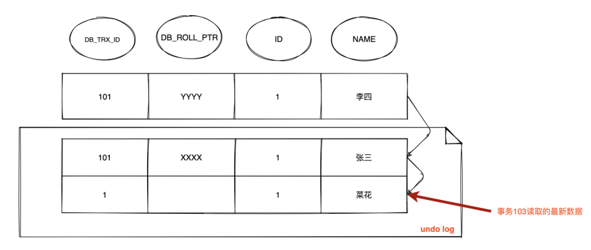

由于RC隔离级别下，每次查询都会生成Read View，并且事务101和102都还没有提交，此时103事务生成的Read View中活跃的事务`m_ids={101,102}`，`m_low_limit_id`为104（即下一个事务id是104），`m_up_limit_id`为101，`m_creator_trx_id`为103

- 此时最新记录的 `DB_TRX_ID` 为 101，m_up_limit_id <= 101 < m_low_limit_id，所以要在 `m_ids` 列表中查找，发现 `DB_TRX_ID` 存在列表中，那么这个记录不可见
- 根据DB_ROLL_PTR找到undo log中的上一版本记录，上一条记录的DB_TRX_ID还是101，仍然不可见
- 继续根据DB_ROLL_PTR找undo log中的上一版本记录，这次找到了DB_TRX_ID为1的记录，满足 1 < m_up_limit_id，可见，所以事务 103 查询到数据为 `name = 菜花`

> 时间线来到t6，数据的版本链为

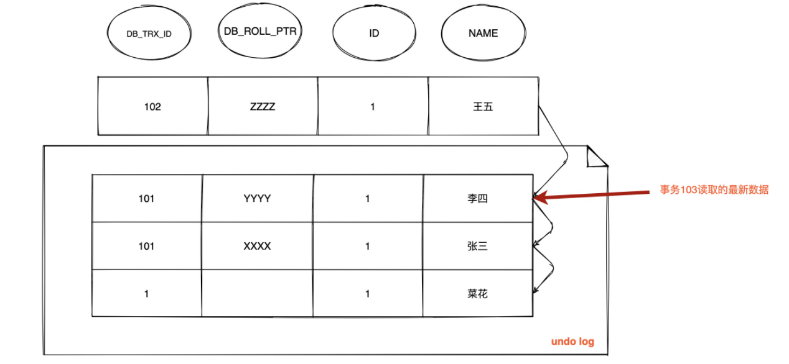

因为在RC级别下，每进行一次select就会重新生成Read View，所以在t6时刻事务103会重新生成一个Read View，这时事务101已经提交，事务102还没有提交，所以此时Read View中活跃的事务`m_ids={102}`，`m_low_limit_id`为：104，`m_up_limit_id`为：102，`m_creator_trx_id`为：103

- 此时最新记录的DB_TRX_ID是102，m_up_limit_id <= 102 < m_low_limit_id，所以要在 `m_ids` 列表中查找，发现 `DB_TRX_ID` 存在列表中，那么这个记录不可见
- 根据 `DB_ROLL_PTR` 找到 `undo log` 中的上一版本记录，上一条记录的 `DB_TRX_ID` 为 101，满足 101 < m_up_limit_id，记录可见，所以在 `T6` 时间点查询到数据为 `name = 李四`，**与时间 T4 查询到的结果不一致，不可重复读！**


> 时间线来到t9，数据的版本链是

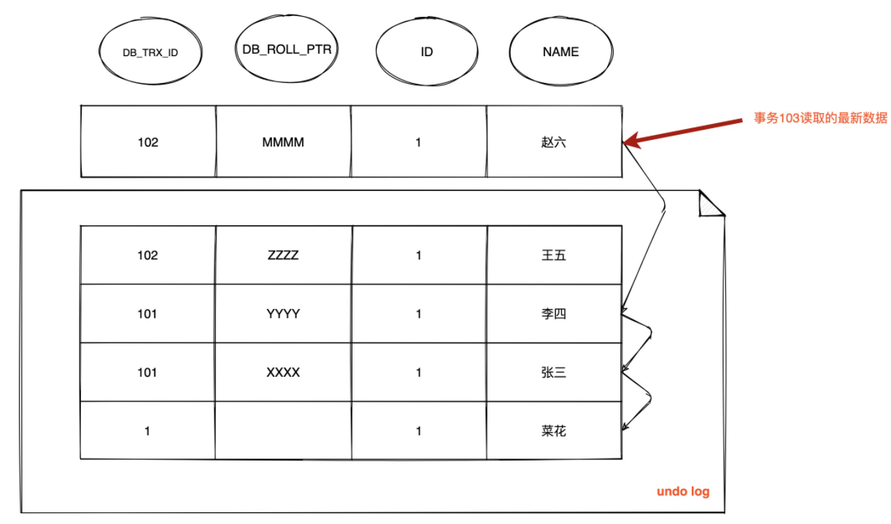

重新生成Read View，这时事务101和102都已经提交，所以`m_ids`为空，则`m_up_limit_id=m_low_limit_id`，最新版本事务ID为102，满足 102 < m_low_limit_id，可见，查询结果为 `name = 赵六`

> **总结一下，由于RC隔离级别下，事务在每次查询开始时都会生成并设置新的Read View，所以导致不可重复读**


#### 在RR下Read View的生成情况

**在可重复读隔离级别下，只会在事务开始后第一次读取数据时生成一个Read View（m_ids列表）**

> 假设时间线来到T4，那么此时数据行id=1的版本链为


同理，此时事务103能够读取到的记录是`name=菜花`


> 时间线来到t6，数据行的版本链为

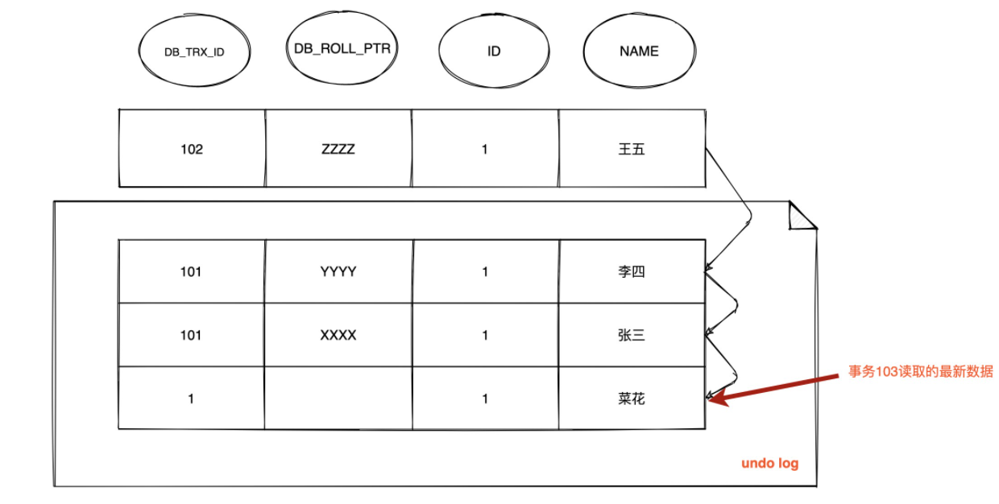

因为在RR隔离级别下，只会在事务开始后生成一次Read View，所以此时仍然沿用`m_ids={101,102}`，`m_low_limit_id`为：104，`m_up_limit_id`为：101，`m_creator_trx_id` 为：103

- 最新记录的DB_TRX_ID为102，因为m_up_limit_id <= 102 < m_low_limit_id，所以要在`m_ids`列表中查找，发现`DB_TRX_ID`存在列表中，那么这个记录不可见
- 根据 `DB_ROLL_PTR` 找到 `undo log` 中的上一版本记录，上一条记录的 `DB_TRX_ID` 为 101，不可见
- 继续根据 `DB_ROLL_PTR` 找到 `undo log` 中的上一版本记录，上一条记录的 `DB_TRX_ID` 还是 101，不可见
- 继续找上一条 `DB_TRX_ID`为 1，满足 1 < m_up_limit_id，可见，所以事务 103 查询到数据为 `name = 菜花`


> 时间线来到t9，数据行的版本链为

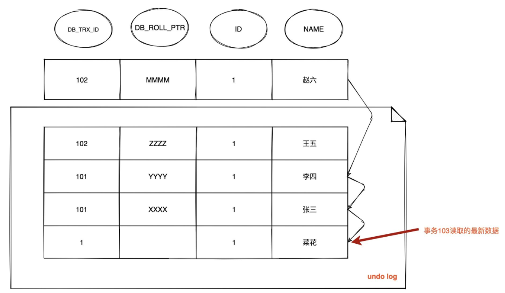

此时情况跟 T6 完全一样，由于已经生成了 `Read View`，此时依然沿用 **`m_ids` ：[101,102]** ，所以查询结果依然是 `name = 菜花`


### MVCC + Next-key Lock防止幻读

**InnoDB存储引擎在RR级别下通过MVCC和Next-key Lock来解决幻读问题：**

1. **执行普通的select，此时会以MVCC快照读的方式读取数据**

   在快照读的情况下，RR隔离级别只会在事务开始后的第一次查询生成一个READ VIEW，并使用至事务提交，所以在生成READ VIEW之后其他事务的更新、插入记录版本对当前事务并不可见，**实现了可重复读和防止了<font color=red>快照读下的幻读</font>**

2. **执行`select... for update/lock in share mode,insert,update,delete`等当前读**

   在当前读下，读取到的都是最新数据，如果其他事务有插入新的记录，并且刚好在当前事务查询范围内，就会产生幻读。

   InnoDB使用Next-key Lock来防止这种情况，**当执行当前读时，会锁定读取到的记录的同时，锁定他们的间隙，防止其他事务在查询范围内插入数据。**只要我不让你插入**，就不会产生幻读了。


### 可重复读级别下幻读被完全解决了吗？

上面说到可以使用MVCC+Next-Key Lock的方式来解决当前读中的幻读问题，但这是否能够说明在RR级别下幻读已经被完全解决了吗？

答案是否定的，这里给出两个场景

#### 场景1

以下表为例

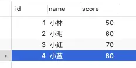

事务A中执行id=5的查询，因为表中没有这条数据，所以是查询不出来的

```sql
# 事务 A
mysql> begin;
Query OK, 0 rows affected (0.00 sec)

mysql> select * from t_stu where id = 5;
Empty set (0.01 sec)
```

然后事务B插入一条id=5的记录，并且提交了事务

```sql
# 事务 B
mysql> begin;
Query OK, 0 rows affected (0.00 sec)

mysql> insert into t_stu values(5, '小美', 18);
Query OK, 1 row affected (0.00 sec)

mysql> commit;
Query OK, 0 rows affected (0.00 sec)
```

此时，事务A更新id=5的记录，虽然场景很违和，事务A虽然看不到id=5的记录，但它去更新了，然后再次查询，事务A就能够看到事务B的插入记录了

```sql
# 事务 A
mysql> update t_stu set name = '小林coding' where id = 5;
Query OK, 1 row affected (0.01 sec)
Rows matched: 1  Changed: 1  Warnings: 0

mysql> select * from t_stu where id = 5;
+----+--------------+------+
| id | name         | age  |
+----+--------------+------+
|  5 | 小林coding   |   18 |
+----+--------------+------+
1 row in set (0.00 sec)
```

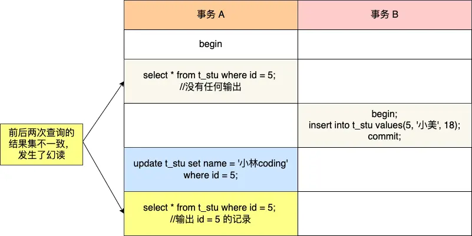

在可重复读隔离级别下，事务A第一次执行普通的select语句时生成了一个ReadView，之后事务B向表中新插入了一条id=5的记录并提交，接着，事务A对id=5这条记录进行了更新，这个时刻这条新纪录的`trx_id`隐藏列的值就变成了事务A的id了，之后事务A在用普通的select语句去查询这条记录时就可以看到这条记录了，于是就发生了幻读。

因为这种特殊现象的存在，我们认为MySQL InnoDB中的MVCC并不能完全避免幻读现象


#### 场景2

- T1 时刻：事务 A 先执行「快照读语句」：select * from t_test where id > 100 得到了 3 条记录。
- T2 时刻：事务 B 往插入一个 id= 200 的记录并提交；
- T3 时刻：事务 A 再执行「当前读语句」 select * from t_test where id > 100 for update 就会得到 4 条记录，此时也发生了幻读现象。

**要避免这类特殊场景下发生幻读的现象的话，就是尽量在开启事务之后，马上执行 select ... for update 这类当前读的语句**，因为它会对记录加 next-key lock，从而避免其他事务插入一条新记录


**两个场景都是先快照读，另一个事务插入数据之后，再当前读**


### 总结

所谓的MVCC指的就是在使用READ COMMITTD、REPEATABLE READ这两种隔离级别的事务在执行普通的SEELCT操作时访问记录的版本链的过程，这样子可以使不同事务的读-写、写-读操作并发执行，从而提升系统性能。

**MySQL 可重复读隔离级别并没有彻底解决幻读，只是很大程度上避免了幻读现象的发生。**