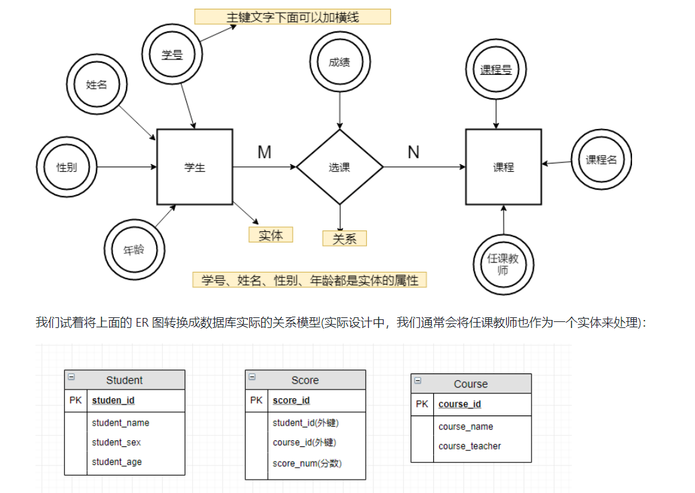
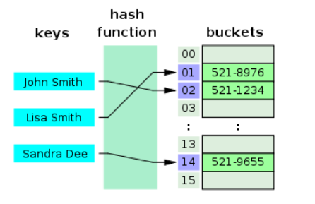
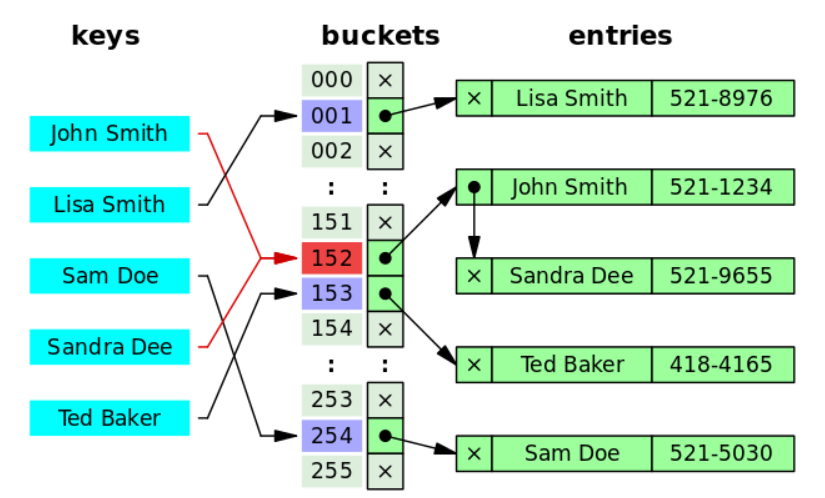
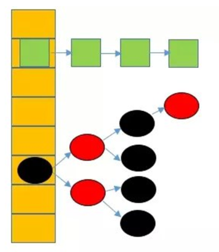
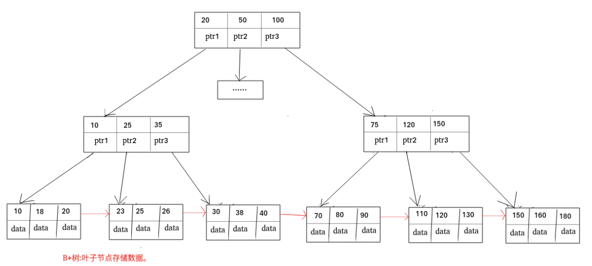
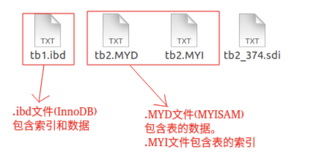
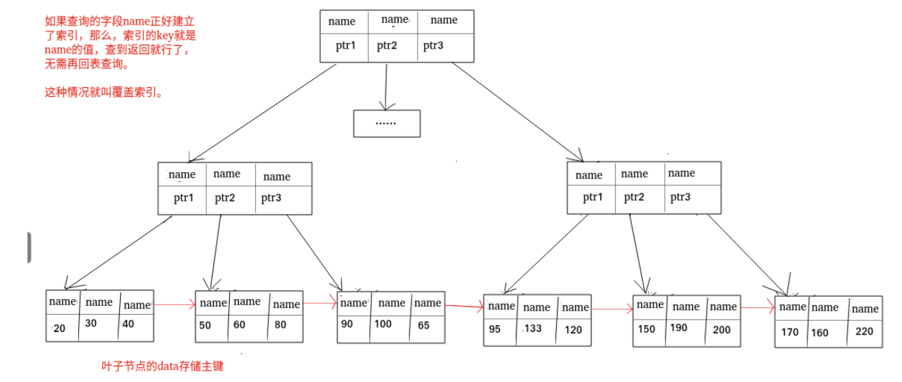

## 数据库的基础知识

### 基本概念

- 元组：元组是关系型数据库中的基本概念，关系是一张表，表中的每行（表中的每条记录）都是一个元组，每列都是一个属性
- 码：实体的属性叫做码，对应表中的列，码是能够唯一标识实体的属性
- 候选码：如果关系中的某一个属性或者属性组的值能够唯一标识一个元组，而其他任何的属性，属性组都不能够再标识，则称这个属性/属性组为候选码，例如在学生实体中，“学号”是能够唯一区分学生这一实体，如果“姓名 + 班级”也能够唯一区分这一实体，那么{学号}和{姓名，实体}都是候选码
- 主码：主码也叫主键，主键是从候选码中选出来的，**一个实体集中只能够有一个主码，但是可以有多个候选码**
- 外码：外码也叫外键，外键是某个关系中的一个属性，但是是另一个关系中的主键，则这个属性叫做外键
- 主属性：候选码中出现过的属性叫做主属性
- 非主属性：没有出现在候选码中的属性叫做非主属性


> 主键和外键有什么区别呢？

- 主键是用来唯一标识一个元组的，不能够重复而且不能有空值，一个表中只能够有一个主键
- 外键是用来和其他表建立联系用的，能够重复出现而且也可以为空，一个表中可以有多个外键


### 为什么不推荐使用外键和级联呢？

> 对于外键和级联，阿里巴巴的开发手册中说到：
>
> 【强制】不得使用外键和级联，一切外键的概念必须要在应用层完成
>
> 说明：以学生和成绩的关系为例，学生表中的student_id是主键，那么成绩表中的student_id是外键，如果更新学生表中的student_id，同时触发成绩表中student_id的更新，这就是级联更新，外键和级联更适用于单机低并发，不适用于分布式、高并发集群，级联更新是强阻塞，存在数据库更新风暴的风险，外键影响数据库插入的速度

当问到这个问题的时候，我们可以先说一下外键的缺点，再说一下外键的优点，然后最后总结来说一下，如下

答：外键存在以下问题：

- **外键增加了复杂性，**外键的主从关系是定的，假如哪天需求有变化，数据库中的这个字段不再需要和其他表有关联了就会产生很多麻烦，又比如在进行DELETE和UPDATE操作的时候必须考虑外键约束，这给开发和测试造成了很大麻烦
- **外键对分库分表不友好，**因为外键在分库分表的时候不会生效
- **增加了额外工作，**数据库在进行增删改时还需要增加外键的维护工作，但是我认为这一点不算是缺点，因为就算是没有外键，在应用层也需要做这一部分的工作

但是外键即然存在，那么它就有它的理由和优点，比如：

- **外键能够很好的保证数据一致性和完整性**
- **使用外键使得级联操作变得简单了，减少了代码量**

因此，我认为在低并发、而且不涉及分库分表是可以使用外键，没必要一棒子打死


### ER图

ER图又叫做实体-联系图，提供了实体、属性和关系的表示方法，用来描述现实世界业务场景的**概念模型**。实体之间的关系有一对一，一对多，多对多三种




### 数据库范式

再说数据库范式之前，我们要先明确几个概念：

- **函数依赖**，如果在一张表中，属性（或属性组）X的值确定的情况下，一定能够确定出属性Y的值，那么就称Y依赖于X，记作`X->Y`
- **部分函数依赖**，如果X->Y，对于X的一个真子集X0，也有X0->Y，那么就说Y对X部分函数依赖，比如学生基本信息表 R 中（学号，身份证号，姓名）当然学号属性取值是唯一的，在 R 关系中，（学号，身份证号）->（姓名），（学号）->（姓名），（身份证号）->（姓名）；所以姓名部分函数依赖与（学号，身份证号）；
- **完全函数依赖**，在一个关系中，某个非主属性依赖于全部的主属性，比如学生基本信息表 R（学号，班级，姓名）假设不同的班级学号有相同的，班级内学号不能相同，在 R 关系中，（学号，班级）->（姓名），但是（学号）->(姓名)不成立，（班级）->(姓名)不成立，所以姓名完全函数依赖与（学号，班级）；
- **传递函数依赖**，假设X,Y,Z是U的不同属性子集，如果X确定Y，Y确定Z，且有 X 不包含 Y，Y 不确定 X，（X∪Y）∩Z=空集合，则称 Z 传递函数依赖于 X。传递函数依赖可能会导致数据冗余和异常，传递函数依赖的Y和Z通常属于同一个事务，因此可以将其合并放到一个表中，比如在关系R（学号，姓名，系名，系主任）中，学号->系名，系名->系主任，所以存在非主属性系主任对于学号的传递函数依赖


**第一范式（1NF）**

属性（对应于表中的字段）不能够再被分割，也就是这个字段只能是一个值，不能够再分为多个其他字段了，**1NF是所有关系型数据库的最基本要求**


**第二范式（2NF）**

在第一范式的基础上消除了非主属性对于码的部分函数依赖


**第三范式（3NF）**

在第二范式的基础上消除了非主属性对于码的传递函数依赖


### 什么是存储过程

我们可以**把存储过程看成是一些SQL语句的集合，中间加了点逻辑控制语句**，存储过程在业务比较复杂的时候也是非常实用的，比如很多时候我们完成一个操作可能需要写一大串SQL语句，这时候我们可以写一个存储过程，这样也方便我们下次的调用，存储过程一旦调试通过之后就能够稳定运行，另外，存储过程的执行速度要比单纯的SQL语句块，因为存储过程是被预编译过的

> 注意，在阿里开发手册中，明确禁止使用存储过程，因为存储过程难以调试和扩展，而且可移植性差，还会消耗数据库资源


### drop，delete与truncate的区别

他们的区别主要体现在三个方面，用法不同，属于不同的数据库语言，执行速度不同

- **用法不同**

  - drop用在删除表的时候，`drop table 表名`删除整个表
  - truncate删除表中的全部数据，只是删除数据，不删除表结构，再插入数据的时候自增长 id 又从 1 开始`truncate table 表名`
  - delete用于删除表中的数据，如果使用`delete from table_name where ...`能够删除表中的某一行，如果不指定`where`，那么delete的用法和truncate一样

  > 指定了where条件的delete相当于单杀，truncate相当于团灭，drop是把电脑摔了


- **属于不同的数据库语言**

  - truncate和drop属于DDL（数据库定义语言），操作立即生效不能够回滚
  - delete属于DML（数据库操作语言），操作完以后不想提交事务还可以回滚，

  > delete 是发微信说分手，后悔还可以撤回，truncate 和 drop 是直接扇耳光说滚，不能反悔。 

  

  > - DML 是数据库操作语言（Data Manipulation Language）的缩写，是指对数据库中表记录的操作，主要包括表记录的插入（insert）、更新（update）、删除（delete）和查询（select），是开发人员日常使用最频繁的操作。
  > - DDL （Data Definition Language）是数据定义语言的缩写，简单来说，就是对数据库内部的对象进行创建、删除、修改的操作语言。它和 DML 语言的最大区别是 DML 只是对表内部数据的操作，而不涉及到表的定义、结构的修改，更不会涉及到其他对象。DDL 语句更多的被数据库管理员（DBA）所使用，一般的开发人员很少使用。


- **执行速度不同**

  drop > truncate > delete


### 数据库的设计通常分为哪几步

- **需求分析，**分析用户需求
- **概念结构设计**，E-R图
- **逻辑结构设计，**将ER图转换成数据表，从ER模型到关系模型的转换
- **物理结构设计，**主要是为设计的数据库选择合适的存储结构和存储路径
- **数据库实施，**包括编程、测试和试运行
- **数据库运行和维护，**系统的运行和数据库的日常维护


## MySQL索引

**索引是一种用于快速查询和检索数据的数据结构，常见的索引结构有B树，B+树和Hash**


### 索引的优缺点

优点

- 使用索引能够大大加快数据的检索速度（大大减少检索的数据量），这也是创建索引的最主要原因
- 通过创建唯一性索引，可以保证数据库表中的每一行数据都是唯一的

缺点

- 创建索引和维护索引需要浪费很多时间，当对表中的数据进行增删改的时候，如果数据有索引，那么索引也需要进行动态的修改，会降低SQL的执行效率
- 索引需要使用物理内存存储，会耗费一定的空间


> 使用索引一定能够提高查询性能吗？
>
> 一般情况下，使用索引会提高查询性能，因为索引查询是要比全表扫描快的，但是如果数据库的数据量不大，建立索引的效果也不一定多明显


### 索引的底层数据结构

#### Hash表

哈希表是键值对的集合，通过键（key）可以快速地取出对应的值（value），因此哈希表可以快速地检索数据（接近O(1)）

> 为什么能够通过key快速地取出value呢？

原因就在于Hash算法（也叫散列算法），通过哈希算法我们可以快速找到value对应的index，找到了index也就找到了对应的value

```c
hash = hashfunc(key);
index = hash % array_size;
```



但是Hash算法有一个hash冲突问题，也就是说多个不同的key最后的index是一样的，通常情况下，我们的解决办法是通过**链地址法**，链地址法就是将哈希冲突数据存放在链表中，就比如JDK1.8之前HashMap就是通过链地址法来解决hash冲突的，不过JDK1.8（包含1.8）之后HashMap为了减少链表过长导致搜索时间变长把后面的链表换成了红黑树，源码中是设置了一个阈值（默认为8），当链表长度小于8的时候，通过链表来维护，超过8之后就将这个链表换成红黑树





为了减少hash冲突的发生，一个好的hash函数应该均匀地将数据分布到整个可能的哈希值集合中

即然hash表这么快，**为什么MySQL还要使用其他的索引结构呢？**

这是因为hash表存在两个缺点：

- 第一个缺点就是我们上面说到的**hash冲突**，但是这不是最关键的，对于数据库来说这不算是个大缺点

- 第二个缺点就是**Hash索引不支持顺序和范围查询**，这是使用Hash表作为索引最大得缺点，假如我们要对表中的数据进行排序或者范围查询，那Hash索引可就不行了

  >```sql
  >SELECT * FROM tb1 WHERE id < 500;
  >```
  >
  >在这种情况下，如果我们要使用Hash索引的话，我们需要对1~499的id值分别进行一次索引，看看索引表里面有没有


#### B树和B+树

也叫做B-树，全称是多路平衡查找树，B+树和B树种的`B`代表的是balanced意思

目前大多数数据库和文件系统都采用B-树或者B+树来作为其索引结构

B+树是B树的一种变体，两者有什么不同呢？

- B树中的所有节点既存放键，也存放数据（data），而B+树之后叶子节点存放key和data，其他非叶子节点只存放key
- B树的叶子节点都是独立的，B+树的叶子节点有一条引用链指向与他相邻的叶子节点
- B树的检索过程相当于对范围内的每个节点的关键字做二分查找，可能还没有到达叶子节点，检索就结束了，而B+树的检索效率就稳定了，任何查找都是从根节点到叶子节点的过程，叶子节点的检索顺序很明显




#### MySQL索引为什么使用B+树，不使用其他结构

前面已经提到了为什么不使用哈希表，因为哈希表存在哈希冲突，但这并不是最主要的原因，最主要的原因哈希表没有办法做到顺序查询和范围查询

那为什么不使用二叉树，红黑树，SB树等呢？首先不使用这些树都有一个统一的原因，那就是当数据量比较大的时候，数的高度会变得很高，这会成为一个瓶颈，而对于二叉树有一个致命的缺点，如果我们的目标元素是有规律递增或者递减的，这样出来的二叉树就会失去平衡，变成了一个线性链表结构，比如使用二叉树作为索引，那么我们将数据库主键ID这一列建立索引，得到的索引的数据结构就变成一个链表，这种情况下，查找数据和没有索引是一样的效果，那么索引就起不到作用了。

红黑树能够通过左旋右旋，颜色变化等操作解决二叉树中的不平衡问题，但是由于红黑树中每个父节点只能够有2个子节点，所以数据量大时，树的高度会很高，这样不利于MySQL磁盘寻址

那么为什么不选择使用B树，而是用B+树呢？

- 首先，B树能够完成的工作B+树都能够完成，且能够更好的完成，他们两个都降低了数的高度，增加了节点的存储量
- B+树的扫库和扫表能力更强，如果根据索引去进行数据表扫描，B树需要遍历整棵树，而B+树之需要遍历叶子节点
- B+树的查询效率更加稳定，每一次都是从根节点到叶节点，所以每次查询的IO次数都是稳定的
- B+树有天然的排序功能
- B+树读写磁盘的能力更强，因为B+树中根节点和支节点不保存数据区，所以在同样大小的情况下，B+树中的根节点和支节点能够保存更多的关键字，所以B+树一次磁盘读写能够加载的关键字更多


#### InnoDB和MyISAM的索引实现

在MySQL中MyISAM和InnoDB都是使用B+树作为索引结构，但是具体的实现方式不同

> MyISAM的索引实现

MyISAM使用B+树作为索引结构，叶节点data存放的是数据记录的地址，在检索的时候首先按照B+树搜索算法搜索引擎，如果指定的key存在，则取出其data域的值，然后以data域的值为地址读取相应的数据记录，这被称为**非聚簇索引**

下图为MyISAM的主键索引，col1为主键


辅助索引（二级索引）跟主键索引在结构上没有什么不同，唯一的一个不同之处在于主键索引要求key是唯一的，辅助索引的key可以重复。为col2创建一个辅助索引，也是一棵B+树，data域保存数据域的值为地址，读取相应的数据记录

**MyISAM的索引结构为非聚簇索引，为了区别InnoDB的聚簇索引**


> InnoDB的索引实现

主键索引也是B+树，实现方式却完全不同，InnoDB表数据文件本身就是一个索引结构，数的叶节点存放了完整的数据记录，这种索引结构叫做**聚簇索引**


因为InnoDB的数据文件本身要按主键聚集，所以**InnoDB要求表必须有主键**（MyISAM可以没有主键），如果没有显式指定主键，则MySQL会自动选择一个可以唯一标识数据记录的列作为主键，如果不存在这种列，则mysql自动为InnoDB表生成一个隐含字段作为主键，这个字段长度为6字节，类型为长整型


**InnoDB中所有的辅助索引都引用主键作为data域，**如下图所示是在col3上的一个辅助索引


因此InnoDB的索引能提供一个非常快捷的主键查找性能，不过，它的辅助索引也会包含主键列，所以如果主键定义比较大，其他索引也将会很大，InnoDB不会压缩索引

**聚集索引这种实现方式使得按主键的搜索十分高效，但是辅助索引搜索需要检索两边索引：首先检索辅助索引获得主键，然后用主键到主索引中检索获得记录**

不同存储引擎的索引实现方式对于正确使用和优化索引都非常有帮助，例如知道了InnoDB的索引实现之后，就很容易明白为什么尽量不要选择过长的字段作为主键，因为所有辅助索引都引用主索引，过长的主索引会令辅助索引变得很大。再例如，使用非单调的字段作为主键在InnoDB中不是一个好主意，因为InnoDB数据文件本身是一颗B+树，非单调主键会造成插入新记录时数据文件为了维护B+树的特性而频繁分裂调整，十分低效，而使用自增字段作为主键则是一个很好的选择


### 索引类型

#### 主键索引

数据表的主键列使用的是主键索引，一张数据表只能够有一个主键，并且逐渐不能为null，不能重复

在MySQL的InnoDB表中，当没有显示指定主键的时候，InnoDB会先自动检查表中是否有唯一索引的字段，如果有，则选择这个字段作为默认主键，如果没有则自动创建一个6字节的自增主键


#### 二级索引（辅助索引）

二级索引又称为辅助索引，是因为二级索引的data域中存放的是主键，也就是说通过二级索引能够定位到主键的位置

唯一索引，普通索引，前缀索引都属于二级索引

- 唯一索引，唯一索引也是一种约束，**唯一索引的列不能够出现重复值，但是允许数据出现NULL，一张表中允许有多个唯一索引**，建立唯一索引的目的大部分时候都是为了该属性列数据的唯一性，而不是查询效率
- 普通索引，**普通索引的唯一作用就是为了加快查询效率，一张表允许创建多个普通索引，并允许数据重复和NULL**
- 前缀索引，**前缀索引只适用于字符串类型的数据**，前缀索引是对文本的前几个字符创建索引，相比普通索引建立的数据更小，因为他只取前几个字符
- 全文索引，**全文索引的目的主要是为了检索大文本数据中的关键字信息，**是目前搜索引擎数据库使用的一种技术，MySQL5.6之前只有MyISAM支持全文索引，5.6之后InnoDB也支持全文索引了


### 聚簇索引和非聚簇索引

- 通过前面我们就知道了主键索引就是聚簇索引，也就是索引结构和数据存放在一起的索引，聚簇索引（也叫聚集索引）的优缺点如下：
  - **优点：**聚集索引的查询效率非常高，因为整个B+树本身就是一棵多叉平衡树，叶子节点也都是有序的，定位到索引的节点，就相当于定位到了数据
  - **缺点：**聚集索引的缺点也很明显
    - **依赖于有序的数据，**因为B+树是多路平衡树，如果索引的数据不是有序的，那么就需要在插入时进行排序，如果数据是整型的还好，否则类似于字符串，UUID这种又长又难比较的数据，插入或查找的速度肯定也比较慢
    - **更新代价大**，如果索引列的数据被修改时，那么对应的索引也将会被修改，而且聚集索引的叶子节点中还存放着数据，修改的代价肯定是比较大的，所以对于主键索引来说，主键一般是不会变的

- 通过前面我们知道辅助索引都是非聚簇索引，非聚簇索引的优缺点如下：

  - **优点：**非聚簇索引的更新代价要比聚簇索引小，因为非聚簇索引的叶子节点中是不存放数据的
  - **缺点：**非聚簇索引的缺点同样比较明显
    - 和聚簇索引一样，非聚簇索引**也依赖于有序的数据**
    - **非聚簇索引中存在回表的现象（也就是可能会二次查询）**，这是非聚簇索引最大的缺点了，当查到索引对应的指针或者主键后，可能还需要根据指针或者主键再到数据文件或表中查询

  


### 覆盖索引

我们知道非聚簇索引的data域中存放的是主键位置，所以非聚簇索引中存在回表现象，那么**非聚簇索引一定存在回表现象吗？**

**不一定，**试想一种情况，用户准备使用 SQL 查询用户名，而用户名字段正好建立了索引。

```sql
select name from table where name="xxx";
```

那么这个索引的key本身就是name，查到对应的name直接返回就行了，无需回表查询，如下图所示



这其实就是覆盖索引，**覆盖索引即需要查询的字段正好是索引的字段，**那么直接根据该索引，就可以查到数据了，而无需回表查询

>如主键索引，如果一条 SQL 需要查询主键，那么正好根据主键索引就可以查到主键。
>
>再如普通索引，如果一条 SQL 需要查询 name，name 字段正好有索引， 那么直接根据这个索引就可以查到数据，也无需回表。


### 创建索引的注意事项

1. **选择合适的字段创建索引**
   - **不为NULL的字段，**索引字段的数据应该尽量不为NULL，因为对于数据为NULL的字段，数据库较难优化，如果字段被频繁查询但是有避免不了null，建议使用0，1，true，false等语义较为清晰的短值或者短字符作为替代
   - **被频繁查询的字段，**我们创建索引的字段应该是被频繁查询的字段
   - **被作为条件查询的字段，**被作为where条件查询的字段，应该考虑建立索引
   - **频繁需要排序的字段，**索引已经排序，这样查询可以利用索引的排序，加快排序查询时间
   - 被频繁用于连接的字段，经常用于连接的字段可能是外键列，对于外键列并不一定要建立外键，只是说该列涉及到表与表的关系，对于频繁被连接查询的字段，可以考虑建立索引，提高多表连接查询的效率

2. **被频繁更新的字段要慎重拿来做索引**，索引虽然能够带来查询效率上的提高，但是索引维护的成本也是不小的，如果一个字段不经常被查询，然而经常被修改，那么就更不应该在这种字段上建立索引了
3. **尽可能地考虑建立联合索引而不是单列索引**，因为索引是需要占用磁盘空间的，**<font color=red>每个索引对应着一棵B+树，</font>**，如果一个表的字段过多，索引过多，那么当这个表的数据量达到一个体量之后，首先索引就会占用很大的空间，其次在修改索引时也会耗费大量的时间，如果是联合索引，多个字段在一个索引上，那么将会节约很大的磁盘空间，且修改数据的操作效率也会提升
4. **注意避免冗余索引**，冗余索引指的是索引的功能相同，能够命中索引（a,b）就一定能够命中索引（a），那么索引（a）就是冗余索引，**大多数情况下，都应该考虑扩展现有索引而不是创建新索引**
5. **考虑在字符串类型的字段上使用前缀索引来代替普通索引**，前缀索引仅限于字符串类型的字段，相较于普通索引，前缀索引占用的空间更小，所以可以考虑使用前缀索引来代替普通索引


### 使用索引的一些建议

1. 对于中到大型表建立索引是非常有效的，但是特大型表的维护开销会很大，不适合建立索引

2. 避免where子句中对字段施加函数，这会造成无法命中索引

3. 在使用InnoDB时使用与业务无关的自增主键作为主键，即使用逻辑主键，而不要使用业务主键

4. 删除长期未使用的索引，不用的索引的存在会造成不必要的性能损耗

   > MySQL 5.7 可以通过查询 sys 库的 schema_unused_indexes 视图来查询哪些索引从未被使用 

5. 在使用limit，offset查询缓慢的时候，可以借助索引来提高性能


### 创建索引的语句

1. 添加主键索引

   ```sql
   ALTER TABLE `table_name` ADD PRIMARY KEY (`column`)
   ```

2. 添加唯一索引

   ```sql
   ALTER TABLE `table_name` ADD UNIQUE (`column`)
   ```

3. 添加普通索引

   ```sql
   ALTER TABLE `table_name` ADD INDEX (`column`)
   ```

4. 添加全文索引

   ```sql
   ALTER TABLE `table_name` ADD FULLTEXT (`colum`)
   ```

5. 添加多列索引

   ```sql
   ALTER TABLE `table_name` ADD INDEX index_name(`column1`,`column2`,...)
   ```

   


参考链接

> [innodb 与 myisam 索引的区别 - 简书 (jianshu.com)](https://www.jianshu.com/p/9184b21659af)
>
> [Mysql索引为啥用B+树 - Flower2021 - 博客园 (cnblogs.com)](https://www.cnblogs.com/wangflower/p/12237762.html)


#### 


