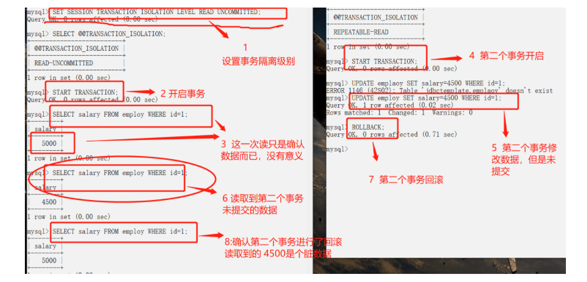
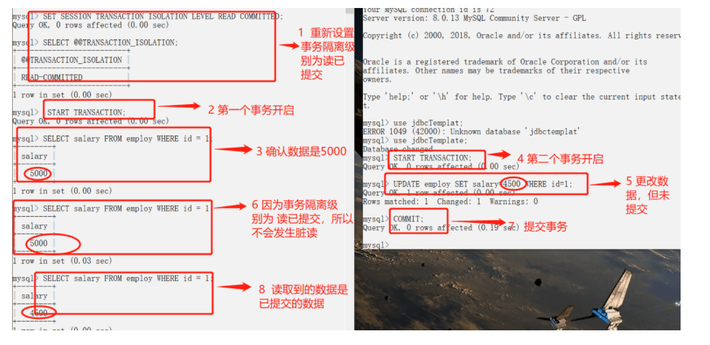
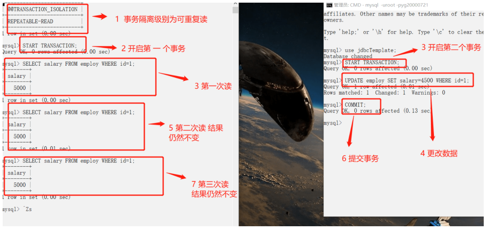
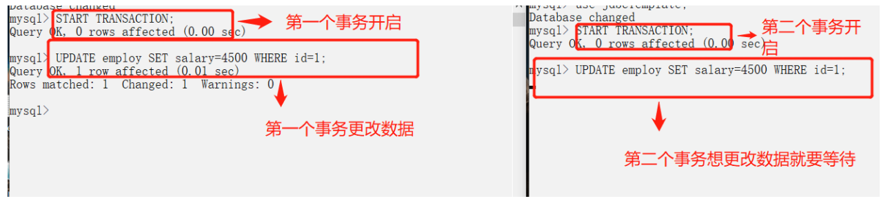

## 事务

### 什么是事务

事务是逻辑上的一组操作，要么都执行，要么都不执行

事务最经典的案例就是转账了，小红给小明转1000块钱，那么小红户头上就要减少1000，小明户头上就要增加1000，万一在两个操作中间银行系统发生奔溃，小红的户头上少了1000块，但是小明户头上并没有增加1000块，这显然是不行的。

所以事务就是要保证这两个操作要么都成功，要么都失败


### 事务的特性

- 原子性（Atomicity）：事务是最小的执行单位，不允许分割，事物的原子性确保动作要么全部完成，要么全部不起作用
- 一致性（consistency）：执行事务前后，数据保持一致，例如在转账场景下，不论转账成功与否，总钱数不能变化
- 隔离性（isolation）：并发执行数据库时，一个用户的事务不被其他事务所干扰，各并发事务之间数据库是独立的
- 持久性（durability）：一个事务被提交之后，他对数据库中数据的改变是持久的，即使数据库发生故障也不应该对其有影响


### 并发事务带来的问题

在典型的应用程序中，多个事务并发执行，经常会操作相同的数据来完成各自的任务（多个用户对统一数据进行操作），并发虽然是必须的，但是可能造成以下问题：

- **脏读（Dirty Read），**当一个事务正在访问数据并且对数据做了修改，但是这个修改还没有被提交到数据库中，这时另一个事务读取并使用了数据库中的数据，因为这个数据是还没有提交的数据，那么另一个事务读到的这个数据是“脏数据”，依据脏数据所做的操作可能是不正确的。**读取到未提交的数据。**
- **丢失修改（Lost to Modify），**指一个事务读取一个数据的时候，另一个事务也读取了这个数据，第一个事务修改了这个数据之后，第二个事务也修改了这个数据，这样第一个事务的修改结果就丢失了，这被称作丢失修改。比如事务1读取了表中的某个数据A=20，事务2也读取了A=20，事务1修改A=A-1，事务2也修改A=A-1，最终结果A=19，事务1的修改被丢失
- **不可重复读（Unrepeatableread），**指在一个事务内多次读取同一个数据，读到的结果是不同的。比如在这个事务还没有结束之前，另一个事务也访问了该数据，并且修改了这个数据的值，那么，在第一个事务中的两次读数据之间，由于第二个事务的修改导致第一个事务两次读取的数据可能不太一样。这就发生了在一个事务内两次读到的数据是不一样的情况，因此称为不可重复读。**一个事务内前后两次读取到的数据结构不一致**
- **幻读（Phantom read），**幻读和不可重复读类似。它发生在一个事务T1读取了几行数据，接着另一个并发事务T2插入了一些数据时，在随后的查询中，第一个事务就会发现多了一些原来不存在的记录，就好像发生了幻觉一样。**一个事务内前后两次查询到的记录数不一致**


> **<font color=red>那么不可重复读和幻读的区别在哪里？</font>**

**不可重复读的重点在于修改记录，幻读的重点在于新增或者删除记录**

- 事务1中的A先生读取自己的工资1000的操作还没有完成，事务2就修改了A先生的工资为2000，导致A先生再次读取自己工资的时候变成2000了，这就是不可重复读（同样的条件，前后两次读取出来的数据结果不一样了）
- 事务1查询工资大于3000的有4人，在这个查询事务结束之前，事务2又往工资表中插入了一个工资为4000的记录，那么事务1再次读取的时候，工资大于3000的就有5人了，这就是幻读（同样的条件，前后两次查询出来的记录数不一样了）


### 事务隔离级别

SQL标准定义了四个隔离级别：

- **READ-UNCOMMITED读取未提交：**最低的隔离级别，允许读取尚未提交的数据变更，会导致脏读、不可重复读以及幻读
- **READ-COMMITED读取已提交：**允许读取并发事务已经提交的数据，可以阻止脏读，但是幻读和不可重复读仍有可能发生
- **REPEATABLE-READ可重复读：**对于同一字段的多次读取结果都是一致的，除非数据是被本身事务所修改的，可以阻止脏读和不可重复读，但是幻读仍有可能发生
- **SERIALIZABLE可串行化：**最高的隔离级别，完全服从ACID的隔离级别，所有事务依次逐个执行，这样事务之间就完全不可能产生干扰，也就是说，该级别可以防止脏读，不可重复读以及幻读

| 隔离级别         | 脏读 | 不可重复读 | 幻影读 |
| ---------------- | ---- | ---------- | ------ |
| READ-UNCOMMITTED | √    | √          | √      |
| READ-COMMITTED   | ×    | √          | √      |
| REPEATABLE-READ  | ×    | ×          | √      |
| SERIALIZABLE     | ×    | ×          | ×      |


MySQL InnoDB存储引擎的默认支持的隔离级别是REPEATED-READ，我们可以通过`SELECT tx_isolation`来查看，在MySQL8.0中该命令改为了`SELECT transaction_isolation`

```mysql
mysql> SELECT @@tx_isolation;
+-----------------+
| @@tx_isolation  |
+-----------------+
| REPEATABLE-READ |
+-----------------+
1 row in set, 1 warning (0.00 sec)
```

> **MySQL InnoDB存储引擎的REPEATED-READ（可重复读）并不保证避免幻读，需要应用使用加锁读来保证，而这个加锁读使用到的机制就是`Next-Key Locks`**


因为<font color=red>隔离级别越低，事务请求的锁越少，</font>所以大部分数据库系统的隔离级别都是 **READ-COMMITTED(读取提交内容)** ，但是你要知道的是 InnoDB 存储引擎默认使用 **REPEATABLE-READ（可重读）** 并不会有任何性能损失。

**InnoDB存储引擎在分布式事务的情况下一般会用到SERIALIZABLE（串行化）隔离级别**

> 分布式事务指的是允许多个独立的事务资源（transactional resources）参与到一个全局的事务中，事务资源通常是关系型数据库系统，但也可以是其他类型的资源，全局事务要求在其中的所有参与的事务要么都提交，要么都回滚，这对于事务原有的ACID又有了提高，另外在使用分布式事务的时候，InnoDB存储引擎的事务隔离级别必须设置为SERIALIZABLE


### 实际情况演示

MySQL命令行的默认配置中事务都是自动提交的，即执行SQL语句后就会马上执行commit操作。

如果要显示地开启一个事务需要使用命令`START TRANSACTION`

我们可以通过下面的命令来设置隔离级别。

```sql
SET [SESSION|GLOBAL] TRANSACTION ISOLATION LEVEL [READ UNCOMMITTED|READ COMMITTED|REPEATABLE READ |SERIALIZABLE]
```

我们再来看一下我们在下面实际操作中使用到的一些并发控制语句:

- `START TARNSACTION` |`BEGIN`：显式地开启一个事务。
- `COMMIT`：提交事务，使得对数据库做的所有修改成为永久性。
- `ROLLBACK`：回滚会结束用户的事务，并撤销正在进行的所有未提交的修改。


**脏读**



**读已提交（避免脏读）**



但是能够发现一个问题，在左边这个事物的执行过程中，虽然避免了脏读，但是却出现了不可重复读，因为一个事务内前后读取同一条记录的结果却不一样。


**可重复读**




**幻读**




>[MySQL设置事务自动提交（开启和关闭） (biancheng.net)](http://c.biancheng.net/view/7291.html)

